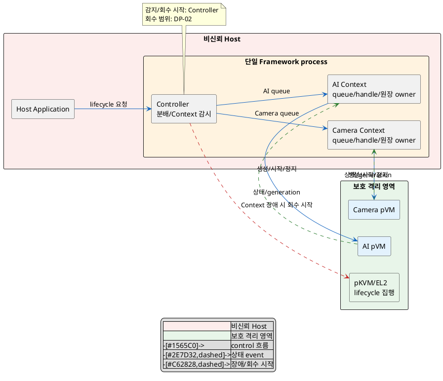
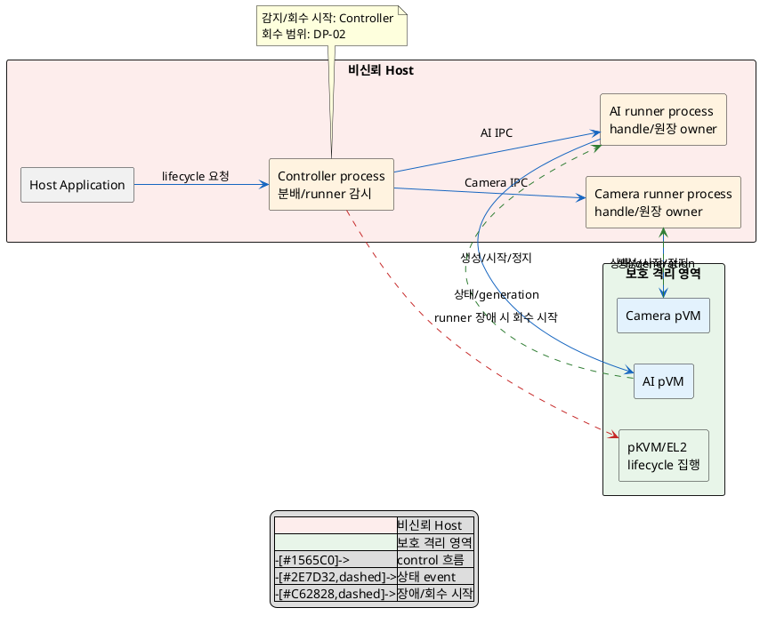

# DP-01. pVM 실행 흐름의 격리 경계

## 1. 상태

평가 중

## 2. 결정 목적

여러 pVM을 동시에 운용할 때 한 pVM의 실행 흐름이 hang 또는 crash해도 다른
pVM의 제어 흐름과 Host 동작이 계속되는 failure containment boundary를 정한다.
이 경계를 추가하면서 cold start 경로에 생기는 실행 단위 생성과 통신 비용도
QAS-PERF-07의 공유 예산 안에서 추적한다.

## 3. 문제 상황

### 3.1 현재 구조와 참여 주체

현재 Reference Scenario에서는 Host Application이 Framework에 pipeline 시작을
요청하고, Framework가 Secure Camera pVM과 Secure AI pVM의 생성·시작·정지·종료를
관리한다. 두 pVM은 독립적으로 동시에 운용되어야 하지만 Host의 공용 관리 흐름은
pVM별 요청, lifecycle handle과 상태를 함께 처리한다.

| 참여 주체 | 현재 역할 | 이 DP에서 보는 장애 |
|---|---|---|
| Host Application | pipeline 시작/종료 요청 | Framework 응답 정지 |
| Host Framework 실행 흐름 | pVM별 요청 분배, lifecycle 상태/handle 관리 | 한 pVM worker의 hang, process crash, 공용 lock/queue 점유 |
| Camera/AI pVM | 격리된 Workload 실행 | pVM crash/hang과 종료 event 발생 |
| pKVM/EL2·kernel interface | pVM 메모리 격리와 lifecycle primitive 제공 | 강제 정지·회수 요청의 최종 실행 |

관리 대상 자원은 pVM별 request queue, lifecycle handle, generation과 자원 원장이다.
각 원장의 수명은 해당 pVM generation에 묶이며, 장애가 나면 신규 요청 차단과 실제
자원 회수가 시작돼야 한다. 누가 recovery unit을 정하고 여러 자원을 회수할지는
후행 DP-02의 결정이며, 이 문서는 그 전에 실행 실패가 전파되는 경계만 정한다.

이 문서에서 `VM별 Context`는 단일 OS process 안에서 pVM별 queue, handle, 상태
원장과 실행 흐름을 논리적으로 나눈 단위다. `VM별 실행 process`는 같은 관리
상태와 실행 흐름을 pVM마다 별도 OS process에 둔 단위다.

### 3.2 신뢰 경계와 인과 사슬

Host kernel까지 비신뢰하고 pKVM/EL2를 trust anchor로 두는 BL-01은 두 선택에
공통이다. Host 내부의 process 경계는 보안 trust boundary가 아니라 가용성을 위한
failure boundary다. 따라서 어느 선택도 Host의 lifecycle 상태를 보안 권한의 최종
근거로 사용할 수 없다.

인과 사슬은 다음과 같다.

1. 한 pVM을 담당하는 실행 흐름이 hang/crash하거나 공용 queue/lock을 점유한다.
2. 실패가 공용 실행 단위로 전파되면 다른 pVM의 lifecycle 요청과 상태 처리가
   함께 중단된다.
3. 정상 pVM 또는 Host가 멈춰 QAS-AVL-01의 장애 전파 0건 조건을 위협한다.
4. 실패 경계를 더 강하게 나누면 실행 단위 생성과 IPC 단계가 늘 수 있어, 시작
   요청부터 첫 frame까지의 QAS-PERF-07 공유 예산을 더 사용한다.
5. 실패 뒤 실행 단위를 다시 연결할 때 오래된 generation 원장을 재사용하면
   잘못된 pVM을 제어하거나 lifecycle transition과 회수 시작이 누락돼
   CUR-FR-01/02의 기능 정확성을 해친다.

### 3.3 baseline과 project-custom 범위

| 구분 | 고정/변경 내용 |
|---|---|
| 공통 baseline | BL-01의 Host 비신뢰/pKVM trust anchor, BL-02의 Linux native 제약, pKVM의 pVM 메모리 격리와 lifecycle primitive |
| project-custom 결정 | 비신뢰 Host Framework에서 pVM별 관리 실행 흐름과 상태 원장을 격리하는 실행 단위 |
| 후행 결정 | DP-02 recovery unit, DP-10 CPU/memory entitlement, A-01 생성 시점/warm pool |
| 제외 | pVM guest OS 제품, pKVM 내부 격리 방식, Workload 검증 위치, 자원별 회수 protocol |

관련 요구와 원문 근거는 다음과 같다.

| 요구/근거 | 이 문제에 주는 조건 |
|---|---|
| CUR-VOS-07, CUR-FR-02 / E-007, E-018 | Camera/AI pVM을 격리된 상태로 독립 동시 운용한다. |
| CUR-VOS-16, QAS-AVL-01 / E-016, E-046 | pVM 장애가 Host/다른 pVM에 전파되어 생기는 다운타임은 0이어야 한다. |
| CUR-FR-01 / E-017 | pVM lifecycle과 자원 할당·회수를 관리해야 한다. |
| QAS-PERF-07 / E-038 | cold start 전체 경로의 p95 2초는 예시치이며 이 DP의 단독 예산이 아니다. |
| E-060 | 공용 실행 흐름에서 hang/crash 전파와 Context/process 경계 차이가 시각적으로 제기됐다. |
| E-067 | 제한 PoC에서 controller daemon과 VM별 runner의 장애 전파·회수 동작을 관찰했으나 운영 대표성은 확인되지 않았다. |

현재 문제의 구조 변수는 **pVM별 관리 실행 흐름과 상태 원장을 격리하는 Host 실행
단위** 하나다. 더 약한 경계는 시작 경로를 줄일 수 있지만 공용 failure domain을
남기고, 더 강한 경계는 crash 격리를 제공할 수 있지만 생성·IPC 비용을 추가한다.

## 4. 결정 질문

> pVM별 관리 실행 흐름과 상태 원장을 단일 Framework process 안의 VM별 Context로 격리할 것인가, 제어 process와 VM별 실행 process로 격리할 것인가?

## 5. 후보 구조

### 5.1 후보 A: 단일 process 안 VM별 Context

- 비신뢰 Host의 단일 Framework process가 공용 controller와 pVM별 Context를
  함께 실행한다.
- controller는 요청을 pVM별 queue로 분배하고 Context heartbeat를 감시한다.
- 각 Context는 한 pVM generation의 lifecycle handle과 상태 원장을 소유한다.
- Context hang에는 해당 queue를 닫고 EL2/kernel에 회수 시작을 요청한다. 회수
  범위와 재시작 단위는 DP-02에 남긴다.
- 공용 process 자체가 crash하면 모든 Context의 제어 흐름이 함께 사라질 수 있다.
  따라서 fatal fault를 pVM별 Context에 가둘 수 있는지가 핵심 확인 항목이다.

### 5.2 후보 B: controller와 VM별 실행 process

- 비신뢰 Host의 controller process와 pVM마다 하나인 runner process를 둔다.
- controller는 요청 routing과 runner 감시만 맡고, 각 runner가 한 pVM
  generation의 lifecycle handle과 상태 원장을 소유한다.
- runner hang/crash는 OS process 상태로 검출하고 해당 runner의 신규 요청을
  차단한 뒤 EL2/kernel에 회수 시작을 요청한다.
- controller와 runner 사이의 IPC, process 생성과 원장 재연결이 cold start 경로에
  추가된다. 회수 범위와 재시작 단위는 DP-02에 남긴다.

두 후보의 변수는 pVM별 관리 상태와 실행 흐름의 **authoritative Host failure
boundary**다. 한 pVM generation의 원장을 단일 Framework process와 별도 runner
process가 동시에 authoritative하게 소유할 수 없으므로 XOR가 성립한다. 후보 A의
Context를 후보 B의 runner 안에서 내부 구현으로 사용하는 것은 가능하지만, 최종
failure boundary는 runner process이므로 제3 구조가 아니라 후보 B의 하위 구현이다.

## 6. 후보별 구조 다이어그램

두 그림은 Host control plane에서 pVM lifecycle event가 흐르는 같은 관점을 쓴다.
파란 실선은 control, 초록 점선은 상태 event, 빨간 점선은 장애 시 회수 시작이다.

### 6.1 후보 A

### 6.2 후보 B

## 7. 후보별 동작 구조

### 7.1 공통 동작과 자원 계약

- lifecycle 권한의 최종 보안 집행은 pKVM/EL2에 남고 Host 상태는 보안 판단의
  근거가 아니다.
- pVM별 원장에는 pVM ID, generation, lifecycle state와 handle만 둔다. buffer,
  TEE session, HW lease, CPU/memory entitlement의 최종 owner/reclaimer는 후행
  DP 또는 기존 C-01/C-02 계약이 정한다.
- 원장은 pVM generation 생성 때 시작하고 종료 확인과 회수 완료 뒤 폐기한다.

### 7.2 후보 A의 정상/실패 흐름

1. controller가 요청을 대상 pVM Context의 전용 queue에 넣는다.
2. Context가 자기 원장만 갱신하고 pKVM/kernel lifecycle interface를 호출한다.
3. pVM state event는 같은 Context로 돌아오며 다른 Context가 소비하지 않는다.
4. Context hang은 heartbeat/queue deadline으로 감지해 그 Context의 신규 요청을
   닫고 회수 event를 낸다.
5. Context 내부 실패가 공용 process crash로 번지면 다른 pVM의 제어도 중단될 수
   있으므로 fatal fault containment는 확인이 필요하다.

### 7.3 후보 B의 정상/실패 흐름

1. controller가 대상 pVM runner에 lifecycle 요청을 IPC로 전달한다.
2. runner가 자기 원장을 갱신하고 pKVM/kernel lifecycle interface를 호출한다.
3. pVM state event는 해당 runner가 받고 결과만 controller에 전달한다.
4. runner hang/crash는 heartbeat와 OS exit event로 감지한다. controller는 실패
   runner의 IPC를 닫고 회수 event를 낸다.
5. 새 runner가 같은 generation을 재사용하지 않도록 새 generation으로 원장을
   연결한다. 실제 재시작 범위는 DP-02가 정한다.

## 8. 품질속성 비교

### 8.1 평가 항목 추적

| 품질속성 | 요구 ID | 문제의 충돌/위험 | 평가 방식 | 출처 |
|---|---|---|---|---|
| 가용성·장애 격리 | CUR-VOS-16, QAS-AVL-01 | 한 실행 흐름의 hang/crash가 정상 pVM과 Host 제어로 전파 | 필수 gate와 co-failure KPI | E-016, E-046, E-060 |
| 시작 성능 | QAS-PERF-07 | process 생성/IPC 또는 공용 흐름 경합이 cold start 공유 예산을 소비 | 공유 예산 gate와 구간 KPI | E-038, `03_DP_목록.md` 4절 |
| lifecycle 정확성 | CUR-FR-01/02 | generation/handle 혼선이 잘못된 pVM 제어 또는 누락 회수를 유발 | 필수 gate | E-017~018 |

### 8.2 필수 gate

판정은 설계 설명만으로 시험 성공을 간주하지 않는다. 두 후보는 같은 image, CPU/
memory 할당, Host 부하와 장애 주입 catalogue에서 검증한다.

| gate | 요구 ID | 판정 기준 | 공통 측정 조건/검증 방법 | 후보 A | 후보 B | 근거 유형/출처 |
|---|---|---|---|---|---|---|
| Host 비신뢰 baseline | BL-01 | Host 원장을 최종 보안 권한으로 사용하지 않고 EL2 격리를 유지 | 권한 판정 위치와 EL2 호출 trace 검토 | 통과 | 통과 | 구조적 추론 / E-010, E-060 |
| Linux native baseline | BL-02 | Android 전용 stack 없이 Linux process/interface로 구성 가능 | build dependency와 runtime package 검사 | 통과 | 통과 | 구조적 추론 / E-003, E-023 |
| pVM 장애 전파 차단 | QAS-AVL-01 | 장애 주입으로 인한 Host/정상 pVM downtime 0 | pVM crash/hang 및 담당 실행 흐름 hang을 각각 주입하고 정상 pVM heartbeat 측정 | 확인 필요 | 확인 필요 | 확인 필요 / E-016, E-046, E-067 |
| lifecycle 상태 정확성 | CUR-FR-01/02 | 잘못된 generation/handle 사용과 중복·누락 lifecycle transition 0건 | 두 pVM 동시 생성/종료와 장애를 교차 주입하고 원장/EL2 state 대조 | 확인 필요 | 확인 필요 | 확인 필요 / E-017~018 |
| 구조 실현 가능성 | G-01A | Context의 bounded isolation 또는 다중 runner의 lifecycle interface가 동작 | 동일 기능 prototype에서 fatal fault, IPC 단절과 재연결 시험 | 확인 필요 | 확인 필요 | 제한 PoC는 후보 B 계열 일부만 관찰 / E-067 |

### 8.3 KPI와 별점 기준

| 품질속성 | KPI | 계산식/단위 | 방향 | 공통 조건 | gate/별점 구간 | 출처 |
|---|---|---|---|---|---|---|
| 가용성 | 정상 pVM co-failure downtime | `D_neighbor = Σ(t_recovered - t_last_healthy)` / ms | 작을수록 유리 | 장애 대상 외 pVM에 고정 주기 heartbeat, 같은 장애 catalogue/부하 | gate 0ms; 별점 구간 `TBD` | QAS-AVL-01 / E-046 |
| 가용성 | 동시 제어 상실률 | `R_cofail = N(정상 pVM 제어 상실) / N(장애 주입)` / % | 작을수록 유리 | 반복 횟수 `TBD`, pVM crash·worker hang·runner/process crash를 분리 기록 | gate 0%; 별점 구간 `TBD` | QAS-AVL-01 / E-046 |
| 시작 성능 | DP-01 구간 지연 | `T_DP01 = t(모든 Context/runner ready) - t(lifecycle 요청 수신)` / ms, p95 | 작을수록 유리 | pVM 미생성, 같은 image/SoC/할당/Host 부하 | PERF-07 전체 2초는 예시 공유 예산; DP-01 배분과 별점 구간 `TBD` | QAS-PERF-07 / E-038, `03_DP_목록.md` 4절 |

필수 gate와 승인된 별점 구간이 없으므로 확정 별점과 잠정 별점을 모두 부여하지
않는다.

| 품질속성/KPI | 후보 A 값 | 후보 A 별점 | 후보 A 구조 근거 | 후보 B 값 | 후보 B 별점 | 후보 B 구조 근거 |
|---|---:|---|---|---:|---|---|
| 가용성 / `D_neighbor`, `R_cofail` | TBD | 미부여 | Context 실패가 공용 process fatal fault로 번질 가능성을 시험해야 한다. | TBD | 미부여 | runner fault는 OS process 경계에 머물 수 있으나 controller 공통 장애를 시험해야 한다. |
| 시작 성능 / `T_DP01` | TBD | 미부여 | 별도 process 생성과 controller-runner IPC가 없다. | TBD | 미부여 | runner 생성, IPC 준비와 generation 연결 단계가 추가된다. |
| lifecycle 정확성 | gate 결과 확인 필요 | 해당 없음 | 한 process의 공용 코드가 원장을 교차 참조하지 않는지 검증해야 한다. | gate 결과 확인 필요 | 해당 없음 | IPC 재시도와 runner 재생성 때 오래된 generation을 거부하는지 검증해야 한다. |

## 9. 핵심 트레이드오프

> 후보 A는 별도 runner 생성과 IPC를 두지 않아 DP-01의 cold start 구간을 줄일 가능성이 있다. 대신 Context 실패가 공용 process fatal fault로 확대되면 정상 pVM의 제어까지 멈춰 가용성 gate를 통과하지 못한다.

> 후보 B는 pVM별 runner를 OS process failure boundary에 두어 한 runner crash의 전파 범위를 줄일 가능성이 있다. 대신 process 생성·IPC·generation 재연결이 cold start 공유 예산을 더 사용한다.

두 문장은 구조적 추론이며 측정 결과가 아니다. QAS-AVL-01 gate와 PERF-07 배분이
확인되기 전에는 어느 후보의 우위도 확정하지 않는다.

lifecycle 정확성은 두 후보 모두 `확인 필요`다. 후보 A는 공용 코드의 원장 교차
참조를, 후보 B는 IPC 재시도와 runner 재생성 시 stale generation 거부를 검증해야
하므로 현재 어느 쪽의 우위도 주장하지 않는다.

## 10. 검증 기준

| 검증 항목 | 공통 환경과 방법 | 판정/기록 기준 | 근거 유형 |
|---|---|---|---|
| pVM fault containment | Camera/AI pVM 동시 운용, 같은 부하에서 한 pVM에 crash/hang 주입 | 정상 pVM과 Host downtime 0, co-failure 0건 | 대표 PoC 필요 |
| 관리 실행 흐름 fault containment | 대상 Context/runner에 hang, fatal exit, IPC 단절을 같은 catalogue로 주입 | 장애 대상 밖 lifecycle 제어 상실 0건; 후보 A fatal fault 격리 가능성 확인 | 대표 PoC 필요 |
| lifecycle 원장 정확성 | 동시 start/stop과 장애 뒤 Host 원장, generation, EL2 실제 state 대조 | 불일치·중복 transition·오래된 handle 사용 0건 | 대표 PoC 필요 |
| 시작 구간 | cold start 요청부터 모든 Context/runner ready까지 timestamp 계측 | `T_DP01` p95 기록; 전체 PERF-07과의 배분은 `TBD` | 대표 PoC 필요 |
| 운영 대표성 | 실제 SoC, 운영 image/부하와 제한 PoC 환경 차이 기록 | 대표성·오차 범위가 없으면 결과를 잠정 근거로만 사용 | 확인 필요 / E-067 |

시험 반복 횟수와 PERF-07의 DP-01 배분값은 승인된 근거가 없어 `TBD`다. PlantUML
블록 수와 시작/종료 표식은 검사했지만 로컬 환경에 PlantUML/Java renderer가 없어
실제 렌더링 결과는 `확인 필요`다.

## 11. 검토 결과

| 쟁점 | Claude 의견 | Codex 의견 | 원문 근거 | 해결 | 남은 확인 |
|---|---|---|---|---|---|
| 결정 질문의 용어 선행 정의 | `Context`와 `process`가 질문에서 처음 등장한다. | 질문의 두 실행 단위를 문제 절에서 먼저 정의해야 한다는 의견에 동의했다. | `DP-RULE.md` 결정 질문 규칙 | 3.1절에 두 용어의 범위와 소유 상태를 정의했다. | 없음 |
| lifecycle 정확성의 품질 추적 | 평가에 추가된 generation/handle 정확성의 실패 인과와 트레이드오프 처리가 문제 절에 없다. | 실행 경계 재연결이 stale 원장을 만들 수 있으므로 이 DP의 직접 위험으로 유지하되 미확정 상태를 숨기지 않아야 한다. | CUR-FR-01/02 / E-017~018; 품질 평가 규칙 9~10절 | 3.2절에 stale generation 인과를, 9절에 후보별 확인 항목과 우위 미확정을 추가했다. | 두 후보의 원장 오류율·재현 시험 결과 |
| 후보쌍과 평가 대칭성 | 정확히 두 후보, XOR/결합 검사, 다이어그램 수, gate/KPI 대칭성, 임계값·별점 유보는 통과했다. | 측정 전 통과나 별점을 만들지 않는 현재 평가를 유지한다. | `DP-RULE.md`, 후보 작성/품질 평가 규칙 | 구조 변경 없음 | 대표 PoC와 공유 예산 배분 |

## 12. 최종 결정
