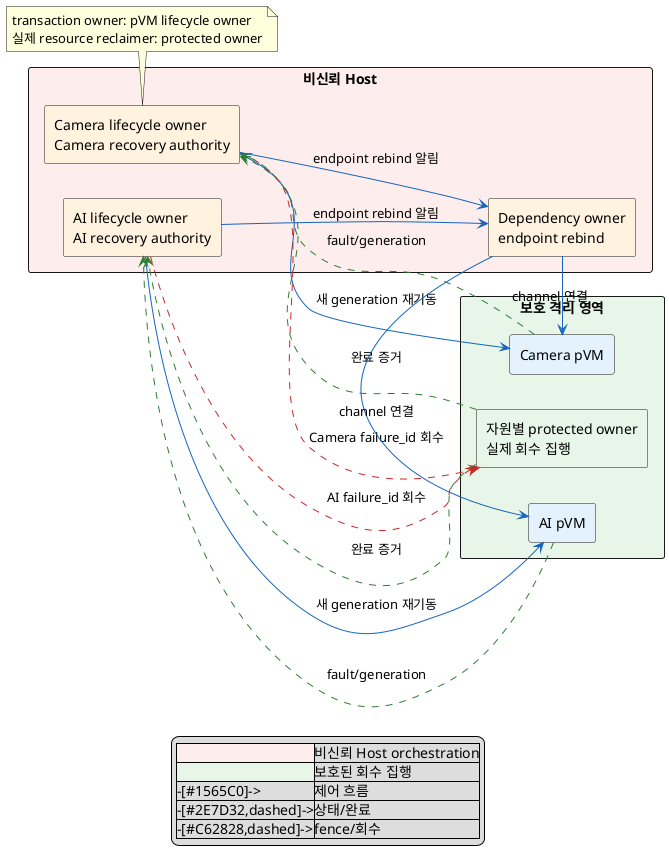
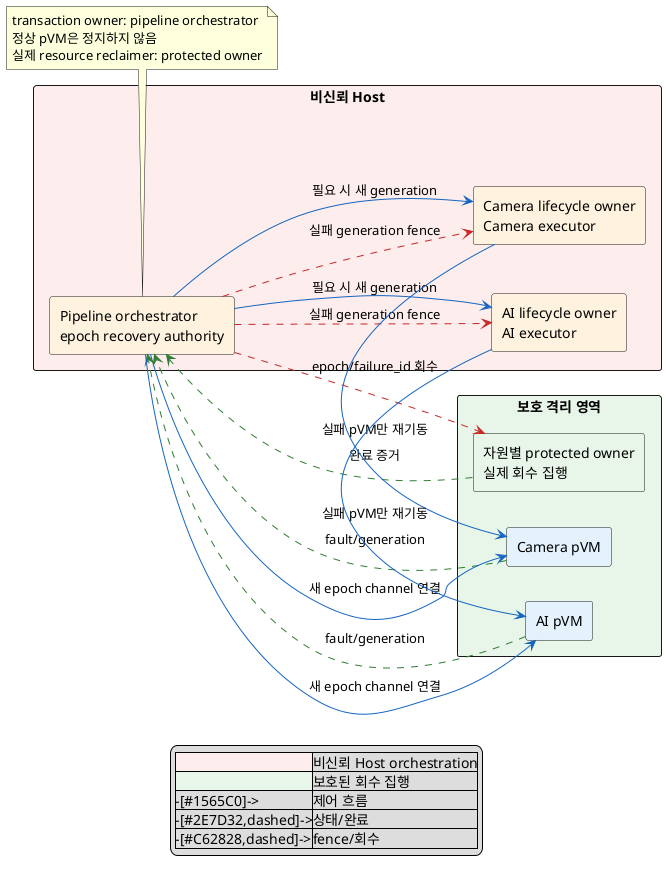

# DP-02. pVM 복구 오케스트레이션 경계

## 1. 상태

평가 중

## 2. 결정 목적

pVM 장애를 검출한 뒤 어떤 주체가 하나의 authoritative recovery transaction을
소유하고, 실패 pVM의 재기동과 의존 channel/resource의 회수·재연결 범위를 정할지
결정한다. 정상 pVM의 가동과 처리 성능을 보존하면서 stale generation과 잔여
자원이 남지 않게 하는 것이 목적이다.

## 3. 문제 상황

### 3.1 현재 구조와 참여 주체

Reference Scenario 13단계는 장애 시 해당 pVM에 영향을 한정하고 자원을 회수하거나
재시작하도록 요구한다. 그러나 pVM, channel, shared buffer, TEE session, HW lease와
CPU/memory entitlement의 수명은 서로 연결되며, 장애 뒤 어느 범위를 하나의 복구
transaction으로 볼지와 누가 완료를 선언할지는 정해지지 않았다.

| 참여 주체 | 이 DP에서의 역할/상태 |
|---|---|
| DP-01의 pVM별 실행 단위 | pVM ID, generation과 crash/hang/exit event를 제공한다. DP-01 후보는 미확정이다. |
| pVM lifecycle owner | 실패 pVM의 신규 요청을 차단하고 stop/delete/recreate primitive를 호출한다. |
| pipeline dependency owner | Camera→AI channel과 Workload dependency graph/epoch를 관리한다. |
| 자원별 protected owner/reclaimer | buffer, TEE session, HW lease, CPU/memory의 실제 권한을 회수한다. 구체 주체는 후행 DP/C-01/C-02가 정한다. |
| 정상 이웃 pVM | 장애 pVM 복구 중에도 실행과 30fps 처리를 계속해야 한다. |

이 문서에서 `recovery transaction`은 한 장애 ID에 대해 신규 요청 차단, 실제 자원
회수 확인, generation 갱신, 재기동과 channel 재연결을 완료 또는 fail-closed로
종료하는 제어 단위다. `recovery unit`은 그 transaction이 일관성을 보장해야 하는
pVM과 dependency 범위다. 실제 자원 권한은 각 protected owner가 유지하며 recovery
주체는 그 결과를 조정하고 완료 조건을 판정한다.

`pipeline epoch`는 Camera→AI channel과 그 의존 pVM 쌍을 하나의 세대로 묶는
단위다. epoch가 바뀌면 이전 세대의 channel과 자원 참조는 무효가 된다.

### 3.2 신뢰 경계와 owner/lifetime

BL-01에 따라 Host recovery state는 보안 권한의 최종 근거가 아니다. pKVM/EL2,
TEE와 자원별 protected owner가 stale generation의 접근을 fail-closed로 거부해야
한다. 반면 어떤 generation과 dependency를 함께 복구할지 정하는 Framework
orchestration은 project-custom 가용성 책임이다.

recovery transaction의 수명은 장애 event에 고유한 `failure_id` 발급 때 시작해,
대상 generation의 권한 회수와 새 generation/channel의 service-ready 확인 또는
격리 종료 때 끝난다. 같은 transaction을 둘 이상의 주체가 authoritative하게
완료 처리하면 중복 재시작이나 오래된 자원 재연결이 생길 수 있다.

### 3.3 원인→실패→품질 영향

1. Camera 또는 AI pVM이 crash/hang하거나 channel·자원 회수 중 일부 단계가
   실패한다.
2. 복구 authority와 unit이 불명확하면 pVM만 재기동되고 오래된 channel/session/
   lease가 남거나, 여러 주체가 같은 generation을 중복 복구한다.
3. 반대로 필요 이상으로 넓은 범위를 중단하면 정상 pVM의 가동과 30fps 처리가
   복구 작업에 간섭받는다.
4. stale 자원과 부분 복구는 QAS-AVL-02의 MTTR, QAS-AVL-04의 누수 0 수렴과
   CUR-FR-01의 lifecycle 정확성을 위협한다.
5. 과도한 복구 반경은 QAS-AVL-01의 정상 pVM downtime 0과 QAS-AVL-05의 이웃
   fps 저하 조건을 위협한다.
6. 장애 유형별 transaction 경로가 정의되지 않으면 QAS-AVL-03의 자동 장애
   catalogue coverage를 입증할 수 없다.

### 3.4 baseline, project-custom 범위와 요구 추적

| 구분 | 고정/변경 내용 |
|---|---|
| 공통 baseline | BL-01 Host 비신뢰와 protected owner의 최종 권한 회수, BL-02 Linux native, BL-04의 현재 2-domain topology |
| 선행 공통 가정 | DP-01이 pVM별 identity/generation과 fault event를 제공한다. 특정 DP-01 후보는 가정하지 않는다. |
| project-custom 결정 | failure별 recovery transaction의 authoritative owner와 일관성 범위 |
| 후행/외부 계약 | C-01 HW 회수, C-02 buffer 회수, DP-08 TEE session 회수, DP-09 HW lease owner, DP-10 CPU/memory 회수 |
| 제외 | watchdog 제품/주기, retry 횟수, warm pool, 자원별 reset/zeroize protocol |

| 요구/근거 | 이 문제에 주는 조건 |
|---|---|
| CUR-FR-01/02 / E-017~018 | 복수 pVM lifecycle과 자원 할당·회수를 독립적으로 관리한다. |
| QAS-AVL-01 / E-046 | 장애 pVM 때문에 Host/정상 pVM이 중단되는 사건은 0이어야 한다. |
| QAS-AVL-02 / E-047 | 검출·회수·재기동의 end-to-end p99 3초와 0.5/1/1.5초 분해는 예시치이며 공유 예산이다. |
| QAS-AVL-03 / E-048 | crash/hang/boot/OOM/channel 장애 catalogue의 자동 주입 coverage 100%를 요구한다. |
| QAS-AVL-04 / E-049 | 잔여 자원 누수는 0이어야 한다. crash-restart 1,000회는 시험 반복 횟수 가정이며 원장/실자원 reconciliation이 필요하다. |
| QAS-AVL-05 / E-050 | 복구 중 정상 pVM fps 저하 5% 이내는 예시치다. |
| RS-13 / E-056 | 장애/종료 때 pVM/HW/channel/resource를 회수하거나 재시작한다. |
| E-067 | 제한 PoC에서 runner 장애 전파, stale runner 정리와 memory/vCPU/FD 회수를 관찰했으나 운영 대표성은 없다. |

현재 구조 변수는 **한 장애의 recovery transaction을 소유하고 일관성을 보장하는
범위** 하나다. 실패 pVM generation에 한정된 authority와 2-domain pipeline
epoch 전체의 authority는 동일 장애에서 동시에 최종 완료를 선언할 수 없다.

## 4. 결정 질문

> 장애 복구 transaction을 실패 pVM의 lifecycle owner가 해당 generation 범위로 책임질 것인가, pipeline orchestrator가 dependency epoch 범위로 책임질 것인가?

## 5. 후보 구조

### 5.1 후보 A: pVM generation별 recovery owner

- 각 pVM lifecycle owner가 자기 pVM generation의 recovery transaction을
  authoritative하게 소유한다.
- 장애 owner는 신규 요청을 차단하고 자원별 protected owner에 `failure_id`와
  generation을 붙여 회수를 요청한다.
- 회수 완료 뒤 실패 pVM만 새 generation으로 재기동하고 dependency owner에
  endpoint rebind를 알린다. 정상 pVM은 실행을 계속한다.
- channel/session/HW/CPU·memory의 실제 회수는 각 protected owner가 수행하며,
  lifecycle owner는 완료 증거를 모아 자기 transaction만 닫는다.
- 여러 자원의 부분 실패를 분산된 응답으로 합쳐야 하므로 stale dependency와
  중복 완료를 막는 reconciliation이 필요하다.

### 5.2 후보 B: pipeline epoch recovery orchestrator

- 하나의 pipeline orchestrator가 2-domain dependency epoch의 recovery
  transaction을 authoritative하게 소유한다.
- 장애를 받으면 이전 epoch의 신규 channel 요청을 fence하고, 자원별 protected
  owner와 실패 pVM lifecycle owner에 같은 `failure_id`로 회수를 지시한다.
- 정상 pVM은 정지·재기동하지 않는다. orchestrator가 이전 endpoint만 무효화하고
  새 pVM generation을 정상 pVM에 새 pipeline epoch로 rebind한다.
- 모든 필수 회수·재기동·rebind 결과가 모이면 새 epoch를 service-ready로
  선언한다. 일부 실패 시 이전 epoch를 fail-closed 상태로 유지한다.
- dependency 전체의 일관성은 한 곳에서 판정하지만 orchestrator 장애나 전역
  fence가 정상 pVM의 pipeline 처리에 간섭할 수 있다.

두 후보는 같은 장애의 최종 완료 authority가 pVM generation owner인지 pipeline
epoch owner인지로 갈린다. 한 `failure_id`에 두 authority가 동시에 완료를 선언할
수 없으므로 XOR가 성립한다. 후보 A에 pipeline 알림을 추가해도 pVM owner가 최종
완료하면 후보 A이고, 후보 B가 pVM별 executor를 사용해도 epoch orchestrator가
최종 완료하면 후보 B이므로 결합 개선안은 별도 제3 구조가 아니다.

## 6. 후보별 구조 다이어그램

두 그림은 장애 event가 회수·재기동·재연결로 이어지는 같은 control-plane 관점을
쓴다. 파란 실선은 제어, 초록 점선은 상태/완료, 빨간 점선은 fence/회수다.

### 6.1 후보 A

### 6.2 후보 B

## 7. 후보별 동작 구조

### 7.1 공통 동작과 실패 원칙

- DP-01은 후보와 무관하게 pVM ID, generation과 fault event를 제공한다고만
  가정한다.
- recovery authority는 실제 자원 접근권을 직접 복구하지 않는다. 각 protected
  owner가 stale generation을 거부하고 회수 완료 증거를 반환한다.
- partial failure, timeout 또는 중복 event에서는 service-ready를 선언하지 않고
  대상 generation/epoch를 fail-closed로 유지한다.
- watchdog 방식, retry/escalation 횟수와 warm pool은 하위 결정이다.

### 7.2 후보 A의 정상/실패 흐름

1. 대상 lifecycle owner가 fault event에 `failure_id`를 부여하고 자기 pVM의 신규
   요청을 막는다.
2. 해당 generation이 보유한 자원 목록을 각 protected owner에 보내 회수를
   요청한다.
3. 회수 완료를 reconciliation한 뒤 실패 pVM만 새 generation으로 재기동한다.
4. dependency owner가 정상 pVM의 기존 실행을 유지한 채 새 endpoint를 연결한다.
5. 회수 응답 일부가 없으면 lifecycle owner가 자기 transaction을 fail-closed로
   유지한다. 다른 pVM transaction과의 교착/순서 역전은 시험이 필요하다.

### 7.3 후보 B의 정상/실패 흐름

1. pipeline orchestrator가 fault event에 `failure_id`와 새 epoch 후보를 부여하고
   이전 epoch의 신규 channel 요청을 fence한다.
2. 실패 pVM lifecycle owner와 자원별 protected owner에 같은 transaction
   context로 회수·재기동을 요청한다.
3. 정상 pVM은 계속 실행하지만 이전 channel endpoint는 사용하지 않는다.
4. 모든 필수 결과를 reconciliation한 뒤 새 pVM generation과 정상 pVM을 새
   epoch channel로 연결하고 service-ready를 선언한다.
5. orchestrator 자체가 실패하면 새 authority가 동일 transaction을 중복 완료하지
   않도록 durable generation/failure_id 대조가 필요하다.

## 8. 품질속성 비교

### 8.1 평가 항목 추적

| 품질속성 | 요구 ID | 문제의 충돌/위험 | 평가 방식 | 출처 |
|---|---|---|---|---|
| 장애 격리 | QAS-AVL-01 | 복구 반경이 정상 pVM 실행까지 중단 | 필수 gate | E-046 |
| 복구성 | QAS-AVL-02 | 분산 대기 또는 넓은 epoch 조정이 MTTR을 증가 | 공유 end-to-end KPI | E-047, `03_DP_목록.md` 4절 |
| 검증 가능성 | QAS-AVL-03 | recovery path 누락으로 장애 catalogue 자동 판정 불가 | coverage gate | E-048 |
| 자원 누수 방지·기능 정확성 | QAS-AVL-04, CUR-FR-01/02 | stale generation, 중복 완료, partial reclaim | 누수/원장 일치 gate | E-017~018, E-049 |
| 이웃 성능 | QAS-AVL-05 | 회수·rebind가 정상 pVM의 30fps 처리에 간섭 | fps 저하 KPI | E-050 |

### 8.2 필수 gate

| gate | 요구 ID | 판정 기준 | 공통 측정 조건/검증 방법 | 후보 A | 후보 B | 근거 유형/출처 |
|---|---|---|---|---|---|---|
| Host 비신뢰/최종 회수 | BL-01 | Host recovery state만으로 접근권을 복원하지 않고 protected owner가 stale generation을 거부 | Host state 변조와 replay 뒤 실제 권한 trace 검사 | 통과 | 통과 | 구조적 추론 / E-010, E-056 |
| 정상 pVM 장애 격리 | QAS-AVL-01 | 장애/복구로 인한 정상 pVM과 Host downtime 0 | 같은 fault catalogue를 한 pVM에 주입하고 정상 pVM heartbeat/uptime 측정 | 확인 필요 | 확인 필요 | 확인 필요 / E-046 |
| 장애 catalogue coverage | QAS-AVL-03 | 정의된 crash/hang/boot/OOM/channel mode 자동 주입·판정률 100% | 동일 catalogue와 oracle로 모든 recovery transition 실행 | 확인 필요 | 확인 필요 | 확인 필요 / E-048 |
| 회수·원장 정확성 | CUR-FR-01/02, QAS-AVL-04 | stale/중복 generation, 미회수 자원과 원장/실자원 불일치 0건 | 반복 횟수 `TBD`; 각 failure_id 종료 뒤 protected owner state 대조 | 확인 필요 | 확인 필요 | 확인 필요 / E-017~018, E-049 |
| 구조 실현 가능성 | G-01B | authority crash/timeout 뒤 transaction 중복 없이 재개 또는 fail-closed | orchestrator/lifecycle owner kill, 응답 소실, 순서 역전 주입 | 확인 필요 | 확인 필요 | 제한 PoC 일부 / E-067 |

### 8.3 KPI와 후보 평가

| 품질속성 | KPI | 계산식/단위 | 방향 | 공통 조건 | gate/별점 구간 | 출처 |
|---|---|---|---|---|---|---|
| 복구성 | end-to-end recovery time | `T_recovery = t(service_ready) - t(fault_detected)` / ms, p99 | 작을수록 유리 | 같은 장애 mode, resource set, Host 부하와 DP-01 구성 | 전체 3초와 0.5/1/1.5초는 예시 공유 예산; DP별 배분·별점 `TBD` | QAS-AVL-02 / E-047, `03_DP_목록.md` 4절 |
| 이웃 성능 | 정상 pVM fps 저하율 | `(fps_baseline - fps_recovery) / fps_baseline × 100` / % | 작을수록 유리 | 정상 pVM 30fps 처리, 동일 장애/부하, 복구 window만 집계 | 5%는 예시치; 별점 구간 `TBD` | QAS-AVL-05 / E-050 |
| 자원 누수 | 종료 transaction당 잔여 자원 | `N_ledger_actual_diff + N_stale_generation` / 건 | 작을수록 유리 | 반복 crash-restart, 동일 resource inventory | gate 0건; 반복 횟수 1,000회는 시험 가정, 별점 없음 | QAS-AVL-04 / E-049 |
| 검증 가능성 | 장애 mode coverage | `N(자동 주입·판정 mode) / N(정의 mode) × 100` / % | 클수록 유리 | 동일 catalogue/oracle | gate 100%; 별점 없음 | QAS-AVL-03 / E-048 |

실측값, 승인된 시간 배분과 별점 구간이 없으므로 별점은 부여하지 않는다.

| 품질속성/KPI | 후보 A 값 | 후보 A 별점 | 후보 A 구조 근거 | 후보 B 값 | 후보 B 별점 | 후보 B 구조 근거 |
|---|---:|---|---|---:|---|---|
| 복구성 / `T_recovery` | TBD | 미부여 | 실패 pVM 범위만 기다리지만 여러 owner 응답을 lifecycle owner가 직접 합친다. | TBD | 미부여 | 한 orchestrator가 dependency 완료를 모으지만 epoch fence/rebind가 추가된다. |
| 이웃 성능 / fps 저하율 | TBD | 미부여 | 정상 pVM 실행과 기존 endpoint를 가능한 한 유지한다. | TBD | 미부여 | 정상 pVM 실행은 유지하지만 epoch fence 동안 channel 처리가 멈출 수 있다. |
| 자원 누수·기능 정확성 | gate 확인 필요 | 해당 없음 | pVM별 transaction 사이의 partial dependency와 중복 완료를 검증해야 한다. | gate 확인 필요 | 해당 없음 | 중앙 transaction 재개 때 stale epoch와 단일 완료를 검증해야 한다. |
| 검증 가능성 | gate 확인 필요 | 해당 없음 | 분산된 pVM별 recovery path를 mode별로 관찰해야 한다. | gate 확인 필요 | 해당 없음 | 중앙 state machine의 모든 mode/transition을 관찰해야 한다. |

## 9. 핵심 트레이드오프

> 후보 A는 실패 pVM generation만 recovery unit으로 삼아 정상 pVM의 실행과 channel을 더 오래 유지할 가능성이 있다. 대신 자원별 partial failure와 dependency rebind 완료를 분산 reconciliation해야 해 stale 자원·중복 완료 위험을 검증해야 한다.

> 후보 B는 pipeline epoch의 회수·재기동·rebind 완료를 한 transaction에서 판정해 dependency 일관성을 추적하기 쉽다. 대신 epoch fence와 중앙 조정이 정상 pVM의 channel 처리에 간섭하고 orchestrator failure domain을 만든다.

장애 catalogue coverage와 lifecycle 정확성은 두 후보 모두 `확인 필요`이며 현재
우위를 주장할 근거가 없다. 실제 QAS-AVL-01/03/04 gate와 공유 MTTR/fps 측정 전에는
어느 후보도 선택할 수 없다.

## 10. 검증 기준

| 검증 항목 | 공통 환경과 방법 | 판정/기록 기준 | 근거 유형 |
|---|---|---|---|
| 장애 전파 | Camera/AI 동시 30fps 중 한 pVM에 crash/hang/boot/OOM/channel 장애를 주입 | 정상 pVM/Host downtime 0, 장애별 trace 저장 | 대표 PoC 필요 |
| transaction 단일성 | owner/orchestrator kill, duplicate event, 회수 응답 소실·역전 주입 | failure_id당 완료 선언 최대 1회, incomplete는 fail-closed | 대표 PoC 필요 |
| MTTR 분해 | fault_detected, fence, owner별 reclaim, recreate, rebind, service_ready timestamp | `T_recovery` p99와 critical path; 3초/구간값은 승인 전 예시치 | 대표 PoC 필요 |
| 누수 soak | 같은 resource inventory로 반복 crash-restart 뒤 ledger/실자원 대조 | 차이·stale generation 0건; 반복 횟수는 `TBD` | 대표 PoC 필요 |
| 이웃 간섭 | 정상 pVM baseline/recovery-window fps를 동일 부하로 비교 | 저하율 기록; 5%는 승인 전 예시치 | 대표 PoC 필요 |
| 운영 대표성 | 실제 SoC/pKVM/TEE/HW와 제한 PoC의 resource/fault 차이 기록 | 대표성·오차 범위 없으면 잠정 근거 | 확인 필요 / E-067 |

PlantUML 블록 수와 시작/종료 표식은 검사하지만 로컬에 renderer가 없으면 실제
렌더링은 `확인 필요`로 기록한다.

## 11. 검토 결과

| 쟁점 | Claude 의견 | Codex 의견 | 원문 근거 | 해결 | 남은 확인 |
|---|---|---|---|---|---|
| `dependency epoch` 용어 | 결정 질문 전에 epoch 의미가 정의되지 않았다. | 질문의 recovery unit을 오해하지 않도록 세대와 무효화 범위를 정의해야 한다. | `DP-RULE.md` 결정 질문 규칙 | 3.1절에 pipeline epoch 정의를 추가했다. | 없음 |
| baseline/QAS 수치 표현 | 2-domain은 BL-04로 명시하고 AVL-04의 0 목표와 1,000회 시험 가정을 분리하는 편이 정확하다. | 원장 표현을 그대로 구분해 반영한다. | BL-04, E-049 | 3.4절 baseline과 요구 표를 수정했다. | 사용자 승인 반복 횟수 |
| 후보/평가 대칭성과 AVL-01 | 두 후보, XOR/결합 검사, authority/reclaimer 분리, 정상 pVM 무중단, PlantUML, gate/KPI 대칭성과 공유 예산 처리가 모두 통과했다. | 측정 전 통과·별점·후보 우위를 만들지 않는 현재 평가를 유지한다. | `DP-RULE.md`, 후보 작성/품질 평가 규칙, QAS-AVL-01~05 | 구조 변경 없이 검토 완료 | 대표 PoC, MTTR 배분, 반복 횟수 승인 |

## 12. 최종 결정
