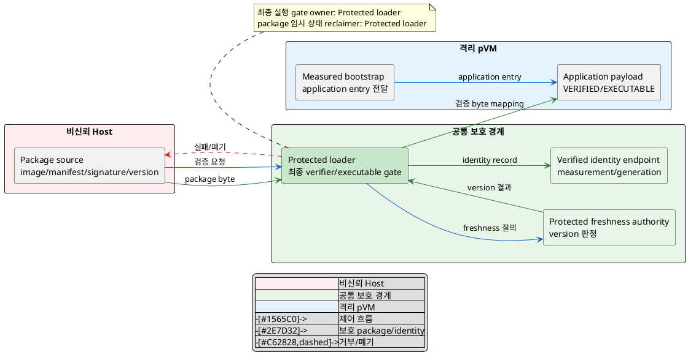
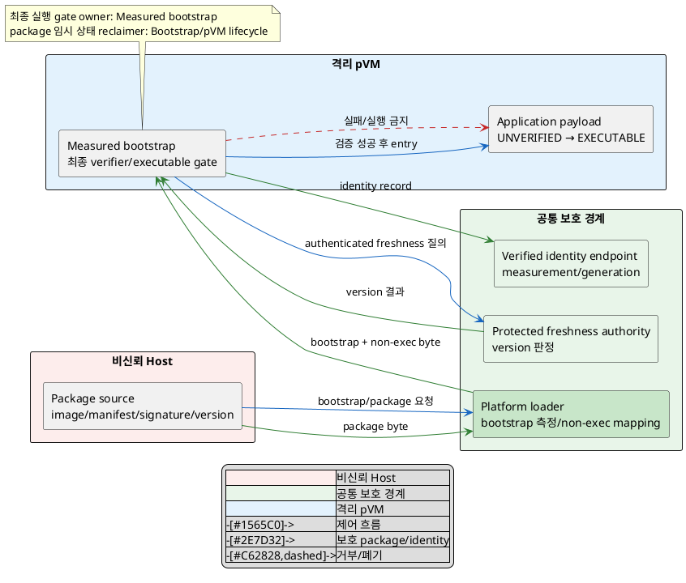

# DP-03. Workload 최종 검증 경계

## 1. 상태

평가 중

## 2. 결정 목적

비신뢰 Host가 전달한 Workload image, manifest, signature와 version을 어느 보호
경계에서 최종 검증하고 `UNVERIFIED`에서 `EXECUTABLE`로 전환할지 결정한다.
변조·rollback package의 실행을 차단하면서 이질 Workload 수용과 cold start 공유
예산을 함께 보존하는 것이 목적이다.

## 3. 문제 상황

### 3.1 현재 구조와 참여 주체

Reference Scenario 3단계는 signature, manifest, version과 integrity 검증이
실패하면 이후 단계를 중단하도록 요구한다. 하지만 Host filesystem과 loading
경로를 장악한 공격자는 package byte, manifest, allowlist와 전달 순서를 함께
바꿀 수 있다. 제한 PoC의 Host SHA-256 allowlist는 단순 변조를 거부했지만 Host
침해와 rollback을 방어하지 못했다.

| 참여 주체/자원 | 현재 역할과 이 DP의 관점 |
|---|---|
| Host package source/loader | package를 저장·전달하지만 신뢰하지 않는다. 검증 결과의 최종 authority가 될 수 없다. |
| platform boot chain·pKVM/EL2 | pVM 보호 경계를 만들고 초기 신뢰 코드를 측정·실행하는 trust anchor다. |
| Workload verifier | signature, manifest binding, hash와 version freshness를 검증하고 최종 실행 gate를 닫거나 연다. 실행 위치가 미정이다. |
| pVM bootstrap | application payload보다 먼저 실행 가능한 최소 초기 코드다. 자체 신뢰가 platform boot chain에 연결돼야 한다. |
| Workload package | image/payload, manifest, signature, version과 signer identity를 묶은 검증 대상이다. |
| verified identity record | 승인된 measurement, signer, version, pVM generation을 묶어 후행 DP-04/07 등이 사용하는 결과다. |

package의 `UNVERIFIED` 수명은 Host에서 수신한 때 시작한다. 검증 성공 뒤에만 같은
byte/generation의 `EXECUTABLE` 상태와 verified identity record를 만들며, 실패·
timeout·generation 변경 시 byte를 실행 불가로 유지하고 결과를 폐기한다.

### 3.2 신뢰 경계와 인과 사슬

BL-01에 따라 Host 검증 결과는 hint일 뿐 최종 근거가 아니다. platform boot chain과
pKVM/EL2가 보호한 경계 밖에서 최종 실행 gate가 열리면 Host가 검증과 loading
사이의 package를 바꾸는 TOCTOU가 가능하다.

인과 사슬은 다음과 같다.

1. 침해된 Host가 image/manifest/signature/version을 변조하거나 과거의 정상 서명
   package로 rollback한다.
2. 최종 verifier가 Host 밖에 없거나 검증 byte와 실행 byte/generation을 결합하지
   않으면 미검증·stale payload가 application entry에 도달한다.
3. QAS-SEC-04의 미검증 image 탑재 0건과 변조 탐지율 100%를 위반하고 Workload
   identity를 입력으로 쓰는 후행 authorization/TEE 경로도 잘못된 subject를 받는다.
4. 보호 verifier가 package format이나 runtime마다 core 변경을 요구하면
   QAS-EXT-01의 Framework core 수정 0 LoC와 QAS-EXT-02의 동일 package/loading
   계약 수용성이 깨진다.
5. 검증·측정·freshness 확인 단계는 cold start에 직렬로 추가되어 QAS-PERF-07의
   공유 시작 예산을 소비한다.

### 3.3 baseline, project-custom 범위와 요구 추적

| 구분 | 고정/변경 내용 |
|---|---|
| 공통 baseline | BL-01 Host 비신뢰와 platform boot chain/pKVM 보호, BL-02 Linux native, 서명·manifest·hash·version을 묶어 검증하고 실패 시 fail-closed |
| 선행 공통 가정 | DP-01이 pVM generation과 실행 단위를 제공한다. 특정 후보는 가정하지 않는다. |
| project-custom 결정 | application payload에 대한 최종 `UNVERIFIED → EXECUTABLE` 전환 authority의 실행 경계 |
| 후보 공통 하위 계약 | signature algorithm, key lifecycle, package schema와 측정 record 형식은 `TBD`이며 두 후보에 동일 적용한다. protected freshness authority의 보안 요구는 공통이지만 접근 경로는 verifier 위치에 따라 달라질 수 있어 후보별로 명시한다. |
| 후행 결정 | DP-04는 verified identity의 resource authorization을, DP-07은 TEE caller identity 전달을 정한다. |
| 제외 | Host 사전 hash 최적화, fleet OTA/A-B slot, guest runtime 제품, package field 세부 형식 |

| 요구/근거 | 이 문제에 주는 조건 |
|---|---|
| CUR-FR-03 / E-019 | signature 검증에 성공한 보안 Workload만 동적으로 탑재한다. |
| QAS-SEC-04 / E-028 | 미검증 image 탑재 0건과 변조 탐지율 100%가 gate다. 원문의 환경 `UC-05`는 UC-03 오기다. |
| QAS-EXT-01 / E-039 | 신규 Workload 수용 시 Framework core 수정 0 LoC가 gate다. |
| QAS-EXT-02 / E-040 | 이질 runtime 3종은 시험 가정이며 동일 package/loading 계약을 검증한다. |
| QAS-PERF-07 / E-038 | cold start p95 2초는 예시치이자 DP-01/03/10 등이 나눠 쓰는 공유 예산이다. |
| RS-03 / E-055 | 검증 실패 시 pVM 생성·탑재 등 이후 단계를 중단한다. |
| E-061 | secure boot chain과 Workload 검증이 별도 신뢰 공백으로 제기됐다. |
| E-068 | 제한 PoC의 Host allowlist는 변조 거부를 관찰했지만 Host 침해·rollback을 방어하지 못했다. |

현재 구조 변수는 **동일한 검증 package byte와 pVM generation을 application
payload 실행 권한으로 바꾸는 최종 보호 경계** 하나다. 중앙 보호 경계에서 pVM에
넣기 전에 gate를 열지, 측정된 pVM bootstrap 경계에서 payload entry 전에 gate를
열지 결정해야 한다.

## 4. 결정 질문

> Workload application payload의 최종 실행 gate를 pVM mapping 전의 공통 protected loader가 책임질 것인가, pVM 안의 measured bootstrap verifier가 payload entry 전에 책임질 것인가?

## 5. 후보 구조

### 5.1 후보 A: 공통 protected loader의 사전 검증

- Host가 package를 공통 protected loader에 전달하면 loader가 application
  payload를 pVM에 executable하게 mapping하기 전에 최종 검증한다.
- loader는 보호 메모리로 고정한 동일 byte에서 signature, manifest binding,
  hash와 version을 검증하고 protected freshness authority에 직접 질의한다.
- 성공한 byte만 대상 pVM generation에 mapping하고 executable 전환과 verified
  identity record 생성을 함께 완료한다.
- 실패, timeout 또는 generation 변경 시 mapping/실행을 거부하고 임시 byte와
  검증 결과를 폐기한다.
- package parser와 verifier가 공통 보호 경계에 있어 결과는 일관되지만, package
  형식·runtime 진화가 protected loader 변경과 검증 부담으로 이어질 수 있다.

### 5.2 후보 B: measured pVM bootstrap의 내부 검증

- platform boot chain은 고정된 최소 bootstrap만 측정해 pVM에서 먼저 실행하고,
  application payload는 `UNVERIFIED`·non-executable 상태로 pVM 보호 메모리에 둔다.
- measured bootstrap이 pVM 안의 동일 byte에서 signature, manifest binding,
  hash와 version을 검증한다.
- bootstrap은 authenticated protected call로 freshness authority에 질의한다.
  이 접근 경로와 identity export ABI는 `TBD`이며 DP-07의 TEE 경로를 선결하지 않는다.
- 성공하면 bootstrap이 해당 payload의 application entry를 열고 verified identity
  record를 보호된 platform endpoint로 내보낸다. 실패하면 payload를 실행하지 않고
  pVM generation을 fail-closed로 종료한다.
- verifier를 package/bootstrap과 함께 진화시킬 수 있지만, 각 pVM의 verifier
  복제와 freshness/identity channel의 성립을 검증해야 한다.

두 후보의 단일 변수는 payload를 `EXECUTABLE`로 바꾸는 최종 authority의 경계다.
같은 pVM generation과 payload에 공통 loader와 guest bootstrap이 동시에 최종
승인을 선언할 수 없으므로 XOR가 성립한다. Host 사전 hash나 두 번째 audit 검증을
추가해도 실제 executable 전환 authority가 공통 loader면 후보 A, bootstrap이면
후보 B다. 따라서 이중 검증은 방어 계층일 뿐 별도 제3 구조가 아니다.

## 6. 후보별 구조 다이어그램

두 그림은 Host package가 검증돼 pVM application entry와 verified identity로
이어지는 같은 왼쪽→오른쪽 관점을 쓴다. 파란 실선은 제어, 초록 실선은 보호된
package/identity, 빨간 점선은 거부·폐기 흐름이다.

### 6.1 후보 A

### 6.2 후보 B

## 7. 후보별 동작 구조

### 7.1 공통 검증 계약

- 검증 대상 byte, manifest, signer, version과 pVM generation을 하나의 transaction
  ID로 결합한다. 검증 뒤 다른 byte나 generation을 실행할 수 없다.
- signature algorithm, key lifecycle, package schema와 identity record 형식은
  후보 공통 `TBD`다. Host가 이 상태의 최종 owner가 될 수 없다.
- freshness authority는 Host rollback과 독립이어야 한다. 저장 기술과 transport는
  이 DP에서 채택하지 않고 후보별 접근 가능성만 gate로 검증한다.
- verified identity는 authenticity/measurement 결과다. 이 identity가 어떤
  resource action을 허용받는지는 DP-04가 정한다.

### 7.2 후보 A의 정상/실패 흐름

1. protected loader가 Host package를 보호 메모리에 고정하고 transaction ID와
   대상 pVM generation을 만든다.
2. 동일 byte의 signature/manifest/hash를 검증하고 freshness authority에서
   version을 확인한다.
3. 성공하면 해당 byte만 pVM에 mapping하고 executable 전환과 identity record를
   원자적으로 결합한다.
4. 검증 실패, timeout, generation mismatch면 mapping/entry를 만들지 않고 임시
   byte와 결과를 폐기한다.
5. loader crash 뒤 incomplete transaction은 새 loader가 executable로 승격하지
   않고 폐기해야 한다.

### 7.3 후보 B의 정상/실패 흐름

1. platform loader가 측정된 bootstrap을 시작하고 package byte를 pVM 보호
   메모리에 non-executable로 둔다.
2. bootstrap이 동일 byte의 signature/manifest/hash를 검증하고 authenticated
   call로 freshness 결과를 받는다.
3. 성공하면 자기 pVM 안에서 payload entry를 열고 transaction/generation에 묶인
   identity record를 platform endpoint로 보낸다.
4. 검증 실패, timeout, identity export 실패면 payload를 실행하지 않고 pVM을
   fail-closed 상태로 종료한다.
5. bootstrap crash나 Host 재전달 뒤에도 오래된 result가 새 generation을 승인하지
   못하도록 platform endpoint가 generation을 대조해야 한다.

## 8. 품질속성 비교

### 8.1 평가 항목 추적

| 품질속성 | 요구 ID | 문제의 충돌/위험 | 평가 방식 | 출처 |
|---|---|---|---|---|
| Workload 무결성·authenticity | QAS-SEC-04, CUR-FR-03 | 변조/rollback/TOCTOU package가 application entry에 도달 | 필수 security gate와 탐지 KPI | E-019, E-028, E-055, E-068 |
| 확장성 | QAS-EXT-01/02 | verifier/parser 변경이 Framework core와 package contract를 runtime별로 바꿈 | core 변경 gate와 runtime coverage KPI | E-039~040 |
| 시작 성능 | QAS-PERF-07 | 검증·freshness·identity 단계가 cold start 직렬 경로를 소비 | 공유 구간 KPI | E-038, `03_DP_목록.md` 4절 |

### 8.2 필수 gate

| gate | 요구 ID | 판정 기준 | 공통 측정 조건/검증 방법 | 후보 A | 후보 B | 근거 유형/출처 |
|---|---|---|---|---|---|---|
| 미검증 payload 실행 차단 | QAS-SEC-04 | 미검증/변조/rollback/TOCTOU image application entry 0건, 변조 탐지율 100% | 동일 package corpus에서 byte/manifest/signature/version/generation을 각각 변조하고 entry/identity trace 검사 | 확인 필요 | 확인 필요 | 확인 필요 / E-028, E-068 |
| Host 비신뢰 | BL-01 | Host allowlist/result 변조로 final gate 또는 identity를 위조할 수 없음 | Host storage/loader/result/replay fault injection | 확인 필요 | 확인 필요 | 구조적 추론+제한 PoC / E-061, E-068 |
| 신규 Workload core 무수정 | QAS-EXT-01 | 표준 계약을 따르는 신규 Workload마다 Framework core 수정 0 LoC | 후보별 core directory를 고정하고 onboarding 전후 CI diff | 확인 필요 | 확인 필요 | 확인 필요 / E-039 |
| platform trust 연결 | G-02 | verifier code, key와 freshness result가 platform boot chain 및 대상 generation에 결합 | measured boot/identity chain 검토와 stale generation replay | 확인 필요 | 확인 필요 | 확인 필요 / E-061 |
| 구조 실현 가능성 | G-02 | A의 verify-before-map 원자성 또는 B의 non-exec bootstrap/freshness/identity 경로가 성립 | 동일 package contract prototype과 crash/timeout 시험 | 확인 필요 | 확인 필요 | 후보 A/B 직접 대표 PoC 없음 / E-068 |

### 8.3 KPI와 후보 평가

| 품질속성 | KPI | 계산식/단위 | 방향 | 공통 조건 | gate/별점 구간 | 출처 |
|---|---|---|---|---|---|---|
| 무결성 | 변조 탐지율 | `N(탐지·거부 변조 package) / N(주입 변조 package) × 100` / % | 클수록 유리 | 동일 mutation corpus와 signer/version 조합 | gate 100%; 별점 없음 | QAS-SEC-04 / E-028 |
| 무결성 | 검증 소요 | `T_verify = t(final gate result) - t(protected byte accepted)` / ms, p99 | 작을수록 유리 | 같은 package size/key/cache/SoC/Host 부하 | 상위 QAS에 수치 경계 없음, 별점 구간 `TBD` | QAS-SEC-04 / E-028 |
| 확장성 | Framework core 변경량 | 신규 Workload onboarding 전후 core diff / LoC | 작을수록 유리 | 동일 표준 package 계약을 따르는 새 Workload | gate 0 LoC; 별점 없음 | QAS-EXT-01 / E-039 |
| 확장성 | 이질 runtime 수용 수 | 계약 변경 없이 실행 gate를 통과한 runtime 종류 / 종 | 클수록 유리 | C native/Python/third-party 후보군, 동일 package contract | 3종은 시험 가정; 별점 구간 `TBD` | QAS-EXT-02 / E-040 |
| 시작 성능 | DP-03 cold-start 구간 | `T_DP03 = t(identity ready) - t(package verification start)` / ms, p95 | 작을수록 유리 | 미생성 pVM, 같은 package/SoC/DP-01 구성 | 전체 2초는 예시 공유 예산; DP-03 배분·별점 `TBD` | QAS-PERF-07 / E-038, `03_DP_목록.md` 4절 |

gate 결과, 측정값과 승인된 별점 구간이 없으므로 별점을 부여하지 않는다.

| 품질속성/KPI | 후보 A 값 | 후보 A 별점 | 후보 A 구조 근거 | 후보 B 값 | 후보 B 별점 | 후보 B 구조 근거 |
|---|---:|---|---|---:|---|---|
| 무결성 / 탐지율·`T_verify` | TBD | 미부여 | mapping 전 한 loader가 byte와 identity를 결합하지만 보호 parser/freshness path를 검증해야 한다. | TBD | 미부여 | pVM 보호 메모리의 동일 byte를 검증하지만 bootstrap 신뢰와 identity export를 검증해야 한다. |
| 확장성 / core LoC·runtime 수 | TBD | 미부여 | 공통 parser/loader가 package 형식 변화의 core 변경 지점이 될 수 있다. | TBD | 미부여 | runtime별 bootstrap을 package와 함께 진화시킬 수 있으나 표준 contract와 verifier 중복을 관리해야 한다. |
| 시작 성능 / `T_DP03` | TBD | 미부여 | pVM mapping 전에 중앙 검증/freshness 단계를 수행한다. | TBD | 미부여 | bootstrap 시작 뒤 검증/freshness/identity export 단계가 application entry 전에 수행된다. |

## 9. 핵심 트레이드오프

> 후보 A는 application byte가 pVM에 들어가기 전에 공통 보호 경계에서 검증·identity 생성을 끝내 TOCTOU 경로를 한 곳에서 관리할 수 있다. 대신 package parser와 runtime 진화 책임이 protected loader에 모여 Framework core 변경·검증 범위가 커질 수 있다.

> 후보 B는 verifier를 measured bootstrap과 함께 진화시켜 공통 protected loader의 package별 변경을 줄일 수 있다. 대신 각 pVM이 freshness authority와 identity endpoint에 도달하는 보호 경로와 bootstrap 복제를 검증해야 하며 application entry 전 단계가 늘 수 있다.

두 후보 모두 SEC-04와 EXT-01 gate가 `확인 필요`다. freshness 접근성과 cold-start
구간을 같은 환경에서 측정하기 전에는 무결성·확장성·성능 우위를 확정하지 않는다.

## 10. 검증 기준

| 검증 항목 | 공통 환경과 방법 | 판정/기록 기준 | 근거 유형 |
|---|---|---|---|
| 변조/rollback/TOCTOU | image/manifest/signature/version/generation mutation corpus를 Host에서 주입 | application entry 0건, identity 발행 0건, 탐지율 100% | 대표 PoC 필요 |
| verifier trust chain | bootstrap/loader/key/freshness result/identity의 measurement chain 검토와 replay | target byte·generation 불일치 승인 0건 | 대표 PoC+구조 검토 필요 |
| freshness 접근 경로 | authority timeout, forged response, stale response, verifier crash 주입 | fail-closed, 오래된 version 승인 0건; transport는 후보별 기록 | 대표 PoC 필요 |
| 신규 Workload | 표준 계약의 신규 package onboarding 전후 core CI diff | core 변경 0 LoC | 대표 통합 시험 필요 |
| 이질 runtime | 같은 package/loading 계약으로 runtime 후보군을 탑재 | 성공 종류 수 기록; 3종은 승인 전 시험 가정 | 대표 통합 시험 필요 |
| 시작 성능 | 같은 package/SoC/cache 조건에서 검증 시작부터 identity ready까지 계측 | `T_verify` p99와 `T_DP03` p95, PERF-07 배분은 `TBD` | 대표 PoC 필요 |
| PoC 대표성 | Host allowlist PoC와 두 보호 verifier 구조의 차이 기록 | E-068만으로 후보 gate/별점 확정 금지 | 제한 PoC / E-068 |

PlantUML 블록 수와 시작/종료 표식은 검사하지만 로컬 환경에 renderer가 없어 실제
렌더링 결과는 `확인 필요`다.

## 11. 검토 결과

| 쟁점 | Claude 의견 | Codex 의견 | 원문 근거 | 해결 | 남은 확인 |
|---|---|---|---|---|---|
| freshness source의 숨은 대칭 가정 | 두 verifier 위치의 freshness 접근성이 다른데 source를 동일 적용한다고 미리 단정했다. | freshness 보안 요구만 공통으로 두고 접근 경로는 후보별 구조·gate로 드러내야 한다. | QAS-SEC-04 / E-028; PLAN 후보 대칭성 규칙 | 3.3절 공통 계약을 분리하고 5~10절에 후보별 접근 경로와 검증을 추가했다. | freshness authority/transport 선정과 대표 PoC |
| secure boot와 DP-04 경계 | platform boot chain baseline과 payload 검증, verified identity와 resource authorization의 분리가 명확하다. | 현재 경계를 유지하고 후행 DP의 결과를 선결하지 않는다. | BL-01, G-02/G-03, `03_DP_목록.md` | 구조 변경 없음 | bootstrap measurement chain 검증 |
| 후보/평가 대칭성과 숨은 의존성 | 두 후보, XOR/결합, TOCTOU 방어, owner/reclaimer, PlantUML, gate/KPI 대칭성과 공유 예산이 통과했고 freshness 경로 차이도 숨기지 않았다. | 측정 전 통과·별점·후보 우위를 만들지 않는 현재 평가를 유지한다. | `DP-RULE.md`, 후보 작성/품질 평가 규칙, QAS-SEC-04/EXT-01/02/PERF-07 | 구조 변경 없이 검토 완료 | protected freshness 경로, identity ABI와 대표 PoC |

## 12. 최종 결정
