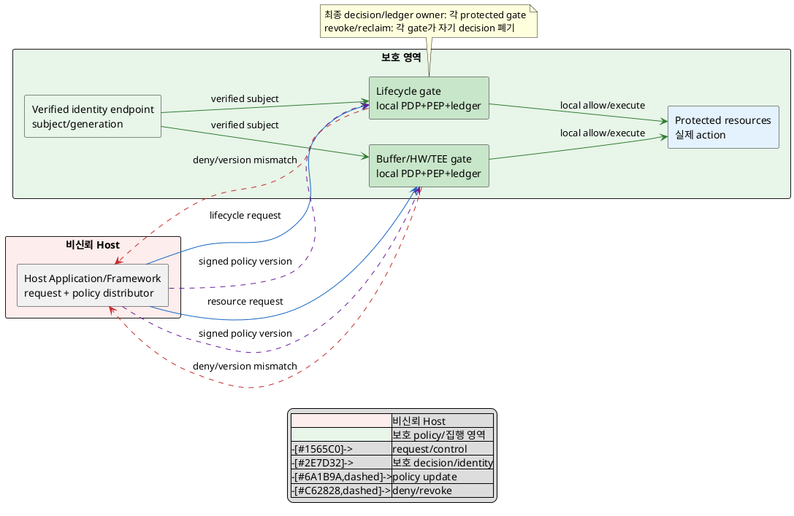
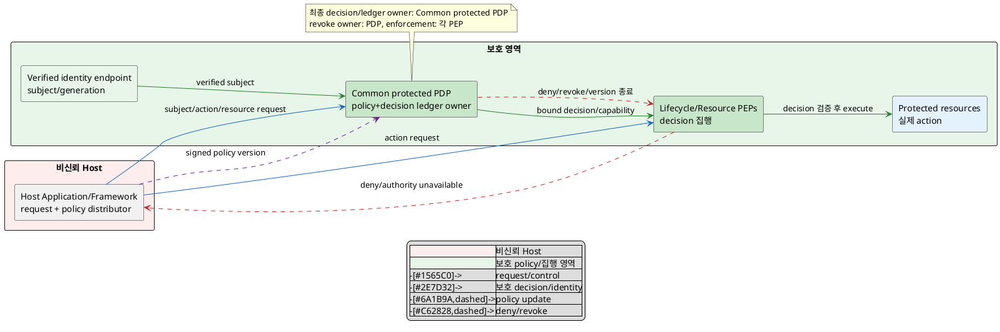

# DP-04. 보호 권한 정책의 소유권

## 1. 상태

평가 중

## 2. 결정 목적

pVM 생성, Workload, channel, HW, TEE와 저장 요청에서 Host 침해에도 유효한 최종
authorization policy와 decision state를 누가 소유할지 정한다. 같은 verified
identity와 policy version에 상충하는 결정을 내리거나 Host가 정책 경로를 우회하지
못하게 하면서 Framework API의 사용 계약을 일관되게 유지하는 것이 목적이다.

## 3. 문제 상황

### 3.1 현재 구조와 참여 주체

Reference Scenario 2단계는 요청 주체, pipeline과 Workload가 정책상 허용되는지
확인하도록 요구하지만 최종 판정 주체는 지정하지 않는다. 이후 단계에는 pVM 생성,
Workload 실행, channel 연결, HW 사용, TEE 호출과 저장 접근이라는 서로 다른
protected gate가 있다. 각 gate가 서로 다른 신뢰 가정과 policy version을 쓰면
침해된 Host가 가장 약한 경로를 선택해 같은 요청을 우회할 수 있다.

| 참여 주체/상태 | 이 DP에서의 역할 |
|---|---|
| Host Application/Framework | 요청을 만들고 전달하지만 비신뢰하며 최종 allow/deny authority가 아니다. |
| DP-03 verified identity endpoint | 검증된 Workload measurement, signer, version과 pVM generation을 제공한다. DP-03 후보는 미확정이다. |
| protected enforcement gate(PEP) | pVM lifecycle, buffer/channel, HW, TEE, 저장 요청을 실제 실행하거나 거부한다. |
| policy decision authority(PDP) | subject, action, resource, context와 policy version으로 최종 allow/deny를 판정한다. 소유 위치가 미정이다. |
| policy/decision ledger | policy version, subject binding, decision/capability ID, expiry와 revoke generation을 보관한다. |

policy version의 수명은 보호된 배포·활성화 때 시작해 다음 version이 원자적으로
활성화될 때 끝난다. decision/capability의 수명은 특정 subject generation과 policy
version에 묶이며 resource 사용 종료, revoke, expiry 또는 generation 변경 때 끝난다.
Host가 이 수명을 연장하거나 오래된 결정을 replay할 수 없어야 한다.

이 ledger는 `subject가 resource class에 action을 요청할 수 있는가`라는 authorization
결과만 기록한다. concrete buffer handle의 owner/receiver/mapping/reclaim 상태 같은
resource lifecycle ledger는 포함하지 않으며 DP-05와 C-02가 별도로 정한다.

### 3.2 신뢰 경계와 인과 사슬

BL-01에 따라 Host kernel과 Host SELinux는 정상 운용의 사전 필터로 쓸 수 있지만
Host 침해 뒤 최종 보안 authority가 될 수 없다. 기존 `docs/DP/DP-C-02.md`는 Host
안의 SELinux 사용을 고정하고 Host Application과 Workload label을 같게 할지
분리할지를 비교한다. 이 DP는 각 protected gate 또는 공통 protected authority가
Host 침해에도 유효한 최종 결정을 소유하는 별도 trust-boundary 축이다.

인과 사슬은 다음과 같다.

1. Host가 pVM/Workload/HW/channel/TEE/저장 요청을 변조·재전송하거나 한 gate를
   우회해 다른 gate로 보낸다.
2. gate별 policy owner, version과 subject binding이 다르면 같은 요청에 allow와
   deny가 동시에 성립하거나 stale decision이 재사용된다.
3. 비인가 요청이 protected resource까지 실행돼 접근권 강제와 상태 무결성이
   깨지거나, 정상 요청이 불일치 판정으로 거부돼 CUR-FR-01~06 흐름이 중단된다.
4. gate마다 서로 다른 policy/API 개념을 노출하면 비보안 개발자가 모든 규칙을
   알아야 해 CUR-VOS-14의 단순한 pVM API 요구도 약해진다.
5. 반대로 하나의 공통 판정 경로에 모든 요청이 의존하면 그 authority의 장애나
   compromise가 전체 protected action에 영향을 줄 수 있다.

### 3.3 baseline, project-custom 범위와 요구 추적

| 구분 | 고정/변경 내용 |
|---|---|
| 공통 baseline | BL-01 Host 비신뢰와 pKVM/TEE trust anchor, protected PEP의 최종 실행, fail-closed, decision의 subject generation/policy version 결합 |
| 선행 공통 가정 | DP-01의 pVM identity/generation과 DP-03의 verified Workload identity를 입력으로 사용하되 특정 후보는 가정하지 않는다. |
| project-custom 결정 | 최종 policy/decision ledger의 authoritative ownership을 protected gate별로 둘지 공통 protected PDP에 둘지 |
| 후행 결정 | DP-05 buffer grant ledger, DP-06 request route, DP-07 TEE path, DP-09 HW lease, DP-10 resource entitlement는 이 DP의 subject/decision contract를 소비한다. |
| 후보 공통 하위 계약 | policy language/schema와 decision tuple은 두 후보에 동일 적용하는 `TBD`다. update 원자성, façade 균일성, cache/expiry 안전 요구는 공통이지만 분산 gate의 동시 활성화·cache 일관성과 공통 PDP의 가용성·장애 반경을 후보별로 검증한다. |
| 제외 | Host SELinux label 세분화, 개별 resource의 ownership, cryptographic token format, policy 관리 UI |

| 요구/근거 | 이 문제에 주는 조건 |
|---|---|
| CUR-FR-01~06 / E-017~022 | lifecycle, Workload, HW, buffer, TEE/저장 요청 전부에 일관된 subject/action/resource 판정이 필요하다. |
| RS-02 / E-054 | pipeline 시작 전에 요청 주체, pipeline과 Workload의 정책 허용 여부를 확인한다. |
| CUR-VOS-14 / E-014 | pVM API는 비보안 전문가도 사용할 만큼 단순해야 한다. |
| E-063 | Host가 metadata를 관찰·변조할 수 있는 control path가 존재한다. |
| E-065 | 신뢰 모델, 정책과 Workload 검증이 별도 공백으로 열거됐다. |
| E-087 | Reference step 2 제외 주장과 Host SELinux 확정 주장이 충돌하며 기존 결론은 신규 후보의 정답이 아니다. |
| UC-01~06 / E-090 | 정상/대안 흐름에서 서명 실패, 권한 실패와 자원 회수가 각 요청 단계에 나타난다. |

현재 구조 변수는 **최종 authorization policy와 decision ledger의 protected
authority ownership** 하나다. 각 protected gate가 자기 resource policy를
authoritative하게 판정할지, 하나의 공통 protected PDP가 모든 gate의 최종
decision을 소유할지 결정해야 한다.

## 4. 결정 질문

> 최종 authorization policy와 decision ledger를 각 protected gate가 분산 소유할 것인가, 하나의 공통 protected policy authority가 소유할 것인가?

## 5. 후보 구조

### 5.1 후보 A: protected gate별 분산 policy ownership

- pVM lifecycle, buffer/channel, HW, TEE와 저장의 각 protected PEP가 자기
  resource용 policy fragment와 decision ledger를 authoritative하게 소유한다.
- 비신뢰 Host distributor가 서명된 같은 policy bundle/version을 배포하되 각
  gate가 독립적으로 검증하고 local staging에서 활성화한다.
- 요청은 해당 gate에서 verified identity, action, resource, context와 local
  policy version을 대조해 최종 allow/deny한다. 다른 service에 동기 질의하지 않는다.
- cross-gate transaction에는 policy version을 전달하고 version이 다르면
  fail-closed한다. rollout 중 N개 gate의 동시 활성화와 rollback reconciliation이
  필요하다.
- 한 gate의 policy engine 장애 반경은 그 resource에 한정할 수 있지만 evaluator,
  ledger, cache/expiry와 façade adapter가 여러 gate에 중복된다.

### 5.2 후보 B: 공통 protected PDP ownership

- 하나의 protected policy authority가 모든 resource의 policy와 decision ledger를
  authoritative하게 소유한다.
- 각 protected PEP는 verified identity와 request tuple을 PDP에 보내거나 PDP가
  발행한 generation/version/expiry-bound decision capability를 검증해 집행한다.
- policy update는 공통 PDP에서 한 version으로 활성화되며 PEP는 이전 version의
  새 요청을 거부한다.
- public Framework façade는 공통 subject/action/resource 계약을 쓰고 resource별
  PEP는 집행 adapter만 가진다.
- 일관성 source는 하나지만 PDP 장애·compromise가 모든 새 protected request의
  fail-closed 거부 또는 잘못된 decision으로 이어질 수 있다. bounded capability
  cache/expiry의 세부값은 `TBD`다.

두 후보의 변수는 최종 allow/deny와 ledger의 authority다. 동일 resource request에
local gate와 공통 PDP가 동시에 최종 override 권한을 가질 수 없으므로 XOR가
성립한다. 후보 B가 PEP에 bounded decision을 cache해도 PEP가 policy를 재판정하지
않으면 후보 B이고, 후보 A가 공통 bundle/façade를 사용해도 gate가 최종 판정하면
후보 A다. 따라서 두 개선은 각 후보의 하위 구현이지 제3 ownership 구조가 아니다.

## 6. 후보별 구조 다이어그램

두 그림은 verified identity가 protected request의 최종 allow/deny와 집행으로
이어지는 같은 관점을 쓴다. 파란 실선은 request/control, 초록 실선은 보호 decision,
보라 점선은 policy update, 빨간 점선은 deny/revoke다.

### 6.1 후보 A

### 6.2 후보 B

## 7. 후보별 동작 구조

### 7.1 공통 policy/decision 계약

- decision tuple은 verified subject/generation, action, resource, context와 policy
  version을 포함하며 누락·불일치·stale version은 fail-closed다.
- Host SELinux/allowlist는 사전 filter일 뿐 protected decision을 override하지
  못한다.
- policy language/schema는 후보 공통 `TBD`다. update activation, cache/expiry와
  façade 구현은 후보별 구조 부담으로 측정한다.
- DP-05/06/07/09/10은 decision contract를 소비하지만 resource ownership과
  request route를 이 문서에서 결정하지 않는다.
- authorization ledger에는 concrete resource lease/ownership state를 넣지 않는다.
  PEP는 allow decision 뒤 후행 DP의 resource-specific gate를 별도로 수행한다.

### 7.2 후보 A의 정상/실패 흐름

1. 각 gate가 signed policy bundle을 검증해 새 version을 staging한다.
2. activation event에서 local version을 전환하고 이전 version의 새 request를
   거부한다. cross-gate version이 다르면 transaction을 시작하지 않는다.
3. request가 오면 gate가 verified identity와 local policy를 직접 평가해
   allow/deny하고 local ledger에 decision 수명을 기록한다.
4. resource 종료/revoke/generation 변경 시 gate가 자기 decision을 폐기한다.
5. rollout 일부 실패나 gate crash 뒤에는 version reconciliation이 끝날 때까지
   불일치 request를 fail-closed로 유지한다.

### 7.3 후보 B의 정상/실패 흐름

1. common PDP가 signed policy bundle을 검증해 단일 active version으로 전환한다.
2. request tuple과 verified identity를 평가해 bound decision/capability를 만들고
   ledger에 수명과 revoke generation을 기록한다.
3. resource PEP가 decision binding/version/expiry를 검증한 뒤 action을 실행한다.
4. resource 종료/revoke/generation 변경 시 PDP가 ledger를 닫고 PEP가 cached
   decision을 폐기한다.
5. PDP timeout/crash 또는 decision 검증 실패 때 PEP는 새 action을 fail-closed로
   거부한다. 기존 capability의 계속 사용 범위와 expiry는 `TBD`다.

## 8. 품질속성 비교

### 8.1 평가 항목 추적

| 품질속성 | 요구/근거 | 문제의 충돌/위험 | 평가 방식 |
|---|---|---|---|
| 접근권 강제·무결성 | CUR-FR-01~06, RS-02 | Host 우회, stale decision과 비인가 protected action | 필수 authorization gate |
| policy 일관성·기능 정확성 | CUR-FR-01~06 | 같은 tuple/version의 상충 decision과 partial update | consistency gate/KPI |
| API 사용성 | CUR-VOS-14 | gate별 policy 개념과 오류 계약이 application에 노출 | façade 복잡도 KPI |
| 요청 경로 가용성 | CUR-FR-01~06 | gate/PDP 장애가 정상 protected action 전체를 차단 | fault-window KPI |

### 8.2 필수 gate

| gate | 요구 ID | 판정 기준 | 공통 측정 조건/검증 방법 | 후보 A | 후보 B | 근거 유형/출처 |
|---|---|---|---|---|---|---|
| Host 우회·비인가 action 차단 | RS-02, CUR-FR-01~06 | Host policy/result 변조, gate bypass, stale/replayed decision으로 실행된 비인가 action 0건 | 동일 subject/action/resource corpus에 Host compromise, generation/version replay 주입 | 확인 필요 | 확인 필요 | 확인 필요 / E-054, E-063, E-090 |
| policy decision 일관성 | CUR-FR-01~06 | 동일 tuple과 active version에서 protected gate 간 상충 allow/deny 0건 | update 전/중/후와 cache expiry 경계에서 모든 gate decision 대조 | 확인 필요 | 확인 필요 | 확인 필요 / E-017~022 |
| fail-closed PEP | BL-01 | authority/version/identity 확인 실패 때 protected action 미실행 | PDP/gate crash, timeout, malformed decision 주입과 resource trace 검사 | 확인 필요 | 확인 필요 | 구조적 추론 / E-010, E-063 |
| 정상 요청 기능 | CUR-FR-01~06 | 유효 identity/policy의 정상 use-case가 resource action까지 완료 | UC-01~06 정상/대안 흐름을 같은 policy corpus로 회귀 시험 | 확인 필요 | 확인 필요 | 확인 필요 / E-090 |
| 구조 실현 가능성 | G-03 | A의 원자적 multi-gate activation 또는 B의 protected PDP/capability revoke가 성립 | update 중 fault, authority restart, replay prototype | 확인 필요 | 확인 필요 | 직접 대표 PoC 없음 / E-065, E-087 |

### 8.3 KPI와 후보 평가

| 품질속성 | KPI | 계산식/단위 | 방향 | 공통 조건 | gate/별점 구간 | 출처 |
|---|---|---|---|---|---|---|
| policy 일관성 | decision 불일치율 | `N(동일 tuple/version의 상충 decision) / N(대조 request) × 100` / % | 작을수록 유리 | 같은 policy/request corpus, update 전·중·후 | gate 0%; 별점 없음 | CUR-FR-01~06, RS-02 / E-017~022, E-054 |
| policy 일관성 | active-version convergence | `t(마지막 PEP가 새 version 적용) - t(activation 시작)` / ms | 작을수록 유리 | 같은 gate 수와 update package, fault 없음/있음 분리 | 상위 경계와 별점 구간 `TBD` | G-03 / E-065, E-087 |
| 요청 경로 가용성 | authority fault 중 정상 요청 성공률 | `N(정상 완료 authorized request) / N(제출 authorized request) × 100` / % | 클수록 유리 | 같은 authority fault/timeout, cache 조건과 request mix | 임계값·별점 구간 `TBD` | CUR-FR-01~06 / E-017~022 |
| API 사용성 | application 노출 policy 개념 수 | public API에서 application이 지정해야 하는 gate별 policy/version/token 필드 수 / 개 | 작을수록 유리 | 같은 UC-01~06 기능과 façade 문서 | 임계값·별점 구간 `TBD` | CUR-VOS-14 / E-014, E-090 |

상위 수치 경계, 실측값과 승인된 별점 구간이 없으므로 별점을 부여하지 않는다.

| 품질속성/KPI | 후보 A 값 | 후보 A 별점 | 후보 A 구조 근거 | 후보 B 값 | 후보 B 별점 | 후보 B 구조 근거 |
|---|---:|---|---|---:|---|---|
| 접근권 강제 | gate 확인 필요 | 해당 없음 | 각 gate의 local policy/ledger와 update skew에서 우회 가능성을 검증해야 한다. | gate 확인 필요 | 해당 없음 | PDP decision binding과 PEP revoke/expiry 우회를 검증해야 한다. |
| policy 일관성 / 불일치·convergence | TBD | 미부여 | N개 gate가 version을 독립 활성화해 reconciliation 구간이 생긴다. | TBD | 미부여 | 단일 PDP가 active version을 소유하지만 PEP의 stale capability를 폐기해야 한다. |
| 요청 경로 가용성 / 성공률 | TBD | 미부여 | 한 gate 장애는 해당 resource 요청에 한정되지만 local fail-closed가 필요하다. | TBD | 미부여 | common PDP 장애가 모든 새 decision을 막을 수 있고 bounded capability 범위는 미정이다. |
| API 사용성 / 노출 개념 수 | TBD | 미부여 | 공통 façade를 둘 수 있으나 gate별 오류/version 차이를 숨기는 adapter가 필요하다. | TBD | 미부여 | 공통 decision tuple/façade를 한 PDP에서 제공하지만 capability lifecycle을 설명해야 한다. |

## 9. 핵심 트레이드오프

> 후보 A는 각 protected gate가 자기 resource의 최종 policy를 소유해 한 policy engine의 장애·compromise 반경을 해당 gate로 제한할 가능성이 있다. 대신 multi-gate update와 cache/version reconciliation이 복잡해져 policy 일관성과 public façade 단순성을 검증해야 한다.

> 후보 B는 공통 PDP가 동일 tuple/version의 결정을 한 곳에서 소유해 policy 일관성과 façade 통일을 단순화할 가능성이 있다. 대신 PDP 장애·compromise가 모든 새 protected request에 영향을 주고 capability revoke/expiry가 추가된다.

두 후보 모두 Host 우회, decision 일관성과 정상 use-case gate가 `확인 필요`다.
update/convergence, authority fault와 API 측정 전에는 접근권 강제·기능 정확성·
사용성·요청 경로 가용성의 우위를 확정하지 않는다.

## 10. 검증 기준

| 검증 항목 | 공통 환경과 방법 | 판정/기록 기준 | 근거 유형 |
|---|---|---|---|
| authorization bypass | UC-01~06 request에 identity/generation/action/resource/version 변조·누락·replay | 비인가 protected action 0건, 모든 deny reason/trace 기록 | 대표 PoC 필요 |
| update 원자성 | 같은 signed policy update를 정상/중단/rollback/authority restart 조건에 적용 | 상충 decision 0건, version convergence와 fail-closed window 계측 | 대표 PoC 필요 |
| authority fault | 각 local gate 또는 common PDP에 crash/hang/timeout을 같은 기간 주입 | resource별 정상 요청 성공률과 fail-closed 범위 기록 | 대표 PoC 필요 |
| capability/cache 수명 | generation 변경, revoke, expiry 전후에 같은 decision replay | stale decision 실행 0건 | 대표 PoC 필요 |
| API façade | 동일 UC-01~06을 application code/API 문서로 구현 | 노출 policy 개념/필드와 gate별 예외 수 기록, 임계값 `TBD` | 구조 검토+사용성 시험 필요 |
| 기존 Host SELinux 관계 | Host label/filter를 우회한 요청을 protected gate까지 전달 | Host 허용이 protected 허용으로 자동 승격되지 않음 | 구조 검토 / E-087 |

PlantUML 블록 수와 시작/종료 표식은 검사하지만 로컬 환경에 renderer가 없어 실제
렌더링 결과는 `확인 필요`다.

## 11. 검토 결과

| 쟁점 | Claude 의견 | Codex 의견 | 원문 근거 | 해결 | 남은 확인 |
|---|---|---|---|---|---|
| update/cache/façade의 숨은 대칭 가정 | 분산 gate와 공통 PDP의 rollout, cache와 façade 난이도가 다른데 공통 `TBD`로 묶였다. | schema만 공통으로 두고 각 ownership 구조의 version skew와 장애 반경을 후보별로 드러내야 한다. | G-03 인과, CUR-VOS-14 / E-014 | 3.3절 공통 계약을 분리하고 5~10절에 update/cache/façade/가용성 평가를 추가했다. | policy schema, update protocol과 cache/expiry 값 |
| SELinux/DP-03과의 중복 | Host label granularity 및 Workload authenticity와 protected authorization ownership은 별도 축이다. | 기존 결론을 승계하지 않고 verified identity를 입력으로만 사용하는 경계를 유지한다. | E-087, DP-C-02; G-02/G-03 | 구조 변경 없음 | 없음 |
| 후보/평가 대칭성과 후행 DP 경계 | 두 후보, XOR/결합, update/cache/façade 비대칭, owner/revoke, PlantUML, gate/KPI가 통과했고 DP-05 lease ledger와도 분리됐다. | 측정 전 통과·별점·후보 우위를 만들지 않는 현재 평가를 유지한다. | `DP-RULE.md`, 후보 작성/품질 평가 규칙, G-03/G-10D | 구조 변경 없이 검토 완료 | 대표 PoC, update protocol, cache/expiry와 API 임계값 |

## 12. 최종 결정
