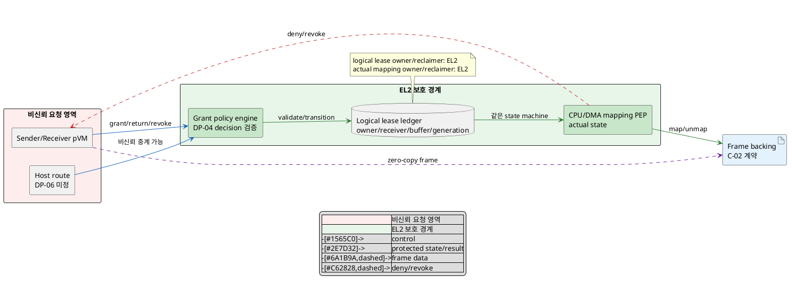
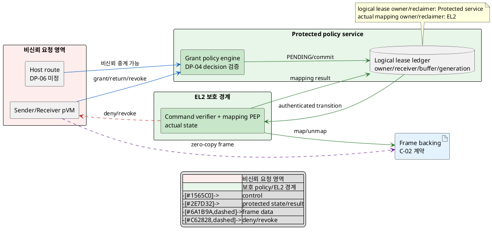

# DP-05. buffer grant policy와 lease ledger 소유권

## 1. 상태

평가 중

## 2. 결정 목적

pVM 간 frame buffer를 grant할 때 concrete buffer handle, owner, receiver,
generation, mapping과 reclaim 상태를 누가 authoritative하게 소유할지 정한다.
침해된 Host와 stale pVM이 lease를 위조하지 못하게 하면서 EL2 TCB와 frame 전달
control-path 비용 사이의 경계를 명확히 하는 것이 목적이다.

## 3. 문제 상황

### 3.1 현재 구조와 참여 주체

CUR-FR-05는 DMA-BUF를 송수신 domain에만 mapping하도록 요구한다. C-02는 backing
ownership과 mapping lifetime을 별도 기존 결정축으로 남긴다. 어느 C-02 후보를
쓰더라도 실제 전달 시점에는 `어떤 buffer generation을 어떤 sender가 어떤
receiver에게 언제까지 grant했는가`를 Host 밖의 원장으로 확인해야 한다.

| 참여 주체/상태 | 이 DP에서의 역할 |
|---|---|
| sender/receiver pVM | buffer grant/return을 요청하고 frame backing을 생산·소비한다. 요청은 검증 대상이다. |
| Host control path | 요청을 중계할 수 있지만 buffer grant나 lease 상태의 authority가 아니다. DP-06이 route를 정한다. |
| DP-04 authorization authority | subject가 buffer transfer action을 요청할 수 있는지 resource-class decision을 제공한다. concrete lease state는 소유하지 않는다. |
| buffer grant policy owner | sender/receiver 관계, buffer generation과 허용 transition을 판정한다. |
| lease ledger owner | concrete buffer/slot, owner, receiver, state, generation과 revoke 완료를 authoritative하게 기록한다. |
| EL2 mapping PEP | CPU Stage-2/DMA mapping을 실제 적용·회수하고 비인가 domain 접근을 차단한다. |

lease의 수명은 유효한 sender가 특정 buffer generation의 grant를 요청한 때 시작해
receiver return, sender revoke, pVM 종료 또는 timeout 뒤 실제 mapping 회수가
확인될 때 끝난다. 논리 ledger와 실제 EL2 mapping 가운데 하나만 전이되면 동시
접근, stale mapping 또는 회수되지 않은 buffer가 남는다.

### 3.2 신뢰 경계와 인과 사슬

BL-01에 따라 Host와 pVM request는 비신뢰 입력이고 EL2의 CPU/DMA mapping PEP는
공통 protected enforcement baseline이다. 그러나 EL2가 grant policy와 논리
lease ledger까지 직접 소유할지, 별도 protected service가 소유하고 EL2는 검증된
명령만 집행할지는 project-custom 결정이다.

인과 사슬은 다음과 같다.

1. 침해된 Host 또는 stale/위장 pVM이 잘못된 receiver, buffer ID, generation이나
   return/revoke 순서의 grant 요청을 보낸다.
2. grant policy/lease ledger가 보호되지 않거나 실제 mapping과 원자적으로
   결합되지 않으면 비인가 receiver mapping, 두 owner의 동시 접근 또는 stale
   generation 재사용이 성립한다.
3. 민감한 frame이 잘못된 domain에 노출돼 QAS-SEC-01의 격리 메모리 노출 0건을
   위반하고 CUR-FR-05의 송수신 domain 한정 mapping이 깨진다.
4. policy parser, receiver 관계와 lease state machine을 EL2 안에 모두 넣으면
   CUR-VOS-10의 작은 pKVM TCB 요구와 QAS-SEC-01의 TCB 규모 관리가 어려워진다.
5. 논리 ledger를 EL2 밖으로 분리하면 authenticated command, replay 차단과
   ledger/mapping commit 왕복이 추가돼 QAS-PERF-02의 frame 전달 공유 예산을
   소비하고 partial commit 복구가 필요하다.

### 3.3 baseline, project-custom 범위와 요구 추적

| 구분 | 고정/변경 내용 |
|---|---|
| 공통 baseline | BL-01 Host 비신뢰, EL2의 CPU/DMA mapping 최종 집행과 fail-closed, lease의 sender/receiver/buffer/generation 결합 |
| 선행 공통 가정 | DP-04가 resource-class authorization decision을 제공한다. 특정 DP-04 후보는 가정하지 않는다. |
| 외부 공통 계약 | C-02가 backing owner와 mapping lifetime을 정한다. 어느 후보든 concrete lease state interface를 제공한다고만 가정한다. |
| project-custom 결정 | concrete buffer grant policy와 logical lease ledger의 authoritative owner를 EL2에 둘지 별도 protected service에 둘지 |
| 후행 결정 | DP-06은 grant authority까지 가는 request route를 정하고 G-05 join/timeout은 후보 선택 뒤 정한다. |
| 후보 공통 하위 계약 | policy schema와 request timeout/retry 수치는 두 후보에 동일 적용하는 `TBD`다. authenticated command 형식과 service runtime은 후보 B에만 필요한 하위 결정이며 후보 A는 EL2 내부 상태 전이로 대체한다. |
| 확인 필요 제약 | 과거 legacy CS-02의 `EL2 수정 불가`와 현재 CUR-CS-02의 GP 준수는 namespace가 충돌한다. 사용자 확인 전 어느 쪽도 baseline으로 고정하지 않고 두 후보의 EL2 수정량을 모두 측정한다. |

| 요구/근거 | 이 문제에 주는 조건 |
|---|---|
| CUR-VOS-10 / E-010 | 기 포팅된 pKVM/EL2의 TCB를 작게 유지한다. |
| CUR-FR-05 / E-021 | buffer는 송수신 domain에만 mapping한다. |
| QAS-SEC-01 / E-025 | Host 침해 시 격리 메모리 노출은 0건이어야 한다. TCB 증가율 5%와 CEM 수치는 가정/외부 근거 확인이 필요하다. |
| QAS-PERF-02 / E-033 | data-path memcpy 0회는 gate다. 전달 p99 5ms, 전환 1ms와 fps/W 10%는 가정치이자 C-02/DP-05/06 공유 예산이다. |
| E-070 | 제한 PoC에서 EL2 lease가 receiver 확인, return과 revoke를 처리했으나 4KiB page와 모의 장치 조건이다. |
| E-082 | EL2와 별도 protected policy service의 grant/ledger ownership이 독립 결정축으로 식별됐다. 기존 후보 평가는 입력으로 쓰지 않는다. |

`EL2 수정 불가`가 유효하다고 확인되면 수정량 0 LoC가 두 후보 공통 feasibility
gate가 된다. 현재 interface만으로 어느 후보가 성립하는지 확인되지 않았으므로
후보 A를 미리 탈락시키거나 legacy 제약을 임의로 폐기하지 않는다.

현재 구조 변수는 **concrete buffer grant policy와 logical lease ledger의 protected
owner** 하나다. EL2가 policy/ledger와 actual mapping을 함께 소유할지, 별도
protected service가 logical authority를 소유하고 EL2는 authenticated transition만
집행할지 결정해야 한다.

## 4. 결정 질문

> concrete buffer grant policy와 logical lease ledger를 EL2가 직접 소유할 것인가, 별도 protected policy service가 소유하고 EL2는 검증된 mapping transition만 집행할 것인가?

## 5. 후보 구조

### 5.1 후보 A: EL2 통합 grant/lease authority

- EL2가 buffer grant policy engine, logical lease ledger와 CPU/DMA mapping PEP를
  한 보호 경계에서 소유한다.
- EL2는 DP-04 authorization decision, sender/receiver identity, buffer ID,
  generation과 현재 mapping state를 한 transaction에서 대조한다.
- 유효하면 logical state와 actual mapping을 같은 EL2 state machine에서 전이하고
  lease ID를 pVM에 반환한다.
- return/revoke/pVM termination 시 ledger와 mapping을 함께 닫고 stale generation
  요청을 거부한다.
- control hop과 split commit은 줄지만 policy parser, endpoint relation과 lease
  state machine이 EL2 TCB 및 수정 범위에 포함된다.

### 5.2 후보 B: protected service의 logical lease authority

- 별도 protected policy service가 grant policy와 logical lease ledger를 소유하고
  EL2는 authenticated transition command를 검증해 actual mapping만 집행한다.
- service는 DP-04 decision과 endpoint/buffer/generation을 검증해 logical lease를
  `PENDING`으로 만들고 unique command generation을 포함한 명령을 발행한다.
- EL2는 발급자, command generation, 현재 mapping과 C-02 invariant를 확인한 뒤
  map/unmap하고 authenticated result를 반환한다. service는 결과 뒤 `ACTIVE` 또는
  `REVOKED`로 commit한다.
- service/EL2 중 한쪽이 중단되면 신규 mapping을 fail-closed로 막고 logical
  ledger와 actual mapping을 generation 기준으로 reconciliation한다.
- EL2 policy code는 줄일 수 있지만 service runtime, command authentication,
  replay 방지, split commit과 추가 protected 왕복이 필요하다.

두 후보의 변수는 concrete grant/lease logical authority다. 같은 lease에 EL2와
service가 동시에 authoritative하게 state를 확정할 수 없으므로 XOR가 성립한다.
후보 B의 EL2가 actual mapping journal을 유지해도 logical grant를 재판정하지 않으면
후보 B이고, 후보 A가 data-driven policy bundle을 써도 EL2가 최종 logical state를
소유하면 후보 A다. 두 보완은 제3 ownership 구조가 아니다.

## 6. 후보별 구조 다이어그램

두 그림은 pVM grant request가 logical lease와 actual CPU/DMA mapping으로 이어지는
같은 관점을 쓴다. 파란 실선은 control, 초록 실선은 protected state/result, 보라
점선은 frame data, 빨간 점선은 revoke/fail-closed다.

### 6.1 후보 A

### 6.2 후보 B

## 7. 후보별 동작 구조

### 7.1 공통 lease 계약

- lease key는 sender/receiver identity와 generation, buffer/slot generation,
  action, DP-04 decision version을 결합한다.
- Host는 request를 중계할 수 있지만 logical state와 actual mapping을 승인·연장할
  수 없다. DP-06 route 선택은 두 후보에 열어 둔다.
- C-02가 정할 backing owner/mapping lifetime을 입력으로만 사용하고 이 DP는 그
  구체 선택을 바꾸지 않는다.
- data path는 zero-copy이며 policy/ledger는 control path에만 있다.

### 7.2 후보 A의 정상/실패 흐름

1. EL2 policy engine이 DP-04 decision, endpoint와 buffer generation을 확인한다.
2. EL2가 lease ledger와 actual CPU/DMA mapping을 한 state-machine transition으로
   `GRANTED`로 바꾼다.
3. receiver는 발급된 lease generation에 해당하는 backing만 접근한다.
4. return/revoke/termination 시 EL2가 mapping을 먼저 닫고 ledger를 `REVOKED`로
   완료한다.
5. EL2 내부 transition이 중단되면 부팅/복구 시 actual mapping을 source로
   fail-closed reconciliation한다. recovery owner와 범위는 DP-02를 따른다.

### 7.3 후보 B의 정상/실패 흐름

1. protected service가 DP-04 decision과 concrete request를 검증하고 ledger를
   `PENDING`으로 전이한다.
2. service가 unique command generation을 가진 authenticated map/unmap 명령을
   EL2에 보낸다.
3. EL2가 발급자/replay/current mapping을 확인해 actual state를 바꾸고 결과를
   service에 반환한다.
4. service가 결과를 reconciliation해 `ACTIVE`/`REVOKED`를 commit한다.
5. service/EL2 crash, result loss 또는 순서 역전 때 신규 access를 막고 command
   generation과 actual mapping을 대조한다. service runtime과 재연결 방식은 `TBD`다.

## 8. 품질속성 비교

### 8.1 평가 항목 추적

| 품질속성 | 요구 ID | 문제의 충돌/위험 | 평가 방식 | 출처 |
|---|---|---|---|---|
| 기밀성·접근권 강제 | QAS-SEC-01, CUR-FR-05 | forged/stale lease가 비인가 mapping과 frame 노출 유발 | 필수 exposure/lease gate | E-021, E-025 |
| TCB 최소화 | CUR-VOS-10, QAS-SEC-01 TCB KPI | grant parser/ledger를 EL2에 넣으면 pKVM TCB 증가 | EL2 code/attack-surface KPI와 제약 gate | E-010, E-025 |
| frame 전달 성능 | QAS-PERF-02 | protected service 왕복과 split commit이 공유 전달 예산 소비 | zero-copy gate와 control 구간 KPI | E-033, `03_DP_목록.md` 4절 |
| lease 상태 정확성 | CUR-FR-05 | logical ledger와 actual mapping 불일치·partial commit | consistency gate | E-021, E-070 |

### 8.2 필수 gate

| gate | 요구 ID | 판정 기준 | 공통 측정 조건/검증 방법 | 후보 A | 후보 B | 근거 유형/출처 |
|---|---|---|---|---|---|---|
| 비인가 mapping/노출 차단 | QAS-SEC-01, CUR-FR-05 | wrong receiver/stale generation/Host replay 뒤 비인가 mapping과 격리 메모리 노출 0건 | 동일 request corpus와 backing/mapping 계약에서 negative test와 canary scan | 확인 필요 | 확인 필요 | 확인 필요 / E-021, E-025, E-070 |
| logical/actual 상태 일치 | CUR-FR-05 | transaction 종료 뒤 ledger와 EL2 mapping 불일치, 중복 owner와 stale lease 0건 | grant/return/revoke 단계별 crash, result loss, replay 주입 후 reconciliation | 확인 필요 | 확인 필요 | 확인 필요 / E-021, E-070 |
| data-path zero-copy | QAS-PERF-02 | frame payload memcpy 0회 | 같은 C-02 backing/mapping 후보와 instrumentation으로 payload copy 추적 | 확인 필요 | 확인 필요 | 구조적 추론+확인 필요 / E-033 |
| EL2 수정 제약 | legacy CS-02 충돌 | 제약이 유효하면 EL2 변경 0 LoC; 유효성 자체와 현 interface 성립을 먼저 확인 | baseline 사용자 확인, 기준 commit 대비 EL2 diff와 interface probe | 확인 필요 | 확인 필요 | 확인 필요 / 근거 원장 C-03 |
| 구조 실현 가능성 | G-10D | A의 atomic ledger/map 전이 또는 B의 authenticated split commit/recovery 성립 | 실제 pKVM interface에서 동일 lease state machine prototype | 확인 필요 | 확인 필요 | A 계열 제한 PoC만 존재 / E-070 |

### 8.3 KPI와 후보 평가

| 품질속성 | KPI | 계산식/단위 | 방향 | 공통 조건 | gate/별점 구간 | 출처 |
|---|---|---|---|---|---|---|
| 기밀성 | 비인가 mapping/노출 사건 | `N(비인가 mapping) + N(canary 노출)` / 건 | 작을수록 유리 | 같은 attack corpus, buffer size/generation과 Host compromise | gate 0건; 별점 없음 | QAS-SEC-01 / E-025 |
| TCB 최소화 | EL2 code 증가율 | `(KLoC_after - KLoC_before) / KLoC_before × 100` / % | 작을수록 유리 | 같은 baseline commit, generated/test code 제외 기준 `TBD` | 5%는 가정치; 별점 구간 `TBD` | QAS-SEC-01 / E-025 |
| frame 전달 성능 | grant control 구간 | `T_grant = t(receiver mapping ready) - t(protected request accepted)` / ms, p99 | 작을수록 유리 | 같은 C-02 후보, buffer/SoC/load, warm/cold 분리 | 전체 전달 5ms/전환 1ms는 가정 공유 예산; DP-05 배분·별점 `TBD` | QAS-PERF-02 / E-033, `03_DP_목록.md` 4절 |
| lease 정확성 | ledger/mapping 차이 | transaction 종료 뒤 `N(logical lease XOR actual mapping)` / 건 | 작을수록 유리 | 같은 failure catalogue와 reconciliation 시점 | gate 0건; 별점 없음 | CUR-FR-05 / E-021, E-070 |

gate 결과, 실측값과 승인된 별점 구간이 없으므로 별점을 부여하지 않는다.

| 품질속성/KPI | 후보 A 값 | 후보 A 별점 | 후보 A 구조 근거 | 후보 B 값 | 후보 B 별점 | 후보 B 구조 근거 |
|---|---:|---|---|---:|---|---|
| 기밀성·lease 정확성 | gate 확인 필요 | 해당 없음 | EL2 한 state machine에서 logical/actual을 전이하지만 parser/state 오류를 검증해야 한다. | gate 확인 필요 | 해당 없음 | authenticated command replay와 split commit 불일치를 검증해야 한다. |
| TCB 최소화 / EL2 증가율 | TBD | 미부여 | policy engine과 full logical ledger가 EL2에 들어간다. | TBD | 미부여 | EL2에는 command verifier/mapping journal이 남고 policy/runtime은 별도 보호 영역에 있다. |
| frame 전달 / `T_grant` | TBD | 미부여 | policy/ledger/mapping이 같은 경계에 있어 inter-service 왕복이 없다. | TBD | 미부여 | service→EL2 command와 result→ledger commit 왕복이 추가된다. |

## 9. 핵심 트레이드오프

> 후보 A는 logical lease와 actual mapping을 한 EL2 state machine에서 전이해 split-commit 불일치를 줄이고 control hop을 줄일 가능성이 있다. 대신 grant policy/parser/ledger가 EL2 TCB와 수정 범위에 포함된다.

> 후보 B는 logical policy/ledger를 별도 protected service로 옮겨 EL2를 command 검증과 mapping 집행에 한정할 가능성이 있다. 대신 authenticated 왕복, replay 방지와 partial commit reconciliation이 추가돼 frame 전달 control 예산을 더 쓸 수 있다.

두 후보 모두 비인가 mapping, ledger/mapping 일치, zero-copy와 EL2 수정 feasibility
gate가 `확인 필요`다. legacy 제약 유효성, TCB diff와 `T_grant` 측정 전에는 기밀성·
TCB 최소화·성능·상태 정확성의 우위를 확정하지 않는다.

## 10. 검증 기준

| 검증 항목 | 공통 환경과 방법 | 판정/기록 기준 | 근거 유형 |
|---|---|---|---|
| forged/stale lease | Host, wrong receiver, stale pVM/buffer generation, duplicate return/revoke 주입 | 비인가 mapping/canary 노출/stale lease 0건 | 대표 PoC 필요 |
| ledger/mapping atomicity | grant·return·revoke 각 전이에서 authority/EL2 crash, result loss·역전 | 종료 transaction의 logical/actual 차이 0건, incomplete fail-closed | 대표 PoC 필요 |
| zero-copy | frame payload의 memcpy/page copy와 mapping transition trace | data-path memcpy 0회 | 대표 PoC 필요 |
| control-path 성능 | 동일 C-02 구조, buffer/SoC/load에서 request accepted→receiver ready 계측 | `T_grant` p99와 전체 PERF-02 공유 예산 기여; 배분 `TBD` | 대표 PoC 필요 |
| EL2 변경량 | 동일 baseline에서 후보별 EL2 source/interface/attack surface diff | KLoC와 interface 수 기록; 5%는 가정, 0 LoC legacy gate는 사용자 확인 필요 | 구조 검토+build 필요 |
| PoC 대표성 | E-070의 4KiB/QEMU 조건과 실제 frame/HW/동시성 차이 기록 | 대표성 없으면 A 계열 관찰도 잠정 근거 | 제한 PoC / E-070 |

PlantUML 블록 수와 시작/종료 표식은 검사하지만 로컬 환경에 renderer가 없어 실제
렌더링 결과는 `확인 필요`다.

## 11. 검토 결과

| 쟁점 | Claude 의견 | Codex 의견 | 원문 근거 | 해결 | 남은 확인 |
|---|---|---|---|---|---|
| legacy EL2 수정 제약 | 과거 `EL2 수정 불가`가 유효하면 후보 A가 원천적으로 막힐 수 있는데 문제 절에 없었다. | current CUR-CS-02와 ID가 충돌하므로 임의 적용/폐기하지 말고 양 후보 공통 확인 gate로 둬야 한다. | 근거 원장 C-03; legacy CS-02 | 3.3절 확인 필요 제약과 8~10절 EL2 diff/gate를 추가했다. | 사용자에게 legacy 제약 유효성 확인 |
| 후보 B 전용 command/runtime | authenticated command와 service runtime을 후보 공통 하위 계약으로 묶어 B의 부담을 숨겼다. | policy schema만 공통으로 두고 command/runtime은 후보 B 구조와 feasibility에 표시해야 한다. | G-10D 인과, PLAN 후보 대칭성 | 3.3절 계약을 분리하고 5.2/7.3/8~10절에 B 전용 경계를 명시했다. | command ABI와 protected runtime 선택 |
| DP-04/C-02/DP-06 경계 | 추상 authorization, backing/mapping lifetime과 request route가 concrete lease ownership과 분리됐다. | 선행/외부/후행 계약을 입력으로만 유지한다. | G-03/G-10A/B/C/D | 구조 변경 없음 | 선행 결정 변경 시 역추적 |
| 후보/평가 대칭성과 split commit | 두 후보, XOR/결합, logical/actual owner 분리, legacy gate, B 전용 command/runtime, PlantUML과 gate/KPI가 모두 통과했다. | 측정 전 통과·별점·후보 우위를 만들지 않는 현재 평가를 유지한다. | `DP-RULE.md`, 후보 작성/품질 평가 규칙, QAS-SEC-01/PERF-02 | 구조 변경 없이 검토 완료 | 대표 PoC, legacy 제약 확인, command ABI와 공유 성능 배분 |

## 12. 최종 결정
