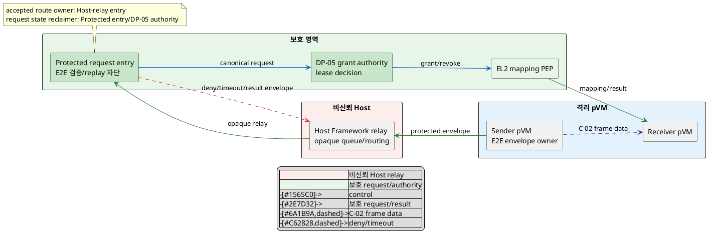
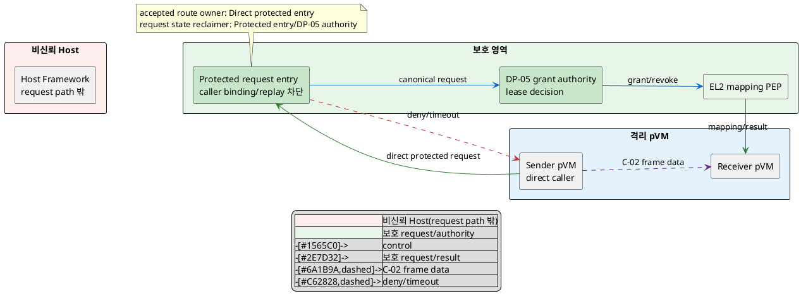

# DP-06. pVM 간 buffer request route

## 1. 상태

평가 중

## 2. 결정 목적

pVM 간 buffer transfer의 control request를 Host Framework가 relay할지, pVM이
protected grant authority에 직접 전달할지 정한다. Host가 request를 관찰·변조·
재전송해도 비인가 mapping이 생기지 않게 하면서 frame 전달 control latency와
protected ABI/TCB 변경 부담을 함께 관리하는 것이 목적이다.

## 3. 문제 상황

### 3.1 현재 구조와 참여 주체

Camera pVM에서 AI pVM으로 frame backing을 전달하려면 sender, receiver, buffer/
slot generation과 requested action을 grant authority에 전달해야 한다. C-02는
payload backing/mapping lifetime을, DP-05는 concrete grant policy와 lease ledger
owner를 정하지만, request가 그 authority에 도달하는 route는 정하지 않는다.

| 참여 주체/상태 | 이 DP에서의 역할 |
|---|---|
| sender pVM | buffer transfer request와 sender-bound nonce/generation을 만든다. |
| Host Framework/relay | 기존 Linux IPC/API로 request를 중계할 수 있지만 내용을 신뢰하지 않는다. |
| protected request entry | caller identity, integrity, freshness와 target authority binding을 검증한다. |
| DP-05 grant authority | concrete grant/lease를 최종 판정한다. 위치는 미확정이며 route의 목적지로만 본다. |
| EL2 mapping PEP | 유효 grant 뒤 actual CPU/DMA mapping을 집행한다. |
| receiver pVM | 승인된 lease와 자기 generation에 해당하는 backing만 받는다. |

request의 수명은 sender가 unique request ID와 generation을 만든 때 시작해 grant/
deny/timeout 결과가 같은 ID로 종결될 때 끝난다. Host relay나 retry가 같은 request를
복제해도 protected entry가 한 번만 처리하고 stale result를 새 generation에 적용하지
않아야 한다.

### 3.2 신뢰 경계와 인과 사슬

BL-01에 따라 Host는 route를 제공해도 authentication/authorization의 최종 주체가
아니다. Host relay 후보는 request payload의 end-to-end integrity, freshness와 필요
시 confidentiality를 protected endpoint까지 유지해야 한다. Direct 후보는 Host
relay를 제거하지만 pVM→protected authority 진입 ABI와 검증 코드를 보호 경계에
추가해야 한다.

인과 사슬은 다음과 같다.

1. 침해된 Host가 sender/receiver/buffer/generation metadata를 관찰·변조·복제하거나
   request/result를 지연·drop한다.
2. protected entry가 종단 binding과 replay를 검증하지 않으면 DP-05의 올바른
   ledger owner가 있어도 위조 request로 비인가 mapping이 만들어진다.
3. frame backing 또는 transfer metadata가 Host에 노출되거나 잘못된 domain이
   접근해 QAS-SEC-01의 격리 메모리 노출 0건과 CUR-FR-05를 위협한다.
4. Host relay의 추가 hop/queue와 cryptographic envelope은 QAS-PERF-02의 frame
   전달 공유 control 예산을 소비한다.
5. direct protected route는 relay를 줄이지만 새 hypercall/FF-A 등 protected ABI와
   parser를 추가할 수 있어 CUR-VOS-10의 작은 pKVM TCB 및 legacy EL2 수정 제약을
   위협한다.
6. 어느 route든 timeout/retry/result binding이 불명확하면 duplicate grant와
   request/lease 수명 불일치가 생겨 CUR-FR-05의 기능 정확성이 깨진다.

### 3.3 baseline, project-custom 범위와 요구 추적

| 구분 | 고정/변경 내용 |
|---|---|
| 공통 baseline | BL-01 Host 비신뢰와 protected final validation, BL-02 Linux native, request의 sender/receiver/buffer/generation/nonce 결합과 fail-closed |
| 선행 공통 가정 | DP-04 authorization contract와 DP-05 grant authority endpoint를 입력으로 사용하되 특정 후보는 가정하지 않는다. |
| 외부 공통 계약 | C-02 backing/mapping lifetime과 data-path zero-copy는 route와 무관하게 유지한다. |
| project-custom 결정 | sender pVM에서 protected grant authority까지 가는 buffer control request의 trust-boundary crossing route |
| 후보 공통 하위 계약 | request schema, freshness nonce, timeout/retry와 error code는 `TBD`이며 두 후보에 같은 의미를 적용한다. Host relay의 end-to-end integrity/confidentiality envelope과 direct route의 protected caller-binding/entry ABI는 후보별로 명시한다. |
| 후행/하위 결정 | G-05 descriptor/backing join과 notification 형식, batching은 route 선택 뒤 정한다. |
| 확인 필요 제약 | legacy `EL2 수정 불가`의 유효성은 근거 원장 C-03과 같이 미확정이며 두 후보의 실제 EL2 변경량을 측정한다. |

| 요구/근거 | 이 문제에 주는 조건 |
|---|---|
| CUR-VOS-09 / E-009 | domain 간 data를 노출 없이 빠르게 전달한다. |
| CUR-VOS-10 / E-010 | pKVM/EL2 TCB를 작게 유지한다. 모든 DP의 공통 trust baseline으로 적용한다. |
| CUR-FR-05 / E-021 | buffer는 송수신 domain에만 mapping한다. |
| QAS-SEC-01 / E-025 | Host 침해 시 격리 메모리 노출 0건이 gate다. TCB 5% 수치는 가정/외부 근거 확인이 필요하다. |
| QAS-PERF-02 / E-033 | data memcpy 0회는 gate다. 전달 5ms/전환 1ms/fps/W 10%는 가정치이며 C-02/DP-05/06 공유 예산이다. |
| E-058 | C-02는 frame backing ownership/mapping lifetime과 회수를 다루며 control request route는 별도다. |
| E-070 | 제한 PoC에서 HVC를 통한 EL2 lease request를 관찰했으나 4KiB/QEMU 조건이다. |
| E-079 | Host relay 여부가 기존 C-02 payload ownership과 다른 축으로 식별됐다. 기존 후보 평가는 입력으로 쓰지 않는다. |

현재 구조 변수는 **buffer control request가 sender pVM에서 protected grant
authority까지 건너는 route** 하나다. Host relay를 종단 보호 envelope의 비신뢰
운반자로 사용할지, pVM이 protected entry ABI를 직접 호출할지 결정해야 한다.

## 4. 결정 질문

> buffer transfer control request를 end-to-end 보호한 채 Host Framework가 relay할 것인가, sender pVM이 protected grant authority의 entry ABI로 직접 전달할 것인가?

## 5. 후보 구조

### 5.1 후보 A: Host-relayed opaque request

- sender pVM이 request tuple과 nonce를 DP-04/05 endpoint에 종단 결합한 integrity
  envelope로 만들고, sensitive metadata는 Host가 평문으로 볼 수 없게 보호한다.
- Host Framework는 opaque request ID와 destination class만으로 envelope을 relay하며
  내용, subject, grant result를 수정하거나 승인하지 못한다.
- protected request entry가 envelope sender/generation/nonce/target을 검증하고
  DP-05 grant authority에 canonical request를 전달한다.
- result도 같은 request/generation에 결합해 sender로 relay한다. Host drop/delay/
  reorder는 timeout·retry로 끝내고 duplicate grant를 만들지 않는다.
- 기존 Linux IPC와 Host façade를 재사용할 수 있지만 종단 key/envelope, relay queue,
  metadata traffic 관찰과 Host DoS 경로가 남는다.

### 5.2 후보 B: pVM direct protected-entry request

- sender pVM이 Host relay 없이 hypercall/FF-A 등 protected entry ABI로 request
  tuple과 nonce를 직접 전달한다. 구체 primitive는 `TBD`다.
- protected entry가 호출 pVM identity/generation을 trap/endpoint context에 결합하고
  target DP-05 grant authority에 canonical request를 전달한다.
- result는 같은 protected path로 sender에 반환되며 Host가 request metadata나
  result를 중계하지 않는다.
- direct path 자체의 보호가 confidentiality/integrity를 제공하므로 Host-relay용
  application envelope은 필수로 가정하지 않는다. authority가 다른 보호 영역이면
  내부 protected-hop 인증은 별도 feasibility 항목이다.
- relay hop은 줄지만 protected ABI, parser, routing과 compatibility code가 EL2/
  protected TCB와 이식 범위에 추가될 수 있다.

배포된 endpoint generation은 grant request의 accepted route를 정확히 하나만
등록한다. Host relay와 direct entry를 동시에 authoritative request ingress로 열면
같은 request의 이중 처리와 attack surface가 생기므로 XOR invariant를 위반한다.
Host가 notification만 전달하거나 direct path가 Host에 health signal을 보내는 것은
grant request route를 바꾸지 않는다. 두 ingress를 모두 구현해도 한 시점에 하나만
활성화하고 다른 route request를 protected entry가 거부해야 하므로 제3 결합 개선안이
되지 않는다.

## 6. 후보별 구조 다이어그램

두 그림은 sender request가 protected entry와 DP-05 authority를 거쳐 receiver
mapping으로 이어지는 같은 관점을 쓴다. 파란 실선은 control, 초록 실선은 보호된
request/result, 보라 점선은 C-02 frame data, 빨간 점선은 deny/timeout이다.

### 6.1 후보 A

### 6.2 후보 B

## 7. 후보별 동작 구조

### 7.1 공통 request 계약

- canonical tuple은 sender/receiver identity와 generation, buffer/slot generation,
  action, nonce, target authority와 DP-04 decision version을 포함한다.
- protected entry가 accepted route ID와 request ID를 소유하고 duplicate/stale
  request를 거부한다. grant/lease state owner는 DP-05다.
- timeout 뒤 결과가 늦게 와도 request generation이 닫혔으면 실행하지 않는다.
- frame payload는 C-02 data path로만 이동하며 control route가 복사하지 않는다.

### 7.2 후보 A의 정상/실패 흐름

1. sender가 request를 E2E integrity/confidentiality envelope로 만들고 Host relay에
   보낸다.
2. Host는 opaque ID로 route하며 protected entry가 sender/generation/nonce/
   target과 envelope을 검증한다.
3. DP-05 authority 결과를 request ID에 결합해 역방향 envelope로 반환한다.
4. Host reorder/duplicate는 entry replay table이 거부하고 drop/delay는 sender
   timeout 뒤 request를 닫는다.
5. relay restart 뒤에도 Host local queue를 authority state로 사용하지 않으며
   protected entry/DP-05가 incomplete request와 lease를 정리한다.

### 7.3 후보 B의 정상/실패 흐름

1. sender가 direct protected entry ABI로 tuple과 nonce를 호출한다.
2. entry가 trap/endpoint caller identity와 payload generation을 결합해 검증한다.
3. DP-05 authority 결과를 같은 protected call context로 반환한다.
4. entry timeout/restart 또는 duplicate call에서는 request ID/generation을 확인해
   한 번만 처리하고 불완전 상태를 fail-closed로 닫는다.
5. protected ABI가 지원하지 않거나 authority가 다른 보호 영역에 있을 때 필요한
   internal hop은 별도 측정하고 Host relay로 자동 fallback하지 않는다.

## 8. 품질속성 비교

### 8.1 평가 항목 추적

| 품질속성 | 요구 ID | 문제의 충돌/위험 | 평가 방식 | 출처 |
|---|---|---|---|---|
| 기밀성·접근권 강제 | QAS-SEC-01, CUR-FR-05 | Host metadata 변조/replay로 비인가 mapping·frame 노출 | security gate와 Host-visible metadata KPI | E-021, E-025, E-070 |
| frame 전달 성능 | QAS-PERF-02 | relay/envelope 또는 protected ABI가 control 공유 예산 소비 | zero-copy gate와 route 구간 KPI | E-033, `03_DP_목록.md` 4절 |
| TCB 최소화 | CUR-VOS-10, QAS-SEC-01 TCB KPI | direct entry parser/routing이 protected TCB에 추가 | EL2/protected code KPI와 legacy gate | E-010, E-025 |
| request 기능 정확성 | CUR-FR-05 | duplicate/result mismatch/timeout 뒤 stale grant | exactly-once/replay gate | E-021, E-079 |

### 8.2 필수 gate

| gate | 요구 ID | 판정 기준 | 공통 측정 조건/검증 방법 | 후보 A | 후보 B | 근거 유형/출처 |
|---|---|---|---|---|---|---|
| Host 변조·replay 차단 | QAS-SEC-01, CUR-FR-05 | Host compromise와 stale request/result 뒤 비인가 mapping·frame 노출 0건 | 같은 request corpus에서 field mutation, replay, reorder, drop, forged result 주입 | 확인 필요 | 확인 필요 | 확인 필요 / E-021, E-025, E-070 |
| request 단일 처리 | CUR-FR-05 | request ID/generation당 grant state transition 최대 1회, stale result 실행 0건 | timeout/retry와 entry/relay restart를 같은 sequence로 주입 | 확인 필요 | 확인 필요 | 확인 필요 / E-021, E-079 |
| data-path zero-copy | QAS-PERF-02 | frame payload memcpy 0회 | 같은 C-02/DP-05 구성에서 payload copy trace | 확인 필요 | 확인 필요 | 확인 필요 / E-033 |
| legacy EL2 수정 제약 | 근거 원장 C-03 | 유효하면 EL2 변경 0 LoC; 유효성과 현 interface 성립 확인 | 사용자 baseline 확인과 후보별 EL2/protected diff | 확인 필요 | 확인 필요 | 확인 필요 |
| 구조 실현 가능성 | G-10A | A의 E2E relay 또는 B의 direct caller binding/authority hop이 성립 | 같은 tuple/security semantics prototype과 negative test | 확인 필요 | 확인 필요 | B 계열 HVC 제한 PoC만 존재 / E-070 |

### 8.3 KPI와 후보 평가

| 품질속성 | KPI | 계산식/단위 | 방향 | 공통 조건 | gate/별점 구간 | 출처 |
|---|---|---|---|---|---|---|
| 기밀성 | Host-visible sensitive request field | 분류된 sensitive field 중 Host plaintext 관찰 가능 field 수 / 개 | 작을수록 유리 | 같은 request schema와 trace capture, sensitive 분류 `TBD` | 임계값·별점 구간 `TBD` | G-10A / E-063, E-079 |
| frame 전달 성능 | request route 구간 | `T_route = t(protected entry accepted) - t(sender submit)` / ms, p99 | 작을수록 유리 | 같은 tuple/SoC/load/DP-05 authority, warm/cold 분리 | 전체 5ms/전환 1ms는 가정 공유 예산; DP-06 배분·별점 `TBD` | QAS-PERF-02 / E-033, `03_DP_목록.md` 4절 |
| TCB 최소화 | protected/EL2 code 증가율 | 후보 route로 추가된 parser/routing/crypto code의 KLoC 증가율 / % | 작을수록 유리 | 같은 baseline, generated/test code 제외 기준 `TBD` | 5%는 가정치; 별점 구간 `TBD` | QAS-SEC-01 / E-025 |
| request 정확성 | 중복/stale grant 사건 | `N(duplicate transition) + N(stale result 실행)` / 건 | 작을수록 유리 | 동일 timeout/retry/restart fault catalogue | gate 0건; 별점 없음 | CUR-FR-05 / E-021 |

gate 결과, 실측값과 승인된 별점 구간이 없으므로 별점을 부여하지 않는다.

| 품질속성/KPI | 후보 A 값 | 후보 A 별점 | 후보 A 구조 근거 | 후보 B 값 | 후보 B 별점 | 후보 B 구조 근거 |
|---|---:|---|---|---:|---|---|
| 기밀성·request 정확성 | gate 확인 필요 | 해당 없음 | envelope/replay table이 Host mutation과 duplicate를 막는지 검증해야 한다. | gate 확인 필요 | 해당 없음 | protected caller binding과 entry restart의 exactly-once를 검증해야 한다. |
| frame 전달 / `T_route` | TBD | 미부여 | Host IPC queue와 envelope 처리 hop이 추가된다. | TBD | 미부여 | Host relay는 없지만 protected entry와 authority internal hop 비용이 있다. |
| TCB 최소화 / code 증가율 | TBD | 미부여 | protected endpoint에 envelope verifier가 필요하지만 기존 Host IPC adapter를 재사용한다. | TBD | 미부여 | direct entry ABI/parser/routing이 EL2 또는 protected platform code에 추가된다. |

## 9. 핵심 트레이드오프

> 후보 A는 기존 Linux IPC와 Host façade를 재사용해 새 protected entry ABI를 줄일 가능성이 있다. 대신 E2E envelope, relay queue와 Host metadata traffic/DoS 경로가 남아 control latency와 request 보호 복잡성이 늘어난다.

> 후보 B는 Host relay에서 request metadata와 queue hop을 제거해 control path를 줄일 가능성이 있다. 대신 direct caller binding, protected routing ABI와 parser가 EL2/protected TCB 및 이식 범위에 추가된다.

두 후보 모두 Host mutation/replay, exactly-once, zero-copy와 legacy feasibility gate가
`확인 필요`다. sensitive metadata 분류, `T_route`, code diff와 protected internal
hop 측정 전에는 기밀성·성능·TCB 최소화·기능 정확성의 우위를 확정하지 않는다.

## 10. 검증 기준

| 검증 항목 | 공통 환경과 방법 | 판정/기록 기준 | 근거 유형 |
|---|---|---|---|
| Host attack | field mutation, plaintext capture, replay/reorder/drop/delay/forged result 주입 | 비인가 mapping/노출 0건, sensitive plaintext field 수 기록 | 대표 PoC 필요 |
| direct-entry attack | caller ID/generation/target 변조와 stale protected call replay | 비인가 mapping과 stale result 실행 0건 | 대표 PoC 필요 |
| exactly-once | timeout/retry, relay/entry/authority restart를 단계별 주입 | request generation당 transition 최대 1회 | 대표 PoC 필요 |
| route latency | sender submit, protected entry accepted, authority result timestamp | `T_route` p99와 PERF-02 공유 예산 기여, 배분 `TBD` | 대표 PoC 필요 |
| zero-copy | control route와 C-02 frame payload의 copy trace 분리 | frame payload memcpy 0회 | 대표 PoC 필요 |
| protected code/ABI | 같은 baseline에서 crypto verifier 또는 direct ABI/parser/routing diff | KLoC/interface 수와 legacy 0-LoC gate 영향 기록 | 구조 검토+build 필요 |
| PoC 대표성 | E-070 HVC/4KiB/QEMU와 실제 frame/rate/SoC 차이 | 대표성 없으면 direct 관찰을 잠정 근거로만 사용 | 제한 PoC / E-070 |

PlantUML 블록 수와 시작/종료 표식은 검사하지만 로컬 환경에 renderer가 없어 실제
렌더링 결과는 `확인 필요`다.

## 11. 검토 결과

| 쟁점 | Claude 의견 | Codex 의견 | 원문 근거 | 해결 | 남은 확인 |
|---|---|---|---|---|---|
| nonce와 crypto의 후보별 필요성 | freshness nonce는 공통이지만 Host가 없는 direct route에는 relay용 암호화가 필수라고 단정할 수 없다. | 같은 security semantics를 유지하되 nonce는 공통, envelope와 caller-binding을 후보별 메커니즘으로 분리해야 한다. | G-10A 인과, QAS-SEC-01 | 3.3절 계약과 5~7절에서 relay envelope/direct protected binding을 분리했다. | sensitive metadata 분류와 crypto/ABI 선정 |
| 선행·외부 결정과 legacy 제약 | DP-04/05/C-02가 route와 분리됐고 legacy EL2 제약도 대칭 확인 상태다. | endpoint와 data contract를 입력으로만 유지한다. | G-10A/B/C/D, 근거 원장 C-03 | 구조 변경 없음 | 선행 결정 변경 시 역추적 |
| 후보/평가 대칭성과 route XOR | 두 후보, 배포 generation별 XOR/결합, relay/direct 보호, data/control 방향, PlantUML과 gate/KPI가 모두 통과했다. | 측정 전 통과·별점·후보 우위를 만들지 않는 현재 평가를 유지한다. | `DP-RULE.md`, 후보 작성/품질 평가 규칙, QAS-SEC-01/PERF-02 | 구조 변경 없이 검토 완료 | 대표 PoC, sensitive metadata 분류, ABI와 공유 성능 배분 |

## 12. 최종 결정
