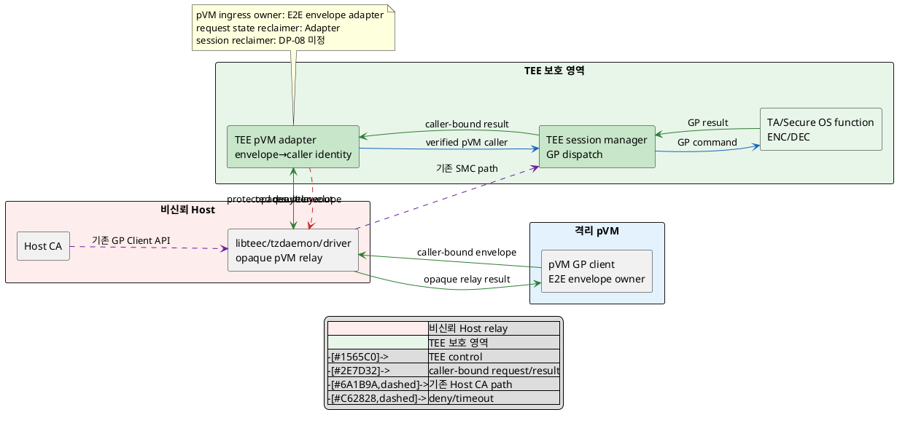
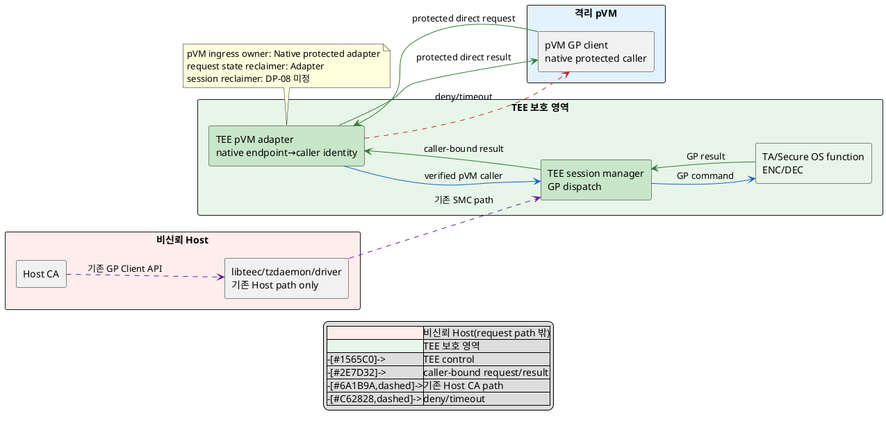

# DP-07. pVM에서 TEE로 가는 호출 경로

## 1. 상태

평가 중

## 2. 결정 목적

pVM Workload가 기존 Secure OS의 ENC/DEC 등 GP 기능을 호출할 때 caller identity와
request integrity를 어느 trust-boundary crossing으로 보존할지 정한다. 침해된
Host의 pVM 위장 호출을 막으면서 기존 Host→TEE GP/SMC 경로의 무회귀와 pipeline
지연 예산을 함께 지키는 것이 목적이다.

## 3. 문제 상황

### 3.1 현재 구조와 참여 주체

CUR-FR-06은 pVM Workload가 Secure OS와 명령/결과를 안전하게 교환하도록 요구한다.
기존 Host CA는 libteec/tzdaemon 또는 kernel driver를 거쳐 SMC로 TEE를 호출한다.
tzdaemon은 요청 중개와 session/TA loading을 담당하는 비신뢰 helper이고, TEE가
보안 기능과 최종 검증을 수행한다. pVM request를 이 Host 중심 경로에 그대로 넣으면
Host가 caller identity를 만들거나 request를 바꿀 수 있다.

| 참여 주체/상태 | 이 DP에서의 역할 |
|---|---|
| pVM Workload/GP client | TEE command를 요청하며 DP-03 verified identity와 pVM generation에 결합돼야 한다. |
| Host TEE stack | 기존 Host CA의 libteec/tzdaemon/driver/SMC 경로를 제공한다. pVM 요청에는 비신뢰 relay가 될 수 있다. |
| protected pVM request entry | caller pVM identity, generation, request integrity와 replay를 검증한다. 실행 위치/route가 미정이다. |
| TEE root/session manager | 최종 caller authorization, session 생성과 command dispatch를 수행한다. |
| TA/Secure OS function | ENC/DEC 등 GP command를 실행하고 결과를 반환한다. |

call transaction의 수명은 pVM이 caller-bound request ID/generation을 만든 때 시작해
TEE result/deny/timeout이 같은 ID로 종결될 때 끝난다. session과 async resource의
장애·종료 후 최종 회수 authority는 DP-08이 정하며 이 문서는 call route만 다룬다.

### 3.2 신뢰 경계와 인과 사슬

BL-01에 따라 Host kernel과 tzdaemon은 pVM caller identity의 최종 authority가
아니다. BL-02에 따라 기존 GP Client API/SMC 기능과 Secure OS 교체 경계는 두 후보
모두 유지해야 한다.

인과 사슬은 다음과 같다.

1. 침해된 Host가 승인된 pVM의 caller ID로 TEE request를 위조·변조·replay하거나
   result를 다른 generation에 전달한다.
2. TEE가 request를 protected pVM identity와 종단 결합하지 않으면 Host 요청과
   pVM 요청을 구분하지 못해 비인가 session/command가 성립한다.
3. QAS-SEC-06의 비인가 TEE 호출 0건과 caller identity/integrity coverage를
   위반하고 CUR-FR-06의 command/result 무결성이 깨진다.
4. 새 pVM 경로가 기존 Host→TEE GP/SMC interface를 바꾸면 QAS-SEC-06의 무회귀와
   QAS-EXT-06의 Secure OS 교체 시 GP 경계 밖 재이식 0개를 위협한다.
5. Host relay와 종단 envelope 또는 protected direct routing 단계는 capture→판단
   E2E에 포함돼 QAS-PERF-03의 pipeline 지연 예산을 소비한다.
6. direct protected path는 Host 위장을 줄일 수 있지만 pKVM/FF-A/TEE routing과
   protected parser를 추가할 수 있어 CUR-VOS-10의 TCB 및 legacy EL2 수정 제약을
   위협한다.

### 3.3 baseline, project-custom 범위와 요구 추적

| 구분 | 고정/변경 내용 |
|---|---|
| 공통 baseline | BL-01 Host 비신뢰/pKVM·TEE trust anchor, BL-02 GP 준수, 기존 Host→TEE GP/SMC 경로 무회귀, caller/request/result/generation 종단 결합과 fail-closed |
| 선행 공통 가정 | DP-03 verified identity와 DP-04 authorization result를 입력으로 사용하되 특정 후보는 가정하지 않는다. |
| project-custom 결정 | pVM caller-bound TEE request가 Host relay 경계를 거칠지 protected direct routing 경계를 거칠지 |
| 후행 결정 | DP-08은 session/async request/shared resource의 authoritative reclaimer를 정한다. |
| 후보 공통 하위 계약 | GP command schema, request ID/nonce와 timeout/error는 두 후보에 동일 적용하는 `TBD`다. caller pVM과 request의 종단 결합 요구는 공통이지만 TEE-side identity mapping은 후보 A의 E2E envelope 검증 결과와 후보 B의 protected route native caller binding에서 각각 도출하고 변경 범위에 반영한다. |
| 제외 | TA 제품/command 세부 구현, storage responsibility(C-03), session cleanup owner(DP-08), Host CA 자체의 SELinux label |
| 확인 필요 제약 | legacy `EL2 수정 불가` 유효성과 pKVM→TEE/FF-A VM routing 지원은 확인되지 않았다. 후보별 EL2/Secure OS 변경량을 측정한다. |

| 요구/근거 | 이 문제에 주는 조건 |
|---|---|
| CUR-VOS-11/12 / E-011~012 | Secure OS 이식 interface를 안정화하고 기존 TrustZone/SMC 기능을 유지한다. |
| CUR-FR-06 / E-022 | pVM Workload와 Secure OS가 ENC/DEC 명령/결과를 안전하게 교환한다. |
| QAS-SEC-06 / E-030 | 비인가 TEE 호출 0건, caller identity/integrity coverage 100%와 기존 Host 경로 무회귀가 gate다. |
| QAS-PERF-03 / E-034 | capture→판단 E2E p99 100ms와 상대 성능 90%는 출처 보완이 필요하며 이 DP는 호출 구간만 분해한다. |
| QAS-EXT-06 / E-044 | Secure OS 교체 시 GP 경계 밖 재이식 파일 0개가 gate다. |
| E-065 | pVM-TEE 경로가 추가 trust-boundary 공백으로 열거됐다. |
| E-075 | 기존 tzdaemon은 Host 비신뢰 helper이며 session/TA loading과 caller identity 중계를 담당한다. 세부 코드 확인은 필요하다. |
| E-083 | pVM-TEE path는 C-03 저장 책임과 다른 caller identity/route 축이다. |
| UC-06 / E-090 | ENC/DEC 요청과 오류·권한 실패 흐름이 정의된다. |

현재 구조 변수는 **pVM caller-bound TEE request가 통과하는 trust-boundary route**
하나다. 기존 Host TEE stack을 opaque relay로 쓰고 TEE까지 종단 검증할지, pVM에서
TEE로 protected direct route를 새로 둘지 결정해야 한다.

## 4. 결정 질문

> pVM→TEE request를 end-to-end 보호한 채 기존 Host TEE stack이 relay할 것인가, pVM identity를 보존하는 protected direct route로 전달할 것인가?

## 5. 후보 구조

### 5.1 후보 A: Host TEE stack relay + E2E caller binding

- pVM client가 request ID, pVM/Workload generation, GP command와 parameter
  measurement를 TEE-side verifier에 종단 결합한 envelope로 만든다.
- 기존 Host libteec/tzdaemon/driver/SMC stack은 envelope을 opaque pVM request로
  relay한다. Host CA의 기존 GP request path와 identity 형식은 바꾸지 않는다.
- TEE-side protected adapter가 envelope integrity/freshness와 DP-03 identity
  binding을 검증해 pVM caller identity를 만든 뒤 TEE session manager에 전달한다.
- result도 request/generation에 결합해 Host relay를 거쳐 pVM에 반환한다. Host
  mutation/replay는 거부하고 drop/delay는 timeout으로 fail-closed한다.
- 기존 transport와 GP façade를 재사용할 수 있지만 pVM E2E key/envelope, TEE-side
  identity adapter와 Host queue/DoS 경로가 추가된다.

### 5.2 후보 B: protected direct pVM→TEE route

- pVM client가 Host stack을 통하지 않고 pKVM/FF-A 등 protected routing ABI로
  TEE-side protected adapter를 직접 호출한다. 구체 primitive는 `TBD`다.
- protected router가 native VM endpoint/trap identity와 pVM generation을 request에
  결합하고 TEE adapter가 DP-03 identity record와 대조해 caller identity를 만든다.
- TEE session manager가 검증된 native caller identity로 GP command를 dispatch하고
  result를 같은 protected route로 반환한다.
- 기존 Host CA→libteec/tzdaemon/driver/SMC path는 parallel ingress로 유지하며 pVM
  route를 위해 Host GP ABI나 identity를 바꾸지 않는다.
- Host relay와 application envelope은 줄지만 pKVM/FF-A/TEE routing, endpoint-ID
  mapping과 Secure OS adapter의 실현 가능성·이식 범위를 확인해야 한다.

pVM endpoint generation은 TEE request의 accepted pVM ingress를 하나만 등록한다.
Host relay와 direct route를 동시에 pVM request authority로 열면 같은 request의
중복 session과 attack surface가 생기므로 XOR invariant를 위반한다. Host CA의 기존
별도 ingress는 pVM ingress가 아니므로 두 후보에 공통이다. 두 pVM route를 모두
구현해도 한 generation에는 하나만 활성화하고 다른 route의 pVM request를 거부해야
하므로 active-active 결합은 개선안이 아니다.

## 6. 후보별 구조 다이어그램

두 그림은 pVM GP request와 기존 Host CA request가 TEE session manager에 도달하는
같은 관점을 쓴다. 파란 실선은 control, 초록 실선은 caller-bound request/result,
보라 점선은 기존 Host CA path, 빨간 점선은 deny/timeout이다.

### 6.1 후보 A

### 6.2 후보 B

## 7. 후보별 동작 구조

### 7.1 공통 call 계약

- request는 pVM/Workload verified identity와 generation, GP command/parameter
  measurement, request ID/nonce와 target TA를 결합한다.
- TEE-side adapter가 caller identity를 최종 생성하며 Host가 제출한 pVM identity를
  그대로 신뢰하지 않는다.
- 기존 Host CA path의 GP command/identity semantics는 변경하지 않는다.
- call transaction state는 route adapter가 정리하지만 session/async/shared
  resource의 종료 후 authoritative cleanup은 DP-08에 남긴다.

### 7.2 후보 A의 정상/실패 흐름

1. pVM client가 TEE adapter용 caller-bound envelope을 만들고 Host stack에 보낸다.
2. Host stack은 내용을 판단하지 않고 기존 driver/SMC transport로 relay한다.
3. TEE adapter가 envelope, nonce, pVM/Workload generation을 검증해 caller identity를
   만들고 session manager에 넘긴다.
4. TEE result를 request ID/generation에 결합해 역방향 relay한다.
5. Host replay/mutation은 거부하고 drop/delay/relay crash는 request timeout으로
   닫는다. 이미 열린 session의 최종 회수는 DP-08이 정한다.

### 7.3 후보 B의 정상/실패 흐름

1. pVM client가 protected routing ABI로 GP request를 직접 호출한다.
2. router/TEE adapter가 native endpoint ID, pVM generation과 DP-03 identity를
   결합해 caller identity를 만든다.
3. session manager가 GP command를 dispatch하고 같은 route로 result를 반환한다.
4. endpoint restart, stale ID와 duplicate request를 request generation으로 거부한다.
5. routing/TEE adapter 장애나 unsupported path에서는 fail-closed하며 Host relay로
   자동 fallback하지 않는다. session cleanup은 DP-08이 정한다.

## 8. 품질속성 비교

### 8.1 평가 항목 추적

| 품질속성 | 요구 ID | 문제의 충돌/위험 | 평가 방식 | 출처 |
|---|---|---|---|---|
| caller 보안성·무결성 | QAS-SEC-06, CUR-FR-06 | Host 위장/mutation/replay로 비인가 TEE call 성립 | 필수 call/coverage gate | E-022, E-030 |
| GP 호환성·교체성 | CUR-VOS-11/12, QAS-EXT-06 | 새 pVM route가 Host GP/SMC와 Secure OS 교체 경계를 변경 | 무회귀/재이식 gate | E-011~012, E-044, E-075 |
| pipeline 성능 | QAS-PERF-03 | relay/envelope 또는 protected routing이 capture→판단 E2E 소비 | call 구간 KPI와 공유 trace | E-034, `03_DP_목록.md` 4절 |
| TCB 최소화 | CUR-VOS-10 | direct router/adapter 또는 envelope verifier가 protected TCB 증가 | protected code/ABI KPI와 legacy gate | E-010, E-065 |

### 8.2 필수 gate

| gate | 요구 ID | 판정 기준 | 공통 측정 조건/검증 방법 | 후보 A | 후보 B | 근거 유형/출처 |
|---|---|---|---|---|---|---|
| 비인가 TEE call 차단 | QAS-SEC-06 | forged Host/pVM identity, mutation/replay 뒤 비인가 session/command 0건 | 같은 GP command corpus에 identity/generation/nonce/result 변조와 replay 주입 | 확인 필요 | 확인 필요 | 확인 필요 / E-030, E-075 |
| caller 검증 coverage | QAS-SEC-06 | 정의된 pVM call path에서 caller identity/integrity 검증 coverage 100% | open/invoke/close/error/timeout 경로 instrumentation | 확인 필요 | 확인 필요 | 확인 필요 / E-030 |
| 기존 Host 경로 무회귀 | QAS-SEC-06, CUR-VOS-12 | 기존 Host CA GP 기능/identity/SMC 회귀 0건 | pVM path 비활성/활성 양쪽에서 기존 GP regression suite | 확인 필요 | 확인 필요 | 확인 필요 / E-012, E-030, E-075 |
| Secure OS 교체성 | QAS-EXT-06 | GP interface 밖 재이식 파일 0개 | 동일 pVM/Host GP contract로 Secure OS adapter 교체 전후 diff | 확인 필요 | 확인 필요 | 확인 필요 / E-044 |
| 구조 실현 가능성/legacy | G-04, 근거 원장 C-03 | E2E identity adapter 또는 pKVM/FF-A native route가 성립하고 legacy EL2 제약을 확인 | prototype, EL2/Secure OS diff와 VM routing capability probe | 확인 필요 | 확인 필요 | 직접 대표 PoC 없음 / E-065, E-075 |

### 8.3 KPI와 후보 평가

| 품질속성 | KPI | 계산식/단위 | 방향 | 공통 조건 | gate/별점 구간 | 출처 |
|---|---|---|---|---|---|---|
| caller 보안성 | identity/integrity coverage | `N(검증된 call path) / N(정의 call path) × 100` / % | 클수록 유리 | 같은 GP command/error catalogue | gate 100%; 별점 없음 | QAS-SEC-06 / E-030 |
| GP 교체성 | GP 밖 재이식 파일 | Secure OS 교체 diff 중 GP boundary 밖 변경 파일 수 / 개 | 작을수록 유리 | 같은 Host/pVM GP test suite와 adapter 범위 | gate 0개; 별점 없음 | QAS-EXT-06 / E-044 |
| pipeline 성능 | pVM TEE call 구간 | `T_TEE = t(bound result received) - t(pVM submit)` / ms, p99 | 작을수록 유리 | 같은 command/parameter size/SoC/load/session state | PERF-03 100ms/90%는 출처 보완 필요 공유 E2E; DP-07 배분·별점 `TBD` | QAS-PERF-03 / E-034, `03_DP_목록.md` 4절 |
| TCB 최소화 | protected code/ABI 증가 | route용 verifier/router/adapter의 KLoC와 새 ABI 수 | 작을수록 유리 | 같은 baseline, generated/test 제외 기준 `TBD` | 임계값·별점 구간 `TBD` | CUR-VOS-10 / E-010 |

gate 결과, 실측값과 승인된 별점 구간이 없으므로 별점을 부여하지 않는다.

| 품질속성/KPI | 후보 A 값 | 후보 A 별점 | 후보 A 구조 근거 | 후보 B 값 | 후보 B 별점 | 후보 B 구조 근거 |
|---|---:|---|---|---:|---|---|
| caller 보안성 | gate 확인 필요 | 해당 없음 | E2E key/envelope에서 pVM identity를 안전하게 도출하는지 검증해야 한다. | gate 확인 필요 | 해당 없음 | native endpoint ID와 DP-03 identity/generation binding을 검증해야 한다. |
| GP 호환성/교체성 | gate 확인 필요 | 해당 없음 | 기존 Host stack을 relay로 재사용하지만 TEE envelope adapter diff를 확인해야 한다. | gate 확인 필요 | 해당 없음 | Host path는 별도 유지하지만 pKVM/TEE native adapter의 GP 밖 변경을 확인해야 한다. |
| pipeline 성능 / `T_TEE` | TBD | 미부여 | Host queue/SMC relay와 envelope 처리 단계가 있다. | TBD | 미부여 | Host relay는 없지만 pKVM/FF-A/TEE router 단계가 있다. |
| TCB 최소화 / code·ABI | TBD | 미부여 | pVM envelope verifier와 identity adapter가 TEE TCB에 추가된다. | TBD | 미부여 | pKVM/FF-A router와 TEE endpoint adapter가 protected TCB에 추가된다. |

## 9. 핵심 트레이드오프

> 후보 A는 기존 Host GP/SMC transport를 pVM의 비신뢰 relay로 재사용해 새 pKVM→TEE routing ABI를 줄일 가능성이 있다. 대신 pVM E2E key/envelope과 TEE identity adapter, Host queue/DoS 및 추가 relay 지연이 남는다.

> 후보 B는 protected native caller binding으로 Host 위장·metadata relay를 줄일 가능성이 있다. 대신 pKVM/FF-A/TEE routing과 endpoint mapping을 구현·이식해야 해 protected TCB와 Secure OS 변경 범위가 커질 수 있다.

두 후보 모두 SEC-06, Host 무회귀, EXT-06과 routing feasibility gate가 `확인 필요`다.
caller mapping, `T_TEE`, GP 밖 diff와 protected code/ABI 측정 전에는 보안성·호환성·
pipeline 성능·TCB 최소화의 우위를 확정하지 않는다.

## 10. 검증 기준

| 검증 항목 | 공통 환경과 방법 | 판정/기록 기준 | 근거 유형 |
|---|---|---|---|
| Host/pVM impersonation | Host forged identity, envelope/native endpoint mutation, stale generation/replay | 비인가 open/invoke 0건, caller coverage 100% | 대표 PoC 필요 |
| request/result binding | command/parameter/request ID/result의 mutation/reorder/drop/duplicate | 잘못된 result 수용과 duplicate command 0건 | 대표 PoC 필요 |
| Host GP 무회귀 | pVM route off/on에서 기존 CA open/invoke/close/storage suite 실행 | 기존 기능/identity/SMC regression 0건 | 대표 통합 시험 필요 |
| Secure OS 교체 | 같은 GP contract로 다른 Secure OS adapter를 빌드·시험 | GP 밖 재이식 파일 0개 | 대표 통합 시험 필요 |
| call/E2E 지연 | pVM submit, TEE dispatch, TA return, pVM receive와 capture PTS 연계 | `T_TEE` p99와 PERF-03 E2E 기여; 배분 `TBD` | 대표 PoC 필요 |
| protected 변경량 | verifier/router/adapter와 EL2/Secure OS diff, FF-A VM routing probe | KLoC/ABI/파일 수, legacy 0-LoC 제약 영향 기록 | 구조 검토+build 필요 |
| session cleanup 경계 | call route 장애 뒤 session/async resource 상태 기록 | 이 문서에서는 관찰만 하고 reclaimer 판정은 DP-08로 전달 | DP-08 연계 |

PlantUML 블록 수와 시작/종료 표식은 검사하지만 로컬 환경에 renderer가 없어 실제
렌더링 결과는 `확인 필요`다.

## 11. 검토 결과

| 쟁점 | Claude 의견 | Codex 의견 | 원문 근거 | 해결 | 남은 확인 |
|---|---|---|---|---|---|
| TEE-side identity mapping의 route 차이 | Host relay는 E2E envelope 검증 결과, direct route는 native endpoint binding에서 identity를 도출하므로 공통 `TBD`로 묶으면 안 된다. | caller 종단 결합 요구만 공통으로 두고 구현·Secure OS 변경 부담은 후보별로 표시해야 한다. | QAS-SEC-06 / E-030; G-04 | 3.3절 계약과 5~10절에서 envelope/native mapping을 분리했다. | E2E key provisioning, native endpoint mapping과 대표 PoC |
| PERF-03 공유 예산 | 중앙 공유 예산 표에 PERF-03이 없어 다른 pipeline 구간과 중복 청구할 위험이 있다. | DP-07은 call segment만 측정하고 전체 critical path는 목록에서 통합 추적해야 한다. | QAS-PERF-03 / E-034 | `03_DP_목록.md` 4절에 PERF-03 공유 행을 추가하고 별도 커밋했다. | 수치 출처와 구간 배분 승인 |
| 선행/후행·legacy 경계 | DP-03/04 입력, DP-08/C-03 분리, Host GP 무회귀와 legacy/FF-A 불확실성이 명시됐다. | 미확정 결정을 공통 입력/확인 gate로 유지한다. | E-083, 근거 원장 C-03 | 구조 변경 없음 | route capability와 선행 결정 역추적 |
| 후보/평가 Claude 검토 | 두 후보의 상세도, route별 identity 생성, Host GP 무회귀, DP-08/C-03 경계, owner/lifetime, 왕복 방향, 대칭 gate/KPI는 통과했다. XOR 설명 한 문장의 의미만 반전돼 있었다. | active-active 결합 금지 의도와 일치하도록 문구를 고치고 나머지 통과 판정을 유지한다. | PLAN 단계 7; DP-RULE §4단계 | `XOR가 성립하지 않는다`를 `XOR invariant를 위반한다`로 수정했다. | 대표 환경의 route capability와 수치 측정 |

## 12. 최종 결정
