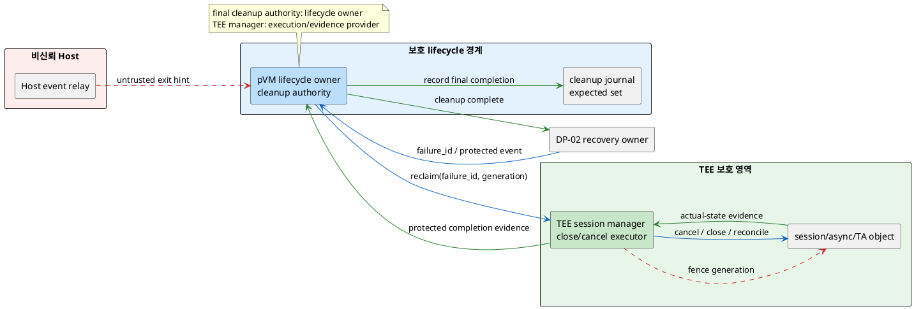
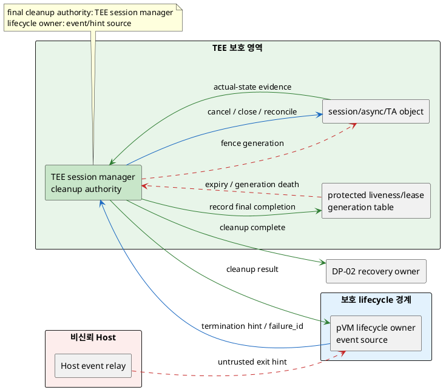

# DP-08. TEE session 최종 회수 책임

## 1. 상태

평가 중

## 2. 결정 목적

pVM이 정상 종료되거나 crash/hang으로 소멸한 뒤 해당 generation이 만든 TEE
session, 처리 중인 async request와 shared resource를 어느 lifecycle 경계가 최종
회수할지 정한다. Host나 소멸한 pVM의 통지에만 의존하지 않고 stale authority의
재사용과 TEE 자원 누수를 막으면서 DP-02 복구 critical path를 불필요하게 늘리지
않는 것이 목적이다.

## 3. 문제 상황

### 3.1 현재 구조와 참여 주체

CUR-FR-06의 TEE command/result 교환은 session open, command dispatch, async
completion과 shared-memory handle 같은 수명 상태를 만든다. DP-07은 pVM caller
identity와 request integrity를 보존하는 ingress를 정하지만 session을 연 주체가
사라진 뒤 누가 회수 완료를 선언할지는 정하지 않는다. 또한 DP-02는 한 장애의
복구 transaction을 조정하지만 TEE 내부 session 권한을 직접 폐기하지 않는다.

| 참여 주체/상태 | 이 DP에서의 역할 |
|---|---|
| pVM generation/Workload | TEE session과 async request의 논리 caller(이하 session owner)다. 종료 뒤 같은 pVM ID의 새 generation과 구분돼야 한다. |
| pVM lifecycle owner | stop/delete/crash/hang event와 DP-02의 `failure_id`를 제공하고 신규 호출을 차단한다. cleanup을 직접 판정할지 TEE에 위임할지는 이 DP의 결정 대상이며 구체 배치는 DP-01/02에서 미정이다. |
| DP-07 pVM TEE ingress | 검증된 caller identity와 pVM generation으로 session open/command를 전달한다. relay/direct 후보는 미정이다. |
| TEE session manager | Secure OS의 보호 경계에서 session table, in-flight command와 TA-side object의 close/cancel/reclaim 메커니즘을 보유한다. 최종 판정 권한 배정은 이 DP가 정한다. |
| Host TEE helper | 기존 GP/tzdaemon 경로의 비신뢰 relay다. cleanup 권한이나 pVM liveness의 최종 근거가 아니다. |
| shared resource owner | TEE shared memory, file/RPC handle 등 session에 딸린 자원의 실제 상태를 보유한다. 자원 종류별 상세 protocol은 범위 밖이다. |
| DP-02 recovery owner | 동일 장애 trace에서 TEE 회수 결과를 다른 자원 회수·재기동과 합성한다. TEE reclaimer 자체는 이 DP가 정한다. |

이 문서에서 `session generation`은 검증된 pVM identity/generation, TEE endpoint,
session ID를 결합한 수명 단위다. 그 수명은 TEE가 open을 승인한 때 시작해 in-flight
request 취소/종결, session close와 딸린 resource reconciliation을 확인한 때 끝난다.
`session owner`는 정상 요청/close의 논리 주체이고, `authoritative reclaimer`는
owner가 응답하지 않아도 최종 폐기 상태를 판정하고 재사용을 금지할 책임이다.

### 3.2 신뢰 경계와 인과 사슬

BL-01에 따라 Host kernel, tzdaemon과 Host가 전달한 종료 통지는 단독 보안 근거가
아니다. TEE는 새 generation의 request가 이전 session ID, async completion이나
shared handle을 이어받지 못하게 fail-closed해야 한다.

인과 사슬은 다음과 같다.

1. pVM이 TEE session과 async command를 보유한 채 crash/hang하거나 Host가 종료
   통지를 drop·지연·위조한다.
2. 종료 event, caller generation과 TEE session table의 관계 및 최종 reclaimer가
   불명확하면 close/cancel이 편측 도착하거나 전혀 실행되지 않는다.
3. 오래된 session/handle이 남으면 같은 pVM ID의 새 generation 또는 위장 caller가
   stale authority와 result를 재사용해 QAS-SEC-06의 비인가 호출 0건을 위반한다.
4. session, async state와 shared resource가 누적되면 QAS-AVL-04의 반복 장애 뒤
   ledger/실자원 누수 0 조건을 위반하고 후속 session open을 고갈시킨다.
5. 회수 완료를 기다리는 위치와 timeout이 정의되지 않으면 DP-02의 검출→회수→
   재기동 critical path가 불확정해 QAS-AVL-02의 end-to-end 복구성을 입증할 수 없다.
6. 반대로 살아 있는 generation을 잘못 판정해 session을 회수하면 정상 TEE 작업이
   중단되므로 protected liveness, generation fencing과 idempotent reclaim이 필요하다.

### 3.3 owner, lifetime과 실패 계약

authoritative reclaimer는 각 session generation에 하나만 존재해야 한다. lifecycle
event를 만드는 주체와 실제 TEE state를 폐기하는 주체가 달라도, 다음 계약은 두
경계를 가로질러 원자적으로 판정돼야 한다.

- `OPEN` 이후 session key에는 verified pVM generation과 endpoint identity를
  포함하고 이전 generation의 command를 거부한다.
- 정상 `CLOSE`와 장애 `RECLAIM`은 같은 session generation에 대해 idempotent하며,
  먼저 완료된 종결 상태가 이후 request/result를 거부한다.
- in-flight request는 완료 결과를 원래 generation에만 전달하거나 폐기하며 새
  generation으로 재결합하지 않는다.
- 회수 완료는 session table뿐 아니라 TA-side object, async queue와 shared handle의
  실제 상태를 reconciliation한 증거로 판정한다. 이 reconciliation은 상태 확인에
  한정하며 물리 자원 회수 실행은 해당 자원 DP의 책임이다.
- cleanup 신호가 유실되거나 pVM/Host/lifecycle owner가 응답하지 않는 경우에도
  bounded timeout 뒤 fail-closed 종결로 수렴해야 한다. 이 수렴은 이 DP에서 정한
  authority가 책임지며 구체 timeout은 `TBD`다.
- TEE 회수 구간은 DP-02의 같은 `failure_id` trace에 연결하되 DP-08이 QAS-AVL-02
  전체 3초 예시 예산을 독자적으로 재청구하지 않는다.

session의 정상 command authorization은 DP-04/07의 입력이며, 이 DP의 변수는
장애·종료 뒤 **최종 cleanup completion authority** 하나다. session을 생성하는
route, 복구 unit과 storage file lifetime은 이 결정을 대신하지 않는다.

### 3.4 baseline, project-custom 범위와 요구 추적

| 구분 | 고정/변경 내용 |
|---|---|
| 공통 baseline | BL-01 Host 비신뢰/pKVM·TEE trust anchor, generation-bound session, stale request/result fail-closed, 기존 Host GP session 무회귀 |
| 선행 공통 가정 | DP-02가 failure/termination event와 `failure_id`를, DP-07이 verified caller generation과 session ingress를 제공한다. 어느 후보도 가정하지 않는다. |
| project-custom 결정 | pVM 종료·장애 뒤 TEE session generation의 cleanup completion을 최종 판정하는 lifecycle authority |
| 후보 공통 하위 계약 | session key, protected liveness evidence, close/reclaim idempotency, async cancel, resource reconciliation과 timeout schema는 `TBD`다. |
| 후행/외부 계약 | DP-02는 TEE 회수 결과를 전체 복구 trace에 합성한다. TEE shared-memory의 물리 ownership과 file lifetime은 각 자원 DP/C-03 계약을 따른다. |
| 제외 | DP-07 relay/direct route 선택, TA 제품별 command, 정상 session API, C-03 암호화 파일 수명, buffer/HW/CPU·memory reclaimer |
| 확인 필요 제약 | Secure OS가 pVM endpoint liveness/generation을 보호된 방식으로 관찰할 수 있는지, async cancel과 TA object enumeration을 지원하는지 확인되지 않았다. |

| 요구/근거 | 이 문제에 주는 조건 |
|---|---|
| CUR-FR-01 / E-017 | pVM stop/delete와 자원 회수를 lifecycle 기능으로 관리한다. |
| CUR-FR-06 / E-022 | pVM Workload와 Secure OS의 command/result 교환 상태를 안전하게 종결해야 한다. |
| QAS-SEC-06 / E-030 | 종료된 generation 또는 위장 caller의 TEE 호출 성립은 0건이어야 하고 기존 Host 경로는 회귀하지 않아야 한다. |
| QAS-AVL-02 / E-047 | 검출→회수→재기동 p99 3초와 0.5/1/1.5초 분해는 예시치다. DP-08은 회수 하위 구간만 같은 trace로 측정한다. |
| QAS-AVL-04 / E-049 | crash-restart 1,000회는 시험 가정이며 session/resource ledger와 실제 상태의 누수 0이 목표다. |
| RS-13 / E-056 | 장애·종료 때 pVM과 의존 자원을 회수하거나 재시작한다. |
| E-075 | 기존 TEE helper/session manager가 session, TA loading, shared memory와 RPC lifecycle에 관여하므로 세부 구현 확인이 필요하다. |
| G-07 / E-077 | pVM 소멸 시 TEE session/resource cleanup 책임은 명시적으로 미해결이다. |

현재 구조 변수는 **session generation의 최종 cleanup completion authority** 하나다.
pVM lifecycle 경계와 TEE session-manager 경계가 같은 generation을 동시에 최종
회수 완료로 판정하면 중복 close, premature reclaim 또는 stale state가 생기므로
하나만 authoritative해야 한다.

## 4. 결정 질문

> pVM 종료·장애 뒤 TEE session generation의 최종 회수 완료를 pVM lifecycle 경계가 책임질 것인가, TEE session-manager 경계가 책임질 것인가?

## 5. 후보 구조

### 5.1 후보 A: protected pVM lifecycle owner 주도 회수

- pVM lifecycle owner가 session generation별 cleanup transaction과 최종 완료
  판정을 소유한다. owner는 pVM 밖의 보호 경계에 있고 Host event를 그대로
  신뢰하지 않으며 구체 배치는 DP-01/02 결과에 따른다.
- stop/delete/fault를 받으면 해당 generation의 신규 TEE call을 fence하고
  `failure_id`, session generation과 expected resource set을 결합한 reclaim을 TEE
  session manager에 요청한다.
- TEE manager는 close/cancel과 TA/shared-handle 상태 확인을 집행하고 보호된 완료
  증거를 반환한다. lifecycle owner가 expected set과 대조한 뒤 cleanup 완료를
  authoritative하게 선언해 DP-02에 전달한다.
- 통지 유실이나 lifecycle owner 재시작에도 transaction journal/retry로 수렴해야
  한다. journal 보호 위치와 failover는 `TBD`이며 feasibility gate다.
- lifecycle owner가 중복·지연된 fault event를 현재 generation death로 오판하면
  살아 있는 session을 premature reclaim할 수 있어 protected event freshness와
  false-positive 검증이 필요하다.
- pVM lifecycle과 복구 trace를 한곳에서 조정할 수 있지만 TEE 상태와 외부 owner
  사이의 동기화, 재시도와 owner 자체 장애 경로가 추가된다.

### 5.2 후보 B: TEE session manager 자율 회수

- TEE session manager가 session generation별 protected liveness/lease와 최종
  cleanup 완료 판정을 소유한다. lifecycle event는 신뢰 가능한 경우 회수를
  앞당기는 hint일 뿐 유일한 종결 근거가 아니다.
- session open 때 caller generation, endpoint, lease와 resource set을 TEE table에
  기록하고 native protected liveness 또는 갱신 가능한 증거를 검증한다. 구체
  liveness primitive는 `TBD`다.
- 종료 hint, endpoint generation 변경 또는 lease expiry가 확인되면 신규 command를
  fence하고 TEE 안에서 in-flight cancel, session close와 상태 reconciliation을
  수행한 뒤 완료를 authoritative하게 선언한다.
- 완료 결과를 같은 `failure_id`/generation으로 lifecycle owner와 DP-02에 통지한다.
  외부 통지가 유실돼도 TEE table의 종결 상태가 stale call을 거부한다.
- owner 통지 유실에 강하지만 Secure OS에 liveness/lease timer와 resource enumeration
  상태가 늘고, 오탐 회수는 살아 있는 workload를 중단시킬 수 있다.

두 후보 모두 TEE session manager가 실제 TEE object를 폐기하지만 **cleanup 완료를
최종 판정하는 authority**가 다르다. 같은 session generation에 두 authority를
active-active로 두면 서로 다른 liveness 관찰로 premature close 또는 완료 누락을
만드므로 XOR invariant를 위반한다. 보조 hint와 실제 폐기 위임은 결합이 아니라
공통 메커니즘이며 최종 판정자는 하나다.

## 6. 후보별 구조 다이어그램

두 그림은 종료·장애 event에서 TEE cleanup 완료까지 같은 관점을 사용한다. 파란
실선은 control, 초록 실선은 protected evidence, 빨간 점선은 fence/timeout이다.

### 6.1 후보 A

### 6.2 후보 B

## 7. 후보별 동작 구조

### 7.1 공통 session cleanup 계약

- session key는 verified pVM identity/generation, TEE endpoint와 session ID를
  포함하며 종결 뒤 재사용하지 않는다.
- 종료 경로는 generation fence → in-flight cancel/종결 → session close → 실제
  상태 reconciliation → 완료 기록 순서를 지킨다.
- close/reclaim retry는 idempotent하고 늦은 result와 stale request는 폐기한다.
- 기존 Host CA session의 identity와 cleanup semantics는 회귀시키지 않는다.
- DP-02에는 같은 `failure_id`의 하위 구간과 완료 증거만 제공하며 복구 전체 완료는
  DP-02가 판정한다.

### 7.2 후보 A의 정상/실패 흐름

1. protected lifecycle owner가 종료/fault를 확인해 session generation을 fence한다.
2. journal에 cleanup transaction과 expected session/resource set을 기록하고 TEE에
   reclaim을 보낸다.
3. TEE가 cancel/close/reconciliation 결과를 보호된 증거로 반환한다.
4. owner가 expected/actual set을 대조해 완료를 기록하고 DP-02에 보고한다.
5. Host 통지 유실은 protected event로 보완하고 TEE 응답 유실은 동일 transaction을
   재시도한다. lifecycle owner 자체 장애는 journal 복구가 성립하지 않으면
   fail-closed하며 완료를 선언하지 않는다. 지연·중복 fault를 현재 generation
   death로 오판한 premature reclaim도 fault-injection gate에서 검증한다.

### 7.3 후보 B의 정상/실패 흐름

1. TEE가 open 시 session generation과 protected liveness/lease를 등록한다.
2. lifecycle owner의 종료 hint 또는 TEE가 검증한 generation death/expiry가 회수를
   시작하고 즉시 해당 generation command를 fence한다.
3. TEE가 in-flight cancel, close와 actual-state reconciliation을 수행한다.
4. TEE table에 완료를 기록한 뒤 lifecycle owner/DP-02에 결과를 통지한다.
5. 외부 hint·결과 통지가 유실돼도 TEE가 독립 수렴한다. liveness가 모호하면
   fail-closed 상태에서 정책상 grace `TBD`를 적용하며 살아 있는 session의 오회수
   여부를 gate로 검증한다.

## 8. 품질속성 비교

### 8.1 평가 항목 추적

| 품질속성 | 요구 ID | 문제의 충돌/위험 | 평가 방식 | 출처 |
|---|---|---|---|---|
| stale authority 방지 | QAS-SEC-06 | 종료 generation의 session/request/result 재사용 | 비인가 호출/late-result gate | E-030 |
| 복구성 | QAS-AVL-02 | cleanup 대기와 retry가 복구 critical path를 지연 | 동일 failure trace의 회수 구간 KPI | E-047, `03_DP_목록.md` 4절 |
| 누수 방지 | QAS-AVL-04 | session/async/shared-handle 상태 누적 | 반복 장애 reconciliation gate | E-049 |
| 장애 안전성 | CUR-FR-01/06 | Host 통지 유실, authority 장애 또는 liveness 오탐 | fault-injection/feasibility gate | E-017, E-022, E-056 |

### 8.2 필수 gate

| gate | 요구 ID | 판정 기준 | 공통 측정 조건/검증 방법 | 후보 A | 후보 B | 근거 유형/출처 |
|---|---|---|---|---|---|---|
| stale TEE authority 차단 | QAS-SEC-06 | 종료 generation의 open/invoke/result 수용 0건 | 같은 session corpus에 stale ID, late result, replay와 새 generation 주입 | 확인 필요 | 확인 필요 | 확인 필요 / E-030 |
| session/resource 누수 | QAS-AVL-04 | ledger와 실제 session/async/TA/shared-handle 불일치 0건 | crash-restart 1,000회 시험 가정, 매회/종료 후 reconciliation | 확인 필요 | 확인 필요 | 확인 필요 / E-049 |
| bounded cleanup 수렴 | QAS-AVL-02 | 모든 종료/fault가 완료 또는 fail-closed로 수렴 | 같은 failure catalogue와 load에서 cleanup segment/critical path 측정 | 확인 필요 | 확인 필요 | 확인 필요 / E-047 |
| authority 자체 장애 | CUR-FR-01/06 | Host 통지 유실과 선택 authority restart에도 premature 완료·영구 orphan 0건 | event drop, owner/session-manager crash, response loss 주입 | 확인 필요 | 확인 필요 | 대표 PoC 필요 / E-017, E-022 |
| 기존 Host session 무회귀 | QAS-SEC-06 | 기존 Host CA open/invoke/close 회귀 0건 | pVM cleanup 활성/비활성에서 기존 GP suite | 확인 필요 | 확인 필요 | 확인 필요 / E-030, E-075 |

### 8.3 KPI와 후보 평가

| 품질속성 | KPI | 계산식/단위 | 방향 | 공통 조건 | gate/별점 구간 | 출처 |
|---|---|---|---|---|---|---|
| stale 방지 | stale acceptance | 종료 generation의 수용 open/invoke/result 수 / 건 | 작을수록 유리 | 동일 fault/session corpus | gate 0건; 별점 없음 | QAS-SEC-06 / E-030 |
| 복구성 | TEE cleanup segment | `t(cleanup evidence)-t(termination/fault accepted)` / ms, p99 | 작을수록 유리 | 동일 failure ID, session 수/load | AVL-02 공유 예산 배분·별점 `TBD` | QAS-AVL-02 / E-047 |
| 누수 방지 | reconciliation delta | `N(ledger)-N(actual)` 절대 불일치와 orphan 수 / 건 | 작을수록 유리 | 1,000회는 시험 가정 | gate 0건; 별점 없음 | QAS-AVL-04 / E-049 |
| 구조 부담 | protected state/code | journal 또는 lease/liveness용 상태 byte와 변경 KLoC | 작을수록 유리 | 동일 baseline/session scale | 임계값·별점 `TBD` | 구조 측정 필요 |

gate 결과와 승인된 구간이 없으므로 별점을 부여하지 않는다.

| 품질속성/KPI | 후보 A 값 | 후보 A 별점 | 후보 A 구조 근거 | 후보 B 값 | 후보 B 별점 | 후보 B 구조 근거 |
|---|---:|---|---|---:|---|---|
| stale authority | gate 확인 필요 | 해당 없음 | protected lifecycle journal과 TEE 완료 증거의 원자성을 확인해야 한다. | gate 확인 필요 | 해당 없음 | TEE generation lease와 fence의 정확성을 확인해야 한다. |
| cleanup p99 | TBD | 미부여 | 외부 request/evidence round trip과 journal retry가 있다. | TBD | 미부여 | TEE 내부 검출/lease expiry와 cleanup 단계가 있다. |
| 누수 0 | gate 확인 필요 | 해당 없음 | expected set과 actual-state 대조로 판정한다. | gate 확인 필요 | 해당 없음 | TEE table과 실제 object 대조로 판정한다. |
| protected state/code | TBD | 미부여 | protected lifecycle journal/failover가 추가된다. | TBD | 미부여 | Secure OS lease/liveness/timer가 추가된다. |

## 9. 핵심 트레이드오프

> 후보 A는 pVM lifecycle과 DP-02 복구 trace에서 회수 완료를 통합해 명시적 종료를 빠르게 조정할 가능성이 있다. 대신 TEE actual state와 외부 journal의 원자성, 재시도와 lifecycle authority 자체 장애 복구가 필요하다.

> 후보 B는 Host/pVM/lifecycle 통지가 사라져도 TEE가 보유 상태를 기준으로 자율 수렴해 stale session을 줄일 가능성이 있다. 대신 protected liveness/lease가 정확해야 하고 Secure OS 상태·timer·TCB 및 오탐 회수 위험이 늘어난다.

두 후보 모두 stale 수용 0, 누수 0, bounded 수렴과 Host session 무회귀 gate가
`확인 필요`다. cleanup p99, orphan과 protected 변경량을 측정하기 전에는 보안성·
복구성·누수 방지·구조 부담의 우위를 확정하지 않는다.

## 10. 검증 기준

| 검증 항목 | 공통 환경과 방법 | 판정/기록 기준 | 근거 유형 |
|---|---|---|---|
| generation fencing | open/invoke/close 중 pVM crash/restart와 stale ID/result replay | 종료 generation 수용 0건, 새 generation 오결합 0건 | 대표 PoC 필요 |
| async/shared 상태 | command 실행 전/중/후 fault, result drop, shared-handle 편측 해제 | ledger/actual delta와 orphan 0건 | 대표 PoC 필요 |
| 반복 수렴 | 같은 session/load에서 crash-restart 1,000회 시험 가정 | 매회 종결 상태, 마지막 실제 object 누수 0 | 대표 장기 시험 필요 |
| authority 장애 | Host event drop, lifecycle owner/TEE manager crash와 응답 유실 | premature 완료·영구 orphan 0, fail-closed 여부 | 대표 fault injection 필요 |
| 복구 critical path | DP-02와 같은 `failure_id`로 검출, TEE 회수, 재기동 timestamp 수집 | DP-08 segment와 병렬/직렬 관계, AVL-02 E2E 결과 | 통합 시험 필요 |
| Host GP 무회귀 | 기존 Host session suite와 pVM cleanup을 동시 실행 | 기존 open/invoke/close regression 0 | 통합 시험 필요 |

PlantUML 블록 수와 시작/종료 표식은 검사하지만 로컬 환경에 renderer가 없어 실제
렌더링 결과는 `확인 필요`다.

## 11. 검토 결과

| 쟁점 | Claude 의견 | Codex 의견 | 원문 근거 | 해결 | 남은 확인 |
|---|---|---|---|---|---|
| 실행 능력과 배치의 비대칭 | TEE manager에만 집행 능력과 암묵적 보호 배치를 줘 한 후보를 선결한 것처럼 읽힌다. | 실제 폐기 메커니즘과 최종 완료 authority를 분리하되 lifecycle owner의 보호 배치가 아직 미정임을 숨기지 않는다. | G-07 / E-077; BL-01 | TEE는 Secure OS executor, lifecycle owner는 선택 가능한 판정자로 분리했고 후보 A의 구체 배치는 `확인 필요`로 유지했다. 완전한 배치 대칭을 확정한 것으로 과장하지 않는다. | DP-01/02 결과와 lifecycle owner의 보호 배치 feasibility |
| session owner 매핑 | 정의된 session owner가 어느 참여자인지 명시적으로 연결되지 않았다. | Workload의 정상 논리 ownership과 장애 reclaimer를 구분해야 한다. | CUR-FR-06 / E-022 | pVM generation/Workload 행을 `session owner`에 연결했다. | 실제 GP session identity schema |
| shared handle과 timeout 경계 | reconciliation이 물리 자원 회수를 침범할 수 있고 bounded timeout의 주체가 모호하다. | DP-08은 상태 확인만 하며 선택된 authority가 수렴을 책임져야 한다. | QAS-AVL-02/04 / E-047, E-049 | 3.3절에 상태 확인 한정과 선택 authority의 timeout 책임을 추가했다. | 자원별 상태 증거 API와 timeout 배분 |
| 문제축 1차 검토 | 단일 축, DP-02/07 비선결, C-03/타 자원 경계, Host event 유실, generation/async 계약과 공유 예산은 통과했다. | 통과 항목을 후보 공통 계약으로 유지한다. | PLAN 단계 6 | 구조 변경 없이 5~10절에 공통 gate로 연결했다. | 후보/평가 2차 검토 |
| 후보/평가 Claude 검토 | 상태 필드와 로그의 배치 해결 표현, 후보 A의 owner 오판정 위험을 고치고 두 그림의 fence 대상과 비신뢰 hint 표현을 맞춰야 한다. 나머지 XOR, owner 경계, 범위, gate/KPI, 공유 예산과 공란 결정은 통과했다. | 상태는 이미 `평가 중`으로 갱신돼 있었고 나머지 블로커·비차단 지적을 모두 반영한다. | PLAN 단계 7; QAS-SEC-06/AVL-02/04 | 후보 A에 stale fault 오판 위험을 추가하고 두 그림 모두 TEE→state fence와 빨간 Host hint를 사용했다. 배치 로그는 미확정을 명시했다. | lifecycle/TEE 대표 PoC와 수치 측정 |

## 12. 최종 결정
