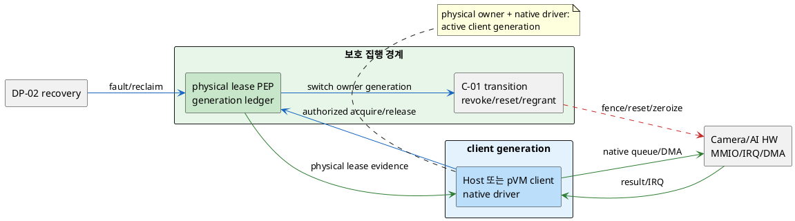
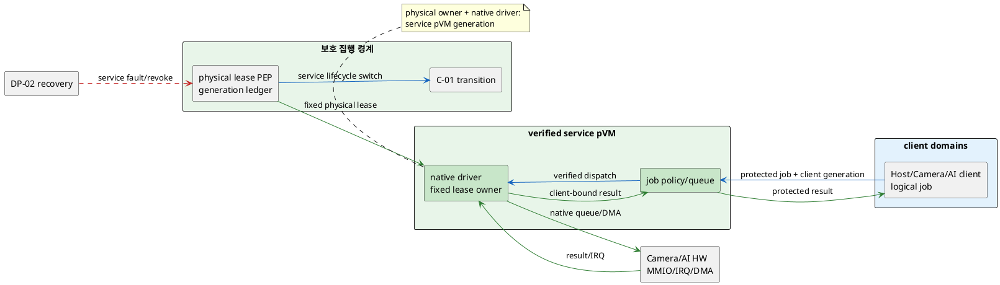

# DP-09. Camera/AI 물리 HW lease와 native driver 소유권

## 1. 상태

평가 중

## 2. 결정 목적

Camera/AI accelerator의 physical lease와 native driver를 어느 격리 경계가
지속적으로 보유하고 Host/pVM client에 사용권을 제공할지 정한다. 비할당 DMA와
잔류 HW state를 차단하면서 1080p30 처리 및 전환 지연, 한 driver/HW 장애의 전파
반경과 복구 시간을 함께 통제하는 것이 목적이다.

## 3. 문제 상황

### 3.1 현재 구조와 참여 주체

CUR-FR-04는 Camera/AI HW의 배타 권한, 회수와 잔류 데이터 격리를 요구한다. 기존
C-01은 revoke→drain/reset/zeroize→SMMU 재구성→grant라는 안전 전환 순서와 최종
집행 경계를 비교한다. 그러나 그 계약을 만족하더라도 physical lease가 client
domain 사이를 이동하며 native driver도 각 client에 존재할지, 별도 verified
service pVM이 lease/driver를 고정 보유하고 client에 논리 job만 줄지는 정해지지
않았다.

| 참여 주체/상태 | 이 DP에서의 역할 |
|---|---|
| Host normal client | 기존 Linux Camera/AI 기능을 사용한다. BL-01에 따라 physical lease authority는 아니다. |
| Camera/AI pVM client | 검증된 Workload identity로 HW 사용을 요청하고 frame/job 결과를 소비한다. |
| physical HW lease owner | 특정 generation 동안 device, MMIO/IRQ/DMA context와 reset 권한의 배타 소유를 기록한다. 위치가 미정이다. |
| native device driver | HW register, queue, firmware와 DMA submission을 직접 제어한다. 어느 failure/TCB domain에 둘지가 이 DP에 결합된다. |
| protected authorization/PEP | DP-04의 허가 결과와 C-01 안전 전환 계약을 집행하고 비할당 DMA를 차단한다. 구체 후보는 미정이다. |
| DP-02 recovery owner | owner/client/driver 장애를 같은 `failure_id`로 조정하고 실제 lease 회수 결과를 합성한다. |

`physical lease` 수명은 보호 경계가 device context를 한 owner generation에 배타
결합한 때 시작해 submission drain, reset/zeroize와 DMA mapping 제거가 확인되고
다음 owner에게 재부여 가능한 상태가 된 때 끝난다. `logical job grant`는 고정
physical owner 안에서 client별 command/data/result만 허용하는 더 짧은 사용권이며
physical lease와 동일하지 않다.

### 3.2 단일 구조 변수와 C-01 경계

이 DP는 **physical lease owner와 native driver의 placement**를 함께 정한다. native
driver가 직접 MMIO/queue를 제어하므로 lease owner와 다른 비신뢰 domain에 두면
실질 owner가 둘이 된다. 반면 C-01은 owner가 바뀔 때 어떤 순서로 revoke, drain,
reset/zeroize와 regrant를 수행하고 어느 보호 경계가 최종 전환을 집행할지 정한다.

- C-01의 안전 전환 계약은 두 구조에 공통이고 이 문서가 후보를 선택하지 않는다.
- DP-09는 client가 physical owner가 될 수 있는지, 아니면 service pVM owner의
  logical job client만 되는지를 정한다.
- DP-04 authorization은 요청 허가 입력이고 실제 physical ownership을 대신하지
  않는다.
- DP-02는 복구를 조정하지만 native driver/device state를 직접 소유하지 않는다.

한 device generation에서 client domain과 service domain이 동시에 physical lease를
주장하면 배타성이 깨진다. logical job interface나 다음 owner로의 정상 전환은
hybrid owner가 아니라 선택 구조의 하위 계약이다.

### 3.3 신뢰 경계와 인과 사슬

BL-01에 따라 Host kernel/driver가 전달한 owner와 reset 완료 표시는 단독 보안
근거가 아니다. protected PEP가 MMIO/IRQ/DMA reachability와 physical generation을
실제 상태로 강제해야 한다.

1. physical lease/driver 배치가 불명확하면 이전 client driver의 queue, firmware
   state 또는 DMA mapping이 다음 owner generation까지 남는다.
2. 비할당 domain이 DMA/MMIO에 접근하거나 잔류 frame/model을 읽고 바꾸면
   QAS-SEC-02/03의 기밀성·무결성 gate를 위반한다.
3. client별 physical 전환은 native path를 직접 쓸 수 있지만 매 전환의 drain,
   reset/zeroize와 driver 초기화가 QAS-PERF-04 전환 지연 및 PERF-01 30fps를
   소비한다.
4. 고정 service owner는 physical 전환을 줄일 수 있지만 logical job IPC/queue와
   중앙 driver contention이 frame critical path와 bottleneck을 만든다.
5. native driver가 여러 client domain에 복제되면 protected TCB/업데이트 범위가
   늘고, 중앙 service에 모으면 한 driver/service 장애의 영향 반경이 커질 수 있다.
6. owner/driver 장애 후 lease 회수가 실패하면 QAS-AVL-01의 이웃 무중단과
   AVL-02의 회수·재기동 critical path를 위협한다.

### 3.4 baseline, project-custom 범위와 요구 추적

| 구분 | 고정/변경 내용 |
|---|---|
| 공통 baseline | BL-01 Host 비신뢰/pKVM·TEE trust anchor, exclusive physical generation, 비할당 MMIO/DMA 차단, C-01 안전 전환 계약 |
| 선행 공통 가정 | DP-01 failure domain, DP-02 recovery trace, DP-04 authorization 결과와 C-01 계약을 입력으로 사용하되 특정 후보는 가정하지 않는다. |
| project-custom 결정 | physical HW lease와 native driver를 client generation이 교대 보유할지 verified service pVM generation이 고정 보유할지 |
| 후보 공통 하위 계약 | device generation, logical job identity, drain/reset/zeroize 증거, timeout/error schema는 `TBD`다. |
| 제외 | C-01의 안전 전환 순서/최종 PEP 선택, Camera/AI 제품별 register·firmware, buffer backing ownership(C-02), scheduler entitlement(DP-10) |
| 공통 확인 필요 | legacy `EL2 수정 불가`와 pKVM device assignment/SMMU 격리 메커니즘은 확인되지 않았다. |
| 후보별 확인 필요 | 후보 A는 client generation마다 physical device/SMMU를 반복 재할당할 수 있는지, 후보 B는 service pVM의 native driver 동작과 Host normal-client 호환을 확인해야 한다. |

| 요구/근거 | 이 문제에 주는 조건 |
|---|---|
| CUR-FR-04 / E-020 | Camera/AI HW의 배타 권한·회수와 잔류 데이터 격리를 보장한다. |
| QAS-SEC-02/03 / E-026~027 | 전환 뒤 잔류 데이터와 비할당 DMA 접근은 0건이어야 한다. |
| QAS-PERF-01 / E-032 | 1080p30, drop 0.1% 이하와 비격리 대비 저하 10% 이내는 예시 조건이며 C-01/DP-10과 공유 측정한다. |
| QAS-PERF-04 / E-035 | HW 전환 p95 10ms는 가정치다. C-01의 revoke/drain/reset/zeroize/regrant와 DP-09의 owner/driver-ready 구간을 같은 transition trace로 합성하며 전체를 재청구하지 않는다. |
| QAS-AVL-01/02 / E-046~047 | owner/driver 장애가 Host·이웃 pVM을 중단시키지 않고 동일 복구 trace에서 회수돼야 한다. AVL-02 3초는 공유 예시 예산이다. |
| E-069 | 제한 PoC의 QEMU device는 run/busy/fail 전이를 관찰했을 뿐 실제 Camera/AI, DMA, reset과 성능을 대표하지 않는다. |
| G-06 / E-078 | 기존 물리 HW lease owner 문서는 목록/관계에서 누락돼 별도 결정축으로 복원됐다. |

현재 구조 변수는 **physical lease owner/native driver의 격리 domain** 하나다. 같은
device generation의 raw MMIO/DMA authority가 client domain과 service pVM에 동시에
있을 수 없으며, 어느 쪽이 논리 client인지에 따라 failure radius와 전환 경로가
달라진다.

## 4. 결정 질문

> Camera/AI physical lease와 native driver를 요청 client generation이 전환 때마다 보유할 것인가, verified service pVM generation이 고정 보유하고 client에는 logical job grant만 제공할 것인가?

## 5. 후보 구조

### 5.1 후보 A: client generation별 physical lease 교대

- 허가된 Host/Camera pVM/AI pVM client generation이 사용 시점에 physical lease와
  자기 domain의 native driver를 함께 보유한다.
- protected PEP가 DP-04 허가와 C-01 계약에 따라 이전 owner를 fence하고 drain,
  reset/zeroize, DMA/MMIO 제거 증거를 확인한 뒤 다음 generation에 device를
  재할당한다.
- client driver가 native queue를 직접 제출하며 완료 뒤 명시적 release한다. fault나
  timeout이면 DP-02 recovery trace에서 PEP가 강제 revoke한다.
- Host normal client도 별도 Host generation으로 같은 전환 계약을 거치며 Host가
  제출한 완료 표시는 단독 신뢰하지 않는다.
- 직접 native path를 유지하지만 client domain마다 driver/firmware interface와
  physical 전환·초기화 비용이 반복된다.

### 5.2 후보 B: verified HW service pVM의 고정 physical lease

- 하나의 verified service pVM generation이 physical lease와 native driver를
  고정 보유하고 Host/Camera/AI client에는 protected logical job grant만 제공한다.
- service가 client identity, job generation과 buffer grant를 검증해 native queue에
  multiplex하고 result를 원래 client에만 반환한다.
- client 전환은 logical queue/slot fence로 처리하고 physical C-01 전환은 service
  시작·종료·장애 또는 platform owner 변경 때만 수행한다.
- Host normal application은 호환 façade를 통해 service에 job을 제출하며 raw
  MMIO/DMA authority를 갖지 않는다.
- physical 전환과 driver 복제를 줄이지만 service pVM/driver가 병목·단일 장애
  domain이 되고 protected job IPC와 scheduler가 추가된다.

같은 device generation에서 raw MMIO/DMA physical authority는 client와 service
pVM 중 하나에만 있다. service를 단순 relay로 두면서 client도 raw lease를 유지하면
두 owner가 생겨 XOR invariant를 위반한다. C-01의 일시적 revoke/regrant transition은
두 owner의 동시 활성화가 아니라 공통 안전 계약이다.

## 6. 후보별 구조 다이어그램

### 6.1 후보 A

### 6.2 후보 B

## 7. 후보별 동작 구조

### 7.1 공통 physical lease 계약

- lease key는 device ID, owner identity/generation과 C-01 transition generation을
  포함하며 protected ledger와 MMIO/DMA 실제 상태를 대조한다.
- 다음 physical owner는 revoke, drain, reset/zeroize와 mapping 제거 증거 전에는
  활성화하지 않는다.
- driver/owner fault는 신규 submission을 fence하고 DP-02의 같은 `failure_id`로
  회수한다.
- buffer backing/mapping은 C-02, runtime CPU/memory는 DP-10의 외부 계약이다.

### 7.2 후보 A 흐름

1. client가 DP-04 authorization을 붙여 physical lease를 요청한다.
2. PEP가 이전 generation을 C-01 순서로 종결하고 실제 상태를 확인한다.
3. device/SMMU context를 client generation에 결합해 native driver를 활성화한다.
4. client가 직접 job을 수행하고 release하면 다음 owner로 전환한다.
5. client crash/driver hang에서는 PEP가 강제 revoke한다. 반복 재할당이나 reset이
   실패하면 device를 fail-closed로 격리하고 다음 owner를 시작하지 않는다.

### 7.3 후보 B 흐름

1. service pVM start 때 PEP가 C-01 계약으로 physical lease를 한 번 부여한다.
2. client는 verified identity/generation과 buffer grant를 붙여 logical job을 보낸다.
3. service queue가 client 권한·slot을 검증해 native driver에 dispatch한다.
4. result를 client generation에 결합해 반환하고 logical slot을 회수한다.
5. service/driver hang에서는 모든 client 신규 job을 fence하고 physical lease를
   revoke한다. service 재기동 전 actual HW state와 pending job을 reconciliation한다.

## 8. 품질속성 비교

### 8.1 평가 항목 추적

| 품질속성 | 요구 ID | 충돌/위험 | 평가 방식 | 출처 |
|---|---|---|---|---|
| HW 기밀성·무결성 | QAS-SEC-02/03 | 잔류 state와 비할당 DMA/MMIO | zero-leak/unauthorized-access gate | E-026~027 |
| 처리·전환 성능 | QAS-PERF-01/04 | physical switch 또는 logical IPC/queue가 frame path 소비 | 공유 frame trace와 switch/job KPI | E-032, E-035 |
| 장애 격리 | QAS-AVL-01 | client driver 복제 또는 service 집중의 failure radius | fault-injection gate | E-046 |
| 복구성 | QAS-AVL-02 | lease revoke/reset/service restart가 복구 path 소비 | 동일 failure trace의 HW segment | E-047, `03_DP_목록.md` 4절 |

### 8.2 필수 gate

| gate | 요구 ID | 판정 기준 | 공통 조건/방법 | 후보 A | 후보 B | 출처 |
|---|---|---|---|---|---|---|
| 잔류 HW data 차단 | QAS-SEC-02 | 이전 owner data/key/weight 노출 0건 | 동일 HW/state corpus, owner switch/fault 뒤 probe | 확인 필요 | 확인 필요 | E-026 |
| 비할당 접근 차단 | QAS-SEC-03 | 비owner MMIO/DMA 성공 0건 | stale mapping, forged job, concurrent access 주입 | 확인 필요 | 확인 필요 | E-027 |
| 이웃 무중단 | QAS-AVL-01 | owner/driver fault로 Host·이웃 pVM downtime 0 | driver/service crash·hang과 reset 실패 주입 | 확인 필요 | 확인 필요 | E-046 |
| bounded physical 회수 | QAS-AVL-02 | 회수 segment가 완료/fail-closed로 수렴 | 같은 `failure_id`, HW/load에서 critical path 기록 | 확인 필요 | 확인 필요 | E-047 |
| 구조 feasibility | G-06, BL-01 | 후보별 device/driver/Host 호환 경로 성립 | representative prototype와 EL2/SMMU/driver diff | 확인 필요 | 확인 필요 | E-069, E-078 |

### 8.3 KPI와 후보 평가

| 품질속성 | KPI | 계산식/단위 | 방향 | 공통 조건 | gate/별점 | 출처 |
|---|---|---|---|---|---|---|
| frame 성능 | fps/drop/상대 저하 | delivered fps, dropped/total, isolated/baseline / %, % | fps↑, drop/저하↓ | 같은 1080p30 stream/SoC/load | PERF-01 수치는 예시, 배분·별점 `TBD` | E-032 |
| physical 전환 | switch latency | `t(new owner ready)-t(revoke accepted)` / ms, p95 | 작을수록 유리 | 같은 transition generation/HW state/job depth, C-01 단계와 합성 | 10ms 가정의 공유 E2E; DP-09 배분·별점 `TBD` | E-035, `03_DP_목록.md` 4절 |
| service/direct overhead | job latency | `t(result)-t(client submit)` / ms, p99 | 작을수록 유리 | 같은 job/buffer/load | PERF-03 공유 trace, 별점 `TBD` | E-034, `03_DP_목록.md` 4절 |
| failure radius | impacted domains | fault 뒤 deadline miss/downtime domain 수 / 개 | 작을수록 유리 | 같은 fault catalogue | AVL-01 gate 포함, 별점 `TBD` | E-046 |
| 구조 부담 | driver/PEP 변경 | 중복 driver image·보호 변경 KLoC/ABI 수 | 작을수록 유리 | 같은 baseline, 생성 코드 제외 `TBD` | 임계값·별점 `TBD` | 구조 측정 필요 |

실측과 승인된 구간이 없으므로 별점을 부여하지 않는다.

| KPI | 후보 A 값/별점 | 후보 A 구조 근거 | 후보 B 값/별점 | 후보 B 구조 근거 |
|---|---|---|---|---|
| 보안 gate | 확인 필요 / 해당 없음 | client별 C-01 전환과 SMMU 재할당을 검증해야 한다. | 확인 필요 / 해당 없음 | logical job 격리와 service fixed lease를 검증해야 한다. |
| frame/job 성능 | TBD / 미부여 | native direct path지만 physical switch가 반복된다. | TBD / 미부여 | physical switch는 줄지만 protected IPC/queue가 있다. |
| failure radius | TBD / 미부여 | driver fault를 해당 active client에 격리할 가능성이 있다. | TBD / 미부여 | service fault가 모든 logical client를 막을 수 있다. |
| 변경량 | TBD / 미부여 | client domain마다 native driver/assignment 경로가 필요하다. | TBD / 미부여 | service driver와 client façade/job protocol이 필요하다. |

## 9. 핵심 트레이드오프

> 후보 A는 client native driver의 직접 queue로 logical service hop을 줄이고 driver 장애를 active client에 한정할 가능성이 있다. 대신 physical switch/reset latency, 반복 device assignment와 domain별 driver TCB·업데이트 범위가 늘어난다.

> 후보 B는 physical lease/driver를 한곳에 고정해 전환과 driver 복제를 줄일 가능성이 있다. 대신 protected logical job hop, 중앙 queue 병목과 service pVM 장애의 다중-client 영향 반경이 생긴다.

SEC-02/03, AVL-01/02와 후보별 feasibility gate가 모두 `확인 필요`다. frame/job
latency, switch와 변경량 측정 전에는 보안·성능·격리·복구성 우위를 확정하지 않는다.

## 10. 검증 기준

| 검증 항목 | 공통 환경과 방법 | 판정/기록 기준 | 근거 유형 |
|---|---|---|---|
| stale/raw 접근 | owner switch와 service/client fault 뒤 MMIO/DMA/stale job 주입 | 비owner 접근 0, 잔류 노출 0 | 대표 HW PoC 필요 |
| C-01 전환 | revoke/drain/reset/zeroize/regrant 단계별 timestamp와 actual state | 순서 위반 0, 전환 p95와 실패 위치 | C-01 통합 시험 |
| frame/job 성능 | 같은 1080p30 stream, buffer/job과 SoC load | fps/drop/상대 저하, switch/job/E2E 구간 | 대표 HW PoC 필요 |
| driver/service fault | client driver와 service pVM crash/hang/queue stall | 영향 domain, downtime, lease 회수 segment | fault injection 필요 |
| Host normal-client | 기존 Host Camera/AI app suite를 후보별 façade/path에서 실행 | 기능/identity/data 경계 회귀 0 | 통합 시험 필요 |
| 구조 변경량 | EL2/SMMU/driver/service/façade diff와 build | KLoC/ABI/중복 image, legacy 제약 영향 | build/구조 검토 필요 |

PlantUML 표식은 검사하지만 로컬 renderer가 없어 실제 렌더링 결과는 `확인 필요`다.

## 11. 검토 결과

| 쟁점 | Claude 의견 | Codex 의견 | 원문 근거 | 해결 | 남은 확인 |
|---|---|---|---|---|---|
| 후보별 feasibility 은닉 | 공통 제약 행에 A의 반복 재할당과 B의 service-driver/Host 호환 불확실성이 섞여 후보 비대칭이 숨는다. | 공통 pKVM/SMMU 제약과 후보별 구현 불확실성을 분리해야 한다. | G-06 / E-078; E-069 | 3.4절을 공통·후보별 확인 행으로 분리하고 동일 feasibility gate에 연결했다. | A device reassignment, B service driver/Host façade 대표 PoC |
| 문제축 1차 검토 | owner+driver 단일 축, C-01 분리, XOR, 선행 비선결, 수명, 공유 예산과 제한 PoC caveat는 통과했다. | 통과 항목을 공통 계약과 대칭 gate로 유지한다. | PLAN 단계 6 | 5~10절에 특정 선행 후보 없이 반영했다. | 후보/평가 2차 검토 |
| 후보/평가 Claude 검토 | XOR, C-01/placement 분리, Host/logical job 경계, owner/failure path, 그림, SEC/AVL/PERF gate, feasibility와 공란 결정은 통과했다. PERF-04만 C-01과의 공유 예산 추적이 없었다. | PERF-01/AVL-02뿐 아니라 PERF-04도 중앙에서 transition 단계별로 합성해야 한다. | QAS-PERF-04 / E-035; PLAN 단계 7 | `03_DP_목록.md`에 PERF-04 공유 행을 추가하고 3.4/8.3을 같은 transition trace와 비재청구 규칙으로 고쳤다. | PERF-04 출처와 C-01/DP-09 구간 배분 승인 |

## 12. 최종 결정
