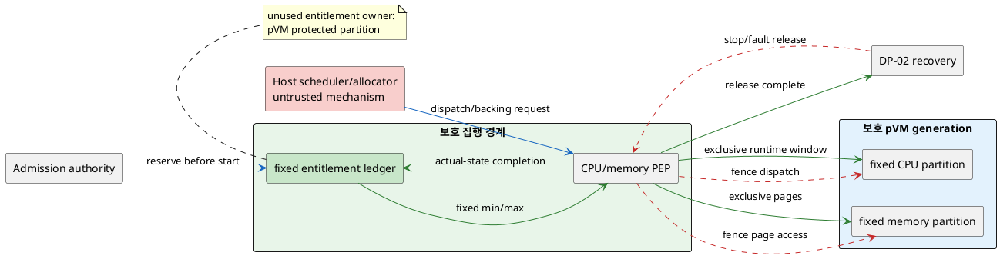
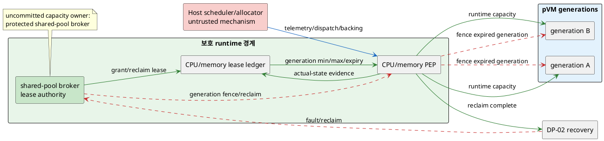

# DP-10. runtime CPU/memory entitlement와 QoS authority

## 1. 상태

평가 중

## 2. 결정 목적

여러 pVM이 동시에 실행될 때 CPU time과 memory capacity의 최소 entitlement 및
남는 capacity의 사용권을 어느 보호 경계가 소유·강제할지 정한다. 침해되거나
과부하된 Host/이웃 pVM이 Camera→AI pipeline의 30fps·처리량과 복구를 침해하지
못하게 하면서 유휴 자원, cold-start와 multi-stream 확장 비용을 함께 관리하는
것이 목적이다.

## 3. 문제 상황

### 3.1 현재 구조와 참여 주체

CUR-VOS-04는 다른 앱과 자원 경합 중에도 보안 Workload의 실시간 성능 보장을
요구하고 CUR-FR-01은 pVM 생성부터 자원 할당·회수를 관리한다. 그러나 Host
scheduler/allocator를 비신뢰로 두면서 누가 pVM별 CPU/memory entitlement와
uncommitted capacity를 authoritative하게 기록·회수할지는 정해지지 않았다.

| 참여 주체/상태 | 이 DP에서의 역할 |
|---|---|
| pVM/Workload generation | DP-03 verified identity와 DP-04 policy로 CPU/memory entitlement를 요청·소비한다. |
| Host scheduler/allocator | vCPU dispatch와 host memory backing을 수행할 수 있지만 BL-01에 따라 최종 QoS authority는 아니다. |
| protected entitlement authority/PEP | pVM별 최소·상한, 실제 allocation과 남는 capacity의 owner를 기록하고 Host 동작을 강제한다. 위치가 미정이다. |
| physical CPU/memory pool | 모든 pVM과 Host가 경쟁하는 유한 자원이다. CPU time window와 memory page lifetime은 다르지만 같은 tenant budget 정책에 포함한다. |
| DP-02 recovery owner | 장애 generation의 entitlement 회수를 다른 자원과 합성한다. entitlement의 실제 owner는 이 DP가 정한다. |
| 정상 이웃 pVM/Host | 과부하·복구 중에도 할당된 최소 QoS와 가동을 보존해야 한다. |

`entitlement`는 verified pVM generation이 일정 window에서 보장받는 CPU time과
보유 가능한 memory capacity의 보호된 권리다. 그 수명은 admission/start 전에
capacity가 reservation 또는 lease로 결합된 때 시작해 stop/fault/expiry 뒤 실제
dispatch/page 접근이 차단되고 pool 상태가 reconciliation된 때 끝난다.

### 3.2 단일 구조 변수와 XOR 범위

이 DP의 변수는 scoped pVM CPU/memory admission budget에서 **아직 쓰지 않는
capacity의 authoritative owner**다.

- fixed partition model에서는 admission 때 capacity를 protected pVM partition에 귀속하며
  실행 중 유휴분도 broker가 다른 tenant에게 빌려주지 않는다.
- shared-pool model에서는 protected runtime authority가 uncommitted capacity를
  계속 소유하고 pVM generation에 동적 lease로 대여·회수한다.
- 같은 capacity unit/window를 pVM partition과 shared broker가 동시에 소유하면
  overcommit 또는 회수 권한 충돌이 생기므로 한 deployment profile에서는 하나만
  authoritative해야 한다.
- CPU는 static, memory는 dynamic처럼 resource class별로 다른 모델을 채택하려면
  별도 profile/후속 결정으로 분리한다. 이 문서는 scoped CPU/memory admission
  budget에 동일 ownership rule을 적용해 제3 hybrid 후보를 만들지 않는다.

구체 quota 수치, scheduler algorithm, page reclaim policy와 overcommit 비율은
후보 공통 하위 설계이며 `TBD`다.

### 3.3 신뢰 경계와 인과 사슬

BL-01에 따라 Host가 보고한 vCPU runtime, RSS와 free memory만으로 entitlement
준수를 판정할 수 없다. protected PEP는 generation-bound ledger와 실제 dispatch/
mapping 상태를 대조하고 Host가 최소 entitlement를 빼앗거나 상한을 넘기지 못하게
해야 한다.

1. Host 또는 한 pVM이 CPU runqueue와 memory를 과점하고 authoritative entitlement
   강제가 없으면 Camera/AI pVM이 deadline과 buffer capacity를 잃는다.
2. 그 결과 QAS-PERF-01의 30fps/drop, PERF-06의 multi-stream throughput과
   PERF-03 capture→판단 E2E가 악화된다.
3. 필요 이상으로 큰 고정 reservation은 isolation을 단순화하지만 유휴 CPU/memory를
   회수하지 못해 동시 stream 수와 start admission을 제한한다.
4. 동적 대여는 utilization을 높일 수 있지만 runtime grant/reclaim과 protected
   accounting이 critical path에 들어가고 burst 중 reclaim jitter를 만든다.
5. 장애 generation의 entitlement가 남으면 새 pVM start가 막히고 QAS-AVL-02/04의
   회수 수렴과 누수 0을 위반한다.
6. 회수 작업이 정상 pVM의 CPU/memory를 침범하면 QAS-AVL-01/05의 이웃 무중단과
   fps 간섭 조건을 위협한다.
7. admission/entitlement 배정은 QAS-PERF-07 cold-start 구간을 소비하고 runtime
   dispatch는 PERF-01/03의 공통 critical path에 포함된다.

### 3.4 baseline, project-custom 범위와 요구 추적

| 구분 | 고정/변경 내용 |
|---|---|
| 공통 baseline | BL-01 Host 비신뢰/pKVM·TEE trust anchor, generation-bound accounting, 최소/상한 fail-closed 강제, 정상 이웃 pVM 격리 |
| 선행 공통 가정 | DP-01 실행/failure unit, DP-02 recovery trace, DP-03 verified identity와 DP-04 authorization을 입력으로 사용하되 특정 후보는 가정하지 않는다. |
| project-custom 결정 | scoped CPU/memory admission budget의 유휴 capacity를 pVM fixed partition이 보유할지 protected shared-pool authority가 보유할지 |
| 후보 공통 하위 계약 | entitlement key, CPU accounting window, memory unit, quota/상한, admission·reclaim timeout과 telemetry schema는 `TBD`다. |
| 제외 | scheduler algorithm/priority 수치, NUMA/page 제품 정책, HW lease(DP-09), Workload 검증(DP-03), 전체 pipeline 구간별 예산 배분 |
| 확인 필요 제약 | pKVM에서 Host scheduler와 backing allocation을 보호된 최소·상한으로 강제할 수 있는지, 실제 memory reclaim와 vCPU throttling primitive가 확인되지 않았다. |

| 요구/근거 | 이 문제에 주는 조건 |
|---|---|
| CUR-VOS-04 / E-004 | 다른 앱의 자원 경합에도 보안 Workload 실시간 성능을 보장한다. 구체 overhead cap은 없다. |
| CUR-FR-01 / E-017 | pVM lifecycle에서 CPU/memory 할당과 회수를 관리한다. |
| QAS-PERF-01 / E-032 | 1080p30, drop 0.1% 이하와 비격리 대비 저하 10% 이내는 예시치이며 DP-09/C-01과 공유 측정한다. |
| QAS-PERF-03 / E-034 | capture→판단 E2E p99 100ms와 상대 성능 90%는 출처 보완이 필요한 공유 값이며 DP-10은 dispatch/reclaim 구간만 같은 frame trace로 측정한다. |
| QAS-PERF-06 / E-037 | 현재 2 stream, 목표 4와 190MB/s는 가정/목표로 대표 multi-stream 측정이 필요하다. |
| QAS-PERF-07 / E-038 | cold-start p95 2초는 예시치이며 DP-01/03 및 channel 구성과 공유하는 start trace다. |
| QAS-AVL-01~05 / E-046~050 | 장애 격리, 동일 trace의 bounded 회수, 자동 주입, 누수 0과 정상 이웃 fps 간섭을 검증한다. DP-10은 하위 회수 구간만 기록하고 전체 예시 예산을 재청구하지 않는다. |
| A-02 / E-085 | CPU/메모리 quota ownership과 QoS 격리는 기존 DP 밖의 구조 공백이다. |

현재 구조 변수는 **uncommitted runtime capacity의 authoritative owner** 하나다.
성능 목표는 후보를 선택하는 평가 기준이지 별도 구조 변수나 미리 정한 quota가
아니다.

## 4. 결정 질문

> scoped pVM CPU/memory admission budget의 capacity를 시작 전에 fixed protected partition으로 귀속할 것인가, protected runtime authority가 shared pool로 소유하며 generation별로 동적 대여·회수할 것인가?

## 5. 후보 구조

### 5.1 후보 A: start 전 fixed protected partition

- admission authority가 pVM generation start 전에 CPU time partition과 memory page
  capacity를 고정 예약하고 protected PEP가 최소·상한을 강제한다.
- partition의 유휴 entitlement는 해당 pVM 수명 동안 다른 tenant에게 대여하지
  않으며 stop/fault 뒤에만 pool로 반환한다.
- Host scheduler/allocator는 partition 안에서 dispatch/backing을 수행하지만 다른
  partition의 entitlement를 빼앗지 못한다.
- runtime grant/reclaim 조정을 줄여 예측 가능한 isolation을 제공할 수 있지만 peak
  기준 reservation이 유휴 자원과 admission 실패를 늘릴 수 있다.

### 5.2 후보 B: protected shared-pool runtime broker

- protected runtime authority가 CPU/memory shared-pool ledger와 uncommitted capacity를
  소유하고 verified pVM generation에 bounded lease로 대여한다.
- broker가 최소 entitlement, 상한, lease expiry와 reclaim priority를 결정한다.
  Host scheduler/allocator는 dispatch/page mapping 실행 메커니즘이고 protected PEP가
  broker의 lease 범위로 그 동작을 강제한다.
- load/stream/start/recovery 변화에 따라 grant/reclaim하고 actual state를 ledger와
  reconciliation한다. Host telemetry는 검증된 accounting과 함께 사용한다.
- 유휴 capacity를 다른 pVM에 활용할 수 있지만 runtime accounting/reclaim jitter,
  broker TCB와 authority 장애 복구가 추가된다.

같은 capacity unit/window의 유휴 사용권은 pVM partition 또는 broker 중 하나만
보유한다. fixed minima 위에 broker가 같은 유휴분을 대여하는 결합은 이 문서의
fixed 후보 정의를 깨므로 XOR invariant를 위반한다. resource class별 다른 profile은
별도 결정이며 현재 비교의 제3후보가 아니다.

## 6. 후보별 구조 다이어그램

두 그림은 admission/grant에서 stop/fault 회수 완료까지 같은 관점을 사용한다. 파란
실선은 control, 초록 실선은 protected entitlement/evidence, 빨간 점선은
fence/reclaim이다.

### 6.1 후보 A

### 6.2 후보 B

## 7. 후보별 동작 구조

### 7.1 공통 entitlement 계약

- key는 verified pVM identity/generation, resource class, min/max, accounting window와
  expiry를 포함한다.
- Host가 최소를 빼앗거나 상한을 넘기면 protected PEP가 fail-closed로 거부한다.
- stop/fault 뒤 dispatch/page access를 fence하고 ledger/actual state를 대조한 뒤
  capacity를 재사용한다.
- PERF-01/03/07과 AVL-02는 중앙 공유 trace의 자기 구간만 기록한다.

### 7.2 후보 A 흐름

1. admission 때 peak/profile과 policy로 fixed CPU/memory partition을 예약한다.
2. PEP가 reservation 확인 뒤 pVM start를 허용한다.
3. Host는 partition 범위 안에서만 dispatch/backing을 수행한다.
4. 유휴분은 pVM generation에 남아 runtime 대여·reclaim이 없다.
5. stop/fault 뒤 전체 partition을 fence/reconcile해 pool로 반환한다. 부족하면 start를
   거부하므로 overcommit으로 기존 partition을 침해하지 않는다.

### 7.3 후보 B 흐름

1. broker가 admission 시 최소 lease와 필요 상한을 ledger에 기록한다.
2. PEP가 Host dispatch/page allocation을 lease 범위로 강제한다.
3. broker가 검증된 load/accounting으로 uncommitted capacity를 추가 grant한다.
4. pressure/fault/expiry 때 상한 초과분부터 reclaim하되 최소 entitlement는 보존한다.
5. broker/PEP 장애나 actual-state 불일치에서는 신규 grant를 막고 reconciliation 후
   완료한다. 회수 실패 capacity는 재대여하지 않는다.

## 8. 품질속성 비교

### 8.1 평가 항목 추적

| 품질속성 | 요구 ID | 충돌/위험 | 평가 방식 | 출처 |
|---|---|---|---|---|
| deadline/처리량 | PERF-01/03/06 | 경합·reclaim jitter 또는 과도한 reservation | 동일 frame/stream trace | E-032, E-034, E-037 |
| 시작 성능 | PERF-07 | reservation/lease admission이 cold start 소비 | shared start trace | E-038, `03_DP_목록.md` 4절 |
| 자원 효율 | CUR-VOS-04 | 유휴 partition 또는 broker state/fragmentation | utilization/admission KPI | E-004 |
| 장애·복구 | AVL-01~05 | stale entitlement와 회수 간섭 | fault/reconciliation gate | E-046~050 |

### 8.2 필수 gate

| gate | 요구 ID | 판정 기준 | 공통 조건/방법 | 후보 A | 후보 B | 출처 |
|---|---|---|---|---|---|---|
| 최소 entitlement 격리 | CUR-VOS-04, PERF-01 | Host/이웃 overload에서도 승인 최소 침해 0 | 동일 pVM/load와 CPU/memory pressure | 확인 필요 | 확인 필요 | E-004, E-032 |
| 상한/owner 강제 | BL-01 | 무권한 dispatch/page 접근과 ledger/actual mismatch 0 | Host mutation, stale generation, over-allocation 주입 | 확인 필요 | 확인 필요 | E-025, E-065 |
| 이웃 무중단 | AVL-01/05 | fault/reclaim로 정상 pVM downtime 0 | crash/OOM/hang 중 정상 fps/가동 측정 | 확인 필요 | 확인 필요 | E-046, E-050 |
| bounded 회수·누수 | AVL-02/04 | 회수 완료/fail-closed, capacity leak 0 | 동일 failure trace와 반복 reconciliation | 확인 필요 | 확인 필요 | E-047, E-049 |
| protected enforcement feasibility | A-02 | Host scheduler/backing에 min/max/fence 강제 가능 | prototype, EL2/PEP diff와 accounting probe | 확인 필요 | 확인 필요 | E-085 |

### 8.3 KPI와 후보 평가

| 품질속성 | KPI | 계산식/단위 | 방향 | 공통 조건 | gate/별점 | 출처 |
|---|---|---|---|---|---|---|
| frame 성능 | fps/drop/상대 저하 | delivered fps, dropped/total, protected/baseline / %, % | fps↑, drop/저하↓ | 같은 1080p30/SoC/load | PERF-01 예시, 별점 `TBD` | E-032 |
| multi-stream | sustained streams/throughput | deadline 충족 stream 수 / 개, MB/s | 클수록 유리 | 같은 model/frame/bandwidth | 2/4/190은 가정, 별점 `TBD` | E-037 |
| utilization | CPU/memory utilization | used/entitled capacity / % | 조건부 클수록 유리 | 같은 workload mix/window | 임계값·별점 `TBD` | 측정 필요 |
| start | entitlement segment | `t(entitlement ready)-t(admission)` / ms, p95 | 작을수록 유리 | cold start 동일 trace | PERF-07 공유 배분 `TBD` | E-038 |
| reclaim | resource reclaim segment | `t(actual free)-t(fault/stop accepted)` / ms, p99 | 작을수록 유리 | 같은 failure/load | AVL-02 공유 배분 `TBD` | E-047 |

실측과 승인 구간이 없어 별점을 부여하지 않는다.

| KPI | 후보 A 값/별점 | 후보 A 구조 근거 | 후보 B 값/별점 | 후보 B 구조 근거 |
|---|---|---|---|---|
| QoS gate | 확인 필요 / 해당 없음 | fixed partition 강제와 peak sizing을 검증해야 한다. | 확인 필요 / 해당 없음 | broker min/max/lease와 PEP 강제를 검증해야 한다. |
| frame/multi-stream | TBD / 미부여 | runtime reclaim jitter는 적지만 유휴 reservation이 admission을 제한한다. | TBD / 미부여 | 유휴분을 활용하지만 grant/reclaim jitter와 contention이 있다. |
| utilization | TBD / 미부여 | 유휴 entitlement를 대여하지 않는다. | TBD / 미부여 | uncommitted capacity를 동적으로 대여한다. |
| start/reclaim | TBD / 미부여 | start reservation과 종료 시 전체 반환이 있다. | TBD / 미부여 | admission lease와 runtime/장애 reclaim이 있다. |

## 9. 핵심 트레이드오프

> 후보 A는 runtime entitlement 변동을 줄여 예측 가능한 isolation과 단순한 accounting을 제공할 가능성이 있다. 대신 peak reservation의 유휴 CPU/memory, 낮은 admission·multi-stream 효율과 start 전 예약 비용이 생긴다.

> 후보 B는 uncommitted capacity를 workload 사이에 재사용해 utilization과 burst 대응을 높일 가능성이 있다. 대신 protected broker/ledger TCB, runtime grant·reclaim jitter와 authority 장애 복구가 추가된다.

두 후보 모두 QoS/상한, 이웃 무중단, 회수·누수와 enforcement feasibility gate가
`확인 필요`다. 대표 frame/stream/utilization/start/reclaim 측정 전에는 우위를
확정하지 않는다.

## 10. 검증 기준

| 검증 항목 | 공통 환경과 방법 | 판정/기록 기준 | 근거 유형 |
|---|---|---|---|
| overload 격리 | Host/이웃 CPU·memory pressure와 quota mutation | 승인 최소 침해/상한 초과 0, fps/drop | 대표 PoC 필요 |
| multi-stream | 동일 SoC/model/frame에서 stream 수를 증가 | sustained streams, MB/s, deadline miss | 대표 부하 시험 필요 |
| cold start | pVM 미생성부터 entitlement ready/first frame timestamp | DP-10 segment와 PERF-07 E2E | 통합 시험 필요 |
| fault/reclaim | crash/hang/OOM/broker·PEP 장애와 actual-state 불일치 | 회수 p99, leak 0, 정상 이웃 영향 | fault injection 필요 |
| utilization | 동일 workload mix에서 idle/burst/steady window | used/reserved/leased capacity와 admission 거부 | 장기 부하 시험 필요 |
| protected 변경 | scheduler/backing PEP, ledger/broker diff와 build | KLoC/ABI/state, legacy 제약 영향 | prototype/build 필요 |

PlantUML 표식은 검사하지만 로컬 renderer가 없어 실제 렌더링 결과는 `확인 필요`다.

## 11. 검토 결과

| 쟁점 | Claude 의견 | Codex 의견 | 원문 근거 | 해결 | 남은 확인 |
|---|---|---|---|---|---|
| PERF-03 추적 누락 | 인과 사슬에는 있으나 요구 표에 PERF-03 공유 예산/비재청구가 없다. | DP-10 dispatch/reclaim 구간만 중앙 frame trace에 연결해야 한다. | QAS-PERF-03 / E-034 | 3.4절에 PERF-03 공유 행을 추가하고 7.1·8.3절에서 같은 trace를 사용했다. | PERF-03 출처와 구간 배분 승인 |
| protected fixed partition | fixed 모델의 partition이 보호된 경계라는 표현이 한 문장에서 빠졌다. | Host reservation과 구분되도록 protected ownership을 일관되게 표시한다. | BL-01; A-02 | 3.2와 5~7절에서 `protected pVM partition`으로 명시했다. | protected enforcement feasibility |
| AVL 공유 예산 | AVL-01~05 수치를 공유라고만 하면 DP-08보다 비재청구 규칙이 약하다. | DP-10 하위 회수 구간만 청구한다고 명시해야 한다. | QAS-AVL-02 / E-047; `03_DP_목록.md` 4절 | 3.4와 7.1에 전체 예산 비재청구를 추가했다. | 병렬/직렬 critical path 측정 |
| 문제축 1차 검토 | 단일 owner 축, XOR/hybrid 배제, 선행 비선결, Host 비신뢰와 quota TBD는 통과했다. | 통과 항목을 후보 공통 gate로 유지한다. | PLAN 단계 6 | 5~10절에 반영했다. | 후보/평가 2차 검토 |
| 후보/평가 Claude 검토 | 두 후보/XOR, resource scope, 대칭 gate/KPI, 공유 예산, feasibility, 상태와 공란 결정은 통과했다. 후보 B가 Host를 PEP로 부른 문장과 그림의 fence/복구 완료 방향, 범례, 로그 절 범위를 고쳐야 한다. | Host 실행 메커니즘과 protected enforcement를 분리하고 두 그림의 lifecycle을 같은 수준으로 표시한다. | BL-01; A-02 / E-085; PLAN 단계 7 | Host는 mechanism, protected PEP는 enforcer로 수정하고 양쪽 그림에 fence/reclaim·completion과 색상 설명을 추가했다. 로그 참조는 3.4·7.1·8.3절로 정정했다. | representative enforcement PoC와 예산 배분 |

## 12. 최종 결정
