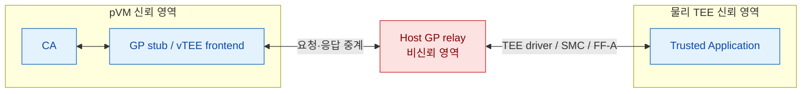
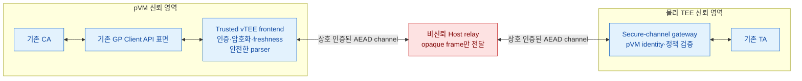

# pVM–Host 중계–GlobalPlatform TEE 구간의 양방향 보안 분석

> 관련 문서: [품질 위협 문제 3: pVM–GlobalPlatform 표준 연동 경로 부재](품질위협_문제3_GlobalPlatform_연동.md)

## 1. 조사 목적

pVM 내부에서 실행되는 Client Application(CA)이 물리 TEE의 Trusted Application(TA)을 GlobalPlatform TEE
Client API로 호출하되, 비신뢰 Host가 요청과 응답을 중계하는 구조를 분석한다.

이 문서는 다음 질문에 답한다.

1. pVM 내부 소프트웨어의 기밀성과 무결성을 보장해도 Host 중계가 새로운 보안 공백을 만드는가?
2. TEE가 악성 CA를 가정한다는 기존 보안 원칙으로 이 공백을 방어할 수 있는가?
3. Host의 요청·응답 관찰, 변조, 위조, 재전송과 라우팅 변경을 어느 계층에서 막아야 하는가?
4. 기존 CA와 TA를 수정할 수 있는 경우와 수정할 수 없는 경우의 해법은 무엇인가?

## 2. 핵심 결론

**pVM의 기밀성과 무결성 보장은 pVM의 private memory와 실행 상태를 Host로부터 보호하지만, Host가 제공하는
가상 I/O의 진위를 보장하지 않는다.** Host는 pVM 메모리를 직접 변경하지 않고도 정상적인 중계 경로를 통해
위조한 GP 응답을 입력할 수 있다.

또한 **TEE의 악성 CA 방어는 요청을 받는 TEE를 보호할 뿐, 응답을 받는 pVM을 Host의 위조로부터 보호하지
않는다.** 따라서 pVM의 보호 속성을 TEE 서비스 결과까지 확장하려면 pVM 내부 신뢰 종단점과 TEE 내부 신뢰
종단점 사이에 Host를 배제한 양방향 인증·암호 채널이 필요하다.

| 구분 | pVM 또는 TEE가 기본 제공하는 방어 | Host 중계 시 남는 공백 |
|---|---|---|
| pVM 격리 | Host의 pVM private memory 직접 읽기·쓰기 차단 | Host가 가상 I/O로 악성 메시지 입력 가능 |
| 검증된 부팅·attestation | 알려진 이미지와 설정으로 부팅했음을 증명 | 런타임 비침해와 통신 상대의 진위는 증명하지 않음 |
| TA의 입력 검증 | 악성 CA 요청으로부터 TEE와 키를 보호 | Host가 TA 응답을 위조해 정상 CA의 판단을 변경할 수 있음 |
| GP Client API | 세션·명령·파라미터·공유 메모리의 API 의미 제공 | 종단간 기밀성·무결성·freshness를 제공하지 않음 |

최종 보안 원칙은 다음과 같다.

> **GP Client API와 Host 중계는 비신뢰 transport로만 사용하고, 보안 판단은 pVM과 TEE 사이에서 인증된 내부
> 응답에만 근거해야 한다.**

## 3. 전제와 신뢰 경계

### 3.1 분석 전제

- pKVM과 pvmfw의 격리·검증 부팅 기능은 정상 동작한다.
- pVM 내부의 CA, Guest OS와 신뢰 모듈의 코드·메모리는 Host의 직접 관찰과 변조로부터 보호된다.
- 물리 TEE와 TA의 코드·키·private memory는 보호된다.
- Host Android, Host kernel, VMM, GP relay와 Host가 관리하는 공유 메모리는 침해될 수 있다.
- Host는 메시지 관찰, 삭제, 지연, 변조, 위조, 중복, 재전송과 라우팅 변경을 수행할 수 있다.
- Host가 relay와 pVM scheduling을 통제하므로 가용성은 보장할 수 없다.

### 3.2 구조



pVM 격리는 Host가 `CA` 또는 `VTEE`의 private memory를 직접 수정하지 못하게 한다. 그러나 `VTEE`가 Host에서
받은 바이트를 정상 TA 응답으로 해석하면, Host는 허용된 I/O 경로를 통해 CA의 입력과 판단을 통제할 수 있다.
이는 pVM memory integrity 위반이 아니라 **인증되지 않은 외부 입력의 수용**이다.

## 4. 요청과 응답 방향의 비대칭

### 4.1 요청 방향: pVM CA 또는 Host에서 TEE로

GlobalPlatform TEE Client API 명세는 CA가 TEE 보안 경계 밖에 있으므로 침해되거나 고의로 악성일 수 있다고
가정한다. 또한 Shared Memory를 신뢰할 수 없고 실행 중 언제든 변경될 수 있는 volatile data로 취급하도록
TEE와 TA에 요구한다.

따라서 TA가 다음 원칙을 따르면 악성 CA나 Host가 TEE 자체를 침해하는 위험을 줄일 수 있다.

- 모든 명령 ID, type, length, offset과 payload 검증
- Shared Memory를 TEE private memory로 복사한 뒤 복사본만 검증·사용
- 키 사용 목적과 허용 명령을 최소 권한으로 제한
- 호출 횟수, 사용자 인증, 금액·대상·정책 등의 의미 검증
- 세션과 persistent state의 일관성 검증

그러나 GP login token의 신뢰도는 이를 생성하는 Rich OS의 보안 수준에 한정된다. 비신뢰 Host가 pVM을 대신해
`TEEC_LOGIN_APPLICATION` 등의 신원 정보를 제시하면, TA는 GP login 정보만으로 실제 pVM CA와 Host의 사칭
요청을 구분할 수 없다.

### 4.2 응답 방향: TEE에서 Host를 거쳐 pVM으로

TA의 악성 CA 방어는 pVM으로 반환되는 응답의 진위를 보장하지 않는다. Host는 다음처럼 정상 응답을 폐기하고
위조한 성공 결과를 pVM에 전달할 수 있다.

```text
pVM CA ── verify(document) ──▶ Host ──▶ TA

                                Host가 정상 응답 폐기
pVM CA ◀── TEEC_SUCCESS,
           result = VALID ───── Host
```

CA의 코드와 메모리가 정상이어도 CA가 위조 결과를 신뢰하면 보안 판단이 깨진다. 특히 다음 연산은 영향이 크다.

- 서명·인증 검증 결과의 `true`/`false`
- 복호화된 평문 또는 인증된 데이터
- 키 생성 후 반환되는 공개키와 key handle
- secure storage에서 읽은 정책·버전·상태
- 결제·권한 부여·업데이트 승인 결과

암호 채널이 없으면 Host는 응답 위조뿐 아니라 TEE가 pVM으로 반환하는 평문도 관찰할 수 있다. 따라서 pVM의
기밀성도 pVM memory 경계에서 끝나며 TEE 통신 결과까지 자동으로 확장되지 않는다.

## 5. 공격 시나리오와 영향

| Host 공격 | 보호가 없을 때의 결과 | 필요한 방어 | 방어 후 남는 영향 |
|---|---|---|---|
| 요청 payload 관찰 | 평문·인증 정보 노출 | 종단간 암호화 | 길이·타이밍 노출 가능 |
| 요청 command·인자 변조 | 다른 키 연산 또는 대상 처리 | 인증된 command semantics | 인증 실패·DoS |
| pVM 사칭 세션 개설 | Host가 pVM 권한으로 TA 사용 | pVM DICE identity 검증 | 세션 차단·DoS |
| 정상 응답을 위조 성공으로 교체 | CA의 보안 판단 우회 | TA가 인증한 inner response | 인증 실패·DoS |
| 과거 정상 응답 재전송 | 이전 상태·정책·검증 결과 재사용 | request ID, nonce, counter | 인증 실패·DoS |
| 다른 세션·명령 응답 끼워 넣기 | response splicing | session·command binding | 인증 실패·DoS |
| length·offset 조작 | GP stub parser 침해 가능 | bounds check, copy, memory safety | 비정상 입력 거부 |
| 응답 삭제 또는 지연 | 성공 여부 불명확, 재시도 중복 실행 | timeout, idempotency, 결과 조회 | 가용성 저하·모호한 완료 상태 |
| pVM 종료·미스케줄링 | 서비스 중단 | 탐지·복구·상위 fallback | 근본 방지 불가능 |

## 6. GP 외부 상태와 인증된 내부 결과의 분리

`TEEC_Result`, `returnOrigin`과 일부 parameter metadata는 TA가 아니라 GP Client API, driver 또는 통신 계층이
생성할 수 있다. 그러므로 모든 외부 GP 값을 TA의 동일한 AEAD envelope에 넣는 것은 불가능하거나 과도하다.

보다 현실적인 규칙은 **외부 GP 결과를 비신뢰 transport 상태로 강등하고, TA가 인증한 내부 결과만 보안 판단에
사용하는 것**이다.

### 6.1 외부 GP 결과 처리 규칙

- 외부 `TEEC_Result`, `returnOrigin`, session handle과 parameter metadata를 신뢰하지 않는다.
- 외부 오류는 통신 실패로 처리할 수 있지만 보안 상태의 증거로 사용하지 않는다.
- 외부 성공만으로 명령 성공, 검증 성공 또는 상태 변경 완료를 판단하지 않는다.
- 외부 성공 시에도 반드시 TA가 인증한 inner response를 검증한다.
- inner response가 없거나 인증에 실패하면 fail-closed한다.
- outer length와 offset은 private memory 복사 전에 안전 범위만 확인한다.
- 보안 의미가 있는 실제 길이, command, status와 payload는 inner response에 포함한다.

### 6.2 인증된 inner response의 필수 항목

```text
AuthenticatedResponse {
    protocol_version,
    secure_session_id,
    request_id,
    request_counter,
    command_id,
    semantic_status,
    payload_type,
    payload_length,
    payload,
    policy_version
}
```

전체 구조를 AEAD로 보호하거나 서명·MAC으로 인증한다. 요청의 hash 또는 request ID를 응답에 포함하여 Host가
다른 요청의 정상 응답을 현재 요청에 재사용하지 못하게 한다.

이 규칙이 적용되면 다음과 같이 Host의 결과 위조를 DoS로 축소할 수 있다.

- Host가 외부 성공을 위조하면 유효한 inner response가 없어 거부한다.
- Host가 외부 오류를 위조하면 정상 응답을 버리게 만들 수 있지만 보안 성공을 위조하지는 못한다.
- Host가 과거 inner response를 재전송하면 request ID와 counter가 달라 거부한다.
- Host가 응답을 변조하면 AEAD 인증이 실패한다.

## 7. 애플리케이션 계층 AEAD가 충분한 조건

CA와 TA를 수정할 수 있다면 GP Client API를 비신뢰 byte transport처럼 사용하고 애플리케이션 프로토콜에서
종단간 보안을 구축할 수 있다. `TEEC_OpenSession` 자체를 신뢰할 필요는 없다. 외부 세션이 열린 뒤 TA identity를
검증하는 handshake가 성공하기 전까지 세션을 미인증 상태로 유지하면 된다.

다음 조건이 모두 필요하다.

1. CA가 Host가 바꿀 수 없는 trust anchor로 TA identity를 검증한다.
2. TA가 DICE certificate chain과 허용 정책으로 pVM·Workload identity를 검증한다.
3. 양측 nonce와 ephemeral ECDH key를 handshake transcript와 identity에 binding한다.
4. command, session, request ID, counter, type, 실제 length와 semantic status를 AEAD로 인증한다.
5. CA는 outer GP 성공 여부가 아니라 인증된 inner response만 신뢰한다.
6. counter·nonce·persistent state로 세션 내 재전송과 재부팅 후 rollback을 방지한다.
7. 응답 유실 후 재시도로 연산이 중복되지 않도록 명령을 idempotent하게 만들거나 request ID별 결과 조회를 제공한다.
8. pVM GP stub은 Host 메시지를 인증하기 전에도 안전하도록 별도로 hardening한다.

TA 공개키를 Host가 일반 메시지로 전달하면 Host가 자신의 키로 교체할 수 있다. 공개키는 ROM·bootloader·pvmfw로
이어지는 검증 경로, 제조사 certificate chain 또는 pVM 이미지에 고정된 trust anchor로 제공해야 한다.

Android Secretkeeper는 유사한 구조의 참고 사례다. pVM과 TEE 서비스가 AuthGraph key exchange로 보안 채널을
만들고 DICE policy로 client를 통제한다. Secretkeeper identity public key는 bootloader와 pvmfw가 검증할 수 있는
device tree 경로를 통해 pVM에 제공된다.

## 8. 애플리케이션 AEAD로 해결할 수 없는 영역

Host 메시지는 애플리케이션의 AEAD 검증 전에 pVM의 virtual device frontend와 GP stub parser에 도달한다.
Host가 악성 descriptor, length, offset과 parameter type을 주입해 parser 취약점을 공격하면 인증 검증에 도달하기
전에 pVM 내부 신뢰 코드가 침해될 수 있다.

이는 CA 비즈니스 로직이 아니라 pVM platform 또는 GP runtime 공급자의 책임이다.

- Host 입력을 네트워크 공격자의 입력과 동일하게 취급한다.
- 최소 크기의 고정 framing과 명시적인 최대 크기를 사용한다.
- 모든 length, offset, count 연산에 overflow 검사를 적용한다.
- Host가 접근하는 shared memory를 pVM private memory로 복사한 뒤 복사본만 파싱한다.
- 인증·검증 후 원본 shared memory를 다시 읽지 않는다.
- memory-safe 언어, fuzzing과 malformed-frame 오류 주입 시험을 적용한다.
- 가능하면 GP stub을 CA와 별도 프로세스 또는 protection domain으로 격리한다.
- parser는 신뢰 결정을 하지 않고 framing과 byte 전달만 수행한다.

pVM integrity는 **취약한 parser 코드가 변조되지 않았음**을 보장할 수 있지만, 그 코드가 악성 입력에 안전하다는
것까지 보장하지는 않는다.

## 9. CA와 TA를 수정할 수 없는 경우

기존 CA와 TA가 애플리케이션 종단간 프로토콜을 이해하지 못하면 payload AEAD를 적용할 수 없다. 이 경우 pVM과
TEE 플랫폼에 투명한 보안 계층을 추가해야 한다.



- pVM의 trusted vTEE frontend는 기존 GP API를 CA에 그대로 제공한다.
- TEE secure-channel gateway는 채널을 종단하고 검증된 호출만 기존 TA로 전달한다.
- Host는 opaque ciphertext frame을 전달하는 bit pipe로만 동작한다.
- gateway는 검증한 pVM identity와 정책을 기존 TA 호출자의 권한으로 안전하게 mapping해야 한다.
- 플랫폼 채널은 여러 TA를 지원한다면 TA UUID, command와 session namespace도 인증 범위에 포함해야 한다.

CA·TA와 양쪽 플랫폼 중 어느 것도 수정할 수 없으면서 Host를 신뢰하지 않는다면 이 문제를 암호학적으로 해결할
수 없다. 이때는 구조 변경 없이는 Host의 응답 위조와 평문 관찰 가능성을 보안 요구사항과 양립시킬 수 없다.

## 10. Attestation의 역할과 한계

Android AVF에서 pKVM은 Host와 pVM을 상호 불신 영역으로 격리하고, pvmfw와 Microdroid는 DICE certificate
chain과 measurement를 다음 단계로 전달한다. 이를 이용하면 TA 또는 보안 gateway가 허용한 pVM 이미지,
Workload, 버전과 debug 상태인지 확인할 수 있다.

Attestation이 제공하는 것:

- 특정 trust chain에서 측정된 pVM 이미지와 설정의 증거
- pVM 인스턴스가 소유한 key와 측정 상태의 binding
- 알려진 Workload·버전·정책을 기준으로 한 접근 통제 근거
- pVM과 TEE 같은 격리 환경 사이의 상호 인증 기반

Attestation이 제공하지 않는 것:

- 부팅 후 CA 취약점이 악성 입력으로 exploit되지 않았다는 증거
- CA의 business logic과 사용자 의도가 올바르다는 증거
- Host 중계 메시지의 암호화·무결성·freshness
- Host에 의한 지연·삭제·종료 방지
- 모든 side channel 방지
- 검증자가 오래된 취약 버전을 허용하지 않는다는 보장

따라서 attestation은 보안 채널의 **신원과 키 bootstrap 근거**로 사용해야 하며 보안 채널 자체를 대체할 수 없다.

## 11. Rollback, 재전송과 불명확한 완료 상태

세션 counter는 현재 세션의 재전송을 막지만 재부팅 이후 Host가 과거 pVM disk나 상태를 복구하는 rollback까지
자동으로 막지는 않는다.

- TA의 rollback-protected secure storage 또는 monotonic state를 사용한다.
- pVM persistent state는 sealing key만으로 기밀화하지 말고 version policy와 rollback 방지를 결합한다.
- Android의 일반 pVM encrypted storage는 세부 block 단위 rollback 보호에 한계가 있으므로 Secretkeeper 같은
  policy-gated, rollback-protected storage를 고려한다.
- update 허용과 downgrade 금지 규칙을 DICE policy와 최소 허용 버전으로 표현한다.

또한 Host가 TA에 요청은 전달하고 정상 응답만 버릴 수 있다. CA는 연산이 실행됐는지 알 수 없으므로 단순 재시도
시 상태 변경이 중복될 수 있다. 이를 막으려면 다음이 필요하다.

- 전역 또는 client별 unique request ID
- 동일 request ID에 대한 TA의 idempotent 처리
- 처리 결과의 persistent 기록과 조회 API
- timeout 후 무조건 재실행하지 않는 상태 기계

종단간 인증은 결과 위조를 막지만 분산 시스템의 불명확한 완료 상태를 자동으로 해결하지는 않는다.

## 12. 보안 요구사항

1. Host는 pVM–TEE 구간에서 신뢰 주체가 아니라 비신뢰 transport로 취급한다.
2. pVM과 TEE의 신뢰 종단점은 상호 identity를 검증한 뒤 세션 키를 수립한다.
3. GP login token만으로 pVM 또는 Workload identity를 인증하지 않는다.
4. 모든 보안 성공 판단은 인증된 inner response에만 근거한다.
5. command, session, request ID, counter, 실제 type·length·status를 암호학적으로 binding한다.
6. 인증 실패·누락·불일치는 항상 fail-closed한다.
7. Shared Memory와 Host frame은 volatile하고 악성인 입력으로 취급한다.
8. pVM frontend는 인증 이전 malformed input에도 memory-safe해야 한다.
9. persistent state는 rollback 방지 정책을 갖는다.
10. 응답 유실과 재시도는 idempotency와 결과 조회로 처리한다.
11. Host가 유발할 수 있는 DoS, traffic analysis와 일부 side channel을 잔여 위험으로 명시한다.

## 13. 검증 항목

| 시험 | 기대 결과 |
|---|---|
| Host가 요청 payload bit를 변경 | TA 인증 실패, 연산 미수행 |
| Host가 TA 응답을 임의 성공값으로 교체 | CA inner 인증 실패, 보안 성공 판단 없음 |
| 과거 정상 응답 재전송 | request ID·counter 불일치로 거부 |
| 다른 command·session 응답 교환 | binding 불일치로 거부 |
| Host가 TA 또는 pVM identity key 교체 | trust anchor 검증 실패 |
| outer `TEEC_Result` 성공 위조 | inner response 부재로 거부 |
| outer `TEEC_Result` 오류 위조 | 통신 실패 처리, 보안 상태 변경 없음 |
| length·offset 최댓값과 overflow 입력 | frontend가 안전하게 거부, crash 없음 |
| shared memory를 검증 직후 변경 | private copy만 사용하여 처리 결과 불변 |
| 정상 요청 전달 후 응답 삭제 | timeout·결과 조회, 중복 상태 변경 없음 |
| pVM persistent state rollback | TA 또는 rollback-protected service에서 탐지·거부 |
| Host의 메시지 관찰 | 암호문과 허용된 metadata 외 민감정보 노출 없음 |

정량 판정 기준의 예시는 다음과 같다.

- 위조·변조·재전송 응답을 보안 성공으로 수용한 건수: **0건**
- 비인가 pVM 또는 허용되지 않은 Workload의 TA 명령 수용 건수: **0건**
- Host에서 관찰 가능한 평문·키·인증 정보: **0건**
- malformed GP frame 시험에서 pVM frontend crash·memory corruption: **0건**
- 동일 request ID 재처리로 발생한 중복 상태 변경: **0건**

## 14. 잔여 위험

종단간 인증·암호 채널을 적용해도 Host가 relay와 scheduling을 통제하는 한 다음 위험은 남는다.

- 요청과 응답의 삭제·무기한 지연
- pVM의 일시 정지 또는 종료
- TEE interrupt의 지연과 resource starvation
- 메시지 크기, 빈도와 타이밍 관찰
- 일부 cache·interrupt·전력 기반 side channel
- 요청 실행 후 응답 유실로 인한 일시적인 완료 상태 불확실성

따라서 목표는 Host의 모든 공격을 제거하는 것이 아니라 **기밀성 침해와 결과 위조를 방지하고, Host가 만들 수
있는 최대 영향을 탐지 가능한 DoS와 제한된 metadata 노출로 축소하는 것**이다.

## 15. 참고 자료

- [GlobalPlatform TEE Client API Specification v1.0](https://globalplatform.org/wp-content/uploads/2010/07/TEE_Client_API_Specification-V1.0.pdf)
  - §2.2: TEE 분리 방식과 보안 수준은 명세 범위 밖
  - §3.4.1: CA를 잠재적으로 침해·악성인 주체로 간주
  - §3.4.1: Shared Memory를 untrusted·volatile로 간주
  - §3.4.1: login token 신뢰도는 Rich OS 보안 수준에 한정
- [Android Virtualization Framework overview](https://source.android.com/docs/core/virtualization)
- [Android AVF Security](https://source.android.com/docs/core/virtualization/security)
  - pVM과 Host의 상호 불신, pVM memory 격리, DICE와 가용성 한계
- [Android Microdroid](https://source.android.com/docs/core/virtualization/microdroid)
  - pVM sealing key, attestation key와 Binder RPC 구조
- [Applications of DICE](https://source.android.com/docs/security/features/dice/applications-of-dice)
  - 서로 격리된 환경의 identity와 상호 인증
- [Android Secretkeeper](https://android.googlesource.com/platform/system/secretkeeper/)
  - AuthGraph 보안 채널, DICE policy, rollback-protected secret과 pVM의 TEE 서비스 이용 사례

