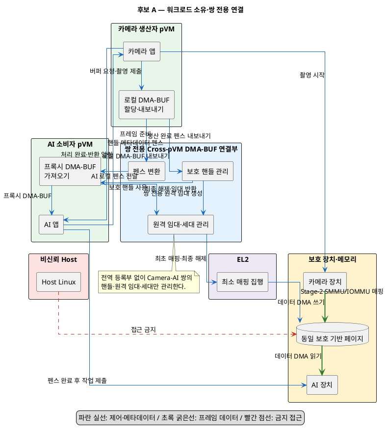
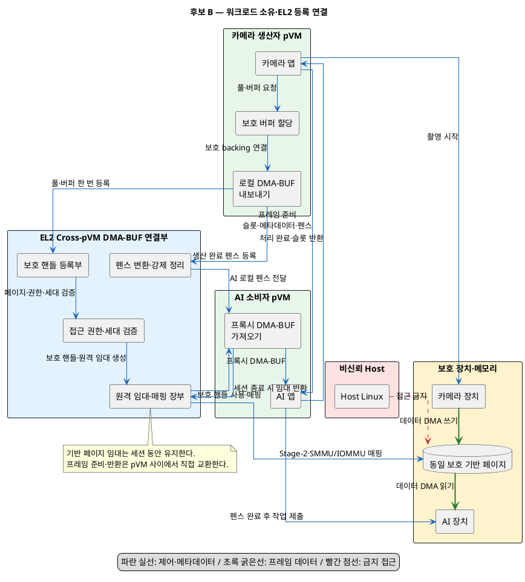
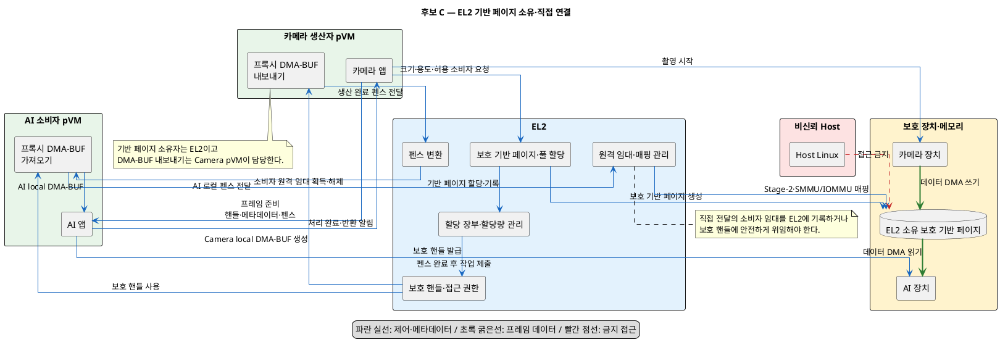
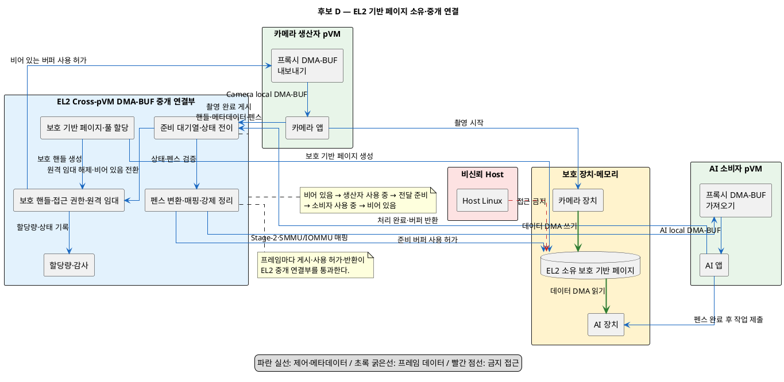

# 문제 1. DMA-BUF 생성·전달 4개 구조 품질 평가

## 1. 평가 목적

Camera Producer pVM과 AI Consumer pVM 사이에서 동일한 보호 backing page를 DMA-BUF로
사용할 때, allocation authority와 전달 중계 위치에 따라 다음 네 구조를 비교한다.

| 후보 | Allocation authority | Bridge와 전달 방식 |
|---|---|---|
| A. Workload-Owned Pair Bridge | Producer workload | pair-local Bridge translation 후 직접 notification |
| B. Workload-Owned EL2 Registered Bridge | Producer workload | EL2 Bridge 등록·redeem 후 직접 notification |
| C. EL2-Backed Direct Bridge | EL2 backing allocator | Producer가 local exporter로 사용 후 직접 notification |
| D. EL2-Backed Brokered Bridge | EL2 backing allocator | Producer가 EL2에 publish하고 Consumer가 acquire |

평가 품질속성은 다음과 같다.

- 성능과 latency predictability
- 보안 통제력과 EL2 TCB 최소성
- crash recovery와 가용성
- 시나리오 확장성
- 처리량 확장성과 장애 격리
- 유지보수성과 변경 용이성
- 자원 통제와 관측 가능성

## 2. 용어와 평가 전제

### 2.1 EL2는 Linux DMA-BUF 객체를 직접 생성하지 않는다

Linux의 `struct dma_buf`, DMA-BUF fd, GEM handle과 attachment는 해당 Linux kernel과
driver의 객체다. 서로 다른 kernel을 실행하는 두 pVM이 동일한 fd나 `struct dma_buf`를
공유할 수 없다.

따라서 본 문서의 `EL2가 DMA-BUF를 생성한다`는 표현은 다음 의미로 사용한다.

1. EL2가 보호 backing page 또는 보호 pool allocation을 소유한다.
2. EL2가 page를 식별하는 protected capability를 발급한다.
3. Producer와 Consumer pVM의 local proxy driver가 capability를 local DMA-BUF로 감싼다.
4. 각 pVM의 장치는 local DMA-BUF attachment를 통해 동일 backing page에 접근한다.

DMA-BUF exporter는 backing storage와 export operation을 관리하고, importer는 별도의
device attachment를 만든다. GEM handle도 DRM file에 local하다.

- [Linux DMA-BUF 공식 문서](https://docs.kernel.org/driver-api/dma-buf.html)
- [DRM PRIME 수명 규칙](https://docs.kernel.org/gpu/drm-mm.html)
- [Pixel buffer 교환 원칙](https://docs.kernel.org/userspace-api/dma-buf-alloc-exchange.html)

### 2.2 Cross-pVM DMA-BUF Bridge 적용 원칙

Camera pVM과 AI pVM은 서로 다른 Linux kernel instance이므로 Camera pVM의 DMA-BUF fd,
`struct dma_buf`, `dma_resv`와 reference count를 AI pVM이 그대로 사용할 수 없다. 각
pVM은 local DMA-BUF 객체를 가지며 protected buffer handle을 통해 동일 backing page에
연결한다.

```text
Camera pVM
  Camera DMA-BUF fd / struct dma_buf / local dma_resv
                 |
                 | export
                 v
Cross-pVM DMA-BUF Bridge
  protected buffer handle + metadata + fence
                 |
                 | bridge / redeem
                 v
AI pVM
  AI proxy DMA-BUF fd / struct dma_buf / local dma_resv
```

적용 범위는 다음과 같다.

- 전달 API는 Linux DMA-BUF API의 exporter/importer와 reference 수명 모델을 응용한다.
- Camera pVM은 DMA-BUF exporter로 동작한다.
- AI pVM은 protected handle을 local DMA-BUF로 바꾸는 proxy importer로 동작한다.
- 각 pVM 내부 객체의 정상 수명은 해당 kernel의 DMA-BUF reference count로 관리한다.
- kernel 경계를 넘는 수명은 Bridge의 cross-pVM lease로 관리한다.
- Bridge lease는 local DMA-BUF reference count의 복제본이 아니다.
- Consumer proxy 생성 시 remote lease를 획득하고 최종 proxy release 시 lease를 해제한다.
- `dma_resv`는 공유하지 않고 fence handle 또는 completion event를 local fence로 변환한다.
- fence ordering과 cache maintenance는 구분하고 각 local exporter/importer가 수행한다.
- pVM crash로 정상 `dma_buf_put()`이 실행되지 않으면 endpoint 또는 buffer generation을
  폐기하고 해당 generation의 remote lease와 mapping을 강제로 정리한다.

backing page를 해제하려면 다음 조건을 모두 만족해야 한다.

```text
Producer local DMA-BUF reference 종료
  AND Consumer local proxy reference 종료 또는 generation forced detach
  AND Bridge cross-pVM lease 종료
  AND Camera/AI device DMA quiesce
  AND Stage-2 및 SMMU/IOMMU mapping 제거 가능
```

### 2.3 직접 전달도 Bridge와 EL2의 보안 집행을 우회하지 않는다

`직접 전달`은 Bridge가 handle, reference와 fence를 연결한 뒤 frame ready event가
Producer에서 Consumer로 직접 전달된다는 뜻이다. Bridge를 생략하거나 Camera의 fd를
AI에 그대로 전달한다는 뜻이 아니다. 다음 동작은 모든 후보에서 Bridge, EL2 또는 신뢰
가능한 보호 제어 경로가 수행해야 한다.

- Host stage-2에서 보호 page 제거
- 승인된 pVM의 Stage-2 mapping 설정
- Camera와 AI 장치의 SMMU/IOMMU mapping 승인
- endpoint generation 검증
- crash 후 device DMA quiesce와 forced detach

EL2 검증 없이 Producer가 임의 물리 page를 Consumer pVM에 mapping할 수 있다는 뜻이
아니다. 현재 upstream pKVM 기능도 experimental 상태이므로, 두 pVM과 장치가 Host에
노출되지 않은 동일 page를 공유하는 기능은 platform extension의 실현 가능성을 별도로
검증해야 한다.

- [Linux pKVM 공식 문서](https://docs.kernel.org/next/virt/kvm/arm/pkvm.html)

### 2.4 공통 불변조건

- 정상 frame payload `memcpy`는 0회다.
- Host와 등록되지 않은 제3 pVM의 payload mapping/read 성공은 0회다.
- Producer write 완료 전 Consumer job을 제출하지 않는다.
- Consumer DMA 완료와 모든 reference 해제 전 backing을 재사용하거나 해제하지 않는다.
- format, modifier, width, height와 plane별 offset, stride, size를 함께 전달한다.
- token은 buffer 또는 pool generation과 endpoint generation을 포함한다.
- Camera local reference와 AI local reference를 하나의 전역 refcount로 합치지 않는다.
- Bridge lease와 각 kernel의 local DMA-BUF reference를 분리해 기록한다.
- fence 완료와 reference 해제를 같은 사건으로 처리하지 않는다.
- Camera의 `dma_resv`를 AI pVM이 직접 참조하지 않는다.
- Bridge가 전달한 fence를 AI proxy의 local synchronization object에 연결한다.
- Stage-2 mapping과 장치 SMMU/IOMMU mapping을 구분한다.
- crash 후 장치 DMA 정지를 확인하기 전에 page를 unmap하거나 free하지 않는다.

### 2.5 Allocation lifetime과 frame-content lifetime

네 후보 모두 frame별 동적 allocation 또는 session pool과 결합할 수 있다. allocation
authority와 frame 운용 정책을 혼동하지 않는다.

```text
Pool allocation lifetime
  allocation/register --------------------------------> unregister/free

Frame N content lifetime
                  Producer write 완료 -----> Consumer read 완료

Frame N+1 content lifetime
                                      Producer write 완료 -----> Consumer read 완료
```

품질 평가에서는 고정 format의 지속 stream이 pool을 한 번 설정한 뒤 slot을 반복
사용한다고 가정한다. frame마다 allocation하는 경우에는 각 후보의 setup 비용이 frame
경로에 추가된다.

## 3. 평가 축으로 본 네 구조

사용자가 제시한 네 구조는 완전한 2×2 조합이 아니다. 후보 A와 B는 모두 Workload가
allocation하고 직접 notification하지만, pair-local Bridge와 EL2 authoritative Bridge의
범위가 다르다. 주어진 적용 원칙에 따라 네 후보 모두 Cross-pVM DMA-BUF Bridge를 가진다.

| 후보 | Backing allocation | EL2 registry | Frame notification | 수명 authority |
|---|---|---|---|---|
| A. Workload-Owned Pair Bridge | Workload | pair-local Bridge state | Producer→Consumer 직접 | local ref + pair-local remote lease |
| B. Workload-Owned EL2 Registered Bridge | Workload | EL2 authoritative registry | Producer→Consumer 직접 | local ref + EL2 cross-pVM lease |
| C. EL2-Backed Direct Bridge | EL2 | allocation ledger | Producer→Consumer 직접 | EL2 backing ref + local ref + direct handoff lease |
| D. EL2-Backed Brokered Bridge | EL2 | allocation·frame state | Producer→EL2→Consumer | EL2 authoritative state machine |

후보 B에서 EL2는 buffer identity, ACL과 backing reference ledger를 보유한다. frame
ready/release notification은 직접 전달하므로 EL2가 매 frame relay하지 않아도 된다.
pool의 backing reference는 session 동안 유지하고 frame content의 READY/RELEASE만
Workload 사이에서 순환시킬 수 있다.

## 4. 후보 A — Workload-Owned Pair Bridge

### 4.1 구조



Producer workload가 protected allocator driver에 allocation을 요청하고 local DMA-BUF를
받는다. Pair-local Bridge가 Camera local DMA-BUF를 protected handle로 export하고
Consumer local proxy의 remote lease, fence translation과 endpoint generation을 관리한다.
Producer는 pair channel을 통해 handle notification을 Consumer에 직접 전달한다. EL2는
page mapping enforcement를 제공하지만 system-wide buffer registry는 보유하지 않는다.

### 4.2 정상 흐름

1. Producer가 backing과 local DMA-BUF를 할당한다.
2. Camera exporter가 pair-local Bridge에 export를 요청한다.
3. Bridge가 protected handle, producer generation과 remote lease record를 만든다.
4. EL2가 최소 mapping 검증을 수행한다.
5. Producer가 handle, metadata와 producer fence event를 Consumer에 직접 전달한다.
6. Consumer가 Bridge에 handle을 redeem하고 local proxy DMA-BUF를 만든다.
7. Bridge가 producer fence를 AI local fence로 translation한다.
8. Consumer가 처리 후 release fence와 release event를 반환한다.
9. AI proxy final release가 pair-local remote lease를 해제한다.
10. Producer가 local reference와 pair-local lease 종료를 확인하고 allocation을 해제한다.

### 4.3 장점

성능:

- 정상 frame 경로의 control hop이 가장 적다.
- 중앙 registry 또는 broker lock contention이 없다.
- pair별 queue를 사용하면 다른 pipeline의 부하 영향을 적게 받는다.
- pool을 한 번 mapping하면 steady-state에서 EL2 호출을 최소화할 수 있다.

EL2 TCB 최소성:

- EL2가 image format, allocator, queue와 frame 상태 머신을 알 필요가 없다.
- hypervisor ABI와 privileged code가 가장 작다.

장애 격리:

- pair-local channel 장애가 다른 Camera-AI pipeline으로 전파되지 않는다.
- 중앙 broker overload에 의한 전체 pipeline 중단이 없다.

### 4.4 단점

보안과 수명 안전성:

- Producer가 handle export 요청, metadata와 허용 Consumer를 사실상 통제한다.
- pair-local lease는 있지만 global reference ledger가 없어 중복 공유와 quota 검증이 어렵다.
- Producer crash 시 정상 owner가 사라져 orphan backing 회수 authority가 불명확하다.
- 악성 Producer가 동일 buffer를 정책에 없는 Consumer에 재전달하는 것을 막기 어렵다.
- stale handle, local reference와 pair-local remote lease protocol의 정확성에 크게 의존한다.

시나리오 확장성:

- Consumer 추가, fan-out 또는 Camera-AI-Encoder 다단계 구성이 pair protocol 수를 늘린다.
- Producer마다 routing, ACL, reference와 retry logic를 중복 구현하기 쉽다.
- runtime Consumer 변경 시 모든 관련 workload의 direct channel을 갱신해야 한다.

유지보수성:

- workload adapter에 allocation, 공유, ACL, reference와 recovery 책임이 결합된다.
- 서로 다른 Producer 구현 사이의 protocol 편차가 생길 수 있다.
- 전체 시스템 상태를 한 지점에서 재현하거나 감사하기 어렵다.

### 4.5 적합 조건

- 완전히 신뢰하는 고정 1:1 Producer-Consumer pair
- 최소 latency가 가장 중요한 단순 pipeline
- 보호 memory가 pair 전용이고 global quota가 불필요한 경우
- Producer crash 시 pipeline 전체 재시작과 page 격리를 허용하는 경우

## 5. 후보 B — Workload-Owned EL2 Registered Bridge

### 5.1 구조



Producer workload가 allocation과 pool 정책을 담당한다. EL2 Bridge는 등록 시 backing
provenance, page 범위, 허용 endpoint, generation과 quota를 검증하고 위조하기 어려운
protected handle을 발급한다. Producer와 Consumer의 frame notification은 직접 전달하지만
Consumer proxy importer는 EL2 Bridge에 handle을 redeem해야 local mapping과 remote lease를
얻는다.

### 5.2 정상 흐름

1. Producer가 protected allocator를 통해 backing 또는 pool을 생성한다.
2. Producer가 buffer/pool, metadata, ACL과 generation을 EL2 Bridge에 등록한다.
3. EL2 Bridge가 page provenance와 quota를 검증하고 protected handle을 발급한다.
4. Producer가 protected handle과 frame-ready event를 Consumer에 직접 전달한다.
5. Consumer proxy importer가 EL2 Bridge에 protected handle을 redeem한다.
6. EL2 Bridge가 endpoint ACL과 generation을 확인하고 Consumer mapping을 승인한다.
7. Bridge가 producer fence handle을 AI kernel의 local fence로 translation한다.
8. Consumer가 처리 후 Producer에 frame-content release event를 보낸다.
9. 동적 buffer는 AI proxy final release 시 EL2 remote lease를 해제한다.
10. pool은 backing lease를 session 동안 유지하고 slot content만 반복 사용한다.
11. session 종료 시 local ref와 remote lease가 0이고 DMA가 종료된 뒤 unregister/free한다.

### 5.3 장점

성능:

- pool을 session 시작 시 한 번 등록하면 steady-state 경로는 후보 A에 가깝다.
- EL2는 frame payload나 frame-ready event를 relay하지 않아 중앙 queue contention이 작다.
- allocation format과 slot 수를 workload가 결정하므로 불필요한 over-allocation을 줄인다.

보안:

- Producer가 생성한 backing의 provenance와 page 범위를 EL2 Bridge가 검증한다.
- protected handle에 허용 Consumer, access mode와 generation을 결합할 수 있다.
- Consumer가 handle을 임의 추측하거나 오래된 handle을 redeem하는 것을 차단할 수 있다.
- EL2 remote lease ledger로 조기 free와 crash orphan 회수를 검증할 수 있다.
- allocation policy는 workload에 두면서 security authority는 EL2에 유지한다.

시나리오 확장성:

- 신규 Consumer는 공통 register/redeem/release API를 사용한다.
- fan-out은 동일 protected handle의 ACL과 Consumer별 remote lease로 표현할 수 있다.
- Producer별 allocator와 format 차이는 EL2 registry protocol에 직접 유입되지 않는다.
- pool, frame별 동적 buffer와 여러 plane 구성을 같은 identity model로 지원할 수 있다.

유지보수성:

- Workload는 allocation과 queue policy를, EL2는 보안과 수명 검증을 담당한다.
- Pair routing과 frame scheduling은 workload에서 독립적으로 변경할 수 있다.
- registry audit를 통해 전체 buffer와 mapping 상태를 추적할 수 있다.
- EL2가 image processing 정책을 알 필요가 없어 ABI를 비교적 안정적으로 유지할 수 있다.

### 5.4 단점

성능:

- 동적 frame마다 register/redeem/unregister하면 EL2 trap과 mapping jitter가 추가된다.
- Consumer 최초 import와 crash recovery는 EL2 registry availability에 의존한다.
- EL2 reference update가 전역 lock으로 구현되면 대규모 endpoint에서 병목이 될 수 있다.

보안과 복잡성:

- EL2는 Producer가 제공한 metadata의 범위와 overflow를 검증해야 한다.
- format/modifier의 의미 검증까지 EL2에 넣으면 TCB가 다시 커진다.
- direct READY event와 EL2 reference 상태 사이의 ordering protocol이 필요하다.
- Producer release와 Consumer release의 누락·중복을 멱등하게 처리해야 한다.

유지보수성:

- pVM driver, EL2 registry와 workload protocol을 함께 시험해야 한다.
- register 성공 후 direct notification 실패 같은 분산 transaction rollback이 필요하다.

### 5.5 적합 조건

- 고정 format의 지속 stream과 session pool
- workload가 format, modifier와 queue policy를 결정해야 하는 경우
- Host 비노출, ACL, stale token 차단과 crash cleanup이 필수인 경우
- 중앙 frame relay 비용 없이 공통 보안 정책과 audit가 필요한 경우

## 6. 후보 C — EL2-Backed Direct Bridge

### 6.1 구조



EL2가 보호 backing 또는 pool을 할당하고 allocation identity와 backing 수명을 소유한다.
Camera pVM의 proxy exporter는 해당 backing을 local `struct dma_buf`로 감싼다. Producer는
local DMA-BUF를 사용한 뒤 protected handle notification을 Consumer에 직접 전달한다.
EL2가 frame publish를 중계하지 않으므로 Consumer authorization은 allocation-time ACL
또는 위임 가능한 handle에 의존한다.

### 6.2 정상 흐름

1. Producer가 size, usage, format constraint와 허용 Consumer를 EL2 allocator에 요청한다.
2. EL2가 backing을 할당하고 protected handle을 발급한다.
3. Camera proxy exporter가 handle을 Camera local DMA-BUF로 만든다.
4. Producer가 capture 후 handle, metadata와 fence event를 Consumer에 직접 전달한다.
5. AI proxy importer가 handle을 redeem하고 AI local DMA-BUF를 만든다.
6. Bridge가 producer fence를 AI local fence로 translation한다.
7. Consumer가 처리 후 Producer 또는 EL2 lease API에 release를 기록한다.
8. EL2가 양쪽 local release, remote lease와 DMA 종료를 확인하고 backing을 회수한다.

### 6.3 장점

성능:

- allocation 후 frame-ready event는 직접 전달하므로 후보 D보다 control hop이 적다.
- session pool이면 allocation과 mapping 비용을 setup 단계로 이동할 수 있다.
- Producer allocator 구현 차이로 인한 allocation latency 편차를 중앙에서 줄일 수 있다.

보안과 자원 통제:

- backing page provenance가 처음부터 EL2에 의해 보장된다.
- 일반 page를 보호 DMA-BUF로 위장해 등록하는 공격면이 없다.
- global protected memory quota, reservation과 pool 크기를 강제하기 쉽다.
- Producer crash 후에도 allocation authority가 EL2에 남는다.
- Consumer ACL을 allocation 시 확정하면 임의 재전달을 제한할 수 있다.

Workload 단순화:

- Producer가 heap 선택, protected page donation과 exporter 수명을 직접 관리하지 않는다.
- 공통 allocation failure와 memory pressure 정책을 중앙화할 수 있다.

### 6.4 단점

EL2 TCB와 유지보수성:

- allocator, quota, fragmentation, reclaim과 error rollback이 EL2에 들어간다.
- size, alignment, cache mode, contiguous memory와 장치별 usage 요구가 EL2 ABI로 유입된다.
- 새 Camera, codec, GPU modifier 또는 heap 특성 추가 시 hypervisor 변경이 필요할 수 있다.
- allocator 버그가 전체 pVM isolation과 가용성에 영향을 줄 수 있다.

전달 보안의 불완전성:

- EL2가 backing allocation을 소유해도 direct handoff를 모르면 frame별 상태를 검증할 수 없다.
- allocation-time ACL에 없는 동적 Consumer 추가에는 capability delegation API가 필요하다.
- token possession만으로 redeem할 수 있으면 탈취·재전달 위험이 남는다.
- 정확한 release ledger가 없다면 중앙 allocation의 crash 장점이 감소한다.

시나리오 확장성:

- 공통 heap과 고정 usage에는 유리하지만 새로운 buffer constraint가 EL2 ABI를 확장한다.
- N:M routing은 direct channel과 allocation-time ACL 조합을 Producer별로 관리해야 한다.
- fan-out 중 Consumer별 완료와 frame sequence는 별도 protocol이 필요하다.

가용성:

- protected allocation 요청이 EL2 allocator에 집중된다.
- allocator fragmentation이나 lock contention이 모든 pipeline setup에 영향을 줄 수 있다.

### 6.5 구조적 불완전성

후보 C는 backing owner가 EL2이고 DMA-BUF exporter는 Camera pVM이므로 두 수명 authority가
분리된다. 다음 둘 중 하나를 추가하지 않으면 수명 안전성이 완성되지 않는다.

1. Producer가 direct handoff마다 EL2에 Consumer remote lease를 등록한다.
2. protected handle 자체가 Consumer identity와 lease delegation을 안전하게 표현한다.

1번을 선택하면 후보 B의 registered direct 구조에 가까워진다. 2번은 capability revocation과
fan-out reference protocol이 복잡해진다.

### 6.6 적합 조건

- 보호 memory가 희소해 global quota가 중요한 경우
- backing provenance를 allocation 시점부터 중앙 보장해야 하는 경우
- buffer constraint가 단순하고 장기간 안정적인 platform
- Consumer가 allocation 시점에 고정되는 1:1 pipeline

## 7. 후보 D — EL2-Backed Brokered Bridge

### 7.1 구조



EL2가 backing allocation, pool, 상태 머신, routing, ACL과 cross-pVM lease를 모두
소유한다. Camera proxy exporter는 EL2 backing을 local DMA-BUF로 만들어 capture하고,
handle 상태와 producer fence를 EL2에 publish한다. backing이나 local DMA-BUF 객체가 EL2로
이동하는 것은 아니다. AI proxy importer는 EL2 ready queue에서 handle을 acquire해 별도의
local DMA-BUF를 만들고 완료 후 EL2에 release한다.

### 7.2 정상 흐름

1. EL2가 protected pool과 slot table을 생성한다.
2. Producer가 EL2에서 FREE slot을 acquire한다.
3. Camera proxy exporter의 local DMA-BUF로 capture를 수행한다.
4. Producer가 token, metadata와 producer fence를 EL2에 publish한다.
5. EL2가 상태와 ACL을 검증하고 slot을 Consumer ready queue에 넣는다.
6. AI proxy importer가 EL2에서 slot handle을 acquire하고 local DMA-BUF를 만든다.
7. Consumer가 처리 후 consumer fence와 함께 EL2에 release한다.
8. EL2가 reference와 DMA 완료를 확인하고 slot을 FREE로 반환한다.

### 7.3 장점

보안 통제력:

- 모든 allocation과 상태 전이가 EL2의 authoritative state machine을 통과한다.
- Producer가 아직 쓰는 buffer를 Consumer에 publish하거나 중복 publish하는 것을 차단한다.
- ACL, generation, reference와 fence ordering을 한 지점에서 감사할 수 있다.
- malicious Producer의 임의 Consumer 재전달과 pool quota 초과를 중앙 차단한다.
- Producer 또는 Consumer crash 시 EL2 상태를 기준으로 forced detach할 수 있다.

시나리오 확장성:

- N:M routing, fan-out, priority, multi-stage pipeline과 dynamic Consumer를 중앙 policy로 표현하기 쉽다.
- Producer와 Consumer는 공통 acquire/publish/release API만 구현한다.
- endpoint 추가가 기존 workload의 pair channel 변경으로 이어지지 않는다.
- global scheduling, fairness, admission control과 telemetry를 구현하기 쉽다.

운영성과 관측성:

- 전체 buffer, queue depth, reference, latency와 오류 slot을 중앙 조회할 수 있다.
- global memory pressure와 pipeline별 quota를 일관되게 적용할 수 있다.
- system-wide recovery와 state resynchronization 기준점이 명확하다.

### 7.4 단점

성능:

- 매 frame마다 Producer publish와 Consumer acquire/release가 EL2를 통과한다.
- hypercall, context switch, queue lock과 event relay가 latency와 jitter를 추가한다.
- 중앙 ready queue 또는 registry lock이 처리량 병목이 될 수 있다.
- 한 pipeline의 burst가 다른 pipeline에 head-of-line blocking을 만들 수 있다.

EL2 TCB와 유지보수성:

- allocator, queue, scheduling, ACL, fence, timeout, telemetry와 recovery가 EL2에 집중된다.
- image pipeline 정책 변경이 hypervisor ABI와 배포로 이어진다.
- EL2 bug의 영향 범위가 모든 pVM과 pipeline으로 커진다.
- 복잡한 상태 머신 검증과 formal verification 비용이 가장 크다.

가용성과 장애 격리:

- EL2 broker overload 또는 state corruption이 모든 pipeline을 중단시킬 수 있다.
- endpoint별 장애는 중앙 registry가 격리할 수 있지만 broker 자체는 공통 failure domain이다.
- global queue recovery 중 비관련 pipeline도 정지할 가능성이 있다.

보안 역효과:

- policy enforcement는 가장 강하지만 EL2 attack surface도 가장 크다.
- format parser나 metadata validation bug가 highest-privilege code에 존재하게 된다.
- `EL2에 있으므로 안전하다`는 결론은 성립하지 않는다. 보안 통제력과 TCB 최소성을
  별도 품질로 평가해야 한다.

### 7.5 적합 조건

- Producer와 Consumer를 모두 신뢰하기 어려운 경우
- 동적 N:M routing과 fan-out이 핵심 요구인 경우
- 중앙 audit, quota, fairness와 mandatory policy가 latency보다 중요한 경우
- frame rate가 낮거나 EL2 relay overhead가 측정상 허용되는 경우

## 8. 품질속성별 비교

점수는 `1점=불리`, `3점=중간`, `5점=유리`다. 이는 구조적 가설이며 구현과 실측에
따라 달라질 수 있다. 서로 다른 품질을 합산한 총점은 사용하지 않는다.

| 품질속성 | A. Workload Pair Bridge | B. Workload EL2 Registered | C. EL2-Backed Direct | D. EL2-Backed Brokered |
|---|---:|---:|---:|---:|
| Steady-state 성능 | 5 | 4 | 4 | 2 |
| Latency predictability | 5 | 4 | 4 | 2 |
| 보안 정책 통제력 | 3 | 5 | 4 | 5 |
| EL2 TCB 최소성 | 5 | 4 | 2 | 1 |
| 수명 안전성 | 3 | 5 | 3 | 5 |
| Crash 회수성 | 3 | 5 | 4 | 5 |
| 시나리오 확장성 | 2 | 4 | 3 | 5 |
| 처리량 수평 확장 | 5 | 4 | 4 | 2 |
| 장애 격리 | 5 | 4 | 4 | 2 |
| 유지보수성 | 3 | 5 | 2 | 1 |
| 자원 통제 | 2 | 4 | 5 | 5 |
| 관측·감사성 | 2 | 5 | 4 | 5 |

### 8.1 성능

순서는 일반적으로 `A > B ≈ C > D`로 예상한다.

- A는 Bridge translation은 필요하지만 pair-local frame path로 control overhead가 가장 작다.
- B는 pool을 한 번 등록하면 A에 가까우며 security check를 setup/redeem에 집중할 수 있다.
- C는 allocation setup은 중앙화되지만 frame path는 direct다.
- D는 매 frame EL2 relay와 중앙 상태 전이 때문에 p99 latency와 jitter가 가장 불리하다.

네 후보 모두 같은 backing page를 사용하므로 payload bandwidth 자체는 같아야 한다.
차이는 payload copy가 아니라 control hop, mapping 빈도, lock contention과 scheduler
interference에서 발생한다.

### 8.2 보안

정책 통제력은 `D ≈ B > C > A`지만 TCB 최소성은 반대 방향이다.

- A는 pair-local Bridge가 generation과 lease를 관리하지만 Producer 신뢰에 크게 의존한다.
- B는 Workload allocation을 EL2 Bridge가 검증하면서 allocation policy는 workload에 남긴다.
- C는 page provenance와 quota가 강하지만 direct handoff authorization이 별도로 필요하다.
- D는 상태 전이까지 강제하지만 highest-privilege attack surface가 가장 크다.

보안 결론은 `EL2 기능이 많을수록 좋다`가 아니라 다음 두 축으로 판단해야 한다.

1. EL2가 반드시 강제해야 하는 isolation, ACL, generation과 revoke
2. EL2 밖에 둘 수 있는 allocator policy, routing, queue와 telemetry

### 8.3 시나리오 확장성

- A는 고정 1:1에는 단순하지만 N:M과 다단계 pipeline에서 direct channel이 증가한다.
- B는 공통 capability와 registry로 신규 endpoint를 추가하면서 frame path를 direct로 유지한다.
- C는 allocation-time ACL이 고정 topology에는 적합하지만 동적 routing에는 불리하다.
- D는 중앙 routing policy로 시나리오 표현은 가장 쉽지만 broker 처리량이 한계가 된다.

`시나리오를 표현하기 쉬움`과 `부하를 수평 확장하기 쉬움`은 다르다. D는 전자는 가장
강하지만 후자는 가장 약하다.

### 8.4 유지보수성

- A는 EL2는 단순하지만 pair Bridge와 각 workload에 remote lease logic이 중복된다.
- B는 Camera exporter, AI proxy importer와 EL2 Bridge의 책임 경계가 가장 명확하다.
- C는 device별 allocation constraint와 heap 정책이 EL2 ABI에 누적된다.
- D는 allocator, broker와 queue 변경이 hypervisor release에 결합된다.

새 format 또는 장치가 추가될 때 EL2 code 변경 없이 opaque metadata와 page 범위만
검증할 수 있는지가 핵심 유지보수 지표다.

### 8.5 가용성과 장애 격리

- A는 pair generation cleanup은 가능하지만 Producer crash 후 system-wide orphan 회수가 약하다.
- B는 EL2 remote lease ledger로 crash를 회수하면서 정상 frame path는 direct로 유지한다.
- C는 allocation 회수 authority가 EL2에 있지만 allocator 장애 영향이 전역적이다.
- D는 endpoint crash 처리는 명확하지만 broker overload와 bug의 영향 범위가 가장 크다.

### 8.6 자원 통제와 관측성

- A는 pair Bridge별 정보가 분산되어 global quota와 leak 탐지가 어렵다.
- B는 allocation은 Workload가 하되 EL2 Bridge registration에서 quota와 page ledger를 강제한다.
- C와 D는 중앙 allocation으로 global memory accounting이 가장 쉽다.
- D는 frame queue와 latency까지 중앙 관측할 수 있지만 observability 책임이 EL2에 들어간다.

## 9. 권장 구조

### 9.1 기본 권고: 후보 B

현재 Camera Producer pVM에서 AI Consumer pVM으로 1080p 30fps frame을 지속 전달하는
workload에는 후보 B인 `Workload-Owned EL2 Registered Bridge`를 우선 권고한다.

권장 세부 구조는 다음과 같다.

```text
Session setup
  Camera App
    -> protected allocator driver로 N개 DMA-BUF allocation
    -> EL2 Cross-pVM DMA-BUF Bridge에 pool과 slot N개를 한 번 REGISTER
    -> Bridge가 provenance, ACL, quota와 generation 검증
    -> AI proxy importer가 slot N개를 한 번 REDEEM/import
    -> local DMA-BUF와 session-level remote lease 생성

Per-frame steady path
  Camera QBUF/DQBUF
    -> Producer fence 완료
    -> READY(pool, slot, content_seq, fence)를 AI에 직접 전달
    -> AI 처리
    -> RELEASE(pool, slot, content_seq, fence)를 Camera에 직접 전달
    -> EL2 호출 없이 slot content state 순환

Session teardown
  AI local pool detach
    -> AI local proxy final dma_buf_put
    -> EL2 Bridge remote lease 해제
    -> Camera unregister/free
```

이 구조의 이유는 다음과 같다.

- Camera workload가 format, modifier, slot 수와 backpressure를 가장 잘 안다.
- EL2 Bridge가 protected page provenance, ACL, generation, remote lease와 crash cleanup을 강제한다.
- pool 등록과 import를 session setup에 한 번 수행해 frame별 EL2 relay를 피한다.
- 신규 Consumer와 fan-out을 공통 capability protocol로 확장할 수 있다.
- allocator, queue와 image policy를 EL2 TCB에 넣지 않는다.

### 9.2 후보 A 선택 조건

- 고정되고 완전히 신뢰하는 1:1 pair
- 최소 latency가 보안 audit와 crash 회수보다 중요한 경우
- crash 시 전체 pair를 폐기하고 재시작할 수 있는 경우

### 9.3 후보 C 선택 조건

- global protected memory quota와 allocation provenance가 최우선인 경우
- buffer constraint가 단순하고 Consumer가 allocation 시 고정되는 경우
- EL2 allocator ABI와 검증 비용을 감수할 수 있는 경우

후보 C를 선택하더라도 allocator policy는 가능하면 EL2가 아니라 독립 Protected Buffer
Service pVM으로 이동하고, EL2는 page isolation enforcement만 담당하는 대안을 검토한다.

### 9.4 후보 D 선택 조건

- 동적 N:M routing, mandatory audit와 중앙 scheduling이 필수인 경우
- Producer와 Consumer를 모두 신뢰하지 않는 경우
- 매 frame broker hop의 p99 latency가 측정상 허용되는 경우

후보 D의 broker도 가능하면 EL2 내부가 아니라 Protected Broker pVM에 두고 EL2는
Stage-2/SMMU mapping과 capability 검증만 담당하는 것이 TCB 측면에서 유리하다.

## 10. 검증할 품질 시나리오와 KPI

| 품질 | 자극 | 측정 항목 |
|---|---|---|
| 성능 | 1080p 30fps 지속 capture | Producer fence 완료부터 AI submit까지 p50/p95/p99/max |
| 성능 | pipeline 수 증가 | frame당 hypercall 수, registry lock wait, 최대 지속 fps |
| 보안 | forged/stale token 제출 | 잘못된 redeem과 mapping 성공 0회 |
| 보안 | 미등록 Consumer 재전달 | 제3 pVM mapping/read 성공 0회 |
| 수명 | 단계별 Producer/Consumer kill | generation별 reference와 mapping 회수율 100% |
| 복구 | fence timeout과 device reset | 안전한 격리까지 시간, 조기 free 0회 |
| 확장성 | Consumer 1개에서 N개로 증가 | 변경 module 수, protocol 변경 여부, latency 증가율 |
| 유지보수 | 새 format/modifier/장치 추가 | EL2 변경 LoC와 ABI 변경 수 |
| 가용성 | 한 pipeline burst/장애 | 영향받은 비관련 pipeline 수 |
| 자원 | pool 반복 생성·삭제 | protected page leak 0, quota 초과 allocation 0 |

## 11. 최종 판단 요약

| 후보 | 핵심 가치 | 핵심 위험 | 판단 |
|---|---|---|---|
| A. Workload-Owned Pair Bridge | 최소 latency와 pair 장애 격리 | 분산 lease와 낮은 global 통제 | 제한적 1:1 환경 |
| B. Workload-Owned EL2 Registered Bridge | 성능·보안·유지보수 균형 | register/direct event ordering 복잡성 | 기본 권고 |
| C. EL2-Backed Direct Bridge | 강한 provenance와 global quota | backing owner와 exporter 수명 분리 | 중앙 allocation 필수 시 |
| D. EL2-Backed Brokered Bridge | 가장 강한 중앙 정책과 routing | 최고 latency, 중앙 병목, 최대 EL2 TCB | 중앙 orchestration 필수 시 |

핵심 원칙은 다음과 같다.

네 후보 모두 Bridge가 필수이므로 Bridge 자체를 제거해 성능을 얻는 선택지는 없다.
결정 대상은 Bridge가 session-level handle·lease·mapping만 관리할지, frame별 queue와
상태 전이까지 중계할지다.

> Camera pVM이 local DMA-BUF exporter로서 format·pool·queue policy를 소유하고, AI pVM이
> local proxy importer로 동작하며, EL2 Cross-pVM DMA-BUF Bridge가 protected handle,
> provenance, ACL, generation, remote lease, fence translation과 forced detach를 담당하는
> 후보 B가 현재 요구에서 가장 균형적이다.
