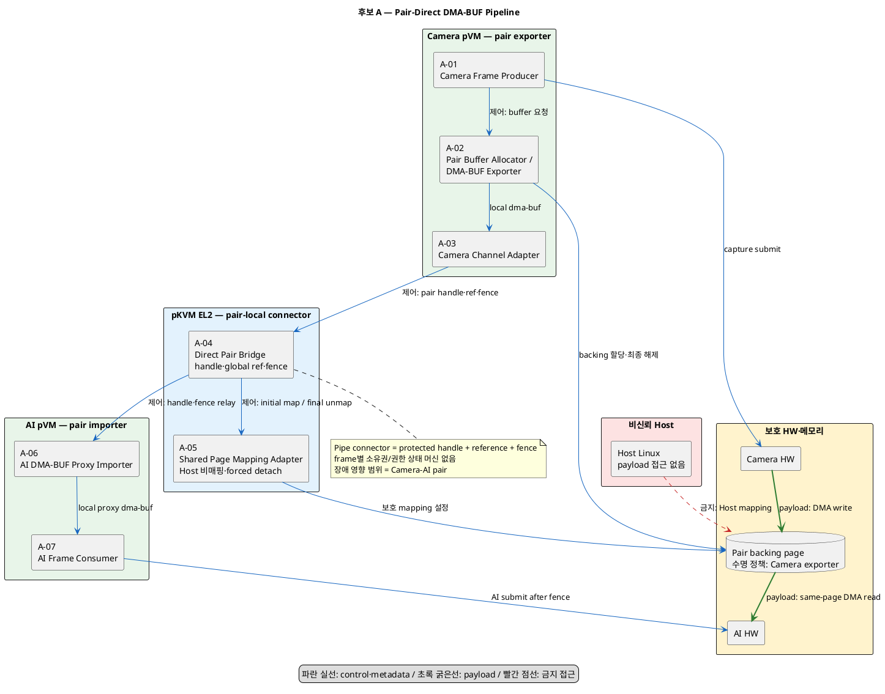
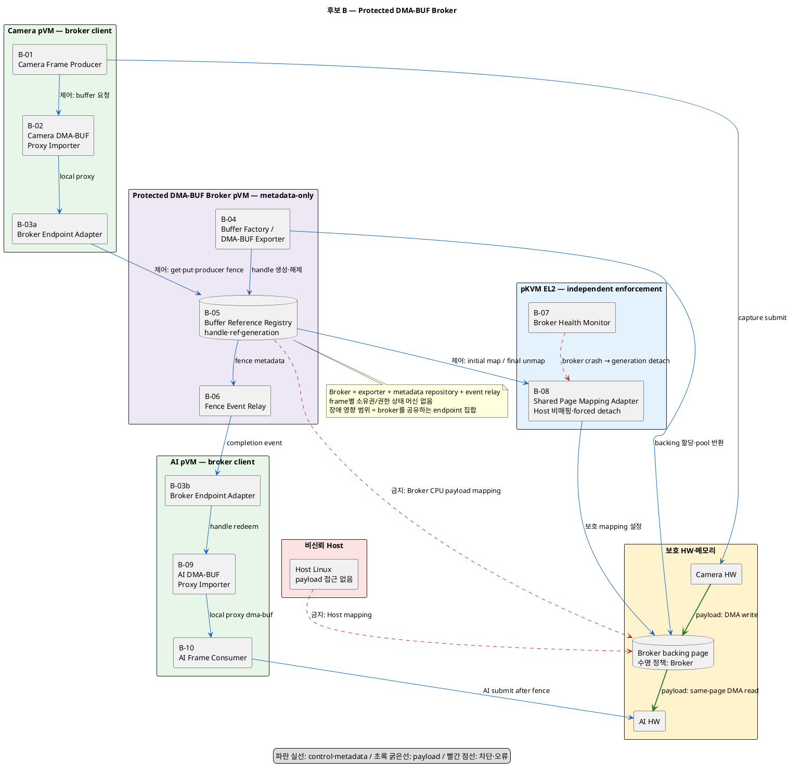

# 문제 1. 아키텍처 스타일·태틱 적용 신규 후보 구조

## 1. 문제와 결정 질문

Camera pVM과 AI pVM은 서로 다른 Linux kernel을 실행하므로 Camera pVM의 DMA-BUF
fd, `struct dma_buf`, `dma_resv`와 reference count를 AI pVM이 그대로 사용할 수
없다. 반면 실제 frame payload는 Host에 노출하거나 다른 물리 페이지로 복사하지 않고
동일한 보호 물리 페이지로 전달해야 한다.

두 pVM의 local DMA-BUF 객체를 동일 backing page에 연결하려면 다음 책임이 필요하다.

- protected buffer handle 발급과 검증
- local DMA-BUF와 backing page 연결
- cross-pVM reference 종합
- producer/consumer fence translation
- Host 비매핑을 보장하는 Stage-2 mapping
- pVM crash 시 generation 기반 forced detach

새로운 Decision Point는 다음 하나다.

> Cross-pVM DMA-BUF의 exporter·handle·reference·fence 중계 책임을 Camera–AI pair별
> direct bridge에 둘 것인가, 독립된 Protected DMA-BUF Broker에 중앙화할 것인가?

후보는 정확히 두 개다.

| 후보 | 답 | 주 아키텍처 스타일 |
|---|---|---|
| A. Pair-Direct DMA-BUF Pipeline | Camera exporter와 pair별 EL2 bridge가 AI proxy importer를 직접 연결한다. | Pipe-and-Filter, Peer-to-Peer, Adapter/Proxy |
| B. Protected DMA-BUF Broker | 보호 service pVM이 공통 exporter·registry·reference·fence relay를 제공한다. | Broker, Metadata Repository, Client–Server, Adapter/Proxy |

동적 개별 buffer와 사전 할당 pool은 두 후보 모두에 적용할 수 있는 하위 resource
관리 태틱이다. 후보를 가르는 결정 변수로 사용하지 않는다.

## 2. 공통 전제와 불변조건

### 2.1 공유와 수명 모델

두 후보 모두 동일한 물리 frame page를 Camera pVM과 AI pVM의 페이지 테이블에
mapping한다. 페이지 데이터는 복사하지 않는다.

```text
Camera pVM local DMA-BUF ─┐
                           ├─> 동일한 보호 물리 Frame Page
AI pVM local DMA-BUF ─────┘
```

- 두 pVM mapping은 buffer lifetime 동안 유지한다.
- 프레임마다 Stage-2 또는 DMA 권한을 회수·부여하지 않는다.
- Camera와 AI 사이의 배타적 페이지 소유권이나 프레임별 권한 상태 머신을 두지 않는다.
- Camera write와 AI read 순서는 DMA-BUF fence를 응용해 동기화한다.
- local `get/put`은 각 kernel의 DMA-BUF 객체 수명을 관리한다.
- cross-pVM reference는 bridge 또는 broker가 종합해 backing page 해제 시점을 결정한다.
- pVM crash처럼 정상 `put`이 불가능한 경우에는 endpoint generation 전체를 강제 detach한다.

### 2.2 공통 gate

1. 정상 frame payload `memcpy`: 0회
2. Host의 frame page mapping/read 성공: 0회
3. 등록되지 않은 제3 pVM의 frame page mapping/read 성공: 0회
4. 위조되거나 오래된 buffer handle 수용: 0회
5. Camera write fence 완료 전 AI job submit: 0회
6. backing page 조기 해제와 use-after-free: 0회
7. pVM crash 뒤 해당 generation의 원격 reference와 mapping 회수율: 100%
8. 1080p 30 fps 지속 입력 처리량과 frame loss: 30 fps 이상, loss 0%

기존 문서의 `Camera와 AI 접근권 중첩 0회`는 두 pVM mapping을 유지하는 이번 전제와
양립하지 않으므로 공통 gate에서 제외한다. fence는 접근 순서를 동기화하지만 다른
주체의 CPU 접근을 물리적으로 차단하지 않는다는 Linux DMA-BUF 의미를 따른다.
[Linux DMA-BUF 공식 문서](https://docs.kernel.org/driver-api/dma-buf.html)

### 2.3 공통 module

| 모듈 | 실행 위치 | 공통 책임 |
|---|---|---|
| Camera Frame Producer | Camera pVM | frame capture 요청과 producer fence 생성 |
| Camera DMA-BUF Adapter | Camera pVM | local DMA-BUF export 또는 proxy import |
| Shared Page Mapping Adapter | pKVM EL2 | 보호 page를 승인된 두 pVM에 연결하고 Host mapping 차단 |
| AI DMA-BUF Proxy Importer | AI pVM | protected handle을 local DMA-BUF와 device attachment로 변환 |
| AI Frame Consumer | AI pVM | producer fence 대기, AI job 제출, consumer fence와 `put` 수행 |
| Camera/AI HW | HW | 동일 보호 page에 DMA write/read |

## 3. 후보 A — Pair-Direct DMA-BUF Pipeline

### 3.1 적용 스타일과 태틱

| 구분 | 적용 항목 | 구조 반영 |
|---|---|---|
| 주 스타일 | Pipe-and-Filter | Camera producer와 AI consumer를 typed DMA-BUF pipe로 직접 연결 |
| 배치 스타일 | Peer-to-Peer | Camera–AI pair마다 독립 channel 생성 |
| 보조 패턴 | Adapter / Proxy | 각 kernel에 local DMA-BUF 표현 유지 |
| 성능 태틱 | Reduce Computational Overhead | protected service scheduling hop 제거 |
| 성능 태틱 | Introduce Concurrency | 서로 다른 buffer에서 capture와 inference pipeline 실행 |
| 성능 태틱 | Bound Queue Size | pair별 outstanding buffer 상한 설정 |
| 보안 태틱 | Restrict Communication Paths | pair capability로 고정된 AI만 연결 |
| 변경 태틱 | Encapsulation / Wrapper | Workload에서 EL2 handle protocol 은닉 |
| 복구 태틱 | Watchdog / Transaction | pair-local timeout과 부분 등록 실패 rollback |

### 3.2 구조적 핵심

Camera pVM의 `Pair Buffer Allocator / DMA-BUF Exporter`가 backing page의 할당 정책과
local DMA-BUF를 소유한다. pKVM EL2의 `Direct Pair Bridge`는 payload를 mapping하지
않고 pair별 handle registry, global backing reference와 fence translation만 담당한다.

`Shared Page Mapping Adapter`는 handle 등록 시 동일 page를 Camera pVM과 고정된
AI pVM에 연결한다. 이후 frame마다 mapping을 바꾸지 않고, producer fence가 완료되면
AI pVM의 local proxy DMA-BUF에 completion을 전달한다.

결정 대상 자원의 수명 책임은 다음과 같다.

- local DMA-BUF 객체: 각 pVM kernel reference count
- backing page allocation policy: Camera pVM exporter
- cross-pVM backing pin: EL2 Direct Pair Bridge
- crash 시 최종 mapping 회수: EL2 Shared Page Mapping Adapter

### 3.3 컴포넌트

| ID | 컴포넌트 | 실행 위치 | 책임 |
|---|---|---|---|
| A-01 | Camera Frame Producer | Camera pVM | capture 요청과 frame publish |
| A-02 | Pair Buffer Allocator / DMA-BUF Exporter | Camera pVM | backing 할당, local export, pair별 buffer 상한 |
| A-03 | Camera Channel Adapter | Camera pVM | protected handle 등록, fence·reference 메시지 전송 |
| A-04 | Direct Pair Bridge | EL2 | pair handle, global ref, generation과 fence translation |
| A-05 | Shared Page Mapping Adapter | EL2 | 두 pVM Stage-2 mapping, Host 비매핑, forced detach |
| A-06 | AI DMA-BUF Proxy Importer | AI pVM | handle redeem, local proxy와 AI device attachment 생성 |
| A-07 | AI Frame Consumer | AI pVM | fence 대기, AI job, completion과 reference 해제 |

### 3.4 정상 동작

1. A-02가 보호 backing page를 할당하고 Camera local DMA-BUF를 export한다.
2. A-03이 pair identity, page 범위, format과 generation을 A-04에 등록한다.
3. A-04가 handle을 발급하고 A-05가 고정 AI pVM에 같은 page를 mapping한다.
4. A-06이 handle을 redeem해 AI local proxy DMA-BUF와 attachment를 만든다.
5. Camera HW가 backing page에 DMA write하고 producer fence를 완료한다.
6. A-04가 fence completion을 AI proxy의 local synchronization object에 전달한다.
7. A-07이 fence 완료 뒤 AI HW job을 제출하고 같은 page를 DMA read한다.
8. AI completion 뒤 A-06이 local reference와 원격 reference를 해제한다.
9. 두 endpoint reference가 끝나면 A-04가 A-05에 unmap을 요청하고 A-02가 page를 해제한다.

### 3.5 오류·종료

- stale handle: A-04가 pair와 generation 불일치를 거부한다.
- producer fence timeout: AI proxy를 signal하지 않고 해당 buffer의 새 사용을 막는다.
- AI pVM crash: A-04가 AI generation의 원격 reference를 강제 해제하고 A-05가 AI mapping을 제거한다.
- Camera pVM crash: A-04가 pair generation을 폐기하고 A-05가 양쪽 mapping을 제거한 뒤 page를 격리한다.
- 등록 중 실패: handle, 원격 ref와 부분 mapping을 역순으로 rollback한다.

### 3.6 후보 구조도



### 3.7 장점과 단점

장점:

- 정상 경로에 별도 service pVM scheduling hop이 없다.
- pair별 handle, queue와 reference라서 장애·과부하 영향 범위를 좁히기 쉽다.
- Camera exporter가 native format과 backing 제약을 직접 처리한다.
- 1:1 Camera→AI topology에서 routing과 중앙 scheduling이 필요 없다.

단점:

- Camera pVM 종류마다 exporter와 channel adapter 구현이 필요하다.
- pair 수가 늘면 bridge registry, queue와 검증 조합이 pair 수에 따라 증가한다.
- Camera crash 시 exporter가 사라지므로 EL2가 orphan backing page를 정리할 ABI가 필요하다.
- 여러 producer의 공정성·전역 quota를 한 지점에서 통제하기 어렵다.

## 4. 후보 B — Protected DMA-BUF Broker

### 4.1 적용 스타일과 태틱

| 구분 | 적용 항목 | 구조 반영 |
|---|---|---|
| 주 스타일 | Broker | endpoint가 중앙 보호 service를 통해 buffer를 공유 |
| 데이터 스타일 | Metadata Repository | handle·reference·format·fence를 중앙 registry에 저장 |
| 배치 스타일 | Client–Server | Camera와 AI는 공통 broker API client |
| 보조 패턴 | Adapter / Proxy | 두 pVM 모두 broker backing의 local proxy 사용 |
| 성능 태틱 | Bound Queue Size | endpoint별 quota와 global outstanding 상한 |
| 자원 태틱 | Resource Pool | 선택 시 broker가 neutral pool을 공통 재사용 |
| 변경 태틱 | Use an Intermediary / Runtime Registration | 새 endpoint를 broker registry에 등록 |
| 신뢰성 태틱 | Monitor / State Resynchronization | broker 재시작 시 EL2 mapping ledger와 대조 |
| 보안 태틱 | Limit Exposure | broker는 metadata-only이며 payload CPU mapping 금지 |

### 4.2 구조적 핵심

독립 `Protected DMA-BUF Broker pVM`이 backing buffer allocator/exporter, endpoint
registry, cross-pVM reference와 fence event relay를 공통 제공한다. Camera와 AI
pVM은 둘 다 broker가 발행한 handle을 local proxy DMA-BUF로 import한다.

Broker는 payload를 CPU mapping하지 않는 metadata-only service다. 실제 frame은
Camera HW가 broker-owned backing page에 쓰고 AI HW가 같은 page를 읽는다.

결정 대상 자원의 수명 책임은 다음과 같다.

- local DMA-BUF 객체: 각 pVM kernel reference count
- backing page allocation policy와 정상 수명: Protected Broker
- cross-pVM backing reference: Broker Reference Registry
- broker crash 시 mapping 격리: EL2 Shared Page Mapping Adapter

### 4.3 컴포넌트

| ID | 컴포넌트 | 실행 위치 | 책임 |
|---|---|---|---|
| B-01 | Camera Frame Producer | Camera pVM | capture와 frame publish |
| B-02 | Camera DMA-BUF Proxy Importer | Camera pVM | broker handle을 Camera local DMA-BUF로 변환 |
| B-03 | Broker Endpoint Adapter | Camera/AI pVM | 공통 register/get/put/fence API |
| B-04 | Buffer Factory / DMA-BUF Exporter | Broker pVM | backing 할당 정책과 neutral handle 생성 |
| B-05 | Buffer Reference Registry | Broker pVM | endpoint ref, generation, format과 mapping metadata |
| B-06 | Fence Event Relay | Broker pVM | producer/consumer fence translation과 event 전달 |
| B-07 | Broker Health Monitor | EL2 | broker generation과 crash 감지, 신규 mapping 차단 |
| B-08 | Shared Page Mapping Adapter | EL2 | broker 요청 검증, 두 pVM mapping과 forced detach |
| B-09 | AI DMA-BUF Proxy Importer | AI pVM | broker handle을 AI local DMA-BUF로 변환 |
| B-10 | AI Frame Consumer | AI pVM | fence 대기, AI job과 completion 처리 |

### 4.4 정상 동작

1. B-04가 보호 backing page를 동적 할당하거나 bounded pool에서 선택한다.
2. B-05가 buffer handle, generation, format과 Camera/AI endpoint를 등록한다.
3. B-08이 동일 page를 Camera pVM과 AI pVM에 mapping하고 Host에는 mapping하지 않는다.
4. B-02와 B-09가 같은 broker handle로 각 kernel의 local proxy DMA-BUF를 만든다.
5. Camera HW가 backing page에 DMA write하고 producer fence를 완료한다.
6. B-06이 fence completion을 AI local proxy의 synchronization object에 전달한다.
7. B-10이 fence 완료 뒤 AI HW job을 제출하고 같은 page를 DMA read한다.
8. 두 endpoint가 local `put`과 원격 `put`을 수행한다.
9. B-05의 endpoint ref가 끝나면 B-04가 page를 해제하거나 pool에 반환한다.

### 4.5 오류·종료

- stale handle: B-05가 broker generation과 endpoint generation을 검증해 거부한다.
- endpoint crash: B-05가 해당 generation의 원격 reference를 정리하고 B-08이 mapping을 제거한다.
- broker crash: B-07이 신규 handle redeem과 mapping을 막고 B-08이 broker generation에 속한 mapping을 격리한다.
- broker 재시작: B-05가 B-08의 실제 mapping ledger와 대조하고 불확실한 page는 pool에 반환하지 않는다.
- 부분 등록 실패: B-04~B-08의 생성·registry·mapping을 하나의 transaction으로 rollback한다.

### 4.6 후보 구조도



### 4.7 장점과 단점

장점:

- exporter, handle, reference와 fence protocol을 한 보호 service에 공통 구현한다.
- Camera pVM이 종료돼도 broker가 backing page의 정상 수명 authority로 남는다.
- 신규 Camera/AI endpoint를 공통 adapter와 runtime registration으로 추가하기 쉽다.
- global buffer quota, pool과 telemetry를 한 지점에서 관리할 수 있다.

단점:

- broker scheduling과 event relay hop이 frame 전달 지연에 추가된다.
- broker가 공용 병목과 여러 pipeline에 영향을 주는 장애점이 된다.
- metadata-only라도 새로운 trusted pVM, 상주 vCPU와 memory가 필요하다.
- broker crash 후 registry와 실제 EL2 mapping을 재동기화하는 protocol이 필요하다.

## 5. 후보 비교

| 비교 항목 | 후보 A: Pair-Direct | 후보 B: Protected Broker |
|---|---|---|
| 주 스타일 | Pipe-and-Filter + Peer-to-Peer | Broker + Metadata Repository |
| backing allocation/lifetime policy 위치 | Camera exporter | Protected Broker |
| cross-pVM reference | EL2 pair registry | Broker central registry |
| fence 전달 | pair별 EL2 relay | Broker event relay |
| 정상 control hop | 적음 | broker hop 추가 |
| 장애 영향 범위 | 기본적으로 Camera–AI pair | broker 공유 endpoint 집합 |
| Camera crash 후 backing 처리 | EL2 orphan cleanup 필요 | broker가 정상 lifetime authority 유지 |
| 신규 endpoint 추가 | pair adapter와 channel 추가 | broker 등록과 공통 adapter 추가 |
| 전역 quota·pool | pair별 집계 필요 | 중앙 관리 용이 |
| TCB 변화 | EL2 pair bridge ABI 증가 | Protected Broker pVM과 EL2 monitor 추가 |
| 동적 buffer/pool 선택 | 둘 다 가능 | 둘 다 가능 |

### 핵심 트레이드오프

> Pair-Direct 구조는 중앙 service hop과 공용 장애점을 줄여 1:1 frame pipeline의
> 지연과 장애 격리에 유리하다. 대신 exporter 수명이 Camera pVM에 결합되고 pair마다
> bridge protocol을 검증해야 한다.

> Protected Broker 구조는 exporter, reference, pool과 endpoint 확장을 중앙화해
> 변경 용이성과 lifecycle 관리에 유리하다. 대신 새로운 trusted service와 중앙
> latency·failure domain이 생긴다.

## 6. 동일 조건 검증 계획

### 6.1 공통 gate

| Gate | 판정 기준 | 후보 A | 후보 B | 검증 방법 |
|---|---|---|---|---|
| zero-copy | payload `memcpy` 0회 | 확인 필요 | 확인 필요 | tracepoint, page identity와 DMA 주소 추적 |
| Host 비노출 | Host mapping/read 성공 0회 | 확인 필요 | 확인 필요 | Host mapping·DMA 공격 주입 |
| 제3 pVM 차단 | 미등록 pVM mapping/read 성공 0회 | 확인 필요 | 확인 필요 | forged handle과 endpoint 공격 주입 |
| fence 순서 | producer fence 전 AI submit 0회 | 확인 필요 | 확인 필요 | fence 지연·순서 역전 주입 |
| 수명 안전성 | 조기 free와 use-after-free 0회 | 확인 필요 | 확인 필요 | get/put 순서·중복·누락 조합 시험 |
| crash 회수 | generation mapping/ref 회수율 100% | 확인 필요 | 확인 필요 | 각 등록·mapping·fence 단계에서 pVM kill |
| 지속 처리 | 1080p 30 fps, frame loss 0% | 확인 필요 | 확인 필요 | 동일 buffer 정책·CPU quota로 10분 이상 측정 |

### 6.2 후보를 가르는 KPI

승인된 latency와 memory 예산이 없으므로 임계값은 TBD로 둔다.

| 품질속성 | KPI | 방향 | 구조적 가설 |
|---|---|---|---|
| 성능 | Camera fence 완료→AI job submit p50/p95/p99/max | 작을수록 유리 | A는 broker hop이 없어 유리할 가능성 |
| 처리량 | 지속 fps와 frame loss | fps는 크고 loss는 작을수록 유리 | B는 중앙 queue contention을 확인해야 함 |
| 자원사용성 | buffer memory, pair/endpoint당 metadata와 상주 vCPU | 작을수록 유리 | A는 pair 수, B는 broker 상주비용이 주요 변수 |
| 복구성 | Camera/AI/broker crash 후 안전한 page 해제 시간 | 작을수록 유리 | B는 Camera crash, A는 broker 부재에 각각 장단점 |
| 장애격리 | 단일 장애로 중단된 비관련 pipeline 수 | 작을수록 유리 | A의 pair-local 구조가 유리할 가능성 |
| 모듈성 | 신규 Camera/AI 추가 변경 LoC·모듈 수 | 작을수록 유리 | B의 공통 broker contract가 유리할 가능성 |

## 7. 실현 가능성 gate와 문서 정합성

Linux 공식 pKVM 문서는 현재 기능을 experimental로 설명하고, 해당 문서 버전에서
IOMMU 기반 DMA isolation을 미구현으로 표시한다. 따라서 두 pVM에 Host 비노출
shared page를 연결하고 Camera/AI HW가 DMA하는 기능은 project-specific extension
또는 platform 기능 확인이 필요하다.
[Linux pKVM 공식 문서](https://docs.kernel.org/7.1/virt/kvm/arm/pkvm.html)

두 후보 공통 실현 가능성 gate는 다음과 같다.

- Host에 mapping하지 않고 같은 보호 page를 두 pVM에 mapping 가능
- cross-kernel proxy DMA-BUF의 exporter/importer·attachment 계약 실현 가능
- cross-pVM fence translation과 cache coherency 보존 가능
- pVM crash 시 EL2가 generation별 mapping을 강제 제거 가능
- Camera/AI HW의 보호 page DMA 경로 실현 가능

또한 기존 다음 문서에는 페이지 소유권 전이, 프레임별 권한 상태 머신과 Camera/AI
접근권 중첩 금지가 남아 있어 이번 후보 전제와 충돌한다.

- `docs-align/품질위협_문제1_pVM간_데이터전달.md`
- `docs-align/후보구조_문제1_pVM간_데이터전달.md`
- `docs-align/품질속성_QA_Measure_ISO25010.md`의 문제 2 buffer 항목

이번 문서는 새 후보 도출 결과만 기록한다. 품질 평가를 시작하기 전에는 위 문서의
gate와 용어를 `공유 mapping + fence synchronization + reference lifetime` 모델로
정렬해야 한다.

## 8. 적용 근거

- [아키텍처 스타일과 태틱 조사](아키텍처_스타일과_태틱_조사.md)
- [DMA-BUF 기반 필수 모듈](DMA_BUF_기반_필수_모듈.md)
- [Garlan–Shaw, An Introduction to Software Architecture](https://www.cs.cmu.edu/afs/cs/project/vit/ftp/pdf/intro_softarch.pdf)
- [SEI, Modifiability Tactics](https://www.sei.cmu.edu/library/modifiability-tactics/)
- [SEI, Availability Tactics](https://insights.sei.cmu.edu/library/realizing-and-refining-architectural-tactics-availability/)
- [SEI, Security and Survivability Tactics](https://www.sei.cmu.edu/library/security-and-survivability-reasoning-frameworks-and-architectural-design-tactics/)
- [Linux DMA-BUF 공식 문서](https://docs.kernel.org/driver-api/dma-buf.html)
- [Linux pKVM 공식 문서](https://docs.kernel.org/7.1/virt/kvm/arm/pkvm.html)
