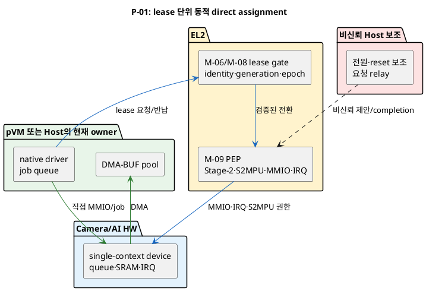
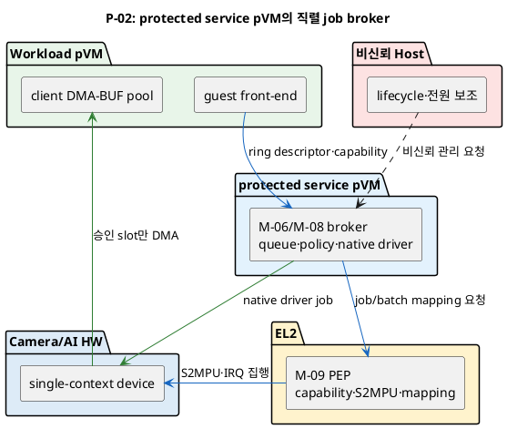

# 문제 1 재정의: Camera/AI HW 중재와 안전한 전환 설계 공간

## 1. 상태와 문서 목적

- 상태: **후보 작성**
- 성격: 여러 Decision Point로 나누기 전의 설계 공간 조사 문서
- 최종 결정: **없음**

이 문서는 다음 자료를 기준으로 문제 1의 후보 구조를 다시 펼친다.

- [시스템 개요](../docs/01_시스템_개요.md)
- [설계 범위와 모듈](../docs/02_설계_범위_모듈.md)
- [후보 구조 작성 규칙](../docs/후보구조_작성규칙.md)
- [문제 3 설계 공간 문서](문제3_virtio-blk_공용저장_암호화_설계공간.md)는 형식만 참고한다.

기존 문제 1 후보 문서는 답으로 참고하지 않았다. `old/` 디렉터리도 참고하지 않았다.

후보 구조 작성 규칙은 한 Decision Point에 정확히 두 후보를 요구한다. 그러나 이번
문서의 목적은 후보 수를 제한하지 않고 가능한 구조를 먼저 찾는 것이다. 따라서
구조를 모두 펼친 뒤, 마지막에 **한 가지 구조 결정만 달라지는 후보 쌍**으로 나눈다.
정식 Decision Point 문서를 만들 때는 각 쌍을 별도 파일로 옮겨야 한다.

## 2. 고정 조건

1. Host Application과 Host Linux kernel은 비신뢰 영역이다.
2. Camera HW와 AI HW는 각각 single-context 장치다.
3. 한 장치에는 한 시점에 한 주체만 접근할 수 있다.
4. Host와 pVM의 논리적 동시 사용은 고속 시분할로 제공한다.
5. 물리 소유자 전환은 `revoke → drain → reset → zeroize → S2MPU 갱신 → regrant`
   순서를 끝까지 완료해야 한다.
6. Stage-2, S2MPU, MMIO와 IRQ의 실제 권한 상태는 비신뢰 Host의 보고만으로
   확정하지 않는다.
7. pVM identity, pVM generation, device generation과 lease epoch를 권한에 묶는다.
8. EL2는 작은 TCB를 유지한다. 장치별 전체 driver나 복잡한 scheduler를 넣는 후보는
   별도의 feasibility gate를 통과해야 한다.
9. 현재 topology는 Camera→AI의 두 domain이다.
10. 장애·종료·시간 초과 시 M-04 (Fault/Recovery Manager)가 복구를 조정하고,
    M-08/M-09가 실제 HW와 DMA 권한을 회수한다.

Linux upstream의 현재 pKVM 문서는 IOMMU 기반 DMA isolation을 아직
`Unimplemented`로 표시한다. 대상 Custom SoC에 이미 별도 구현이 있을 수 있으므로,
이 사실은 구조 배제 근거가 아니라 **플랫폼별 실현 가능성 gate**로 사용한다.

## 3. 문제 재정의

### 3.1 현재 문제가 아닌 것

문제는 단순히 “중재자를 EL2에 둘지 Host kernel driver에 둘지” 하나만 고르는 것이
아니다. 다음 책임은 서로 분리할 수 있다.

- 누가 사용 순서와 lease 길이를 제안하는가
- 누가 최종 allow/deny를 판정하는가
- 누가 native driver와 job queue를 소유하는가
- 누가 Stage-2/S2MPU/MMIO/IRQ를 실제로 바꾸는가
- 누가 drain/reset/zeroize 완료를 확인하는가
- 누가 stale DMA와 stale IRQ를 차단하는가
- 요청·완료마다 몇 번 보호 경계를 넘는가

Host가 scheduling을 제안하더라도 EL2가 실제 권한을 검증·집행할 수 있다. 반대로
중재자를 EL2에 둬도 job마다 trap, HVC와 interrupt injection이 발생하면 실시간
지연이 커질 수 있다. 책임 위치와 fast path를 별도 결정축으로 다뤄야 한다.

### 3.2 새 문제 정의

> 비신뢰 Host와 Camera/AI pVM이 single-context Camera/AI HW를 시분할해 사용해야
> 한다. 이전 소유자의 DMA, MMIO, IRQ와 HW 내부 상태가 남은 채 새 소유자에게
> 권한이 넘어가면 기밀성·무결성과 장애 격리가 깨진다. 반대로 모든 job과 register
> 접근을 보호 중재자가 동기 처리하면 exception/context switch와 reset 비용 때문에
> 실시간 frame 처리가 어려워질 수 있다. 따라서 정책·driver·최종 집행 책임의 실행
> 위치와, 보호 경계 횡단을 줄이는 lease·queue·interrupt 구조를 각각 정해야 한다.

### 3.3 품질 충돌

| 선택 | 좋아지는 점 | 부담되는 점 |
|---|---|---|
| 중재와 장치 상태 해석을 EL2에 모음 | Host를 우회해 최종 상태를 확인하기 쉽다. | EL2 코드, 장치 종속성, 검증 범위와 장애 영향이 커진다. |
| Host driver가 scheduling과 장치 제어를 맡고 EL2가 권한만 집행 | 기존 Linux driver와 전원 관리 기능을 재사용하기 쉽다. | Host 보고를 검증할 별도 completion과 stale-event 차단이 필요하다. |
| protected service pVM이 broker와 driver를 맡음 | Host에서 중재·driver를 분리할 수 있다. | 추가 VM 전환, 상주 자원과 공용 장애점이 생긴다. |
| 장치를 pVM에 직접 할당 | 정상 I/O path의 trap과 copy를 줄일 수 있다. | 안전한 동적 회수와 reset 시간이 owner 전환 지연을 지배한다. |
| job queue로 물리 소유자를 고정 | owner 전환 횟수를 줄일 수 있다. | broker가 모든 command와 buffer를 검증해야 하며 격리 범위가 넓어진다. |
| 긴 lease와 batching 사용 | HVC, reset과 IRQ 재배치 횟수를 줄인다. | 다른 주체의 대기 시간과 우선순위 역전 위험이 커진다. |
| polling과 전용 core 사용 | interrupt/exit를 줄이고 지연 변동을 낮출 수 있다. | CPU와 전력 사용량이 늘고 overload 격리가 필요하다. |

## 4. 모든 후보가 지켜야 하는 HW lease 계약

### 4.1 보호 원장

장치마다 Host가 고칠 수 없는 위치에 최소 다음 상태가 필요하다.

```text
device_id
device_generation
owner_id                 # HOST, CAMERA_PVM, AI_PVM, SERVICE_PVM
owner_pvm_generation
lease_epoch
lease_deadline
state                    # FREE, GRANTING, OWNED, REVOKING, RESETTING, FAULTED
allowed_mmio_ranges
allowed_dma_pool_id
irq_route
last_completed_job_seq
```

모든 command descriptor, DMA-BUF slot과 completion에는 `device_generation`,
`owner_pvm_generation`, `lease_epoch`와 `job_seq`를 넣는다. 이전 epoch의 completion,
IRQ와 DMA write는 새 소유자의 정상 완료로 받아들이지 않는다.

### 4.2 전환 상태 기계

```text
FREE
  -> GRANTING
  -> OWNED
  -> REVOKING
  -> RESETTING
  -> FREE

어느 단계든 검증 실패 또는 timeout
  -> FAULTED
  -> 장치 offline 또는 platform reset 뒤에만 FREE
```

정상 전환은 다음 순서를 지킨다.

1. 보호 authority가 새 요청을 admission하고 새 `lease_epoch`를 예약한다.
2. 기존 owner의 신규 job 제출과 doorbell을 먼저 막는다.
3. 기존 owner에게 cooperative drain을 요청한다.
4. timeout이면 장치별 강제 quiesce 또는 reset 경로를 실행한다.
5. 진행 중 DMA와 device-side queue가 끝났음을 보호된 상태로 확인한다.
6. IRQ route를 차단하고 이전 epoch의 pending IRQ를 폐기한다.
7. 장치를 reset하고 register, SRAM, line buffer와 cache를 zeroize한다.
8. 기존 owner의 MMIO, DMA buffer와 S2MPU 권한을 회수한다.
9. 새 owner의 Stage-2, S2MPU, MMIO와 IRQ route를 설정한다.
10. 실제 권한 readback과 generation을 확인한 뒤 `OWNED`로 바꾼다.
11. 새 owner에게 capability와 완료 상태를 알린다.

reset 또는 zeroize 완료를 신뢰할 수 없으면 재대여하지 않고 `FAULTED`로 둔다.

## 5. 중재·정책 authority 위치의 전체 후보

### 5.1 빠른 판정표

모든 성립 후보에서 M-09 (DMA/S2MPU Isolation Controller)의 최종 Stage-2/S2MPU
집행은 EL2 또는 동등한 protected hardware PEP가 맡는다. 차이는 scheduling,
lease 원장과 장치 전환 판정 책임의 위치다.

| 번호 | 후보 구조 | scheduling·lease authority | 최종 권한 집행 | 현재 판정 |
|---|---|---|---|---|
| A-01 | Host 제안 + EL2 검증·집행 | Host EL0/EL1이 제안, EL2가 capability·상태 확인 | EL2 M-09 | 기본 조건과 맞음, Host completion 검증 필요 |
| A-02 | EL2 일체형 lease arbiter | EL2 M-06/M-08 | EL2 M-09 | 조건부: 작은 scheduler와 장치 상태기계만 허용 |
| A-03 | protected service pVM broker + EL2 PEP | service pVM M-06/M-08 | EL2 M-09 | 조건부: 추가 전환·공용 장애점 측정 필요 |
| A-04 | TEE policy arbiter + EL2 PEP | TEE M-06 | EL2 M-09 | 조건부: SMC 왕복과 TEE/HW 상태 연결 필요 |
| A-06 | Host kernel 단독 중재·집행 | Host EL1 | Host EL1 | Host 비신뢰 조건 위반으로 제외 |
| A-07 | pVM끼리 협의해 직접 handoff | 현재 owner pVM | pVM/Host driver | 강제 회수 주체가 없어 제외 |

### 5.2 A-01: Host 제안과 EL2 검증·집행

Host의 M-08 daemon/kernel driver가 부하, 우선순위와 전원 상태를 보고 다음 owner와
lease 길이를 제안한다. EL2는 verified identity, generation, 현재 lease, drain/reset
completion과 실제 S2MPU 상태를 확인한 뒤에만 권한을 바꾼다.

이 구조는 Linux native driver와 전원 관리 코드를 재사용한다. Host는 진행 순서를
조정할 수 있지만 최종 권한과 `OWNED` 상태를 만들 수 없다. Host가 거짓 completion을
보내거나 응답을 중단하면 전환은 fail-closed한다.

### 5.3 A-02: EL2 일체형 lease arbiter

EL2가 고정된 두 domain의 lease queue, deadline과 상태 기계를 직접 관리한다. Host는
요청 전달과 전원 관리 보조만 수행한다. EL2는 device-specific full driver가 아니라
허용 MMIO 범위, quiesce/reset primitive와 실제 권한 readback만 알아야 한다.

보호 판단 경로는 짧지만 scheduling policy와 장치별 상태가 EL2 TCB에 들어간다.
future N-domain이나 새 HW class로 일반화하면 범위가 빠르게 커진다.

### 5.4 A-03: protected service pVM broker와 EL2 PEP

측정된 service pVM이 policy, queue, deadline과 native driver 또는 mediation driver를
가진다. EL2는 service pVM의 요청도 그대로 신뢰하지 않고 generation, capability와
실제 Stage-2/S2MPU 전환을 집행한다.

장치별 복잡한 코드를 EL2 밖의 격리 domain에 둘 수 있다. 대신 Workload pVM과
service pVM 사이의 추가 channel, vCPU scheduling과 장애 복구가 필요하다. 여러
Workload가 하나의 service pVM을 공유하면 공용 장애와 timing interference가 생긴다.

### 5.5 A-04: 조건부 TEE policy authority

TEE를 policy authority로 쓰면 기존 보안 자산을 재사용할 수 있지만 TEE는 큰 driver와
실시간 queue를 소유하지 않는다. lease 발급과 작은 policy 판정만 맡기고 EL2가 실제
HW 상태를 확인해야 한다.

### 5.6 E-01·E-02: 최종 enforcement backend

이 축은 scheduling authority와 별개다.

| 번호 | enforcement 구조 | 조건 |
|---|---|---|
| E-01 | EL2 M-09가 Stage-2/S2MPU/MMIO/IRQ를 직접 집행 | 기본 구조 |
| E-02 | SoC hardware resource controller가 firewall/reset을 집행하고 EL2가 명령·결과를 검증 | 대상 SoC의 보호 IP와 실제 상태 readback 필요 |

SoC에 별도 hardware resource controller, safety island 또는 secure device manager가
있다면 reset, zeroize와 firewall 전환을 그 장치가 원자적으로 수행할 수 있다. 이는
software trap을 줄이는 강한 후보지만 해당 IP, firmware 신뢰성과 오류 보고 규약이
확인된 경우에만 E-02가 성립한다.

## 6. native driver와 물리 data plane의 전체 후보

| 번호 | 후보 구조 | 정상 job path | 물리 HW owner | 현재 판정 |
|---|---|---|---|---|
| P-01 | 동적 direct assignment와 owner별 native driver | 현재 owner pVM/Host가 MMIO·DMA 직접 사용 | lease마다 변경 | 대표 후보, pKVM IOMMU feasibility 필요 |
| P-02 | protected service pVM의 직렬 job broker | Workload pVM이 보호 queue에 job 제출 | service pVM에 고정 | 대표 후보, 추가 copy 없이 DMA-BUF grant 필요 |
| P-03 | Host native driver + 보호 command validator | Host가 driver 실행, EL2/service가 command·buffer capability 검증 | Host에 고정 | 조건부: Host가 payload와 보안 상태를 볼 수 없어야 함 |
| P-04 | mediated pass-through | 안전 MMIO/queue는 guest 직접, 민감 연산만 trap | lease owner 또는 broker | 조건부: 장치별 register·command 검증 모델 필요 |
| P-05 | EL2 full driver/device model | EL2가 모든 job과 interrupt 처리 | EL2 | 작은 EL2 TCB 위반으로 제외 |
| P-06 | 장기 정적 pVM 전용 할당 | pVM이 항상 직접 사용 | pVM 고정 | Host와 고속 시분할 조건을 바꾸므로 제외 |
| P-07 | SR-IOV/다중 HW context 분할 | 각 주체가 virtual function 직접 사용 | 병렬 분할 | single-context 고정 조건에서 제외 |

### 6.1 P-01: 동적 direct assignment

lease가 활성화된 동안 현재 owner의 native driver가 MMIO, DMA queue와 IRQ를 직접
사용한다. 정상 frame 처리에는 Host device model이나 EL2 emulation이 없다. owner가
바뀔 때만 M-08/M-09의 전체 전환 상태 기계를 실행한다.



장점은 lease 내부의 I/O 비용이 native에 가깝다는 점이다. 단점은 owner 전환마다
drain/reset/zeroize와 IOMMU/S2MPU 갱신을 모두 수행해야 한다는 점이다.

### 6.2 P-02: protected service pVM job broker

물리 장치는 service pVM에 계속 할당한다. Camera/AI/Host client는 보호 command
ring에 descriptor와 buffer capability를 넣는다. broker가 직렬 순서를 정하고
native driver로 HW를 구동한다. client별 buffer mapping과 S2MPU 권한은 job 또는
batch 경계에서 M-09가 바꾼다.



물리 owner 전환을 줄일 수 있지만 broker가 command parser와 native driver를
소유한다. broker 장애가 모든 client에 영향을 줄 수 있고, service pVM을 거치는
control 전환 비용을 측정해야 한다.

### 6.3 P-03: Host driver와 보호 command validator

기존 Host native driver가 물리 장치를 계속 구동하되, 보호 validator가 승인한
command template, DMA-BUF slot과 epoch만 제출할 수 있게 한다. S2MPU는 승인 slot
밖의 DMA를 막고 completion은 보호 원장의 `job_seq`와 대조한다.

장치가 command를 임의 주소로 바꾸거나 민감한 register를 통해 보호를 우회할 수
있다면 성립하지 않는다. Host가 frame payload를 CPU로 map할 수 있는 구조도 보안
조건을 위반한다. 장치 명령 형식과 IOMMU가 이를 막을 수 있을 때만 후보가 된다.

`물리 HW owner를 Host에 고정`한다는 말은 Host가 pVM job 실행 중에도 장치와 보호
buffer에 자유롭게 접근한다는 뜻이 아니다. Host client job과 pVM client job 사이도
각각 별도 logical lease다. client가 바뀔 때마다 4.2절의 신규 submission 차단,
drain, reset, zeroize, 이전 buffer S2MPU revoke와 새 capability grant를 수행한다.
이를 장치 command validator와 firewall로 강제할 수 없다면 P-03은 제외한다.

### 6.4 P-04: mediated pass-through

guest가 안전한 doorbell, data queue와 일부 MMIO를 직접 사용하고, reset, address-space
선택, firmware load와 같은 민감 register만 trap한다. 정상 job의 trap 수를 줄일 수
있지만 어떤 register와 command가 안전한지를 장치별로 증명해야 한다. 알려진
VFIO mdev/VPIO 계열의 아이디어를 pKVM 신뢰 모델에 맞게 다시 검증하는 후보이지,
표준 mdev를 그대로 적용하는 것은 아니다.

## 7. context/exception switch를 줄이는 fast path 후보

### 7.1 요청 제출

| 번호 | 제출 구조 | 보호 경계 횡단 | 특징 |
|---|---|---|---|
| Q-01 | job마다 동기 HVC/ioctl | job마다 왕복 | 단순하지만 frame rate에 비례해 exit 증가 |
| Q-02 | 공유 descriptor ring + 조건부 doorbell | batch마다 알림 | descriptor 여러 개를 묶고 notification suppression 가능 |
| Q-03 | epoch capability로 미리 승인한 queue | lease 설정/회수 때만 HVC | fast path는 queue index 갱신, validator가 epoch 확인 |
| Q-04 | 전용 broker core의 poll-mode queue | 정상 job에는 interrupt 없음 | 낮은 jitter 가능, CPU·전력 고정 비용과 overload 위험 |

Q-02~Q-04에서도 ownership, S2MPU와 reset 전환을 생략하지 않는다. 줄이는 것은
동일 owner의 lease 안에서 반복되는 control transition이다.

### 7.2 lease와 전환 단위

| 번호 | 전환 단위 | 장점 | 위험 |
|---|---|---|---|
| G-01 | job/frame마다 owner 전환 | 작은 시간 단위로 공정하게 공유 가능 | reset·zeroize·S2MPU 비용이 매 frame 발생 |
| G-02 | bounded batch lease | 전환 비용을 여러 frame에 분산 | batch 중 다른 주체 대기와 우선순위 역전 |
| G-03 | pipeline epoch 장기 lease | 정상 pipeline 동안 direct path 유지 | Host 사용 지연, fault 시 회수할 상태가 많음 |
| G-04 | 정적 time-triggered slot | 예측 가능한 upper bound | 유휴 slot 낭비와 burst 대응 한계 |

### 7.3 completion과 interrupt

| 번호 | 완료 구조 | context switch 방향 | 조건 |
|---|---|---|---|
| I-01 | Host relay 후 가상 IRQ injection | Host와 VMM 경유 | Host IRQ를 보안 완료의 유일한 근거로 쓰지 않음 |
| I-02 | 현재 owner로 protected direct interrupt | Host user exit 제거 가능 | IRQ remap과 stale epoch 차단을 EL2/HW가 지원 |
| I-03 | completion ring polling | IRQ/exit 제거 | dedicated vCPU, CPU quota와 timeout 필요 |
| I-04 | hybrid polling + event suppression | 부하에 따라 interrupt 수 감소 | 전환 정책과 최악 지연을 측정해야 함 |

interrupt coalescing 개수, ring 크기와 batch 크기는 같은 책임 경계 안의 성능 조절값이다.
승인된 시간 예산이 생기기 전에는 별도 Decision Point로 만들지 않는다.

## 8. 의미 있는 후보 구조 쌍

모든 큰 구조를 서로 비교하면 authority, driver 위치와 fast path가 동시에 달라진다.
아래 쌍은 정식 Decision Point로 옮길 수 있도록 한 결정축만 바꾼다.

### 8.1 중재 authority 위치 쌍

| 쌍 | 후보 A | 후보 B | 결정 질문 |
|---|---|---|---|
| D-01 | A-01 Host 제안 + EL2 검증 | A-02 EL2 일체형 arbiter | scheduling을 Host에 남길지 EL2로 옮길지 |
| D-02 | A-01 Host 제안 + EL2 검증 | A-03 service pVM broker | 복잡한 중재를 비신뢰 Host에 둘지 격리 VM에 둘지 |
| D-03 | A-02 EL2 일체형 arbiter | A-03 service pVM broker | policy·queue를 EL2 TCB에 둘지 별도 protected VM에 둘지 |
| D-04 | A-01 Host 제안 + EL2 검증 | A-04 TEE policy | lease policy를 REE가 제안할지 TEE가 판정할지 |
| D-05 | A-02 EL2 일체형 arbiter | A-04 TEE policy | policy와 집행을 EL2에 모을지 TEE/EL2로 나눌지 |
| D-06 | A-03 service pVM broker | A-04 TEE policy | 공용 policy를 service pVM에 둘지 TEE에 둘지 |
| D-07 | A-01 policy + E-01 EL2 PEP | A-01 policy + E-02 HW PEP | Host 제안 policy를 고정하고 최종 firewall 집행 backend만 바꿀지 |
| D-08 | A-02 policy + E-01 EL2 PEP | A-02 policy + E-02 HW PEP | EL2 policy를 고정하고 최종 firewall 집행 backend만 바꿀지 |
| D-09 | A-03 policy + E-01 EL2 PEP | A-03 policy + E-02 HW PEP | service pVM policy를 고정하고 최종 firewall 집행 backend만 바꿀지 |
| D-10 | A-04 policy + E-01 EL2 PEP | A-04 policy + E-02 HW PEP | TEE policy를 고정하고 최종 firewall 집행 backend만 바꿀지 |

A-04가 성립하지 않으면 D-04~D-06과 D-10은 비교하지 않는다. E-02가 대상
platform에서 성립하지 않으면 D-07~D-10은 비교하지 않는다.

### 8.2 driver와 물리 owner 쌍

| 쌍 | 후보 A | 후보 B | 결정 질문 |
|---|---|---|---|
| D-11 | P-01 동적 direct assignment | P-02 service pVM job broker | 물리 owner를 lease마다 바꿀지 broker에 고정할지 |
| D-12 | P-01 동적 direct assignment | P-03 Host driver + validator | native driver를 owner domain에 둘지 Host에 고정할지 |
| D-13 | P-01 동적 direct assignment | P-04 mediated pass-through | 모든 안전 MMIO를 직접 줄지 민감 동작만 trap할지 |
| D-14 | P-02 service pVM job broker | P-03 Host driver + validator | 물리 driver를 protected VM에 둘지 Host에 둘지 |
| D-15 | P-02 service pVM job broker | P-04 mediated pass-through | 중앙 broker queue를 쓸지 client direct fast path를 열지 |
| D-16 | P-03 Host driver + validator | P-04 mediated pass-through | Host driver command를 검증할지 guest MMIO를 선택적으로 허용할지 |

P-03과 P-04는 장치 command·register 모델의 실현 가능성이 확인될 때만 후보가 된다.

### 8.3 lease granularity 쌍

| 쌍 | 후보 A | 후보 B | 결정 질문 |
|---|---|---|---|
| D-17 | G-01 frame별 전환 | G-02 bounded batch lease | 공정성을 위해 매 frame 전환할지 전환 비용을 batch에 분산할지 |
| D-18 | G-01 frame별 전환 | G-03 pipeline epoch lease | 가장 짧은 공유 단위를 쓸지 pipeline 동안 장기 소유할지 |
| D-19 | G-02 bounded batch lease | G-03 pipeline epoch lease | 최대 대기 시간을 batch로 제한할지 pipeline 전체 처리량을 우선할지 |
| D-20 | G-02 bounded batch lease | G-04 정적 time slot | 수요 기반 lease를 쓸지 정적 시간표로 예측성을 우선할지 |
| D-21 | G-03 pipeline epoch lease | G-04 정적 time slot | pipeline 수명 소유를 쓸지 고정 주기 소유를 쓸지 |

### 8.4 요청·완료 fast path 쌍

| 쌍 | 후보 A | 후보 B | 결정 질문 |
|---|---|---|---|
| D-22 | Q-01 job별 동기 HVC | Q-02 ring + batch doorbell | job마다 보호 호출할지 공유 ring으로 묶을지 |
| D-23 | Q-01 job별 동기 HVC | Q-03 epoch 사전 승인 queue | 개별 승인할지 lease 설정 때 queue 전체를 승인할지 |
| D-24 | Q-02 ring + batch doorbell | Q-03 epoch 사전 승인 queue | batch마다 보호 알림할지 fast path 알림도 제거할지 |
| D-25 | Q-02 interrupt형 ring | Q-04 poll-mode broker core | 이벤트로 깨울지 전용 core가 계속 poll할지 |
| D-26 | I-01 Host relay IRQ | I-02 protected direct IRQ | 완료를 Host 경유로 넣을지 현재 owner에게 직접 넣을지 |
| D-27 | I-02 protected direct IRQ | I-03 completion polling | 직접 interrupt를 쓸지 interrupt 없는 polling을 쓸지 |
| D-28 | I-01 Host relay IRQ | I-03 completion polling | 기존 relay를 유지할지 전용 poller로 Host exit를 없앨지 |
| D-29 | I-03 polling | I-04 hybrid polling/event | 항상 CPU를 쓸지 idle 구간에는 event로 잠들지 |

### 8.5 강제 회수 쌍

| 번호 | 회수 구조 | 특징 |
|---|---|---|
| R-01 | cooperative drain 뒤 timeout 강제 reset | 정상 owner에 종료 기회를 주되 timeout 뒤 강제 회수 |
| R-02 | deadline 기반 자동 revoke | lease 만료 자체가 신규 submission 차단과 회수 trigger |
| R-03 | 정적 slot 경계 revoke | 미리 정한 시간 경계에서 다음 owner로 전환 |

| 쌍 | 후보 A | 후보 B | 결정 질문 |
|---|---|---|---|
| D-30 | R-01 cooperative+timeout | R-02 deadline 자동 revoke | 정상 반납을 우선할지 lease 만료를 전환 trigger로 삼을지 |
| D-31 | R-02 deadline 자동 revoke | R-03 정적 slot 경계 | 수요에 따라 deadline을 정할지 고정 시간 경계로 회수할지 |

강제 reset primitive가 없으면 어느 쪽도 악성·고장 owner를 안전하게 회수하지 못한다.

## 9. 조합 가능한 전체 범위

authority A-01~A-03과 물리 path P-01~P-04는 원칙상 다음처럼 조합할 수 있다.

| authority \ 물리 path | P-01 direct assignment | P-02 service broker | P-03 Host driver+validator | P-04 mediated pass-through |
|---|---|---|---|---|
| A-01 Host 제안+EL2 | 가능 | 가능하지만 중재가 이중화됨 | 조건부 | 조건부 |
| A-02 EL2 arbiter | 가능 | 가능 | 조건부 | 조건부 |
| A-03 service pVM | 가능하지만 역할 분리 필요 | 자연스러운 조합 | 조건부 | 조건부 |

여기에 G-01~G-04, Q-01~Q-04와 I-01~I-04가 붙는다. 모든 수학적 조합을 새 후보
이름으로 만들지 않는다. 예를 들어 `A-02 + P-01 + G-02 + Q-03 + I-02`는
“EL2 lease authority가 bounded batch 동안 pVM에 직접 할당하고, 사전 승인 queue와
direct IRQ를 쓰는 구조”다. 각 축은 독립 PoC와 Decision Point로 결정한다.

## 10. 검토했지만 정식 후보로 만들지 않는 구조

| 구조 | 제외 또는 보류 이유 |
|---|---|
| Host kernel 단독 중재 | 침해된 Host가 drain/reset 완료와 S2MPU 상태를 위조할 수 있다. |
| cooperative handoff만 사용 | 멈추거나 악성인 owner를 강제로 회수할 수 없다. |
| reset·zeroize 생략 context save/restore | single-context HW 내부 잔류 상태와 stale DMA를 다음 owner에 노출할 수 있다. |
| EL2 full native driver | 장치별 firmware, 오류 복구와 queue parser가 EL2 TCB에 들어간다. |
| 일반 VFIO/mdev를 그대로 사용 | Host kernel과 userspace VMM을 신뢰하는 일반 모델을 pKVM 위협 모델에 그대로 쓸 수 없다. |
| Host와 pVM 요청을 한 queue에 epoch 구분 없이 혼합 | revoke된 주체의 지연 descriptor가 새 lease에서 실행될 수 있다. |
| doorbell과 regrant를 별개 상태로 처리 | 권한 확정 전 job 시작 또는 이전 epoch doorbell 재생 race가 생긴다. |
| IRQ route를 그대로 둔 채 S2MPU만 전환 | 이전 owner가 새 job completion을 받거나 stale IRQ가 새 owner 상태를 오염시킬 수 있다. |
| SR-IOV 또는 여러 HW context | 현재 single-context 고정 조건을 바꾼다. HW revision 후보로만 남긴다. |
| Camera/AI HW를 두 벌 배치 | 물리 SoC 설계와 자원 제약을 바꾸므로 Framework 후보가 아니다. |

## 11. 품질속성 방향 비교

실측값과 승인된 지연 예산이 없으므로 별점과 총점은 매기지 않는다.

| 후보 | 보안성 방향 | 성능 방향 | 변경 용이성 | 장애 영향 | 자원 효율 |
|---|---|---|---|---|---|
| A-01 | EL2 검증이 정확하면 충족 가능 | 기존 Host 기능 재사용 | Host/EL2 protocol 필요 | Host 장애 시 전환 중단, 권한은 fail-closed | 추가 VM 없음 |
| A-02 | 보호 원장과 집행을 한 경계에서 확인 | 호출 경로는 짧을 수 있음 | EL2 변경이 큼 | 오류 영향이 모든 pVM으로 넓음 | 상주 VM 없음 |
| A-03 | Host 중재를 격리 가능 | 추가 VM 전환 비용 | 복잡한 driver를 EL2 밖에 둘 수 있음 | service pVM 공용 장애점 | vCPU·memory 상주 |
| P-01 | owner 격리는 명확 | lease 안에서 native path | 동적 assignment 구현이 큼 | owner별 격리, reset 실패 시 device offline | 전환 비용 큼 |
| P-02 | broker command 검증 필요 | owner reset 횟수 감소, queue hop 증가 | 공용 driver 재사용 가능 | broker 장애가 여러 client로 전파 | service pVM 상주 |
| P-03 | device-specific validator가 핵심 | 기존 driver 경로 활용 가능 | 검증 모델 개발이 큼 | Host 장애에 영향받음 | 추가 VM은 없음 |
| P-04 | safe MMIO 분류 오류가 위험 | fast path trap 감소 가능 | 가장 장치 종속적 | trap/validator 오류 영향 | copy를 줄일 수 있음 |

## 12. 알려진 방식과 이번 설계에 주는 근거

### 12.1 공식 문서

| 자료 | 확인한 사실 | 이번 설계에서의 사용 범위 |
|---|---|---|
| [Android AVF architecture](https://source.android.com/docs/core/virtualization/architecture) | pVM DMA 보호에는 모든 DMA 장치의 IOMMU가 필요하며, 작은 EL2를 위해 Host가 보조 IOMMU 작업을 맡는 분할도 설명한다. | A-01/A-02의 EL2 PEP와 Host 보조 책임 분리 근거 |
| [Linux pKVM 문서](https://www.kernel.org/doc/html/latest/virt/kvm/arm/pkvm.html) | upstream pKVM의 IOMMU DMA isolation 상태는 현재 `Unimplemented`다. | P-01~P-04의 platform feasibility gate |
| [Arm SMMU Software Guide](https://support.arm.com/documentation/109242/0100/) | SMMU Stage-2로 VM device assignment와 DMA 격리를 구성할 수 있다. | P-01 direct assignment의 알려진 기반 |
| [Linux VFIO](https://docs.kernel.org/driver-api/vfio.html) | IOMMU-protected direct device access로 latency와 bandwidth를 줄이는 구조다. | P-01의 일반 선례. Host 신뢰 모델은 별도 재검증 |
| [Linux VFIO mediated device](https://docs.kernel.org/driver-api/vfio-mediated-device.html) | SR-IOV가 없는 장치를 software-mediated device로 노출하는 framework다. | P-03/P-04의 일반 선례. 그대로 보안 답으로 사용하지 않음 |
| [KVM ioeventfd/irqfd](https://docs.kernel.org/virt/kvm/api.html) | MMIO write의 userspace exit를 줄이고 eventfd로 guest IRQ를 넣는 interface가 있다. | Q-02, I-01의 notification 경로 선례 |
| [Virtio 1.2](https://docs.oasis-open.org/virtio/virtio/v1.2/virtio-v1.2.html) | descriptor batching, packed ring과 event suppression을 규정한다. | Q-02와 I-04의 ring/notification 설계 근거 |
| [Arm GICv3/v4 Architecture](https://support.arm.com/documentation/ihi0069/latest/) | ITS와 virtual interrupt 기능은 interrupt routing·injection을 hardware로 보조할 수 있다. | I-02의 target SoC feasibility 확인 근거 |
| [PCI-SIG TDISP](https://pcisig.com/PCI%20Express/ECN/Base/TEEDeviceInterfaceSecurityProtocol) | confidential VM에 device를 붙일 때 장치 수명과 보안 상태를 관리하는 protocol 계열이다. | 4절 상태 기계의 산업 선례. 비PCI Camera/AI HW에 직접 적용하지 않음 |
| [Arm CCA Device Assignment](https://support.arm.com/documentation/den0125/latest/) | confidential VM device assignment에서 device와 DMA의 신뢰 경계를 다루는 architecture다. | P-01의 protected assignment 검토 항목. pKVM에 그대로 존재한다고 가정하지 않음 |

### 12.2 논문

| 논문 | 확인한 내용 | 이번 설계에서의 사용 범위 |
|---|---|---|
| [ACAI, USENIX Security 2024](https://www.usenix.org/conference/usenixsecurity24/presentation/sridhara) | confidential VM에 accelerator를 안전하게 붙이려면 CPU 격리뿐 아니라 device-side access와 bus-level 보호를 함께 확장해야 한다. | P-01의 device assignment 보안 gap 점검 |
| [Towards Virtual Passthrough I/O, WIOV 2008](https://www.usenix.org/legacy/events/wiov08/tech/full_papers/xia/xia_html/) | guest가 대부분 직접 장치를 쓰고 VMM이 안전 전환과 불법 동작을 model로 감시하는 중간 구조를 제시한다. | P-04의 알려진 아이디어. 대상 장치용 증명 필요 |
| [Towards exitless and efficient paravirtual I/O, SYSTOR 2012](https://research.ibm.com/publications/towards-exitless-and-efficient-paravirtual-io) | 별도 core와 exitless notification으로 PV I/O의 exit 비용을 줄인다. | Q-04의 선례와 dedicated core 포화 위험 |
| [ExitLess Interrupts, ASPLOS 2015/CACM 2016](https://nadav.amit.zone/publications/journals/2016-eli.html) | direct assignment에서도 Host의 interrupt 처리가 guest/host switch를 만들며 exitless interrupt가 이를 줄일 수 있다. | I-02/I-03 비교 근거 |
| [High Performance VMM-Bypass I/O, USENIX 2006](https://www.usenix.org/event/usenix06/tech/full_papers/liu/liu_html/usenix06.html) | VMM/privileged VM이 매 I/O에 참여하는 비용을 줄이기 위해 직접 device access와 보호를 결합한다. | P-01의 성능 방향 근거 |
| [vTZ, USENIX Security 2017](https://www.usenix.org/conference/usenixsecurity17/technical-sessions/presentation/hua) | Arm TrustZone 서비스를 여러 VM에 가상화하는 보호 중재 구조를 제시한다. | A-03/A-04의 공용 보안 서비스 선례. HW lease를 직접 해결하지는 않음 |
| [ReZone, USENIX Security 2022](https://www.usenix.org/conference/usenixsecurity22/presentation/cerdeira) | TrustZone 경계 전환과 짧은 secure service 호출의 비용을 분석한다. | A-04와 job별 보호 호출을 기본 후보로 확정하지 않는 근거 |
| [StrongBox, MobiSys 2022](https://dl.acm.org/doi/10.1145/3498361.3538940) | mobile GPU를 TEE와 결합해 보호하는 accelerator isolation 구조를 다룬다. | Camera/AI accelerator의 device-side 보호 항목 점검 |
| [Telekine, NSDI 2020](https://www.usenix.org/conference/nsdi20/presentation/hunt) | accelerator 사용의 timing과 contention이 정보 노출 통로가 될 수 있음을 보인다. | G-02~G-04 lease 패턴의 timing side channel 확인 근거 |

외부 자료는 mechanism과 feasibility를 확인하는 데만 사용한다. 논문 수치를 이
과제의 지연 gate나 별점 구간으로 가져오지 않는다.

## 13. 검증 기준

### 13.1 공통 필수 gate

- 동시에 MMIO 접근 권한을 가진 주체: **최대 1개**
- 동시에 해당 device stream의 DMA 권한을 가진 owner generation: **최대 1개**
- 비인가 DMA, MMIO와 IRQ 전달 성공: **0건**
- 이전 lease의 descriptor, completion, IRQ와 DMA write 수용: **0건**
- reset·zeroize 실패 뒤 재대여: **0건**
- 종료·장애 뒤 회수되지 않은 MMIO/S2MPU/IRQ/queue 권한: **0건**
- Host가 completion 또는 원장을 위조해 `OWNED` 전환에 성공: **0건**
- 대상 pKVM/SMMU에서 protected device assignment와 강제 revoke PoC: **확인 필요**

### 13.2 반드시 측정할 항목

- `revoke`, `drain`, `reset`, `zeroize`, S2MPU 갱신, IRQ reroute 각각의 시간
- lease 전환 전체의 p50·p95·최댓값 지연
- frame/job마다 발생한 HVC, VM exit/entry, SMC와 가상 IRQ 횟수
- G-01~G-04별 처리량, 최대 대기 시간과 frame deadline miss
- Q-01~Q-04별 ring enqueue-to-start와 completion 지연
- I-01~I-04별 interrupt latency, jitter, CPU 사용률과 전력
- service pVM 또는 poller core의 CPU/memory와 overload 전파 범위
- reset 직전·도중·직후 강제 종료와 Host crash 뒤 실제 권한 상태
- stale descriptor, delayed IRQ, delayed DMA, 재생 doorbell과 generation wrap 공격 결과
- ISP/accelerator 내부 SRAM, cache, line buffer와 firmware state의 zeroize 범위

수치 gate는 상위 품질 시나리오와 실제 Camera/AI frame budget에서 배분한 뒤 정한다.

## 14. Herdr의 Claude와 검토한 내용

Herdr 옆 패널의 Claude 두 세션에 상위 조건과 독립 후보 목록을 주고 누락과 성립
여부를 검토하게 했다. 기존 문제 1 답안과 `old/`는 보지 않도록 했다.

다음 의견을 반영했다.

- cooperative drain만으로는 악성·고장 pVM을 회수할 수 없으므로 timeout과 강제
  quiesce/reset이 공통 계약에 필요하다.
- S2MPU뿐 아니라 IRQ affinity, pending IRQ와 device 내부 SRAM/cache까지 전환
  범위에 포함해야 한다.
- 모든 descriptor와 completion에 generation/epoch fencing이 없으면 지연된 이전
  owner의 작업이 새 owner 상태를 오염시킬 수 있다.
- Host kernel의 mediated path는 최종 보안 중재자가 될 수 없고 EL2 검증과 실제
  권한 readback이 필요하다.
- context switch 절감은 중재자 위치와 별개로 lease batching, ring/doorbell,
  pre-authorization, polling과 direct interrupt 축으로 나눠야 한다.
- Host 재시작 중에도 보호 원장으로 전환 상태를 복구하거나 장치를 fail-closed해야 한다.

Claude의 의견은 설계 검토 자료로만 사용했으며 최종 결정으로 사용하지 않았다.

추가로 남은 한계는 다음과 같다.

- Host가 반복해서 실패할 lease를 제안해 EL2 검증 자원을 고갈시키는 경우에는
  protected rate limit과 admission budget이 필요하다.
- lease 길이와 owner 전환 시각 자체가 Host에 보이는 timing side channel이 될 수
  있다. 보호 대상 정보와 위협 수준을 정한 뒤 padding 또는 정적 slot을 검토한다.
- GIC direct virtual interrupt, S2MPU 갱신 시간, 장치 강제 quiesce와 내부 SRAM
  zeroize primitive의 실제 지원 여부는 target SoC 문서와 PoC가 필요하다.

## 15. 정리와 다음 결정 순서

“EL2 중재자 대 Host kernel 중재자”만 비교하면 실제 설계 결정을 놓친다. Host는
scheduling과 전원 관리 제안을 맡을 수 있지만 최종 권한 집행자가 될 수 없다.
대표 구조는 다음 두 가지다.

1. `A-01 + P-01`: Host가 lease를 제안하고 EL2가 검증·집행하며, lease 동안 현재
   owner의 native driver가 장치를 직접 사용한다.
2. `A-03 + P-02`: protected service pVM이 queue와 native driver를 소유하고,
   EL2가 client별 DMA-BUF slot과 S2MPU 권한을 집행한다.

둘 중 하나를 바로 확정하지 않는다. 다음 순서로 Decision Point를 나누는 것이
적절하다.

1. D-01~D-03에서 scheduling·lease authority 위치를 정한다.
2. D-11~D-16에서 물리 owner와 native driver 위치를 정한다.
3. D-17~D-21에서 frame, batch, pipeline epoch와 정적 slot 중 전환 단위를 정한다.
4. D-22~D-25에서 job 제출 fast path를 정한다.
5. D-26~D-29에서 completion과 interrupt 경로를 정한다.
6. D-30~D-31에서 강제 회수 trigger를 정한다.
7. 마지막으로 조합 PoC에서 전체 전환 gate와 end-to-end frame deadline을 함께 닫는다.

A-04/E-02와 P-03/P-04는 platform·device 기능이 확인되기 전에는 선택하지 않는다.
A-06/A-07과 P-05~P-07은 현재 조건을 유지한 정식 후보 쌍으로 만들지 않는다.
