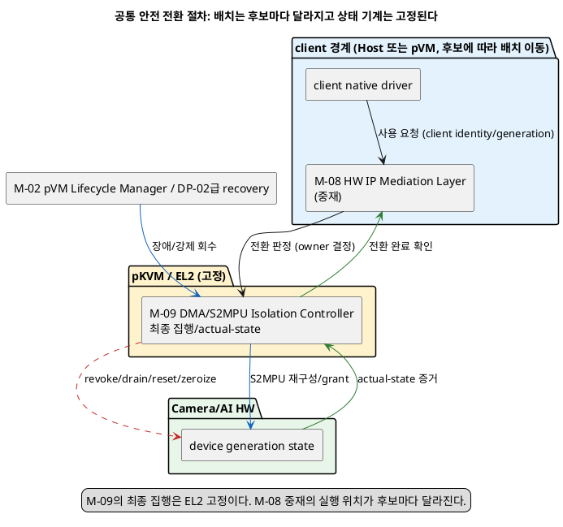
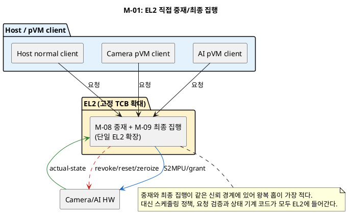
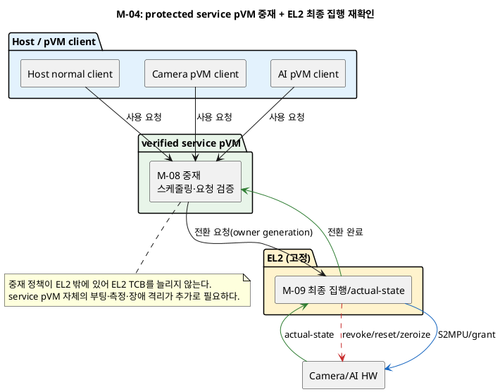

# 문제 1 재정의: Camera/AI 단일-context HW의 Host-pVM 배타 공유 및 안전한 전환 설계 공간

## 1. 상태와 문서 목적

- 상태: **후보 작성**
- 성격: 하나의 Decision Point가 아니라, 여러 Decision Point로 나누기 전의 설계 공간 조사 문서
- 최종 결정: **없음**

이 문서는 다음 자료를 기준으로 문제 1을 다시 정의한다.

- [시스템 개요](../docs/01_시스템_개요.md)
- [설계 범위와 모듈](../docs/02_설계_범위_모듈.md)
- [후보 구조 및 Decision Point 작성·평가 통합 규칙](../docs/후보구조_작성규칙.md)

`docs-align`의 기존 문제 1 답안(`후보구조_문제1_HW공유.md`, `품질위협_문제1_HW공유_기밀데이터_노출.md`와 관련 슬라이드/인포그래픽)은 이 문서를 쓰는 동안 열거나 참고하지 않았다. `old/` 디렉터리도 참고하지 않았다. 아래 내용은 시스템 개요·설계 범위 모듈과 일반 가상화/TEE 기술 지식만으로 독립적으로 도출했다.

작성 규칙은 한 Decision Point에 후보 두 개를 요구한다. 그러나 이번 조사는 후보 수를 제한하지 않고 가능한 구조를 먼저 펼치는 것이 목표다. 따라서 이 문서에서는 구조를 모두 나열한 뒤, 마지막에 **한 가지 구조 결정만 달라지는 후보 쌍**으로 나눈다. 정식 Decision Point 문서를 만들 때는 각 쌍을 별도 파일로 옮겨 후보 두 개만 비교해야 한다.

이 문서의 그림은 공통 절차와 대표 후보 M-01·M-04만 보여 준다. 정식 Decision Point로 옮길 때는 작성 규칙에 따라 해당 후보 A와 B의 그림을 각각 같은 관점으로 추가해야 한다.

## 2. 이번 문서의 고정 전제

[시스템 개요](../docs/01_시스템_개요.md) 4.1절의 다음 제약은 이번 조사에서 바꾸지 않는다.

1. **Host 비신뢰**: Host Application과 Linux kernel이 침해된 상황을 가정한다. Host가 보고하는 권한 상태, 완료 표시나 회수 결과는 단독 보안 근거가 아니다.
2. **작은 EL2 TCB**: EL2에 기능을 무제한 추가하지 않는다. EL2 extension이 필요한 후보는 platform owner 확인과 feasibility 검증을 통과해야 한다.
3. **현재 2-domain topology**: Camera pVM과 AI pVM 두 도메인, 그리고 Host normal client만 대상으로 한다. N-domain 일반화는 범위 밖이다.
4. **Camera/AI HW 배타 사용**: 단일 Context HW에는 한 시점에 하나의 주체만 접근한다. Host와 pVM의 논리적 동시 사용은 고속 시분할로 제공하며 실제 병렬 접근은 허용하지 않는다.
5. **안전한 HW 전환**: 사용 주체 전환은 `권한 회수(revoke) → 진행 작업 drain → reset → 잔류 데이터 zeroize → S2MPU 갱신 → 새 주체 권한 부여(grant)` 순서가 완료된 뒤에만 성립한다. 권한 중첩이나 비할당 도메인의 DMA 접근을 허용하지 않는다.
6. **data path의 불필요한 payload copy 회피**: 제약 4.3은 이를 성능 제약으로 명시한다. 이 문서에서는 HW 중재·전환 제어 경로가 frame/모델 같은 payload를 우회 복사하지 않아야 한다는 뜻으로 적용한다. payload 자체의 도메인 간 전달은 문제 2의 범위다.
7. **generation binding**: [설계 범위와 모듈](../docs/02_설계_범위_모듈.md) M-08은 `Camera/AI device generation, physical lease`를 명시한다. 이 문서에서 `device generation`은 한 owner가 HW를 배타 보유하는 한 회의 수명이다. 모든 lease/권한 상태는 요청자의 pVM identity와 generation에 결합하며, 같은 pVM ID의 새 generation은 이전 generation의 권한을 물려받지 않는다.

이 전제 아래에서 다음 참여 주체를 사용한다. 실행 위치는 [설계 범위와 모듈](../docs/02_설계_범위_모듈.md) 4.1절의 배치를 따른다.

| 주체 | 실행 위치 | 역할 |
|---|---|---|
| Host normal client | 비신뢰 Host EL0/EL1 | 기존 Linux Camera/AI 기능을 사용하는 논리 client 중 하나다. |
| Camera pVM / AI pVM client | pVM EL0/EL1 | 검증된 Workload identity로 HW 사용을 요청하고 결과를 소비한다. |
| M-08 HW IP Mediation Layer | 후보에 따라 EL2, Host EL1 또는 protected service pVM | device generation, physical lease, native driver 배치와 전환을 관리한다. |
| M-09 DMA/S2MPU Isolation Controller | EL2(항상 고정) | Stage-2, S2MPU, MMIO, IRQ 최종 집행과 actual-state 확인을 담당한다. 이 모듈의 최종 집행 위치는 이번 조사에서 EL2로 고정한다. |
| M-06 Protected Policy Authority | 후보에 따라 EL2 또는 protected service pVM | 요청 subject·action의 allow/deny 판정을 제공한다. 이 문서는 판정 결과를 입력으로만 쓰고 정책 authority의 배치 자체는 재결정하지 않는다. |

## 3. 문제 재정의

### 3.1 현재 문제가 아닌 것

- 문제는 Camera/AI HW를 여러 벌 마련해 Host와 각 pVM에 영구로 고정 배정하는 것이 아니다. 제약 4는 논리적 동시 사용을 고속 시분할로 제공하라고 정하므로, 전환 자체를 없애는 영구 고정 배정은 이 조사의 대상이 아니다.
- 문제는 전환 절차의 다섯 단계(revoke, drain, reset, zeroize, S2MPU 갱신)를 새로 만드는 것이 아니다. 제약 5가 이미 순서를 고정한다. 문제는 그 순서를 **어느 실행 경계가 판정하고 최종 집행하는지**, 그리고 **판정·전환을 얼마나 자주, 얼마나 싸게 만들 수 있는지**다.
- 문제는 Camera 또는 AI 내부의 프레임 처리 파이프라인 스케줄링이 아니다. Host 응용과 pVM 사이의 HW 사용 주체 전환만 다룬다.
- 문제는 pVM 간 frame 데이터를 어떻게 전달할지가 아니다. 그것은 문제 2다. 이 문서는 HW register·DMA·IRQ 자체의 배타 사용권만 다룬다.

### 3.2 새 문제 정의

> 비신뢰 Host와 pVM(Camera pVM, AI pVM)이 단일 Context Camera/AI HW를 시분할로 배타 공유할 때, 사용 주체 전환마다 이전 주체의 권한과 잔류 상태를 완전히 제거한 뒤에만 다음 주체에게 권한을 부여해야 한다. 동시에 실시간에 가까운 파이프라인(30fps 안팎)을 유지해야 하므로 전환과 판정에 드는 실행 영역 전환 비용(EL2 진입, Host↔pVM 전환, TEE 호출, IRQ 처리)을 통제해야 한다. 이를 위해 중재(다음 주체를 정하는 책임)와 최종 집행(실제 register/DMA/S2MPU 상태를 바꾸는 책임)을 어느 실행 경계에 둘지, 그리고 전환 빈도와 비용을 줄이는 메커니즘을 함께 정해야 한다.

**문제의 조건**

- 비신뢰 Host의 보고만으로 HW 권한 상태를 확정하지 않는다.
- 전환은 revoke→drain→reset/zeroize→S2MPU 갱신→grant 순서를 지킨다.
- 전환 판정과 집행 비용이 실시간 파이프라인 예산을 초과하지 않아야 한다.
- 판정·집행 로직을 담는 실행 경계의 코드량과 신뢰 범위를 통제해야 한다.

**실제 문제**

- 중재(판정)와 최종 집행(강제)을 어느 실행 경계에 둘지 정해야 한다.
- 전환·판정 빈도와 비용을 줄이는 메커니즘을 정해야 한다.

### 3.3 품질 충돌

| 선택 | 좋아지는 점 | 부담되는 점 |
|---|---|---|
| 중재·집행을 EL2에 모음 | Host를 거치지 않아 신뢰 경로가 짧다. | EL2 코드량과 검증 범위가 늘어 작은 TCB 원칙과 부딪힌다. |
| 중재를 Host EL1 driver에 둠 | 기존 Linux 스케줄링·전원 관리 자산을 재사용할 수 있다. | Host 판정을 신뢰할 수 없으므로 별도 EL2/TEE 재확인이 필요해 경로가 늘어난다. |
| 중재를 protected service pVM에 둠 | EL2 TCB를 늘리지 않고 정책·스케줄링을 분리할 수 있다. | pVM 간 왕복(IPC)과 그 자체의 장애·부팅 비용이 추가된다. |
| 분산 fast path(각 client native driver 직접 접근) | 정상 구간에서 중재자를 거치지 않아 지연이 짧다. | 전환 시점 검출과 강제 회수를 다른 경계가 대신해야 하고, client마다 driver가 늘어 TCB가 분산된다. |
| 매 접근마다 mediated pass-through | 세밀한 제어와 이상 탐지가 쉽다. | 접근마다 trap 비용이 붙어 30fps 예산을 위협할 수 있다. |
| batched lease(구간 단위 grant) | 전환 빈도가 줄어 평균 비용이 낮아진다. | grant 구간 동안 다른 주체가 대기하므로 최악 지연이 늘 수 있다. |
| doorbell/IRQ coalescing | EL2/Host 진입 횟수를 줄인다. | 완료 통지가 묶여 개별 실패의 검출과 격리가 늦어질 수 있다. |

## 4. 모든 후보가 지켜야 하는 안전 전환 절차

### 4.1 공통 상태 기계

모든 후보는 device generation의 상태를 다음 순서로만 바꿀 수 있다. 순서를 건너뛰거나 역행하는 후보는 이 문서의 비교 대상에서 제외한다.

```text
IDLE(비할당)
  → GRANTED(owner generation 보유, native queue/register 활성)
  → REVOKING(신규 submission 차단, owner에게 회수 통지)
  → DRAINING(진행 중 submission 완료 또는 취소 대기)
  → RESETTING/ZEROIZING(HW reset, 잔류 register/buffer/firmware state 소거)
  → MPU_RECONFIG(S2MPU/Stage-2를 다음 owner 또는 비할당 상태로 재구성)
  → GRANTED(다음 owner generation) 또는 IDLE
```

- `REVOKING` 진입 전에는 어떤 후보도 다음 owner에게 register/DMA 접근권을 주지 않는다.
- `MPU_RECONFIG` 완료 전에는 어떤 후보도 새 owner의 submission을 받아들이지 않는다.
- 각 단계 완료는 **actual-state 증거**(M-09가 확인한 실제 register/MMIO/DMA mapping 상태)로 판정하며, Host가 보고한 완료 표시만으로 다음 단계로 넘어가지 않는다.
- 강제 회수(장애, timeout, 정책 위반)는 `GRANTED`의 어느 시점에서도 `REVOKING`으로 진입할 수 있지만, 이후 단계는 정상 전환과 같은 순서를 지킨다.

### 4.2 공통 배치



M-09(Stage-2/S2MPU 최종 집행)는 이 문서의 모든 후보에서 EL2로 고정한다. 후보 간 실제 차이는 M-08(중재: 다음 owner를 정하고 전환을 요청하는 책임)의 배치와, 전환 판정·집행을 부르는 빈도·경로다.

## 5. 중재/최종 집행 배치의 전체 후보

### 5.1 빠른 판정표

| 번호 | 배치 구조 | M-09 최종 집행 | 현재 판정 |
|---|---|---|---|
| M-01 | EL2가 중재와 최종 집행을 모두 수행 | EL2(통합) | 기본 조건과 맞음, EL2 TCB 증가 확인 필요 |
| M-02 | Host EL1 kernel driver가 중재(스케줄·요청 취합), EL2가 최종 집행 재확인 | EL2 | 기본 조건과 맞음 |
| M-03 | Host EL1 kernel driver가 중재와 최종 집행을 모두 수행 | Host EL1 | Host 비신뢰 조건 위반으로 제외 |
| M-04 | protected service pVM이 중재, EL2가 최종 집행 재확인 | EL2 | 기본 조건과 맞음, IPC 비용 확인 필요 |
| M-05 | 분산 fast path: client native driver가 정상 구간에 직접 접근, 전환 시점만 EL2/M-08이 개입 | EL2 | 조건부: 전환 검출 메커니즘 확인 필요 |
| M-06 | TEE(Secure OS)가 중재와 최종 집행을 담당 | TEE | TEE 자원·실시간성 조건 위반으로 제외 |
| M-07 | Host EL1이 중재하되 최종 집행을 protected service pVM에 위임(EL2 우회) | protected service pVM | S2MPU 최종 집행 경계 원칙 위반으로 제외 |

`기본 조건과 맞음`은 구현이 이미 검증됐다는 뜻이 아니다. 실제 register/IRQ 지연, EL2 코드량과 pVM IPC 비용을 측정해야 선택할 수 있다.

### 5.2 M-01: EL2 직접 중재/최종 집행

EL2의 M-08 확장이 client 요청을 직접 받아 다음 owner를 판정하고, 같은 EL2 코드가 M-09 기능으로 revoke/drain/reset/zeroize/S2MPU 갱신/grant를 수행한다.



장점은 홉이 가장 적어 전환 지연이 낮을 가능성이다. 단점은 중재 정책(우선순위, fairness, 요청 검증)까지 EL2에 들어가 `작은 EL2 TCB` 원칙과 정면으로 부딪힌다는 점이다. platform owner가 이 정책 로직의 EL2 반입을 승인할지 확인이 필요하다.

### 5.3 M-02: Host EL1 중재 + EL2 최종 집행 재확인

Host EL1 kernel driver가 요청을 모으고 스케줄링(fairness, 우선순위)을 계산해 다음 owner 후보를 EL2에 **제안**한다. EL2의 M-09는 제안을 그대로 믿지 않고, 제안된 owner의 identity/generation과 정책 허가(M-06 결과)를 재확인한 뒤에만 실제 전환을 집행한다.

- Host가 틀린 owner를 제안하거나 이미 회수된 owner를 다시 제안해도 EL2가 거부한다.
- Host의 스케줄링 실패(기아, 불공정 배정)는 성능 문제일 뿐 보안 위반은 아니다. 최종 판정은 EL2가 한다.

이 구조는 Host의 기존 전원·스케줄링 자산을 재사용하면서도 최종 권한 판정을 비신뢰 영역 밖에 둔다. 단점은 Host 제안이 거부될 때마다 왕복이 한 번 늘고, Host가 고의로 잘못된 제안을 반복하면(비록 거부되더라도) EL2 처리량을 소비하는 자원 고갈 경로가 될 수 있다는 점이다. 이 경로에는 별도 rate limit이 필요하다.

### 5.4 M-03: Host EL1이 중재와 최종 집행을 모두 수행 (제외)

Host kernel driver가 register/DMA/S2MPU까지 직접 제어한다. 이는 `Host 비신뢰` 조건을 정면으로 어긴다. Host가 침해되면 reset/zeroize를 생략하거나 위조된 완료 표시로 잔류 상태를 다음 owner에 노출할 수 있다. 비교 기준선으로만 남긴다.

### 5.5 M-04: protected service pVM 중재 + EL2 최종 집행 재확인

verified service pVM이 M-08(중재)을 전담한다. Host/Camera pVM/AI pVM은 M-07급 보호 통신으로 service pVM에 사용 요청을 보내고, service pVM은 M-06 정책 결과를 확인해 스케줄링을 계산한 뒤 EL2(M-09)에 전환을 요청한다. EL2는 이번에도 요청을 그대로 집행하지 않고 요청자(service pVM) generation과 대상 owner generation을 재확인한다.



장점은 EL2 TCB를 늘리지 않으면서 M-01보다 정교한 정책(예: QoS, 여러 신호 결합)을 안전 경계 안에 둘 수 있다는 점이다. 단점은 client→service pVM→EL2 왕복이 M-01/M-02보다 한 홉 더 있고, service pVM 자체가 단일 장애점이 될 수 있다는 점이다.

### 5.6 M-05: 분산 fast path (전환 시점만 중재)

정상 구간에는 현재 owner의 native driver가 M-08/EL2를 거치지 않고 register/queue에 직접 접근한다(이미 부여된 lease 범위 안에서). 전환이 필요한 시점(다른 client의 요청, timeout, 장애)에만 EL2/M-08이 개입해 4.1의 상태 기계를 처음부터 끝까지 수행한다.

- 정상 구간의 접근 자체는 이미 `MPU_RECONFIG`가 끝난 뒤이므로 Stage-2/S2MPU가 이미 owner에게만 접근을 허용한 상태다. 즉 "직접 접근"은 안전 경계를 우회하는 것이 아니라, 매 접근을 다시 판정하지 않는다는 뜻이다.
- 전환 트리거를 어떻게 검출할지가 핵심 미확인 사항이다. Host가 "전환 필요"를 알려도 신뢰할 수 없으므로, EL2가 독립적으로 알아낼 수단(예: 다음 client의 직접 요청을 EL2가 먼저 받는 구조, 또는 주기적 polling)이 필요하다.

이 구조는 사실상 M-01/M-02/M-04 각각과 결합할 수 있는 **기법**에 가깝다(6절의 batched lease, doorbell과도 겹친다). 배치 자체로는 "누가 전환을 시작할 권리를 갖는가"라는 질문에 M-01/M-02/M-04 중 하나로 다시 귀결되므로, 이 문서는 M-05를 독립 배치가 아니라 6절의 switching 기법(특히 batched lease, S-03)과 결합되는 특수 형태로 취급한다.

### 5.7 M-06: TEE(Secure OS)가 중재/최종 집행 (제외)

TEE가 HW register/DMA를 직접 제어하면 평문 키·모델과 같은 수준의 신뢰를 HW 중재에도 요구하게 되지만, TEE는 대용량·고빈도 실시간 I/O를 위한 자원(메모리, 인터럽트 지연)을 목적하지 않는다. [시스템 개요](../docs/01_시스템_개요.md) 4.2절은 TEE 메모리가 작다고 명시한다. 30fps 수준의 반복 호출을 TEE 호출 경로에 얹으면 GlobalPlatform 호환 SMC 경로의 지연이 그대로 프레임 예산을 잠식한다. 비교 기준선으로만 남긴다.

### 5.8 M-07: Host 중재 + protected service pVM 최종 집행 (제외)

M-09(Stage-2/S2MPU 최종 집행)를 EL2 밖(service pVM)에 두면, service pVM이 스스로 최종 격리 상태를 강제할 하드웨어 권한이 없다. S2MPU/Stage-2 구성은 EL2 권한이 필요한 하드웨어 동작이므로, service pVM은 결국 EL2에 요청을 전달할 뿐 "최종 집행"의 실질 주체가 될 수 없다. 이 조합은 이름만 다를 뿐 M-04와 같은 구조로 수렴하므로 별도 후보가 아니라 제외한다.

## 6. context/exception switch 비용 절감 기법의 전체 후보

이 절의 후보는 5절의 배치와 독립적으로 조합할 수 있는 **기법** 축이다.

### 6.1 빠른 판정표

| 번호 | 기법 | 현재 판정 |
|---|---|---|
| S-01 | 영구 정적 direct 할당(전환 없음) | 시분할 공유 조건 위반으로 제외 |
| S-02 | mediated pass-through(매 접근 trap-and-emulate) | 기본 조건과 맞음, 처리량 확인 필요 |
| S-03 | batched lease(구간 단위 grant, 구간 내 재판정 없음) | 기본 조건과 맞음 |
| S-04 | doorbell/interrupt coalescing(완료 통지 묶음, HW 보조 직접 주입) | 기본 조건과 맞음, HW 지원 확인 필요 |
| S-05 | command queue/ring 기반 비동기 dispatch | 기본 조건과 맞음, 중재자 배치와 결합 필요 |
| S-06 | windowed direct mapping(구간 동안 owner에게 register 직접 매핑, S-03과 결합) | 기본 조건과 맞음, S-03의 구현 형태 |

### 6.2 S-01: 영구 정적 direct 할당 (제외)

Camera pVM과 AI pVM, Host에 각각 별도 HW를 고정 배정하거나 한 client에게 영구히 배정하면 전환 자체가 없어 비용이 0에 가깝다. 그러나 [시스템 개요](../docs/01_시스템_개요.md) 4.1절 제약 7은 "논리적 동시 사용을 고속 시분할로 제공"하라고 명시하며 단일 Context HW를 전제한다. 영구 배정은 이 전제와 "단일 Context HW"라는 문제 조건 자체를 바꾸므로 이번 조사에서는 후보가 아니라 제외 근거로 남긴다. 물리적으로 HW를 복수 구매하는 방향은 이 문서의 범위 밖이다.

### 6.3 S-02: mediated pass-through

매 register/queue 접근을 EL2 또는 중재자가 trap해 검사·중계한다. VFIO의 mediated device(mdev) 프레임워크, Intel GVT-g나 AMD MxGPU류 GPU 가상화가 쓰는 방식과 같은 계열이다. 가장 세밀한 통제가 가능하지만 접근마다 실행 영역 전환 비용이 붙는다. 30fps·프레임 주기 33ms 안에서 register 접근 빈도가 높은 워크로드라면 이 비용이 예산을 잠식할 수 있으므로, 대표 워크로드로 접근 빈도와 trap 비용을 실측해야 한다.

### 6.4 S-03/S-06: batched lease와 windowed direct mapping

owner가 한 번 grant를 받으면 여러 frame 또는 고정 시간 quantum 동안 매 접근을 재판정하지 않는다. `MPU_RECONFIG` 완료 뒤 Stage-2/S2MPU가 이미 해당 owner에게만 접근을 허용하므로, owner의 실제 register/queue 접근은 mediation 계층을 다시 거치지 않고 직접 이뤄질 수 있다(S-06, windowed direct mapping). 이는 GPU 가상화의 time-sliced 스케줄링(quantum 단위 배정) 패턴과 같은 계열이다.

- 전환 빈도가 줄어 평균 실행 영역 전환 비용이 낮아진다.
- quantum이 길면 다른 client의 최대 대기 시간(지연)이 늘어난다. quantum 길이는 fairness/지연 트레이드오프의 조정값이다.
- 강제 회수(장애, 정책 위반)는 quantum 중간에도 4.1의 상태 기계를 그대로 따라야 한다.

### 6.5 S-04: doorbell/interrupt coalescing

완료 통지를 개별 IRQ 대신 묶어서 전달하거나, ARM GICv3/v4의 ITS·직접 vLPI 주입처럼 HW가 EL2 trap 없이 VM에 인터럽트를 직접 전달하는 경로를 쓴다.

- 장점: EL2/Host 진입 횟수가 줄어 실행 영역 전환 비용이 낮아진다.
- 단점: 통지를 묶으면 개별 완료·실패의 검출이 늦어질 수 있다. 안전 전환의 `actual-state 증거` 확인(4.1)은 이 묶음과 별개로, 전환 시점에는 개별 확인을 유지해야 한다. 즉 doorbell coalescing은 **정상 동작 중 완료 통지**에만 적용하고, 전환 절차의 상태 확인에는 적용하지 않는다.
- HW/GIC가 실제로 vLPI 직접 주입을 지원하는지는 SoC별로 다르므로 확인이 필요하다.

### 6.6 S-05: command queue/ring 기반 비동기 dispatch

owner가 여러 job을 큐에 미리 제출하고, HW 또는 중재자가 큐에서 순서대로 꺼내 처리한다. 이 기법은 5절의 M-04(service pVM 중재)처럼 여러 client의 job을 한 곳에서 모아 처리하는 배치와 특히 잘 맞는다(job 단위로 중재하되 client마다 매번 register를 다시 여닫지 않아도 됨). M-01/M-02와 결합할 때는 큐 자체를 EL2 또는 Host가 관리해야 하므로 코드 위치가 배치 선택에 따라 달라진다.

## 7. 배치 x 기법 조합 가능 범위

5절의 배치(M-01/M-02/M-04, 유효 후보만)와 6절의 기법(S-02/S-03·S-06/S-04/S-05, 유효 후보만)은 원칙상 서로 조합할 수 있다. 조합 수는 3×4=12개다.

| 배치 \ 기법 | S-02 mediated pass-through | S-03/S-06 batched lease | S-04 doorbell coalescing | S-05 queue 비동기 dispatch |
|---|---|---|---|---|
| M-01 EL2 직접 | 가능, EL2 부담 최대 | 가능 | 가능(HW 지원 확인) | 조건부(큐를 EL2가 관리) |
| M-02 Host 제안 + EL2 재확인 | 가능 | 가능 | 가능(HW 지원 확인) | 가능(큐를 Host가 관리, EL2가 재확인) |
| M-04 service pVM 중재 | 가능, IPC 부담 최대 | 가능 | 가능(HW 지원 확인) | 가능성 있음(큐를 service pVM이 관리) |

S-04(doorbell coalescing)는 M-01/M-02/M-04 어느 배치와도 결합할 수 있는 정상-동작 최적화이며, 4.1의 상태 기계 자체를 바꾸지 않는다. 이 문서는 S-04를 배치 선택과 독립적인 조정값으로 본다.

## 8. M-04 + S-03/S-06 구조의 구체적인 동작

대표로 M-04(protected service pVM 중재)와 S-03/S-06(batched lease, windowed direct mapping)을 결합한 구조의 정상·전환·실패 흐름을 적는다. 다른 조합도 같은 M-09 최종 집행과 4.1 상태 기계를 재사용한다.

### 8.1 정상 lease 획득

1. client(Host/Camera pVM/AI pVM)가 M-06이 확인한 authorization과 함께 service pVM에 사용 요청을 보낸다.
2. service pVM이 현재 owner, 대기열과 quantum 정책으로 다음 owner를 계산한다.
3. service pVM이 EL2(M-09)에 `owner generation, quantum 길이`를 담아 전환을 요청한다.
4. EL2가 이전 owner를 4.1의 상태 기계로 회수하고, 새 owner에게 S2MPU/Stage-2를 재구성한다.
5. EL2가 actual-state 증거와 함께 완료를 service pVM에 알린다.
6. service pVM이 client에게 lease 시작을 알린다. client의 native driver는 quantum이 끝나거나 회수될 때까지 EL2/service pVM을 거치지 않고 register/queue에 직접 접근한다.

### 8.2 quantum 종료 또는 다음 client 요청에 의한 전환

1. quantum이 끝나거나 다른 client의 요청이 대기열에 들어오면 service pVM이 다음 owner를 다시 계산한다.
2. 8.1의 3~5단계를 반복한다. 이전 owner에게는 revoke 통지가 가고, 진행 중이던 submission은 drain을 기다린다.
3. drain이 timeout 안에 끝나지 않으면 강제 회수 경로(8.3)로 넘어간다.

### 8.3 client 또는 service pVM 장애

1. client crash/hang은 M-09가 register/IRQ 활동 정지로 감지하거나 M-02급 lifecycle 통지로 트리거된다(신뢰 근거는 M-09의 actual-state 확인이다).
2. EL2가 즉시 `REVOKING`으로 진입해 강제 drain/reset/zeroize를 수행하고 다음 owner에게 넘어가지 않은 채 `IDLE`로 되돌린다.
3. service pVM 자체가 장애면 EL2는 이미 부여된 owner의 lease를 quantum 만료까지 유지하되, 새 전환 요청을 받아들이지 않는다. service pVM 복구 뒤 현재 actual-state를 재확인(reconciliation)한 다음에만 새 전환을 재개한다.

### 8.4 모듈 사이 책임 경계

| 실행 위치 | 모듈 | 해야 하는 일 | 하면 안 되는 일 |
|---|---|---|---|
| Host/pVM client | native driver | quantum 안에서 직접 register/queue 접근, 완료 시 명시적 release | EL2 재확인 없이 다음 owner를 자칭하기 |
| verified service pVM | M-08 중재 | 스케줄링, 요청 검증, 전환 요청, quantum 정책 | S2MPU/Stage-2 직접 조작 |
| EL2 | M-09 최종 집행 | revoke/drain/reset/zeroize/S2MPU 재구성, actual-state 확인, 강제 회수 | 스케줄링 정책·fairness 계산 |
| Host EL0/EL1 | M-04(선택 시) 스케줄링 제안 | fairness/우선순위 제안 | 최종 owner 판정, S2MPU 조작 |

## 9. 의미 있는 후보 구조 쌍

### 9.1 중재/최종 집행 배치 쌍

| 쌍 | 후보 A | 후보 B | 하나만 바뀌는 결정 |
|---|---|---|---|
| D-01 | M-01 EL2 직접 중재/집행 | M-02 Host 제안 + EL2 재확인 | 중재 판정 로직을 EL2 안에 둘지 Host 제안 + EL2 게이트로 나눌지 |
| D-02 | M-02 Host 제안 + EL2 재확인 | M-04 protected service pVM 중재 + EL2 재확인 | 중재 판정을 비신뢰 Host에 둘지 검증된 service pVM에 둘지 |
| D-03 | M-01 EL2 직접 중재/집행 | M-04 protected service pVM 중재 + EL2 재확인 | 중재 정책 코드를 EL2 TCB에 둘지 별도 service pVM에 둘지 |

D-01의 후보 B, D-02·D-03의 후보 B는 모두 "M-09 최종 집행은 EL2 고정"이라는 공통 전제를 유지하므로 세 쌍 모두 한 가지 결정(중재 판정의 위치)만 다르다.

### 9.2 switching 기법 쌍

| 쌍 | 후보 A | 후보 B | 결정 질문 |
|---|---|---|---|
| D-04 | S-02 mediated pass-through(매 접근 재판정) | S-03/S-06 batched lease(구간 단위 재판정) | 매 접근을 재판정할지 구간 단위로 재판정할지 |
| D-05 | S-03/S-06 batched lease, 완료 통지는 개별 IRQ | S-03/S-06 batched lease + S-04 doorbell coalescing | 정상 완료 통지를 개별로 유지할지 묶어서 처리할지 |

D-04는 이번 조사의 대표 switching 비교다. D-05는 D-04에서 batched lease를 고른 뒤에만 의미가 있는 후속 결정이다.

### 9.3 넓게 비교할 대표 쌍

M-02(Host 제안 + EL2 재확인)와 M-04(service pVM 중재 + EL2 재확인)는 이번 조건에서 가장 넓게 비교할 수 있는 대표 배치 쌍이다. 정식 Decision Point로 옮길 때는 D-02로 좁혀서 비교한다.

## 10. 품질속성 방향 비교

실측값과 승인된 기준이 없으므로 별점과 총점은 매기지 않는다.

| 후보 | 보안 조건 | 전환/판정 성능 방향 | 변경 용이성 방향 | TCB/자원 영향 | 장애 영향 |
|---|---|---|---|---|---|
| M-01 EL2 직접 | 충족 가능 | 홉이 가장 적어 유리할 가능성 | EL2 코드 변경이 가장 크다 | EL2 TCB 증가폭이 가장 크다 | EL2 오류가 모든 client에 영향 |
| M-02 Host 제안 + EL2 게이트 | 충족 가능 | Host 제안 거부 시 왕복 추가 | Host 스케줄러 재사용 가능 | EL2 TCB 증가폭이 작다 | Host 장애는 성능에만 영향, 보안은 EL2가 유지 |
| M-04 service pVM 중재 + EL2 게이트 | 충족 가능 | service pVM 왕복이 추가 홉 | 정책 변경을 EL2 밖에서 처리 | EL2 TCB 증가 없음, service pVM 자원 필요 | service pVM 장애가 새 전환을 막을 수 있음(기존 owner는 유지) |
| S-02 mediated pass-through | 충족 가능 | 접근마다 비용, 최악 지연 우려 | 세밀한 로그·통제가 쉬움 | 추가 상태 적음 | 개별 접근 단위로 격리 가능 |
| S-03/S-06 batched lease | 충족 가능 | 평균 비용은 낮지만 최악 대기 증가 가능 | quantum 정책 변경만 필요 | 추가 상태(quantum 타이머) | 강제 회수 시에도 상태 기계 동일 |
| S-04 doorbell coalescing | 충족 가능하나 확인 필요 | 정상 구간 진입 횟수 감소 | HW/GIC 의존성 증가 | HW 지원 여부에 좌우 | 개별 실패 검출 지연 가능성 |

## 11. 알려진 방식과 이번 설계에 주는 근거

### 11.1 공식 문서/표준

| 자료 | 확인한 사실 | 이번 설계에서의 사용 범위 |
|---|---|---|
| [Linux VFIO](https://docs.kernel.org/driver-api/vfio.html), [vfio-mdev](https://docs.kernel.org/driver-api/vfio-mediated-device.html) | IOMMU 보호 기반 device passthrough와, 하나의 물리 장치를 여러 가상 인스턴스로 나누는 mediated device(mdev) 프레임워크를 제공한다. | S-02(mediated pass-through)와 5절 배치 축의 "중재자가 register 접근을 매개"하는 구조의 선례다. |
| [ARM GICv3/v4 아키텍처](https://developer.arm.com/documentation/ihi0069/latest/) | ITS와 직접 vLPI 주입으로 하이퍼바이저 trap 없이 VM에 인터럽트를 전달할 수 있다. | S-04(doorbell/interrupt coalescing)의 HW 근거다. SoC별 실제 지원 여부는 확인 필요다. |
| [PCI-SIG TDISP (TEE Device Interface Security Protocol)](https://pcisig.com/tee-device-interface-security-protocol-tdisp) | 신뢰 도메인에 장치를 배정할 때 LOCKED/RUN/ERROR 등 상태 기계로 장치 수명을 관리하는 공식 절차를 정의한다. | 4.1의 안전 전환 상태 기계가 임의 설계가 아니라 산업 표준과 같은 계열임을 뒷받침한다. 이 SoC의 Camera/AI HW가 TDISP를 구현하지는 않으므로 직접 재사용은 아니다. |
| [Arm Confidential Compute Architecture, Device Assignment 확장](https://developer.arm.com/documentation/den0125/latest/) | Realm에 장치를 배정할 때 신뢰 경계를 넘는 소유권 이전과 격리를 다루는 아키텍처를 제시한다. | M-01/M-04처럼 EL2급 경계가 장치 배정을 최종 판정하는 구조의 공식 선례다. |
| [Intel GVT-g](https://github.com/intel/gvt-linux/wiki), AMD MxGPU 계열 시분할 GPU 가상화 | mediated pass-through로 여러 VM이 GPU를 시분할 공유하며, quantum 단위 스케줄링을 사용한다. | S-03/S-06(batched lease)의 스케줄링 quantum 개념 선례다. TEE 신뢰 조건은 다루지 않으므로 보안 근거로는 쓰지 않는다. |

### 11.2 논문

| 논문 | 확인한 내용 | 이번 설계에서의 사용 범위 |
|---|---|---|
| [vTZ: Virtualizing ARM TrustZone, USENIX Security 2017](https://www.usenix.org/conference/usenixsecurity17/technical-sessions/presentation/hua) | 단일 TrustZone류 보안 실행 환경을 여러 VM이 안전하게 시분할 공유하는 구조를 다룬다. | 단일 Context 보안 HW를 여러 pVM이 공유하는 이번 문제와 같은 계열의 선행 사례다. 구체 메커니즘은 다르므로 그대로 채택하지 않는다. |
| [ReZone, USENIX Security 2022](https://www.usenix.org/conference/usenixsecurity22/presentation/cerdeira) | 신뢰 경계 호출과 실행 영역 전환 비용을 측정하며, 짧은 작업을 자주 호출하면 부담이 커질 수 있음을 보인다. | S-02 대 S-03/S-06 비교(D-04)에서 접근 빈도별 전환 비용을 반드시 실측해야 한다는 근거다. |
| [Komodo, SOSP 2017](https://dl.acm.org/doi/10.1145/3132747.3132782) | 작은 신뢰 코드로 attestation/격리 모니터를 구현할 수 있음을 형식 검증으로 보인다. | M-01의 EL2 TCB 확대 우려에 대한 반대 논거(작게 만들 수 있다는 선례)로 참고하되, 이 SoC에서 같은 검증 수준을 재현할 수 있는지는 확인 필요다. |
| [StrongBox, MobiSys 2022](https://dl.acm.org/doi/10.1145/3498361.3538940) | 모바일 GPU를 TEE 신뢰 경계 안에서 시분할 공유하는 구조를 제시한다. | Camera/AI 가속기를 비신뢰 Host로부터 격리하며 시분할하는 이번 문제와 목적이 유사한 최근 선례다. |
| [Telekine, USENIX Security 2020](https://www.usenix.org/conference/usenixsecurity20/presentation/hunt) | GPU 가속기 공유 시 타이밍 기반 side channel 위험을 분석한다. | S-04(doorbell coalescing)나 S-03(batched lease)의 타이밍 패턴이 side channel을 만들 수 있는지 확인이 필요하다는 근거다. |

## 12. 검증 기준

### 12.1 공통 필수 조건

- 4.1 상태 기계의 순서 위반(단계 건너뛰기·역행): **0건**
- `MPU_RECONFIG` 완료 전 새 owner의 register/DMA 접근 성공: **0건**
- 이전 owner의 잔류 register/firmware/DMA mapping이 다음 owner에게 노출: **0건**
- 동시에 `GRANTED` 상태인 owner generation: **최대 1개**
- Host가 보고한 완료 표시만으로 다음 상태 전이가 성립한 사례: **0건**
- 강제 회수 뒤 이전 owner generation의 지연 완료/재시도가 수용된 사례: **0건**

### 12.2 반드시 측정할 항목

- 배치별(M-01/M-02/M-04) 전환 판정~grant 완료까지의 지연 분포(p50/p95/p99)
- 기법별(S-02/S-03·S-06) 접근당 또는 구간당 실행 영역 전환 횟수와 비용
- doorbell coalescing 적용 전후의 완료 검출 지연과 개별 실패 격리 시간
- EL2 코드량(KLoC)과 검증 범위의 배치별 증가폭
- service pVM 자체의 부팅·측정 시간과 정상 전환 경로에 미치는 영향
- 30fps·프레임 주기 33ms 예산 대비 전환 비용의 실제 소비 비율

## 13. 후보 누락 가능성과 한계

- 이 SoC의 Camera/AI HW가 SR-IOV류 하드웨어 다중화(가상 함수)를 부분적으로 지원할 가능성은 확인하지 못했다. 지원한다면 "단일 Context HW"라는 문제 조건 자체가 바뀌므로 별도 재조사가 필요하다.
- GIC ITS/vLPI의 실제 지원 여부, S2MPU의 재구성 소요 시간과 batched lease의 quantum 상한은 이 문서만으로 판정할 수 없다. 대표 PoC가 필요하다.
- Host EL1 driver가 요청을 취합하는 M-02에서, Host의 고의적 반복 오제안이 만드는 자원 고갈 경로에 대한 별도 rate limit 설계는 이 문서에서 다루지 않았다.
- 여러 Camera 또는 여러 AI 가속기가 동시에 존재하는 경우(같은 도메인 안에서 HW가 둘 이상)는 이번 2-domain·단일 HW 전제 밖이므로 검토하지 않았다.
- TEE가 HW를 직접 제어하지 않는다는 판정(M-06 제외)은 이 시스템의 TEE 자원 제약을 근거로 한 판단이며, 다른 SoC의 더 큰 TEE 자원에는 적용되지 않을 수 있다.

## 14. 정리와 다음 결정 순서

이 조사에서 유효하게 남은 배치 후보는 M-01, M-02, M-04다(M-03/M-06/M-07은 제외). 유효하게 남은 기법 후보는 S-02, S-03/S-06, S-04, S-05다(S-01은 제외). 이 둘은 원칙상 독립적으로 조합할 수 있다.

정식 Decision Point는 다음 순서로 나누는 것이 적절하다.

1. D-01~D-03에서 중재 배치(EL2/Host 제안/service pVM)를 한 변수씩 비교한다. M-09 최종 집행은 세 쌍 모두 EL2로 고정한다.
2. 배치를 정한 뒤 D-04에서 switching 기법(mediated pass-through 대 batched lease)을 비교한다.
3. batched lease를 고르면 D-05에서 doorbell coalescing 적용 여부를 후속 결정으로 비교한다.
4. 배치와 기법이 정해지면 7절의 조합표에서 확정된 셀만 실제 구현 대상으로 남긴다.

M-01과 M-04는 이번 조건에서 가장 넓게 비교할 수 있는 대표 배치 쌍이다. 다만 이 쌍은 EL2 TCB 증가와 service pVM 신뢰 확장이 함께 달라지므로, 정식 Decision Point로 만들 때는 D-02·D-03으로 나누는 편이 규칙에 맞는다.
