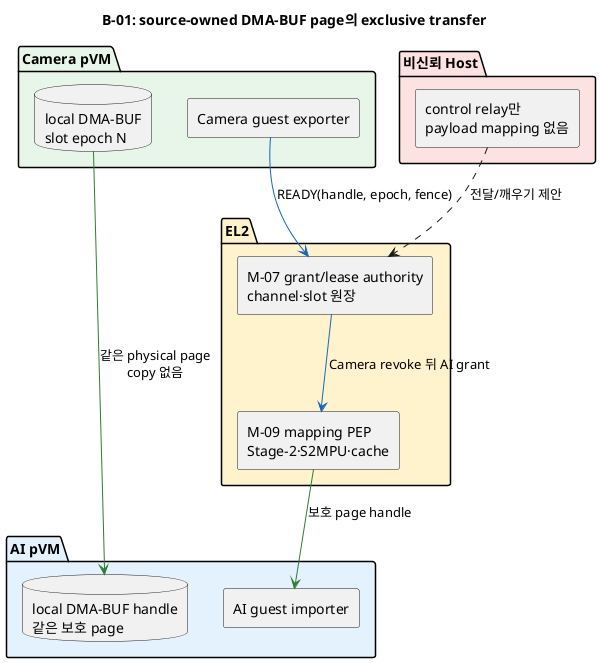

# 문제 2 재정의: pVM 간 DMA-BUF frame 전달 설계 공간

## 1. 상태와 문서 목적

- 상태: **후보 작성**
- 성격: 여러 Decision Point로 나누기 전의 설계 공간 조사 문서
- 최종 결정: **없음**

이 문서는 다음 자료를 기준으로 문제 2의 후보 구조를 다시 펼친다.

- [시스템 개요](../docs/01_시스템_개요.md)
- [설계 범위와 모듈](../docs/02_설계_범위_모듈.md)
- [후보 구조 작성 규칙](../docs/후보구조_작성규칙.md)
- [문제 3 설계 공간 문서](문제3_virtio-blk_공용저장_암호화_설계공간.md)는 형식만 참고한다.

기존 문제 2 후보 문서는 답으로 참고하지 않았다. `old/` 디렉터리도 참고하지 않았다.

후보 구조 작성 규칙은 한 Decision Point에 정확히 두 후보를 요구한다. 이번 문서는
가능한 control path와 data path를 먼저 펼치고, 마지막에 **한 가지 구조 결정만
달라지는 후보 쌍**으로 나눈다. 정식 Decision Point에서는 각 쌍을 별도 파일로
옮겨야 한다.

## 2. 고정 조건

1. Camera pVM에서 만든 대용량 frame을 AI pVM에 전달한다.
2. Host Application과 Host Linux kernel은 비신뢰 영역이다.
3. frame 원본과 추론 중간 자료를 Host에 평문으로 노출하지 않는다.
4. 승인된 Camera→AI 2-domain topology만 다룬다.
5. data path의 불필요한 payload copy를 피한다.
6. channel, endpoint, page, DMA mapping, buffer slot과 fence를 pVM identity,
   generation과 pipeline epoch에 묶는다.
7. 한 slot에는 한 시점에 하나의 writer만 허용한다.
8. 장애·종료·timeout 뒤 mapping과 buffer를 강제로 회수할 수 있어야 한다.
9. EL2는 작은 TCB를 유지하며 bulk frame 처리나 일반 DMA-BUF framework 전체를
   직접 구현하지 않는다.
10. Camera/AI HW의 DMA 권한은 M-08/M-09의 안전한 장치 lease와 S2MPU 집행을 따른다.

## 3. 문제 재정의

### 3.1 DMA-BUF fd를 넘기는 문제가 아닌 이유

Linux DMA-BUF는 한 Linux kernel 안에서 exporter가 backing storage와
`struct dma_buf`를 만들고 importer가 `dma_buf_attachment`로 같은 buffer를 device에
mapping하는 framework다. fd, `struct dma_buf`, scatter-gather table과 `dma_fence`는
각 pVM kernel의 local object다.

따라서 Camera pVM의 DMA-BUF fd 값을 AI pVM에 그대로 전달해도 같은 object를 뜻하지
않는다. Host가 fd를 받아 다시 export하면 Host가 보호 page를 볼 수 있거나 주소와
fence를 신뢰하는 문제가 생긴다. pVM 사이에는 다음 두 계층이 모두 필요하다.

1. **보호 page 전달 계층**: EL2가 page/slot의 owner, borrower, mapping과 S2MPU를
   확인하고 실제로 lend/share/remap/copy한다.
2. **guest DMA-BUF bridge**: 각 pVM의 guest driver가 보호 handle을 자기 kernel의
   local DMA-BUF와 local fence로 표현한다.

### 3.2 새 문제 정의

> Camera pVM이 Camera HW로 채운 frame을 AI pVM과 AI HW가 소비해야 한다. 비신뢰
> Host가 control message를 재생·변조하거나 buffer를 map해도 평문 frame을 얻지
> 못해야 한다. 생산자, 소비자, 장치 DMA와 CPU cache가 같은 slot을 동시에 잘못
> 사용해서도 안 된다. 반대로 frame마다 HVC, Stage-2 remap, copy와 interrupt를
> 반복하면 실시간 지연과 CPU 사용량이 커진다. 따라서 누가 channel·grant·lease를
> 판정할지, 보호 page를 어떻게 이동·공유할지, DMA-BUF와 fence를 각 pVM에서 어떻게
> 연결할지, fast path의 보호 경계 횡단을 어떻게 줄일지 정해야 한다.

### 3.3 품질 충돌

| 선택 | 좋아지는 점 | 부담되는 점 |
|---|---|---|
| page를 exclusive transfer | writer를 하나로 제한하고 reclaim 상태가 명확하다. | frame마다 mapping·TLB·cache 전환 비용이 생길 수 있다. |
| source page를 AI에 read-only share | payload copy 없이 producer/consumer overlap이 가능하다. | producer 재사용과 consumer 완료를 정확히 동기화해야 한다. |
| pre-registered pool | per-frame pin/map/HVC를 줄일 수 있다. | 고정 memory와 slot별 epoch·quota·강제 회수가 필요하다. |
| protected broker를 경유 | Host 없이 policy와 복구를 모을 수 있다. | 추가 VM 전환과 공용 장애점이 생긴다. |
| protected copy | 공유 mapping 수명과 동시 접근을 줄인다. | frame 크기에 비례한 memory bandwidth와 copy 지연이 든다. |
| encrypted Host bounce | 기존 virtio/Host relay를 재사용할 수 있다. | 암복호화, sequence/MAC와 최소 두 번의 copy가 필요하다. |
| ring·polling fast path | HVC와 interrupt 수를 줄일 수 있다. | CPU·전력과 overload 격리 부담이 늘 수 있다. |

## 4. 모든 후보가 지켜야 하는 channel·slot 계약

### 4.1 보호 원장

```text
channel_id
camera_pvm_id, camera_generation
ai_pvm_id, ai_generation
pipeline_epoch
pool_id
slot_id, slot_epoch
owner                      # CAMERA, AI, PROTECTED_POOL
state                      # FREE, CAMERA_WRITE, READY, AI_READ, RECLAIMING, POISONED
producer_job_seq
consumer_job_seq
format, width, height, stride, plane_count
valid_length
mapping_set                # CPU Stage-2와 device S2MPU 권한
lease_deadline
integrity_tag              # Host relay/encrypted 후보에서 사용
```

Host에 복제한 metadata는 성능용 cache일 뿐 보안 원장이 아니다. Host가 `slot_id`,
generation, format 또는 fence를 바꿔도 보호 경계가 거부해야 한다.

### 4.2 공통 상태 기계

```text
FREE
  -> CAMERA_WRITE
  -> READY
  -> AI_READ
  -> RECLAIMING
  -> FREE

검증 실패, timeout, producer/consumer 종료
  -> POISONED
  -> DMA 중지·mapping 회수·cache 처리·zeroize 뒤 FREE
```

정상 전달은 다음 순서를 지킨다.

1. M-03이 Camera/AI endpoint와 `pipeline_epoch`를 bind한다.
2. M-07이 free slot과 현재 `slot_epoch` capability를 Camera 쪽에 준다.
3. M-09가 Camera CPU/Camera HW에 필요한 write 권한만 설정한다.
4. Camera HW completion과 producer fence가 끝난다.
5. M-07/M-09가 Camera의 추가 write와 DMA를 막고 cache clean을 완료한다.
6. 보호 원장이 slot을 `READY`로 바꾼다.
7. M-09가 AI CPU/AI HW에 read 또는 필요한 DMA 권한을 설정한다.
8. AI가 local DMA-BUF handle과 fence로 frame을 소비한다.
9. consumer completion 뒤 AI mapping, S2MPU와 cache 상태를 회수한다.
10. `slot_epoch`를 증가시키고 slot을 `FREE`로 돌린다.

단계 5가 끝나기 전에 AI에 알리거나, 단계 9가 끝나기 전에 Camera가 slot을 재사용하면
안 된다. stale completion과 재생 capability는 `pipeline_epoch + slot_epoch + job_seq`로
거부한다.

## 5. control authority와 전달 경로의 전체 후보

### 5.1 빠른 판정표

| 번호 | control 구조 | 최종 grant/lease 판정 | 정상 frame 알림 | 현재 판정 |
|---|---|---|---|---|
| C-01 | Host relay + EL2 grant authority | EL2 M-07/M-09 | Host relay/virtio·vsock | 기본 조건과 맞음, Host는 최종 상태가 아님 |
| C-02 | pVM→EL2→pVM direct protected channel | EL2 M-07/M-09 | HVC와 direct virtual IRQ/doorbell | 대표 후보, 새 pKVM ABI 필요 |
| C-03 | protected service pVM broker + EL2 PEP | service pVM M-06/M-07, EL2 M-09 | 보호 ring/doorbell | 조건부: 추가 VM 전환·장애점 |
| C-04 | setup 때 발급한 epoch capability + peer ring | EL2가 setup/revoke 때 판정 | fast path ring index와 조건부 doorbell | 대표 fast path, descriptor 검증 필요 |
| C-05 | TEE channel broker + EL2 PEP | TEE M-06, EL2 M-09 | SMC/HVC | 조건부: 대량·고빈도 control에 부적합할 수 있음 |
| C-06 | SoC hardware mailbox/resource controller | 보호 HW와 EL2 | HW doorbell | 조건부: target SoC 기능 필요 |
| C-07 | Host relay가 grant와 owner를 최종 결정 | Host | Host IPC | Host 비신뢰 조건 위반으로 제외 |
| C-08 | Camera/AI pVM이 mutual trust로만 협의 | 두 pVM | peer message | 강제 회수·제3자 실제 상태 확인이 없어 제외 |

### 5.2 C-01: Host relay와 EL2 grant authority

Host의 M-07 relay가 endpoint discovery, request queue와 wake-up을 처리한다. 모든
control message에는 보호 capability가 있고 EL2가 source/destination generation,
slot state와 실제 mapping을 확인한다. Host가 message를 drop하면 가용성은 잃을 수
있지만 권한을 얻거나 frame을 읽을 수는 없어야 한다.

기존 Host mechanism을 재사용할 수 있으나 frame마다 guest→Host→guest scheduling과
가상 IRQ가 생길 수 있다.

### 5.3 C-02: EL2 direct protected channel

Camera pVM이 `READY(slot_handle)`을 HVC로 EL2에 제출한다. EL2가 원장을 갱신하고
AI pVM에 protected virtual IRQ 또는 doorbell을 넣는다. Host userspace relay를
fast path에서 제거할 수 있다.

EL2는 payload를 복사하거나 DMA-BUF object를 만들지 않는다. 작은 channel state,
generation과 mapping PEP만 가진다. per-frame HVC와 interrupt injection 비용은
Q-01~Q-04에서 별도로 줄인다.

### 5.4 C-03: protected service pVM broker

service pVM이 endpoint, free-list, quota, timeout과 recovery transaction을 관리한다.
EL2는 service pVM 요청도 capability와 실제 page state에 맞는지 확인한다. broker가
payload를 map하지 않는 metadata-only 구조와, payload를 복사하는 구조를 구분한다.

metadata-only broker는 신뢰 영역 확대를 줄이지만 EL2 mapping ABI가 여전히 필요하다.
payload broker는 data path B-05에 해당하며 frame을 볼 수 있는 trusted domain과
copy 비용이 추가된다.

### 5.5 C-04: epoch capability와 peer ring

pipeline setup 때 EL2가 pool, slot 범위, 방향, 최대 frame 수와 만료 시각을 묶은
capability를 발급한다. fast path에서는 Camera가 shared metadata ring에 descriptor를
넣고 AI가 읽는다. EL2는 매 frame policy를 다시 계산하지 않고 ring/slot epoch와
S2MPU transition만 검증하거나 미리 정한 상태 기계로 집행한다.

ring 자체가 Host 가시 memory라면 descriptor를 MAC 또는 보호 capability에 묶고
payload page는 Host에 map하지 않는다. doorbell은 regrant 완료와 원자적으로 연결해야
한다.

## 6. payload data path의 전체 후보

### 6.1 빠른 판정표

| 번호 | data 구조 | payload 이동 | Host 평문 | 현재 판정 |
|---|---|---|---|---|
| B-01 | source-owned page exclusive transfer | 같은 page의 owner/mapping 전환 | 없음 | 대표 후보, pVM↔pVM grant 확장 필요 |
| B-02 | source-owned page read-only lend | 같은 page를 AI에 RO mapping | 없음 | 대표 후보, producer 재사용·reclaim 주의 |
| B-03 | destination-owned pre-registered pool | AI slot에 Camera HW가 직접 DMA write | 없음 | 대표 후보, S2MPU와 device lease 결합 필요 |
| B-04 | neutral protected pool | EL2/service가 소유한 slot을 양쪽에 순차 lend | 없음 | 조건부: 보호 allocator와 상주 memory 필요 |
| B-05 | protected service pVM CPU copy | source→service→destination protected copy | 없음 | 조건부: copy·추가 mapping 비용 |
| B-06 | protected DMA engine copy | source pool→destination pool DMA copy | 없음 | 조건부: copy engine도 M-08 lease 대상 |
| B-07 | EL2/Argo형 protected copy | EL2가 receiver-owned page에 직접 copy | 없음 | 조건부: bulk copy가 EL2 TCB·시간을 점유 |
| B-08 | encrypted Host bounce | Camera 암호화→Host relay→AI 복호화 | 암호문만 | fallback 후보, crypto·copy·freshness 비용 |
| B-09 | Camera HW→AI HW protected P2P/stream | DRAM page 없이 device-to-device 전달 | 없음 | 조건부: target SoC NoC/stream 기능 필요 |
| B-10 | Host plaintext bounce/virtio relay | Host shared page로 copy | 있음 | 보안 조건 위반으로 제외 |
| B-11 | 일반 ivshmem/Host shared memory | Host가 만든 memory를 양 guest에 mapping | 있음 | pVM 기밀성 조건 위반으로 제외 |
| B-12 | DMA-BUF fd 값을 pVM 사이에 직접 전달 | 실제 page 이동 없음 | 불명확 | 서로 다른 kernel object라 성립하지 않음 |

### 6.2 B-01: source-owned page exclusive transfer

Camera pVM의 guest exporter가 만든 DMA-BUF page를 Camera HW가 채운다. producer fence
완료 뒤 EL2가 Camera CPU와 Camera HW mapping을 모두 회수하고, 같은 physical page를
AI pVM과 AI HW에 mapping한다. AI guest importer는 보호 handle로 local DMA-BUF를
만든다.



zero-copy지만 frame마다 Stage-2/S2MPU와 TLB/cache 전환을 하면 비용이 클 수 있다.
pre-registered pool과 slot별 permission flip을 결합해 page-table allocation을 fast
path에서 제거해야 한다.

### 6.3 B-02: source-owned page read-only lend

Camera가 owner를 유지하되 write 권한을 회수한 뒤 AI에 read-only mapping을 준다.
AI가 읽는 동안 Camera CPU/HW는 그 slot을 다시 쓰지 못한다. AI completion 뒤
read-only mapping을 회수하고 Camera write 권한을 복원한다.

exclusive ownership transfer보다 owner metadata 변화는 작을 수 있다. 그러나 source가
여전히 owner라는 이유로 write mapping을 유지하면 time-of-check/time-of-use 경쟁이
생기므로 성립하지 않는다. 실제 접근 권한은 `Camera no-access + AI read-only`여야 한다.

### 6.4 B-03: destination-owned pre-registered pool

AI pVM이 소비용 DMA-BUF pool을 만든다. setup 때 EL2가 slot page를 pin하고 Camera HW가
선택된 free slot에만 write하도록 S2MPU mapping template을 준비한다. Camera pVM은
page 자체를 CPU로 소유하지 않고 free slot capability를 Camera HW queue에 넣는다.

Camera completion 뒤 장치 write를 revoke하면 AI는 자기 local DMA-BUF를 곧바로
소비한다. pVM 간 CPU page remap을 줄일 수 있는 후보다. Camera native driver가
AI page의 실제 주소를 임의로 바꾸지 못하도록 IOVA와 descriptor를 보호해야 한다.

```plantuml
@startuml
title B-03: AI 소유 pre-registered pool에 Camera HW가 직접 DMA
skinparam componentStyle rectangle
package "Camera pVM" #E8F5E9 {
  component "Camera queue front-end\nslot capability만 사용" as CamQ
}
package "EL2" #FFF3CD {
  component "M-07 free-slot lease" as Slot
  component "M-09 S2MPU template\nslot별 Camera write revoke/grant" as S2
}
package "AI pVM" #E3F2FD {
  database "AI-owned DMA-BUF pool" as Pool
  component "AI importer/consumer" as Consumer
}
component "Camera HW" #DDEBF7 as HW
package "비신뢰 Host" #FDE2E2 {
  component "payload 접근 없음" as Host2
}
Slot -[#1565C0]-> CamQ : free slot handle
CamQ -[#1565C0]-> HW : 승인 IOVA descriptor
S2 -[#1565C0]-> HW : 해당 slot write만
HW -[#2E7D32]-> Pool : frame DMA
Pool -[#2E7D32]-> Consumer : local DMA-BUF
Host2 ..> Slot : 비신뢰 control relay
@enduml
```

### 6.5 B-04: neutral protected pool

EL2 또는 protected service pVM이 pool 수명을 소유하고 Camera/AI에 slot을 차례로
lend한다. 어느 Workload pVM의 종료에도 pool을 유지할 수 있고 generation 재bind가
쉽다. 반면 protected allocator, quota, zeroize와 memory pressure 정책이 추가된다.

EL2가 page 내용을 mapping하거나 일반 allocator 전체를 구현할 필요는 없다. Host가
물리 page를 제공하되 EL2가 owner metadata와 접근 권한만 보호하는 배치가 가능하다.

### 6.6 B-05~B-07: 보호 copy 계열

- B-05는 service pVM이 source를 read-only, destination을 write-only로 mapping하고
  CPU 또는 vector copy를 수행한다. 평문 신뢰 경계와 service pVM 장애 영향이 늘어난다.
- B-06은 전용 DMA copy engine이 두 보호 pool 사이를 복사한다. copy engine의 DMA,
  IRQ, reset과 stale completion도 문제 1의 동일한 M-08/M-09 lease를 적용한다.
- B-07은 Xen Argo의 hypervisor-mediated copy와 비슷하게 EL2가 receiver-owned page에
  복사한다. 공유 page race는 줄지만 대용량 frame copy와 protocol parser가 EL2 TCB와
  latency를 점유하므로 작은 control message에는 더 적합할 수 있다.

### 6.7 B-08: encrypted Host bounce

Camera pVM이 frame을 인증 암호화하고 shared bounce buffer에 놓는다. Host는 암호문을
AI pVM의 shared input buffer로 relay하고 AI가 복호화한다. 추가 인증 자료에는
`channel_id`, 양쪽 generation, `pipeline_epoch`, frame sequence, format과 길이를 넣어
재생·재정렬·잘라내기를 검출한다.

현재 pKVM의 pVM→Host page share만으로 구현 가능한 fallback이지만 최소 두 번의 copy,
암복호화와 Host scheduling을 거친다. TEE를 frame마다 호출하면 추가 world switch가
생기므로 pVM 내부의 보호된 session key 사용 여부도 별도 보안 결정이 필요하다.

### 6.8 B-09: protected device-to-device path

Camera HW의 output stream, protected SRAM 또는 NoC endpoint를 AI HW input에 직접
연결한다. CPU DMA-BUF page와 pVM context switch를 크게 줄일 수 있다. 그러나
device identity, stream firewall, backpressure, format validation, reset과 zeroize를
SoC가 지원해야 한다. 현재 Framework만으로 만들 수 있는 일반 후보가 아니라 target
SoC 기능 확인 뒤 올릴 hardware-specialized 후보다.

## 7. DMA-BUF bridge와 fence 구조

### 7.1 guest-local DMA-BUF bridge

각 pVM에는 다음 guest driver가 필요하다.

| 구성요소 | 책임 |
|---|---|
| 보호 pool exporter | local DMA-BUF 생성, page pin, local fd 수명 관리 |
| channel importer | 보호 `pool_id/slot_id/epoch`를 local DMA-BUF로 재구성 |
| EL2 grant adapter | page list가 아니라 opaque handle과 generation을 HVC로 교환 |
| S2MPU adapter | 해당 device와 slot의 IOVA mapping 요청·completion 확인 |
| fence bridge | remote completion sequence를 local `dma_fence`/explicit sync point로 표현 |
| reclaim worker | timeout·peer 종료 때 local fd, attachment와 mapping 회수 |

Host에게 guest physical page list를 보안 capability로 받지 않는다. Host가 전달한
handle은 EL2 보호 원장에 있는 값과 일치할 때만 의미가 있다.

### 7.2 fence 후보

| 번호 | fence 구조 | 특징 |
|---|---|---|
| F-01 | 양쪽 kernel의 implicit `dma_resv` fence를 channel sequence로 bridge | 기존 DMA-BUF consumer와 통합하기 쉽지만 remote fence lifetime 변환이 복잡 |
| F-02 | 명시적 producer/consumer fence token | protocol과 timeout이 명확하지만 Workload/driver API 변경 필요 |
| F-03 | slot 상태 기계 자체가 유일한 fence | 단순하나 여러 device stage와 병렬 pipeline 표현이 제한됨 |

어느 후보든 Linux의 `struct dma_fence *` 주소나 sync fd 값을 pVM 사이에 그대로
넘기지 않는다. 보호된 sequence/token을 받은 guest driver가 local fence를 signal한다.

## 8. context/exception switch를 줄이는 후보

### 8.1 mapping 수명

| 번호 | mapping 구조 | frame별 비용 | 자원 비용 |
|---|---|---|---|
| M-01 | frame마다 page pin/map/unmap | 가장 큼 | 상주 page 적음 |
| M-02 | pre-registered pool + slot별 permission flip | page-table 준비를 setup으로 이동 | pool memory 상주 |
| M-03 | double/triple-buffer 고정 pipeline | 정해진 slot 순환만 | burst 대응 제한 |
| M-04 | 큰 pool의 bounded lease window | batch 단위로 mapping 집행 | quota와 fragmentation 관리 |

### 8.2 요청과 notification

| 번호 | fast path | 보호 경계 횡단 | 조건 |
|---|---|---|---|
| Q-01 | frame마다 HVC + virtual IRQ | frame마다 양방향 전환 | 가장 단순한 기준선 |
| Q-02 | descriptor ring + batch doorbell | batch마다 알림 | Virtio/Xen ring과 같은 알려진 패턴 |
| Q-03 | epoch capability + lockless SPSC ring | setup/revoke 중심 | 2-domain 단방향 topology에 적합 |
| Q-04 | consumer poll-mode | 정상 frame IRQ 없음 | dedicated vCPU와 CPU quota 필요 |
| Q-05 | adaptive polling + event suppression | 유휴 시 event, busy 시 polling | 상태 전환과 최악 지연 검증 필요 |
| Q-06 | protected direct doorbell/IRQ | Host userspace exit 제거 가능 | EL2/HW interrupt injection 지원 필요 |

batch 크기, ring 크기와 polling 시간은 승인된 지연 예산 뒤 정할 성능 조절값이다.

## 9. 의미 있는 후보 구조 쌍

### 9.1 control authority 쌍

| 쌍 | 후보 A | 후보 B | 결정 질문 |
|---|---|---|---|
| D-01 | C-01 Host relay + EL2 authority | C-02 EL2 direct channel | Host relay를 유지할지 fast path를 EL2에 직접 연결할지 |
| D-02 | C-01 Host relay + EL2 authority | C-03 service pVM broker | control broker를 비신뢰 Host에 둘지 protected VM에 둘지 |
| D-03 | C-02 EL2 direct channel | C-03 service pVM broker | channel state를 EL2에 둘지 별도 protected VM에 둘지 |
| D-04 | C-01 Host relay + EL2 authority | C-04 epoch capability + peer ring | frame마다 relay할지 setup 뒤 peer fast path를 열지 |
| D-05 | C-02 EL2 direct channel | C-04 epoch capability + peer ring | frame마다 EL2를 호출할지 epoch 안에서는 ring으로 처리할지 |
| D-06 | C-03 service pVM broker | C-04 epoch capability + peer ring | 중앙 broker가 매 frame 볼지 setup/recovery만 맡길지 |
| D-07 | C-02 EL2 direct channel | C-05 TEE broker | control policy를 EL2에 둘지 TEE에 둘지 |
| D-08 | C-02 EL2 direct channel | C-06 HW mailbox | software HVC/IRQ를 쓸지 보호 HW doorbell을 쓸지 |

C-05/C-06이 대상 platform에서 성립하지 않으면 D-07/D-08은 비교하지 않는다.

### 9.2 pool 소유자 쌍

| 쌍 | 후보 A | 후보 B | 결정 질문 |
|---|---|---|---|
| D-09 | source-owned pool | destination-owned pool | Camera page를 넘길지 AI page에 Camera HW가 직접 쓸지 |
| D-10 | source-owned pool | neutral protected pool | producer가 pool 수명을 가질지 channel이 독립 소유할지 |
| D-11 | destination-owned pool | neutral protected pool | consumer 수명에 묶을지 양쪽 pVM과 독립시킬지 |

### 9.3 page 사용 의미 쌍

| 쌍 | 후보 A | 후보 B | 결정 질문 |
|---|---|---|---|
| D-12 | B-01 exclusive ownership transfer | B-02 read-only lend | owner를 AI로 넘길지 Camera owner를 유지한 채 AI에 읽기만 빌려줄지 |
| D-13 | B-01 exclusive same-page transfer | B-05 protected CPU copy | 같은 page를 remap할지 별도 destination page로 CPU copy할지 |
| D-14 | B-01 exclusive same-page transfer | B-06 protected DMA copy | 같은 page를 remap할지 DMA engine으로 격리 pool 사이를 복사할지 |
| D-15 | B-05 protected CPU copy | B-06 protected DMA copy | service CPU를 쓸지 별도 copy engine을 빌릴지 |
| D-16 | B-05 protected CPU copy | B-07 EL2 copy | bulk copy를 service pVM에 둘지 EL2에 둘지 |
| D-17 | B-01 exclusive same-page transfer | B-08 encrypted Host bounce | pVM 간 보호 remap을 확장할지 기존 Host 경로에 암호화를 붙일지 |
| D-18 | B-01 exclusive same-page transfer | B-09 protected P2P | DRAM page를 remap할지 device stream으로 우회할지 |
| D-19 | B-06 protected DMA copy | B-09 protected P2P | memory copy engine을 쓸지 Camera→AI device stream을 직접 연결할지 |
| D-20 | B-08 encrypted Host bounce | B-09 protected P2P | software 호환 fallback을 쓸지 SoC 전용 data path를 쓸지 |

B-06과 B-09는 target SoC capability 확인 뒤에만 정식 후보가 된다. B-07은 작은 EL2
TCB와 frame 크기 gate를 먼저 통과해야 한다.

### 9.4 등록·mapping 수명 쌍

| 쌍 | 후보 A | 후보 B | 결정 질문 |
|---|---|---|---|
| D-21 | M-01 frame별 동적 mapping | M-02 pre-registered pool | memory를 필요할 때만 map할지 setup 때 고정할지 |
| D-22 | M-02 pre-registered pool | M-03 고정 double/triple buffer | 가변 pool을 둘지 고정 개수로 예측성을 우선할지 |
| D-23 | M-02 pre-registered pool | M-04 bounded lease window | 전체 pool을 상시 준비할지 batch window만 활성화할지 |
| D-24 | M-03 고정 buffer | M-04 bounded lease window | 고정 pipeline을 쓸지 burst에 맞춰 window를 바꿀지 |

### 9.5 fence와 완료 쌍

| 쌍 | 후보 A | 후보 B | 결정 질문 |
|---|---|---|---|
| D-25 | F-01 implicit fence bridge | F-02 explicit fence token | 기존 DMA-BUF implicit sync를 연결할지 명시적 protocol을 만들지 |
| D-26 | F-01 implicit fence bridge | F-03 slot state fence | 여러 local fence를 보존할지 channel 상태 하나로 단순화할지 |
| D-27 | F-02 explicit fence token | F-03 slot state fence | stage별 완료를 표현할지 단일 producer-consumer 완료만 둘지 |

### 9.6 요청·notification 쌍

| 쌍 | 후보 A | 후보 B | 결정 질문 |
|---|---|---|---|
| D-28 | Q-01 frame별 HVC | Q-02 ring + batch doorbell | frame마다 보호 호출할지 descriptor를 묶을지 |
| D-29 | Q-01 frame별 HVC | Q-03 epoch SPSC ring | 개별 승인할지 pipeline epoch를 미리 승인할지 |
| D-30 | Q-02 ring + batch doorbell | Q-03 epoch SPSC ring | batch마다 보호 알림할지 epoch 동안 peer ring만 쓸지 |
| D-31 | Q-02 interrupt형 ring | Q-04 poll-mode | event로 깨울지 consumer가 계속 poll할지 |
| D-32 | Q-04 poll-mode | Q-05 adaptive polling | 항상 poll할지 idle 때 interrupt로 바꿀지 |
| D-33 | Host relay virtual IRQ | Q-06 protected direct IRQ | Host를 통해 깨울지 destination에 직접 알릴지 |

### 9.7 회수 정책 쌍

| 번호 | 회수 구조 | 특징 |
|---|---|---|
| R-01 | consumer ACK 뒤 slot reclaim | 정상 완료를 기다리고 개별 slot을 반환 |
| R-02 | slot deadline 뒤 강제 reclaim | bounded lease로 무응답 consumer를 회수 |
| R-03 | pipeline teardown 때 pool 일괄 reclaim | channel 실패를 pool 전체 fail-closed로 처리 |
| R-04 | 새 pVM generation에 기존 pool rebind | pool 수명을 pVM보다 길게 유지 |
| R-05 | generation 변경 때 pool zeroize·재생성 | buffer 수명을 pVM과 함께 끝냄 |

| 쌍 | 후보 A | 후보 B | 결정 질문 |
|---|---|---|---|
| D-34 | R-01 ACK reclaim | R-02 deadline reclaim | 정상 완료를 무기한 기다릴지 bounded lease로 제한할지 |
| D-35 | R-02 slot deadline | R-03 pool 일괄 reclaim | frame 단위 장애를 격리할지 channel 전체를 fail-closed할지 |
| D-36 | R-04 pool rebind | R-05 zeroize·재생성 | buffer 수명을 pVM generation과 분리할지 함께 끝낼지 |

## 10. 조합 가능한 전체 범위

control C-01~C-04와 대표 data path B-01~B-04/B-08은 대체로 다음처럼 조합할 수 있다.

| control \ data | B-01 exclusive | B-02 RO lend | B-03 destination pool | B-04 neutral pool | B-08 encrypted bounce |
|---|---|---|---|---|---|
| C-01 Host relay+EL2 | 가능 | 가능 | 가능 | 가능 | 자연스러운 fallback |
| C-02 EL2 direct | 가능 | 가능 | 가능 | 가능 | 가능하지만 Host relay가 다시 필요 |
| C-03 service broker | 가능 | 가능 | 가능 | 자연스러운 조합 | 가능 |
| C-04 epoch peer ring | 가능 | 가능 | 가장 자연스러운 조합 | 가능 | 조건부 |

여기에 pool owner, M-01~M-04, F-01~F-03와 Q-01~Q-06을 독립적으로 붙인다. 모든
수학적 조합을 새 후보 이름으로 늘리지 않는다.

현재 우선 PoC 가치가 높은 조합은 다음 두 가지다.

1. `C-02 + B-01 + M-02 + F-02 + Q-02`: EL2 direct channel, source page의
   exclusive transfer, pre-registered pool, explicit fence와 batched doorbell
2. `C-04 + B-03 + M-03 + F-03 + Q-03`: epoch capability, AI-owned 고정 pool,
   Camera HW direct DMA, slot 상태 fence와 SPSC ring

두 번째 조합은 pVM CPU 사이의 page remap을 줄일 가능성이 있지만 Camera HW가
AI-owned slot에 DMA할 수 있는 S2MPU와 문제 1의 장치 lease가 먼저 성립해야 한다.

## 11. 검토했지만 정식 후보로 만들지 않는 구조

| 구조 | 제외 또는 보류 이유 |
|---|---|
| DMA-BUF fd 정수만 peer pVM에 전달 | fd와 `struct dma_buf`는 각 guest kernel의 local object다. |
| Host가 guest DMA-BUF를 import한 뒤 다른 pVM에 re-export | Host가 backing page 또는 metadata를 통제하고 보호 owner를 증명할 수 없다. |
| 일반 ivshmem | shared memory object를 Host가 만들고 Host에도 mapping하므로 frame 기밀성에 맞지 않는다. |
| pKVM `MEM_SHARE`만으로 pVM 간 전달 | 표준 hypercall은 pVM page를 Host와 공유하며 Host에 R/W/X를 준다. pVM↔pVM protected grant가 아니다. |
| pool 전체를 Camera RW, AI RO로 상시 dual-map | slot별 writer 회수 없이 producer가 AI 소비 중 frame을 바꿀 수 있다. |
| fence 없이 completion message만 전달 | device DMA/cache 완료 전에 READY가 보일 수 있다. |
| Host fence 값을 최종 완료 근거로 사용 | Host가 조기 signal, 재생 또는 누락할 수 있다. |
| copy engine을 항상 안전하다고 가정 | copy engine도 DMA-capable device이며 lease, S2MPU, reset과 IRQ 검증이 필요하다. |
| frame마다 TEE에서 전체 payload 암복호화 | 보안 fallback은 될 수 있으나 TEE memory와 world-switch budget 확인 전 기본 구조가 아니다. |
| consumer timeout 뒤 mapping 확인 없이 slot 재사용 | 지연 DMA/read가 새 frame을 오염시키거나 이전 frame을 노출할 수 있다. |

## 12. 품질속성 방향 비교

실측값과 승인된 기준이 없으므로 별점과 총점은 매기지 않는다.

| 후보 | 보안 조건 | 처리 성능 방향 | 변경 용이성 | memory 자원 | 장애 영향 |
|---|---|---|---|---|---|
| C-01 | EL2 검증이 정확하면 충족 가능 | Host scheduling·IRQ hop 증가 | 기존 mechanism 재사용 | control shared memory | Host 중단 시 가용성 영향 |
| C-02 | 작은 보호 원장에 유리 | per-frame HVC는 측정 필요 | 새 pKVM ABI 필요 | EL2 metadata | EL2 오류 영향이 넓음 |
| C-03 | Host broker 제거 가능 | 추가 VM hop | 복잡한 broker를 EL2 밖에 둠 | 상주 vCPU/memory | 공용 broker 장애 |
| C-04 | capability·ring 검증이 핵심 | 가장 적은 fast-path exit 가능 | guest/EL2 protocol 변경 | ring·pool 상주 | stale descriptor 방어 필요 |
| B-01 | exclusive state가 명확 | page remap 비용 | guest bridge·EL2 grant 필요 | copy 없음 | stuck borrower 회수 필요 |
| B-02 | RO 권한이 정확해야 함 | producer/consumer overlap 가능 | reclaim protocol 복잡 | copy 없음 | consumer 지연이 pool 고갈 유발 |
| B-03 | device IOVA 검증이 핵심 | CPU page remap 감소 가능 | HW/guest driver 변경 | destination pool 상주 | Camera fault와 AI pool 결합 |
| B-05/B-06 | mapping 공유 위험 감소 | memory bandwidth와 copy 지연 | copy service/driver 추가 | source+destination 두 벌 | copy 주체 장애 추가 |
| B-08 | Host에는 암호문만 | crypto+copy+Host hop | 기존 Host transport 활용 | bounce buffer 두 벌 | Host drop/reorder 검출 필요 |
| B-09 | HW firewall이 정확하면 강함 | 가장 짧을 가능성 | SoC 종속성 최고 | DRAM 절감 가능 | device pipeline 공동 장애 |

## 13. 알려진 방식과 이번 설계에 주는 근거

### 13.1 공식 문서

| 자료 | 확인한 사실 | 이번 설계에서의 사용 범위 |
|---|---|---|
| [Linux DMA-BUF](https://docs.kernel.org/driver-api/dma-buf.html) | exporter/importer, attachment, scatter-gather mapping, `dma_fence`와 `dma_resv`의 같은-kernel 공유 계약을 정의한다. | guest-local bridge와 B-12 제외 근거 |
| [V4L2 DMA-BUF streaming](https://docs.kernel.org/userspace-api/media/v4l/dmabuf.html) | V4L2 device가 다른 device의 DMA-BUF fd를 importer로 사용하는 방법을 정의한다. | Camera/AI guest 내부 producer/importer adapter의 선례 |
| [pKVM hypercalls](https://docs.kernel.org/virt/kvm/arm/hypercalls.html) | `MEM_SHARE`는 pVM page를 Host와 공유하고 `MEM_UNSHARE`가 Host 권한을 회수한다. | B-10/B-12와 별개인 새 pVM↔pVM grant ABI 필요성 |
| [Android AVF architecture](https://source.android.com/docs/core/virtualization/architecture) | pVM virtio는 page-granular Host share 노출을 피하려고 고정 shared window와 bounce copy를 사용한다. | B-08의 알려진 fallback과 B-01 확장의 차이 |
| [FF-A memory management](https://trustedfirmware-a.readthedocs.io/en/latest/components/secure-partition-manager.html) | share, lend, donate, relinquish와 reclaim으로 endpoint 간 page 권한 수명을 정의한다. | B-01/B-02와 회수 protocol의 의미적 선례 |
| [Xen grant table](https://xenbits.xenproject.org/docs/unstable/hypercall/arm/include%2Cpublic%2Cgrant_table.h.html) | grant reference를 capability로 사용해 domain page의 read/write 접근과 ownership transfer를 관리한다. | 보호 slot handle과 page grant의 알려진 선례 |
| [Xen Argo](https://xenbits.xenproject.org/docs/4.17-testing/designs/argo.html) | hypervisor가 sender data를 receiver-owned ring으로 copy해 shared page 없이 격리한다. | B-07 보호 copy의 선례 |
| [QEMU ivshmem](https://www.qemu.org/docs/master/specs/ivshmem-spec.html) | Host shared memory object와 peer doorbell을 여러 VM에 노출한다. | Q-02 doorbell 선례와 B-11 보안 한계 |
| [Virtio 1.2](https://docs.oasis-open.org/virtio/virtio/v1.2/virtio-v1.2.html) | descriptor batching, packed ring과 notification suppression을 제공한다. | Q-02/Q-05의 control fast path 선례 |
| [Linux PCI P2PDMA](https://docs.kernel.org/driver-api/pci/p2pdma.html) | compatible PCI topology에서 device가 peer device memory를 DMA 대상으로 사용할 수 있다. | B-09의 일반 선례. non-PCI Camera/AI IP에 직접 적용하지 않음 |

### 13.2 논문

| 논문 | 확인한 내용 | 이번 설계에서의 사용 범위 |
|---|---|---|
| [Fido, USENIX ATC 2009](https://www.usenix.org/legacy/event/usenix09/tech/full_papers/burtsev/burtsev_html/index.html) | Xen grant로 source memory를 destination에 미리 read-only mapping하고 I/O ring과 batched signal로 copy와 hypervisor transition을 줄인다. | B-02, M-02와 Q-02의 결합 선례 |
| [Towards exitless and efficient paravirtual I/O, SYSTOR 2012](https://research.ibm.com/publications/towards-exitless-and-efficient-paravirtual-io) | distinct core와 exitless notification으로 PV I/O 전환을 줄이며 I/O core 포화 가능성도 보인다. | Q-04와 CPU isolation 검증 근거 |
| [Bifrost, USENIX ATC 2023](https://www.usenix.org/conference/atc23/presentation/li-dingji) | confidential VM I/O에서 bounce와 packet processing 비용을 분리하고 중복 payload 처리를 줄인다. | B-08의 비용 분해와 copy 제거 검토 근거 |
| [ACAI, USENIX Security 2024](https://www.usenix.org/conference/usenixsecurity24/presentation/sridhara) | confidential VM의 accelerator DMA를 안전하게 연결하려면 device-side memory isolation을 함께 다뤄야 한다. | B-03/B-06/B-09의 S2MPU·device 검증 근거 |
| [ReZone, USENIX Security 2022](https://www.usenix.org/conference/usenixsecurity22/presentation/cerdeira) | 보호 실행 영역 호출의 고정 비용은 작은 요청을 자주 보낼 때 누적된다. | Q-01과 C-05를 기준선 이상으로 선택하기 전 측정 근거 |
| [StrongBox, MobiSys 2022](https://dl.acm.org/doi/10.1145/3498361.3538940) | mobile accelerator와 보호 memory/data path를 함께 다룬다. | B-03/B-09의 end-to-end device 보호 점검 |
| [Telekine, NSDI 2020](https://www.usenix.org/conference/nsdi20/presentation/hunt) | accelerator contention과 timing 관찰이 민감한 실행 특성을 드러낼 수 있다. | Host가 slot·doorbell timing을 관찰하는 잔여 위험 점검 |

외부 자료는 mechanism과 feasibility를 확인하는 데만 사용한다. 논문 수치를 이
과제의 KPI 임계값으로 가져오지 않는다.

## 14. 검증 기준

### 14.1 공통 필수 gate

- Host Application/Host kernel에서 보호 frame 평문 관찰: **0건**
- 한 slot의 동시 writer: **최대 1개**
- 허가되지 않은 pVM generation 또는 device의 mapping 성공: **0건**
- stale handle, descriptor, fence와 completion 수용: **0건**
- consumer 완료 전 producer slot 재사용: **0건**
- producer revoke 전 consumer READY 관찰: **0건**
- 종료·timeout 뒤 남은 Stage-2/S2MPU/attachment/mapping: **0건**
- format, length, plane과 stride 변조의 미검출: **0건**
- target pKVM의 protected pVM↔pVM page grant/lend PoC: **확인 필요**

### 14.2 반드시 측정할 항목

- frame 크기별 end-to-end 전달 지연 p50·p95·최댓값과 처리량
- frame당 payload copy byte 수와 memory bandwidth
- frame당 HVC, VM exit/entry, virtual IRQ와 context switch 횟수
- Stage-2/S2MPU map, permission flip, unmap, TLB invalidation과 cache 유지 시간
- DMA-BUF attach/map/unmap과 local fence signal 시간
- pool 크기별 memory 사용량, 고갈률과 backpressure 시간
- Q-01~Q-06별 enqueue-to-wakeup 지연, CPU 사용률과 전력
- producer/consumer crash, Host crash와 timeout 시 reclaim 시간
- delayed DMA, stale fence, replay descriptor, duplicate ACK와 generation 변경 공격 결과
- B-08의 암복호화, copy, Host relay와 sequence/MAC 검증 비용
- B-06/B-09의 device reset, stale IRQ와 S2MPU 회수 결과

## 15. Herdr의 Claude와 검토한 내용

Herdr 옆 패널의 Claude 두 세션에 상위 조건과 독립 후보 목록을 주고 누락과 성립
여부를 검토하게 했다. 기존 문제 2 답안과 `old/`는 보지 않도록 했다.

다음 의견을 반영했다.

- DMA-BUF fd와 fence object는 pVM 경계를 직접 넘지 않으므로 보호 page handle과
  guest-local DMA-BUF/fence bridge가 필요하다.
- destination-owned pre-registered pool도 pool 전체를 동시에 열면 안 되고 slot별
  writer/reader lease와 epoch가 필요하다.
- owner transfer 전후 device DMA drain과 CPU cache clean/invalidate를 공통 상태
  기계에 포함해야 한다.
- consumer 무응답 때 강제 reclaim과 producer 재시작을 M-04 recovery와 연결해야 한다.
- copy engine은 단순 우회로가 아니라 별도의 DMA-capable HW이므로 문제 1과 같은
  lease, reset, S2MPU와 stale completion 검증이 필요하다.
- encrypted Host bounce는 가능하지만 재생·재정렬·drop 검출과 crypto/copy 비용까지
  포함해야 하므로 zero-copy grant와 같은 후보로 표현하면 안 된다.
- frame마다 coarse page lend/reclaim을 하면 비용이 크므로 pre-registered pool과
  slot-level permission 전환을 독립 후보로 넣어야 한다.

Claude의 의견은 설계 검토 자료로만 사용했으며 최종 결정으로 사용하지 않았다.

추가로 남은 한계는 다음과 같다.

- control ring을 Host가 볼 수 있으면 payload는 숨겨도 frame 시각, 크기, slot 사용률과
  pipeline 부하가 노출될 수 있다. 이 metadata를 보호할지는 별도 위협 결정이다.
- B-09는 Camera HW lease와 AI HW/input-memory 권한을 동시에 만족해야 하므로 문제 1
  결과와 독립적으로 확정할 수 없다.
- direct pVM channel과 guest-local fence bridge의 표준 ABI는 현재 확인되지 않았다.
  target pKVM extension의 API 안정성과 upstream 가능성을 별도 검증해야 한다.

## 16. 정리와 다음 결정 순서

문제 2는 control path 하나와 data path 하나만 고르는 문제가 아니다. DMA-BUF는 각
guest 안의 표현이고, 실제 보안 결정은 EL2의 page/slot grant와 S2MPU mapping이다.
대표 구조는 다음 두 가지다.

1. source-owned DMA-BUF pool의 page를 Camera에서 완전히 revoke한 뒤 AI에 exclusive
   transfer하고, 각 guest가 local DMA-BUF와 explicit fence를 만드는 구조
2. AI-owned pre-registered pool의 free slot에 Camera HW가 직접 DMA하고, epoch
   capability와 SPSC ring으로 frame별 HVC와 CPU page remap을 줄이는 구조

둘 중 하나를 바로 확정하지 않는다. 다음 순서로 Decision Point를 나눈다.

1. D-01~D-08에서 control authority와 relay 위치를 정한다.
2. D-09~D-11에서 pool 수명 소유자를 정한다.
3. D-12~D-20에서 같은 page를 grant할지 보호 copy/P2P를 쓸지 정한다.
4. D-21~D-24에서 dynamic mapping과 pre-registered pool 수명을 정한다.
5. D-25~D-27에서 guest-local fence bridge를 정한다.
6. D-28~D-33에서 HVC, ring, polling과 interrupt 경로를 정한다.
7. D-34~D-36에서 timeout, generation 변경과 teardown 회수를 정한다.
8. 문제 1의 HW lease와 결합한 end-to-end Camera→AI 시험으로 최종 gate를 닫는다.

B-06/B-07/B-09와 C-05/C-06은 platform capability와 작은 TCB gate가 닫히기 전에는
선택하지 않는다. C-07/C-08과 B-10~B-12는 현재 조건의 정식 후보 쌍으로 만들지 않는다.
