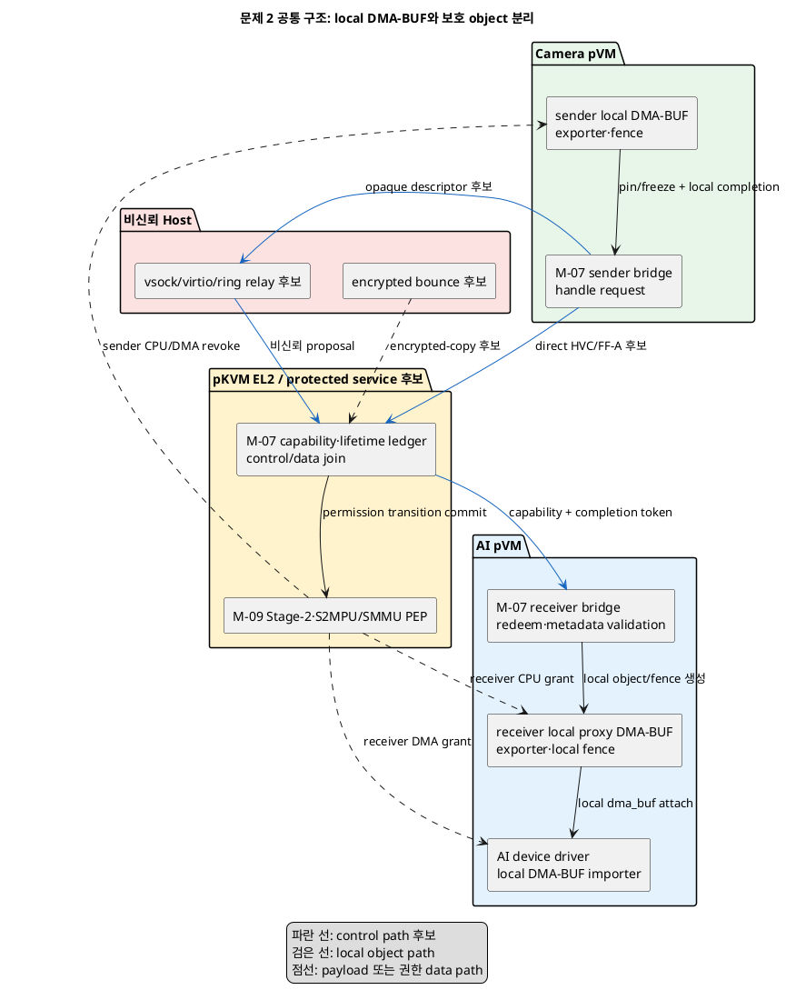
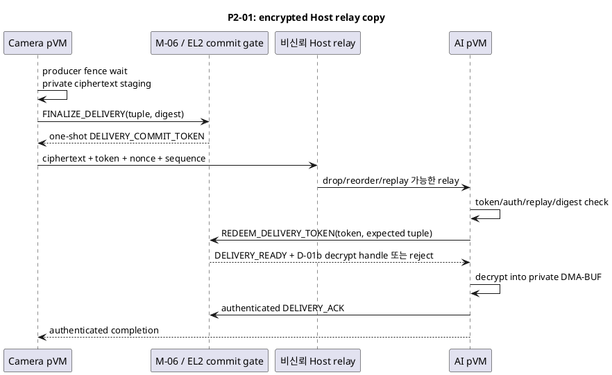
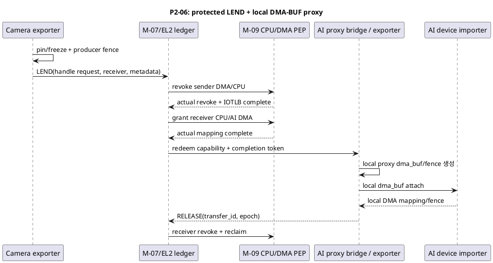

# 문제 2 확장: pVM 간 DMA-BUF 보호 전달 설계 공간

## 1. 상태와 문서 목적

- 상태: **후보 작성**
- 성격: 하나의 Decision Point가 아니라, 여러 Decision Point로 나누기 전의 설계 공간 조사 문서
- 최종 결정: **없음**

이 문서는 다음 자료를 기준으로 문제 2의 control path, context-switch 비용 절감, DMA-BUF
payload data path 후보를 다시 펼친다.

- [시스템 개요](../docs/01_시스템_개요.md)
- [설계 범위와 모듈](../docs/02_설계_범위_모듈.md)
- [후보 구조 작성 규칙](../docs/후보구조_작성규칙.md)
- [문제 3 설계 공간 문서](문제3_virtio-blk_공용저장_암호화_설계공간.md)는 구성 방식만 참고한다.

사용자가 제외한 기존 문제 1·2 설계공간 문서는 열거나 검색하지 않았다. 발표자료도 답으로
사용하지 않았다.

이 문서는 control authority, control transport, payload 이동, allocation, DMA mapping,
fence, notification, cache, handle, lifetime, guest integration, 전환 단위와 ring 배치를
분석 축으로 나눈다. 같은 축 안의 **모든 pairwise 비교행**을 명시하되, 조합 가능한
knob가 섞인 축은 누락 방지용 design contrast로 표시하고 정식 DP에서는 하위 축으로
다시 분리한다. 서로 직교하는 축은 compatibility constraint를 적용해 end-to-end
조합으로 만든다.

## 2. 고정 전제와 실현 가능성 경계

### 2.1 상위 설계 전제

1. Host Application과 Host Linux kernel은 비신뢰 영역이다.
2. Camera pVM과 AI pVM은 서로 다른 kernel·주소 공간·generation을 가진다.
3. Host를 plaintext data path의 신뢰자로 추가하지 않는다.
4. M-07이 endpoint, grant, logical lease, buffer ownership, mapping lifetime, join, timeout과
   reclaim을 관리하고 M-09가 Stage-2, S2MPU/SMMU, DMA와 실제 revoke 완료를 집행한다.
5. control과 data의 성공은 같은 channel binding, `transfer_id`, attempt generation,
   sender/receiver generation과 buffer/pipeline epoch로 보호층에서 join될 때만 확정한다.
6. 현재 검증 topology는 Camera pVM→AI pVM의 단방향 두 endpoint다. 일반 N-domain
   공유 bus는 범위 밖이다.
7. frame format, modifier, plane, offset와 stride도 비신뢰 metadata다. 허용 범위와
   backing size를 대조한 뒤 mapping한다.
8. 승인된 frame 지연·throughput 수치가 아직 없으므로 임의 수치를 gate로 쓰지 않는다.

### 2.2 현행 pKVM에서 되는 것과 새로 필요한 것

[Linux 최신 pKVM 문서](https://www.kernel.org/doc/html/latest/virt/kvm/arm/pkvm.html)는
pKVM을 experimental feature로 설명하고 `DMA isolation using an IOMMU`를
`Unimplemented`로 표시한다. [arm64 pKVM hypercall 문서](https://www.kernel.org/doc/html/latest/virt/kvm/arm/hypercalls.html)의
`MEM_SHARE`와 `MEM_UNSHARE`는 pVM page를 KVM Host와 공유·회수하는 ABI이며, 인수에
수신 pVM ID가 없다. 즉 다음을 구분한다.

**현재 공개 문서로 확인되는 범위**

- pVM→Host page share/unshare
- Host가 설정하는 virtio와 vsock 경로
- pVM CPU Stage-2 isolation

**이 문서의 보호 zero-copy 후보에 필요한 신규 구현**

- pVM A→pVM B의 보호 `SHARE`, `LEND` 또는 `DONATE`
- endpoint identity·generation·rights·epoch를 포함하는 EL2 capability
- CPU Stage-2와 protected SMMU/S2MPU를 함께 바꾸는 transition
- dead borrower의 강제 revoke, drain, reset과 reclaim
- 수신 pVM이 보호 handle을 local DMA-BUF로 가져오는 guest kernel bridge

copy 후보도 현행 기능 조합만은 아니다. P2-02는 EL2의 bounded private→private
copy ABI와 temporary mapping/registered receive ring이, P2-03은 양 pVM↔broker의 보호
LEND·reclaim이, P2-04는 source/destination domain을 동시에 보는 trusted DMA copy
context·command validation·reset이 새로 필요하다.

[AOSP AVF architecture](https://source.android.com/docs/core/virtualization/architecture)는
pKVM vendor module에 device-specific IOMMU driver를 둘 수 있는 확장 방향을 설명하지만,
대상 SoC에서 위 기능이 이미 존재함을 뜻하지 않는다. 따라서 P2-02~P2-15의 protected
copy/zero-copy/DMA 후보는 Custom SoC feasibility를 통과하기 전까지 **조건부 후보**다.
P2-16~P2-19와 P2-22도 각각 protected object/control ABI, guest integration 또는
cross-world 연동을 추가해야 하며 현행 pKVM 표준 기능이라고 보지 않는다.

또한 [AOSP AVF security](https://source.android.com/docs/core/virtualization/security)는
현재 guest pVM이 다른 guest pVM에 직접 vsock 연결하는 구성을 기본 제공하지 않음을
설명한다. 이 문서의 vsock은 Host가 설정·중계하는 비신뢰 transport로 취급한다.

### 2.3 DMA-BUF FD 자체는 VM 경계를 넘지 않는다

[Linux DMA-BUF core API](https://docs.kernel.org/driver-api/dma-buf.html)에서 DMA-BUF는
한 Linux kernel 안의 `struct dma_buf`, exporter, attachment, `sg_table`, `dma_resv`와
refcount를 userspace FD가 가리키는 모델이다. 별도 guest kernel의 숫자 FD나 kernel
pointer는 다른 pVM에서 의미가 없다. `sync_file` FD와 `dma_fence`도 같은 이유로 직접
전달되지 않는다.

따라서 이 문서에서 “DMA-BUF 전달”은 다음 bridge를 뜻한다.

```text
Camera pVM local DMA-BUF/FD
  ↕ sender exporter가 pin·freeze
EL2-owned protected buffer object/capability
  ↕ receiver guest bridge가 redeem하고 proxy exporter 생성
AI pVM local proxy DMA-BUF/FD
  ↕ AI device driver가 importer로 attach
```

전송 객체는 FD 숫자가 아니라 다음과 같은 보호 descriptor다.

```text
{ channel_id, channel_binding_generation, transfer_id, transfer_attempt_generation,
  authority_decision_id, policy_version, authorization_capability_digest,
  sender_verified_id, sender_generation,
  receiver_verified_id, receiver_generation, buffer_id_or_slot,
  buffer_epoch, pipeline_epoch,
  producer_device_id, producer_device_generation, producer_physical_lease_id,
  producer_job_seq, consumer_device_id, consumer_device_generation,
  consumer_physical_lease_id, consumer_job_seq_or_range,
  size, planes[], format, modifier, rights, control_nonce, payload_nonce }
```

sender exporter가 임의 exporter의 page를 넘기지 못하도록, 첫 구현은 전송용으로 따로
정의한 protected/transferable DMA heap만 허용한다. EL2는 guest가 준 HPA를 신뢰하지
않고 sender-owned IPA와 ownership table에서 backing과 SG를 직접 도출한다.

## 3. 문제 재정의

### 3.1 새 문제 정의

> 비신뢰 Host를 거쳐야 할 수 있는 두 pVM 사이에서, 누가 전송을 승인하고 어떤 control
> transport로 capability와 completion을 전달할지 정해야 한다. payload는 copy, 보호
> share/lend/donate, 사전 등록 pool 또는 device P2P 중 하나로 이동하며, sender·receiver의
> CPU와 DMA 권한, cache와 fence, local DMA-BUF 객체 수명을 하나의 epoch 상태 머신으로
> 결합해야 한다. 이를 지키면서 syscall, HVC/VM exit, Host backend wakeup, Stage-2/IOTLB
> invalidation과 device 전환 비용을 줄이는 구조를 정해야 한다.

### 3.2 control path와 data path가 따로 성공해서는 안 된다

Host는 descriptor를 drop, delay, reorder, replay하거나 서로 다른 payload에 붙일 수 있다.
따라서 `control accepted`와 `mapping installed`를 별도 성공으로 기록하지 않는다.

```text
control proposal
  + protected object lookup
  + Camera device generation·physical lease·job에 결합된 sender fence/drain completion
  + CPU/DMA permission transition completion
  + AI device generation·physical lease에 결합된 receiver local object creation
  + metadata validation
  = COMMITTED(authority_decision_id, policy_version, capability_revision,
              channel_binding_generation, transfer_id, transfer_attempt_generation,
              buffer_epoch, pipeline_epoch,
              producer_device_generation, consumer_device_generation)
```

M-06의 current authorization decision, M-07의 object/lifetime state, M-08의 양 device
lease·job quiesce와 M-09의 CPU/DMA actual completion을 같은 보호 ledger에서 join한 뒤에만
M-07/EL2가 receiver notification을 보낸다. Host-visible ring의 descriptor와 encrypted
payload의 nonce가 다르거나 stale generation이면 둘 다 폐기한다.

Host는 vCPU scheduling, Host-relayed transport와 물리 interrupt를 무기한 지연할 수 있다.
따라서 protected channel은 confidentiality·integrity와 bounded resource reclamation을
제공할 수 있지만 delivery availability를 보장하지 않는다. timeout은 실패를 안전하게
닫는 조건이지 frame 도착 보장이 아니다.

### 3.3 `context switch` 비용의 분해

```text
guest userspace↔guest kernel syscall
+ guest→EL2 HVC 또는 MMIO VM exit
+ Host EL0 backend wake/scheduler switch
+ pVM↔protected service scheduling
+ CPU Stage-2 TLB invalidation
+ SMMU map·IOTLB invalidation
+ cache clean/invalidate
+ device context save/restore 또는 reset
+ receiver local dma_buf/fence 객체 생성
```

kernel proxy는 첫 항목을, HVC/FF-A 또는 Host kernel/vhost fast path는 Host EL0 wakeup을,
shared ring·batch는 HVC/notification을, pre-registered pool은 allocation·SG parsing과 local
object 생성을 줄인다. strict permission flip을 유지하면 TLB/IOTLB invalidation은 남고,
영구 shared pool로 이를 없애면 상호 pVM 격리가 약해진다.

### 3.4 품질 충돌

| 선택 | 좋아지는 점 | 부담되는 점 |
|---|---|---|
| encrypted Host relay copy | 현행 pKVM에 가까운 fallback, Host plaintext 비노출 | copy·AEAD·private buffer 재생성, traffic metadata 노출 |
| EL2 copy | page 공유 없이 plaintext 보호 | bulk copy와 SG parser가 EL2 TCB·CPU를 차지 |
| service pVM/DMA engine copy | EL2 bulk 처리 감소 또는 CPU copy 제거 | 추가 TCB·schedule hop 또는 trusted DMA context 필요 |
| on-demand LEND | 한 시점 한 owner라는 명확한 격리 | frame마다 Stage-2/SMMU/TLB 전환 |
| pre-registered protected pool | allocation·object·SG 검증 고정비 상각 | 고정 메모리와 slot state·epoch 관리 |
| permanent pair-private pool | steady-state map/unmap 제거 | 조기 읽기·사후 변조 방지가 어려움 |
| synchronous fence wait | 가장 단순한 lifetime | producer와 pipeline 병렬성 감소 |
| completion token→local fence | 비동기 pipeline 유지 | token integrity와 local timeline bridge 필요 |
| polling | interrupt·schedule 왕복 감소 | CPU·전력·DoS budget 증가 |
| P2P/device-only heap | CPU copy·cache 접근 감소 | topology·IOMMU·debug/preview 제약 |

## 4. 모든 후보가 공유하는 보호 객체와 배치

### 4.1 책임 경계

| 책임 | 논리 모듈 | 반드시 해야 하는 일 | 비신뢰 위치의 제한 |
|---|---|---|---|
| API·local object | M-07 guest bridge | local DMA-BUF/FD, attachment와 local fence 생성 | global ownership이나 HPA를 확정하지 않음 |
| endpoint bind/rebind | M-03, M-07 | service-ready 뒤 channel binding generation 발급, rebind 때 old channel 전체 revoke | Host endpoint 이름만으로 기존 capability 승계 금지 |
| control queue | M-07/Host transport | descriptor, backpressure, retry와 notification | 최종 grant·mapping commit 불가 |
| policy allow/deny | M-06 | verified identity, endpoint·rights·resource policy의 최종 허용/거부 | Host/M-07 proposal로 policy 우회 금지 |
| channel lifetime | M-07 | endpoint join, capability, transfer attempt, epoch, timeout, reclaim | Host ledger만으로 확정 금지 |
| physical device lease | M-08 | Camera/AI physical lease, queue freeze, job drain, reset을 transfer와 join | M-07 ledger만으로 device quiesce 확정 금지 |
| 실제 CPU/DMA 집행 | M-09 | Stage-2, S2MPU/SMMU, IOTLB와 permission completion | 보호 경계가 actual state 확정 |
| DMA-BUF exporter/bridge | Camera/AI pVM bridge | sender transfer heap pin/freeze, receiver protected backing의 local proxy `dma_buf` export | global HPA/ownership 확정, peer kernel object 재사용 금지 |
| device importer | Camera/AI device driver | 각 guest의 local DMA-BUF attach, map/unmap, fence/release | VM 경계를 넘은 raw FD/attachment 생성 금지 |
| recovery | M-02/M-04/M-07/M-08/M-09 | dead endpoint/device, reset, scrub, forced revoke, quarantine | stale DMA 정지를 모르면 재사용 금지 |
| 감사·trace | M-04/M-06/M-07/M-08/M-09 | policy decision, transfer/device generation, buffer epoch, mapping·reclaim actual completion 기록 | Host log는 비신뢰 복제본, payload·key는 기록 금지 |

### 4.2 보호 ledger

```text
channel_id
channel_binding_generation # (protected boot/session namespace, monotonic binding counter)의 compound 값
channel_binding_high_watermark
el2_incarnation_id, el2_timebase_epoch, el2_timebase_frequency_id
policy_max_pin_ticks, policy_max_ack_ticks, policy_max_delivery_ticks, policy_max_active_transfer_ticks
transfer_id
authority_decision_id
authorization_decision_digest
policy_version
authorization_capability_id
capability_revision, capability_revocation_epoch, authorization_expiry
authorization_expiry_el2_tick, capability_expiry_el2_tick
required_external_authority_set_digest
authorization_permit_set_digest
authorization_permit_set[] # authority/incarnation, prepare/ready nonce, token, decision/composite digest, EL2 ticks, state
delivery_commit_token_id, delivery_commit_digest, delivery_commit_not_after_el2_tick, delivery_commit_state
delivery_redeem_cutoff_el2_tick
verified_delivery_commit_bound_ticks, delivery_commit_profile_digest
delivery_key_handle_digest, delivery_key_release_state # D-01b NONE/PENDING/RELEASE_COMMITTING/RELEASED/POSSIBLY_RELEASED/ZEROIZED
endpoint_binding_revision, pipeline_attempt_revision
producer_device_state_revision, consumer_device_state_revision
mapping_state_revision, composite_revision_digest
transfer_attempt_generation, transfer_attempt_high_watermark
sender_verified_id, sender_generation
receiver_verified_id, receiver_generation
buffer_id, pool_id, slot, buffer_epoch
pipeline_epoch
producer_device_id, producer_device_generation, producer_physical_lease_id, producer_job_seq
consumer_device_id, consumer_device_generation, consumer_physical_lease_id, consumer_job_seq_or_range
producer_lease_not_after_el2_tick, consumer_lease_not_after_el2_tick
channel_session_not_after_el2_tick, effective_transfer_not_after_el2_tick
transfer_stop_start_el2_tick
physical_revoke_bound_ticks, revoke_profile_digest
owner_state
backing_page_set_digest
allowed_visible_ranges_digest, initialization_or_zeroization_digest
rights_cpu, rights_dma
size, planes[], offsets[], strides[], format, modifier
producer_completion_seq
receiver_fence_seq
mapping_template_or_domain_id
copy_engine_firmware_measurement, copy_engine_config_digest
lease_deadline, use_count # logical TTL도 effective_transfer_not_after를 넘지 못함
control_nonce, payload_nonce
actual_cpu_map_bitmap, actual_dma_map_bitmap
audit_sequence, previous_audit_record_digest, decision_reason_code
```

`authorization_permit_set[]`의 EL2-side state는 authority마다
`NONE→PREPARED→PERMIT_RECEIVED→CONSUMED→ACK_SENT→ACKED` 또는 `ABORTED`로 진행한다.
C-05/C-08 PDP와 external M-08 lease authority가 함께 있으면 별도 entry로 추적하고 set
전체를 partial consume 없이 commit한다. 각 entry는 `authority_id`, 비반복
`authority_incarnation_id`, prepare/ready nonce, token ID, decision/composite/actual-state
digest, `not_after_el2_tick`, `ack_not_after_el2_tick`과 state를 가진다.
`delivery_commit_*`은 D-01에서만 쓰는 독립 ledger이며 token을 Camera에 반환한 순간부터
Host 노출 가능성을 보수적으로 가정한다. state는
`NONE→ISSUED_EXPOSURE_POSSIBLE→REDEEMED→ACKED→RETIRED`, `EXPIRED→RETIRED` 또는
`REVOKED→RETIRED`로 진행한다. authorization permit과
delivery token은 ID·state를 공유하지 않는다.
`required_external_authority_set_digest`는 protected policy가 정한
`(role, authority_id, allowed measurement, required decision/lease revision schema)`의 정확한
집합이다. attempt마다 PREPARE 전에 고정해 COMMIT_READY, 모든 permit과 ACK에 결합하고,
required entry 누락·추가·역할 대체 또는 measurement 불일치가 있으면 전체 set을 거부한다.

모든 mapping, ready capability와 delivery token의
`effective_transfer_not_after_el2_tick`은 신규 admission만 막는 TTL이 아니라, 보호 PEP가
제어하는 shared CPU/DMA mapping·device job과 아직 끝나지 않은 delivery commit이 모두
종료돼야 하는 hard not-after다. 값은
`min(authorization_expiry_el2_tick, capability_expiry_el2_tick,
each_applicable_device_lease_not_after_el2_tick,
channel_session_not_after_el2_tick, now + policy_max_active_transfer_ticks)` 이하로 만든다.
external expiry는 attested common timebase와 max skew로 EL2 tick에 보수적으로 정규화하고,
정규화할 수 없으면 time-limited split authority 후보를 사용하지 않는다. external PDP/M-08은
COMMIT_READY의 `proposed_transfer_not_after_el2_tick` 전체가 자기 authorization·device
lease 안에 있음을 서명한다.

경로·device mode·최대 job/frame별 `physical_revoke_bound_ticks`는 protected timer dispatch,
ready/doorbell·queue fetch 차단, already-fetched job/copy의 bounded drain/preempt 또는 early
reset, CPU unmap/TLBI, StreamID detach·IOTLB/S2MPU completion, cache sync, key-release 취소와
actual-state 확인의 검증된 최악시간을 포함한다. versioned `revoke_profile_digest`와 checked
tick arithmetic로 `transfer_stop_start_el2_tick <= effective_transfer_not_after_el2_tick -
physical_revoke_bound_ticks`를 강제한다. EL2 timer는 stop-start까지 ready·doorbell, 새 redeem과
submission을 닫고 authoritative revision을 증가시켜 회수를 시작하며, hard not-after까지
CPU/DMA/job과 pending/new key-release eligibility cleanup·actual-state 확인을 끝낸다. 정상 drain이 bound에 맞지 않으면
profile의 더 이른 reset/isolation을 사용한다. bound·hard cutoff를 증명할 수 없거나 stop-start가
이미 지났으면 그 active mapping/device 후보를 grant하지 않고 private-copy 또는 quarantine으로
내린다. 자연 만료는 외부 event나 다음 transfer를 기다리지 않으며 L/B 축의
TTL·batch·pipeline epoch가 이 hard cap을 연장하지 못한다.

D-01은 `delivery_redeem_cutoff_el2_tick <= effective_transfer_not_after_el2_tick -
verified_delivery_commit_bound_ticks`와
`delivery_commit_not_after_el2_tick <= delivery_redeem_cutoff_el2_tick`을 추가로 강제한다.
D-01a는 EL2 redeem 결정을, D-01b는 key PEP의 release 결정을 이 protected commit bound 안에
hard not-after 전 선형화하며, cutoff 뒤에는 새 redeem/release를 시작하지 않는다. 성공한
linearization은 그 frame 전달이 expiry 전에 승인·commit됐다는 뜻이므로 이후 Host scheduling에
지연된 endpoint decrypt·private-copy·ACK까지 hard not-after 전에 끝났다고 주장하지 않는다.
receiver가 이미 얻은 plaintext/raw key도 소급 회수하지 않는다. authorization expiry가 과거
전달 data의 사용 종료·강제 삭제까지 뜻하면 D-01을 제외하고 protected scheduled endpoint와
별도 retention/erasure mechanism을 요구한다. 예고 없는 중간 revoke는
즉시 같은 절차를 시작하지만 physical cleanup latency는 검증된 bound의 별도 계약이다.

새 전송을 받기 전에 보호층이
`transfer_attempt_generation > transfer_attempt_high_watermark`를 예약하고 high-watermark를
먼저 보호 상태에 반영한다. 한 attempt의 `transfer_id`, `control_nonce`와
capability는 `(channel_binding_generation, buffer_id, buffer_epoch,
transfer_attempt_generation)`에 결합한다. 정상 완료, timeout, parser 거부, partial
mapping과 crash 여부와 관계없이 이 ID·nonce·attempt 값을 retire하고 재발급하지
않는다.
high-watermark는 guest descriptor가 아니라 channel binding별 보호 allocator 상태이며,
병렬 buffer가 같은 attempt를 받지 않도록 보호 critical section에서 할당한다. `buffer_epoch`는
buffer/slot별로 단조 증가한다.

`channel_binding_generation`은 Host가 되감을 수 있는 counter 하나가 아니라 보호
boot/session namespace와 그 안의 monotonic binding counter를 합친 값이다. 살아 있는
보호 실행에서는 EL2/M-07 소유 journal에 binding·attempt high-watermark를 atomic하게
commit한다. 승인된 protected monotonic state나 DICE boot generation이 있으면 cold
restart에도 이를 잇는다. 그런 저장소가 없으면 모든 old CPU/DMA mapping, ring,
capability, proxy/fence와 session key를 revoke·purge한 뒤 HW root/secure firmware DRBG의
최소 128-bit fresh namespace로 새 channel을 만든다. Host nonce는 신뢰하지 않으며 DRBG
실패·반복 의심, purge 미완료 또는 journal rollback이면 fail-closed하고 channel/buffer를
quarantine한다.

metadata의 `offset + stride × height`, 모든 plane 범위와 SG 합계가 backing size 안에 있는지,
format/modifier가 양 endpoint와 device에서 지원되는지 확인한다. 교집합이 없으면 보호
copy/format-conversion 후보로 되돌린다. Camera/AI device reset, physical lease 종료나
pipeline epoch 변경은 해당 device generation/job에 묶인 모든 pending transfer, fence와
mapping template을 즉시 stale로 만든다. M-03/M-07 endpoint rebind는
`channel_binding_generation`과 pipeline epoch를 반드시 증가시키고 old ring, handle,
proxy, fence와 mapping을 revoke한다. attempt high-watermark를 복원할 수 없으면
actual CPU/DMA revoke·queue purge 후 반복되지 않는 새 channel binding generation을
만든다. binding/attempt/buffer epoch가 wrap하거나 이전 namespace와 충돌하면 재사용하지
않고 channel 또는 buffer를 quarantine한다.

`stale` 판정만으로 이미 설치된 mapping이 사라지는 것은 아니다. Camera/AI physical lease
종료, device reset, pipeline epoch 변경과 endpoint rebind를 M-07 revoke transaction에
join해 CPU/DMA mapping 제거와 TLB/IOTLB actual completion 전에는 새 device grant나 slot
reuse를 금지한다. 회수를 증명하지 못하면 해당 buffer/context를 quarantine한다.

### 4.3 공통 배치



## 5. 공통 상태 머신과 복구

### 5.1 정상 LEND 기준 상태

```text
FREE(buffer_epoch=e)
  -> ATTEMPT_RESERVED(a_next; a_next > attempt_high_watermark)
  -> PRODUCER_MAPPED
  -> PRODUCER_DMA
  -> PRODUCED
  -> REVOKING_SENDER
  -> RECEIVER_STAGED
  -> COMMITTING
  -> RECEIVER_MAPPED
  -> CONSUMER_DMA
  -> RELINQUISHING
  -> FREE(buffer_epoch=e+1)

any unsafe failure -> QUARANTINED
```

안전한 exclusive handoff 순서는 다음과 같다.
진입 전에 M-06이 verified endpoint·rights·resource policy를 허용하고 M-07이 fresh
attempt를 할당한다. M-06은 보호 clock과 정책 상태로 `policy_version`, capability
ID/revision/revocation epoch·expiry, sender/receiver identity·generation, pipeline epoch와
요청 rights/resource를 매 attempt와 retry에서 다시 검증한다. 만료·철회·epoch 종료면
같은 authorization이나 attempt를 재개하지 않는다. derived transfer hard deadline이 parent
authorization/capability와 rights에 적용되는 device lease·channel limit의 min 이하이고,
stop-start/revoke profile이 current policy와 일치하는지도 initial/final commit에서 검증한다.
M-08은 양 device
generation·physical lease·job range를 확정하고
freeze/drain/reset을 조정하며, M-09는 CPU/DMA actual state를 집행한다. 이 책임을 M-07
상태 표시 하나로 대체하지 않는다.

1. M-08이 Camera physical lease의 freeze/drain transaction을 시작하고 job range를
   snapshot한다. M-09 PEP는 buffer CPU write, Camera submission doorbell, command-ring
   descriptor write와 해당 range 밖 device fetch를 실제로 차단한 토큰을 반환한다.
   sender exporter의 cooperative freeze만으로 완료를 확정하지 않는다.
2. M-08이 이미 제출된 producer fence 또는 보호 completion token을 join하고
   Camera device drain/reset을 완료한다. M-07은 M-08의 job/device quiesce token과 M-09의
   MMIO/DMA actual-state token을 둘 다 받아야 다음 상태로 간다.
3. strict LEND는 sender CPU의 buffer read/write Stage-2 mapping 전체를 제거하고 TLB
   invalidation 완료를 확인한다. SHARE만 write를 제거하고 검증된 read-only mapping을
   유지할 수 있다.
4. Camera attachment/mapping이 아직 유효하고 device가 quiesced인 상태에서 보호 cache
   authority가 producer 방향 소유권을 넘긴다. coherent platform은 PoC ordering/barrier를,
   non-coherent platform은 `dma_sync_sg_for_cpu(..., DMA_FROM_DEVICE)`에 해당하는
   device→CPU/ownership-domain sync와 outer-cache completion을 확인한다. guest의 완료
   보고만은 신뢰하지 않는다. 그 후 sender SMMU/S2MPU mapping을 제거하고 IOTLB
   invalidation 완료를 확인한다.
5. EL2가 ownership, SG digest, 양 endpoint와 Camera/AI device generation·physical lease,
   producer job sequence, pipeline/buffer epoch와 metadata를 재검증한다. receiver에 보일
   전체 transferable allocation이 producer에 의해 완전히 초기화됐음을 증명하지 못하면
   page padding·plane slack·alignment gap을 보호 zero engine/copy path로 지운다. zero
   engine completion 또는 보호 CPU write 후 padding까지 PoC에 도달하는 CPU→device clean과
   barrier를 join 조건으로 확인한다.
6. receiver vCPU와 AI submission을 block하고 target IOVA/context의 AI queue fetch를
   stop·drain한다. local proxy와 CPU/SMMU mapping을 inactive root/PASID에 inert/staged
   상태로 준비한다. on-demand LEND는 local FD나 redeem 성공을 receiver에 노출하지 않는다.
   prepool은 proxy FD/object가 사전 노출될 수 있지만 해당 slot은 `INERT(old epoch)`이며
   mmap/attach/map과 ready fence/completion이 current epoch 권한을 주지 못한다. AI가 frame을
   읽는 경로는 receiver attachment에 `dma_sync_sg_for_device(..., DMA_TO_DEVICE)`에
   해당하는 sync를 하고 완료를 확인한다. AI write가 필요하면 별도 output buffer를
   우선하고, in-place 예외는 `DMA_BIDIRECTIONAL`·정확한 platform contract를 사용한다.
7. EL2 composite commit gate가 `endpoint binding, pipeline/attempt, producer·consumer
   device lease/job, mapping state`의 protected revision vector와 inactive AI DMA root의
   actual state를 snapshot한다. M-06 policy/capability, D-04 copy-engine measurement/config와
   C-08 world generation, current parent expiry, proposed effective transfer hard deadline과
   stop-start/revoke-profile을
   포함한 final authorization은 5.1.1절에 따라 co-located revision
   CAS 또는 split-authority one-shot permit set으로 선형화한다. 실패하면 receiver vCPU·doorbell을
   닫고 on-demand FD는 비노출로, prepool proxy는 inert/stale epoch로 유지한 채 staged
   CPU/DMA mapping을 revoke한다. transfer ID·nonce·attempt를 retire하고 high-watermark를
   되감지 않으며 fresh authorization+fresh attempt로 다시 시작하거나 cleanup 미증명 시
   quarantine한다.
8. 같은 composite gate를 유지한 채 revision vector 불변을 CAS하고, decision/permit set 소비,
   M-09 selector, ledger `COMMITTED`, `effective_transfer_not_after_el2_tick`,
   `transfer_stop_start_el2_tick`과 revoke-profile, on-demand proxy 또는 prepool의 **새 slot epoch·ready
   eligibility**와 doorbell eligibility를 하나의 fail-closed linearization transaction으로
   묶는다. HW selector가 여러 단계면 `COMMITTING` journal 동안 모든 receiver access를
   닫고, 전부 완료된 뒤에만 ready token과 submission을 노출한다. gate를 놓은 뒤
   notification하며 pre-created FD 자체는 권한이 아니다. 일부 성공·crash·revision 변경은
   전부 revoke하고 receiver를 재개하지 않는다. future IOVA를 미리 queue한 DMA가 mapping
   install 순간 실행될 수 있는 HW라면 이 구조를 선택하지 않는다. Camera frame을 AI가
   읽기만 하면 CPU는 RO 또는 미매핑, AI DMA는 read-only로 부여하고 output은 별도
   buffer를 사용한다.
9. split authority 후보는 commit 뒤 각 authority에
   `COMMIT_ACK(token_id, permit_set_digest, composite_revision_digest, committed attempt,
   buffer_epoch)`를 보낸다. ACK는 step 8의 receiver activation 전제가 아니라 사후
   회계·복구 확인이다. authority는 durable `ACKED` 뒤 authenticated `ACK_RECEIPT`를
   반환하고 EL2는 받은 entry만 `ACKED`로 바꾼다. `ack_not_after_el2_tick`까지 permit set
   전체가 합의되지 않으면 active mapping을 revoke하고 reset/purge·reconcile한다.
10. EL2 protected timer는 effective hard deadline이 아니라 검증된 worst-case margin만큼
    앞선 `transfer_stop_start_el2_tick`까지 같은 gate에서 ready·doorbell·새 redeem/submission을
    닫고 authoritative revision을 증가시켜 pending work를 stale로 만든다. 이어 profile의
    bounded drain/preempt 또는 reset/isolation, CPU TLBI와 DMA IOTLB completion을 수행해
    `effective_transfer_not_after_el2_tick`까지 active protected-controlled CPU/DMA mapping,
    device job과 pending/new key-release eligibility가 0임을 actual state로 확인한다. 이미
    성공한 private delivery의 plaintext/key possession을 소급 제거한다는 뜻은 아니다. external expiry notification이
    유실돼도 hard deadline 뒤 active 권한을 유지하지 않는다.

#### 5.1.1 composite revision gate와 split PDP commit protocol

M-03 endpoint rebind, M-07 pipeline/attempt, M-08 device lease/job과 M-09 mapping/selector의
**권위 있는 revision은 EL2 protected ledger를 통해서만** 바뀐다. 외부 daemon·pVM은
변경을 제안할 뿐이다. device reset/fault와 rebind가 들어오면 EL2가 먼저 해당 revision을
증가시키고 pending commit을 stale로 만들어, step 7 snapshot과 step 8 CAS 사이의 모든
interleaving을 막는다.

- M-06과 M-09가 EL2에 같이 있으면 policy revision을 포함한 composite vector를 같은
  protected gate에서 검증·CAS한다. M-09 selector, ledger, slot epoch와 ready/doorbell
  eligibility까지 gate 안에서 commit하고, lock 해제 뒤의 revoke/reset은 active-grant
  revoke transaction으로 submission을 닫고 CPU/DMA를 회수한다.
- C-05 service pVM이나 C-08 Secure Partition처럼 final PDP가 분리되면 공용 lock을
  가정하지 않는다. 각 external final authority는 initial allow를
  `PREPARE(authority_id, authority_incarnation_id, decision/policy/capability 또는 lease
  digest, channel/binding/attempt/buffer/pipeline/device tuple, prepare_nonce)`로 pin한다.
  EL2는 staged composite/actual state에 자신이 만든 `(el2_incarnation_id,
  el2_timebase_epoch, el2_timebase_frequency_id, ready_nonce, not_after_el2_tick,
  ack_not_after_el2_tick, proposed_transfer_not_after_el2_tick,
  proposed_transfer_stop_start_el2_tick, physical_revoke_bound_ticks,
  revoke_profile_digest,
  required_external_authority_set_digest)`을 묶어 같은
  `COMMIT_READY`를 모든 required authority에 보낸다. external authority가 자체 clock의
  deadline을 EL2에 강요하지 않는다. 각 authority는 revocation/update와 직렬화해 유효할
  때만 EL2 timebox를 그대로 echo·서명한
  `COMMIT_PERMIT(authority_id, prepare_nonce, ready_nonce, composite/actual-state digest,
  token_id, EL2 timebox)`를 발급한다. external M-08도 final lease authority라면 별도
  entry를 발급하며, 그렇지 않으면 proposal만 하고 EL2 ledger가 final lease authority다.
  authority도 attested frequency ID를 인식하고 pin/ACK delta, proposed active transfer와
  signed revoke profile이 자신의 protected authorization expiry, applicable device lease와
  policy maximum 안인지 검사하며, 모르는 frequency·epoch/profile, 정규화할 수 없는 expiry나
  과도한 window면 `ABORT`한다.
  EL2는 `now < not_after_el2_tick < ack_not_after_el2_tick <=
  proposed_transfer_stop_start_el2_tick < proposed_transfer_not_after_el2_tick`과
  `proposed_transfer_stop_start_el2_tick <= proposed_transfer_not_after_el2_tick -
  physical_revoke_bound_ticks`,
  `not_after-now <= policy_max_pin_ticks`, `ack_not_after-not_after <= policy_max_ack_ticks`를
  강제한다. platform attestation에 tick frequency를 묶고 counter wrap·frequency 변경에는
  새 timebase epoch를 만들며 outstanding permit을 이어 쓰지 않는다.
- 각 permit 발급은 해당 authority 결정의 linearization point이고 마지막 required permit이
  모여야 set이 commit-eligible해지지만 actual mapping은 생기지 않는다. EL2는 step 8의
  같은 protected gate에서 자신의 incarnation/timebase와 현재 tick, current
  policy/capability expiry, rights에 적용되는 device lease·channel deadline, signed
  stop-start/revoke profile, required authority set의 정확한
  일치와 모든 authority incarnation·token 미사용 여부를 검사한다. permit의 composite/actual-state digest를
  gate 안에서 다시 읽은 current authoritative revision vector·actual state와 atomic
  compare하고, 모두 같을 때만 `authorization_permit_set_digest` 전체를 부분 소비 없이
  commit한다. mismatch면 set/token·attempt를 retire하고 staged mapping을 cleanup한다.
- permit 발급 전 revoke는 `ABORT`로 전체 commit을 막는다. 발급 뒤 revoke는 permit을 소급
  취소하지 않고 generation-bound active-grant `REVOKE`로 EL2 gate에 들어가 submission과
  mapping을 회수한다. EL2 gate가 어느 REVOKE든 permit-set consume보다 먼저 처리하면 전체
  set을 abort하고, consume이 먼저 linearize됐으면 active grant를 revoke한다. policy가 이
  짧은 one-shot pin semantics를 허용하지 않으면 split 후보를 제외한다.
- step 9의 ACK는 새 authorization이 아니다. permit/token은 재발급하지 않되 같은 committed
  tuple의 ACK만 ack timebox 안에서 idempotent retransmit할 수 있다. permit 전 crash/timeout은
  staged mapping 제거와 attempt retire로 끝낸다. permit 뒤 ACK/receipt 유실·authority/world
  restart에는 stop-start보다 늦지 않은 `ack_not_after_el2_tick`에 active
  revoke→reset/purge를 시작해 hard deadline까지 끝내고 authority별
  incarnation·consumed-token set/composite ledger를 reconcile한다. 한 entry라도 합의할 수
  없으면 channel/buffer를 quarantine하고 새 commit을 금지한다.

각 authority는 permit 발급 뒤 authenticated ACK 또는 EL2가 증명한 abort/revoke를 받을
때까지 resource를 **possibly active**로 취급하고 자체 clock timeout만으로 충돌하는 새
permit을 만들지 않는다. restart 뒤에도 먼저 EL2 consumed ledger와 actual state를
reconcile한다.

`authority_incarnation_id`는 protected monotonic boot generation 또는 attested HW-root
CSPRNG의 최소 128-bit nonce와 새 channel session key로 만들고 Host가 공급하지 않는다.
continuity를 증명하지 못한 새 authority incarnation은 old permit의 EL2 timebox가 모두
지난 뒤 actual state·consumed ledger를 reconcile하고 필요 시 reset/purge하기 전까지
admit하지 않는다. EL2 clock/incarnation continuity를 잃으면 outstanding permit과 delivery
token을 모두 거부하고 CPU/DMA mapping·ring·proxy/fence/session key를 revoke·purge한 뒤
비반복 새 EL2/channel incarnation으로 rebind한다. cleanup이나 새 incarnation을 증명하지
못하면 channel/buffer를 quarantine한다.
external policy의 absolute authorization expiry도 authority incarnation에 묶인 protected
monotonic clock을 쓰거나 EL2와 attested common timebase·최대 허용 skew를 명시해야 한다.
clock rollback·skew bound 위반은 해당 incarnation의 decision을 전부 revoke한다. 어느
방식이든 permit 상한은 EL2의 `not_after_el2_tick`이고 external clock만으로 연장할 수 없다.

SHARE 후보에서는 3~4단계가 sender read-only 유지로 바뀔 수 있지만 sender write와
Camera DMA write는 반드시 제거한다. copy 후보에서는 source와 destination ownership은
유지되고 보호 copy completion이 join 조건이 된다. AI→Camera reverse handoff나 다른
generation으로 재사용할 때도 receiver DMA/CPU revoke 뒤 padding·slack을 다시 sanitize한다.

### 5.2 receiver relinquish와 reverse handoff

정상 반환도 다음 대칭 transaction으로 mapping lifetime을 닫는다.

1. M-08이 AI physical lease의 outstanding consumer job range를 snapshot하고 relinquish
   transaction을 시작한다. M-09 PEP는 새 submission, command descriptor write와 해당
   buffer의 device fetch를 실제로 차단한다.
2. M-08이 consumer fence와 M-09 stop token을 join하고 AI device를 drain한다. timeout이면
   reset 경로로 바꾼다.
3. AI attachment가 아직 유효할 때 실제 DMA direction으로 ownership sync를 완료한다.
   read-only AI는 `DMA_TO_DEVICE`, in-place write를 허용한 예외는 `DMA_FROM_DEVICE`
   또는 `DMA_BIDIRECTIONAL`에 해당하는 `dma_sync_sg_for_cpu`·platform outer-cache
   completion을 사용한다. 그 후 AI SMMU/S2MPU mapping을 제거하고 IOTLB
   invalidation 완료를 확인한다.
4. receiver CPU Stage-2 mapping을 제거하고 TLB invalidation 완료를 확인한다.
5. 모든 reader/writer가 멈춘 뒤 AI에 write가 허용됐거나 다른 generation/domain으로
   넘기는 allocation의 padding·slack까지 sanitize한다. zero engine completion 또는 보호
   CPU zero 뒤 해당 byte가 PoC에 도달하도록 clean/barrier를 완료한다. Camera
   producer mapping을 stage할 때에는 Camera가 쓰는 `DMA_FROM_DEVICE`를 포함한 실제
   direction으로 `dma_sync_sg_for_device`·platform 동등 연산을 하고 활성화한다.
6. 현재 `transfer_id`, `control_nonce`와 attempt generation을 retire하고 `buffer_epoch`를
   증가시킨다. receiver local proxy, fence token과 이전 Camera/AI device generation·physical
   lease·job sequence에 결합된 capability를 무효화한다.
7. actual CPU/DMA bitmap이 0인 경우에만 `FREE`로 돌리거나 새 producer에게 staged
   regrant한다. 일부 revoke나 sanitization을 증명하지 못하면 `QUARANTINED`로 보낸다.

### 5.3 fence와 cache 계약

- 가장 단순한 S-01은 sender가 producer fence를 모두 기다린 뒤 handoff한다.
- 비동기 S-02는 보호층이 검증한 monotonically increasing completion sequence를 receiver
  local `dma_fence`로 번역한다. raw sync_file FD를 넘기지 않는다.
- broker timeline S-03은 양쪽 local `dma_resv`를 shadow하므로 broker restart와 sequence
  rollover 복구가 필요하다.
- HW semaphore S-04도 device context와 epoch binding, timeout·reset 경로가 있어야 한다.
- non-coherent cache 전환은 같은 attachment의 map direction과 일치하는
  `dma_sync_sg_for_cpu/device`를 SMMU unmap 전에 수행한다. `clean+invalidate`를 방향
  구분 없이 호출하거나 guest completion만 믿지 않고, outer/system cache·zero engine을
  포함한 platform completion 계약을 PEP가 확정한다.
- `DMA_BUF_IOCTL_SYNC`는 CPU cache coherency를 돕지만 다른 CPU thread나 device transaction의
  mutual exclusion을 제공하지 않는다. ownership/fence를 대신하지 않는다.

### 5.4 timeout·crash·partial failure

```text
stop new submissions
-> bounded fence wait
-> normal: device drain + attachment-valid direction-aware sync
   fault: hard reset + device/local-cache purge completion
-> cannot prove quiesce/sync/purge -> QUARANTINED
-> DMA mapping revoke + IOTLB completion
-> CPU mapping revoke
-> whole allocation including padding zeroize when ownership changes
-> zero completion + final cache maintenance/barrier
-> retire transfer_id/control_nonce/attempt generation
-> persist attempt high-watermark + increment buffer_epoch
-> regrant or FREE only after all revoke/sanitize completion

cannot prove stale DMA stopped -> QUARANTINED
```

SG mapping 중 일부만 성공하면 설치한 subset을 역순으로 제거하고 receiver doorbell을 열지
않는다. prepool의 slot마다 독립 state와 epoch를 두어 같은 slot을 producer와 consumer가
동시에 재사용하지 못하게 한다. endpoint 재시작은 channel binding generation과
pipeline epoch를 증가시키고 이전 handle, fence token, notification과 mapping template을 모두
무효화한다. cleanup을 증명하지 못해 quarantine하더라도 실패한 attempt ID·nonce는
retire하고 high-watermark를 되감지 않는다.

| 중단·장애 시점 | 신뢰 상태 | 복구 원칙 |
|---|---|---|
| sender revoke 또는 cache sync 중 | producer CPU/DMA가 남을 수 있음 | receiver mapping·FD·ready를 닫고 drain/reset, 방향별 sync와 actual revoke를 다시 확인; 증명 실패 시 quarantine |
| receiver staged mapping 중 | receiver 권한은 inert여야 함 | 설치 subset을 역순 revoke하고 attempt/token retire; ready·doorbell은 열지 않음 |
| composite `COMMITTING` 중 | selector·ledger·slot epoch가 부분 반영됐을 수 있음 | 모든 receiver access를 닫고 journal과 actual CPU/DMA state를 reconcile; atomic rollback 또는 전부 revoke 뒤 fresh attempt, 불명확하면 quarantine |
| split authority permit/ACK 중 | authority별 PREPARED, PERMIT_RECEIVED, CONSUMED, ACKED가 다를 수 있음 | permit 재발급 금지·ACK만 idempotent 재전송; permit 전이면 stage 제거, set 소비 뒤 ack timebox 미합의면 active revoke→reset/purge하고 각 incarnation·consumed-token ledger를 reconcile; 한 entry라도 불일치면 quarantine |
| active transfer의 parent 자연 만료 | mapping/ready는 active이고 hard not-after가 다가옴 | path별 검증된 revoke bound만큼 앞선 stop-start에서 ready·doorbell·redeem/fetch 차단과 revision 증가를 commit하고 CPU/DMA/job 및 pending/new key-release eligibility cleanup을 hard deadline까지 완료; bound 미증명·miss 가능성이면 active grant 거부·private copy 또는 quarantine, same attempt/epoch 연장 금지 |
| D-01 delivery token/key release 전후 | token 전에는 ciphertext가 private staging, token 뒤에는 Host가 보관 가능 | authorization permit ledger와 별도 추적; token 전 실패는 staging purge·attempt retire, token 뒤에는 current parent 재검증+EL2-clock redeem/ACK 또는 expiry/revoke·retire; D-01b release 응답 불명은 possibly released로 보고 재시도 없이 pending key zeroize·session revoke/quarantine; 소급 은닉을 주장하지 않으며 즉시 in-flight 취소 요구면 D-01 제외 |
| receiver 사용·relinquish 중 | active CPU/DMA reader가 남을 수 있음 | submission 차단→consumer drain/reset→방향별 sync→DMA/CPU revoke→sanitize 후에만 slot 재사용 |
| ledger/namespace/timebase 복원 실패 | stale handle·mapping·ciphertext 재생 가능 | outstanding permit/delivery token 거부, old mapping/ring/proxy/fence/key를 모두 purge하고 비반복 EL2/channel incarnation으로 재생성; purge·freshness 증명 실패 시 channel/buffer quarantine |

## 6. 구조·mechanism·최적화 전체 후보군

P2-01~P2-22는 하나의 완전한 상호 배타 E2E 목록이 아니라 payload/control
mechanism, HW 전제, 최적화와 제외 baseline을 포함한 후보군이다. 서로 조합할 수
있으며, 실행 가능한 대표 end-to-end tuple은 8.15절의 E2E-01~E2E-09로 별도
표시한다.

### 6.1 빠른 판정표

| 번호 | 구조 후보 | payload 보호/복사 | 현재 판정 |
|---|---|---|---|
| P2-01 | AEAD encrypted Host relay copy | Host는 ciphertext만 봄, 2회 copy+AEAD | **조건부 copy fallback**: pVM-pVM protected memory 확장은 불필요하나 platform attestation/AKE와 G12/G16/G19 필요 |
| P2-02 | EL2-mediated registered-ring copy | EL2가 private→private copy | 조건부, EL2 bulk TCB 큼 |
| P2-03 | protected service-pVM CPU copy | broker가 lend받아 copy | 조건부, broker payload TCB |
| P2-04 | protected DMA-engine copy | trusted engine이 private→private DMA | 조건부, dual-domain DMA 필요 |
| P2-05 | on-demand protected SHARE | 양쪽 read mapping, writer revoke | 조건부, immutable/fan-out용 |
| P2-06 | on-demand protected LEND | sender revoke 뒤 receiver grant | **strict zero-copy 기준 후보** |
| P2-07 | FF-A LEND + notification | FF-A lifecycle을 Normal-world에 확장 | 조건부, pKVM 연동 신규 구현 |
| P2-08 | Xen grant-table형 pKVM capability | grant ref + event-channel형 control | 조건부, 전용 ABI 신규 구현 |
| P2-09 | DONATE 순환 pool | 순간마다 owner 한 명 | 조건부, dead owner 회수 복잡 |
| P2-10 | pre-registered protected pool + slot flip | object·SG 사전 검증, per-slot 권한 전환 | **고성능 우선 후보** |
| P2-11 | permanent pair-private shared pool | 양 pVM 상시 mapping + ring | 격리 완화안, 제한적 사용 |
| P2-12 | broker-owned device-only protected heap | CPU 미매핑, Camera→AI device 권한 전환 | 조건부, preview/debug 제약 |
| P2-13 | PASID/SSID 다중 HW context | buffer/context tag로 device 접근 | 차세대/지원 HW 후보 |
| P2-14 | iommufd/VFIO/vDPA mechanism + EL2 approval | Host API는 mechanism, EL2가 PEP | 조건부, Host 단독 authority 금지 |
| P2-15 | device-local PCI P2P DMA-BUF | system RAM·CPU copy 우회 | topology 한정 후보 |
| P2-16 | virtio protected-object UUID 확장 | UUID→EL2 object→local proxy | 큰 표준/guest 확장 후보 |
| P2-17 | virtio/rpmsg control + protected payload | control만 Host transport, payload는 lend/pool | **통합 우선 후보** |
| P2-18 | pair-private SPSC ring + EL2/FF-A doorbell | opaque slot/epoch descriptor | **fast control 우선 후보** |
| P2-19 | adaptive poll + batch completion | 짧게 spin, idle 때 block | P2-10/P2-18 최적화 |
| P2-20 | Host plaintext shared DMA-BUF | Host가 읽고 변조 가능 | 보안 전제 위반, 제외 기준선 |
| P2-21 | raw DMA-BUF/sync_file FD 직접 전달 | 다른 guest kernel에서 무의미 | 구현 불가 기준선 |
| P2-22 | Secure Partition broker(SPMC 경유) + EL2 PEP | Secure-world policy, EL2가 CPU/DMA commit | 조건부, cross-world 상태 합의 필요 |

### 6.2 P2-01 protected pVM-pVM memory 확장이 불필요한 조건부 fallback

Camera와 AI pVM은 Host가 중계하는 remote-attestation 기반 authenticated key exchange로
서로의 verified identity와 generation을 먼저 확인한다. AKE는 인증·키 합의이지
사용 승인이 아니다. session 전에 M-06이 양 endpoint identity, action, resource,
`policy_version`, capability ID/revision/revocation epoch·expiry를 허용해야 하고, 이
decision/capability digest를 AKE transcript와 암호화 protected header 모두에 묶는다.
session key는 channel/binding generation,
양 endpoint generation, pipeline epoch와 해당 authorization에 결합한다.
이 endpoint attestation/AKE를 upstream pKVM의 기본 peer 서비스로 가정하지 않는다.
Custom SoC의 검증된 platform attestation·key service가 없거나 P2-G12/G16/G19를 통과하지 못하면
D-01/E2E-01도 사용할 수 없다.

D-01의 key enforcement는 다음 두 profile로 나눈다.

- **D-01a verified-endpoint profile**: Camera와 AI의 attested crypto/bridge code가 raw
  session content key를 가진다. 이때 token 확인과 online redeem은 명시된 Host-compromise
  위협모델에서 endpoint TCB가 지키는 protocol이며, raw key를 가진 악성·침해 AI가 HVC를
  건너뛰는 것을 EL2가 물리적으로 막지는 못한다. arbitrary receiver compromise까지 막아야
  하면 이 profile을 제외한다.
- **D-01b protected key-release profile**: peer AKE는 identity와 control channel만
  인증하고, protected platform key service가 attempt별 `K_frame`과 encryption handle을
  만든다. Camera는 private staging을 암호화할 handle만 받고 AI에는 raw DEK/복호 handle을
  미리 주지 않는다. EL2의 successful `REDEEM_DELIVERY_TOKEN` 뒤에만 key service가
  receiver identity·generation, attempt, ciphertext digest와 EL2 timebox에 봉인된 one-shot
  decrypt handle/key를 AI에 release한다. compromised receiver에 대한 강제 gate가 필요하면
  이 profile과 보호 key zeroization·restart recovery를 필수로 한다. plaintext를 원래 가진
  악성 sender의 자발적 유출까지 막을 수는 없으므로 sender code/crypto service는 두
  profile 모두의 명시적 TCB다.

D-01b key service는 pending handle digest와
`PENDING→RELEASE_COMMITTING→RELEASED→ZEROIZED` 정상 state 및
`RELEASE_COMMITTING→POSSIBLY_RELEASED→ZEROIZED` 불명확 응답 state를 delivery ledger에
결합한다. token expiry/revoke, failed redeem, endpoint/EL2 restart와 ACK 뒤에는
pending/service-side key를 zeroize하고, release 여부를 합의하지 못하면 session·attempt를
폐기해 같은 ciphertext에 key를 다시 내주지 않는다.
key service가 EL2와 다른 protection domain이면 attested service incarnation에 묶인
single-use `KEY_RELEASE(token_id, receiver generation, digest,
release_not_after_el2_tick, delivery_commit_profile_digest)`와 release receipt ledger가
필수다. key service는 attested common timebase/profile로 hard not-after 뒤 release commit을
거부해야 하며 이 bound를 증명하지 못하면 D-01b를 제외한다. EL2는 요청 전에
`RELEASE_COMMITTING`을 journal하고, 응답 유실은 **possibly
released**로 처리해 key release를 재시도하지 않고 session·attempt를 revoke/quarantine한다.
이 one-shot PEP contract가 없으면 D-01b를 제외한다.

Host에 노출되는 external AAD는 opaque session/channel handle, `transfer_id`, attempt
generation, buffer/pipeline epoch, ciphertext length, nonce/sequence와 protected-header digest와 같은
최소 routing/replay tuple로 제한한다. pVM verified identity, capability 내용, buffer ID,
format/plane/rights, device generation·physical lease·job과 metadata는 **ciphertext 안의 인증된
protected header**에 둔다. Camera pVM은 producer fence 뒤 header+frame을 먼저 private
ciphertext staging에 AEAD로 만들고 아직 Host에 노출하지 않는다. 이어 C-04 EL2 M-06에
`FINALIZE_DELIVERY(attempt, authorization/endpoint/pipeline/device revision vector,
protected-header+ciphertext digest)` HVC를 보낸다. EL2는 G19 composite gate에서 current
policy를 재검증하고 한 번만 소비할 수 있는 `DELIVERY_COMMIT_TOKEN(token_id,
el2_incarnation_id, el2_timebase_epoch, redeem_cutoff_el2_tick,
effective_transfer_not_after_el2_tick, delivery_commit_bound/profile, attempt, revision/digest tuple)`을
별도 delivery ledger에 `ISSUED_EXPOSURE_POSSIBLE`로 기록해 반환한다. C-05/C-08 authority를 쓰는 변형은
5.1.1절의 split-authority permit set을 EL2가 전부 소비한 뒤 이 token을 만든다.
D-01에서는 5.1.1절 step 8의 commit target이 M-09 mapping selector·slot ready가 아니라
별도 delivery ledger의 token issuance다. 그래도 M-03/M-07/M-08 revision과 current policy,
permit-set digest를 같은 EL2 gate에서 비교·소비하고 각 authority에 같은 ACK/receipt 절차를
수행한다.
delivery token의 `redeem_cutoff-now`도 `policy_max_delivery_ticks`를 넘지 못하며 attested
timebase frequency·epoch, completion bound/profile과 token MAC에 결합한다. 발급 시 checked
arithmetic로 `delivery_commit_not_after_el2_tick = delivery_redeem_cutoff_el2_tick <=
effective_transfer_not_after_el2_tick - verified_delivery_commit_bound_ticks`를 강제한다.
effective hard deadline 자체는 authorization/capability·channel과 rights에 적용되는 device
lease의 min을 넘지 않는다. device-bound token은 양 device lease를 모두 요구한다.
`CPU_STAGING_ONLY` token은 consumer
lease 항을 `N/A`로 두는 대신 rights에서 AI DMA-BUF/ready/device submit을 명시적으로
제외하고 authorization/capability·producer lease·channel deadline의 min만 적용한다. 이후
device access는 별도 fresh G19 commit 없이는 생기지 않는다.

이 token 발급이 해당 frame disclosure의 authorization linearization point다. Camera는
그 뒤에만 ciphertext+token을 Host-shared bounce buffer로 복사한다. token 반환과 copy 사이
crash에는 EL2가 이미 노출 가능 상태로 처리한다. AI pVM은 자신의 reset·지연 가능한
virtual clock으로 deadline을 판정하지 않는다.
token MAC/signature·전체 digest와 local expected descriptor를 확인한 뒤
`REDEEM_DELIVERY_TOKEN(token, expected tuple)` HVC를 호출한다. EL2는 같은 protected gate와
자신의 clock에서 `current_tick < delivery_redeem_cutoff_el2_tick`, token 미사용·미철회뿐 아니라 current
M-06 policy version, capability revision·revocation epoch·expiry, M-03/M-07 endpoint·pipeline,
M-08의 token rights에 적용되는 device lease/job(`DEVICE_BOUND`는 양쪽,
`CPU_STAGING_ONLY`는 producer만)과 M-09 state revision을 다시 읽는다. effective parent deadline과
하나라도 다르거나 만료됐으면 token/attempt를 retire하고 D-01b pending key를 zeroize한다.
모두 유효할 때만 `ISSUED_EXPOSURE_POSSIBLE→REDEEMED`로 한 번만
소비한다. 성공한 `DELIVERY_READY(attempt, digest, el2_incarnation_id)`가 receiver access의
linearization point다. D-01b는 이때만 protected key service가 one-shot decrypt handle/key를
release하고, AI는 그 뒤에 decrypt해 private DMA-BUF/ready를 publish한다. D-01a는 같은
순서를 attested receiver TCB가 지키는 profile이다.
Host가 token을 지연하면 redeem cutoff 뒤 요청이 실패한다. 성공한 redeem 또는 D-01b
key-release 결정은 signed protected commit bound 안에서 effective hard deadline 전에
linearize돼야 한다. 그 뒤 Host가 endpoint 실행이나 ciphertext delivery를 지연해 decrypt·ACK가
늦는 것은 availability/retention 문제이며 active shared mapping의 연장으로 세지 않는다.
EL2가 없거나 timebase continuity를 잃어도 fail-closed한다.

consumer physical lease/job이 아직 할당되지 않았다면 successful redeem은
`DELIVERY_READY_CPU_STAGING_ONLY`만 반환하고 AI device용 DMA-BUF/ready를 publish하지 않는다.
protected header에 expected job range/policy를 묶은 뒤 M-08 lease가 생겼을 때 같은 attempt의
fresh G19 commit에서 current parent min을 다시 계산해야 device submit이 가능하다. 이미
consumer lease를 token에 결합한 경로만 바로 AI DMA-BUF/ready를 publish한다. AI는
decrypt/publish 뒤
`DELIVERY_ACK(token_id, delivery_commit_digest, attempt)`를 EL2에 인증해 보내고 EL2는
`REDEEMED→ACKED→RETIRED`로 닫는다. ACK 유실은 token 재발급이 아니라 같은 attempt reconcile로
처리한다. policy revoke가 redeem보다 먼저 EL2 gate에 들어오면 outstanding token을
`REVOKED→RETIRED`로 만들어 decrypt를 막고, redeem이 먼저 linearize됐으면 active delivery
회수로 다루되 이미 recipient에 공개된 plaintext나 Host-visible ciphertext를 소급 회수했다고
주장하지 않는다. 따라서 in-flight disclosure의 즉시 취소가 필요하면 D-01을 제외한다.
completion도 같은 attempt·authorization tuple에 인증한다.



Host confidentiality에는 맞지만 traffic 크기·빈도·timing은 노출된다. nonce는 fresh
attested session ID와 monotonic sequence로 만들고 key를 재부팅 사이에 재사용하지 않는다.
보호 monotonic state를 제공할 수 없다면 매 restart 새 AKE key/session ID를 만들고 receiver가
session별 replay window를 유지한다. peer authentication, nonce rollback 방지 또는
generation binding이 없으면 D-01도 안전한 fallback이 아니다. backpressure 때문에 bounce
buffer가 무한히 증가하지 않게 한다.

### 6.3 P2-06 strict protected LEND 기준 후보

sender와 receiver 사이에 raw FD를 보내지 않는다. sender bridge가 전송 heap buffer를
freeze하고 EL2 object handle을 요청한다. EL2가 sender CPU/DMA revoke를 실제 완료한 뒤
receiver에게 redeem capability를 주고 receiver bridge가 local proxy DMA-BUF를 만든다.



현 mainline pKVM hypercall에 이 pVM→pVM operation이 있다는 뜻은 아니다. ABI, ownership
table, protected IOMMU와 forced reclaim을 함께 구현해야 한다.

### 6.4 P2-10 pre-registered protected pool

EL2가 고정 pool의 page set과 SG digest를 한 번 검증하고 양쪽 guest에 slot별 local proxy
객체를 미리 만든다. frame마다 `{pool, slot, epoch, metadata_digest}`만 교환하고 여러 slot의
permission transition을 batch한다. allocation, exporter/importer object 생성과 SG parsing은
steady-state에서 사라진다.

미리 만든 proxy/FD는 stable local name일 뿐 buffer 접근 capability가 아니다. 각 slot은
commit 전 `INERT`이고 current epoch의 CPU mapping, device attachment mapping과 ready fence를
내주지 않는다. M-06/M-07/M-08/M-09 join이 끝나면 보호층이 새 slot epoch와 ready token을
atomic activate하며, release/rebind/fault 뒤 old epoch의 동일 FD는 stale로 거부된다.

strict isolation이면 sender→receiver slot permission flip과 CPU/SMMU invalidate는 남는다.
이를 생략한 P2-11 permanent shared pool은 성능은 좋지만 악성 sender의 사후 변조와 악성
receiver의 조기 읽기를 막지 못한다. 상호 신뢰 domain 또는 `Camera RW / AI RO`의 정적
파이프라인처럼 완화된 threat model에만 쓴다.

### 6.5 P2-02~P2-04 copy 위치 후보

- P2-02는 [Xen Argo](https://xenbits.xenproject.org/docs/4.17-testing/designs/argo.html)처럼
  등록된 receive ring에 보호층이 copy하는 선례를 참고한다. 공유 page와 borrower 회수는
  피하지만 대형 frame copy/parser가 EL2를 점유한다.
- P2-03은 bulk copy와 format validation을 protected service pVM으로 옮긴다. EL2는 양쪽
  lend와 mapping만 집행하지만 broker scheduling, crash와 payload confidentiality가 새
  TCB가 된다.
- P2-04는 trusted broker가 command를 작성한 DMA engine이 source와 destination protected
  domain을 동시에 보게 한다. malicious descriptor, engine reset/drain, partial copy와
  SMMU fault를 처리해야 한다. engine firmware/config는 immutable ROM이거나 protected
  authenticated/measured boot·version freshness·anti-rollback·debug lockdown을 제공해야
  하며, Host·device의 alternate mailbox/queue가 검증된 command owner를 우회하지 못해야 한다.

### 6.6 P2-07~P2-09 및 P2-22 capability·ownership authority 후보

- P2-07은 [Arm FF-A memory management](https://documentation-service.arm.com/static/665dd695705819780d32ffab)의
  SHARE/LEND/DONATE, retrieve, relinquish, reclaim 의미와 fragmented descriptor를
  재사용한다. 이것은 architecture precedent이며 현 pKVM Normal-world pVM 간 구현을
  주장하지 않는다. C-06에서 M-06 final PDP는 EL2에 있고 FF-A endpoint는 그 PDP에
  도달하는 lifecycle/transport이지 독립 authorization authority가 아니다.
- P2-08은 [Xen grant-table public ABI](https://xenbits.xenproject.org/docs/unstable/hypercall/arm/include%2Cpublic%2Cgrant_table.h.html)의
  receiver-bound grant reference와 event channel 구조를 pKVM capability로 재설계한다.
  사용 중 grant revoke와 dead borrower 회수가 핵심이다.
- P2-09는 Camera→AI→pool manager의 DONATE 순환이다. 순간 소유자는 명확하지만 peer crash
  때 원소유자가 없으므로 protected pool manager와 zeroization policy가 필요하다.
- P2-22는 SPMC를 경유하는 Secure Partition broker가 policy·attestation·grant intent를
  판정하고, EL2 PEP가
  pVM Stage-2와 protected SMMU/S2MPU의 actual-state commit을 담당한다. SPMC가
  broker 의사를 운반하되, broker와 SPMC 어느 쪽도 Normal-world pVM mapping을 독자
  확정하지 않는다. `(authority_decision_id, policy_version,
  authorization_capability_id·revision·revocation_epoch·expiry, channel_id,
  channel_binding_generation, transfer_id, transfer_attempt_generation, buffer_id,
  buffer_epoch, pipeline_epoch, sender/receiver identity·generation, producer/consumer device
  generation·physical lease·job, rights, metadata digest)`를 cross-world message에
  결합하고, 양 authority가
  해석한 상태가 다르면 commit 전 fail-closed한다. policy-only면 plaintext를
  Secure-world에 보내지 않지만, copy·format validation까지 하면 Secure Partition이 payload
  TCB가 된다.
  이 tuple은 5.1.1절의 EL2-timeboxed PREPARE/COMMIT_READY/COMMIT_PERMIT/ACK/receipt 전체에
  그대로 결합한다.
  SPMC는 transport/dispatcher이고 SP의 single-use permit 발급이 authorization
  linearization point이며, EL2 composite gate가 이를 소비해 actual mapping을 commit한다.

현행 Android pVM에서 guest→TrustZone 직접 호출이 자동 제공된다고 가정하지 않는다.
P2-22는 EL2가 제공하는 virtual FF-A endpoint 또는 보호 proxy와, SP/EL2 상호
인증·reset generation 결합 channel을 새로 필요로 한다. pVM/Host가 보낸 VM ID를
신뢰하지 않고 EL2가 verified pVM identity·generation을 grant intent에 붙인다. Host
relay가 필요하더라도 opaque transport일 뿐 identity·authority가 아니다. 이 reachability·identity
channel을 증명하지 못하면 C-08/P2-22를 선택하지 않는다.

### 6.7 P2-12~P2-16 HW·object 후보

- P2-12의 protected heap은 generic heap 이름이 아니라 CPU mmap 금지, 허용 device와
  StreamID, zeroization이 platform contract로 보장된 exporter다.
- P2-13의 PASID/SSID는 context-switch를 줄이는 tag일 뿐 capability나 authorization이
  아니다. tag spoofing, context별 IOTLB와 device-local state 격리를 따로 증명한다.
- P2-14의 [IOMMUFD](https://docs.kernel.org/userspace-api/iommufd.html),
  [VFIO](https://docs.kernel.org/driver-api/vfio.html)와 vDPA는 mapping mechanism으로 참고한다.
  Host가 침해되는 전제에서는 Host API 결과를 EL2가 승인·대조해야 한다.
- P2-15의 [Linux PCI P2PDMA](https://docs.kernel.org/driver-api/pci/p2pdma.html)는 compatible
  peer topology와 device-local memory에 한정된다. 일반 SoC Camera→NPU의 기본안이 아니다.
- P2-16은 [Virtio 1.4](https://docs.oasis-open.org/virtio/virtio/v1.4/virtio-v1.4.pdf)의
  object UUID·shared object 선례를 빌리되 UUID를 EL2 capability로 해석한다. 기존 virtio가
  보호 pVM 간 DMA-BUF 전달을 이미 정의한다는 뜻은 아니다.

### 6.8 P2-17~P2-19 fast control 후보

virtio/rpmsg descriptor에는 HPA나 raw FD 대신 opaque handle, slot, epoch와 metadata digest만
둔다. pair-private SPSC ring은 acquire/release barrier, wrap counter, bounds, producer/consumer
ownership을 명시하고 empty→nonempty일 때만 doorbell을 보낸다. 짧은 deadline 동안만
polling하고 idle 때 block하며, CPU·전력과 malicious busy-loop에 상한을 둔다.

### 6.9 제외 기준선

- P2-20은 Host가 plaintext와 metadata를 읽거나 payload를 바꿀 수 있어 요구를 충족하지
  않는다. 성능 상한을 확인하는 비보안 기준선으로만 측정한다.
- P2-21은 서로 다른 guest kernel의 FD/object namespace를 혼동한다. protected handle과
  receiver local proxy, fence translation이 없는 구현은 설계 후보가 아니다.

## 7. 대표 동작과 구현 책임

### 7.1 안전성 우선 기준안

아래 strict zero-copy 안은 E2E-02의 P2-G01~G09, G11, G13, G14, G16, G19, 특히 pVM-pVM
LEND ABI와 protected SMMU PEP가
확인되기 전에는
조건부 후보다.

```text
dedicated transferable DMA heap
+ guest kernel proxy DMA-BUF bridge
+ EL2/FF-A LEND capability
+ sender blocking fence 또는 protected completion token
+ per-pVM protected SMMU domain
+ slot/buffer epoch
+ forced reset, reclaim와 quarantine
```

### 7.2 성능 우선 기준안

아래 안도 E2E-03의 P2-G01~G09, G11, G13, G14, G16, G19 통과와 strict slot permission transition을 전제로
한다. pool을
사전 등록했다는 이유로 sender CPU/DMA revoke나 IOTLB completion을 생략하지 않는다.
C-08 Secure Partition authority를 선택하면 두 기준안 모두 P2-G15와 G18도 추가로
통과해야 한다. D-02~D-04 copy를 이 기준안의 대체 data path로 쓰려면 P2-G17도
통과해야 한다.
pre-created proxy FD는 commit 전 inert 상태이며, 새 slot epoch와 protected ready token이
활성화되기 전 mmap/attach/DMA를 허용하지 않는다.

```text
pre-registered protected pool
+ pre-created local proxy DMA-BUFs
+ batched slot permission flip
+ pair-private SPSC descriptor ring
+ empty→nonempty doorbell
+ completion token→local fence
+ adaptive spin then block
```

### 7.3 책임 분배

| 위치 | 해야 하는 일 | 하면 안 되는 일 |
|---|---|---|
| Camera pVM | 전송 heap 할당, producer fence, freeze, metadata 작성 | HPA 지정, revoke 전 buffer 재사용 |
| AI pVM bridge/exporter | handle redeem, local proxy `dma_buf` export, metadata 재검증, release | generation 밖 handle 사용, peer raw FD/object 재사용 |
| AI device importer | local proxy attach/map, local fence wait, AI submission | backing 범위 초과 attach, commit 전 DMA queue 활성화 |
| Host | transport, scheduling hint, ciphertext relay, resource pressure 전달 | plaintext 권한, final grant, actual revoke 완료 확정 |
| protected service pVM | 선택 시 policy·copy·format conversion | EL2 PEP 우회, 무제한 payload 보존 |
| Secure Partition broker(SPMC 경유) | 선택 시 policy·attestation·grant intent 판정 | pKVM/SMMU actual state 독자 확정, EL2 PEP 우회 |
| M-06 protected PDP | identity·generation·policy version·capability revision/revocation·expiry로 최종 allow/deny | AKE 인증이나 Host proposal을 authorization으로 대체 |
| M-07/EL2 | endpoint join, capability, owner/epoch/lifetime, replay 차단 | Linux DMA-BUF 객체 직접 공유, 무제한 parser |
| M-08 Resource Manager | Camera/AI lease·job freeze/drain/reset completion을 transfer와 join | M-07의 논리 상태만 보고 device quiesce 확정 |
| M-09/EL2 | CPU/DMA revoke·grant, IOTLB completion, fault 격리 | Host가 준 mapping을 검증 없이 설치 |
| Camera/AI device | 할당된 StreamID/context 안의 DMA | context tag 없이 다른 pool 접근 |

## 8. 의미 있는 후보 구조 쌍

아래는 각 분석 축 안의 후보를 두 개씩 고른 **모든 pairwise 비교행**이다. pair 수는
`n(n-1)/2`로 계산한다. 상호 배타적 후보는 한 변수 DP가 될 수 있지만, 다음 표의 축은
특히 조합 가능한 knob를 정식 DP에서 다시 분리해야 한다. 더 일반적으로 아래 180행은
**축 내 후보 누락을 막는 design comparison/contrast 전수**이며, 실험에서 하위 축과
primary/fallback을 고정하기 전에는 자동으로 one-variable 정식 DP가 되지 않는다.

| 기존 축 | 정식 DP에서 분리할 하위 축 |
|---|---|
| C control authority | policy input, scheduling proposal, final allow/deny, mapping PEP 위치 |
| T control transport | queue/ring memory 위치, Host relay 여부, doorbell·HVC·FF-A 호출 mechanism |
| D payload path | primary/fallback 선택, ownership primitive, copy executor/HW |
| A allocation | backing/heap 보호 속성, contiguity·registration과 pool 배치 |
| I IOMMU | mapping lifetime, domain topology, translation nesting, PASID/SSID tag |
| S synchronization | readiness proof, fence representation, wait policy, HW semaphore |
| N notification | IRQ routing, trigger/coalescing, wait/polling policy |
| K cache | mapping cacheability/coherency contract, producer·consumer DMA direction, maintenance authority와 phase |
| H handle | reference granularity/per-buffer·slot과 naming/local ref·UUID registry |
| L lifetime | cooperative release, expiry bound, forced reset, quarantine escalation의 필수 계층 |
| G guest integration | userspace/kernel API 위치, proxy exporter·device importer와 naming/UUID 확장 |
| B granularity | ownership transfer unit, batch size·time bound, pool reservation과 pipeline lifetime |
| R ring | Host visibility, direction split, stream/vCPU sharding |

서로 다른 축의 Cartesian product는 8.15절의 compatibility constraint와 대표 조합으로
다룬다. C-01/C-02처럼 보안 필수조건을 위반하는 항목은 정식 DP가 아니라 exclusion
comparison이다.

### 8.1 control authorization과 protected object/mapping transaction authority 위치 쌍

Host-only 후보는 제외 기준선이다. 보안 후보에서는 EL2 또는 EL2가 검증한 동등한 보호
PEP가 실제 ownership과 mapping commit을 소유한다.
이 C 축은 M-06 최종 authorization과, shared mapping이 있을 때 protected object/mapping
transaction을 조정할 위치를 함께 비교한다. M-06이라는 논리 책임은 모든 보안 후보에
고정되지만 물리 배치는 C-03~C-08에서 달라질 수 있다. D-01처럼 inter-pVM shared
mapping이 없어도 C 후보 하나가 authorization을 맡아야 하며 endpoint AKE로 대체할 수
없다.

| 번호 | authority 후보 | 책임과 조건 |
|---|---|---|
| C-01 | Host userspace broker 단독 | 구현 기준선, Host 비신뢰 전제 위반 |
| C-02 | Host kernel/vhost 단독 | 빠른 기준선, Host 비신뢰 전제 위반 |
| C-03 | Host proposal + EL2 gate | Host가 queueing, EL2가 capability·actual state commit |
| C-04 | EL2 direct authority | guest HVC를 EL2가 직접 판정, TCB·ABI budget 필요 |
| C-05 | protected service pVM + EL2 PEP | policy/copy 확장, 추가 VM TCB·schedule hop |
| C-06 | Normal-world VM용 FF-A hypervisor endpoint로 호출하는 EL2 M-06 PDP + EL2 PEP | authorization은 EL2, FF-A는 lifecycle/transport; 신규 pKVM 연동 |
| C-07 | peer token/capability + EL2 gate | 중앙 queue 축소, tie-break·watchdog 필요 |
| C-08 | Secure Partition broker(SPMC 경유) + EL2 PEP | Secure-world policy·attestation, split-brain·world-switch 부담 |

C-04의 `direct`는 guest가 Host EL0 backend 없이 transfer authorization/order를 EL2에
요청한다는 뜻이지, pKVM EL2가 vCPU scheduler를 대체한다는 뜻이 아니다. Host는
target vCPU 실행을 지연해 delivery availability를 방해할 수 있다.

| 쌍 | 후보 A | 후보 B | 하나만 바뀌는 결정 |
|---|---|---|---|
| P2-D001 | C-01 Host EL0 | C-02 Host EL1 | 비보안 broker를 userspace에 둘지 kernel에 둘지 |
| P2-D002 | C-01 Host EL0 | C-03 Host+EL2 | Host 단독 grant일지 EL2 commit gate를 둘지 |
| P2-D003 | C-01 Host EL0 | C-04 EL2 direct | Host daemon authority일지 EL2 authority일지 |
| P2-D004 | C-01 Host EL0 | C-05 service pVM | 비신뢰 daemon일지 protected broker일지 |
| P2-D005 | C-01 Host EL0 | C-06 FF-A hypervisor | 비신뢰 Host-only PDP일지 FF-A front-end를 통한 EL2 M-06 PDP일지 |
| P2-D006 | C-01 Host EL0 | C-07 peer+EL2 | 중앙 Host broker일지 peer proposal+EL2 gate일지 |
| P2-D007 | C-02 Host EL1 | C-03 Host+EL2 | Host kernel 단독일지 EL2가 final commit할지 |
| P2-D008 | C-02 Host EL1 | C-04 EL2 direct | kernel fast authority일지 guest→EL2 direct일지 |
| P2-D009 | C-02 Host EL1 | C-05 service pVM | Host kernel broker일지 protected service일지 |
| P2-D010 | C-02 Host EL1 | C-06 FF-A hypervisor | Host-kernel-only PDP일지 FF-A front-end를 통한 EL2 M-06 PDP일지 |
| P2-D011 | C-02 Host EL1 | C-07 peer+EL2 | kernel 중앙 queue일지 peer token+EL2 gate일지 |
| P2-D012 | C-03 Host+EL2 | C-04 EL2 direct | Host queue proposal일지 guest가 EL2에 transfer 판정을 직접 요청할지 |
| P2-D013 | C-03 Host+EL2 | C-05 service pVM | Host proposal일지 protected broker policy일지 |
| P2-D014 | C-03 Host+EL2 | C-06 FF-A hypervisor | 전용 EL2 ABI일지 FF-A lifecycle을 쓸지 |
| P2-D015 | C-03 Host+EL2 | C-07 peer+EL2 | Host queue 제안일지 두 pVM token 제안일지 |
| P2-D016 | C-04 EL2 direct | C-05 service pVM | policy/parser를 EL2에 둘지 protected EL1에 둘지 |
| P2-D017 | C-04 EL2 direct | C-06 FF-A hypervisor | pKVM 전용 HVC일지 FF-A hypervisor interface일지 |
| P2-D018 | C-04 EL2 direct | C-07 peer+EL2 | EL2 direct transfer decision일지 peer proposal+EL2 gate일지 |
| P2-D019 | C-05 service pVM | C-06 FF-A hypervisor | 전용 broker protocol일지 Normal-world FF-A lifecycle일지 |
| P2-D020 | C-05 service pVM | C-07 peer+EL2 | 중앙 protected broker일지 분산 peer token일지 |
| P2-D021 | C-06 FF-A hypervisor | C-07 peer+EL2 | FF-A hypervisor transaction일지 peer capability+EL2 commit일지 |

C-08은 기존 DP ID를 유지하면서 확장한 후보라서 나머지 7개 authority와의 쌍을
P2-D174~D180으로 8.14절에 연속 추가한다.

### 8.2 control transport 쌍

| 번호 | transport 후보 | 특징 |
|---|---|---|
| T-01 | vsock/Host RPC | 현행 통합 용이, Host relay·wake와 direct pVM 연결 제약 |
| T-02 | virtio/rpmsg queue | guest kernel 통합·batch 용이, descriptor는 비신뢰 |
| T-03 | pair-private SPSC ring + doorbell | steady-state crossing 최소, protected mapping 필요 |
| T-04 | FF-A direct message | 짧은 동기 request/response, 매 frame blocking 부담 |
| T-05 | FF-A indirect message + notification | 비동기 queue/lifecycle, 신규 Normal-world 연동 |
| T-06 | register-only HVC | 작은 ABI·직접 gate, payload descriptor 크기 제한 |
| T-07 | HW mailbox/direct virtual IRQ | Host wakeup 최소, HW routing·rate limit 필요 |

| 쌍 | 후보 A | 후보 B | 결정 질문 |
|---|---|---|---|
| P2-D022 | T-01 vsock | T-02 virtio/rpmsg | socket RPC일지 descriptor queue일지 |
| P2-D023 | T-01 vsock | T-03 private ring | Host relay socket일지 pair-private ring일지 |
| P2-D024 | T-01 vsock | T-04 FF-A direct | Host transport일지 동기 protected message일지 |
| P2-D025 | T-01 vsock | T-05 FF-A indirect | Host RPC일지 비동기 FF-A queue일지 |
| P2-D026 | T-01 vsock | T-06 HVC | Host 중계일지 EL2 direct call일지 |
| P2-D027 | T-01 vsock | T-07 HW mailbox | software relay일지 direct HW event일지 |
| P2-D028 | T-02 virtio/rpmsg | T-03 private ring | Host-visible queue일지 pair-private queue일지 |
| P2-D029 | T-02 virtio/rpmsg | T-04 FF-A direct | paravirtual queue일지 동기 FF-A call일지 |
| P2-D030 | T-02 virtio/rpmsg | T-05 FF-A indirect | virtqueue일지 FF-A shared descriptor lifecycle일지 |
| P2-D031 | T-02 virtio/rpmsg | T-06 HVC | queued transport일지 register call일지 |
| P2-D032 | T-02 virtio/rpmsg | T-07 HW mailbox | software queue IRQ일지 HW mailbox일지 |
| P2-D033 | T-03 private ring | T-04 FF-A direct | 비동기 shared ring일지 동기 direct message일지 |
| P2-D034 | T-03 private ring | T-05 FF-A indirect | 전용 ring ABI일지 FF-A indirect lifecycle일지 |
| P2-D035 | T-03 private ring | T-06 HVC | memory queue+doorbell일지 register-only RPC일지 |
| P2-D036 | T-03 private ring | T-07 HW mailbox | memory ring 통지일지 mailbox command일지 |
| P2-D037 | T-04 FF-A direct | T-05 FF-A indirect | 동기 request일지 비동기 descriptor/notification일지 |
| P2-D038 | T-04 FF-A direct | T-06 HVC | 표준 direct message일지 pKVM 전용 HVC일지 |
| P2-D039 | T-04 FF-A direct | T-07 HW mailbox | software world call일지 HW event일지 |
| P2-D040 | T-05 FF-A indirect | T-06 HVC | FF-A queue lifecycle일지 작은 전용 ABI일지 |
| P2-D041 | T-05 FF-A indirect | T-07 HW mailbox | protected indirect queue일지 HW mailbox queue일지 |
| P2-D042 | T-06 HVC | T-07 HW mailbox | CPU exception crossing일지 device interrupt 경로일지 |

T-01/T-02의 Host는 descriptor를 운반할 뿐 authorize하지 않는다. T-03/T-05의 공유
descriptor는 보호층이 private copy한 뒤 length, index, generation과 epoch를 검증한다.

### 8.3 payload data path 쌍

| 번호 | payload 후보 | 핵심 의미 |
|---|---|---|
| D-01 | AEAD encrypted Host relay copy | G12/G16/G19가 필요한 조건부 fallback, Host ciphertext relay |
| D-02 | EL2 copy | 공유 mapping 없는 private→private 보호 copy |
| D-03 | protected service-pVM CPU copy | bulk copy/변환을 protected EL1로 이동 |
| D-04 | protected DMA-engine copy | trusted descriptor로 device copy |
| D-05 | on-demand protected SHARE | producer write revoke 뒤 양쪽 read 가능 |
| D-06 | on-demand protected LEND | sender CPU/DMA revoke 뒤 receiver exclusive grant |
| D-07 | DONATE 순환 | ownership 자체를 Camera→AI→pool manager로 이전 |
| D-08 | pre-registered pool permission flip | 고정 object/SG, slot별 strict revoke·grant |
| D-09 | permanent pair-private shared pool | 상시 mapping, 격리 완화 |
| D-10 | device-only protected heap | CPU 미매핑, device 권한만 전환 |
| D-11 | device-local P2P | compatible peer device memory 직접 DMA |

| 쌍 | 후보 A | 후보 B | 핵심 비교 |
|---|---|---|---|
| P2-D043 | D-01 encrypted relay | D-02 EL2 copy | AEAD+Host bounce일지 EL2 plaintext copy일지 |
| P2-D044 | D-01 encrypted relay | D-03 service copy | untrusted relay 암호화일지 protected broker copy일지 |
| P2-D045 | D-01 encrypted relay | D-04 DMA copy | CPU+AEAD일지 trusted DMA engine일지 |
| P2-D046 | D-01 encrypted relay | D-05 SHARE | 조건부 encrypted copy fallback일지 동시 read mapping일지 |
| P2-D047 | D-01 encrypted relay | D-06 LEND | protected-memory 확장 불필요 copy일지 pKVM 확장 exclusive zero-copy일지 |
| P2-D048 | D-01 encrypted relay | D-07 DONATE | private copy 유지일지 ownership을 영구 이동할지 |
| P2-D049 | D-01 encrypted relay | D-08 prepool flip | 동적 encrypted bounce일지 사전 등록 slot일지 |
| P2-D050 | D-01 encrypted relay | D-09 permanent pool | 암호화 격리일지 상시 mapping 성능일지 |
| P2-D051 | D-01 encrypted relay | D-10 device-only heap | CPU 암복호 copy일지 CPU 미매핑 device path일지 |
| P2-D052 | D-01 encrypted relay | D-11 P2P | system memory relay일지 device memory direct일지 |
| P2-D053 | D-02 EL2 copy | D-03 service copy | bulk copy를 EL2에 둘지 protected pVM에 둘지 |
| P2-D054 | D-02 EL2 copy | D-04 DMA copy | EL2 CPU copy일지 trusted engine copy일지 |
| P2-D055 | D-02 EL2 copy | D-05 SHARE | private destination copy일지 immutable shared page일지 |
| P2-D056 | D-02 EL2 copy | D-06 LEND | copy 격리일지 page ownership handoff일지 |
| P2-D057 | D-02 EL2 copy | D-07 DONATE | 양쪽 private copy일지 permanent ownership 이전일지 |
| P2-D058 | D-02 EL2 copy | D-08 prepool flip | EL2 bandwidth 사용일지 slot permission 전환일지 |
| P2-D059 | D-02 EL2 copy | D-09 permanent pool | 보호 copy일지 격리 완화 zero-copy일지 |
| P2-D060 | D-02 EL2 copy | D-10 device-only heap | EL2가 CPU 접근할지 device-only 전환일지 |
| P2-D061 | D-02 EL2 copy | D-11 P2P | system RAM EL2 copy일지 topology 한정 P2P일지 |
| P2-D062 | D-03 service copy | D-04 DMA copy | protected CPU copy일지 protected DMA copy일지 |
| P2-D063 | D-03 service copy | D-05 SHARE | broker copy일지 양 endpoint immutable mapping일지 |
| P2-D064 | D-03 service copy | D-06 LEND | broker-owned destination일지 direct endpoint lend일지 |
| P2-D065 | D-03 service copy | D-07 DONATE | broker copy buffer일지 owner 순환일지 |
| P2-D066 | D-03 service copy | D-08 prepool flip | service CPU bandwidth일지 사전 등록 permission flip일지 |
| P2-D067 | D-03 service copy | D-09 permanent pool | trusted broker 격리일지 pair mutual trust일지 |
| P2-D068 | D-03 service copy | D-10 device-only heap | CPU-visible broker일지 CPU 미매핑 heap일지 |
| P2-D069 | D-03 service copy | D-11 P2P | protected CPU copy일지 direct peer device DMA일지 |
| P2-D070 | D-04 DMA copy | D-05 SHARE | engine copy일지 immutable page 동시 mapping일지 |
| P2-D071 | D-04 DMA copy | D-06 LEND | source·destination 동시 DMA context일지 exclusive handoff일지 |
| P2-D072 | D-04 DMA copy | D-07 DONATE | copy engine일지 owner 이동일지 |
| P2-D073 | D-04 DMA copy | D-08 prepool flip | frame copy일지 pool slot 권한 전환일지 |
| P2-D074 | D-04 DMA copy | D-09 permanent pool | trusted copy 격리일지 permanent sharing일지 |
| P2-D075 | D-04 DMA copy | D-10 device-only heap | 범용 copy engine일지 producer/consumer device-only attach일지 |
| P2-D076 | D-04 DMA copy | D-11 P2P | 중재 DMA engine일지 두 endpoint 직접 peer DMA일지 |
| P2-D077 | D-05 SHARE | D-06 LEND | 양쪽 read 공유일지 receiver exclusive ownership일지 |
| P2-D078 | D-05 SHARE | D-07 DONATE | 일시 동시 mapping일지 소유권 영구 이전일지 |
| P2-D079 | D-05 SHARE | D-08 prepool flip | per-frame share일지 사전 등록 slot transition일지 |
| P2-D080 | D-05 SHARE | D-09 permanent pool | bounded share lifecycle일지 상시 mapping일지 |
| P2-D081 | D-05 SHARE | D-10 device-only heap | CPU read 공유일지 device만 읽는 보호 heap일지 |
| P2-D082 | D-05 SHARE | D-11 P2P | system page share일지 device-local memory일지 |
| P2-D083 | D-06 LEND | D-07 DONATE | 회수 가능한 대여일지 owner 변경일지 |
| P2-D084 | D-06 LEND | D-08 prepool flip | 매 buffer 검증·map일지 고정 slot 권한만 바꿀지 |
| P2-D085 | D-06 LEND | D-09 permanent pool | strict revoke일지 steady-state 상시 mapping일지 |
| P2-D086 | D-06 LEND | D-10 device-only heap | CPU+device receiver grant일지 device-only grant일지 |
| P2-D087 | D-06 LEND | D-11 P2P | system RAM handoff일지 device memory peer path일지 |
| P2-D088 | D-07 DONATE | D-08 prepool flip | owner 순환일지 pool manager 소유+임시 permission일지 |
| P2-D089 | D-07 DONATE | D-09 permanent pool | 단일 owner 이동일지 양쪽 상시 mapping일지 |
| P2-D090 | D-07 DONATE | D-10 device-only heap | CPU-visible owner 변경일지 device-only owner 변경일지 |
| P2-D091 | D-07 DONATE | D-11 P2P | system page ownership일지 device-local ownership일지 |
| P2-D092 | D-08 prepool flip | D-09 permanent pool | slot마다 strict revoke일지 permission transition 제거일지 |
| P2-D093 | D-08 prepool flip | D-10 device-only heap | CPU-visible prepool일지 device-only prepool일지 |
| P2-D094 | D-08 prepool flip | D-11 P2P | system protected pool일지 device-local pool일지 |
| P2-D095 | D-09 permanent pool | D-10 device-only heap | 두 CPU에도 상시 mapping할지 device에만 mapping할지 |
| P2-D096 | D-09 permanent pool | D-11 P2P | pair-private system RAM일지 direct device memory일지 |
| P2-D097 | D-10 device-only heap | D-11 P2P | system RAM의 device-only backing일지 device-local backing일지 |

D-05는 producer write와 Camera DMA write가 완료·회수된 immutable frame에만 적합하다.
D-09는 상호 불신 pVM 사이의 strict confidentiality/integrity 후보가 아니며, D-11은
PCI/NoC topology, ACS/SMMU path와 peer access capability가 확인될 때만 남긴다.

### 8.4 allocation·backing 쌍

| 번호 | backing 후보 | 특징 |
|---|---|---|
| A-01 | guest system SG heap | 유연, SG parsing·IOMMU entry 많음 |
| A-02 | guest CMA/contiguous heap | mapping 단순, contiguous memory pressure |
| A-03 | EL2/platform protected reserved heap | provenance 명확, 고정 carve-out·fragmentation |
| A-04 | Host allocate 후 EL2 donate·clear | Linux allocation 재사용, provenance/revoke/zeroize 필요 |
| A-05 | device-local memory | CPU/system RAM 우회, topology와 접근 제약 |

| 쌍 | 후보 A | 후보 B | 결정 질문 |
|---|---|---|---|
| P2-D098 | A-01 system SG | A-02 CMA | 분산 page일지 연속 page일지 |
| P2-D099 | A-01 system SG | A-03 protected reserved | guest heap일지 보호 carve-out일지 |
| P2-D100 | A-01 system SG | A-04 Host donate | guest 소유 할당일지 Host 할당 후 ownership 이전일지 |
| P2-D101 | A-01 system SG | A-05 device-local | system page일지 device memory일지 |
| P2-D102 | A-02 CMA | A-03 protected reserved | 일반 contiguous heap일지 보호 전용 heap일지 |
| P2-D103 | A-02 CMA | A-04 Host donate | guest CMA일지 Host가 만든 contiguous allocation일지 |
| P2-D104 | A-02 CMA | A-05 device-local | system contiguous일지 device-local일지 |
| P2-D105 | A-03 protected reserved | A-04 Host donate | 정적 보호 carve-out일지 동적 Host memory 회수일지 |
| P2-D106 | A-03 protected reserved | A-05 device-local | protected system RAM일지 endpoint device RAM일지 |
| P2-D107 | A-04 Host donate | A-05 device-local | Host-origin system RAM일지 device-origin memory일지 |

A-01/A-02라도 arbitrary DMA-BUF exporter를 받지 않고 transferable heap의 page만 허용한다.
A-04는 Host access를 제거하고 전체 allocation과 padding을 clear한 actual completion 뒤에만
보호 object로 승격한다.

### 8.5 DMA mapping·IOMMU 쌍

| 번호 | mapping 후보 | 특징 |
|---|---|---|
| I-01 | frame별 map/unmap | strict·단순, mapping/IOTLB 비용 큼 |
| I-02 | prepool slot permission flip | SG/root 사전 설치, slot 권한과 invalidate는 남음 |
| I-03 | per-pVM SMMU domain root switch | fault containment 명확, context switch 비용 |
| I-04 | shared pipeline SMMU domain | 전환 감소, pVM 간 DMA fault containment 약화 |
| I-05 | guest Stage-1 + trusted Stage-2 nested translation | guest autonomy와 보호 PEP 분리, HW/ABI 복잡 |
| I-06 | PASID/SSID 다중 context | 동시에 여러 address space, tag·IOTLB 격리 필요 |
| I-07 | coarse S2MPU region switch | 임베디드 단순 구현, alignment·granularity 제약 |

| 쌍 | 후보 A | 후보 B | 결정 질문 |
|---|---|---|---|
| P2-D108 | I-01 frame map | I-02 slot flip | SG를 매번 설치할지 prepool 권한만 바꿀지 |
| P2-D109 | I-01 frame map | I-03 domain switch | page mapping일지 per-pVM root 전환일지 |
| P2-D110 | I-01 frame map | I-04 shared domain | strict per-frame mapping일지 공용 pipeline domain일지 |
| P2-D111 | I-01 frame map | I-05 nested | EL2가 완성 mapping을 만들지 guest S1을 합성할지 |
| P2-D112 | I-01 frame map | I-06 PASID/SSID | software remap일지 tagged context일지 |
| P2-D113 | I-01 frame map | I-07 S2MPU | page-granular IOMMU일지 coarse region switch일지 |
| P2-D114 | I-02 slot flip | I-03 domain switch | slot permission일지 전체 pVM root일지 |
| P2-D115 | I-02 slot flip | I-04 shared domain | strict slot flip일지 양 device 상시 domain일지 |
| P2-D116 | I-02 slot flip | I-05 nested | 고정 protected mapping일지 guest S1+trusted S2일지 |
| P2-D117 | I-02 slot flip | I-06 PASID/SSID | 한 context의 slot 권한일지 다중 tagged context일지 |
| P2-D118 | I-02 slot flip | I-07 S2MPU | page/slot 권한일지 region permission일지 |
| P2-D119 | I-03 domain switch | I-04 shared domain | pVM별 fault domain일지 pipeline 공용 domain일지 |
| P2-D120 | I-03 domain switch | I-05 nested | EL2-owned root일지 guest S1을 포함한 nested translation일지 |
| P2-D121 | I-03 domain switch | I-06 PASID/SSID | 한 active root일지 여러 context를 상주시킬지 |
| P2-D122 | I-03 domain switch | I-07 S2MPU | SMMU address-space root일지 coarse peripheral firewall일지 |
| P2-D123 | I-04 shared domain | I-05 nested | 공용 flat domain일지 guest별 S1 분리일지 |
| P2-D124 | I-04 shared domain | I-06 PASID/SSID | 공용 address space일지 tagged address space일지 |
| P2-D125 | I-04 shared domain | I-07 S2MPU | 공용 IOMMU domain일지 공용/전환 region firewall일지 |
| P2-D126 | I-05 nested | I-06 PASID/SSID | translation 계층으로 분리할지 request tag로 선택할지 |
| P2-D127 | I-05 nested | I-07 S2MPU | page-table composition일지 coarse protected region일지 |
| P2-D128 | I-06 PASID/SSID | I-07 S2MPU | fine-grained tagged context일지 region-level switch일지 |

I-04는 상호 불신 pVM의 strict DMA isolation을 완화한다. I-01~I-07 모두 Host가 protection
table을 최종 승인하는 일반 Linux 구성만으로는 충분하지 않으며 M-09가 actual state와
IOTLB completion을 확정해야 한다.

### 8.6 fence·동기화 쌍

| 번호 | 동기화 후보 | 특징 |
|---|---|---|
| S-01 | producer blocking wait 후 handoff | 단순·보수적, pipeline overlap 감소 |
| S-02 | protected completion token→receiver local fence | 비동기 pipeline, bridge ABI 필요 |
| S-03 | broker shadow global timeline/`dma_resv` | 여러 job join 가능, broker TCB·recovery 큼 |
| S-04 | HW semaphore/timeline | CPU crossing 감소, device·epoch binding 필요 |

| 쌍 | 후보 A | 후보 B | 결정 질문 |
|---|---|---|---|
| P2-D129 | S-01 blocking | S-02 token fence | producer가 끝까지 기다릴지 receiver local fence로 비동기화할지 |
| P2-D130 | S-01 blocking | S-03 broker timeline | endpoint 동기 wait일지 중앙 reservation timeline일지 |
| P2-D131 | S-01 blocking | S-04 HW timeline | CPU가 완료 확인할지 device semaphore를 신뢰할지 |
| P2-D132 | S-02 token fence | S-03 broker timeline | transfer별 token일지 다중 buffer global timeline일지 |
| P2-D133 | S-02 token fence | S-04 HW timeline | 보호 software sequence일지 HW completion sequence일지 |
| P2-D134 | S-03 broker timeline | S-04 HW timeline | protected broker가 shadow할지 device가 timeline을 유지할지 |

초기 strict baseline은 S-01, pipeline 성능안은 S-02다. S-03/S-04의 restart 또는 device
reset 뒤에는 outstanding sequence를 새 generation으로 모두 무효화한다.

### 8.7 notification 쌍

| 번호 | notification 후보 | 특징 |
|---|---|---|
| N-01 | 매 frame interrupt | 낮은 개별 지연 기대, IRQ/VM switch 많음 |
| N-02 | empty→nonempty interrupt | queue burst에서 IRQ 감소 |
| N-03 | EVENT_IDX/threshold coalescing | 부하 기반 억제, tail latency trade-off |
| N-04 | continuous bounded polling | 빠른 steady state, CPU·전력 큼 |
| N-05 | adaptive spin then block | 짧은 wait와 idle 전력 절충 |
| N-06 | protected direct-injected vIRQ | Host EL0 backend wake 축소, routing·rate limit 필요; vCPU schedule/DoS는 남음 |

| 쌍 | 후보 A | 후보 B | 결정 질문 |
|---|---|---|---|
| P2-D135 | N-01 per-frame IRQ | N-02 empty→nonempty | 매 frame일지 queue 전이만 알릴지 |
| P2-D136 | N-01 per-frame IRQ | N-03 event threshold | 즉시 IRQ일지 임계값까지 묶을지 |
| P2-D137 | N-01 per-frame IRQ | N-04 polling | interrupt/schedule일지 CPU polling일지 |
| P2-D138 | N-01 per-frame IRQ | N-05 adaptive | 항상 block일지 먼저 spin할지 |
| P2-D139 | N-01 per-frame IRQ | N-06 direct vIRQ | Host 경유일지 보호층 직접 주입일지 |
| P2-D140 | N-02 empty→nonempty | N-03 event threshold | queue 상태 전이일지 index/개수 임계값일지 |
| P2-D141 | N-02 empty→nonempty | N-04 polling | idle→work IRQ일지 상시 polling일지 |
| P2-D142 | N-02 empty→nonempty | N-05 adaptive | 전이 IRQ일지 짧게 spin 후 전이 IRQ일지 |
| P2-D143 | N-02 empty→nonempty | N-06 direct vIRQ | Host/eventfd 경유일지 direct queue event일지 |
| P2-D144 | N-03 event threshold | N-04 polling | coalesced IRQ일지 batch를 polling으로 발견할지 |
| P2-D145 | N-03 event threshold | N-05 adaptive | 고정/동적 event threshold일지 spin/block 혼합일지 |
| P2-D146 | N-03 event threshold | N-06 direct vIRQ | 묶은 Host IRQ일지 묶은 direct vIRQ일지 |
| P2-D147 | N-04 polling | N-05 adaptive | 계속 spin할지 idle 때 block할지 |
| P2-D148 | N-04 polling | N-06 direct vIRQ | CPU polling일지 보호 interrupt일지 |
| P2-D149 | N-05 adaptive | N-06 direct vIRQ | hybrid wait일지 즉시 직접 interrupt일지 |

N-02/N-03은 [Virtio 1.4](https://docs.oasis-open.org/virtio/virtio/v1.4/virtio-v1.4.pdf)의
event suppression을 참고할 수 있다. descriptor completion의 보안성은 notification
방식과 무관하게 transfer ID와 epoch 검증에서 나온다.
N-06도 Host EL0 backend wake와 일부 interrupt relay를 줄이는 후보일 뿐, target vCPU가
실행 중이 아니면 Host scheduler wake/지연이 남으며 DoS를 제거하지 않는다.

### 8.8 cache mode 쌍

| 번호 | cache 후보 | 특징 |
|---|---|---|
| K-01 | HW-coherent cacheable | maintenance 최소, coherent fabric 증명 필요 |
| K-02 | non-coherent cacheable + DMA API sync | CPU 성능과 명시적 clean/invalidate |
| K-03 | uncached/device mapping | coherency 단순, CPU 접근 성능 저하 |

| 쌍 | 후보 A | 후보 B | 결정 질문 |
|---|---|---|---|
| P2-D150 | K-01 coherent | K-02 explicit sync | HW coherency를 믿을지 software maintenance할지 |
| P2-D151 | K-01 coherent | K-03 uncached | cacheable coherent일지 CPU cache를 피할지 |
| P2-D152 | K-02 explicit sync | K-03 uncached | cache+maintenance일지 uncached access일지 |

K-01은 Camera, AI, CPU, SMMU와 interconnect 전 구간의 coherency가 확인될 때만 쓴다.
K-02의 sync direction과 ownership state가 다르면 데이터 손상으로 처리한다.

### 8.9 handle·object model 쌍

| 번호 | handle 후보 | 특징 |
|---|---|---|
| H-01 | buffer별 protected capability | 세밀한 권한·수명, object churn |
| H-02 | prepool slot + epoch | 고정 object, stale slot 재사용 방지 |
| H-03 | UUID/resource registry | guest/virtio 통합, registry·redeem TCB |

| 쌍 | 후보 A | 후보 B | 결정 질문 |
|---|---|---|---|
| P2-D153 | H-01 per-buffer | H-02 slot+epoch | 동적 object일지 고정 pool index일지 |
| P2-D154 | H-01 per-buffer | H-03 UUID registry | capability ref일지 전역 resource name일지 |
| P2-D155 | H-02 slot+epoch | H-03 UUID registry | pair-local slot일지 registry lookup일지 |

H-03 UUID는 권한이 아니다. registry가 receiver identity, generation, rights와 epoch를
대조해 일회성 redeem capability로 바꾼 뒤에만 사용한다.

### 8.10 lifetime·recovery 쌍

| 번호 | lifetime 후보 | 특징 |
|---|---|---|
| L-01 | cooperative refcount/relinquish | 정상 경로 단순, 악성 borrower에 취약 |
| L-02 | TTL/N-use lease | stale handle 상한, 시간·use counter 관리 |
| L-03 | timeout 뒤 device reset+forced revoke | dead endpoint 회수, reset 범위 증명 필요 |
| L-04 | unrecoverable buffer quarantine | stale DMA 불확실 시 안전, 가용 memory 감소 |

| 쌍 | 후보 A | 후보 B | 결정 질문 |
|---|---|---|---|
| P2-D156 | L-01 cooperative | L-02 lease | 명시 release만 기다릴지 시간/use 상한을 둘지 |
| P2-D157 | L-01 cooperative | L-03 forced revoke | borrower 협조일지 외부 reset·회수일지 |
| P2-D158 | L-01 cooperative | L-04 quarantine | 무응답을 기다릴지 buffer를 폐쇄할지 |
| P2-D159 | L-02 lease | L-03 forced revoke | 만료를 논리 거부로 끝낼지 실제 device를 reset할지 |
| P2-D160 | L-02 lease | L-04 quarantine | 만료 뒤 재사용할지 stale DMA 때문에 격리할지 |
| P2-D161 | L-03 forced revoke | L-04 quarantine | reset completion을 증명할지 영구 폐쇄할지 |

실제 production 정책은 보통 `L-01 정상 release + L-02 bound + L-03 forced recovery +
L-04 최종 fail-closed`의 계층이다. pair 표는 각 단계의 책임과 비용을 독립 검증하기 위한
것이다.

### 8.11 guest integration 쌍

| 번호 | integration 후보 | 특징 |
|---|---|---|
| G-01 | userspace library + private buffer copy | kernel 변경 작음, device attachment에 추가 copy |
| G-02 | guest kernel proxy DMA-BUF bridge | local FD/attachment 제공, kernel exporter/importer 신규 구현 |
| G-03 | virtio protected-object UUID extension | 공통 guest ABI 가능, 큰 protocol·backend 확장 |

| 쌍 | 후보 A | 후보 B | 결정 질문 |
|---|---|---|---|
| P2-D162 | G-01 userspace copy | G-02 kernel proxy | userspace private copy일지 device-importable local DMA-BUF일지 |
| P2-D163 | G-01 userspace copy | G-03 virtio UUID | 전용 library일지 공통 virtual object protocol일지 |
| P2-D164 | G-02 kernel proxy | G-03 virtio UUID | pVM 전용 bridge일지 virtio 표준화 확장일지 |

AI device가 buffer를 DMA-BUF attachment로 import해야 하면 zero-copy 후보에서 G-02 또는
동등한 kernel bridge가 사실상 필수다.

### 8.12 전환 granularity 쌍

| 번호 | 전환 후보 | 특징 |
|---|---|---|
| B-01 | buffer/frame별 | 세밀한 lifetime, crossing·invalidate 많음 |
| B-02 | 여러 frame batch | 고정비 상각, backpressure·freshness trade-off |
| B-03 | pool 전체/pipeline epoch | 전환 최소, memory·상대 endpoint 대기 증가 |

| 쌍 | 후보 A | 후보 B | 결정 질문 |
|---|---|---|---|
| P2-D165 | B-01 per-frame | B-02 batch | frame마다 commit할지 여러 transfer를 묶을지 |
| P2-D166 | B-01 per-frame | B-03 pool/epoch | 개별 ownership일지 pipeline 전체 reservation일지 |
| P2-D167 | B-02 batch | B-03 pool/epoch | bounded frame 묶음일지 전체 pool phase일지 |

### 8.13 ring ownership·sharding 쌍

| 번호 | ring 후보 | 특징 |
|---|---|---|
| R-01 | Host-visible virtqueue | 기존 transport 재사용, descriptor 변조·traffic 관찰 |
| R-02 | pair-private shared SPSC ring | Host 비매핑 fast path, 한 producer/consumer |
| R-03 | 방향별 split ring | request/completion ownership 명확, ring 수 증가 |
| R-04 | stream/vCPU별 sharded ring | contention 감소, ordering·resource bound 복잡 |

| 쌍 | 후보 A | 후보 B | 결정 질문 |
|---|---|---|---|
| P2-D168 | R-01 Host virtqueue | R-02 pair-private | Host-visible transport일지 보호 shared ring일지 |
| P2-D169 | R-01 Host virtqueue | R-03 direction split | 공용 virtqueue일지 방향별 owner queue일지 |
| P2-D170 | R-01 Host virtqueue | R-04 sharded | 중앙 Host queue일지 stream별 queue일지 |
| P2-D171 | R-02 pair-private | R-03 direction split | 한 SPSC data 구조일지 request/completion 분리일지 |
| P2-D172 | R-02 pair-private | R-04 sharded | pair당 한 ring일지 stream/vCPU별 ring일지 |
| P2-D173 | R-03 direction split | R-04 sharded | 방향만 분리할지 방향과 stream까지 분할할지 |

R-02~R-04는 ring memory 자체의 confidentiality를 제공할 수 있지만 payload 권한을 자동으로
만들지 않는다. ledger가 같은 transfer ID의 descriptor와 mapping completion을 join해야 한다.

### 8.14 Secure Partition authority(SPMC 경유) 확장 쌍

C-08의 변수는 “policy·attestation authority를 Secure-world에 둘지”다. 모든 쌍에서
EL2 PEP의 actual mapping commit은 고정하고 authority 위치만 바꾼다.

| 쌍 | 후보 A | 후보 B | 하나만 바뀌는 결정 |
|---|---|---|---|
| P2-D174 | C-01 Host EL0 | C-08 Secure Partition+EL2 | 비신뢰 Host authority일지 Secure-world policy+EL2 gate일지 |
| P2-D175 | C-02 Host EL1 | C-08 Secure Partition+EL2 | Host kernel authority일지 Secure-world policy+EL2 gate일지 |
| P2-D176 | C-03 Host+EL2 | C-08 Secure Partition+EL2 | Host proposal일지 Secure-world grant intent일지 |
| P2-D177 | C-04 EL2 direct | C-08 Secure Partition+EL2 | EL2에 policy를 합칠지 Secure-world와 나눌지 |
| P2-D178 | C-05 service pVM | C-08 Secure Partition+EL2 | Normal-world protected VM broker일지 Secure Partition broker일지 |
| P2-D179 | C-06 FF-A hypervisor | C-08 Secure Partition+EL2 | Normal-world FF-A endpoint일지 SPMC 뒤 Secure Partition일지 |
| P2-D180 | C-07 peer+EL2 | C-08 Secure Partition+EL2 | peer token 제안일지 중앙 Secure-world grant intent일지 |

### 8.15 전체 쌍 수, compatibility와 대표 조합

| 축 | 후보 수 | 같은 축 안의 모든 pair 수 | 번호 범위 |
|---|---:|---:|---|
| control authority C | 8 | 28 | P2-D001~D021, D174~D180 |
| control transport T | 7 | 21 | P2-D022~D042 |
| payload D | 11 | 55 | P2-D043~D097 |
| allocation A | 5 | 10 | P2-D098~D107 |
| IOMMU I | 7 | 21 | P2-D108~D128 |
| synchronization S | 4 | 6 | P2-D129~D134 |
| notification N | 6 | 15 | P2-D135~D149 |
| cache K | 3 | 3 | P2-D150~D152 |
| handle H | 3 | 3 | P2-D153~D155 |
| lifetime L | 4 | 6 | P2-D156~D161 |
| guest integration G | 3 | 3 | P2-D162~D164 |
| granularity B | 3 | 3 | P2-D165~D167 |
| ring R | 4 | 6 | P2-D168~D173 |
| **합계** | **68개 축 후보** | **180개 pairwise 비교행** | |

`28+21+55+10+21+6+15+3+3+6+3+3+6 = 180`이다. 이 중 C-01/C-02가
들어간 13행은 **authority exclusion comparison**이다. 나머지 167행도 자동으로 보안
적격인 것은 아니며 feasibility·compatibility·threat-model constraint를 적용할 설계
contrast다. 특히 D-09/I-04는 명시적인 threat-model 예외 없이는 제외한다.
C/T/D/A/I/S/N/H/L/G/R처럼 특히 조합 가능한 축뿐 아니라, 모든
180행은 관련 하위 축과 primary/fallback을 고정하기 전까지 정식 one-variable DP라고
세지 않는 design contrast다. 각 축 후보를 무조건
곱하면 `8×7×11×5×7×4×6×3×3×4×3×3×4 = 670,602,240`개다. 대부분이
중복되거나 물리적으로 불가능하므로 다음 constraint로 제거한다.

- D-01 encrypted relay에는 protected pVM-pVM mapping이 없어도 되지만 endpoint AEAD,
  sequence와 generation authentication이 필요하다. Host-only C-01/C-02는 보안 authority가
  아니라 운반 mechanism으로만 축소한다.
- D-02~D-04 copy는 source/destination가 동시에 보이는 보호 copy authority와 bounded
  descriptor parser가 필요하다.
- D-05~D-10은 현행 공개 pKVM ABI를 넘어서는 pVM-pVM memory와 protected DMA extension이
  필요하다. I 축 feasibility가 실패하면 선택할 수 없다.
- D-06 strict LEND와 D-08 strict slot flip에는 I-01/I-02/I-03/I-05/I-06/I-07 중 old
  DMA를 실제 revoke할 수 있는 방식이 필요하다. I-04 shared domain만으로는 맞지 않는다.
- D-09와 I-04는 threat model이 상호 신뢰 또는 정적 비대칭 권한으로 완화될 때만 조합한다.
- D-10에는 CPU-mmap을 금지하는 G-02 exporter와 device attach가 필요하다. G-01만으로는
  zero-copy device path를 만들 수 없다.
- D-11/A-05는 peer topology와 IOMMU가 peer memory를 보호하고 양 device가 해당 memory
  type을 지원할 때만 조합한다.
- T-03, N-04/N-05와 R-02~R-04는 protected ring, memory-ordering, CPU/전력·DoS bound가
  필요하다.
- S-02~S-04는 G-02/G-03가 receiver local fence 또는 동등한 completion object를 만들 수
  있어야 한다.
- H-02는 D-08/D-09와 자연스럽지만 각 slot epoch와 동시 producer/consumer exclusion을
  검증한다. H-03 UUID만으로 권한을 만들지 않는다.
- B-02/B-03 batch는 partial commit 결과, 취소 순서, buffer pressure와 최대 대기시간을
  ABI에 포함한다.
- C-08은 Secure Partition의 grant intent와 EL2의 actual-state commit을 같은
  `(authority_decision_id, policy_version,
  authorization_capability_id·revision·revocation_epoch·expiry,
  channel_binding_generation, transfer_id,
  transfer_attempt_generation, buffer_epoch, pipeline_epoch, endpoint/device generation·lease·job)`로
  join하고, world reset·timeout·거부 중 하나라도 생기면
  receiver mapping과 doorbell을 열지 않는다.

| 조합 | 축 구성 | 필수 gate | 검증 역할 |
|---|---|---|---|
| E2E-01 encrypted relay 조건부 fallback | C-04(authorize only) + M-06 protected authorization + attested peer AKE/AEAD + T-01 + D-01 + A-01 + S-01 + N-01 + K-02 + H-01 + L-02 + G-01 + B-01 + R-01 | G12, G16, G19 | pVM-pVM protected memory 없이 Host plaintext 비노출; Host-only는 D-01a endpoint TCB, malicious receiver 범위는 D-01b key release |
| E2E-02 strict LEND | C-04 + T-06 + D-06 + A-03 + I-01 + S-01 + N-06 + K-02 + H-01 + L-03 + G-02 + B-01 + R-03 | G01~G09, G11, G13, G14, G16, G19 | pVM-pVM zero-copy 안전 기준선 |
| E2E-03 고성능 prepool | C-03 + T-03 + D-08 + A-03 + I-02 + S-02 + N-02 + K-01 + H-02 + L-03 + G-02 + B-02 + R-03 | G01~G09, G11, G13, G14, G16, G19 | object·SG·notification 고정비 상각 |
| E2E-04 protected broker copy | C-05 + T-05 + D-03 + A-03 + I-03 + S-03 + N-03 + K-02 + H-01 + L-03 + G-02 + B-02 + R-03 | G01~G09, G11, G13, G14, G16, G17, G19 | EL2 bulk TCB 대신 service pVM TCB 비교 |
| E2E-05 FF-A LEND | C-06 + T-05 + D-06 + A-03 + I-05 + S-02 + N-02 + K-02 + H-01 + L-03 + G-02 + B-02 + R-03 | G01~G09, G11, G13, G14, G16, G19 | 표준 lifecycle 재사용 가능성 |
| E2E-06 격리 완화 pool | C-07 + T-03 + D-09 + A-03 + I-04 + S-04 + N-05 + K-01 + H-02 + L-02 + G-02 + B-03 + R-02 | G01~G09, G11, G13, G14, G16, G19 + threat-model 예외 | permission switch 없는 성능 상한 |
| E2E-07 device-only pipeline | C-04 + T-03 + D-10 + A-03 + I-06 + S-04 + N-02 + K-01 + H-02 + L-03 + G-02 + B-02 + R-03 | G01~G09, G11, G13, G14, G16, G19 | CPU 공격면·cache 비용 축소 |
| E2E-08 차세대 P2P | C-06 + T-07 + D-11 + A-05 + I-06 + S-04 + N-06 + K-01 + H-03 + L-03 + G-03 + B-03 + R-04 | G01~G11, G13, G14, G16, G19 | HW topology가 제공하는 최저-copy 상한 |
| E2E-09 Secure Partition policy split | C-08 + T-05 + D-06 + A-03 + I-05 + S-02 + N-02 + K-02 + H-01 + L-03 + G-02 + B-02 + R-03 | G01~G09, G11, G13~G16, G18, G19 | Secure-world policy와 EL2 mapping PEP 분리 비교 |

E2E-01은 protected shared-memory 없이도 구현 가능한 degenerate fallback이다. 이 행의
`C-04(authorize only)`는 EL2의 M-06이 current policy/capability로 최종 allow/deny하되
frame payload를 보거나 inter-pVM mapping을 commit하지 않는다는 뜻이다. attested peer
AKE/AEAD는 그 결정을 인증된 transcript·protected header에 결합하는 cryptographic
transport이며 Host는 relay-only다. 다른 authority 배치를 보려면 같은 D-01을 C-05나
C-08과 비교하고, C-08은 G15/G18도 적용한다. `I=N/A`는 inter-pVM shared mapping이
없다는 뜻이다. 각 pVM 내부 Camera/AI device isolation은 문제 1의 별도 고정 전제를
따른다. E2E-02는 신규 EL2/IOMMU 기능의 정확성을 확인하는 기준선이다. E2E-03의
최적화는 E2E-02에 prepool, batch, ring, fence translation과 notification suppression을
한 가지씩 더해 효과를 분리한다.

## 9. 품질 속성별 방향 비교

측정 전에는 별점과 임의 지연값을 쓰지 않는다.

| 구조 방향 | Host plaintext 보호 | pVM 상호 격리 | copy | steady-state crossing | TCB/복잡성 | 주요 불확실성 |
|---|---|---|---|---|---|---|
| encrypted Host relay(D-01) | 가능 | private buffer로 명확 | 2회+AEAD | Host relay·wake 있음 | D-01a endpoint TCB 또는 D-01b protected key service | 대역폭·energy·traffic leakage·key-release crossing |
| EL2 copy(D-02) | 가능 | 명확 | 1회 | HVC/EL2 copy | EL2 bulk TCB 큼 | SG parser·EL2 점유 |
| service/DMA copy(D-03/D-04) | 가능 | broker/engine에 좌우 | 1회 | 추가 VM 또는 DMA completion | 새 TCB·device | fault·partial copy |
| on-demand SHARE/LEND(D-05/D-06) | 가능 | protected IOMMU가 되면 강함 | 없음 | frame별 revoke/grant | EL2/IOMMU ABI | 현 pKVM 기능 공백 |
| prepool strict flip(D-08) | 가능 | strict revoke 유지 가능 | 없음 | batch로 감소 | slot FSM | IOTLB 비용·고정 memory |
| permanent pool(D-09) | Host에는 가능 | 상호 pVM 격리 완화 | 없음 | 매우 작을 가능성 | ring protocol | 사후 변조·조기 읽기 |
| device-only heap(D-10) | 가능 | device context에 좌우 | 없음 | pool/queue에 좌우 | exporter·SMMU | CPU usability·debug |
| P2P(D-11) | topology에 좌우 | peer IOMMU에 좌우 | 없음 | HW queue에 좌우 | HW/platform 최대 | 적용 가능한 topology |

평균 frame latency만으로 판단하지 않는다. p50/p95/p99와 최악 handoff, deadline miss,
throughput, bytes copied, CPU cycles, energy/frame, HVC/VM exit/IRQ 수, Stage-2 TLB와 IOTLB
invalidate 수, mapping entry 수, pool memory, quarantine 수와 recovery 시간을 함께 기록한다.

## 10. 알려진 방식과 연구에서 가져올 수 있는 것

### 10.1 공식 명세·구현 선례

- [Linux DMA-BUF](https://docs.kernel.org/driver-api/dma-buf.html),
  [sync_file](https://docs.kernel.org/driver-api/sync_file.html),
  [DMA-BUF heaps](https://docs.kernel.org/userspace-api/dma-buf-heaps.html)와
  [buffer exchange protocol](https://docs.kernel.org/userspace-api/dma-buf-alloc-exchange.html)은
  한 kernel 안의 exporter/importer, attachment, reservation/fence와 userspace FD lifecycle의
  기준이다. VM 간 raw FD 전달의 근거가 아니라 local proxy를 설계할 근거다.
- [Linux pKVM](https://www.kernel.org/doc/html/latest/virt/kvm/arm/pkvm.html)과
  [arm64 pKVM hypercalls](https://www.kernel.org/doc/html/latest/virt/kvm/arm/hypercalls.html)은
  현행 DMA isolation과 MEM_SHARE의 정확한 기능 경계를 정한다.
- [Arm FF-A memory management](https://documentation-service.arm.com/static/665dd695705819780d32ffab),
  [Hafnium SPM](https://hafnium.docs.trustedfirmware.org/en/latest/secure-partition-manager/secure-partition-manager.html)과
  [OP-TEE SPMC](https://optee.readthedocs.io/en/latest/architecture/spmc.html)은 SHARE/LEND/DONATE,
  retrieve, relinquish, reclaim의 표준 선례다. Hafnium/OP-TEE SPMC는 Secure Partition
  memory lifecycle·transport·dispatcher의 선례다. C-08의 policy broker는 SPMC 뒤
  Secure Partition application이며, C-06 Normal-world VM용 FF-A hypervisor endpoint와 같은
  실행 위치라고 보지 않는다.
- [Virtio 1.4](https://docs.oasis-open.org/virtio/virtio/v1.4/virtio-v1.4.pdf)는 packed queue,
  event suppression과 object UUID의 선례다. generic Shared Memory Region이나 UUID가
  protected frame channel을 자동 제공한다고 해석하지 않는다.
- [Xen grant-table public ABI](https://xenbits.xenproject.org/docs/unstable/hypercall/arm/include%2Cpublic%2Cgrant_table.h.html)와
  [Xen Argo](https://xenbits.xenproject.org/docs/4.17-testing/designs/argo.html)는 각각
  receiver-bound page grant와 hypervisor-copy registered ring이라는 상반된 선례다.
- [QEMU ivshmem](https://qemu-project.gitlab.io/qemu/specs/ivshmem-spec.html)는 shared memory와
  doorbell의 fast control 선례지만, Host-owned shared memory를 그대로 쓰면 비신뢰 Host
  confidentiality를 충족하지 않는다.
- [Gunyah API](https://github.com/quic/gunyah-hypervisor/blob/develop/docs/api/gunyah_api.md)는
  capability, memory extent, doorbell과 message queue를 결합한 hypervisor API의 참고점이다.
- [Linux IOMMUFD](https://docs.kernel.org/userspace-api/iommufd.html),
  [VFIO](https://docs.kernel.org/driver-api/vfio.html),
  [PCI P2PDMA](https://docs.kernel.org/driver-api/pci/p2pdma.html),
  [PCI PASID](https://pcisig.com/PCIExpress/ECN/Base/ProcessAddressSpaceID)와
  [SR-IOV](https://docs.kernel.org/PCI/pci-iov-howto.html)는 IOAS, device assignment,
  peer memory와 tagged context mechanism의 알려진 방식이다. Host가 최종 policy/PEP인
  일반 Linux 배치를 그대로 보안안으로 채택하지 않는다.

### 10.2 논문·연구 선례

- [Fido: Fast Inter-Virtual-Machine Communication](https://www.usenix.org/legacy/event/usenix09/tech/full_papers/burtsev/burtsev_html/index.html)은
  source page read-only premap, SG descriptor, shared ring과 batched notification의 성능
  기법을 보여준다. 상호 신뢰 전제가 더 느슨하므로 protection model은 가져오지 않는다.
- [Optimizing Network Virtualization in Xen](https://www.usenix.org/event/usenix06/tech/menon/menon_html/paper.html)은
  작은 payload에서 page remap보다 copy가 유리할 수 있고 page ownership 전환의 zeroing
  비용도 비교해야 함을 보여주는 선례다.
- [mRPC](https://www.usenix.org/conference/nsdi23/presentation/chen-jingrong)는 shared queue,
  TOCTOU 방지를 위한 descriptor private copy, polling/eventfd 절충과 batched reclaim을
  control fast path에 적용할 근거다.
- [Bao: a modern lightweight embedded hypervisor](https://sandro2pinto.github.io/files/ew2020-bao.pdf)는
  static shared memory와 asynchronous inter-VM interrupt를 쓰는 RT 구조의 선례다.
- [SIVSHM](https://arxiv.org/abs/1909.10377)은 segmented inter-VM shared memory와 direct
  notification을 다룬다. Host confidentiality와 상호 불신 pVM의 write isolation은 대상
  보호 모델에서 다시 증명해야 한다.
- [ACAI](https://www.usenix.org/system/files/usenixsecurity24-sridhara.pdf)는 confidential
  VM에서 accelerator I/O의 CPU·DMA 보호를 결합해야 한다는 연구 선례다. CCA 결과를
  현 pKVM 기능으로 오해하지 않는다.

## 11. 검증 gate와 측정 항목

### 11.1 구현 전에 닫아야 할 feasibility gate

| Gate | 질문 | 실패 시 처리 |
|---|---|---|
| P2-G01 pVM-pVM ABI | target endpoint/broker·generation·rights를 가진 SHARE/LEND/DONATE를 보호층이 제공하는가 | D-03, D-05~D-10 제외; P2-G12/G16/G19가 통과할 때만 D-01 fallback |
| P2-G02 DMA PEP | Host가 우회할 수 없는 SMMU/S2MPU와 IOTLB completion이 있는가 | D-04와 protected zero-copy 제외 |
| P2-G03 transaction identity | Camera/AI의 StreamID/PASID/SSID와 CPU owner를 구분하는가 | device attach 후보 제외 |
| P2-G04 provenance | EL2가 sender IPA ownership과 실제 SG/backing을 자체 도출하는가 | 외부 buffer import 금지 |
| P2-G05 forced stop | endpoint/copy engine 사망 때 producer·consumer·copy DMA를 reset·drain할 수 있는가 | D-04와 device zero-copy 제외; private-copy D-01 또는 quarantine |
| P2-G06 coherency | attachment-valid 상태의 방향별 DMA API sync, outer cache·zero engine completion까지 보호층이 확정하는가 | K-01/K-02 가정 제외, 보호 copy 경로 별도 검증 |
| P2-G07 guest proxy | receiver kernel이 handle을 local DMA-BUF/attachment/fence로 안전하게 만드는가 | device zero-copy 제외 |
| P2-G08 metadata | format/modifier/plane/stride 범위와 양 device 교집합을 검증하는가 | reject 또는 protected conversion copy |
| P2-G09 no bypass | Host reset, power-cycle, debug와 alternate stream이 protection을 우회하지 못하는가 | 동적 candidate 제외 |
| P2-G10 P2P topology | peer memory type, ACS/NoC route와 IOMMU가 endpoint 모두에 안전한가 | D-11/A-05 제외 |
| P2-G11 device lease binding | transfer/fence/mapping을 양 device ID·generation·physical lease·job sequence와 pipeline epoch에 묶는가 | stale completion을 막을 때까지 모든 device zero-copy 제외 |
| P2-G12 AEAD bootstrap | D-01의 attested AKE에 M-06 authorization을 결합하고 delivery hard deadline을 authorization/capability·channel과 rights에 적용되는 lease(`DEVICE_BOUND`는 양쪽, `CPU_STAGING_ONLY`는 producer만)의 min으로 제한하는가; verified EL2 redeem/D-01b key-release commit bound만큼 앞선 cutoff와 current-parent 재검증을 강제하는가; D-01a는 attested receiver code를 명시적 TCB로 제한하는가; D-01b는 per-frame DEK를 redeem 뒤, signed hard not-after 전에만 one-shot key PEP가 release하고 receipt 불명·expiry·revoke·restart에 재발급 없이 zeroize하는가 | 해당 profile 제외; 어느 profile도 성립하지 않으면 D-01 fallback 아님 |
| P2-G13 allocation sanitization | receiver-visible page padding·plane slack까지 초기화/zeroize하고 reverse handoff를 대칭 revoke하는가 | zero-copy grant 금지, protected copy fallback |
| P2-G14 receiver activation | prequeued AI DMA를 stop/drain하거나 inactive root/PASID에서 mapping을 stage한 뒤 원자적으로 활성화하는가 | direct receiver DMA 후보 제외 |
| P2-G15 cross-world authority join | C-08이 비반복 authority incarnation과 EL2-minted timebase/not-after tick에 decision/policy/capability·channel/binding/attempt/buffer/device tuple을 묶은 PREPARE→COMMIT_READY→bounded single-use COMMIT_PERMIT→ACK/receipt로 EL2 actual commit에 join하고, permit 전 revoke와 permit 뒤 active-grant REVOKE, world/timebase reset·timeout·replay를 처리하는가 | C-08/P2-22 제외 |
| P2-G16 transfer attempt namespace | EL2/M-07 journal 또는 protected monotonic/DICE source로 binding·attempt high-watermark를 atomic 유지하는가; 없으면 old mapping/ring/capability/key purge 뒤 HW-root DRBG의 비반복 namespace를 만들고 abort·retry·rebind·wrap에서도 ID·nonce를 재발급하지 않는가 | retry/regrant 금지; DRBG/journal 실패·namespace 반복 의심 또는 purge 미완료면 channel/buffer quarantine |
| P2-G17 protected copy primitive | D-02~D-04의 bounded source/destination mapping, length/SG 검증, copy completion·reset·partial cleanup을 보호 authority가 확정하는가; D-04 engine firmware/config의 measured boot·version freshness·anti-rollback·debug lockdown과 alternate command path 차단을 증명하는가 | D-02~D-04 제외; D-04 provenance만 실패하면 D-02/D-03과 별도 판정 |
| P2-G18 pVM-SP reachability | EL2 virtual FF-A/proxy가 non-spoofable pVM ID를 제공하고 SP/EL2 인증 channel을 world boot/reset generation에 묶으며 승인된 기존 SP adapter를 재사용하는가 | C-08/P2-22 제외; 신규 Secure OS/SP 추가는 별도 범위 승인 |
| P2-G19 authorization commit freshness·hard expiry | EL2가 M-03/M-07/M-08/M-09 revision과 current parent expiry를 composite CAS하고 mapping/ready/token hard deadline을 authorization/capability·channel과 rights에 적용되는 device lease의 min으로 제한하는가; timer·queue freeze·drain/preempt/reset·TLBI/IOTLB/cache/key cleanup의 verified worst-case bound만큼 앞선 stop-start에서 회수를 시작해 deadline까지 protected-controlled CPU/DMA/job과 pending/new key-release eligibility 0을 증명하는가; split authority별 required set, max-pin/active-transfer와 signed stop-start/revoke-profile의 EL2 permit set을 same-gate compare·atomic consume하고 ACK/receipt를 복구 추적하는가; D-01 delivery/key ledger를 분리하는가 | receiver doorbell/FD·ready token 또는 ciphertext release 차단, staged mapping revoke와 attempt/token retire; revoke bound·hard cutoff 미증명, parent 만료 뒤 active 권한 유지, authority 누락·대체, clock/incarnation continuity 상실, split ledger 미합의, fresh authorization+fresh attempt 불가나 cleanup 미증명이면 active 후보 제외·private copy 또는 quarantine |

### 11.2 기능·보안·복구 시험

- raw FD 숫자, 다른 pVM의 handle, stale generation/epoch와 권한이 확대된 capability를
  redeem해 모두 거부되는지 확인한다.
- Host가 control descriptor를 reorder, replay, duplicate, truncate하고 다른 payload의
  nonce·slot에 붙여도 control/data join이 실패하는지 확인한다.
- sender가 fence 완료 전 handoff하거나 revoke 뒤 CPU write·Camera DMA를 재시도하고,
  receiver가 commit 전 읽거나 release 뒤 AI DMA를 계속 시도한다.
- SG의 첫/중간/마지막 mapping에서 fault를 주입해 부분 mapping이 모두 제거되고 receiver
  notification이 가지 않는지 확인한다.
- metadata integer overflow, plane overlap, padding, unsupported modifier와 backing size 초과를
  넣어 parser가 bounded하게 거부하는지 확인한다.
- producer/consumer와 broker를 상태 머신의 각 단계에서 종료하고, generation 증가,
  forced revoke, zeroize와 quarantine가 정확한지 확인한다.
- Camera/AI device reset과 physical lease 종료 뒤 이전 producer completion/fence를 재주입하고,
  old device generation·job sequence에 묶인 mapping과 handle이 모두 거부되는지 확인한다.
- endpoint를 rebind해 channel binding generation과 pipeline epoch를 바꾼 뒤 old ring,
  handle, proxy, fence가 거부되고 CPU/SMMU actual mapping도 회수되는지 확인한다.
- D-01 endpoint를 재부팅해 이전 session nonce/sequence와 ciphertext를 replay하고, Host가
  AKE를 중간자 교체해도 peer identity 또는 fresh-session 검증에서 실패하는지 확인한다.
  ciphertext의 control descriptor를 다른 channel binding·transfer attempt·buffer epoch·device
  lease/job으로 바꿔 붙여도 AAD 불일치로 decrypt/commit 전 거부되는지 확인한다.
- D-01과 zero-copy retry에서 M-06 policy version을 갱신하거나 capability를 철회·만료하고
  endpoint/pipeline generation을 끝낸다. old decision digest를 transcript·protected header나
  같은 attempt에 재사용해도 commit 전에 거부되고 fresh M-06 authorization 없이는 새
  attempt가 생기지 않는지 확인한다.
- D-01에서 DELIVERY_COMMIT_TOKEN 발급 전 policy revoke는 ciphertext의 Host-visible copy를
  막고, token 발급 뒤 redeem 전 revoke는 EL2 gate에서 decrypt를 차단하며 redeem 뒤에는
  해당 one-shot delivery만 active로 다루는지 확인한다. Host가 AI virtual time을 멈추거나
  token/ciphertext를 EL2 not-after tick 뒤 전달해도 online redeem이 실패해야 한다. 다른
  digest에 붙인 token, duplicate redeem/DELIVERY_ACK와 AI crash 뒤 replay도 거부하고 delivery
  token ID가 authorization permit entry와 alias되지 않는지 시험한다.
- D-01a AI code가 online redeem을 건너뛰고 보유 session key로 직접 decrypt하는 경우는
  endpoint TCB 위반으로 탐지·attestation 실패 처리하며, 이 공격을 PEP가 막는다고 주장하지
  않는다. malicious receiver 위협모델의 D-01b에서는 AI가 token 전 raw DEK/decrypt handle을
  얻지 못하고, key service가 wrong receiver/generation·duplicate redeem·restart 뒤 old
  handle release를 거부하며 expiry/revoke 때 pending key를 zeroize하는지 시험한다.
- token 발급 뒤 M-06 authorization/capability와 token rights에 적용되는 physical lease를
  별도 notification 없이 자연 만료시키고 Host가 token을 redeem cutoff까지 지연 전달한다.
  delivery hard deadline이 모든 parent의 min을 넘지 않고 verified EL2 redeem/key-release
  commit bound만큼 앞선 cutoff 뒤 redeem을 same gate가 거부하며 D-01b pending key를
  zeroize하는지 확인한다. `CPU_STAGING_ONLY`에는 producer만, `DEVICE_BOUND`에는 양 lease를
  parent set으로 쓰는지도 확인한다. key release response를 양쪽에서
  각각 유실해도 possibly-released state에서 같은 key/handle을 다시 내주지 않아야 한다.
- zero-copy의 drain, sanitize/cache sync와 staged mapping 직후 각각 M-06/SP capability,
  M-03 endpoint binding, M-07 pipeline/attempt, M-08 양 device generation·lease·job과 M-09
  selector revision을 바꾼다. composite snapshot/CAS, selector, ledger, slot epoch와
  ready/doorbell eligibility commit을 모든 순서로 경합시켜 stale decision이 외부에 보이지
  않고 staged mapping revoke·attempt retire 뒤 fresh authorization+fresh attempt 또는
  quarantine로 가는지 확인한다. gate 해제 뒤 update는 active-grant revoke로 이어져야 한다.
- C-05/C-08와 external M-08 permit set을 PREPARED, COMMIT_READY, authority
  PERMIT_ISSUED/EL2 PERMIT_RECEIVED, EL2 CONSUMED·COMMITTED, ACK_SENT와 ACKED 각 지점에서
  중단하고 revoke·world reset·ACK/receipt loss를 경합시킨다. 하나라도 permit이 없으면 전체
  commit이 없어야 하고 permit 뒤 revoke는 generation-bound active mapping 회수로 이어져야
  한다. authority clock을 이동·정지하거나 incarnation을 되감아도 EL2-minted timebox가
  적용되며, restart 뒤 permit 재발급 없이 ack deadline revoke/reset·reconcile하는지 확인한다.
- COMMIT_READY 뒤 M-03/M-07/M-08/M-09 revision이나 actual-state digest를 각각 바꾸고,
  permit에 서명된 digest와 same-gate current digest의 mismatch가 set 전체·attempt를 retire하고
  staged mapping을 제거하는지 시험한다. EL2 timebase continuity를 잃으면 outstanding
  permit/delivery token, old ring/proxy/fence/key를 모두 폐기·purge하고 새 incarnation/channel
  rebind 전에는 어떤 receiver access도 생기지 않아야 한다.
- zero-copy mapping과 prepool slot을 active로 둔 채 authorization/capability, producer lease,
  consumer lease와 channel session을 event 없이 각각 자연 만료시키고, expiry 직전 최대
  길이 DMA/job을 fetch시킨다. effective transfer hard deadline이 applicable parent min을 넘지
  않고 timer dispatch·queue freeze·drain/preempt/reset·TLBI/IOTLB/cache sync의 측정 worst
  case보다 앞선 stop-start에서 차단을 시작해 hard deadline 전 actual CPU/DMA/job 권한이 0이
  되는지 확인한다. 작은 bound 광고·늦은 grant를 거부하고 batch/TTL/pipeline epoch가 경계를
  연장하지 못해야 한다.
- required authority set에서 C-05/C-08 PDP 또는 external M-08 entry를 빼거나 다른
  role·measurement로 대체하고, 과도한 max-pin/max-delivery tick·변경된 tick frequency와
  counter wrap을 주입한다. set/token이 commit 전에 거부되고 새 timebase epoch·fresh
  attempt 없이 기존 window를 연장하지 못해야 한다.
- producer가 visible image plane만 쓰고 page padding·stride slack을 미초기화한 buffer를
  넘겨도 receiver가 stale byte를 읽지 못하며, reverse handoff 중간 crash에서도 권한이
  겹치지 않는지 확인한다.
- AI가 future slot/IOVA를 가리키는 DMA를 미리 queue한 뒤 receiver mapping을 설치해도
  COMMITTED 전 fetch/read가 발생하지 않는지 fault-injection으로 확인한다.
- prepool의 미리 받은 local proxy FD로 commit 전이나 release/rebind 뒤 old slot epoch를
  mmap/attach/map하고 AI DMA를 제출한다. current ready token이 없으면 CPU/DMA가 모두
  거부되고, 같은 FD는 새 epoch를 atomic activate한 뒤에만 최소 권한으로 동작하는지 확인한다.
- C-08 Secure Partition을 allow intent 생성 직후 재시작하거나 이전 intent를 replay하고,
  EL2도 staged mapping 중간에 재시작해 old world/device generation의 decision으로
  receiver mapping·doorbell이 commit되지 않는지 확인한다. old intent의 transfer ID·attempt
  generation·buffer epoch를 새 descriptor에 붙여도 cross-world tuple 불일치로 거부되는지
  확인한다.
- Host/pVM이 C-08 요청의 VM ID를 다른 verified identity로 바꾸거나 old world
  boot/reset generation의 permit을 replay해도 EL2 virtual FF-A/proxy와 SP 인증 channel이
  거부하는지 확인한다. 승인되지 않은 신규 SP/adapter로 endpoint를 바꿔치기할
  수 없는지도 시험한다.
- parser 거부·partial mapping·timeout·quarantine를 반복한 후 중재층과 endpoint를
  재시작하고 old transfer ID·control nonce·attempt generation을 replay해도
  high-watermark/buffer epoch 검사에서 거부되는지 확인한다. counter wrap은 0으로
  재사용하지 않고 revoke·purge 후 새 channel binding 또는 quarantine로 가는지 시험한다.
- Host가 binding/attempt journal의 이전 복사본을 주입하고 HW-root DRBG 실패·반복
  namespace를 유도한다. old CPU/DMA mapping, ring, proxy/fence, capability와 session key를
  전부 purge하지 못한 경로도 포함해 new channel 발급 대신 fail-closed하는지 확인한다.
- D-02의 length/SG를 경계 밖으로 바꾸고, D-03 broker를 lend/copy 중 종료하고,
  D-04 engine descriptor·source/destination domain을 변조하거나 partial copy/reset fault를 주입해
  protected copy completion 없이 receiver commit이 되지 않고 모든 temporary mapping이 회수되는지
  확인한다.
- D-04 copy engine firmware/config downgrade, runtime reload, debug unlock과 alternate
  mailbox/command queue 주입을 시도한다. measurement·version·config digest가 grant 전에
  거부되고 실행 중 변경이면 engine stop/reset·mapping cleanup을 증명하기 전 destination을
  commit하지 않는지 확인한다.
- non-coherent mode에서 Camera `DMA_FROM_DEVICE` sync가 attachment/SMMU unmap 전,
  sanitizer CPU write clean이 receiver grant 전, AI read-only `DMA_TO_DEVICE` sync가 inactive
  mapping 활성화 전에 완료되는지 확인한다. reverse handoff도 실제 AI direction으로
  대칭 시험하고, reset fault에서 device/local-cache purge를 증명하지 못하면 mapping
  재사용 대신 quarantine하는지 확인한다.
- ring wrap, index corruption, descriptor flood, interrupt storm과 polling CPU starvation을
  넣어 rate limit과 backpressure를 확인한다.

### 11.3 성능·자원 측정

```text
Texport, Tcontrol, Tfence, Tdrain, Tcpu_revoke, Tdma_revoke,
Ttimer_dispatch, Trevoke_wc_verified, Tstop_margin, hard-cutoff misses,
Tiotlb, Tgrant, Tproxy, Tnotify, Tend_to_end,
bytes_copied, bytes_encrypted, HVC/VM-exit/syscall/IRQ per frame,
Stage-2 TLB/IOTLB invalidations, SG entries, local object churn,
pool occupancy, memory pinned, CPU cycles, energy/frame,
p50/p95/p99 and worst handoff, deadline misses,
forced reclaims, quarantine count, recovery time
```

E2E-02를 strict 기준으로 측정하고 `pre-create proxy → pre-register SG → batch slot flip →
SPSC ring → event suppression → async fence → adaptive polling`을 한 단계씩 적용한다. D-01은
G12/G16/G19를 통과한 조건부 encrypted relay fallback, D-09는 격리 완화 성능 상한으로 함께
측정한다. split PDP 후보는 정상 경로의
`Tprepare + Tcommit_ready + Tpermit_set + Tack + Tack_receipt`과 timeout/reconcile 상태
비용을 별도로 기록한다. D-01은 frame마다 final authorization HVC, token 발급, AI의 online
redeem HVC·DELIVERY_ACK, D-01b의 per-frame key issue/release·zeroize와 private
staging→Host-visible copy 비용도 분리해, 단순
암호화·copy 비용과 authorization freshness 비용을 섞지 않는다.

## 12. Claude와의 검토 반영

2026-08-30에 옆 패널의 Claude와 독립적으로 축과 누락 위험을 검토했다. 첫 검토에서
다음 내용을 반영했다.

- control authority와 transport, payload path를 분리하고 Host relay, EL2, protected
  service pVM, FF-A, peer token과 hybrid gate를 후보로 넣었다.
- control과 data가 같은 transfer ID로 보호 authority에서 join되어야 한다는 불변식을
  공통 구조의 중심에 뒀다.
- shared page, prepool과 P2P의 후보성보다 cache coherency·protected IOMMU feasibility를
  먼저 확인하도록 gate 순서를 바꿨다.
- SG partial failure, pool slot concurrency, IOMMU fault와 dead borrower 회수를 별도
  장애 시험에 넣었다.
- pVM direct vsock을 현행 baseline으로 잘못 가정하지 않고 Host-relayed transport로
  분류했다.

완성 초안의 2·3차 검토는 **당시 스냅샷**인 P2-D001~D173, `173`행과
`586,776,960`개 Cartesian product를 대상으로 현행 pKVM/FF-A/DMA-BUF와 제안 확장의
구분, raw FD 제외, device lease/job 결합, staged mapping, padding·cache와 reverse
handoff를 확인해 `PASS`했다. 이 결과를 이후 추가된 C-08/D174~D180까지 검토했다는
근거로 사용하지 않는다.

C-08 Secure Partition authority를 추가한 뒤 Claude delta 검토가 68개 축 후보,
P2-D001~D180의 180행과 `670,602,240`개 산술을 확인하고 cross-world 전용 gate 누락을
찾았다. P2-G15를 추가한 뒤 delta 재검토가 decision/binding/transfer/buffer/device tuple의
join을 `PASS`했다. 다음 transfer-attempt 전용 검토는 channel-binding별 atomic
high-watermark, 모든 완료·abort ID/nonce retire, buffer epoch 증가 뒤 재사용,
restart/rebind/wrap과 당시 D-01/C-08 tuple을 확인해 해당 delta를 `PASS`했다.

그 뒤 별도 독립 감사에서 당시 검토 범위 밖의 E2E-01 authorization 표현, G17~G19의
결정 절차 전파, proxy exporter/device importer 역할, D018 scheduler 표현, binding
namespace 신뢰원과 formal-DP 표현을 지적했다. 현재 본문은 M-06을 AKE와 분리하고,
E2E별 필수 gate, EL2 journal·protected monotonic/DICE 또는 purge 후 HW-root DRBG
namespace, 22개 후보군과 9개 대표 E2E tuple 분류로 이를 반영한다. 후속 final audit에서
찾은 transition 중간 철회 race는 P2-G19의 EL2 composite revision gate와 split authority의
EL2-timeboxed permit set, `required_external_authority_set_digest`, same-gate digest compare 및
ACK/receipt로 닫았다. permit과 delivery token은 attested EL2 timebase epoch·frequency와
policy maximum pin/ACK/delivery/active-transfer tick에 결합하고, 미지원 frequency, wrap 또는
clock continuity 상실은 fail-closed 처리한다. D-01에는
ciphertext를 Host-visible하게 만들기 전 별도 `DELIVERY_COMMIT_TOKEN`을 발급하고 AI가
decrypt 전 EL2에 online redeem하는 절차를 추가했다. raw key를 가진 verified endpoint
TCB의 D-01a와 protected per-frame key-release D-01b도 구분했다. D-01b는 key-release
ledger, `RELEASE_COMMITTING/POSSIBLY_RELEASED`, external key service의 one-shot release와
receipt까지 명시했다. prepool FD는 inert slot object로 두고, 모든 mapping/ready/token
hard deadline을 parent authorization/capability, 적용 가능한 device lease, channel expiry와
policy maximum의 min으로 제한했다. 이후 expiry 시점에 회수를 시작하면 이미 fetch된
DMA/job이 경계를 넘는 반례를 반영해 timer·queue freeze·drain/preempt/reset·TLBI/IOTLB/cache와
pending/new key-release cleanup의 verified worst-case bound만큼 앞선 stop-start와 protected
redeem/key-release commit bound만큼 앞선 cutoff, signed
revoke-profile과 deadline 전 physical 권한 0을 추가했다. `CPU_STAGING_ONLY`는 producer
lease만, device-bound는 양 lease를 적용하며 bound를 증명할 수 없는 active 후보는 제외한다.
C-06은 FF-A를 transport로 쓰는 EL2 M-06 PDP로 확정했고 D-04 copy-engine
firmware/config provenance도 G17에 포함했다.

각 `PASS`는 명시한 스냅샷·delta 범위의 검토 결과다. Claude의 의견은 검토 자료이며,
공식 자료와 상위 요구에 맞는지 Codex가 재검증한 내용만 반영했고 합의 자체를 결정
근거로 쓰지 않는다.

## 13. 정리와 결정 순서

문제 2는 22개 구조·mechanism·최적화/제외 baseline 후보군과 9개 대표 E2E tuple,
13개 분석 축, 68개 축 후보, 180개 pairwise 비교행으로 확장했다. 13개 exclusion
comparison과 feasibility·compatibility·threat-model constraint 적용 대상인 나머지
167개 contrast를 구분한다. 180행 모두 해당 하위 축과 primary/fallback을 고정한 뒤에만
정식 one-variable DP로 올린다. 핵심은 “FD를 어떻게
넘길지”가 아니라
**보호 object와 receiver local proxy를 어떻게 만들고 CPU/DMA ownership, fence,
metadata와 lifetime을 같은 epoch로 commit할지**다.

결정 순서는 다음과 같다.

1. 모든 data path는 P2-G19 final-commit freshness를 통과해야 한다. encrypted relay
   fallback에는 P2-G12와 G16도 함께 확인한다. zero-copy에는
   P2-G01~G11, G13~G14와 G16으로 pVM-pVM memory ABI, protected DMA PEP, StreamID, 강제
   reset, cache와 guest proxy 가능성을 확인한다. D-02~D-04 copy는 G17을 추가하고
   D-04는 G02·G05도 필수로 확인한다. C-08은 G15 cross-world join과 G18 pVM-SP
   reachability를 모두 추가한다.
2. zero-copy gate가 열리지 않아도 P2-G12, G16과 G19가 통과하면 E2E-01 encrypted Host relay를
   조건부 fallback으로 쓴다. 셋 중 하나라도 실패하면 안전한 pVM 간 frame channel이
   없으므로 fail-closed한다.
3. gate가 열리면 E2E-02 strict per-frame LEND+blocking fence를 안전성 기준으로 구현한다.
4. control authority는 C-03 Host proposal+EL2, C-04 EL2 direct, C-05 protected service pVM,
   C-06 Normal-world FF-A와 C-08 Secure Partition broker(SPMC 경유)를 같은
   payload·IOMMU 조건으로
   비교한다. C-08은 G15/G18 통과 전에는 비교 대상의 조건부 후보로만 둔다.
5. data path는 D-02 copy, D-06 LEND, D-08 prepool flip을 우선 비교해 TCB, copy bandwidth와
   permission-transition 비용을 분리한다. D-02는 G17, D-04까지 확대하면 G02/G05/G17을
   먼저 통과해야 한다.
6. E2E-02에서 안전성을 유지한 채 H-02 prepool, B-02 batch, T-03/R-03 ring, N-02 event
   suppression, S-02 fence translation과 N-05 adaptive polling을 하나씩 더한다.
7. D-09 permanent pool은 완화된 threat model의 성능 상한으로만, D-10/D-11은 차세대
   device/IOMMU requirement 후보로만 사용한다.

현 SoC의 고성능 우선안은 **pre-registered protected pool + pre-created local proxy
DMA-BUF + slot별 strict CPU/DMA permission flip + SPSC descriptor ring + protected
completion token/local fence + empty→nonempty doorbell**이다. 다만 공개된 현행 pKVM 기능만으로
완성되는 구조가 아니다. zero-copy feasibility가 닫히지 않아도 P2-G12의 attested AKE,
D-01a endpoint-TCB 또는 D-01b protected key-release profile과
nonce/replay gate, P2-G16의 attempt namespace와 P2-G19의 final authorization commit이
모두 통과한 경우에만 **AEAD encrypted Host relay copy**를 조건부 fallback으로 쓴다.
