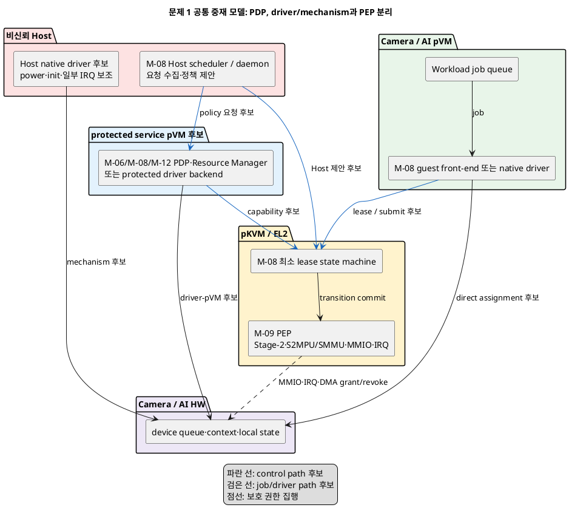
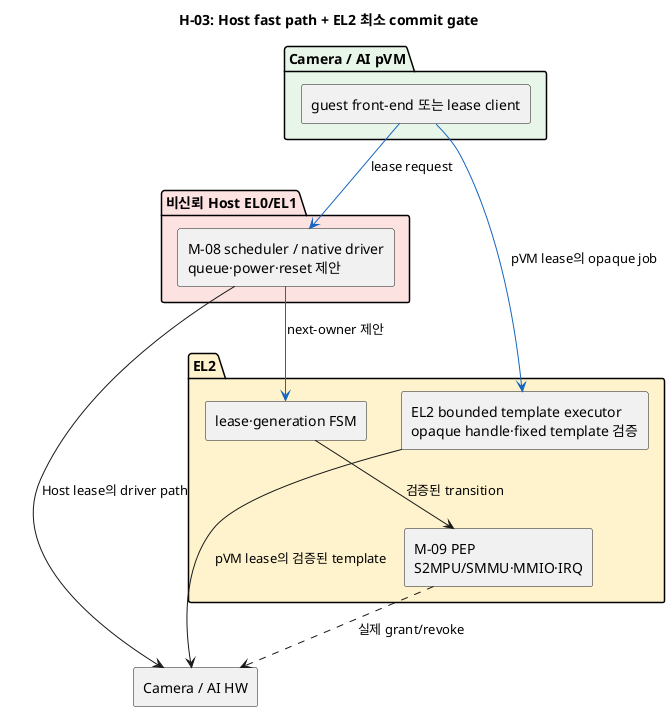
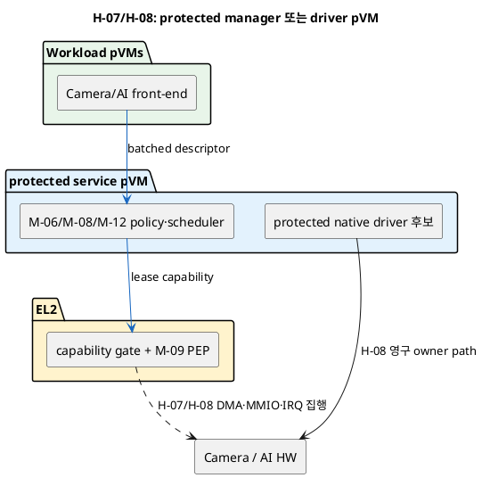

# 문제 1 확장: Camera/AI HW 중재와 전환 설계 공간

## 1. 상태와 문서 목적

- 상태: **후보 작성**
- 성격: 하나의 Decision Point가 아니라, 여러 Decision Point로 나누기 전의 설계 공간 조사 문서
- 최종 결정: **없음**

이 문서는 다음 자료를 기준으로 문제 1의 후보를 다시 펼친다.

- [시스템 개요](../docs/01_시스템_개요.md)
- [설계 범위와 모듈](../docs/02_설계_범위_모듈.md)
- [후보 구조 작성 규칙](../docs/후보구조_작성규칙.md)
- [문제 3 설계 공간 문서](문제3_virtio-blk_공용저장_암호화_설계공간.md)는 구성 방식만 참고한다.

사용자가 참고하지 말라고 지정한 기존 문제 1·2 설계공간 문서는 열거나 검색하지
않았다. 발표자료도 답으로 사용하지 않았다.

이 문서는 `EL2 중재자 대 Host kernel 중재자`라는 한 비교로 문제를 축소하지 않는다.
정책 판정, scheduling, native driver, 실제 권한 집행, HW 상태 전환과 장애 회수를
서로 다른 책임으로 분리하고, 각 책임의 배치와 전환비용 절감 방식을 축별로 전개한다.
마지막에는 같은 분석 축 안의 **모든 pairwise 비교행**을 명시한다. 배치처럼 상호 배타적인
축의 쌍은 한 변수 DP 후보지만, scheduling·notification처럼 조합 가능한 knob가 섞인
축의 쌍은 누락 방지용 design contrast이며 정식 DP로 옮길 때 하위 축으로 다시 분리한다.
서로 직교하는 축의 Cartesian product는 조합표와 대표 조합으로 나타낸다.

## 2. 고정 전제와 실현 가능성 경계

상위 문서의 전제를 바꾸지 않는다.

1. Host Application과 Host Linux kernel은 비신뢰 영역이다.
2. Camera HW와 AI HW는 서로 다른 `device_id`의 물리 IP다. 중재 state machine은 각
   device instance에 독립적으로 적용하며, 각 HW는 단일 Context라 한 시점에 Host 또는
   그 HW를 사용하는 pVM 중 한 주체만 접근한다. Camera pVM과 AI pVM이 하나의 같은
   물리 device를 두고 경쟁한다는 뜻은 아니다.
3. Host와 pVM의 논리적 동시 사용은 시분할이며 실제 병렬 접근은 허용하지 않는다.
4. 동적 전환은 최소한 `revoke → drain → reset → zeroize → S2MPU 갱신 → regrant`를
   만족해야 한다. HW가 동등한 context 격리와 scrub을 증명한 후보만 reset 단계를
   다른 mechanism으로 대체할 수 있다.
5. `verified Workload identity`, `pVM generation`, `pipeline epoch`, `device generation`과
   `physical lease`를 job, DMA mapping, IRQ와 completion에 종단 간 결합한다.
6. Host가 보고한 논리 상태만으로 권한 회수나 전환 완료를 확정하지 않는다.
   M-09 (DMA/S2MPU Isolation Controller)의 `actual-state completion`이 필요하다.
7. EL2는 작은 TCB를 유지한다. device-specific EL2 code는 platform owner의 검토와
   feasibility 시험을 통과해야 한다.
8. data pipeline endpoint는 Camera pVM→AI pVM 두 개다. HW arbitration은 각 device에서
   `Host ↔ 해당 HW를 쓰는 pVM`의 2-owner 문제로 인스턴스화하며 일반 N-owner
   중재기는 범위 밖이다.
9. HW IP, S2MPU와 firmware의 물리 설계는 직접 구현하지 않지만, 필요한 HW contract와
   interface는 후보의 선행 조건으로 명시한다.
10. 승인된 전환 지연·frame deadline 수치는 아직 없으므로 임의 수치를 gate로 쓰지 않는다.

H-16b는 위의 논리적 동시 사용·동적 시분할 요구를 만족하는 해법이 아니다. 비교에서
누락하지 않기 위해 남긴 **요구 변경형 degraded/exclusion baseline**이며, 제품 요구의
별도 예외 승인과 secure-only 운용 정책이 있을 때만 비상 모드로 검토한다.

### 2.1 현행 pKVM에 대한 필수 feasibility 문구

[Linux 최신 pKVM 문서](https://www.kernel.org/doc/html/latest/virt/kvm/arm/pkvm.html)는
pKVM을 experimental feature로 설명하고 `DMA isolation using an IOMMU`를
`Unimplemented` 상태로 표시한다. 반면 [AOSP AVF architecture](https://source.android.com/docs/core/virtualization/architecture)는
pKVM vendor module에 device-specific IOMMU driver를 둘 수 있고, Host EL1이 power,
초기화와 일부 IRQ 보조를 담당하며 EL2가 권한을 집행하는 분할 구조를 설명한다.

따라서 이 문서의 secure direct assignment와 dynamic HW sharing은 **mainline pKVM에
이미 완성된 기능이 아니다**. 대상 Custom SoC branch에서 다음 항목을 platform owner가
확인하기 전에는 조건부 후보로만 취급한다.

- S2MPU/SMMU의 최종 소유자와 Host 우회 불가성
- Camera/AI/Host transaction을 구분하는 StreamID 또는 동등한 식별자
- reset 뒤에도 보호 설정을 우회할 수 없는 register programming model
- MMIO, IRQ와 DMA 권한의 독립 회수 및 원자적 재부여
- device-local SRAM, cache, queue와 firmware state의 reset/scrub 범위
- 멈추거나 악성인 owner를 외부에서 강제 drain/preempt/reset할 방법

동적 강제 preemption만 불가능하고 **trusted clean boot에서 한 owner에게 영구 배타
assignment한 뒤 Host가 power/reset/protection을 우회할 수 없음**이 확인돼도, 현재
SoC에서 가능한 것은 H-16b secure-only degraded mode뿐이다. 이는 원래 시분할 요구의
fallback이 아니며 별도 요구 예외 없이는 선택하지 않는다. StreamID 식별, final PEP,
boot-time reset·scrub 또는 protection 우회 방지까지 실패하면 H-16b도 안전하지 않으므로
해당 HW의 secure 사용을 quarantine/disable한다. H-17 물리 HW 복제는 즉시 적용할
fallback이 아니라 차세대 SoC 요구사항으로 넘긴다.

## 3. 문제 재정의

### 3.1 현재 문제가 아닌 것

문제는 중재 코드를 단순히 EL2와 Host kernel 중 어느 한곳에 모두 넣을지 고르는 것이
아니다. 최종 정책 판정과 물리 권한 집행을 분리할 수 있고, native driver가 있는 위치와
physical owner가 바뀌는 위치도 다를 수 있다. 또한 CPU exception-level 전환 횟수만
줄여도 HW drain, reset, scrub, IOTLB invalidation과 cache warm-up 비용은 남는다.

### 3.2 새 문제 정의

> 비신뢰 Host와 서로 격리된 pVM이 단일 Context Camera/AI HW를 시분할할 때, 다음
> owner를 정하는 authority, native driver, 실제 MMIO·IRQ·DMA 집행과 장애 회수 책임을
> 어느 실행 경계에 배치할지 정해야 한다. 동시에 권한 중첩과 잔류 상태 노출 없이
> 전환 절차를 완료하고, lease·batch·fast path·HW context 지원으로 전체 전환비용을
> 줄이는 구조를 정해야 한다.

**문제의 조건**

- Host 침해에도 비인가 grant와 DMA를 막는다.
- 단일 Context HW에는 한 시점에 하나의 `physical lease`만 존재한다.
- 이전 owner의 MMIO, IRQ, DMA와 잔류 state를 모두 회수한 뒤 새 owner를 grant한다.
- stale job, saved context, IRQ와 completion은 `device generation`으로 거부한다.
- 장애 뒤 trusted ledger와 actual HW state를 대조해 재시작하거나 fail-closed한다.
- Secure Vision AI의 frame pipeline 지연과 Embedded 자원 사용을 함께 측정한다.

비신뢰 Host가 pVM vCPU를 전혀 schedule하지 않거나 물리 IRQ를 지연하는 availability
공격까지 EL2 중재만으로 없앨 수는 없다. 이 문서의 timeout과 fail-closed는 권한 중첩과
정보 노출을 막는 장치이며, frame 전달의 가용성을 보장한다는 뜻은 아니다.

**실제 결정 문제**

- 정책·schedule·driver·enforcement·recovery의 위치를 각각 정한다.
- direct assignment, mediated pass-through, split driver 또는 HW partition 방식을 정한다.
- 전환 단위와 state save/reset 방법을 정한다.
- fast control, mapping template와 notification 방식을 정한다.

### 3.3 품질 충돌

| 선택 | 좋아지는 점 | 부담되는 점 |
|---|---|---|
| EL2에 authority와 driver를 모음 | Host가 정책과 register sequence를 바꾸기 어렵다. | device-specific EL2 TCB, 검증 범위와 유지보수 비용이 커진다. |
| Host는 제안·mechanism, EL2는 gate만 담당 | Linux driver와 scheduler를 재사용하고 EL2를 작게 유지할 수 있다. | Host 보고와 실제 HW 상태를 분리하는 ABI와 강제 reset 경로가 필요하다. |
| protected service pVM에 policy/driver를 둠 | EL2 밖에서 정책을 확장하고 driver 장애를 Host와 분리할 수 있다. | 추가 VM scheduling·IPC, 공용 장애점과 payload 신뢰 경계가 생긴다. |
| direct assignment lease 사용 | lease 안의 MMIO·queue 접근에서 중재 crossing을 줄인다. | revoke, IRQ, IOMMU와 reset의 강제성이 반드시 필요하다. |
| batch·sticky·pipeline lease 사용 | 고정 전환비용을 여러 frame에 상각한다. | 다른 owner의 tail latency, fairness와 Host 서비스 중단시간이 늘 수 있다. |
| context save/restore 사용 | 반복 초기화 비용을 줄일 수 있다. | 누락된 register/state와 stale context가 정보 누출·오동작 원인이 된다. |
| full reset·zeroize 사용 | 검증할 state가 단순하고 잔류 정보 위험이 작다. | 전환 지연, 전력과 warm-up 비용이 커질 수 있다. |
| spatial/HW context partition 사용 | software time-slice와 context switch를 줄이거나 없앤다. | 새 HW 기능, 자원 단편화와 partition-local isolation 증명이 필요하다. |

## 4. 모든 후보가 공유하는 중재 모델

### 4.1 책임을 다섯 부분으로 분리

| 책임 | 논리 모듈 | 반드시 해야 하는 일 | 비신뢰 위치에 둘 때의 제한 |
|---|---|---|---|
| 요청 수집·queueing | M-08, M-12 | job, deadline, priority, client 상태 수집 | 요청을 제안할 수 있지만 최종 grant를 만들지 못함 |
| 정책·scheduling 판정(PDP) | M-06, M-08, M-12 | verified subject와 현재 lease로 next owner 판정 | Host 단독 판정은 보안 근거가 아님 |
| native driver/mechanism | M-08 | HW program, submit, drain, power, status 읽기 | 보호 register와 transition commit을 우회하지 못해야 함 |
| 실제 집행(PEP) | M-09 | Stage-2, S2MPU/SMMU, MMIO, IRQ, CPU dispatch 변경 | actual-state completion은 보호 경계가 확정 |
| recovery·reconcile | M-02, M-04, M-08, M-09 | timeout, reset, scrub, ledger 대조, generation 증가 | Host ledger만 보고 재사용하지 않음 |
| 감사·trace | M-04, M-08, M-09 | decision reason, generation, transition nonce와 actual completion을 순서 보존 기록 | Host log는 복제본일 뿐 삭제·변조돼도 보호 ledger를 바꾸지 못함 |

중재자의 위치를 논의할 때 위 다섯 책임 중 무엇을 옮기는지 함께 적는다. 예를 들어
`Host scheduler + EL2 gate`는 Host가 policy input과 mechanism을 담당할 수 있지만,
EL2가 physical lease와 PEP 상태 전이를 소유한다는 뜻이다.

### 4.2 보호 상태

```text
device_id
generation_namespace_epoch # 보호 재시작 사이의 비반복 namespace: monotonic source 또는 >=128-bit secure boot nonce
el2_incarnation_id
el2_timebase_epoch
el2_timebase_frequency_id
policy_max_pin_ticks, policy_max_ack_ticks, policy_max_active_lease_ticks
device_generation
generation_high_watermark # 최대 reserved/published generation, abort해도 감소 금지
protected_storage_commit_sequence
state                  # IDLE, GRANTED, QUIESCING, REVOKING, RESETTING, INSTALLING, FAILED
owner_verified_id
owner_pvm_generation
pipeline_epoch
physical_lease_id
lease_deadline # hard not-after EL2 tick; 이 tick까지 physical CPU/DMA/job 권한 0
lease_stop_start_el2_tick
physical_revoke_bound_ticks, revoke_profile_digest
policy_version
authorization_decision_or_capability_id
authorization_decision_digest
required_external_authority_set_digest
authorization_permit_set_digest
authorization_permit_set[] # authority/incarnation, prepare/ready nonce, token, decision/composite digest, EL2 ticks, state
owner_binding_revision
pipeline_revision
device_state_revision
mapping_state_revision
composite_revision_digest
capability_revision
capability_revocation_epoch
authorization_expiry
authorization_expiry_el2_tick
capability_expiry_el2_tick
device_lease_limit_el2_tick
device_firmware_measurement
device_firmware_version
firmware_security_epoch
allowed_mmio_ranges
allowed_irq_set
allowed_stream_ids
dma_root_or_template_id
inflight_job_range
frozen_queue_head_tail
command_descriptor_set_digest
saved_context_digest
transition_nonce
actual_state_bitmap
audit_sequence
previous_audit_record_digest
decision_reason_code
```

`authorization_permit_set[]`의 EL2-side state는 authority마다
`NONE→PREPARED→PERMIT_RECEIVED→CONSUMED→ACK_SENT→ACKED` 또는 `ABORTED`로 진행한다.
분리 PDP와 external lease authority가 함께 있으면 서로 다른 entry로 기록하며 scalar token
field를 공유하지 않는다. entry는 `authority_id`, 비반복 `authority_incarnation_id`,
prepare/ready nonce, token ID, decision/composite/actual-state digest,
`not_after_el2_tick`, `ack_not_after_el2_tick`과 state를 가진다. co-located M-06/PEP에서는
permit set이 비어 있고 같은 EL2 composite CAS가 decision을 commit한다.
`required_external_authority_set_digest`는 protected policy가 정한
`(role, authority_id, allowed measurement, required decision/lease revision schema)`의 정확한
집합이다. transition마다 PREPARE 전에 고정해 COMMIT_READY, 모든 permit과 ACK에 결합하고,
required entry 누락·추가·역할 대체 또는 measurement 불일치가 있으면 전체 set을 거부한다.

모든 동적 grant의 `lease_deadline`은 **신규 요청 마감**이 아니라, EL2 timebase에서 old
owner의 physical CPU/MMIO·DMA·job 권한이 모두 0이어야 하는 hard not-after다. 값은
`min(authorization_expiry_el2_tick, capability_expiry_el2_tick,
device_lease_limit_el2_tick, now + policy_max_active_lease_ticks)` 이하로 만든다.
external expiry는 attested common timebase와 max skew로 EL2 tick에 보수적으로 정규화하고,
정규화할 수 없으면 time-limited split authority 후보를 사용하지 않는다. permit의 commit
window와 active lease lifetime은 다른 값이며, external authority는 COMMIT_READY의
`proposed_lease_deadline` 전체가 자기 authorization·device lease 안에 있음을 서명한다.

장치·operating mode·최대 job size별 `physical_revoke_bound_ticks`는 protected timer dispatch,
CPU MMIO unmap/TLBI, queue fetch freeze, 이미 fetch된 job의 bounded drain/preempt 또는 early
hard reset, StreamID detach·IOTLB/S2MPU completion, IRQ/queue purge와 actual-state 확인의 검증된
최악시간을 모두 포함한다. 보호 정책은 versioned `revoke_profile_digest`로 이 bound를 고정하고
overflow/underflow를 검사해
`lease_stop_start_el2_tick <= lease_deadline - physical_revoke_bound_ticks`를 강제한다.
EL2 timer는 stop-start tick까지 submission·doorbell·새 fetch를 닫고 lease/device revision을
증가시켜 회수를 시작하며, **lease deadline까지** active revoke→reset/purge와 actual-state
확인을 끝낸다. 정상 drain이 bound에 맞지 않으면 profile에 포함된 더 이른 reset/isolation
경로를 사용한다. 최악 bound나 deadline까지의 HW 차단을 증명할 수 없거나 stop-start가 이미
지났으면 그 동적 grant를 만들지 않고 static partition/disable 후보로 내린다. 자연 만료는
외부 revoke message나 다음 요청을 기다리지 않는다. 예고 없는 중간 revoke는 즉시 같은
절차를 시작하지만, 물리 회수 latency는 이 검증된 bound를 갖는 별도 계약이다.

이 ledger와 high-watermark는 Host filesystem이나 Host가 제공한 rollback 가능한 blob에
두지 않는다. 살아 있는 보호 실행 동안에는 EL2/final PEP가 소유한 보호 memory와
replay-safe journal에 atomic하게 먼저 commit한다. cold restart까지 연속성을 보장하는
승인된 monotonic protected storage가 있으면 이를 쓴다. 이 문서는 RPMB 존재를 전제하지
않으므로 그런 저장소가 없을 때는 장치를 hard reset하고 queue·IRQ·DMA를 모두 purge한
뒤 HW root/secure firmware의 CSPRNG가 만든 최소 128-bit boot namespace로 바꾼다. Host가
nonce를 공급하지 않으며 RNG 실패·반복 의심 또는 journal commit 실패 시 재grant하지 않고
quarantine한다.

모든 명령, buffer, IRQ, completion과 saved context는 최소한
`(device_id, generation_namespace_epoch, device_generation, owner_generation,
physical_lease_id, pipeline_epoch)`에
결합한다. Host가 오래된 completion을 다시 주입하거나 이전 owner의 context blob을
새 generation에 복원하면 보호 경계가 이를 거부해야 한다.
정책 capability는 위 tuple과 `policy_version`, capability revision·revocation epoch·expiry,
device firmware measurement를 함께 서명·MAC해 다른 owner, generation이나 firmware에
재사용할 수 없게 한다.

### 4.3 공통 상태 전이 불변식

```text
IDLE(g) 또는 GRANTED(old, g)
  -> QUIESCING(old, g)
  -> REVOKING(old, g)
  -> RESETTING_OR_PROVEN_CONTEXT_ISOLATION
  -> INSTALLING(new, g_next reserved; g_next > generation_high_watermark_at_start)
  -> GRANTED(new, g_next)
```

구체적인 commit 순서는 다음과 같다. 계획된 자연 만료 transition은 늦어도
`lease_stop_start_el2_tick`에 step 2를 시작하고 step 2~7의 old-owner 차단·actual-state
확인을 `lease_deadline`까지 끝낸다. drain은 남은 bound 안에서 끝날 때만 허용하고, 그렇지
않으면 처음부터 profile의 bounded reset/isolation 경로를 선택한다.

1. M-06 PDP가 `(device, old owner, new owner, lease)`를 initial 판정할 때 보호 clock 기준
   lease·authorization expiry, verified identity, pVM generation, pipeline epoch,
   current policy version과 capability revision·revocation epoch를 다시 검증한다. 하나라도
   만료·불일치·철회됐으면 transition을 시작하지 않는다. initial allow 뒤 EL2가
   `g_next > generation_high_watermark`와 transition nonce를 예약하고 high-watermark를
   보호 영구 상태에 먼저 반영한다. co-located PDP는 이 값을 포함한 decision digest를
   고정하고, split PDP는 4.3.1절의 `PREPARE`로 같은 값을 인증·pin한 뒤에만 계속한다.
   deny/timeout이어도 예약한 `g_next`는 retire하며 아직 외부에 GRANTED로 게시하지 않는다.
2. PEP는 이전 owner의 CPU MMIO·doorbell과 device queue fetch를 닫는다. memory-resident
   ring/linked descriptor의 CPU write 권한도 freeze하거나 command를 보호 memory로
   copy-on-submit하고, queue head/tail·허용 descriptor 집합과 in-flight job range를
   snapshot한다.
3. 이전 owner가 tail/descriptor를 바꿔 새 fetch를 만들 수 없는 상태에서 snapshot된
   in-flight job만 drain하거나 safe point에서 preempt한다.
4. timeout 또는 fault이면 외부 authority가 hard reset한다.
5. full reset·zeroize 또는 검증된 context save와 partition-local scrub을 완료한다.
6. 이전 StreamID의 DMA를 revoke하고 IOTLB/S2MPU invalidation 완료를 확인한다.
7. clock/reset domain, debug/performance counter, firmware mailbox와 bus alias까지
   `actual_state_bitmap`으로 대조한다. immutable ROM이 아니면 장치 firmware의 authenticated
   measured boot, version·anti-rollback·debug lockdown을 보호층이 확인하고 measurement를
   generation·lease에 결합한다. Host power/init 경로는 grant 중 firmware를 재적재하거나
   측정되지 않은 image로 바꾸지 못해야 한다.
8. 새 owner의 사전 검증된 DMA root/template과 IRQ/MMIO 설정을 예약한 `g_next`에 묶어
   inactive/staged 상태로 설치한다.
9. old 권한이 0이고 staged actual state가 ledger와 같음을 확인하고, owner binding,
   pVM/pipeline, device lease/job/reset과 M-09 mapping의 authoritative protected revision
   vector를 snapshot한다. 아직 `g_next`나 receiver-visible grant를 게시하지 않는다.
10. M-06과 final PEP가 EL2의 같은 protection domain에 있으면 마지막 protected commit
    critical section에서 보호 clock, current policy version, capability
    revision·revocation epoch·expiry, owner identity·pVM generation, pipeline epoch,
    firmware measurement와 lease를 다시 읽고, derived `lease_deadline`이 current parent
    expiry·device limit의 최솟값 이하이고 `lease_stop_start_el2_tick`·revoke bound/profile이
    current protected policy와 일치하는지 확인하며 policy와 step 9 composite vector의 모든
    update를 grant와 같은 lock·revision CAS로 직렬화한다. 외부 daemon/pVM은 이
    authoritative EL2 revision의 변경을 제안할 뿐이다. PDP가 RM pVM·Secure
    Partition·EL3/SCP/device firmware처럼 분리돼
    있으면 local CAS를 주장하지 않고 4.3.1절의 bounded one-shot commit permit protocol을
    완료한다. 어느 경로든 step 1의 decision digest와 final authorization이 같아야 한다.
    실패하면 MMIO·IRQ·submission doorbell을 닫은 채 staged mapping/route를 모두 제거하고
    `g_next`를 retire한다. cleanup actual completion 뒤 fresh M-06 승인, fresh
    generation·lease·nonce로 새 transition을 시작하며, cleanup을 증명할 수 없으면
    reset·quarantine한다.
11. co-located decision 또는 검증·전부 소비한 one-shot commit permit set을 같은 EL2 commit에서
    decision digest, generation, lease와 `GRANTED(new, g_next)`에 결합해 publish한다. HW
    atomic selector가 없으면 ledger를 먼저 게시해 stale `g` event를 거부하되 submission은
    닫아 두고, 마지막에 새 MMIO·IRQ route와 doorbell을 연다. 이 순서를 atomic하거나
    fail-closed하게 만들 수 없으면 동적 전환 후보를 선택하지 않는다.

#### 4.3.1 분리된 PDP–PEP의 bounded one-shot commit permit

분리된 protection domain 사이에는 공용 lock이나 CAS가 없으므로 단순한 `final check
response`를 쓰지 않는다. 다음 protocol이 가능한 후보만 H-07, H-10~H-13 등의 final
PDP로 선택한다.

M-05 identity binding, M-02 pVM/pipeline generation, M-08 device lease/job/reset과 M-09
mapping의 권위 있는 revision은 EL2 ledger를 통해서만 바뀐다. external service는 변경을
제안하며 device reset/fault가 들어오면 EL2가 revision을 먼저 증가시켜 pending commit을
stale로 만든다. external M-08이 final lease authority여야 하는 배치는 아래 authorization
permit과 같은 tuple/timebox의 별도 single-use lease permit entry를 함께 요구하고, 없으면
M-08을 proposal로 낮춘다.

1. 각 external final authority는 initial allow에서 자신의 `authority_id`, 비반복
   `authority_incarnation_id`, decision/policy/capability 또는 device-lease revision,
   owner/pVM/pipeline/device/firmware tuple, `g_next`, lease와 prepare nonce를 인증한
   `PREPARE`를 만들고 protected state를 `PREPARED`로 둔다. Host relay는 이를 위조할 수 없다.
2. EL2는 old 권한을 회수하고 new 권한을 inert하게 stage한 뒤 composite revision,
   actual-state digest와 transition nonce에 EL2가 만든 `(el2_incarnation_id,
   el2_timebase_epoch, el2_timebase_frequency_id, ready_nonce, not_after_el2_tick,
   ack_not_after_el2_tick, proposed_lease_deadline, proposed_lease_stop_start_el2_tick,
   physical_revoke_bound_ticks, revoke_profile_digest,
   required_external_authority_set_digest)`을 묶은 같은
   `COMMIT_READY`를 모든 required authority에 보낸다. 외부 authority가 자체 clock의
   deadline을 EL2에 강요하지 않는다. 각 authority는 자신의 revocation/update와 요청을
   직렬화해 이미 철회·만료됐으면 `ABORT`하고, 아니면 COMMIT_READY의 EL2 timebox를 그대로
   echo·서명한 single-use `COMMIT_PERMIT`을 발급한다. authority도 attested frequency ID를
   인식하고 pin/ACK delta, proposed active lease와 signed revoke profile이 자신의 protected
   authorization expiry, device lease와 policy maximum 안인지 검사하며, 모르는
   frequency·epoch/profile, 정규화할 수 없는 expiry나 과도한 window면 `ABORT`한다.
   EL2는 `now < not_after_el2_tick < ack_not_after_el2_tick <=
   proposed_lease_stop_start_el2_tick < proposed_lease_deadline`과
   `proposed_lease_stop_start_el2_tick <= proposed_lease_deadline -
   physical_revoke_bound_ticks`,
   `not_after-now <= policy_max_pin_ticks`, `ack_not_after-not_after <= policy_max_ack_ticks`를
   강제한다. platform attestation에 tick frequency를 묶고 counter wrap·frequency 변경에는
   새 timebase epoch를 만들며 outstanding permit을 이어 쓰지 않는다.
3. 각 permit 발급은 해당 authority 결정의 linearization point이고 마지막 required permit이
   모여야 set이 commit-eligible해진다. 이것만으로 actual HW grant가 생기지는 않는다.
   모든 policy는 `not_after_el2_tick`까지 one-shot으로 pin하는 bounded semantics를 허용해야
   한다. 발급 전 revoke는 permit을 막고, 발급 뒤 revoke는 permit을 소급 취소하는 대신
   generation-bound `REVOKE`를 EL2에 보낸다. EL2 gate가 어느 REVOKE든 permit-set
   consume보다 먼저 처리하면 전체 commit을 abort하고, consume이 먼저 linearize됐으면
   active lease revoke 절차를 수행한다. 이를 허용하지 않는 authority가 하나라도 있으면
   해당 분리 후보를 제외한다.
4. EL2는 같은 protected commit gate에서 모든 required channel·authority incarnation,
   자신의 incarnation/timebase와 현재 tick, current parent authorization/capability expiry,
   device lease limit, required authority set의 정확한 일치와 tuple·token 미사용 여부를
   확인한다. permit에
   서명된 composite/actual-state digest를 gate 안에서 다시 읽은 current authoritative
   revision vector·actual state와 atomic compare하고, 하나라도 다르면 set/token과 `g_next`를
   retire하고 staged state를 cleanup한다. 모두 같을 때만
   `authorization_permit_set_digest` 전체를 부분 소비 없이 한 번만 소비하면서 step 11을
   commit한다.
5. commit 뒤 각 authority에 `COMMIT_ACK(token_id, permit_set_digest,
   composite_revision_digest, committed generation, lease)`를 보낸다. ACK는 이미
   fail-closed하게 commit된 grant의 노출 전제가 아니라 사후 회계·복구 확인이다.
   authority는 ACK를 durable `ACKED`로 기록하고 authenticated `ACK_RECEIPT`를 돌려주며,
   EL2는 이를 받은 entry만 `ACKED`로 바꾼다. `ack_not_after_el2_tick`까지 전 entry가
   합의되지 않으면 이미 stop-start 이전인 ack deadline에서 submission
   차단→active revoke→reset/purge를 시작해 hard deadline까지 끝낸다.
6. permit/token은 재발급하지 않는다. 동일 tuple의 `COMMIT_ACK`만 ack timebox 안에서
   idempotent하게 재전송할 수 있으며 새 authorization으로 해석하지 않는다. permit 전
   crash·timeout은 staged state 제거와 generation retire로 끝낸다. permit 뒤 ACK/receipt
   유실·authority 재시작은 deadline revoke 뒤 authority별 incarnation, consumed-token set과
   actual state를 reconcile한다. 양쪽 상태를 합의할 수 없으면 reset·quarantine하고 새
   grant를 금지한다.

각 authority는 permit을 발급한 뒤 authenticated ACK 또는 EL2가 증명한 abort/revoke를
받을 때까지 resource를 **possibly active**로 취급하고, 자체 clock timeout만으로 충돌하는
새 permit을 만들지 않는다. 재시작 뒤에도 먼저 EL2 consumed ledger와 actual state를
reconcile한다.

`authority_incarnation_id`는 protected monotonic boot generation 또는 attested
HW-root CSPRNG의 최소 128-bit nonce와 새 channel session key로 만들고 Host가 공급하지
않는다. continuity를 증명하지 못한 새 authority incarnation은 old permit의 EL2 timebox가
모두 지난 뒤 actual state·consumed ledger를 reconcile하고 필요 시 reset/purge하기 전까지
admit하지 않는다. EL2 clock/incarnation continuity 자체를 잃으면 outstanding permit을
모두 거부하고 submission·DMA·IRQ를 revoke·reset/purge한 뒤 비반복 새 EL2 incarnation으로
시작한다. 이 cleanup이나 새 incarnation을 증명하지 못하면 HW를 quarantine한다.
external policy의 absolute authorization expiry도 authority incarnation에 묶인 protected
monotonic clock을 쓰거나, EL2와 attested common timebase·최대 허용 skew를 명시해야 한다.
clock rollback·skew bound 위반은 해당 incarnation의 모든 decision을 revoke한다. 어느
방식이든 permit의 상한은 EL2가 mint한 `not_after_el2_tick`이며 external clock만으로
연장할 수 없다.

새 grant 전에 이전 owner의 CPU MMIO, IRQ와 DMA가 모두 차단되어야 한다. 어느 단계도
Host의 완료 보고만으로 건너뛰지 않는다.
전환이 abort되어도 한 번 예약·게시한 device generation 값은 retire하고 재사용하거나
감소시키지 않는다. 보호 상태가 재시작하면 high-watermark를 복원하거나, 장치를
hard reset하고 queue·IRQ·DMA를 purge한 후 이전과 반복되지 않는 새
`generation_namespace_epoch`를 만든다. 둘 다 증명할 수 없으면 동적 재grant를 금지한다.
high-watermark가 표현 범위의 최댓값에 도달하기 전에도 새 transition을 먼저 막고
현재 lease를 revoke한 후 같은 hard reset·queue/IRQ/DMA purge 절차를 수행한다. 그런
뒤에만 반복되지 않는 새 namespace로 넘어가고, 같은 namespace에서 counter를 0으로
wrap하지 않는다. 새 namespace를 증명할 수 없으면 HW를 quarantine한다.

### 4.4 공통 배치



## 5. 모든 동적 후보가 지켜야 하는 보안·복구 절차

### 5.1 정상 전환

1. M-05가 만든 `verified Workload identity`와 M-02의 `pVM generation`으로 요청자를
   확인한다.
2. authority가 동시에 하나의 `physical lease`만 만들고 다음 `device_generation`과
   `transition_nonce`를 예약한다.
3. 현재 owner에 QUIESCING을 통지하되, 협조 여부와 관계없이 PEP가 doorbell, queue fetch,
   command ring·linked descriptor write를 freeze하고 drain할 job range를 snapshot한다.
4. 정상 경로는 drain 또는 safe-point preemption을 기다린다. deadline을 넘기면 fault
   경로로 바꾼다.
5. 선택한 X 축 후보에 따라 full reset, selective reset, context save/restore 또는
   bank switch를 수행한다.
6. PEP가 old DMA·MMIO·IRQ revoke와 invalidation의 실제 완료를 확인한다.
7. 새 mapping, context와 IRQ/MMIO route를 예약한 generation에 묶어 staged 설치한다.
8. old 권한 0과 actual state를 확인한 뒤 4.3절의 composite revision gate 또는 4.3.1절의
   one-shot permit set을 완료한다. 같은 fail-closed commit에서 generation·lease와 `GRANTED`를
   결합해 게시하고, 새 submission·completion path는 마지막에 연다. 그 전에 generation이나
   lease를 receiver-visible grant로 게시하지 않는다.

### 5.2 장애와 중재자 재시작

| 중단·장애 시점 | 신뢰 상태 | 복구 원칙 |
|---|---|---|
| next owner 판정 전 | 이전 GRANTED 또는 IDLE | 기존 lease deadline까지 유지하거나 IDLE 유지 |
| QUIESCING 중 owner 무응답 | old owner 권한 일부 남음 | watchdog이 submission 차단, hard reset, DMA revoke 후에만 계속 |
| reset/scrub 중 | 누구에게도 grant하지 않음 | reset을 처음부터 반복하고 actual state를 대조 |
| DMA revoke와 IOTLB invalidate 사이 | old DMA가 남을 수 있음 | 새 owner install 금지, invalidate를 반복하거나 fail-closed |
| staged mapping install 중 | 새 owner 미승인·inactive | 부분 mapping 제거 후 다시 install, 모든 새 permission과 doorbell은 계속 닫음 |
| staged 권한/ledger commit 중단 | actual state와 journal 불일치 | actual state는 cleanup 범위에만 사용; submission 차단→양쪽 revoke→필요 시 reset→새 generation의 fresh grant |
| healthy old owner로 R-02 요청 | old state·queue·권한과 authorization freshness에 따라 다름 | next generation이 미게시이고 old state가 전혀 변하지 않은 pre-commit에서도 M-06이 identity·pVM/pipeline epoch·policy version·capability revision/revocation·lease/authorization expiry를 다시 검증한 때만 같은 lease 재개; 만료·철회·epoch 종료 또는 그 밖의 경우는 같은 lease를 재개하지 않고 fresh M-06 승인 뒤 예약 값보다 큰 generation과 새 lease/nonce로 재grant하거나 reset·quarantine |
| 중재자 pVM/daemon 재시작 | PEP lease는 남을 수 있음 | 보호 ledger snapshot을 읽고 HW state를 reconcile; Host ledger만 복원 금지 |
| split authority permit/ACK 중 재시작 | authority별 PREPARED, PERMIT_RECEIVED, CONSUMED, ACKED가 다를 수 있음 | permit 재발급 금지·ACK만 idempotent 재전송; permit 전이면 stage 제거·generation retire, set 소비 뒤 ack timebox 미합의면 EL2 active revoke·reset/purge 후 각 incarnation과 consumed-token/actual state reconcile; 한 entry라도 불일치면 quarantine |
| active lease의 parent 자연 만료 | grant는 active이고 hard not-after가 다가옴 | 검증된 revoke bound만큼 앞선 stop-start timer에서 submission·doorbell·fetch 차단과 revision 증가를 commit하고 reset/isolation·CPU/DMA/job 회수를 hard deadline까지 완료; bound 미증명·miss 가능성이면 애초 grant 거부 또는 static partition/disable, same generation 연장 금지 |
| stale IRQ/completion 도착 | generation 불일치 | drop·기록하고 현재 owner state를 바꾸지 않음 |
| reset 또는 scrub 확인 불가 | FAILED | HW를 격리하고 재부팅·platform recovery 전 재사용 금지 |

### 5.3 전환비용의 정확한 분해

`context-switch cost`는 다음 합으로 측정한다.

```text
request enqueue·IPC/syscall/HVC/SMC
+ authority scheduling wait
+ old job drain/preempt
+ register/local-state save 또는 reset·scrub
+ S2MPU/SMMU update·IOTLB invalidate
+ MMIO·IRQ reroute
+ new context restore·cache/firmware warm-up
+ vCPU scheduling과 completion delivery
```

한 항목만 줄이고 전체 전환이 빨라졌다고 결론내리지 않는다. 예를 들어 HVC 횟수를
줄여도 reset과 cache warm-up이 지배적이면 end-to-end frame latency는 거의 줄지 않을
수 있다.
split PDP 후보는 정상 경로에 `Tprepare + Tcommit_ready + Tpermit_set + Tack + Tack_receipt`을 추가하고 ACK/reconcile
상태도 유지한다. batch·long lease로 이를 상각할 수 있지만 permit tuple·deadline보다 넓게
재사용할 수 없으며, 이 crossing을 빼고 H-07/H-10~H-13 성능을 비교하지 않는다.

## 6. 중재·driver·HW 지원을 결합한 전체 구조 후보

### 6.1 빠른 판정표

| 번호 | 후보 구조 | 최종 보안 authority | native driver / physical owner | 현재 판정 |
|---|---|---|---|---|
| H-01 | Host userspace/VMM full emulation | Host | Host userspace·kernel | Host 비신뢰 위반, 제외 기준선 |
| H-02 | Host kernel arbiter·mdev 단독 | Host kernel | Host kernel | Host 비신뢰 위반, 제외 기준선 |
| H-03 | Host fast scheduler/lease-scoped driver + EL2 최소 commit gate | EL2 | Host lease는 Host kernel, pVM lease는 EL2 bounded template executor | **조건부 Host-driver 비교 후보**, command 검증 필요 |
| H-04 | EL2 full arbiter + 모든 privileged MMIO trap/emulate | EL2 | EL2 device-specific backend | 조건부: EL2 TCB와 trap 비용 큼 |
| H-05 | EL2 mediated pass-through | EL2 | guest native driver, privileged op만 EL2 | 조건부: 안전한 register 분할 필요 |
| H-06 | Workload pVM native driver + EL2 whole-device lease | EL2 | 현재 owner pVM | **현 SoC 우선 후보**, 강제 revoke/reset 필요 |
| H-07 | protected Resource Manager pVM PDP + Host mechanism + EL2 PEP | RM pVM 정책, EL2 actual PEP | Host 또는 owner pVM | **정책 확장 후보**, 추가 IPC·복구 필요 |
| H-08 | 공용 protected driver/service pVM이 HW 영구 소유 | service pVM + EL2 | service pVM | 조건부: payload TCB·공용 장애점 확대 |
| H-09 | Camera/AI별 protected driver pVM + EL2 assignment | 각 driver pVM + EL2 | 장치별 driver pVM | 조건부: 자원·channel 증가, 장애 반경 축소 |
| H-10 | Secure Partition/TEE full driver backend + FF-A | Secure World | S-EL0/S-EL1 | 조건부: driver port, Secure TCB·memory 부담 큼 |
| H-11 | EL3/Secure firmware의 tiny transition FSM | EL3 firmware + EL2 | Host/pVM driver | 조건부: 이중 authority·최고권한 ABI 검증 필요 |
| H-12 | SCP/safety-island firmware arbiter | 별도 firmware + EL2 | Host/pVM driver | 조건부/차세대: 독립 watchdog, mailbox와 attestation 필요 |
| H-13 | attested device firmware의 per-domain command queue | device firmware + EL2 attach | device firmware + guest queue | 차세대 HW/FW 후보 |
| H-14 | HW access-window·banked context atomic switch | EL2/HW partition manager | guest native driver | 차세대 HW 후보, switch cost 작음 |
| H-15 | HW spatial partition·SR-IOV/SIOV/PASID context | HW partition manager + EL2 | 각 pVM native driver | 단일 Context 전제를 바꾸는 차세대 후보 |
| H-16 | long-epoch 동적 최적화(H-16a)와 static secure-only 저하 기준선(H-16b)의 umbrella | EL2 | secure pVM | H-16a는 조건부 후보, H-16b는 요구 불충족·별도 예외 baseline |
| H-17 | secure용·Host용 물리 HW 복제 | 물리 partition + EL2 | 각 domain native driver | 차세대 SoC 후보, area/power 증가 |
| H-18 | owner/requester token·yield + EL2 최종 gate | 각 device의 현재 owner/requester 제안, EL2 집행 | 현재 owner | 조건부: watchdog과 deterministic tie-break 필요 |
| H-19 | Camera+AI를 하나의 appliance pVM에 합쳐 영구 소유 | 합친 pVM + EL2 | 합친 pVM | 독립 pVM 운용 요구 약화, 제외 기준선 |

`조건과 맞음` 또는 `우선 후보`는 구현 완료를 뜻하지 않는다. H-03, H-05, H-06,
H-07에도 2.1절의 DMA isolation feasibility gate를 동일하게 적용한다.

### 6.2 H-03: Host fast path와 EL2 최소 commit gate

Host의 M-08 daemon/kernel driver는 요청 queueing, device power, 초기화, 일반 driver
mechanism과 scheduling 제안을 담당한다. EL2의 작은 state machine은 현재 owner,
generation, transition 순서와 보호 register allowlist를 확인하고 M-09 PEP 변경을
commit한다. Host가 reset 완료를 주장하더라도 EL2가 읽을 수 있는 trusted status 또는
secure firmware의 completion이 없으면 다음 grant를 만들지 않는다.

Host native driver가 full command stream, payload address 또는 model/frame을 임의로
program하게 두어서는 transition gate만으로 pVM job의 confidentiality·integrity를 지킬 수
없다. Host lease에서는 Host driver를 그대로 쓰되, pVM lease에서는 opaque protected
handle과 allowlisted command template만 받는 split adapter가 address·length·register를
검증하고 EL2가 설치한 DMA root 밖의 access를 거부해야 한다. command stream 자체가
민감하거나 address/privileged operation을 bounded하게 검증할 수 없으면 H-03은 제외하고
H-05/H-06 또는 protected driver pVM을 사용한다.

이 문서의 H-03과 E2E-04에서 pVM job의 종착점은 **EL2 bounded template executor**로
고정한다. 이는 fixed-format descriptor와 미리 검증된 register template만 실행하는 C-04
interface/PEP adapter이며 B-05 full native driver가 아니다. protected pVM에 parser/backend를
두는 다른 배치는 H-07~H-09 및 E2E-03으로 비교하고 H-03 tuple 안의 모호한 대안으로
섞지 않는다.

장점은 Linux native driver와 scheduler를 재사용하면서 EL2에 파일·job parser 전체를
넣지 않는다는 점이다. 단점은 Host mechanism과 EL2 enforcement 사이 ABI가 복잡하고,
device status가 Host 전용 register에만 보이면 `actual-state completion`을 만들기 어렵다는
점이다.

H-03의 Host power/init 재사용은 장치 firmware의 신뢰를 Host에 넘긴다는 뜻이 아니다.
P1-G13의 measurement·version·anti-rollback을 grant마다 확인하고 Host의 미측정 runtime
reload를 PEP가 차단할 수 없으면 H-03을 선택하지 않는다.



### 6.3 H-06: pVM native driver와 EL2 whole-device lease

현재 owner pVM에 performance-critical MMIO, IRQ와 DMA context를 직접 연결한다. lease
동안은 일반 job submission이 중재자를 지나지 않는다. 전환 때만 EL2가 old access를
강제로 닫고 전체 transition protocol을 수행한다. steady state latency가 낮지만, 악성
pVM이 driver protocol을 따르지 않아도 외부에서 submit 차단·reset·DMA revoke할 수 있는
HW contract가 필수다.
whole-device direct lease도 P1-G13을 통과한 firmware measurement를 generation·lease에
결합해야 하며, owner pVM이나 Host가 firmware를 다시 적재해 측정을 바꿀 수 없어야 한다.

### 6.4 H-07~H-09: Resource Manager와 driver pVM

- H-07은 protected Resource Manager pVM이 policy, deadline, quota와 fairness를
  판정하고 EL2가 capability와 actual PEP만 집행한다. EL2 TCB를 줄이면서 정책을 바꿀 수
  있지만 RM scheduling과 restart가 pipeline 공용 장애점이 된다. RM pVM을 final PDP로
  쓰려면 P1-G12의 bounded PREPARE/COMMIT_PERMIT protocol을 구현해야 하며 단순 RPC allow
  응답은 authorization commit으로 인정하지 않는다.
- H-08은 하나의 protected driver pVM이 HW를 영구 소유하고 Workload pVM에는 split-driver
  front-end를 제공한다. 물리 owner switch를 logical queue switch로 바꿀 수 있지만,
  backend가 frame·model을 볼 수 있으면 신뢰 경계가 넓어진다.
- H-09는 Camera driver pVM과 AI driver pVM을 분리해 한 backend 장애가 두 장치에 동시에
  전파되는 것을 줄인다. 대신 channel, memory mapping과 상주 자원이 장치마다 늘어난다.



### 6.5 H-10~H-12: Secure World와 별도 firmware

H-10은 Secure Partition에 full driver를 두므로 Host와 pVM 침해에 독립적이지만 Linux급
Camera/NPU driver, 큰 buffer lifecycle과 asynchronous IRQ를 Secure World로 옮긴다.
H-11은 full driver 대신 owner token, firewall, reset과 scrub만 담당하는 tiny FSM을
EL3에 둔다. H-12는 같은 최소 책임을 SCP/safety island에 두어 AP가 멈춰도 watchdog과
reset을 수행한다. 세 후보 모두 신뢰 위치를 옮기는 것이지 비용을 없애는 것은 아니며,
SMC/mailbox crossing은 batch나 long lease로 상각해야 한다. Secure World/EL3/SCP가 final
PDP이면 P1-G12의 비반복 authority incarnation, EL2-timeboxed one-shot permit set·ACK/receipt와 active-lease
revoke가 필수다. 이를 제공하지 못하면 해당 firmware는 policy input만 제안하고 final
M-06 PDP는 EL2에 둔다.

### 6.6 H-13~H-17: HW-assisted 또는 switch 제거 후보

- H-13: attested device firmware가 domain별 queue를 검증·schedule한다.
  final PDP가 되는 scheduler/control firmware는 전환 대상 data-path reset과 독립된
  management core·보호 partition에서 살아남아야 한다. 같은 reset으로 소실된다면 pending
  permit을 폐기하고 새 firmware incarnation·measurement로 re-attest한 뒤에만 새 transition을
  시작한다. 이를 보장할 수 없으면 device firmware는 proposal만 하고 EL2 M-06이 final PDP다.
- H-14: banked context/access window가 MMIO, IRQ, StreamID와 local state를 한 묶음으로
  바꾸고 software는 atomic selector만 전환한다.
- H-15: spatial partition, SR-IOV/SIOV 또는 PASID/SSID context로 domain을 병렬화한다.
- H-16a long-epoch 동적 최적화: 정상 full transition과 Host↔pVM owner 변경을 수행할 수
  있을 때 pipeline epoch 전체에 한 owner를 주어 switch 횟수를 시작·종료 경계로 줄인다.
  원래 시분할 요구를 유지하는 조건부 후보다.
- H-16b static-exclusive secure-only degraded baseline: 동적 강제 preemption이 불가능할 때
  trusted clean boot에서 한 secure owner에게 배타 assignment하고 reboot까지 owner를
  바꾸지 않는다. 원래 Host↔pVM 동적 시분할 요구를 만족하지 않으므로 정상 fallback이나
  해결 후보가 아니며, 별도 제품 요구 예외가 있을 때만 비상 운용안으로 승인할 수 있다.
  M-06 authorization은 전체 boot/pipeline epoch를 명시적으로 허용해야 하며 만료·철회 시
  새 job을 닫고 platform/device reset으로 lease를 끝낸다. 이 reset이나 boot-time
  PEP·scrub을 강제할 수 없으면 이 변형도 사용할 수 없다.
- H-17: secure용과 Host용 HW를 물리적으로 복제해 sharing 자체를 없앤다.

H-13 device firmware가 final authorization까지 맡는 변형도 P1-G12의 split-PDP protocol과
비반복 `authority_incarnation_id`를 제공해야 한다. 그렇지 않으면 device firmware decision은
제안일 뿐이고 EL2 M-06이 final permit을 발급한다.

H-13~H-15는 queue/context별 DMA StreamID, IRQ, local-memory scrub, debug counter와
fault containment가 종단 간 분리돼야 한다. 단순히 queue ID만 여러 개인 것은 보안
partition이 아니다.

### 6.7 제외 구조의 이유

- H-01/H-02는 Host가 비인가 동시 grant, reset 생략, S2MPU 우회와 stale IRQ 주입을 할
  수 있으므로 최종 authority가 될 수 없다. Linux mdev/VFIO는 mechanism 선례이지 이번
  위협모델의 trust anchor가 아니다.
- H-19는 pVM 간 HW·데이터 경계를 없애지만 Camera/AI pVM의 독립 동시 운용 요구를
  약화한다. 내부에 다시 보호 partition을 만들지 않는 한 해결책이 아니다.
- cooperative yield만 있고 watchdog/hard reset이 없는 H-18 변형은 악성 owner를 회수할
  수 없어 제외한다.
- H-16b는 안전 조건을 만족해도 Host↔pVM 동적 시분할 요구를 없애므로 요구 변경형
  degraded/exclusion baseline이다. 별도 요구 예외가 없으면 H-19와 마찬가지로 해법에서
  제외한다.

## 7. 대표 동작 구조와 비용 절감 원칙

### 7.1 현 SoC 검증 baseline

검증을 시작할 수 있는 보수적 baseline은 H-06을 A-01 Host proposal+EL2 gate와 조합한
구조다. H-03은 동일한 authority와 PEP를 유지하지만 native driver를 B-02 pVM에서
B-01 Host로, guest interface를 C-03 whole-device lease에서 C-04 split API로 함께
바꾸는 **넓은 비교**다. 정식 DP에서는 다른 축을 고정하고 B축과 C축을 하나씩
분리해 비교한다. H-03과 H-06을 하나의 구조로 중복 결합하지 않는다.

1. Host는 scheduling을 제안하고 owner pVM은 native driver를 사용한다.
2. EL2는 lease와 transition commit을 소유한다.
3. 먼저 frame 하나의 lease로 전환 안전성을 증명하고, 이후에만 N개 frame 또는 pipeline
   phase를 묶어 고정비를 상각한다.
4. 전환할 때마다 full reset·zeroize와 S2MPU/SMMU actual-state 확인을 수행한다.
5. 성공이 확인된 뒤에만 soft-stop, template switch와 notification 최적화를 하나씩
   추가한다.

### 7.2 성능 최적화를 적용하는 순서

1. per-frame에서 N-frame/batch 또는 pipeline-epoch lease로 전환 횟수를 줄인다.
2. synchronous control을 shared ring과 한 번의 doorbell로 묶는다.
3. per-switch page programming을 prebuilt immutable S2MPU/SMMU template의 root switch로
   바꾼다.
4. 정상 경로는 cooperative soft-stop, timeout/fault에서만 hard reset을 쓰는지 검증한다.
5. CPU vCPU와 HW lease를 gang scheduling해 lease를 받았는데 pVM이 deschedule되는 시간을
   줄인다.
6. HW가 지원하면 access-window, banked context 또는 spatial partition으로 전환한다.

reset/zeroize 생략, stale mapping 유지, Host의 reset 완료 주장 신뢰, 무검증 direct IRQ,
무제한 polling과 cooperative yield 단독 사용은 최적화가 아니라 안전 불변식 위반이다.

### 7.3 책임 경계

| 실행 위치 | 해야 하는 일 | 하면 안 되는 일 |
|---|---|---|
| Host EL0/EL1 | request queue, policy input, native driver mechanism, power/init 보조 | 최종 grant 생성, 실제 revoke 완료 확정, 보호 ledger 임의 변경 |
| Workload pVM EL1 | lease 안의 native job submission, safe-point yield, local driver state | 다른 owner의 context 접근, lease 밖 MMIO/DMA |
| protected RM/driver pVM | 선택 시 policy·quota 또는 protected backend 수행 | EL2 PEP 우회, 다른 Workload payload 무제한 매핑 |
| EL2 | lease/generation FSM, Stage-2·S2MPU/SMMU·MMIO·IRQ 집행, actual completion | 일반 Linux driver 전체, 복잡한 scheduling policy와 payload 처리 |
| Secure firmware/SCP | 선택 시 강제 reset·scrub·trusted status | Linux급 full driver를 이유 없이 최고권한으로 이동 |
| HW/device firmware | 선택 시 context·queue별 격리와 partition-local reset | attestation·fault isolation 없이 software authority 대체 |

## 8. 의미 있는 후보 구조 쌍

아래 표는 같은 분석 축의 후보를 두 개씩 고른 **모든 pairwise 비교행**이다. 상호
배타적인 placement/interface/state/mapping 후보는 한 변수 DP로 올릴 수 있다. 다음
축은 조합 가능한 knob가 섞여 있어 행을 후보 누락 방지용 design contrast로 쓰고 정식
DP에서는 오른쪽 하위 축으로 다시 나눈다.

| 기존 축 | 정식 DP에서 분리할 하위 축 |
|---|---|
| S scheduling | trigger/frame·time·safe-point, urgency/FIFO·deadline, retention/sticky·batch·epoch |
| F fast control | transport/RPC·ring, executor/Host·EL2·service pVM |
| N notification | IRQ routing, trigger/coalescing, wait/polling policy |
| R failure | rollback eligibility와 reset→quarantine의 계층형 escalation |

한 쌍을 정식 DP로 올릴 때는 비교하는 하위 축 외 driver, schedule, reset과 HW 전제를
같게 고정한다. 서로 다른 축을 함께 바꾸는 H-03 대 H-08 같은 비교는 end-to-end
comparison이며 정식 Decision Point로는 다시 분해한다.

### 8.1 최종 scheduling authority 위치 쌍

모든 후보에서 실제 MMIO·IRQ·DMA PEP는 EL2 또는 EL2가 검증한 동등한 보호 경계가
소유한다. 이 축은 next owner와 lease 조건을 판정하는 PDP 위치만 바꾼다.

| 번호 | authority 후보 | 책임과 조건 |
|---|---|---|
| A-01 | Host 제안 + EL2 safety gate | Host가 ordering·QoS를 정하고 EL2는 eligibility·capability·generation·actual state만 검사; Host DoS 가능 |
| A-02 | EL2 통합 authority | EL2가 safety뿐 아니라 ordering·fairness·schedule policy까지 직접 판정 |
| A-03 | protected RM pVM + EL2 gate | RM pVM이 policy·QoS를 판정하고 EL2가 capability와 PEP 집행 |
| A-04 | Secure World/EL3 authority + EL2 PEP | Secure firmware가 owner를 정하고 EL2와 인증된 bounded commit-permit protocol 수행 |
| A-05 | SCP/safety-island authority + EL2 PEP | AP 밖 firmware가 watchdog·schedule을 판정 |
| A-06 | owner/requester token·yield + EL2 gate | 각 device의 현재 owner와 requester가 token을 협상하고 EL2가 단일 lease만 집행 |
| A-07 | attested device-firmware scheduler + EL2 attach | device firmware가 queue를 schedule하고 EL2가 attested context만 연결 |

| 쌍 | 후보 A | 후보 B | 하나만 바뀌는 결정 | 선행 조건 |
|---|---|---|---|---|
| P1-D001 | A-01 Host 제안 | A-02 EL2 통합 | scheduling PDP를 Host에 위임할지 EL2에 둘지 | 동일 PEP와 driver |
| P1-D002 | A-01 Host 제안 | A-03 RM pVM | 비신뢰 Host가 제안할지 protected RM이 판정할지 | RM identity·recovery |
| P1-D003 | A-01 Host 제안 | A-04 Secure World | Normal World Host가 제안할지 Secure World가 판정할지 | EL2↔Secure authenticated permit ABI |
| P1-D004 | A-01 Host 제안 | A-05 SCP | AP Host가 제안할지 독립 firmware가 판정할지 | trusted mailbox·watchdog |
| P1-D005 | A-01 Host 제안 | A-06 owner/requester token | 중앙 Host queue를 쓸지 현재 owner/requester 협상을 쓸지 | tie-break·강제 revoke |
| P1-D006 | A-01 Host 제안 | A-07 device FW | Host schedule을 쓸지 device schedule을 쓸지 | FW attestation·queue isolation |
| P1-D007 | A-02 EL2 통합 | A-03 RM pVM | policy를 EL2 TCB에 둘지 별도 protected pVM에 둘지 | RM IPC 비용 |
| P1-D008 | A-02 EL2 통합 | A-04 Secure World | 가장 작은 Normal World 보호층에 둘지 Secure World에 둘지 | 분리 authority commit·revoke ordering |
| P1-D009 | A-02 EL2 통합 | A-05 SCP | CPU EL2가 판정할지 독립 control core가 판정할지 | SCP status 신뢰성 |
| P1-D010 | A-02 EL2 통합 | A-06 owner/requester token | 중앙 보호 판정일지 owner/requester 제안+gate일지 | 악성 requester 제한 |
| P1-D011 | A-02 EL2 통합 | A-07 device FW | CPU hypervisor가 schedule할지 device가 schedule할지 | attested device state |
| P1-D012 | A-03 RM pVM | A-04 Secure World | Normal World protected pVM에 policy를 둘지 Secure World에 둘지 | 동일 EL2 PEP |
| P1-D013 | A-03 RM pVM | A-05 SCP | software pVM policy일지 독립 firmware policy일지 | update·recovery contract |
| P1-D014 | A-03 RM pVM | A-06 owner/requester token | 중앙 protected broker를 쓸지 device별 token을 쓸지 | fairness authority |
| P1-D015 | A-03 RM pVM | A-07 device FW | CPU-side RM이 job을 정할지 device firmware가 정할지 | command parser 신뢰 |
| P1-D016 | A-04 Secure World | A-05 SCP | TrustZone firmware일지 safety island일지 | 두 firmware의 device 관측 범위 |
| P1-D017 | A-04 Secure World | A-06 owner/requester token | Secure 중앙 판정일지 owner/requester 협상일지 | EL2 final gate 유지 |
| P1-D018 | A-04 Secure World | A-07 device FW | platform secure firmware일지 device firmware일지 | 상호 attestation |
| P1-D019 | A-05 SCP | A-06 owner/requester token | 독립 watchdog 중앙 판정일지 device별 token 협상일지 | timeout 강제 경로 |
| P1-D020 | A-05 SCP | A-07 device FW | SoC control firmware일지 device-local scheduler일지 | fault·reset 소유권 |
| P1-D021 | A-06 owner/requester token | A-07 device FW | software owner/requester 협상일지 HW queue arbitration일지 | queue/domain binding |

A-04~A-07은 현재 platform 범위를 확장한다. 필요한 firmware/HW가 없다는 이유로 표에서
지우지 않고, feasibility gate가 실패하면 비교 기준선으로 남긴다.

### 8.2 native driver와 physical owner 위치 쌍

이 축에서는 authority와 PEP를 고정하고, register programming과 장치 상태를 이해하는
native driver의 실행 위치만 바꾼다.

| 번호 | driver/owner 후보 | 특징 |
|---|---|---|
| B-01 | Host kernel native driver | 재사용이 쉽지만 Host는 mechanism일 뿐 authority가 아님 |
| B-02 | 현재 Workload pVM native driver | lease 안의 직접 접근, 강제 revoke 필요 |
| B-03 | 하나의 shared protected driver pVM | 물리 owner 고정, 공용 TCB·장애점 |
| B-04 | Camera/AI별 protected driver pVM | 장치별 fault containment, 상주 자원 증가 |
| B-05 | EL2 device-specific driver | Host 독립, EL2 TCB 최대 |
| B-06 | Secure Partition driver | Secure World TCB·world switch 증가 |
| B-07 | device firmware/command processor | CPU driver 최소화, 새 FW/HW contract 필요 |

| 쌍 | 후보 A | 후보 B | 하나만 바뀌는 결정 | 조건 |
|---|---|---|---|---|
| P1-D022 | B-01 Host driver | B-02 Workload pVM driver | driver를 비신뢰 Host에 둘지 current owner에 둘지 | 동일 authority·PEP |
| P1-D023 | B-01 Host driver | B-03 shared driver pVM | Host driver일지 protected 공용 backend일지 | payload visibility 결정 |
| P1-D024 | B-01 Host driver | B-04 per-device driver pVM | Host 한곳일지 장치별 protected VM일지 | channel·memory 비용 |
| P1-D025 | B-01 Host driver | B-05 EL2 driver | Linux EL1 mechanism일지 EL2 full mediation일지 | EL2 code budget |
| P1-D026 | B-01 Host driver | B-06 Secure Partition | Normal World driver일지 Secure World driver일지 | driver port feasibility |
| P1-D027 | B-01 Host driver | B-07 device FW | CPU Linux driver일지 device-resident backend일지 | FW attestation |
| P1-D028 | B-02 Workload pVM driver | B-03 shared driver pVM | owner별 direct driver일지 공용 backend일지 | physical switch 대 logical queue switch |
| P1-D029 | B-02 Workload pVM driver | B-04 per-device driver pVM | Workload에 driver를 둘지 별도 장치 VM에 둘지 | fault containment |
| P1-D030 | B-02 Workload pVM driver | B-05 EL2 driver | guest native path일지 EL2 emulation일지 | trap surface |
| P1-D031 | B-02 Workload pVM driver | B-06 Secure Partition | pVM에 driver를 둘지 Secure World에 둘지 | FF-A·buffer path |
| P1-D032 | B-02 Workload pVM driver | B-07 device FW | CPU guest driver일지 device queue protocol일지 | compatible command ABI |
| P1-D033 | B-03 shared driver pVM | B-04 per-device driver pVM | backend 장애 경계를 공용으로 둘지 장치별로 나눌지 | 자원 예산 |
| P1-D034 | B-03 shared driver pVM | B-05 EL2 driver | protected EL1 backend일지 EL2 backend일지 | TCB 대 crossing |
| P1-D035 | B-03 shared driver pVM | B-06 Secure Partition | protected Normal World일지 Secure World일지 | 신뢰 경계 범위 |
| P1-D036 | B-03 shared driver pVM | B-07 device FW | software service VM일지 device-resident service일지 | FW isolation |
| P1-D037 | B-04 per-device driver pVM | B-05 EL2 driver | 장치별 VM 격리일지 EL2 통합 driver일지 | failure radius |
| P1-D038 | B-04 per-device driver pVM | B-06 Secure Partition | Normal World 장치 VM일지 secure partition일지 | memory·IRQ support |
| P1-D039 | B-04 per-device driver pVM | B-07 device FW | 별도 CPU VM일지 device firmware일지 | debug·upgrade 경로 |
| P1-D040 | B-05 EL2 driver | B-06 Secure Partition | driver를 EL2에 둘지 S-EL0/S-EL1에 둘지 | 최고권한 TCB 비교 |
| P1-D041 | B-05 EL2 driver | B-07 device FW | hypervisor driver일지 device firmware일지 | attested command protocol |
| P1-D042 | B-06 Secure Partition | B-07 device FW | platform Secure World일지 device-local TEE/FW일지 | end-to-end identity binding |

### 8.3 guest에 보이는 HW interface 쌍

| 번호 | interface 후보 | 설명 |
|---|---|---|
| C-01 | full trap-and-emulate | 모든 MMIO/privileged operation을 backend가 해석 |
| C-02 | mediated pass-through | fast register·queue는 direct, privileged operation만 trap |
| C-03 | whole-device direct assignment lease | lease 안에서 native interface 전체를 직접 사용 |
| C-04 | split virtual device/API remoting | guest front-end가 job/API를 backend에 전달 |
| C-05 | HW VF/access-window/context | domain별 HW interface 또는 banked window를 직접 사용 |

| 쌍 | 후보 A | 후보 B | 결정 질문 | 선행 조건 |
|---|---|---|---|---|
| P1-D043 | C-01 full emulation | C-02 mediated pass-through | 모든 접근을 trap할지 fast subset을 direct 허용할지 | register 분류 |
| P1-D044 | C-01 full emulation | C-03 whole-device lease | 연속 mediation일지 lease 동안 direct일지 | 강제 revoke |
| P1-D045 | C-01 full emulation | C-04 split device | register emulation일지 job/API remoting일지 | guest adapter |
| P1-D046 | C-01 full emulation | C-05 HW context | software emulation일지 HW virtual interface일지 | 차세대 HW |
| P1-D047 | C-02 mediated pass-through | C-03 whole-device lease | privileged op만 trap할지 interface 전체를 lease할지 | safe MMIO allowlist |
| P1-D048 | C-02 mediated pass-through | C-04 split device | native guest driver를 유지할지 paravirtual front-end를 쓸지 | command validation |
| P1-D049 | C-02 mediated pass-through | C-05 HW context | software selective mediation일지 HW context일지 | context isolation |
| P1-D050 | C-03 whole-device lease | C-04 split device | physical owner를 바꿀지 backend를 고정할지 | payload TCB |
| P1-D051 | C-03 whole-device lease | C-05 HW context | 단일 physical lease일지 domain별 HW context일지 | 단일 Context 전제 변경 |
| P1-D052 | C-04 split device | C-05 HW context | software queue multiplexing일지 HW queue partition일지 | queue별 DMA·IRQ |

### 8.4 scheduling·lease 단위 쌍

| 번호 | scheduling 후보 | 특징 |
|---|---|---|
| S-01 | per-request/per-frame | 반응성은 높지만 전환비용이 매 frame 발생 |
| S-02 | fixed round-robin quantum | 단순·결정적, quantum 길이와 latency 절충 |
| S-03 | frame/job safe-point cooperative yield | 일관된 state에서 전환, watchdog 필수 |
| S-04 | deadline/priority preemptive | critical request 우선, HW preemption 필요 |
| S-05 | sticky owner + idle-time revoke | burst를 합쳐 switch 감소, starvation 상한 필요 |
| S-06 | N-frame/batch lease | 고정비용 상각, freshness·buffer pressure 절충 |
| S-07 | pipeline-epoch/gang reservation | Camera→AI phase 동안 Host 경쟁 제거, Host 중단 증가 |
| S-08 | static cyclic TDMA | 사전 검증 schedule과 WCET 분석, burst 활용도 낮음 |

| 쌍 | 후보 A | 후보 B | 하나만 바뀌는 결정 |
|---|---|---|---|
| P1-D053 | S-01 per-frame | S-02 fixed quantum | frame마다 넘길지 고정 시간마다 넘길지 |
| P1-D054 | S-01 per-frame | S-03 safe-point yield | 요청 경계일지 owner가 알리는 안전 경계일지 |
| P1-D055 | S-01 per-frame | S-04 priority preemptive | 모든 frame을 순서 처리할지 우선순위로 중단할지 |
| P1-D056 | S-01 per-frame | S-05 sticky owner | 매 frame 재판정할지 idle까지 owner를 유지할지 |
| P1-D057 | S-01 per-frame | S-06 batch lease | frame 하나일지 N개 frame일지 |
| P1-D058 | S-01 per-frame | S-07 pipeline epoch | frame 경계일지 전체 secure phase 경계일지 |
| P1-D059 | S-01 per-frame | S-08 static TDMA | 동적 frame 요청일지 사전 시간표일지 |
| P1-D060 | S-02 fixed quantum | S-03 safe-point yield | 시간 경계일지 device safe-point일지 |
| P1-D061 | S-02 fixed quantum | S-04 priority preemptive | 고정 공평성일지 deadline 선점일지 |
| P1-D062 | S-02 fixed quantum | S-05 sticky owner | 정기 전환일지 idle 기반 전환일지 |
| P1-D063 | S-02 fixed quantum | S-06 batch lease | 시간 예산일지 frame 개수 예산일지 |
| P1-D064 | S-02 fixed quantum | S-07 pipeline epoch | 짧은 quantum일지 pipeline reservation일지 |
| P1-D065 | S-02 fixed quantum | S-08 static TDMA | runtime RR일지 offline cyclic table일지 |
| P1-D066 | S-03 safe-point yield | S-04 priority preemptive | cooperative 경계일지 강제 선점일지 |
| P1-D067 | S-03 safe-point yield | S-05 sticky owner | 명시적 yield일지 idle timeout일지 |
| P1-D068 | S-03 safe-point yield | S-06 batch lease | workload safe-point일지 N-frame 계약일지 |
| P1-D069 | S-03 safe-point yield | S-07 pipeline epoch | 매 safe-point 기회일지 phase 종료일지 |
| P1-D070 | S-03 safe-point yield | S-08 static TDMA | workload 주도일지 시간표 주도일지 |
| P1-D071 | S-04 priority preemptive | S-05 sticky owner | deadline 우선일지 locality 우선일지 |
| P1-D072 | S-04 priority preemptive | S-06 batch lease | 우선순위가 lease를 중단할지 batch를 보장할지 |
| P1-D073 | S-04 priority preemptive | S-07 pipeline epoch | job deadline일지 pipeline 전체 reservation일지 |
| P1-D074 | S-04 priority preemptive | S-08 static TDMA | 동적 deadline일지 정적 시간 partition일지 |
| P1-D075 | S-05 sticky owner | S-06 batch lease | idle까지 유지할지 명시한 frame 수만 유지할지 |
| P1-D076 | S-05 sticky owner | S-07 pipeline epoch | burst locality일지 pipeline lifecycle일지 |
| P1-D077 | S-05 sticky owner | S-08 static TDMA | workload idle 신호일지 고정 slot일지 |
| P1-D078 | S-06 batch lease | S-07 pipeline epoch | bounded frame 묶음일지 전체 phase일지 |
| P1-D079 | S-06 batch lease | S-08 static TDMA | workload 양 기반일지 시간 기반일지 |
| P1-D080 | S-07 pipeline epoch | S-08 static TDMA | 동적 pipeline 예약일지 반복 고정표일지 |

S-03은 watchdog과 hard reset 없이 선택할 수 없다. S-04는 HW safe preemption 또는
bounded non-preemptible interval이 없으면 priority inversion을 해소하지 못한다. S-05~S-07은
반드시 다른 owner의 최대 대기시간과 overload admission을 함께 검증한다.

### 8.5 전환 state 처리 X축 쌍

| 번호 | state 후보 | 특징 |
|---|---|---|
| X-01 | full reset + documented zeroize | 가장 단순한 보안 baseline, 지연 큼 |
| X-02 | 정상 soft-stop·selective scrub, fault 때 hard reset | 정상 지연 절감, HW 잔류 state 계약 필요 |
| X-03 | 완전한 protected context save/restore | 초기화 절감, 완전성·무결성 검증 필요 |
| X-04 | 비민감 state만 save, 민감 state reset/scrub | 절충, state 분류가 HW contract |
| X-05 | banked context/access-window atomic flip | switch 짧음, 차세대 HW 필요 |
| X-06 | spatial partition으로 switch 제거 | 예측성 높음, 자원 단편화·HW 격리 필요 |

| 쌍 | 후보 A | 후보 B | 결정 질문 | 선행 조건 |
|---|---|---|---|---|
| P1-D081 | X-01 full reset | X-02 soft-stop | 정상 전환에도 reset할지 fault에서만 reset할지 | local-state 비노출 증명 |
| P1-D082 | X-01 full reset | X-03 full save | state를 폐기할지 완전히 저장·복원할지 | context 목록 완전성 |
| P1-D083 | X-01 full reset | X-04 partial save | 모두 폐기할지 비민감 설정만 유지할지 | 민감도 분류 |
| P1-D084 | X-01 full reset | X-05 bank flip | software reset일지 HW context selector일지 | bank isolation |
| P1-D085 | X-01 full reset | X-06 spatial | 매번 재사용할지 물리 partition할지 | 차세대 HW |
| P1-D086 | X-02 soft-stop | X-03 full save | queue를 비우고 fresh 시작할지 실행 state를 복원할지 | safe point·blob 보호 |
| P1-D087 | X-02 soft-stop | X-04 partial save | state를 모두 비울지 공통 설정을 유지할지 | selective scrub |
| P1-D088 | X-02 soft-stop | X-05 bank flip | software drain일지 HW bank 전환일지 | atomic selector |
| P1-D089 | X-02 soft-stop | X-06 spatial | time-share soft-stop일지 공간 분할일지 | partition-local reset |
| P1-D090 | X-03 full save | X-04 partial save | 전체 context를 복원할지 일부만 복원할지 | saved blob generation binding |
| P1-D091 | X-03 full save | X-05 bank flip | context를 memory로 옮길지 HW bank에 유지할지 | bank 수·보호 |
| P1-D092 | X-03 full save | X-06 spatial | 한 engine state를 교체할지 state를 partition별 상주시킬지 | 공간 자원 |
| P1-D093 | X-04 partial save | X-05 bank flip | software 분류·scrub일지 HW bank isolation일지 | HW 지원 |
| P1-D094 | X-04 partial save | X-06 spatial | 부분 state 공유일지 완전 공간 분리일지 | resource partition |
| P1-D095 | X-05 bank flip | X-06 spatial | bank를 시간 전환할지 partition을 동시에 쓸지 | QoS·fault isolation |

X-02~X-05에서 context blob, bank와 공통 register도
`(owner identity, owner generation, device generation)`에 묶는다. 문서화되지 않은 state가
하나라도 다음 owner에게 보이면 X-01로 되돌린다.

### 8.6 DMA mapping 설치 방식 쌍

| 번호 | mapping 후보 | 특징 |
|---|---|---|
| P-01 | 전환 때 page별 S2MPU/SMMU map/unmap | 단순한 기준선, page walk와 invalidate 비용 큼 |
| P-02 | 사전 검증 immutable mapping template root 전환 | 반복 parsing·programming 절감, template 수명 검증 필요 |
| P-03 | PASID/SSID 또는 HW별 다중 address-space context | root 전환과 drain을 줄임, device·IOMMU 지원 필요 |

| 쌍 | 후보 A | 후보 B | 결정 질문 | 선행 조건 |
|---|---|---|---|---|
| P1-D096 | P-01 page별 갱신 | P-02 template 전환 | 매번 mapping을 만들지 검증된 root를 바꿀지 | immutable SG·root 보호 |
| P1-D097 | P-01 page별 갱신 | P-03 다중 context | software map/unmap일지 HW address-space tag일지 | tag spoofing 방지 |
| P1-D098 | P-02 template 전환 | P-03 다중 context | 한 context의 root를 바꿀지 여러 context를 상주시킬지 | context별 IOTLB 격리 |

P-02도 이전 owner의 DMA가 끝났다는 증명과 root switch 뒤 IOTLB completion이 필요하다.
P-03의 PASID/SSID는 식별 tag일 뿐 authorization이나 device-local state scrub을 대신하지
않는다.

### 8.7 fast control path 쌍

| 번호 | control 후보 | 특징 |
|---|---|---|
| F-01 | 동기 HVC/SMC RPC | 순서와 오류가 명확, 호출·대기 crossing이 잦음 |
| F-02 | pair별 SPSC ring + doorbell | descriptor batch와 비동기 처리, ring 검증 필요 |
| F-03 | Host kernel fast path + EL2 commit 한 번 | Host EL0 wakeup 제거, Host 입력은 계속 비신뢰 |
| F-04 | protected RM/service pVM async queue | 정책과 driver를 EL2 밖에 둠, 추가 schedule hop |

| 쌍 | 후보 A | 후보 B | 결정 질문 |
|---|---|---|---|
| P1-D099 | F-01 동기 RPC | F-02 ring+doorbell | 요청마다 crossing할지 queue를 batch할지 |
| P1-D100 | F-01 동기 RPC | F-03 kernel fast path | guest가 EL2에 직접 요청할지 Host kernel이 모아 commit할지 |
| P1-D101 | F-01 동기 RPC | F-04 protected async queue | 동기 보호 호출일지 별도 protected scheduler일지 |
| P1-D102 | F-02 ring+doorbell | F-03 kernel fast path | guest 공유 queue일지 Host kernel queue일지 |
| P1-D103 | F-02 ring+doorbell | F-04 protected async queue | EL2가 ring을 소비할지 protected pVM이 소비할지 |
| P1-D104 | F-03 kernel fast path | F-04 protected async queue | 비신뢰 kernel의 제안 경로일지 protected service 경로일지 |

F-02~F-04의 descriptor는 physical address 대신 보호 handle을 사용한다. 보호 경계는
descriptor를 private copy한 뒤 길이·index·generation을 검증해 TOCTOU를 막는다. batch가
커져도 하나의 잘못된 항목 때문에 이미 commit된 다른 lease의 상태가 불명확해지지 않도록
항목별 결과와 원자성 범위를 ABI에 적는다.

### 8.8 completion·notification 방식 쌍

| 번호 | notification 후보 | 특징 |
|---|---|---|
| N-01 | 매 job physical IRQ → Host → pVM | 기존 driver 재사용, Host schedule hop 큼 |
| N-02 | irqfd/직접 주입 virtual IRQ | Host userspace wakeup 제거, protected routing 필요 |
| N-03 | empty→nonempty 또는 event-index interrupt | IRQ 수 감소, queue memory ordering 필요 |
| N-04 | interrupt coalescing·batch completion | 처리량 개선, 개별 tail latency 증가 가능 |
| N-05 | bounded polling | crossing 감소, CPU·전력 소모 |
| N-06 | adaptive spin 후 block | 짧은 job은 polling, 긴 idle은 interrupt 사용 |

| 쌍 | 후보 A | 후보 B | 결정 질문 |
|---|---|---|---|
| P1-D105 | N-01 Host 경유 IRQ | N-02 직접 vIRQ | Host userspace/kernel 경유일지 보호 routing 직접 주입일지 |
| P1-D106 | N-01 Host 경유 IRQ | N-03 event-index | 매 완료 통지할지 queue 전이만 통지할지 |
| P1-D107 | N-01 Host 경유 IRQ | N-04 coalescing | 개별 IRQ일지 묶음 IRQ일지 |
| P1-D108 | N-01 Host 경유 IRQ | N-05 polling | interrupt/schedule일지 CPU polling일지 |
| P1-D109 | N-01 Host 경유 IRQ | N-06 adaptive | 항상 IRQ일지 짧게 spin한 뒤 IRQ일지 |
| P1-D110 | N-02 직접 vIRQ | N-03 event-index | 모든 완료를 직접 주입할지 임계 queue 전이만 주입할지 |
| P1-D111 | N-02 직접 vIRQ | N-04 coalescing | 즉시 직접 주입일지 completion을 모아 주입할지 |
| P1-D112 | N-02 직접 vIRQ | N-05 polling | 보호 vIRQ routing일지 전용 vCPU polling일지 |
| P1-D113 | N-02 직접 vIRQ | N-06 adaptive | 직접 IRQ일지 bounded spin+직접 IRQ일지 |
| P1-D114 | N-03 event-index | N-04 coalescing | queue 위치 임계값일지 시간/개수 묶음일지 |
| P1-D115 | N-03 event-index | N-05 polling | event 억제 interrupt일지 계속 polling일지 |
| P1-D116 | N-03 event-index | N-06 adaptive | queue 이벤트 기반일지 spin/block 혼합일지 |
| P1-D117 | N-04 coalescing | N-05 polling | 묶음 IRQ일지 CPU가 batch를 발견할지 |
| P1-D118 | N-04 coalescing | N-06 adaptive | 고정 묶음일지 부하에 따라 spin/block할지 |
| P1-D119 | N-05 polling | N-06 adaptive | 항상 polling일지 idle 때 block할지 |

notification이 빨라도 stale completion은
`(device generation, lease id, job sequence)`가 다르면 폐기한다. N-02는 EL2가 검증한
현재 IRQ owner에게만 주입해야 하며, Host의 irqfd 등록 자체를 보안 근거로 삼지 않는다.

### 8.9 장애 시 전환 정책 쌍

| 번호 | 장애 정책 후보 | 특징 |
|---|---|---|
| R-01 | 즉시 hard reset·fail-closed | 상태 단순, 가용성과 전력 부담 |
| R-02 | healthy old owner로 rollback 후 재시도 | 서비스 지속 가능, rollback 가능 상태 증명 필요 |
| R-03 | 해당 HW quarantine·platform recovery | stale DMA를 멈췄음을 증명할 수 없을 때의 최종 안전책 |

| 쌍 | 후보 A | 후보 B | 결정 질문 |
|---|---|---|---|
| P1-D120 | R-01 reset | R-02 rollback | 실패 즉시 상태를 폐기할지 검증된 이전 owner로 되돌릴지 |
| P1-D121 | R-01 reset | R-03 quarantine | reset completion을 신뢰할 수 있을지 장치를 폐쇄할지 |
| P1-D122 | R-02 rollback | R-03 quarantine | 복원 가능한 old state가 있을지 재사용을 전면 금지할지 |

R-02는 이전 owner의 mapping·context가 아직 보호 상태이고 새 owner의 CPU, MMIO, IRQ,
DMA permission이 **하나도 외부에 visible하지 않은 staged 단계**에서만 가능하다. 새 권한을
하나라도 노출했으면 새 owner가 state를 오염했을 수 있으므로 rollback하지 않고 R-01
reset 또는 R-03 quarantine으로 간다. reset, DMA drain 또는 protection state를 관찰할 수
없으면 R-03이 강제된다.

R-02 안에서도 generation 처리를 나눈다. `g_next`를 외부·보호 ledger에 게시하지
않았고 old owner의 queue head/tail, context, DMA/MMIO/IRQ 권한과 job state가 전혀 변하지
않은 pre-commit에서만 기존 `(g, lease)`를 재개한다. 이때도 예약했던 `g_next`는
retire하고 다른 전환에 재사용하지 않는다. queue freeze 후 job을 drain했거나 context·권한이
한 번이라도 바뀌었거나 `g_next`를 게시했다면 generation을 되감지 않고,
high-watermark보다 큰 `g_fresh`와 fresh lease/nonce로 old owner를 새로 grant한다. 이 재grant의
reset·scrub·actual-state 조건을 증명할 수 없으면 R-01 또는 R-03으로 간다.

### 8.10 전체 쌍의 수와 Cartesian product 사용법

| 축 | 후보 수 | 같은 축 안의 모든 pair 수 | 번호 범위 |
|---|---:|---:|---|
| authority A | 7 | 21 | P1-D001~D021 |
| driver/owner B | 7 | 21 | P1-D022~D042 |
| guest interface C | 5 | 10 | P1-D043~D052 |
| scheduling S | 8 | 28 | P1-D053~D080 |
| state transition X | 6 | 15 | P1-D081~D095 |
| DMA mapping P | 3 | 3 | P1-D096~D098 |
| fast control F | 4 | 6 | P1-D099~D104 |
| notification N | 6 | 15 | P1-D105~D119 |
| failure R | 3 | 3 | P1-D120~D122 |
| **합계** | **49개 축 후보** | **122개 pairwise 비교행** | |

end-to-end 구조는 `A × B × C × S × X × P × F × N × R`의 조합이다. 모든 조합을
한 줄씩 이름 붙이면 `7×7×5×8×6×3×4×6×3 = 2,540,160`개가 되어 실질적인 판단에
도움이 되지 않는다. 대신 각 축의 모든 pair를 보존하고 아래 compatibility constraint로
불가능한 조합을 제거한다.

- C-03 whole-device lease에는 강제 revoke가 가능한 A·X·R 후보가 필요하다.
- C-05, X-05, X-06과 P-03은 해당 HW/IOMMU capability가 있을 때만 선택한다.
- B-05 EL2 full driver와 C-04 split device를 함께 쓰면 parser와 backend code budget을
  별도 검토한다.
- B-01 Host driver와 C-04 split device를 H-03으로 조합할 때 Host driver는 Host lease의
  native path와 power·lifecycle mechanism만 담당한다. pVM job은 Host parser를 거치지
  않고 opaque handle/template로 EL2 bounded template executor에 종단돼야 한다. protected
  backend를 쓰는 배치는 B-03/H-07~H-09의 별도 tuple이다. Host가 pVM command
  stream·payload address를 직접 해석하면 H-03 조합은 제외한다.
- S-04 preemption은 X-02~X-05의 documented safe point나 bounded reset이 필요하다.
- F-02 ring과 N-05/N-06 polling은 전용 CPU budget, memory ordering과 DoS bound가 필요하다.
- P-02 template은 pool/SG가 lease 동안 immutable하고 stale root를 generation으로 막아야 한다.
- R-02 rollback은 새 owner의 권한 commit 전까지만 허용하며, old state가 변했으면
  generation을 되감지 않고 fresh generation·lease로 old owner를 재grant한다. old state가
  변하지 않았어도 M-06 policy/capability가 만료·철회되거나 owner/pVM/pipeline epoch가
  끝났으면 같은 lease를 재개하지 않는다.

### 8.11 검증할 대표 end-to-end 조합

| 조합 | 구성 | 역할 |
|---|---|---|
| E2E-01 안전 기준선 | A-01 + B-02 + C-03 + S-01 + X-01 + P-01 + F-01 + N-01 + R-01 | 가장 단순한 strict revoke·full reset 기준선 |
| E2E-02 현 SoC 균형안 | A-01 + B-02 + C-03 + S-06 + X-02 + P-02 + F-02 + N-03 + R-01 | batch, template와 event suppression의 누적 효과 검증 |
| E2E-03 protected broker | A-03 + B-03 + C-04 + S-06 + X-02 + P-02 + F-04 + N-04 + R-01 | EL2 TCB와 service-pVM crossing의 절충 |
| E2E-04 Host mechanism 재사용안 | A-01 + B-01 + C-04 + S-06 + X-02 + P-02 + F-03 + N-02 + R-01 | Host는 Host lease/lifecycle만, pVM opaque job은 EL2 bounded template executor로 종단 |
| E2E-05 long-epoch 동적안(H-16a) | A-02 + B-02 + C-03 + S-07 + X-01 + P-02 + F-01 + N-02 + R-03 | 정상 전환을 유지하면서 pipeline epoch 동안 owner 고정; H-16b static 저하 모드와 다름 |
| E2E-06 차세대 HW안 | A-07 + B-07 + C-05 + S-04 + X-06 + P-03 + F-02 + N-03 + R-03 | HW queue/context 격리로 software switch 제거 |

E2E-02를 첫 성능 실험안으로 삼되 X-02의 selective scrub이 실패하면 X-01로, P-02가
불가능하면 P-01로 각각 독립적으로 되돌린다. 이 순서가 각 최적화의 효과와 보안 영향을
분리한다.

## 9. 품질 속성별 방향 비교

측정 전에는 별점과 임의 지연값을 붙이지 않는다. 아래는 같은 workload와 HW에서 검증할
방향성이다.

| 구조 방향 | Host 침해 격리 | EL2 TCB | steady-state crossing | 전환 고정비 | 장애 반경 | 주요 불확실성 |
|---|---|---|---|---|---|---|
| Host full mediation(H-01/H-02) | 요구 불충족 | 작음 | 큼 | 구현에 따라 다름 | Host 전체 | 보안 전제와 충돌 |
| Host mechanism + EL2 gate(H-03) | PEP가 완전하면 가능 | 작음~중간 | batch 시 감소 | reset·IOMMU가 남음 | Host 서비스 영향 | trusted actual-state 관측 |
| EL2 mediation(H-04/H-05) | 가능 | 큼 | trap 범위에 비례 | 직접 제어 가능 | EL2 공용 | device-specific 검증량 |
| pVM direct lease(H-06) | 강제 revoke가 되면 가능 | 중간 | lease 안에서 작음 | owner 변경 때 큼 | owner별 | 악성 owner drain/reset |
| protected broker(H-07~H-09) | 가능 | 작음~중간 | 추가 VM hop | physical owner 고정 시 감소 | broker 또는 장치별 | broker TCB·availability |
| Secure FW/SCP(H-10~H-12) | 가능 | EL2는 작음 | world/mailbox switch | 구현에 따라 다름 | 최고권한 FW | ABI·update·이중 authority |
| attested device-FW queues(H-13) | FW queue 검증과 EL2 attach에 좌우 | 작음~중간 | queue submit/completion | FW scheduling·필요 시 reset | device-FW 공용 | FW attestation·queue/local-state 격리 |
| HW bank/spatial partition(H-14/H-15) | HW 증명에 좌우 | 작음~중간 | 가장 적을 가능성 | atomic bank 경계 또는 없음 | context/partition별 | 신규 HW와 partition-local reset·scrub |
| long-epoch dynamic(H-16a) | full revoke/PEP가 되면 가능 | 작음 | epoch lease 안에서 없음 | epoch 경계마다 전체 transition | 공유 device와 전환 FSM | worst-case epoch·철회 지연·공정성 |
| static secure-only/HW 복제(H-16b/H-17) | boot PEP 또는 물리 분리 시 단순 | 작음 | 없음 | 동적 전환 없음 | 배타 device 또는 물리 domain별 | H-16b 요구 예외·활용률, H-17 area·power |

비교 시 평균만 보지 않고 p50/p95/p99 frame latency, 최악 revoke 시간, deadline miss,
Host service 최대 중단, throughput, energy/frame, EL2 code·state 크기, reset 실패율과
recovery 시간도 함께 기록한다.

## 10. 알려진 방식과 연구에서 가져올 수 있는 것

### 10.1 공식 명세·구현 선례

- [AOSP AVF architecture](https://source.android.com/docs/core/virtualization/architecture):
  Host EL1의 보조 역할과 EL2 permission enforcement, vendor pKVM IOMMU module이라는
  split 구조의 근거다. 특정 Camera/NPU의 안전한 동적 assignment가 이미 구현됐다는
  의미는 아니다.
- [Linux pKVM 문서](https://www.kernel.org/doc/html/latest/virt/kvm/arm/pkvm.html):
  현 mainline의 DMA isolation 상태와 protected KVM의 신뢰 경계를 확인하는 기준이다.
- [Arm Mali GPU Virtualization Guide](https://documentation-service.arm.com/static/6807606e79c4c17ad8036586)와
  [Mali Arbitration Reference Code](https://developer.arm.com/Downloads/-/Mali%20GPUs%20Arbitration%20Reference%20Code):
  GPU arbitration, partition manager와 driver 배치의 공개 선례다. 대상 Camera/AI IP에
  그대로 적용할 수 있는지는 별도 검증한다.
- [Arm FF-A v1.3](https://documentation-service.arm.com/static/66e1f6a763788e5fed1641d9)와
  [TF-A EL3 SPMC](https://trustedfirmware-a.readthedocs.io/en/latest/components/el3-spmc.html):
  protected service/partition 호출과 memory transaction lifecycle을 정의할 때 참고한다.
- [Linux VFIO](https://docs.kernel.org/driver-api/vfio.html),
  [VFIO mediated device](https://docs.kernel.org/driver-api/vfio-mediated-device.html),
  [PCI SR-IOV](https://docs.kernel.org/PCI/pci-iov-howto.html)와
  [PCIe Scalable IOV](https://pcisig.com/PCIExpress/ECN/Base/ScalableIOVirtualization):
  assignment, mediation과 HW context 분할의 알려진 mechanism이다. Host가 policy
  authority인 일반 VFIO 구성을 그대로 보안안으로 채택하지 않는다.
- [PCIe TDISP](https://pcisig.com/PCI%20Express/ECN/Base/TEEDeviceInterfaceSecurityProtocol):
  차세대 attested device assignment 후보의 선례다. SoC 내부 proprietary Camera/NPU가
  이 protocol을 지원한다는 전제는 두지 않는다.
- [KVM irqfd API](https://docs.kernel.org/virt/kvm/api.html)와
  [Virtio 1.4](https://docs.oasis-open.org/virtio/virtio/v1.4/virtio-v1.4.pdf):
  직접 event 전달, packed queue와 notification suppression을 fast control 후보에
  적용할 때 참고한다.

### 10.2 논문·연구 선례

- [Pegasus: Coordinated Scheduling for Virtualized Accelerator-based Systems](https://www.usenix.org/conference/usenixatc11/pegasus-coordinated-scheduling-virtualized-accelerator-based-systems)은
  accelerator와 VM scheduling을 함께 조정하는 E2E-02의 gang scheduling 근거다.
- [Disengaged Scheduling](https://www.cs.rochester.edu/~kshen/papers/asplos2014.pdf)은
  accelerator를 기다리는 vCPU scheduling과 busy wait 비용의 trade-off를 보여준다.
- [gVirt](https://www.usenix.org/conference/atc14/technical-sessions/presentation/tian)와
  [GPUvm](https://www.usenix.org/conference/atc14/technical-sessions/presentation/suzuki)은
  mediated pass-through, device context와 privileged operation mediation의 선례다.
- [Hardware Context Management for Accelerator Virtualization](https://sites.cs.ucsb.edu/~sherwood/pubs/ARCS-16-accvirt.pdf)은
  context save/restore와 HW-managed context 후보의 설계 근거다.
- [The Case for Minimum Viable Device Drivers](https://arxiv.org/abs/2110.08303)은
  최고권한 계층에는 device control의 최소 subset만 두려는 H-03/H-05 방향을 뒷받침한다.
- [VIA: Analyzing Device Interfaces of Protected Virtual Machines](https://arxiv.org/abs/2109.10660)와
  [DevLore](https://syssec.ethz.ch/publications/2024-08-11-devlore/)는 비신뢰 device
  interface와 confidential VM의 direct device access를 검증할 때 참고할 위협·구조다.
- [L4 Driver OS](https://www.usenix.org/legacy/publications/library/proceedings/osdi04/tech/full_papers/levasseur/levasseur_html/index.html)은
  driver를 별도 protection domain으로 이동하는 H-08/H-09의 고전적 선례다.

이 자료들은 후보를 찾는 근거이지 대상 SoC의 성능·보안 증명이 아니다. 특히 GPU나 PCI
device에서 입증된 mechanism을 single-context Camera/AI IP에 그대로 일반화하지 않는다.

## 11. 검증 gate와 측정 항목

### 11.1 구현 전에 닫아야 할 feasibility gate

| Gate | 질문 | 실패 시 처리 |
|---|---|---|
| P1-G01 DMA 식별 | 각 device에서 Host와 그 HW를 사용하는 pVM transaction을 HW가 구분하는가 | 동적 direct 후보 제외; boot-time 영구 전용도 불가하면 secure 사용 disable |
| P1-G02 최종 PEP | Host가 S2MPU/SMMU·MMIO·IRQ protection을 우회할 수 없는가 | H-16 포함 secure 사용 quarantine/disable |
| P1-G03 강제 중단 | 악성 owner의 submission, in-flight DMA와 firmware를 강제로 멈출 수 있는가 | time-share 제외; static-exclusive 조건만 별도 검증 |
| P1-G04 reset·scrub | local SRAM/cache/queue/debug state의 초기화 범위와 completion을 보호층이 관찰하는가 | X-01도 불가, HW quarantine |
| P1-G05 register 분류 | direct-safe, trap-required, write-once, reset-only register가 문서화됐는가 | mediated pass-through 제외 |
| P1-G06 context 완전성 | save/restore 또는 bank가 모든 민감 state를 격리하는가 | X-03~X-05 제외 |
| P1-G07 IRQ 귀속 | stale IRQ를 generation으로 걸러 현재 owner에게만 전달하는가 | direct IRQ 제외 |
| P1-G08 power/reset 소유권 | Host가 power-cycle로 protection을 지우거나 reset을 우회하지 못하는가 | secure firmware/SCP 보강; 불가하면 H-16 포함 secure 사용 disable |
| P1-G09 queue freeze | doorbell 뒤에도 HW가 읽는 ring/linked descriptor의 CPU write와 device fetch를 멈추거나 copy-on-submit하는가 | 동적 drain/time-share 후보 제외 |
| P1-G10 Host command integrity | H-03에서 pVM job을 opaque handle/template로 검증하고 Host가 payload·DMA address·privileged op를 바꿀 수 없는가 | H-03 제외, pVM/protected driver 후보 사용 |
| P1-G11 generation namespace | EL2/final PEP 소유 journal이나 승인된 monotonic source에 high-watermark를 atomic commit하는가; cold restart에는 purge 뒤 HW-root CSPRNG의 비반복 namespace를 만들고 abort·rollback·rollover에도 generation을 재발급하지 않는가 | 동적 rollback/regrant 제외; RNG/journal 실패 또는 namespace 반복 의심 시 HW quarantine |
| P1-G12 authorization freshness·hard expiry | co-located M-06/PEP는 policy와 owner/pVM/pipeline/device/mapping composite revision·parent expiry를 transition 예약·GRANTED 직전·R-02 resume의 같은 protected commit으로 CAS하는가; active lease hard deadline을 authorization/capability/device limit의 min으로 제한하고 timer·queue freeze·drain/preempt/reset·TLBI/IOTLB/purge의 검증된 worst-case bound만큼 앞선 stop-start에서 회수를 시작해 deadline까지 physical CPU/DMA/job 권한 0을 증명하는가; split authority는 required set, 비반복 incarnation, attested tick frequency·max-pin/active-lease bound와 stop-start/revoke-profile에 묶인 permit set→ACK/receipt 및 same-gate digest compare를 제공하는가 | doorbell/permission을 닫은 채 staged state 제거·generation/token retire; revoke bound·hard cutoff 미증명, parent 만료 뒤 physical 권한 유지, authority 누락·대체, clock/incarnation continuity 상실, ACK loss·split state 미합의나 cleanup 미증명이면 동적 grant 제외·reset·quarantine, fresh authorization+fresh transition 전 재grant 금지 |
| P1-G13 device firmware provenance | 장치 firmware가 immutable ROM이거나 보호된 authenticated/measured boot, version freshness·anti-rollback·debug lockdown을 제공하고 measurement를 device generation·lease에 결합하는가; final scheduler/PDP firmware가 data-path reset과 독립해 살아남거나 reset 뒤 pending permit 폐기·새 incarnation re-attestation을 강제하는가 | secret-bearing direct/mediated 후보 제외; reset-coupled firmware는 proposal로 강등, 검증된 firmware 복구 전 HW quarantine |

### 11.2 보안·장애 시험

- 이전 owner가 revoke 뒤 MMIO, doorbell, DMA, IRQ와 saved context에 접근을 계속 시도한다.
- Host가 transition 순서를 재정렬하고 reset·IOTLB 완료를 거짓 보고하거나 stale
  completion을 재주입한다.
- owner를 drain, reset, mapping install의 각 지점에서 중단하고 복구 후 권한 중첩과
  ledger/HW 불일치가 없는지 확인한다.
- context blob, bank, firmware mailbox, performance counter와 device SRAM에서 이전
  workload의 정보가 관찰되는지 검사한다.
- malformed/batched descriptor, queue wrap, generation rollover와 interrupt storm을 넣어
  EL2 parser·state machine의 bounded behavior를 확인한다.
- doorbell을 닫은 뒤 old owner가 producer index, tail과 linked descriptor를 계속 바꾸고
  새 descriptor page를 연결해도 snapshot 밖 job을 HW가 fetch하지 않는지 확인한다.
- H-03 Host driver가 pVM job의 handle, DMA address, length와 privileged register command를
  바꿔도 EL2 bounded template executor가 거부하고 payload를 Host에 노출하지 않는지 확인한다.
- 여러 전환을 generation 예약 직후·queue freeze 후·ledger 게시 후에 반복 abort하고
  중재자를 재시작해도 high-watermark가 감소하지 않고 retired generation의 IRQ·job·lease가
  새 전환에서 거부되는지 확인한다. namespace를 바꾸는 경로는 먼저 hard reset·queue
  purge 완료를 fault-injection으로 확인한다.
- high-watermark를 counter 최댓값 직전으로 설정해 신규 전환이 0으로 wrap하지 않고,
  submission 차단→lease revoke→hard reset·queue/IRQ/DMA purge→새 namespace 순서로
  전환하는지 확인한다. 새 namespace에서 이전 namespace의 IRQ·job·lease를 재주입해
  모두 거부되는지 확인한다.
- Host가 보호 ledger의 이전 복사본을 제시하거나 secure RNG 실패·반복 nonce를 유도해도
  high-watermark가 되감기지 않고 재grant가 닫히는지 확인한다.
- 기존 lease의 pre-commit R-02에서 policy version을 갱신하거나 capability를 철회·만료하고,
  pVM generation 또는 pipeline epoch를 끝낸다. 같은 `(generation, lease)` resume가 모두
  거부되고 fresh M-06 승인 없이는 새 lease도 생기지 않는지 확인한다.
- 정상 transition의 drain, reset, staged mapping 설치 직후 각각 policy/capability,
  M-05 owner binding, M-02 pVM/pipeline, M-08 device lease/job/reset과 M-09 mapping revision을
  바꾼다. composite CAS, selector, ledger GRANTED와 doorbell eligibility를 모든 순서로
  경합시켜 stale grant가 보이기 전에 staged state 제거, `g_next` retire와 fresh
  authorization+fresh generation 또는 reset·quarantine로 가는지 확인한다. gate 해제 뒤
  update는 generation-bound active lease revoke로 이어져야 한다.
- split authority를 PREPARED, COMMIT_READY, authority PERMIT_ISSUED/EL2
  PERMIT_RECEIVED, EL2 CONSUMED·GRANTED, ACK_SENT와 ACKED 각 지점에서
  중단하고 revoke와 timeout을 경합시킨다. permit 전 revoke는 commit을 막고, permit 뒤
  revoke는 generation-bound active lease 회수로 이어지며, ACK/receipt 유실·authority
  incarnation 변경 때 permit이 재발급되지 않는지 확인한다. 양쪽 ledger가 불일치하면 doorbell을 닫고
  reset·purge 전 새 grant가 생기지 않아야 한다.
- external authority clock을 앞뒤로 이동·정지시키고 재부팅해도 permit은 authority clock이
  아니라 EL2가 mint한 incarnation/timebase의 not-after tick에서 만료되는지 확인한다.
  old authority incarnation·ready nonce·ACK를 replay하거나 EL2 timebase continuity를 잃게
  했을 때 outstanding set이 모두 거부되고 revoke·reset/purge 전 새 authority를 admit하지
  않는지 시험한다. COMMIT_READY 뒤 composite/actual-state revision을 바꿔 same-gate compare가
  set 전체와 `g_next`를 retire하는지도 확인한다.
- protected policy의 required authority set에서 PDP 또는 external M-08 entry를 빼거나 다른
  role·measurement로 대체하고, 과도한 max-pin tick·변경된 tick frequency·counter wrap을
  주입한다. permit set 전체가 commit 전에 거부되고 새 timebase epoch의 fresh transition
  없이 기존 timebox를 연장하지 못해야 한다.
- active grant 중 authorization/capability와 external M-08 device lease를 revoke event 없이
  자연 만료시키고, expiry 직전 최대 길이 job과 DMA를 fetch시킨다. `lease_deadline`이 모든
  parent expiry의 min을 넘지 않고 timer dispatch·queue freeze·drain/preempt/reset·TLBI/IOTLB와
  purge를 포함한 측정 worst case보다 이른 `lease_stop_start_el2_tick`에 차단을 시작해 hard
  deadline 전 actual CPU/MMIO·DMA·job 권한이 0이 되는지 확인한다. bound를 작게 광고하거나
  stop-start 이후 grant를 요청하면 거부되고, expired lease를 같은 generation·permit으로
  연장하지 못해야 한다.
- H-13 final scheduler firmware를 data-path reset과 동시에 재시작한다. reset-independent
  management state가 없으면 old permit이 폐기되고 새 incarnation·measurement re-attestation
  전에는 grant되지 않으며, 이 contract가 없는 배치는 device-FW decision을 proposal로만
  취급하는지 확인한다.
- Host power/init 경로에서 장치 firmware downgrade, runtime reload와 debug unlock을
  시도한다. 측정값·version·security epoch 불일치가 grant 전에 차단되고 이미 실행 중이면
  submission 차단, reset·purge 후 quarantine되는지 확인한다.
- S2MPU/SMMU fault 중 새 owner grant가 중단되고, stale DMA를 증명할 수 없을 때
  quarantine되는지 확인한다.

### 11.3 성능 측정

아래 항목을 E2E-01 기준선과 후보별로 분해한다.

```text
Trequest, Tschedule, Tdrain, Treset_or_save, Tscrub,
Ttimer_dispatch, Trevoke_wc_verified, Tstop_margin, hard-cutoff misses,
Tmap, Tiotlb, Tirq_route, Twarmup, Tnotify,
Tlease_total, frames_per_lease, VM exits/HVC per frame,
TLB/IOTLB invalidations per transition, CPU cycles/frame,
energy/frame, Host maximum blackout, deadline misses,
forced resets, quarantine count, recovery time
```

실험 순서는 `batch lease → ring/notification → mapping template → soft-stop/context`으로
한 요소씩 더한다. 이렇게 해야 빨라진 원인이 crossing 감소인지 reset 제거인지 구분할
수 있다.

## 12. Claude와의 검토 반영

2026-08-30에 옆 패널의 Claude와 독립적으로 후보 축과 누락 위험을 검토했다. 첫 검토에서
다음 내용을 반영했다.

- “중재자 위치”를 authority, native driver, protected PEP와 recovery로 분해했다.
- EL2, Host+EL2, protected service pVM, Secure firmware/EL3, owner/requester token, SCP와 device
  firmware까지 위치 후보를 확장했다.
- per-access trap과 lease, batch, sticky owner, safe-point yield, priority preemption,
  banked context와 spatial partition을 별도 축으로 분리했다.
- fast path 최적화가 revoke·drain·reset·scrub을 제거하지 않는다는 비용 분해를 넣었다.
- rollback, watchdog, quarantine와 분리 authority의 permit·revoke ordering을 검증 항목에 넣었다.

완성 초안에 대한 2차 검토에서는 P1-D001~D122의 연속성과 축별 pair 수를 확인했다.
검토에서 발견한 Cartesian product 산술 오류를 `2,540,160`으로 고쳤고, H-03 Host
driver와 H-06 pVM driver의 경계를 분리했다. H-17은 현재 SoC fallback이 아닌 차세대
요구사항으로 바로잡고 Camera/AI의 별도 device instance, 강제 revoke gate와 보호 audit도
보강했다. 3차 검토는 당시 스냅샷의 staged generation commit, queue freeze, H-03 command
adapter와 rollback을 검사해 `PASS`했다.

그 뒤 rollback 전용 검토에서 counter rollover 시 transition을 먼저 닫지 않는 누락을
찾았다. submission 차단→lease revoke→reset·queue/IRQ/DMA purge→비반복 namespace 순서를
추가했고 Claude의 delta 재검토에서 해당 경로가 `PASS`했다. 이후 별도 독립 감사에서
당시 검토 범위 밖의 M-06 policy/capability freshness, 장치 firmware provenance,
H-16a/H-16b 요구 충족 여부 혼합, H-03 pVM backend 위치와 namespace 신뢰원을 지적했다.
현재 본문은 P1-G12/G13, EL2 bounded template executor, H-16b degraded/exclusion 분류,
EL2 journal·monotonic source 또는 purge 후 HW-root CSPRNG namespace로 이를 반영한다.
후속 final audit에서 찾은 transition 중간 정책 철회 race는 GRANTED 직전 M-06 재검증,
EL2 동위치 PDP의 composite revision CAS와 분리 authority의 EL2-timeboxed permit set,
`required_external_authority_set_digest`, same-gate digest compare 및 ACK/receipt로 닫았다.
permit은 attested EL2 timebase epoch·frequency와 policy maximum pin/ACK/active-lease tick에
결합하고, 미지원 frequency, wrap 또는 clock continuity 상실은 fail-closed 처리한다. 모든
active lease hard deadline은 parent authorization/capability/device limit와 policy maximum의
min으로 제한했다. 이후 expiry 시점에 회수를 시작하면 이미 fetch된 job/DMA가 경계를 넘는
반례를 반영해 timer·queue freeze·drain/preempt/reset·TLBI/IOTLB/purge의 검증된 worst-case
revoke bound만큼 앞선 stop-start, signed revoke-profile과 deadline 전 physical 권한 0을
추가했다. bound를 증명할 수 없는 동적 grant는 제외한다. 논리 모듈 M 계열과
충돌하던 state
처리 축은 X-01~X-06으로 바꿨고 H-13, H-14/H-15, H-16a, H-16b/H-17의 품질 행도 분리했다.

각 `PASS`는 명시한 스냅샷·delta 범위의 검토 결과다. Claude의 의견은 검토 자료이며,
상위 요구와 공식 자료에 맞는지 재검증한 내용만 반영했고 합의 자체를 결정 근거로 쓰지
않는다.

## 13. 정리와 결정 순서

문제 1은 19개 구조 후보·비교 baseline(H-16은 a/b 변형 umbrella), 6개 대표 E2E tuple,
9개 분석 축, 49개 축 후보, 122개 pairwise 비교행으로 확장했다. H-16b는 요구를 바꾸는
degraded/exclusion baseline이다. 조합 가능한 S/F/N/R 행은 하위 축을 고정한 뒤 정식
DP로 올린다.
가장 먼저 “중재자를 어디에 둘지”가 아니라 다음 순서로 결정한다.

1. P1-G01~G13으로 DMA 식별, final PEP, 강제 reset·scrub, queue/command freeze,
   generation namespace, authorization freshness, 장치 firmware provenance와 actual-state 관측 가능성을
   확인한다.
2. 현재 HW에서 동적 sharing이 가능하면 E2E-01 strict baseline을 구현한다. 강제
   preemption만 불가능하면 원 요구를 만족하는 현재 SoC fallback은 없다. 별도 제품 요구
   예외가 승인되고 boot-time 영구 배타 PEP·reset·scrub이 증명될 때만 H-16b를 secure-only
   degraded mode로 쓴다. 그렇지 않거나 final PEP·boot-time scrub이 실패하면 secure 사용을
   quarantine/disable하고 H-17 HW 복제는 차세대 요구사항으로 기록한다.
3. authority는 A-01 Host proposal+EL2 gate, A-02 EL2, A-03 protected RM pVM을 먼저
   비교하고, 같은 PEP·driver·schedule로 측정한다.
4. driver/interface는 B-01/B-02/B-03과 C-02/C-03/C-04를 조합해 EL2 TCB, crossing과
   fault containment를 비교한다.
5. E2E-01에서 안전성을 고정한 뒤 S-06 batch, F-02 ring, N-03 event suppression,
   P-02 template, X-02 soft-stop을 하나씩 더한다.
6. 차세대 SoC에는 H-13~H-17의 device queue, banked context, spatial partition과 HW 복제를
   요구사항 후보로 넘긴다.

따라서 현 SoC의 우선 검증 조합은 **Host가 schedule을 제안하고 owner pVM이 lease 안에서
native driver를 사용하되, EL2가 physical lease와 실제 MMIO·IRQ·DMA 전환을 commit하는
구조**다. 단, P1-G01~G13, 특히 악성 owner를 외부에서 강제 중단·queue freeze·reset·DMA
revoke할 수 있고 정책 철회와 장치 firmware rollback까지 막는다는 gate가 닫힐 때만
선택한다. 성능은 안전 경계를 옮기기보다 batch lease, immutable mapping template, SPSC
ring과 event suppression으로 먼저 줄인다.
