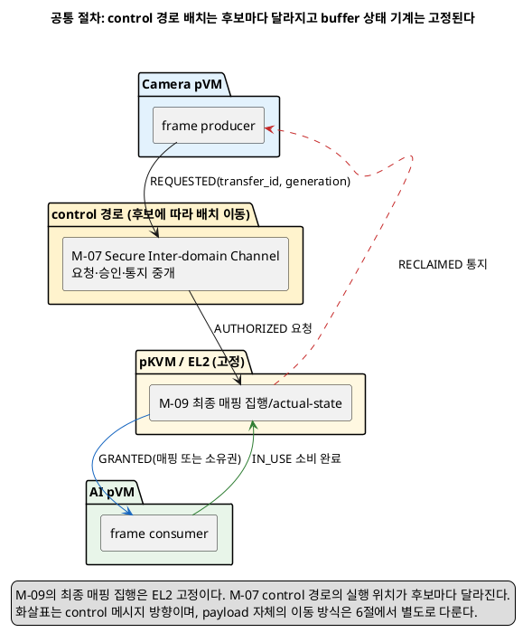
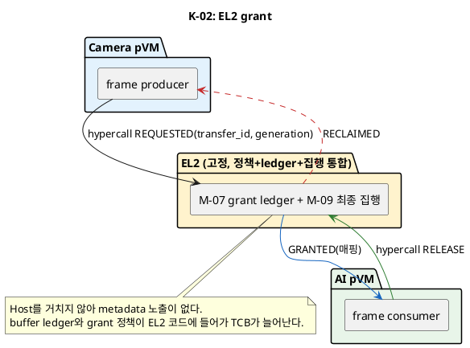

# 문제 2 재정의: Camera pVM → AI pVM 대용량 frame 전달 설계 공간

## 1. 상태와 문서 목적

- 상태: **후보 작성**
- 성격: 하나의 Decision Point가 아니라, 여러 Decision Point로 나누기 전의 설계 공간 조사 문서
- 최종 결정: **없음**

이 문서는 다음 자료를 기준으로 문제 2를 다시 정의한다.

- [시스템 개요](../docs/01_시스템_개요.md)
- [설계 범위와 모듈](../docs/02_설계_범위_모듈.md)
- [후보 구조 및 Decision Point 작성·평가 통합 규칙](../docs/후보구조_작성규칙.md)
- [문제 1 재정의: Camera/AI 단일-context HW 설계 공간](문제1_Camera_AI_단일컨텍스트HW_배타공유_설계공간.md)은 M-08/M-09 경계 정의만 공통 전제로 재사용한다. 문제 1이 다루는 HW register/DMA 배타 사용권 자체는 이 문서에서 다시 결정하지 않는다.

`docs-align`의 기존 문제 2 답안(`후보구조_문제2_pVM간_데이터전달.md`, `품질위협_문제2_pVM간_데이터전달.md`와 관련 슬라이드/인포그래픽)은 이 문서를 쓰는 동안 열거나 참고하지 않았다. `old/` 디렉터리도 참고하지 않았다. 아래 내용은 시스템 개요·설계 범위 모듈과 일반 가상화/버퍼 공유 기술 지식만으로 독립적으로 도출했다.

작성 규칙은 한 Decision Point에 후보 두 개를 요구한다. 이번 조사는 후보 수를 제한하지 않고 가능한 구조를 먼저 펼치는 것이 목표다. 이 문서에서는 구조를 모두 나열한 뒤, 마지막에 **한 가지 구조 결정만 달라지는 후보 쌍**으로 나눈다. 정식 Decision Point 문서를 만들 때는 각 쌍을 별도 파일로 옮겨 후보 두 개만 비교해야 한다.

## 2. 이번 문서의 고정 전제

[시스템 개요](../docs/01_시스템_개요.md) 4.1·4.3절의 다음 제약은 이번 조사에서 바꾸지 않는다.

1. **Host 비신뢰**: Host Application과 Linux kernel이 침해된 상황을 가정한다. Host가 중계하는 요청, 완료 통지나 매핑 상태는 단독 보안 근거가 아니다.
2. **작은 EL2 TCB**: EL2 extension이 필요한 후보는 platform owner 확인과 feasibility 검증을 통과해야 한다.
3. **현재 2-domain topology**: Camera pVM에서 AI pVM으로 가는 한 방향 파이프라인만 다룬다. N-domain fan-in/fan-out은 범위 밖이다.
4. **불필요한 payload copy 회피**: data path는 frame 원본, 중간 결과와 관련 buffer를 불필요하게 복사하지 않아야 한다. 이 문서는 이 조건을 각 data path 후보의 1급 판정 기준으로 쓴다.
5. **generation binding**: [설계 범위와 모듈](../docs/02_설계_범위_모듈.md) M-07은 `pVM 간 또는 pVM/Host 간 frame의 request ingress, endpoint, grant, logical lease, buffer ownership, mapping lifetime, join, timeout과 reclaim`을 명시한다. 이 문서에서 buffer/frame의 소유권과 매핑 수명은 요청자의 pVM identity와 generation에 결합하며, 같은 pVM ID의 새 generation은 이전 generation이 보유하던 buffer 매핑이나 lease를 이어받지 않는다.
6. **문제 1과의 경계**: Camera/AI HW 자체의 register/DMA 배타 사용권(누가 HW를 켜고 끄는지)은 문제 1의 범위다. 이 문서는 Camera pVM이 이미 만든 frame(HW가 채운 buffer)을 AI pVM에게 어떻게 넘길지만 다룬다. 두 문제는 같은 buffer가 HW DMA 대상이면서 동시에 도메인 간 전달 대상일 수 있어 실제 구현에서는 맞물리지만, 이 문서는 전달 경로(control path)와 payload 이동 방식(data path)만 독립적으로 조사한다.

이 전제 아래에서 다음 참여 주체를 사용한다. 실행 위치는 [설계 범위와 모듈](../docs/02_설계_범위_모듈.md) 4.1절의 배치를 따른다.

| 주체 | 실행 위치 | 역할 |
|---|---|---|
| Camera pVM | pVM EL0/EL1 | frame을 만드는 producer다. buffer의 최초 소유자다. |
| AI pVM | pVM EL0/EL1 | frame을 소비하는 consumer다. 추론 뒤 원본 frame을 회수 대상으로 돌려주거나 폐기한다. |
| M-07 Secure Inter-domain Channel | 후보에 따라 EL2, Host EL1 relay 또는 protected service pVM | request ingress, endpoint, grant, logical lease, buffer ownership, mapping lifetime, join, timeout, reclaim을 관리한다. |
| M-09 DMA/S2MPU Isolation Controller | EL2(항상 고정) | Stage-2/S2MPU 매핑 변경의 최종 집행과 actual-state 확인을 담당한다. |
| M-06 Protected Policy Authority | 후보에 따라 EL2 또는 protected service pVM | Camera pVM→AI pVM 전달이 허가된 요청인지 판정한다. 이 문서는 판정 결과를 입력으로만 쓴다. |

## 3. 문제 재정의

### 3.1 현재 문제가 아닌 것

- 문제는 Camera/AI HW의 배타 사용권을 정하는 것이 아니다. 그것은 문제 1이다.
- 문제는 frame을 압축하거나 포맷을 바꾸는 것이 아니다. 원본 또는 처리된 frame을 **그대로** 도메인 경계 너머로 옮기는 문제다.
- 문제는 무제한 대역폭을 가정하고 성능을 극대화하는 것이 아니다. Embedded SoC의 memory 대역폭과 CPU는 유한하므로, 복사를 줄이는 방향과 신뢰 경계를 지키는 방향 사이의 구조적 선택이 핵심이다.
- 문제는 두 pVM이 같은 물리 메모리를 영구히 공유하는 것이 아니다. 소유권과 접근권은 pVM generation에 결합된 임시 상태이며 회수 가능해야 한다.

### 3.2 새 문제 정의

> Camera pVM이 만든 대용량 frame을 비신뢰 Host를 거치거나 거치지 않고 AI pVM에 전달해야 한다. 전달은 원본 payload를 불필요하게 복사하지 않아야 하고, Host가 요청·완료 통지나 buffer 위치표를 바꾸거나 지연시켜도 두 도메인 중 하나가 잘못된 buffer를 신뢰하지 않아야 한다. 이를 위해 전달을 시작·승인·완료하는 control 경로를 어느 실행 경계에 둘지, 그리고 payload 자체를 어떤 메모리 조작 방식으로 옮길지를 정해야 한다.

**문제의 조건**

- Camera pVM이 만든 frame을 AI pVM이 사용할 수 있어야 한다.
- payload 복사는 불필요하게 발생하지 않아야 한다.
- Host의 요청 중계, 완료 통지, buffer 위치표 조작이 잘못된 전달로 이어지지 않아야 한다.
- buffer 소유권과 매핑은 pVM generation에 결합되어야 하며, 장애·종료 뒤 회수 가능해야 한다.

**실제 문제**

- control 경로(요청·승인·완료 통지)를 어느 실행 경계에 둘지 정해야 한다.
- data 경로(payload 자체의 이동 방식)를 정해야 한다.

### 3.3 품질 충돌

| 선택 | 좋아지는 점 | 부담되는 점 |
|---|---|---|
| Host가 control 메시지를 중계 | 기존 Host 스케줄링·오류 처리 자산을 재사용할 수 있다. | 요청·완료 metadata(크기, 시각, endpoint)가 Host에 보인다. relay 실패·지연·고갈 경로가 생긴다. |
| EL2가 control을 직접 grant | Host를 거치지 않아 신뢰 경로가 짧다. | grant 정책과 buffer ledger가 EL2 TCB에 들어간다. |
| protected service pVM이 control을 중개 | EL2 TCB를 늘리지 않고 buffer ledger·정책을 분리할 수 있다. | 두 pVM과 service pVM 사이 왕복(IPC)이 추가된다. |
| pVM끼리 direct channel로 협상 | 중개자 왕복이 줄어든다. | 두 pVM이 서로를 신뢰해야 하는 관계가 새로 생기고, 사전 등록·채널 설정이 필요하다. |
| shared pages(매핑 공유) | zero-copy이며 매핑 재구성 비용이 낮다. | 두 도메인이 동시에 접근 가능한 구간이 생겨 동시 쓰기·읽기 충돌 방지가 필요하다. |
| ownership transfer(매핑 이전) | 소유권이 겹치지 않아 동시 접근 문제가 없다. | 매 전달마다 Stage-2 재구성 비용이 든다. |
| pre-registered pool | 반복 전달의 매핑 협상 비용을 줄인다. | 초기 슬롯 수만큼 고정 메모리를 예약해야 한다. |
| bounce buffer | 신뢰 경계가 중간에서 최소 검증을 할 수 있다. | 물리적 복사가 최소 한 번 발생해 no-copy 조건과 부딪힌다. |
| encrypted relay(Host 경유, 암호화) | Host를 완전히 배제하지 못하는 배치 제약에서도 기밀성을 지킨다. | 암호화·복호화 비용과 Host 경유 복사가 함께 든다. |
| device-to-device P2P DMA | CPU/Host 개입과 복사가 가장 적다. | HW/IOMMU의 P2P 경로 지원 여부와 신뢰 경계 강제 방법을 확인해야 한다. |

## 4. 모든 후보가 지켜야 하는 공통 절차

### 4.1 buffer/frame 수명 상태 기계

모든 후보는 전달 대상 buffer의 상태를 다음 순서로만 바꿀 수 있다.

```text
UNASSIGNED(Camera pVM 전용, 아직 전달 요청 없음)
  → REQUESTED(Camera pVM이 전달 요청, control 경로로 전달)
  → AUTHORIZED(M-06 정책 판정 통과, 대상 endpoint 확정)
  → GRANTED(AI pVM에 접근권 또는 소유권 부여, data path 방식에 따라 공유 또는 이전)
  → IN_USE(AI pVM 소비 중)
  → RELEASE_REQUESTED(AI pVM 소비 완료 또는 timeout)
  → RECLAIMED(Camera pVM 또는 pool로 회수, 다음 재사용 가능)
```

- `GRANTED` 전에는 AI pVM이 해당 buffer의 어떤 매핑도 갖지 않는다.
- `RECLAIMED` 완료는 actual-state 증거(M-09가 확인한 실제 Stage-2/매핑 상태)로 판정하며, Host가 보고한 완료 표시만으로 다음 상태로 넘어가지 않는다.
- 강제 회수(장애, timeout)는 `GRANTED`/`IN_USE`의 어느 시점에서도 `RELEASE_REQUESTED`로 진입할 수 있다.
- buffer의 `owner generation`은 `REQUESTED` 시점의 Camera pVM generation과 `GRANTED` 시점의 AI pVM generation에 결합된다. 둘 중 하나라도 이후 generation이 바뀌면 해당 buffer는 자동으로 무효화되고 재사용 전에 `RECLAIMED`를 거쳐야 한다.

### 4.2 control 경로와 data 경로의 join 문제

control 메시지(요청, 승인, 완료 통지)와 data 자체(buffer 내용)가 서로 다른 실행 경계를 지날 수 있다. 두 경로가 분리되면 다음 위험이 생긴다.

- 비신뢰 Host가 control 메시지의 순서를 바꾸거나 지연시켜, 오래된 승인이 새 buffer에 잘못 결합될 수 있다(순서 역전).
- 한쪽 경로만 도착하고 다른 쪽은 도착하지 않을 수 있다(편측 도착).

모든 후보는 control 메시지에 **buffer/frame 고유 식별자(transfer_id)와 owner generation**을 포함해야 하고, `GRANTED` 판정 주체(EL2 또는 service pVM)가 이 식별자와 실제 buffer의 actual-state를 대조한 뒤에만 접근권을 부여해야 한다. Host가 이 대조를 대신할 수 없다.

### 4.3 공통 배치



## 5. control 경로의 전체 후보

### 5.1 빠른 판정표

| 번호 | 경로 구조 | Host 개입 | 현재 판정 |
|---|---|---|---|
| K-01 | Host relay: Host가 요청·승인·완료 메시지를 중계, 최종 판정은 EL2 | 있음(메시지 중계만) | 조건부: metadata 노출 gate 확인 필요 |
| K-02 | EL2 grant: pVM이 EL2에 직접 hypercall, EL2가 정책 판정과 최종 집행을 모두 수행 | 없음 | 기본 조건과 맞음, EL2 TCB 증가 확인 필요 |
| K-03 | protected service pVM broker: service pVM이 정책·ledger를 갖고 중개, EL2가 최종 집행 재확인 | 없음 | 기본 조건과 맞음, IPC 비용 확인 필요 |
| K-04 | direct pVM channel: 두 pVM이 사전 등록된 protected 채널로 직접 협상, EL2는 양쪽 동의만 대조 후 집행 | 없음 | 조건부: 채널 사전 등록·상호 인증 방식 확인 필요 |
| K-05 | Host가 grant까지 직접 판정 | 있음(판정까지) | Host 비신뢰 조건 위반으로 제외 |
| K-06 | TEE가 buffer ownership을 중개 | 없음 | TEE 자원·목적 범위 위반으로 제외 |

### 5.2 K-01: Host relay

Camera pVM과 AI pVM은 서로를 직접 호출하지 않고 Host의 relay 프로세스를 거쳐 요청·승인·완료 메시지를 주고받는다. 실제 buffer 소유권/매핑 변경의 최종 판정은 EL2(M-09)가 하며, Host는 메시지를 옮기기만 한다.

- 장점: 기존 Host 기반 IPC/스케줄링 자산을 재사용할 수 있고, 두 pVM이 서로의 존재를 몰라도 된다.
- 단점: 요청 크기, 시각, endpoint 식별자 같은 metadata가 Host에 노출된다. Host가 메시지를 지연·순서 역전시키면 4.2의 join 문제가 발생하므로 transfer_id 대조가 필수다. relay 프로세스 장애가 곧 전달 실패로 이어진다.

### 5.3 K-02: EL2 grant

pVM이 EL2에 직접 hypercall로 전달 요청을 보낸다. EL2가 M-06 정책 결과를 확인하고, buffer ledger(어느 buffer가 어느 owner generation에 속하는지)를 직접 관리하며 Stage-2 매핑을 변경한다. Xen의 grant table과 같은 계열이다.



장점은 Host를 완전히 배제해 metadata 노출이 없고 홉이 가장 적다는 점이다. 단점은 buffer ledger(어느 generation이 어느 buffer를 갖는지 추적하는 상태)까지 EL2에 상주해 `작은 EL2 TCB` 원칙과 부딪힌다는 점이다.

### 5.4 K-03: protected service pVM broker

verified service pVM이 M-07(요청 ingress, buffer ledger, timeout, reclaim 정책)을 전담한다. Camera pVM과 AI pVM은 protected 통신으로 service pVM에 요청을 보내고, service pVM은 M-06 결과를 확인해 승인 여부를 정한 뒤 EL2(M-09)에 최종 매핑 변경만 요청한다. EL2는 요청을 그대로 집행하지 않고 transfer_id와 generation을 재확인한다.

장점은 EL2 TCB를 늘리지 않으면서 K-02보다 정교한 정책(예: 여러 buffer의 pool 관리, QoS)을 안전 경계 안에 둘 수 있다는 점이다. 단점은 Camera pVM→service pVM→EL2, service pVM→AI pVM 왕복이 K-02보다 홉이 많고, service pVM이 단일 장애점이 될 수 있다는 점이다.

### 5.5 K-04: direct pVM channel

Camera pVM과 AI pVM이 사전 등록된 protected point-to-point 채널(예: Arm FF-A partition message류 프로토콜)로 서로 직접 요청·승인을 협상한다. 중개자(Host, service pVM)는 채널 설정 이후의 매 전달에는 관여하지 않는다. 실제 Stage-2 매핑 변경은 여전히 EL2 권한이 필요하므로, 두 pVM이 합의한 handoff를 각자 독립적으로 EL2에 hypercall로 알리고 EL2가 양쪽 동의를 대조한 뒤 집행한다.

- 장점: 정상 전달 경로에서 중개자 왕복이 없어 지연이 가장 낮을 가능성이 있다.
- 단점: 두 pVM이 서로의 identity/generation을 신뢰해야 하는 새로운 관계가 생긴다. 채널을 사전에 어떻게 등록하고 상호 인증할지, Camera pVM 재생성 뒤 채널을 어떻게 재확립할지는 별도 확인이 필요하다. K-02와 달리 정책(누가 언제 전달을 허용하는지)이 EL2에 없으므로, 정책 위반(예: 허가되지 않은 크기·빈도의 전달)을 막을 별도 gate가 필요하다.

### 5.6 K-05: Host가 grant까지 직접 판정 (제외)

Host가 buffer ownership 이전의 최종 판정자면 Host 침해 시 위조된 승인으로 다른 도메인이 아직 쓰고 있는 buffer를 빼앗거나, 회수되지 않은 buffer의 소유권을 거짓으로 이전할 수 있다. `Host 비신뢰` 조건을 정면으로 어기므로 비교 기준선으로만 남긴다.

### 5.7 K-06: TEE가 buffer ownership을 중개 (제외)

TEE는 대용량 frame buffer의 위치표나 실시간 전달 빈도를 다루도록 설계된 자원을 갖지 않는다. [시스템 개요](../docs/01_시스템_개요.md) 4.2절은 TEE 메모리가 작고 대용량 자료 상주를 금지한다고 명시한다. frame 단위 전달마다 TEE 호출을 거치면 GlobalPlatform SMC 경로 지연이 프레임 예산을 잠식한다. 비교 기준선으로만 남긴다.

## 6. DMA-BUF data path의 전체 후보

이 절의 후보는 5절의 control 경로와 독립적으로 조합할 수 있는 **payload 이동 방식** 축이다. Linux `dma-buf` 프레임워크의 exporter/importer, attach/map, fence 모델을 공통 어휘로 사용한다.

### 6.1 빠른 판정표

| 번호 | data path | payload 복사 발생 | 현재 판정 |
|---|---|---|---|
| D-01 | 복사(explicit copy) | 있음(전체 payload) | no-copy 조건 위반으로 조건부 후보(호환성 목적 한정) |
| D-02 | shared pages(동시 매핑, 권한만 구분) | 없음 | 기본 조건과 맞음, 동시 접근 fence 확인 필요 |
| D-03 | ownership transfer(매핑 이전, unmap 후 재map) | 없음 | 기본 조건과 맞음 |
| D-04 | pre-registered pool(고정 슬롯 lease) | 없음(슬롯 안에서) | 기본 조건과 맞음 |
| D-05 | bounce buffer(신뢰 경계 소유 중간 buffer 경유) | 있음(최소 1회) | 조건부: no-copy 예외 정당화 필요 |
| D-06 | encrypted relay(Host 경유, 암호화된 상태로) | 있음(Host 경유 복사) | 조건부: Host relay(K-01)와 결합 시에만 의미 |
| D-07 | device-to-device/P2P DMA(Camera HW→AI HW 직접) | 없음(Host/CPU 미개입) | 조건부: IOMMU/S2MPU의 P2P 경로 지원 확인 필요, 문제 1과 상호작용 |

### 6.2 D-01: 복사 (조건부)

Camera pVM이 자기 buffer의 내용을 읽어 새 buffer에 쓰고, 그 buffer를 AI pVM에 전달한다. 가장 단순하고 신뢰 경계 설계가 쉽지만, `data path의 불필요한 payload copy를 피한다`는 4.1절 성능 제약을 정면으로 어긴다. Camera/AI frame처럼 대용량·고빈도 데이터에는 이 방식을 기본 후보로 두지 않는다. 다만 zero-copy 후보(D-02~D-04, D-07)가 모두 feasibility 확인에 실패할 때의 fallback으로만 조건부 후보로 남긴다.

### 6.3 D-02: shared pages

같은 물리 페이지를 Camera pVM과 AI pVM의 Stage-2에 동시에 매핑하되, 권한(read/write)을 도메인별로 다르게 설정한다(예: Camera는 쓰기 완료 뒤 read-only로 전환, AI는 read-only로 매핑). 매핑 자체는 유지한 채 권한만 바꾸므로 재매핑보다 가볍다.

- 두 도메인이 물리적으로 같은 페이지를 동시에 볼 수 있는 구간이 존재하므로, `IN_USE` 진입 전에 Camera pVM의 쓰기 권한을 반드시 회수해야 한다(안 그러면 AI pVM이 읽는 도중 내용이 바뀔 수 있다). 이 권한 전환은 EL2(M-09)가 최종 집행해야 한다.
- fence(동기화 신호, `dma-fence`류)가 없으면 AI pVM이 아직 쓰는 중인 frame을 읽을 수 있다.

### 6.4 D-03: ownership transfer

Camera pVM의 Stage-2 매핑을 완전히 회수(`unmap`)한 뒤 AI pVM의 Stage-2에 새로 매핑(`map`)한다. Arm FF-A의 `MEM_DONATE`/`MEM_LEND` 같은 파티션 간 메모리 이전 계열이다. 소유권이 한 번에 한 도메인에만 있으므로 동시 접근 문제가 원천적으로 없다.

- 매 전달마다 Stage-2 재구성(unmap+map) 비용이 든다. 이 비용은 D-02의 권한 전환보다 클 수 있다.
- 회수(`RECLAIMED`)까지 명확히 완료해야 Camera pVM이 같은 buffer를 재사용할 수 있다.

### 6.5 D-04: pre-registered pool

여러 buffer 슬롯을 미리 등록(초기 부팅 시 또는 pipeline 시작 시 한 번 매핑 협상)해 두고, 매 frame 전달마다 슬롯 인덱스와 `IN_USE`/`RECLAIMED` 상태만 주고받는다. D-02(shared pages) 또는 D-03(ownership transfer) 중 어느 매핑 방식을 슬롯 안에서 쓸지는 별도로 정한다.

- 반복 전달의 매핑 협상 비용을 크게 줄인다. 30fps 파이프라인처럼 같은 형태의 buffer가 반복되는 경우에 적합하다.
- 슬롯 수만큼 고정 메모리를 미리 예약해야 하고, Embedded SoC의 유한한 memory 제약([시스템 개요](../docs/01_시스템_개요.md) 4.2절)과 슬롯 수를 맞춰야 한다.
- 슬롯 재사용 시에도 4.1의 owner generation 결합을 지켜야 한다. 슬롯 자체는 재사용되지만 슬롯 안 buffer의 논리 소유권은 매번 새로 결합된다.

### 6.6 D-05: bounce buffer (조건부)

신뢰 경계(EL2 또는 protected service pVM)가 소유한 중간 buffer를 거쳐 전달한다. Camera pVM이 중간 buffer에 쓰고, 신뢰 경계가 최소 검증(크기, 형식 확인)을 한 뒤 AI pVM에 매핑을 넘긴다.

- 물리적 복사가 최소 한 번 발생하므로 no-copy 조건과 부딪힌다. Camera pVM과 AI pVM을 서로 신뢰하지 못하게 격리해야 하는 이유(예: 서로 다른 신뢰 수준의 Workload를 같은 파이프라인에 넣는 경우)가 있을 때만 이 비용을 정당화할 수 있다. 이번 2-domain 고정 파이프라인에서는 Camera pVM과 AI pVM이 이미 같은 신뢰 수준(검증된 Workload)이므로, 현재 조건에서는 정당화 근거가 약하다.

### 6.7 D-06: encrypted relay (조건부)

K-01(Host relay)과 짝을 이루는 data path다. Host가 물리적으로 payload를 옮기지만, payload는 암호화되어 있어 Host가 내용을 볼 수 없다. 키는 EL2 또는 TEE가 관리한다.

- Host 경유 복사가 발생하므로 no-copy 조건과 부딪힌다. control 경로가 K-01(Host relay)일 수밖에 없는 배치 제약이 있을 때만 의미가 있는 후보다. K-02/K-03/K-04(Host 미개입 control 경로)를 고르면 D-06은 불필요하다.
- 암호화·복호화 비용이 frame 크기에 비례해 늘어나므로 30fps 예산에 미치는 영향을 측정해야 한다.

### 6.8 D-07: device-to-device/P2P DMA (조건부)

Camera ISP의 DMA 엔진이 CPU/Host를 거치지 않고 AI 가속기가 매핑한 메모리 영역에 직접 쓴다. Linux의 PCIe peer-to-peer DMA(P2PDMA) 서브시스템과 같은 계열이다.

- Host/CPU 개입과 복사가 가장 적다.
- 이 SoC의 IOMMU/S2MPU가 device-to-device 경로에도 격리를 강제할 수 있는지 확인이 필요하다. 강제할 수 없다면 Camera ISP가 임의의 물리 주소에 쓸 수 있게 되어 격리 조건을 어긴다.
- 문제 1과 상호작용한다. Camera ISP가 AI 가속기의 메모리 영역에 쓰려면, 그 시점에 AI 가속기(또는 그 메모리 영역)에 대한 접근권 배치가 문제 1의 HW 배타 사용권 결정과 맞물릴 수 있다. 이 상호작용의 구체 설계는 이 문서의 범위를 벗어나며, 문제 1의 배치 결정 뒤 재확인이 필요하다.

## 7. control 경로 x data path 조합 가능 범위

5절의 control 경로(K-01~K-04, 유효 후보만)와 6절의 data path(D-02~D-04, D-07, 유효 후보만) 조합은 4×4=16개다. D-01(복사)과 D-06(encrypted relay)은 조건부 후보이므로 별도로 표기한다.

| control \ data | D-02 shared pages | D-03 ownership transfer | D-04 pre-registered pool | D-07 P2P DMA |
|---|---|---|---|---|
| K-01 Host relay | 가능(metadata 노출은 K-01 자체 문제) | 가능 | 가능 | 조건부(P2P 설정 승인은 어느 경로로도 가능하나 데이터는 Host를 거치지 않음) |
| K-02 EL2 grant | 가능 | 가능 | 가능 | 가능(EL2가 P2P 매핑도 최종 집행) |
| K-03 service pVM broker | 가능 | 가능 | 가능성 있음(슬롯 ledger를 service pVM이 소유) | 가능성 있음 |
| K-04 direct pVM channel | 가능 | 가능 | 가능성 있음 | 가능성 있음(두 HW가 직접 협상 채널과 별개로 P2P 경로 설정) |

D-06(encrypted relay)은 K-01과만 결합할 때 의미가 있다. D-01(복사)은 어떤 control 경로와도 결합할 수 있지만 이번 조사의 기본 후보로 삼지 않는다.

## 8. K-03 + D-04 구조의 구체적인 동작

대표로 K-03(protected service pVM broker)과 D-04(pre-registered pool, 슬롯 내부는 D-03 ownership transfer 방식)를 결합한 구조의 정상·전환·실패 흐름을 적는다.

### 8.1 pool 초기화 (pipeline 시작 시 1회)

1. service pVM이 Camera pVM·AI pVM과 함께 N개의 buffer 슬롯을 협상하고, 각 슬롯을 초기에는 `UNASSIGNED`로 Camera pVM에 매핑한다.
2. EL2(M-09)가 각 슬롯의 매핑을 Camera pVM generation에 결합해 기록한다.

### 8.2 정상 전달

1. Camera pVM이 슬롯에 frame을 다 쓰면 service pVM에 `REQUESTED(slot_id, transfer_id, generation)`를 보낸다.
2. service pVM이 M-06 정책을 확인하고 `AUTHORIZED`로 표시한 뒤 EL2에 슬롯의 소유권 이전을 요청한다.
3. EL2가 Camera pVM generation을 재확인하고 해당 슬롯을 `unmap`한 뒤 AI pVM generation에 `map`한다(`GRANTED`).
4. EL2가 actual-state 증거와 함께 완료를 service pVM에 알리고, service pVM이 AI pVM에 통지한다.
5. AI pVM이 소비를 마치면(`IN_USE`→`RELEASE_REQUESTED`) service pVM에 알리고, service pVM이 EL2에 회수를 요청한다.
6. EL2가 슬롯을 `unmap`한 뒤 Camera pVM generation에 다시 `map`한다(`RECLAIMED`). 다음 frame에 재사용 가능하다.

### 8.3 Host의 metadata 관찰·간섭 시도

- K-03은 Host를 control 경로에서 배제하므로 Host는 요청·승인 metadata를 볼 수 없다.
- Host가 물리 메모리 타이밍이나 인터럽트 패턴으로 slot 전환을 추정하려는 side-channel 시도는 이 구조만으로 막지 못한다. 별도 확인이 필요하다.

### 8.4 장애 처리

1. Camera pVM crash: service pVM이 pVM lifecycle 통지 또는 자체 timeout으로 감지하면, EL2에 해당 generation이 소유한 모든 슬롯의 강제 회수를 요청한다. `IN_USE` 상태의 슬롯도 정책에 따라 즉시 회수하거나 AI pVM의 소비 완료까지 대기한 뒤 회수한다(정책은 이 문서의 범위 밖).
2. AI pVM crash: 소비 중이던 슬롯은 강제로 `RECLAIMED`되어 Camera pVM에 돌아가며, 미완성 결과는 폐기한다.
3. service pVM crash: 이미 `GRANTED`된 슬롯은 EL2가 유지하되, 새 전달 요청은 service pVM 복구와 actual-state 재확인 전까지 보류한다.

### 8.5 모듈 사이 책임 경계

| 실행 위치 | 모듈 | 해야 하는 일 | 하면 안 되는 일 |
|---|---|---|---|
| Camera pVM | frame producer | 슬롯에 쓰기, 완료 요청 | AI pVM 매핑을 직접 만들기 |
| verified service pVM | M-07 broker | 요청 검증, 슬롯 ledger, timeout·정책 | Stage-2 직접 조작 |
| EL2 | M-09 최종 집행 | unmap/map, generation 재확인, actual-state 확인, 강제 회수 | 정책·ledger 결정 |
| AI pVM | frame consumer | 소비, 완료/폐기 통지 | 회수되지 않은 슬롯을 계속 점유 |

## 9. 의미 있는 후보 구조 쌍

### 9.1 control 경로 쌍

| 쌍 | 후보 A | 후보 B | 하나만 바뀌는 결정 |
|---|---|---|---|
| D-101 | K-01 Host relay | K-02 EL2 grant | control 메시지를 Host가 중계할지 EL2에 직접 보낼지 |
| D-102 | K-02 EL2 grant | K-03 protected service pVM broker | grant 정책·ledger를 EL2 TCB에 둘지 별도 service pVM에 둘지 |
| D-103 | K-03 protected service pVM broker | K-04 direct pVM channel | 정책 판정을 공용 중개자에 둘지 두 pVM의 상호 협상에 둘지 |
| D-104 | K-01 Host relay | K-03 protected service pVM broker | control 경로에 비신뢰 Host를 둘지 검증된 service pVM을 둘지 |

### 9.2 data path 쌍

| 쌍 | 후보 A | 후보 B | 결정 질문 |
|---|---|---|---|
| D-105 | D-02 shared pages | D-03 ownership transfer | 두 도메인이 동시에 매핑을 유지할지, 매핑 자체를 이전할지 |
| D-106 | D-03 ownership transfer(매 전달마다 재협상) | D-04 pre-registered pool(슬롯 재사용) | 매 전달마다 매핑을 새로 협상할지, 미리 등록한 슬롯을 재사용할지 |
| D-107 | D-03 ownership transfer(EL2/service pVM 경유) | D-07 device-to-device P2P DMA | payload가 control 경로의 최종 집행자를 거쳐 매핑될지, HW끼리 직접 DMA할지 |

D-107의 후보 B는 이 SoC의 IOMMU/S2MPU가 P2P 격리를 지원하는지 확인되기 전에는 조건부 후보로만 남긴다.

### 9.3 넓게 비교할 대표 쌍

K-02(EL2 grant) + D-03(ownership transfer)과 K-03(service pVM broker) + D-04(pre-registered pool)는 이번 조건에서 가장 넓게 비교할 수 있는 대표 쌍이다. 이 쌍은 control 경로 배치와 data path 재사용 방식이 함께 달라지므로, 정식 Decision Point로 만들 때는 D-102와 D-106으로 나누는 편이 규칙에 맞는다.

## 10. 품질속성 방향 비교

실측값과 승인된 기준이 없으므로 별점과 총점은 매기지 않는다.

| 후보 | 보안 조건 | 전달 성능 방향 | 변경 용이성 방향 | 메모리/TCB 자원 | 장애 영향 |
|---|---|---|---|---|---|
| K-01 Host relay | 조건부(metadata 노출 확인 필요) | 홉이 짧지만 metadata 경로 부담 | 기존 Host IPC 재사용 가능 | 추가 EL2 상태 없음 | Host relay 장애가 전달 전체를 막을 수 있음 |
| K-02 EL2 grant | 충족 가능 | 홉이 가장 적어 유리할 가능성 | EL2 코드 변경이 가장 크다 | EL2 TCB 증가폭이 크다 | EL2 오류가 모든 전달에 영향 |
| K-03 service pVM broker | 충족 가능 | service pVM 왕복이 추가 홉 | 정책 변경을 EL2 밖에서 처리 | EL2 TCB 증가 없음, service pVM 자원 필요 | service pVM 장애가 새 전달을 막을 수 있음 |
| K-04 direct pVM channel | 조건부(상호 인증 확인 필요) | 중개자 왕복 없음 | 채널 등록·인증 로직이 새로 필요 | 채널별 상태 추가 | 한 pVM 장애가 채널 상대에게 직접 영향 |
| D-02 shared pages | 조건부(fence 확인 필요) | 재매핑 없이 권한만 전환, 유리 | 권한 전환 로직만 필요 | 추가 메모리 없음 | 동시 접근 결함 시 데이터 손상 위험 |
| D-03 ownership transfer | 충족 가능 | 재매핑 비용마다 발생 | Stage-2 unmap/map 로직 필요 | 추가 메모리 없음 | 소유권 단일화로 결함 격리 쉬움 |
| D-04 pre-registered pool | 충족 가능 | 반복 전달에서 가장 유리 | 슬롯 관리 로직 필요 | 슬롯 수만큼 고정 메모리 예약 | 슬롯 고갈 시 전달 지연 |
| D-07 P2P DMA | 조건부(HW/IOMMU 지원 확인 필요) | CPU 개입 없어 가장 유리할 가능성 | HW 종속적 구현 필요 | 추가 메모리 없음 | IOMMU 미지원 시 격리 전체가 무너질 위험 |

## 11. 알려진 방식과 이번 설계에 주는 근거

### 11.1 공식 문서/표준

| 자료 | 확인한 사실 | 이번 설계에서의 사용 범위 |
|---|---|---|
| [Linux dma-buf](https://docs.kernel.org/driver-api/dma-buf.html) | exporter/importer, attach/map, `dma-fence` 기반 producer-consumer 동기화를 표준화한 버퍼 공유 프레임워크다. | 6절 data path 후보 전체의 공통 어휘와 D-02(shared pages)의 fence 필요성 근거다. |
| [Xen grant table](https://xenbits.xen.org/docs/unstable/misc/grant-tables.html) | 한 VM이 다른 VM에게 특정 페이지의 접근권을 명시적으로 부여·회수하는 하이퍼바이저 중개 메커니즘이다. | K-02(EL2 grant)의 구조적 선례다. |
| [Arm Firmware Framework for Arm (FF-A)](https://developer.arm.com/documentation/den0077/latest/) | 파티션(격리된 실행 환경) 간 `MEM_SHARE`/`MEM_LEND`/`MEM_DONATE` 메모리 관리 트랜잭션과 파티션 메시지 프로토콜을 정의한다. | D-02/D-03의 공식 메시지 계약 선례이며, K-04(direct pVM channel)의 파티션 간 직접 메시지 개념 근거다. |
| [Linux PCIe Peer-to-Peer DMA (P2PDMA)](https://docs.kernel.org/driver-api/pci/p2pdma.html) | 두 PCIe 장치가 호스트 메모리를 거치지 않고 서로의 메모리 영역에 직접 DMA하는 커널 서브시스템이다. | D-07(device-to-device/P2P DMA)의 구조적 선례다. 이 SoC의 Camera/AI IP가 PCIe 기반이 아니면 직접 재사용은 아니다. |
| [QEMU ivshmem (Inter-VM shared memory device)](https://www.qemu.org/docs/master/system/devices/ivshmem.html) | VM 간 공유 메모리를 제공하지만 접근 제어나 소유권 이전 프로토콜은 스스로 강제하지 않는다고 문서화되어 있다. | shared pages를 무제약으로 열면 안 된다는 반례다. D-02는 반드시 권한 전환과 fence를 EL2가 강제해야 한다는 근거로 쓴다. |
| [virtio 1.4](https://docs.oasis-open.org/virtio/virtio/v1.4/virtio-v1.4.pdf) | virtio 장치 모델은 큐 기반 비동기 전달과 shared ring을 표준화한다. | K-03/K-04의 큐 기반 요청 전달과 D-04(pre-registered pool)의 슬롯/ring 모델 근거다. |

### 11.2 논문

| 논문 | 확인한 내용 | 이번 설계에서의 사용 범위 |
|---|---|---|
| [ReZone, USENIX Security 2022](https://www.usenix.org/conference/usenixsecurity22/presentation/cerdeira) | 신뢰 경계 호출과 실행 영역 전환 비용을 측정하며, 짧은 작업을 자주 호출하면 부담이 커질 수 있음을 보인다. | K-02/K-03/K-04의 홉 수 차이가 실제 성능에 미치는 영향을 반드시 실측해야 한다는 근거다. |
| [Nimble, OSDI 2023](https://www.usenix.org/conference/osdi23/presentation/angel) | 신뢰 경계 안의 작은 상태 처리와 비신뢰 대용량 자원을 결합해 최신성을 보장하는 구조를 제시한다. | K-02/K-03에서 EL2/service pVM이 buffer ledger 같은 작은 상태만 신뢰 경계에 두고, 큰 payload는 pVM 메모리에 남기는 방향을 뒷받침한다. |
| [StrongBox, MobiSys 2022](https://dl.acm.org/doi/10.1145/3498361.3538940) | 모바일 GPU와 데이터를 TEE 신뢰 경계 안에서 안전하게 공유하는 구조를 제시한다. | 도메인 간 대용량 데이터 공유 시 신뢰 경계 강제가 필요하다는 최근 선례다. |
| [Telekine, USENIX Security 2020](https://www.usenix.org/conference/usenixsecurity20/presentation/hunt) | 가속기 데이터 전달의 타이밍 패턴이 side channel을 만들 수 있음을 분석한다. | 8.3절에서 언급한 Host의 timing 기반 slot 전환 추정 위험의 근거다. |

## 12. 검증 기준

### 12.1 공통 필수 조건

- 4.1 상태 기계의 순서 위반(단계 건너뛰기·역행): **0건**
- `GRANTED` 전 AI pVM의 buffer 접근 성공: **0건**
- Camera pVM 또는 AI pVM 어느 한쪽도 회수하지 않은 buffer가 다른 generation에 재매핑된 사례: **0건**
- Host의 control 메시지 순서 조작·지연이 잘못된 buffer 결합으로 이어진 사례: **0건**
- `no-copy` 기본 후보(D-02/D-03/D-04/D-07)에서 payload 전체를 복사한 사례: **0건**(D-01/D-05/D-06 fallback 경로는 제외)
- 동시에 쓰기 권한을 가진 도메인 수(shared pages 후보): **최대 1개**

### 12.2 반드시 측정할 항목

- control 경로별(K-01~K-04) 요청~완료까지의 지연 분포(p50/p95/p99)
- data path별(D-02~D-04, D-07) Stage-2 재구성 비용과 실제 payload 복사량
- pre-registered pool의 슬롯 수 대 지연·고갈 빈도 관계
- P2P DMA(D-07) 적용 시 IOMMU/S2MPU가 실제로 격리를 강제하는지 여부
- Host relay(K-01) 경유 시 노출되는 metadata의 실제 정보량과 side-channel 위험
- 30fps·frame 주기 33ms 예산 대비 전달 비용의 실제 소비 비율

## 13. 후보 누락 가능성과 한계

- direct pVM channel(K-04)의 사전 등록·상호 인증 구체 프로토콜은 이 문서에서 설계하지 않았다. FF-A 파티션 메시지 같은 표준을 그대로 쓸 수 있는지는 platform 확인이 필요하다.
- device-to-device P2P DMA(D-07)와 문제 1(HW 배타 사용권)의 상호작용은 이 문서에서 깊이 다루지 않았다. Camera ISP가 AI 가속기 메모리 영역에 직접 쓰려면 그 시점의 HW 소유권 배치와 맞물려야 한다.
- 이 문서는 Camera pVM 하나, AI pVM 하나의 1:1 전달만 다뤘다. 향후 여러 Camera 또는 여러 AI 인스턴스가 생기면(2-domain 확장) pool 관리와 ledger 구조를 다시 검토해야 한다.
- Host의 timing 기반 side channel(8.3, 12.2 항목) 방어는 이 문서의 범위 밖이며 별도 결정이 필요할 수 있다.
- bounce buffer(D-05)를 정당화할 수 있는 실제 시나리오(예: 서로 다른 신뢰 수준의 Workload가 같은 파이프라인에 들어오는 경우)는 이번 2-domain 고정 전제에서는 확인하지 못했다.

## 14. 정리와 다음 결정 순서

이 조사에서 유효하게 남은 control 경로 후보는 K-01, K-02, K-03, K-04다(K-05/K-06은 제외). 유효하게 남은 data path 후보는 D-02, D-03, D-04, D-07이며, D-01/D-05/D-06은 조건부 fallback으로만 남긴다.

정식 Decision Point는 다음 순서로 나누는 것이 적절하다.

1. D-101~D-104에서 control 경로 배치(Host relay/EL2 grant/service pVM broker/direct channel)를 한 변수씩 비교한다.
2. control 경로를 정한 뒤 D-105~D-106에서 data path(shared pages/ownership transfer/pre-registered pool)를 비교한다.
3. D-107(P2P DMA)은 이 SoC의 IOMMU/S2MPU P2P 지원이 확인된 뒤에만 정식 후보로 올린다.
4. control 경로와 data path가 정해지면 7절의 조합표에서 확정된 셀만 실제 구현 대상으로 남긴다.
5. 문제 1의 HW 배타 사용권 결정이 확정되면, D-107을 고른 경우에 한해 문제 1 결과와의 상호작용을 재확인한다.

K-02+D-03과 K-03+D-04는 이번 조건에서 가장 넓게 비교할 수 있는 대표 쌍이다. 정식 Decision Point로 만들 때는 D-102·D-106으로 나눠 비교한다.
