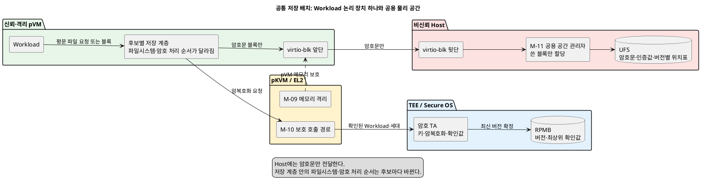

# 문제 3 재정의: virtio-blk 공용 저장 공간의 암호화 설계 공간

## 1. 상태와 문서 목적

- 상태: **후보 작성**
- 성격: 하나의 Decision Point가 아니라, 여러 Decision Point로 나누기 전의 설계 공간 조사 문서
- 최종 결정: **없음**

이 문서는 다음 자료를 기준으로 문제 3을 다시 정의한다.

- [시스템 개요](../docs/01_시스템_개요.md)
- [설계 범위와 모듈](../docs/02_설계_범위_모듈.md)
- [후보 구조 작성 규칙](후보_구조_작성_규칙.md)
- [Decision Point 작성 규칙](DP-RULE.md)
- [기존 문제 3 정의](품질위협_문제3_pVM수명_암호화파일_유실.md)는 문제 배경만 참고한다.

발표자료와 기존 후보 구조 문서는 답으로 참고하지 않았다.

후보 구조 작성 규칙은 한 Decision Point에 후보 두 개를 요구한다. 그러나 이번 요청은 후보 수를 제한하지 않고 가능한 구조를 먼저 찾는 것이다. 따라서 이 문서에서는 구조를 모두 펼쳐 놓고, 마지막에 **한 가지 결정만 달라지는 후보 쌍**을 나눈다. 실제 Decision Point 문서를 만들 때는 각 쌍을 별도 파일로 옮겨 후보 두 개만 비교해야 한다.

이 조사 문서의 그림은 공통 구조와 대표 후보 C-01·C-04만 보여 준다. 정식 Decision Point로 옮길 때는 작성 규칙에 따라 해당 후보 A와 B의 그림을 각각 같은 관점으로 추가해야 한다.

## 2. 이번 문서에서만 바꾸는 전제

[시스템 개요](../docs/01_시스템_개요.md)는 현재 기준에서 RPMB를 사용하지 않는다고 정한다. 사용자는 이번 설계에 한해 **TEE가 RPMB 기능을 제공한다**고 전제를 바꾸었다. 이 변경은 이 문서에만 적용한다. 상위 문서 전체의 기준이 바뀐 것은 아니다.

그 밖의 고정 조건은 다음과 같다.

1. 물리 저장장치는 Host가 제공한다.
2. pVM은 Host가 제공한 블록 장치를 `virtio-blk`로 연결해 마운트한다.
3. 물리 UFS 용량은 공용 공간에서 실제로 기록한 블록만 할당한다.
4. pVM이 삭제돼도 같은 Workload의 암호문은 남아야 한다.
5. 평문 암호 키와 키를 만들 수 있는 비밀값은 TEE 밖으로 내보내지 않는다.
6. Host Application과 Host Linux 커널은 비신뢰 영역이다.
7. Host가 읽을 수 있는 저장 경로와 `virtio-blk` 공유 버퍼에는 암호문만 놓인다.
8. EL2는 pVM 메모리 격리와 호출 주체 확인을 맡되, 대용량 암호 처리나 파일시스템을 맡지 않는다.
9. TEE는 키, 작은 확인 상태와 RPMB 기록을 맡는다. 큰 암호문은 UFS에 둔다.
10. 여러 pVM 세대가 같은 Workload 저장 공간을 이어 쓸 수 있지만, 한 시점의 쓰기 주체는 하나만 허용한다.

## 3. 문제 재정의

### 3.1 현재 문제가 아닌 것

문제는 pVM마다 큰 전용 볼륨 두 개를 미리 확보하고 어느 쪽에 자료를 둘지 정하는 것이 아니다. 이 방식은 Workload 수와 논리 용량이 늘어날수록 사용하지 않는 물리 공간까지 잡아 둘 수 있다.

키 보관용 저장 공간도 큰 전용 볼륨일 필요가 없다. TEE의 키와 최신 상태를 확인하는 작은 값은 RPMB에 두고, 큰 암호문과 관리 정보만 UFS 공용 공간에 둘 수 있다.

### 3.2 새 문제 정의

- 비신뢰 Host가 제공한 공용 UFS 공간을 pVM이 `virtio-blk`로 사용한다.
- pVM 세대가 바뀌어도 같은 Workload가 최신 자료를 이어 쓸 수 있어야 한다.
- 평문 키와 평문 자료가 Host에 노출되지 않아야 한다.
- Host가 자료나 위치표를 바꾸거나 이전 상태로 되돌리면 이를 알아내야 한다.
- 암호 처리를 둘 실행 위치와 저장 계층을 정해야 한다.
- EL2·TEE·Host·pVM의 책임을 나눠야 한다.

### 3.3 품질 충돌

- 암호 처리를 TEE에 모으면 키 노출 범위를 줄일 수 있다. 대신 TEE 호출 횟수, 버퍼 복사와 실행 영역 전환이 늘 수 있다.
- 암호 처리를 pVM 커널에 두면 응용프로그램을 바꾸지 않아도 된다. 대신 커널 변경 범위와 장애 영향이 커진다.
- 파일 단위로 처리하면 일부 자료만 갱신하기 쉽다. 대신 파일 크기·시간 등 일부 파일시스템 정보가 보일 수 있다.
- 블록 단위로 처리하면 파일시스템 전체를 가릴 수 있다. 대신 블록 위치표, 쓰기 순서와 비정상 종료 복구가 복잡해진다.
- RPMB에 자주 확정하면 손실 가능한 변경량이 줄어든다. 대신 RPMB 쓰기 횟수와 저장 지연이 늘 수 있다.
- 공용 물리 공간은 저장 낭비를 줄인다. 대신 Host가 관리하는 할당표를 신뢰할 수 없으므로 TEE가 확인할 수 있는 자료 목록과 최신 상태가 필요하다.

## 4. 두 개의 전용 볼륨을 없애는 공통 저장 구조

### 4.1 공통 원칙

- pVM별 물리 볼륨을 미리 두 개 확보하지 않는다.
- **안정적인 Workload 식별자마다 논리 블록 장치 하나**를 둔다.
- pVM 인스턴스가 아니라 Workload가 논리 장치의 수명을 가진다.
- 새 pVM 세대는 기존 논리 장치를 다시 연결한다.
- Host의 M-11은 UFS 공용 공간에서 기록된 블록만 할당한다.
- 갱신 중에는 바뀐 블록과 새 위치표만 새 공간에 기록한다. 전체 볼륨을 한 벌 더 만들지 않는다.
- RPMB에는 큰 자료를 넣지 않는다. 최신 버전과 자료 목록의 확인값만 넣는다.
- 이전 버전의 블록은 새 버전이 RPMB에 확정된 뒤에 회수한다.

따라서 정상 상태에서 필요한 것은 `Workload별 논리 장치 1개 + 공용 물리 블록`이다. 비정상 종료에도 이전 정상 상태를 남기려면 갱신된 블록의 이전판과 새판이 잠시 함께 존재할 수 있다. 이 추가 공간은 전체 볼륨 두 개가 아니라 **바뀐 블록 크기만큼** 필요하다.

### 4.2 Host 공용 공간의 네 가지 구현 방향

| 번호 | 공용 공간 구조 | 물리 공간 할당 | M-11이 맡을 일 | 판정 |
|---|---|---|---|---|
| P-01 | `Device Mapper thin provisioning` 공용 공간 | 쓰기가 처음 발생한 블록만 할당 | Workload별 논리 장치 생성·재연결·회수와 용량 제한 | 기본 조건과 맞음 |
| P-02 | Host 파일시스템의 희소 저장 파일(`sparse backing file`) | 실제 파일 블록이 기록될 때 할당 | Workload별 저장 파일 수명·용량 제한·`virtio-blk` 연결 | 기본 조건과 맞음 |
| P-03 | M-11 공용 블록 묶음 저장소 | M-11이 공용 블록 묶음을 Workload 논리 주소에 연결 | 위치표, 빈 공간, 회수와 `virtio-blk` 장치 제공 | 조건부: 자체 위치표 복구 검증 필요 |
| P-04 | 공용 읽기 전용 기본 이미지와 Workload별 변경 블록 | 공통 내용은 한 번만 두고 Workload가 바꾼 블록만 할당 | 기본 이미지 검증, 변경 블록 수명과 하나의 `virtio-blk` 장치로 조합 | 조건부: 같은 초기 자료를 공유할 때만 이득 |

네 구조 모두 Host가 관리하므로, Host가 보고하는 할당표 자체는 보안 판단의 근거가 될 수 없다. TEE가 확인하는 버전별 자료 목록 또는 블록 위치표의 확인값이 별도로 필요하다.

P-04의 기본 이미지는 읽기 전용이고 서명 또는 고정된 확인값으로 검증해야 한다. `dm-verity`와 같은 읽기 전용 블록 확인 기능을 후보 구성요소로 쓸 수 있다. 기본 후보는 비밀이 아닌 공통 초기 자료에만 적용한다. 비밀인 공통 자료의 암호문을 여러 Workload가 공유하려면 공통 키와 접근 정책을 별도로 결정해야 하므로 이번 범위에 넣지 않는다. Workload가 만든 영구 자료 전체를 서로 공유하는 방식도 아니다. 공통 초기 모델이나 공통 읽기 전용 자료가 없으면 P-04는 P-01·P-02보다 공간을 줄이지 못한다.

`Device Mapper thin provisioning`은 여러 논리 장치가 한 데이터 공간을 공유하고 기록 시점에 블록을 할당한다. 이 기능은 물리 공간 낭비를 줄이는 근거로 사용할 수 있다. 다만 이 기능이 암호화, 변조 확인이나 이전 상태 되돌리기 방지를 대신하지는 않는다.

### 4.3 공통 배치



## 5. 모든 후보가 지켜야 하는 보안·복구 절차

### 5.1 RPMB에 둘 최소 상태

Workload마다 다음과 같은 작은 기록을 둔다. 실제 필드 크기와 RPMB 배치는 확인이 필요하다.

```text
stable_workload_id_hash
storage_id
committed_version
root_hash
writer_generation
key_generation
format_version
apply_state        # 5.3절 방식을 쓸 때만 사용
redo_log_hash      # 재적용이 끝날 때까지만 사용
```

- `stable_workload_id_hash`: pVM 인스턴스가 바뀌어도 유지되는 Workload 식별자의 확인값
- `storage_id`: 다른 Workload의 논리 장치와 바뀌지 않도록 묶는 식별자
- `committed_version`: TEE가 마지막으로 확정한 버전
- `root_hash`: UFS의 버전별 자료 목록 또는 블록 위치표를 확인하는 최상위 값
- `writer_generation`: 현재 쓰기를 허용한 pVM 세대
- `key_generation`: 키 교체 전후의 암호문을 구분하는 값
- `format_version`: 관리 정보 형식 변경을 구분하는 값
- `apply_state`: 5.3절에서 “재적용 확정”과 “적용 완료”를 구분하는 상태
- `redo_log_hash`: 재적용할 기록과 예상 최종 상태를 확인하는 값

RPMB에 Host 물리 블록 주소를 직접 넣지 않는다. Host의 공간 재배치가 보안 상태 변경으로 이어지지 않도록, 논리 자료 목록과 그 내용의 확인값을 저장한다.

RPMB에는 인증과 이전 상태 되돌리기 방지 기능이 있다고 가정하지만, RPMB 자체가 비밀성을 제공한다고 가정하지 않는다. 키를 RPMB에 둘 때도 TEE 장치 뿌리 키로 암호화하거나 봉인한 형태만 기록한다.

한 Workload의 확정 기록은 대상 RPMB가 한 번에 안전하게 갱신할 수 있는 크기 안에 두어야 한다. 더 크면 두 기록 칸과 세대 번호를 사용해 완성된 쪽만 선택하는 절차가 필요하다. 실제 안전 갱신 단위와 정전 시 동작은 대상 장치에서 확인해야 한다.

UFS의 각 암호문 조각에는 다음 정보가 필요하다.

```text
format_version, key_generation, version, logical_position,
nonce, ciphertext, authentication_tag
```

TEE가 인증 암호화를 할 때 `stable_workload_id_hash`, `storage_id`, `key_generation`, `version`, 논리 위치와 자료 길이를 추가 인증 자료에 넣는다. `nonce`는 같은 키에서 한 번만 사용해야 한다. TEE가 충분히 큰 무작위 `nonce`를 조각마다 만들거나, 거래마다 새 무작위값을 만들고 조각 번호와 결합하는 방식이 가능하다. 선택한 방식은 pVM 재시작과 재시도에서도 같은 `(키, nonce)`가 다시 쓰이지 않음을 시험해야 한다.

### 5.2 안전한 쓰기 확정 순서 A: 변경 블록을 새 위치에 기록

1. M-05가 검증한 Workload 식별자와 M-02의 pVM 세대를 M-10이 TEE까지 보존한다.
2. TEE는 RPMB의 `writer_generation`을 확인해 한 세대에만 쓰기 권한을 준다.
3. 암호 TA가 새 자료를 인증 암호화한다. 각 조각은 Workload 식별자, `storage_id`, 논리 위치와 새 버전에 묶는다.
4. pVM은 새 암호문과 인증값을 논리 장치 안의 **이전 위치와 다른 저장 위치**에 기록한다. 실제 UFS 물리 주소는 Host가 정한다.
5. 새 자료를 가리키는 버전별 자료 목록 또는 블록 위치표도 새 위치에 기록한다. 이전 위치표를 덮어쓰지 않는다.
6. pVM은 `virtio-blk`의 `FLUSH` 또는 필요한 `FUA` 처리를 요청하고 완료 응답을 기다린다.
7. pVM은 M-10을 통해 `FLUSH` 완료 응답과 확정 요청을 TEE에 전달한다. 이는 비신뢰 Host의 응답을 전달하는 것이며, TEE가 실제 UFS 기록 완료를 독자적으로 확인했다는 뜻은 아니다.
8. TEE는 새 위치표의 `root_hash`와 새 버전을 RPMB에 마지막으로 기록한다.
9. RPMB 기록이 끝난 뒤 M-11이 이전 버전의 블록을 나중에 회수한다. 회수는 여러 번 실행해도 결과가 같아야 한다.

이 순서는 여러 자료를 종합한 **이번 설계의 판단**이다. 어느 한 표준이 pVM 전체 볼륨에 이 순서를 그대로 정한 것은 아니다.

비신뢰 Host가 `FLUSH` 완료를 거짓으로 알릴 수 있다는 한계가 있다. 그 뒤 새 자료를 버리면 TEE는 다음 연결에서 RPMB의 확인값과 UFS 자료가 다름을 알아내고 사용을 중단할 수 있다. 그러나 삭제된 자료를 Host 한 곳만으로 복구할 수는 없다. 악성 Host에 대한 가용성까지 보장하려면 별도 복제나 백업 구조가 필요하며, 이는 이번 저장 암호화 결정 밖의 문제다.

### 5.3 안전한 쓰기 확정 순서 B: 인증된 다시 쓰기 기록

기존 위치를 유지해야 한다면 변경 블록을 담은 인증된 다시 쓰기 기록을 사용할 수 있다.

1. 새 암호문, 대상 논리 위치, 새 인증값과 최종 확인값을 다시 쓰기 기록에 넣는다.
2. 다시 쓰기 기록을 UFS의 별도 위치에 쓴 뒤 `FLUSH` 완료를 기다린다.
3. pVM은 M-10을 통해 완료 응답과 다시 쓰기 기록 확인값을 TEE에 전달한다.
4. TEE가 RPMB에 “재적용 확정” 상태, 새 버전과 `redo_log_hash`를 남긴다.
5. pVM은 다시 쓰기 기록을 본래 논리 위치에 여러 번 실행해도 같은 결과가 되도록 적용한다.
6. 적용 결과를 `FLUSH`하고 완료 응답을 기다린다.
7. pVM은 M-10을 통해 두 번째 완료 응답과 최종 `root_hash`를 TEE에 전달한다.
8. TEE가 RPMB를 “적용 완료” 상태와 최종 `root_hash`로 바꾼다.
9. M-11이 다시 쓰기 기록을 회수한다.

이 구조도 전체 두 번째 볼륨은 쓰지 않는다. 다만 바뀐 블록 크기만큼 다시 쓰기 기록이 필요하며, 확정 한 번에 RPMB 상태를 두 번 바꿀 수 있다. 구현 중간 상태와 복구 단계가 5.2절보다 많다.

기존 블록을 기록 없이 바로 덮어쓰는 구조는 제외한다. RPMB를 바꾸기 전에 중단되면 이전 확정 버전의 일부 블록이 이미 사라질 수 있기 때문이다.

### 5.4 비정상 종료 뒤 처리

| 중단 시점 | RPMB 상태 | 다시 시작했을 때 처리 |
|---|---|---|
| 새 자료 기록 전 | 이전 버전 | 이전 버전 사용 |
| 새 자료·위치표 기록 중 | 이전 버전 | 새 자료는 미확정 자료로 회수, 이전 버전 사용 |
| `FLUSH` 뒤 RPMB 기록 전 | 이전 버전 | 새 자료는 후보 상태일 뿐이며 이전 버전 사용 |
| RPMB 기록 뒤 이전 자료 회수 전 | 새 버전 | 새 버전 사용, 이전 자료 회수 재개 |
| RPMB 기록 뒤 Host가 새 자료 삭제 | 새 버전 | 확인 실패 후 사용 중단·오류 보고, 자동 복구는 불가 |
| 순서 B에서 다시 쓰기 기록 확정 뒤 본래 위치 적용 전·도중 | 재적용 확정 | `redo_log_hash`를 확인한 뒤 다시 쓰기 기록을 처음부터 다시 적용 |
| 순서 B에서 적용 완료 뒤 다시 쓰기 기록 회수 전 | 적용 완료 | 새 버전 사용, 다시 쓰기 기록 회수만 재개 |
| 순서 B에서 다시 쓰기 기록이 없거나 확인 실패 | 재적용 확정 | 사용 중단·오류 보고, 자동 복구는 불가 |

M-04는 재연결과 회수 절차를 조정한다. 무엇이 최신 정상 상태인지는 Host의 M-04가 아니라 TEE와 RPMB 기록이 정한다.

## 6. 암호 처리 위치·계층과 관련 경로의 전체 후보

### 6.1 빠른 판정표

C-01~C-07, C-08A와 C-09~C-17은 암호 처리 위치 또는 키 사용 위치를 바꾸는 구조다. C-08B만 암호 위치를 바꾸지 않는 M-10 호출 경로 구조이며, D-09B에서 따로 비교한다.

| 번호 | 후보 구조 | 평문 키 위치 | Host에 보이는 자료 | 현재 판정 |
|---|---|---|---|---|
| C-01 | pVM 사용자 영역의 명시적 자료 저장 API가 TEE 호출 | TEE만 | 암호문, 크기·시각·접근 모양 | 기본 조건과 맞음 |
| C-02 | pVM 사용자 영역의 마운트형 암호 파일시스템이 TEE 호출 | TEE만 | 암호문과 아래 파일시스템 정보 | 기본 조건과 맞음, 성능 확인 필요 |
| C-03 | pVM 커널 파일 계층을 고쳐 TEE가 내용·이름 암호 처리 | TEE만 | 암호문, 일부 파일시스템 정보 | 조건부: 큰 커널 변경 필요 |
| C-04 | pVM 커널의 전용 Device Mapper 대상이 블록 묶음을 TEE에 맡김 | TEE만 | 블록 암호문과 접근 모양 | 기본 조건과 맞음, 구현·성능 확인 필요 |
| C-05 | C-04의 하위 구현 B: `dm-crypt`와 Linux Crypto API를 고쳐 TEE 키 손잡이 사용 | C-04와 같음 | C-04와 같음 | 별도 구조가 아니라 구현 선택 |
| C-06 | `blk-crypto`/`dm-inlinecrypt`와 하드웨어로 감싼 키 사용 | TEE·저장 암호 장치 | 현재 표준 경로에서는 Host가 평문을 볼 수 있음 | 현재 조건에서는 사용 불가 |
| C-07 | EL2의 보호된 `virtio-blk` 경계가 TEE 암호 처리를 연결 | TEE만 | 암호문만 보이도록 새 공유 버퍼 필요 | 조건부: EL2·virtio 확장 필요 |
| C-08A | 별도 protected service pVM이 평문 요청을 받아 TEE 호출 후 암호문 반환 | TEE만 | Host에는 암호문, protected service pVM에는 평문 | 조건부: 신뢰 경계 확대 결정 필요 |
| C-08B | 별도 protected service pVM이 내용을 보지 않고 TEE 호출 순서만 중계 | TEE만 | 암호문 또는 끝까지 보호된 요청 | 조건부: 암호 위치가 아닌 M-10 전달 구조 |
| C-09 | Host Application이 GlobalPlatform로 TEE를 직접 호출 | TEE만이지만 Host가 입력 평문 보유 | 암호화 전 평문 | 보안 조건 위반으로 제외 |
| C-10 | Host 커널 또는 UFS 암호 장치가 직접 암호화 | Host 쪽 또는 저장 암호 장치 | `virtio-blk` 뒷단의 평문 | 보안 조건 위반으로 제외 |
| C-11 | TEE가 키를 pVM 커널에 풀어준 뒤 표준 `dm-crypt`/`fscrypt` 사용 | pVM 커널에도 있음 | 암호문 | 키 조건 위반으로 제외 |
| C-12 | `virtio-crypto`의 Host 뒷단이 암호화 | Host가 요청 평문 보유 | 암호화 전 평문 | 보안 조건 위반으로 제외 |
| C-13 | TEE가 파일시스템·`virtio-blk`·UFS를 직접 소유 | TEE | 암호문 | TEE 범위·메모리 조건 위반으로 제외 |
| C-14 | OP-TEE REE 파일 저장을 pVM 대용량 자료 경로로 사용 | TEE만 | Host `tee-supplicant`에는 암호문 | 고정된 pVM `virtio-blk` 기록 경로를 벗어나므로 제외 |
| C-15 | EL2가 키를 받아 직접 암복호화 | EL2에도 있음 | 암호문 | 키 조건과 작은 EL2 범위 위반으로 제외 |
| C-16 | protected service pVM이 저장장치를 소유하고 Workload pVM에 다시 제공 | TEE만 | 암호문 | Workload pVM의 직접 `virtio-blk` 연결 조건을 바꾸므로 제외 |
| C-17 | TEE가 키를 pVM 사용자 영역 암호 프로그램에 제공 | pVM 사용자 영역에도 있음 | 암호문 | 키 조건 위반으로 제외 |

`기본 조건과 맞음`은 구현이 이미 검증됐다는 뜻이 아니다. M-10 보호 호출 경로, 처리량, 복구 순서와 메모리 사용을 시험해야 선택할 수 있다. C-09~C-17은 비교 기준과 제외 이유를 남기기 위한 구조이며, 현재 조건을 그대로 둔 정식 후보 쌍에는 넣지 않는다.

### 6.2 C-01: pVM 사용자 영역의 명시적 자료 저장 API

Workload가 일반 파일 쓰기 대신 M-11 저장 API를 호출한다. pVM 사용자 영역 저장 구성요소는 자료를 일정 크기로 나누고, M-10의 GlobalPlatform 연결을 통해 TEE 암호 TA에 맡긴다. TEE가 돌려준 암호문과 인증값만 pVM 파일시스템과 `virtio-blk`로 내려간다.

필요 구성요소는 다음과 같다.

- pVM EL0: M-11 자료 저장 API, 조각 처리, 버전별 자료 목록 관리
- pVM EL0/EL1: M-10 GlobalPlatform Client 구성요소와 보호된 TEE 드라이버
- TEE: Workload별 키, 인증 암호화, RPMB 확정
- Host: `virtio-blk` 뒷단, P-01/P-02/P-03 중 하나의 공용 공간

장점은 pVM 커널을 거의 바꾸지 않고, 큰 조각을 한 번에 TEE로 보내 호출 횟수를 줄일 수 있다는 점이다. 단점은 Workload가 전용 API를 사용해야 하며, 일반 파일 사용을 모두 자동으로 보호하지 못한다는 점이다.

```plantuml
@startuml
title C-01: pVM 사용자 영역의 명시적 자료 저장 API
left to right direction
skinparam componentStyle rectangle
package "pVM" #E8F5E9 {
  component "Workload" as W1
  component "M-11 저장 API\n조각·자료 목록" as A1
  component "파일시스템" as F1
  component "virtio-blk 앞단" as V1
}
package "EL2" #FFF3CD { component "M-09 / M-10\n격리·보호 호출" as E1 }
package "TEE" #E3F2FD { component "암호 TA" as T1; database "RPMB" as R1 }
package "Host" #FDE2E2 { component "virtio-blk 뒷단" as H1; database "공용 UFS" as U1 }
W1 --> A1 : 평문 저장 요청
A1 --> E1 : 평문 조각·확인된 식별자
E1 --> T1
T1 --> A1 : 암호문·인증값
A1 --> F1 : 버전별 암호문 파일
F1 --> V1
V1 --> H1 : 암호문 블록
H1 --> U1
T1 --> R1 : 버전·root_hash
@enduml
```

### 6.3 C-02: pVM 사용자 영역의 마운트형 암호 파일시스템

pVM 안의 사용자 영역 파일시스템이 일반 파일 경로를 제공한다. Workload는 평소처럼 파일을 열고 읽거나 쓴다. 사용자 영역 파일시스템은 파일 내용과 이름을 TEE에 맡겨 암복호화하고, 아래쪽 파일시스템에는 암호문 파일만 기록한다.

이 구조는 C-01보다 응용프로그램 변경을 줄인다. 대신 사용자 영역과 커널 사이를 더 자주 오가며, 평문 쪽과 암호문 쪽 자료 저장 공간이 pVM 메모리에 함께 생길 수 있다. 큰 자료에 대해 복사 횟수와 메모리 사용을 측정해야 한다.

### 6.4 C-03: pVM 커널 파일 계층의 TEE 연동

`fscrypt`와 비슷하게 파일 내용과 이름을 파일 계층에서 처리하되, 표준 `fscrypt`처럼 평문 키를 커널에 넣지 않는다. 파일 내용 조각과 파일 이름 처리를 TEE에 맡기도록 파일시스템 암호 경로와 M-10 커널 TEE 호출부를 연결해야 한다.

표준 `fscrypt`는 파일 내용과 이름을 보호하지만 크기, 권한, 시각 같은 다른 파일시스템 정보는 가리지 않는다. 하드웨어로 감싼 키를 쓰지 않으면 사용 중인 키가 커널 메모리에 있을 수 있다. 하드웨어로 감싼 키를 써도 파일 이름 처리 등에 쓰는 일부 비밀값은 소프트웨어에 남는다. 따라서 이번의 엄격한 키 조건에서는 표준 `fscrypt`를 그대로 쓰지 못한다.

필요한 변경은 다음과 같다.

- `fscrypt` 정책에 평문 키 대신 TEE 키 손잡이와 Workload·저장 공간 결합값을 둔다.
- 파일 내용과 이름 암복호화를 M-10 커널 TEE 호출부에 맡긴다.
- 비동기 완료, 취소, 조각 묶음 처리와 오류 전파를 추가한다.
- 파일 단위 새판 쓰기와 RPMB 확정 순서를 M-11과 연결한다.

응용프로그램 변경은 적지만 파일시스템 경로 변경 범위가 크고, 작은 파일과 파일 이름 처리에서 TEE 호출이 많아질 수 있다.

### 6.5 C-04: pVM 커널의 전용 Device Mapper 대상

pVM 파일시스템 아래, `virtio-blk` 앞에 블록 변환 계층을 둔다. 이 절에서는 하위 구현 A로 전용 Device Mapper 대상을 만드는 경우를 설명한다. 이 대상은 평문 블록을 여러 개 묶어 TEE에 맡기고, TEE가 만든 암호문과 인증값만 `virtio-blk`로 내린다. 읽을 때는 반대 순서로 처리한다.

필요한 pVM 커널 구성요소는 다음과 같다.

| 구성요소 | 연결 모듈 | 책임 |
|---|---|---|
| 보안 블록 대상 | M-11 | 파일시스템의 블록 요청 가로채기, 조각 묶음, 암호문 요청 생성 |
| TEE 암호 연결부 | M-10 | TA 연결, 공유 버퍼 수명, 비동기 완료·취소, 오류 전달 |
| 분리 버퍼 관리자 | M-10·M-11 | pVM 전용 버퍼와 Host 공유 암호문 버퍼를 나누고 암호문만 복사 |
| 인증값·확정 관리자 | M-11 | 블록별 인증값, 버전별 위치표, `root_hash`, `FLUSH`와 RPMB 순서 |
| 저장 공간 결합 확인부 | M-05·M-06·M-11 | Workload·`storage_id`·pVM 세대 확인, 단일 쓰기 주체 유지 |
| 파일시스템 | 기존 커널 | 암호화 여부를 모른 채 논리 블록 장치 사용 |
| `virtio-blk` 앞단 | 기존 커널 | Host에 암호문 블록만 전달 |

TEE에는 Workload별 키를 가진 암호 TA와 RPMB 상태 관리가 필요하다. EL2는 pVM 메모리와 TEE 호출 경로를 보호하고, Host가 호출 주체나 세대를 바꾸지 못하게 한다. EL2가 암호 알고리즘이나 블록 위치표를 직접 처리하지는 않는다.

```plantuml
@startuml
title C-04: pVM 커널의 전용 Device Mapper 대상
left to right direction
skinparam componentStyle rectangle
package "pVM" #E8F5E9 {
  component "Workload·파일시스템" as W4
  component "M-11 보안 블록 대상\n묶음·인증값·버전별 위치표" as D4
  component "M-10 TEE 암호 연결부" as K4
  component "virtio-blk 앞단" as V4
}
package "EL2" #FFF3CD { component "M-09 격리\nM-10 보호 호출" as E4 }
package "TEE" #E3F2FD { component "암호 TA\n키·인증 암호화" as T4; database "RPMB\n버전·root_hash" as R4 }
package "Host" #FDE2E2 { component "virtio-blk 뒷단" as H4; database "공용 UFS\n암호문·인증값·위치표" as U4 }
W4 --> D4 : 평문 블록
D4 --> K4 : 여러 블록 한 묶음
K4 --> E4
E4 --> T4 : Workload·storage_id·세대
T4 --> K4 : 암호문·인증값
K4 --> D4
D4 --> V4 : 암호문 블록
V4 --> H4
H4 --> U4
D4 -[#1565C0]-> K4 : 새 위치표 확인값·확정 요청
K4 -[#1565C0]-> E4
E4 -[#1565C0]-> T4
T4 -[#1565C0]-> R4 : 최신 버전 확정
@enduml
```

이 구조는 일반 응용프로그램과 파일시스템을 바꾸지 않는다. 파일시스템 관리 정보도 암호문 블록 안에 들어간다. 대신 커널의 새 코드, 블록 재시도, 메모리 부족, 순서 보장, 비정상 종료 처리를 함께 검증해야 한다. 작은 블록마다 TEE를 부르면 처리량이 크게 떨어질 수 있으므로 여러 블록을 묶는 방식이 필수 후보가 된다.

### 6.6 C-04의 하위 구현 B: 고친 dm-crypt와 TEE를 부르는 Linux Crypto API

전용 블록 대상을 새로 만드는 대신 `dm-crypt`의 요청 나누기와 대기열 처리를 재사용한다. 평문 키를 넘기는 표준 경로는 쓰지 않는다. `dm-crypt`가 내용이 드러나지 않는 TEE 키 손잡이를 가진 암호 기능을 호출하고, 그 암호 기능이 M-10을 통해 TEE에 실제 처리를 맡기도록 커널을 고친다.

TEE 키 손잡이는 비밀키가 아니며, TEE가 Workload 식별자·저장 공간·세대에 다시 묶어 확인해야 한다. 손잡이만 훔쳐 다른 pVM이 TEE를 호출할 수 있어서는 안 된다.

이 구조는 `dm-crypt`의 기존 블록 처리 일부를 쓸 수 있다. 그러나 Linux Crypto API의 `setkey` 계약과 `dm-crypt`가 평문 키를 전제로 한 부분을 바꿔야 할 수 있다. `dm-integrity`를 붙이더라도 RPMB 최신성 확인과 버전별 위치표는 별도로 필요하다. 실제 변경 범위가 C-04보다 작은지는 시제품으로 확인해야 한다.

하위 구현 A와 B는 실행 위치, 책임과 신뢰 경계가 같다. 새 전용 대상을 만들지 기존 `dm-crypt` 경로를 고칠지는 C-04 내부의 구현 선택이며, 별도 Decision Point로 만들지 않는다. 빠른 판정표의 C-05 번호는 조사 과정에서 확인한 구현안을 빠뜨리지 않기 위해 남겼다.

### 6.7 C-06: blk-crypto와 하드웨어로 감싼 키

`blk-crypto`와 `dm-inlinecrypt`는 블록 요청에 암호 정보와 데이터 단위 번호를 붙여 실제 저장 암호 장치에 넘길 수 있다. 하드웨어로 감싼 키를 지원하는 장치에서는 실제 키가 소프트웨어에 드러나지 않도록 할 수 있다.

그러나 이번 구조에서는 pVM의 `virtio-blk` 요청을 Host가 받아 UFS로 보낸다. `virtio` 1.4의 `virtio-blk` 기능 목록과 요청 형식에는 `blk-crypto`의 키 슬롯과 암호 문맥을 전달하는 표준 항목이 없다. 이는 규격의 기능 목록을 바탕으로 한 판단이며, 규격에 “지원하지 않는다”는 문장이 직접 있는 것은 아니다.

따라서 다음 중 하나가 추가되지 않으면 C-06은 쓸 수 없다.

- `virtio-blk`에 보호된 암호 문맥 전달 확장 추가
- EL2와 S2MPU가 요청, 버퍼와 키 슬롯 소유권을 끝까지 강제하는 새 보호 입출력 경로

pVM이 UFS 암호 장치의 키 슬롯을 Host와 분리해 직접 쓰는 장치 연결도 기술적으로 생각할 수 있다. 그러나 이는 물리 저장장치를 Host가 제공한다는 고정 조건 자체를 바꾸므로 이번 범위에서는 성립하지 않는다.

앞의 두 확장도 현재 고정 구조보다 범위가 크게 넓어진다. 현재 조건에서는 선택 후보가 아니라, 보호된 `virtio-blk`와 장치 기능이 추가될 때 다시 검토할 후보로 남긴다.

### 6.8 C-07: EL2가 연결하는 보호된 virtio-blk 경계

pVM은 계속 `virtio-blk` 장치를 사용한다. 다만 평문 요청 버퍼를 Host에 바로 공유하지 않는다. EL2가 pVM 전용 버퍼와 Host 공유 암호문 버퍼의 소유권을 바꾸고, M-10을 통해 TEE 암호 처리를 연결한다. Host 뒷단에는 암호문 버퍼만 보인다.

이 구조는 pVM 파일시스템과 상위 블록 계층 변경을 줄일 수 있다. 대신 EL2가 `virtio-blk` 요청 상태, 버퍼 수명과 오류 복구를 알아야 하므로 [시스템 개요](../docs/01_시스템_개요.md)의 작은 EL2 코드 원칙과 충돌할 수 있다. 표준 `virtio-blk`만으로는 구현되지 않으며 보호된 앞단과 공유 규약이 필요하다.

### 6.9 C-08A·C-08B: 별도 protected service pVM

#### C-08A: 평문 요청을 처리하는 공용 암호 서비스

별도 protected service pVM이 Workload pVM으로부터 M-07 보호 통신으로 평문 자료 또는 블록을 받고, TEE 암호 TA를 호출한 뒤 암호문을 돌려준다. Workload pVM은 돌려받은 암호문을 자신의 `virtio-blk` 장치에 쓴다.

이렇게 하면 “Workload pVM이 Host 제공 `virtio-blk`를 마운트한다”는 조건을 유지할 수 있다. 그러나 서비스 pVM은 저장장치를 대신 소유하는 것이 아니라 암호 처리 요청만 중계한다. 서비스 pVM이 저장장치를 직접 마운트하고 Workload pVM에 다시 제공하면 고정된 직접 연결 경로가 바뀌므로 이번 후보에서 제외한다.

C-08A에는 M-07 보호 통신, protected service pVM의 측정·부팅, Workload별 자원 제한과 장애 격리가 추가로 필요하다. 평문을 볼 수 있는 신뢰 영역이 Workload pVM에서 공용 protected service pVM까지 넓어진다. 따라서 C-01 또는 C-04의 책임을 옮길 수는 있지만, 별도의 신뢰 경계 확대 결정이 있어야 한다.

#### C-08B: 내용을 보지 않는 호출 제어 서비스

protected service pVM이 평문을 매핑하지 않고 TEE 호출 순서, 연결 수, 요청량과 시간 제한만 관리한다. 실제 자료는 Workload pVM과 TEE 사이에서 끝까지 보호된다. 이 구조는 암호 위치 후보가 아니라 M-10 호출 전달 책임의 후보다. 추가 실행 전환과 공용 장애점이 있으므로 D-09B에서 직접 경로와 비교한다.

같은 쓰기 장치를 Workload pVM과 protected service pVM에 동시에 연결하는 구조는 제외한다. 파일시스템과 블록 갱신 충돌을 막을 수 없고, 단일 쓰기 세대 조건에도 맞지 않는다.

### 6.10 제외 구조의 이유

#### Host가 GlobalPlatform로 직접 암호화

GlobalPlatform TEE Client API의 등록 공유 메모리는 클라이언트 프로그램(`Client Application`)이 가진 메모리를 TEE와 공유한다. Host Application이 이 클라이언트 프로그램이면 암호화 전에 평문이 Host 메모리에 있다. RPMB가 있어도 이 노출은 없어지지 않는다. 따라서 C-09는 제외한다.

Host가 내용을 읽지 못한 채 보호된 요청을 옮기기만 하는 구조는 가능하다. 그러나 이는 “Host 직접 암호화”가 아니라 M-10의 보호 호출 중계이며 C-01·C-03·C-04에 붙는 별도 전송 선택이다.

#### 표준 dm-crypt, fscrypt와 TEE 봉인 키

TEE가 키를 봉인해 UFS에 보관하더라도, 연결할 때 평문 키를 pVM 커널에 풀어주면 사용 중인 키가 TEE 밖에 존재한다. Linux Trusted Keys도 사용자 영역에는 봉인된 자료만 보이게 할 수 있지만, 그 키를 쓰는 커널 구성요소가 평문 키를 소비할 수 있다. 이번의 엄격한 조건에서는 C-11을 제외한다.

#### Host 저장 암호 장치와 virtio-crypto

암호 처리가 `virtio-blk` 뒷단 또는 Host의 `virtio-crypto` 뒷단에 있으면 Host가 암호화 전 요청 버퍼를 볼 수 있다. UFS에 기록된 자료만 암호화하는 기능은 저장장치를 떼어낸 뒤의 노출을 줄일 수 있지만, 침해된 Host에서 평문을 지키는 이번 문제를 해결하지 못한다.

#### TEE 직접 저장

TEE는 큰 파일시스템과 블록 장치를 직접 소유하지 않는다는 상위 범위를 지켜야 한다. RPMB는 작은 최신 상태를 위한 것이며 대용량 자료 저장소가 아니다. 따라서 C-13은 제외한다.

OP-TEE의 REE 파일 저장처럼 TEE가 암호문을 Host의 `tee-supplicant`에 맡기는 알려진 구조도 있다. 그러나 이를 pVM의 큰 자료 경로로 쓰면 pVM이 마운트한 `virtio-blk`로 자료를 기록한다는 고정 조건을 벗어난다. 작은 TEE 내부 상태의 보조 저장에는 쓸 수 있지만, 이번 대용량 자료 구조인 C-14로는 선택하지 않는다.

#### EL2 직접 암호화, protected service pVM의 저장장치 소유와 pVM 평문 키

EL2가 직접 암복호화하려면 키가 TEE 밖으로 나오고, 블록 암호 처리와 복구 코드까지 EL2에 들어간다. C-15는 키 조건과 작은 EL2 범위를 함께 어긴다. EL2는 C-07처럼 버퍼 격리와 TEE 호출 연결만 맡을 수 있다.

protected service pVM이 저장장치를 마운트하고 Workload pVM에 다시 제공하는 C-16은 Workload pVM의 고정 `virtio-blk` 경로를 바꾼다. 이 문서에서는 C-08A·C-08B처럼 Workload pVM이 자신의 장치를 계속 마운트하는 형태만 조건부로 남긴다.

TEE가 자료 암호 키를 pVM 사용자 영역 프로그램에 주는 C-17도 표준 `dm-crypt`에 키를 주는 C-11과 같은 이유로 제외한다. pVM이 Host와 격리돼 있더라도 “키는 TEE 밖으로 내보내지 않는다”는 이번 조건을 만족하지 않는다.

## 7. C-04 커널 구조의 구체적인 동작

사용자가 요청한 커널 모듈과 EL2·TEE의 연결을 C-04를 기준으로 자세히 적는다. C-03과 C-04 하위 구현 B도 같은 M-10·M-11·RPMB 부분을 재사용한다.

### 7.1 쓰기

1. 파일시스템이 논리 블록 쓰기를 보안 블록 대상에 보낸다.
2. 보안 블록 대상은 연속 블록을 제한된 크기의 묶음으로 모은다.
3. 저장 공간 결합 확인부가 `stable_workload_id`, `storage_id`, `writer_generation`을 붙인다.
4. TEE 암호 연결부가 M-10 보호 경로로 암호 TA를 호출한다.
5. 암호 TA가 키를 TEE 안에서 선택하고, Workload·저장 공간·키 세대·논리 블록 번호·새 버전을 추가 인증 자료에 넣어 인증 암호화한다. 같은 키에서 다시 쓰지 않을 `nonce`도 만든다.
6. 버퍼 관리자는 평문과 분리된 Host 공유 버퍼에 암호문과 인증값을 놓는다.
7. 보안 블록 대상은 암호문과 인증값을 논리 장치의 새 저장 위치에 쓰도록 `virtio-blk`에 보낸다.
8. 인증값·확정 관리자가 버전별 위치표를 새로 만들고 `FLUSH` 완료를 기다린다.
9. pVM은 M-10을 통해 완료 응답과 위치표 확인값을 TEE에 전달한다. TEE가 실제 UFS 기록을 독자적으로 확인한 것은 아니다.
10. TEE가 위치표 확인값을 검증한 뒤 RPMB의 최신 버전을 바꾼다.
11. M-11이 이전 위치를 회수 가능한 목록에 넣는다.

### 7.2 읽기

1. 재연결 때 TEE가 RPMB에서 Workload의 확정 버전과 `root_hash`를 읽는다.
2. M-11은 UFS에서 해당 버전의 위치표와 암호문을 Host 공유 버퍼로 읽는다.
3. 분리 버퍼 관리자는 읽기 완료 뒤 암호문과 인증값을 pVM 전용 버퍼에 한 번 복사한다. 복사 중 Host가 값을 바꾸면 뒤의 인증 확인이 실패해야 한다.
4. TEE 또는 TEE가 확인한 단계별 검증기가 pVM 전용 복사본으로 위치표의 `root_hash`를 확인한다.
5. 보안 블록 대상은 필요한 암호문 블록과 인증값을 묶어 TEE에 보낸다.
6. TEE는 Workload·저장 공간·논리 블록·버전 결합과 인증값을 확인한다.
7. 확인에 성공한 평문만 별도의 pVM 전용 평문 버퍼를 통해 파일시스템에 돌려준다.
8. 하나라도 맞지 않으면 평문을 돌려주지 않고 M-04에 저장 오류를 알린다.

이 절은 D-26의 “분리 버퍼”를 기준으로 한다. 같은 페이지를 Host 공유 상태와 pVM 전용 상태로 바꾸는 대안을 고르면 pVM 구성요소가 전환을 요청하고, EL2의 M-09가 진행 중 DMA 종료와 Host 접근 회수를 확인한 뒤 실제 전환을 집행해야 한다.

### 7.3 모듈 사이의 책임 경계

| 실행 위치 | 모듈 | 해야 하는 일 | 하면 안 되는 일 |
|---|---|---|---|
| Host EL0/EL1 | M-11 공용 공간·`virtio-blk` 뒷단 | 암호문 저장, 쓴 만큼 할당, 용량 제한, 재연결·회수 실행 | 평문 처리, 최신 버전 결정, Workload 결합 최종 승인 |
| Host EL0/EL1 | M-04 | 장애 감지, 재연결·정리 절차 시작 | Host 상태만 보고 정상 버전 확정 |
| pVM EL1 | M-11 보안 블록 대상 | 블록 묶음, 버전별 위치표, 쓰기 순서 | 평문 키 보관 |
| pVM EL1 | M-10 TEE 호출부·분리 버퍼 관리자 | TA 연결, 완료·취소, pVM 전용 버퍼와 Host 공유 암호문 버퍼 사이의 암호문 복사 | Host가 볼 수 있는 버퍼에 평문 놓기, EL2 권한을 직접 변경하기 |
| EL2 | M-09·M-10 | pVM 메모리 격리, 호출 주체·세대 보존, 필요 시 보호 호출 전달. D-26의 페이지 전환을 고르면 공유 상태를 실제 집행 | 암호 키 보관, 파일시스템·위치표 처리 |
| TEE | M-05·M-06 연동 | 검증된 Workload와 정책에 따른 사용 허가 | Host 식별자 주장만 신뢰 |
| TEE | 암호 TA | 키 선택, 인증 암복호화, 논리 위치·버전 결합 | 큰 암호문 영구 보관 |
| TEE | RPMB 상태 관리자 | 최신 버전, `root_hash`, 쓰기 세대를 RPMB의 안전 갱신 단위에 맞춰 변경 | UFS 전체 위치표 저장 |

## 8. 의미 있는 후보 구조 쌍

모든 후보를 서로 한 번씩 조합하면 서로 다른 결정이 두세 개씩 섞인 쌍이 생긴다. 그런 쌍은 한 Decision Point가 될 수 없다. 아래에는 **비교할 때 한 가지 구조 결정만 바뀌는 쌍**과, 설계 초기에 유용한 넓은 비교를 구분해 적는다.

### 8.1 암호 처리 위치·계층 쌍

| 쌍 | 후보 A | 후보 B | 하나만 바뀌는 결정 | 선행 조건 |
|---|---|---|---|---|
| D-01 | C-01 명시적 저장 API | C-02 마운트형 사용자 파일시스템 | 응용프로그램이 전용 API를 쓸지, 일반 파일 경로를 유지할지 | 사용자 영역 암호 처리 선택 |
| D-02 | C-02 사용자 영역 파일시스템 | C-03 커널 파일 계층 | 파일 단위 처리를 pVM EL0에 둘지 EL1에 둘지 | C-03의 TEE 연동 가능성 확인 |
| D-03 | C-03 커널 파일 계층 | C-04 커널 블록 계층 | 커널 안에서 파일 단위로 처리할지 블록 단위로 처리할지 | 같은 M-10 보호 호출 전제 |
| D-05 | C-04 pVM 커널·TEE 처리 | C-06 저장 암호 장치 처리 | 블록 암호 연산을 TEE에 맡길지 하드웨어에 맡길지 | C-06용 보호된 virtio·키 슬롯 경로 필요 |
| D-06 | C-04 pVM 커널 경계 | C-07 EL2 virtio 경계 | 블록 암호 연결 책임을 pVM EL1에 둘지 EL2에 둘지 | EL2 범위 확대 허용 여부 |
| D-07 | C-01 Workload pVM 사용자 영역 | C-08A protected service pVM | 자료 단위 평문 처리 경계를 각 Workload에 한정할지 공용 pVM까지 넓힐지 | M-07 보호 통신, 서비스 pVM 신뢰 확립과 신뢰 경계 확대 승인 |
| D-08 | C-04 Workload pVM 블록 계층 | C-08A의 블록 처리형 | 블록 단위 평문 처리 경계를 각 Workload에 한정할지 공용 pVM까지 넓힐지 | 직접 `virtio-blk` 마운트를 유지하는 암호문 반환 경로 필요 |

D-05~D-08의 후보 B는 현재 조건에서 바로 선택할 수 없다. 필요한 선행 조건을 추가할지 먼저 정해야 하므로 후속 Decision Point로만 남긴다.

C-04의 전용 대상과 고친 `dm-crypt` 경로는 실행 위치·책임·신뢰 경계가 같으므로 이 표에서 제외했다. 두 구현의 코드 변경량과 성능은 C-04 시제품 안에서 비교한다.

C-01과 C-04는 현재 조건에서 가장 넓게 비교할 수 있는 대표 쌍이다. 다만 이 쌍은 실행 권한과 암호 단위가 함께 달라지므로 정식 Decision Point로 만들 때는 D-01~D-03으로 나누는 편이 규칙에 맞다.

### 8.2 TEE 호출 경로 쌍

| 쌍 | 후보 A | 후보 B | 결정 질문 |
|---|---|---|---|
| D-09A | pVM에서 EL2 보호 경로로 TEE 직접 전달 | Host가 읽지 못하는 보호 요청을 단순 중계 | M-10 호출 전달 책임을 EL2에 둘지 Host 중계부에 둘지 |
| D-09B | pVM에서 EL2 보호 경로로 TEE 직접 전달 | C-08B protected service pVM이 내용을 보지 않고 호출 제어 | 호출량·연결 제어를 각 pVM 경로에 둘지 공용 protected service pVM에 둘지 |
| D-09C | Host가 읽지 못하는 보호 요청을 단순 중계 | C-08B protected service pVM이 내용을 보지 않고 호출 제어 | 비신뢰 중계부에는 전달만 맡길지, 검증된 공용 pVM에 연결·요청량 제어까지 맡길지 |

Host가 평문 공유 메모리를 소유하는 C-09는 D-09A의 후보가 아니다. D-09A의 Host는 암호 처리를 하지 않으며, 호출 주체와 자료를 바꾸거나 읽을 수 없는 전송 규약이 먼저 있어야 한다.

### 8.3 최신 상태 확정 단위 쌍

| 쌍 | 후보 A | 후보 B | 결정 질문 | 주된 차이 |
|---|---|---|---|---|
| D-10 | 파일·자료 묶음마다 RPMB 확정 | 여러 변경을 한 번에 묶어 RPMB 확정 | 확정 단위를 작게 할지 여러 변경으로 묶을지 | 손실 가능한 변경량 대 RPMB 쓰기·지연 |
| D-11 | 평평한 버전별 자료 목록과 전체 확인값 | 단계형 확인 트리와 최상위 확인값 | 필요한 부분만 단계적으로 확인할지, 작은 목록 전체를 확인할지 | 부분 읽기 비용 대 관리 정보·갱신 복잡도 |

D-11은 자료 수와 위치표 크기를 측정한 뒤에만 구조 차이가 생긴다. 작은 자료 목록이면 단계형 구조가 불필요할 수 있다.

### 8.4 공용 물리 공간 쌍

P-01~P-04는 모두 암호문 아래에서 동작하며 암호 처리 위치와 독립적으로 조합할 수 있다. 네 후보를 정식 두 후보 Decision Point로 만들려면 다음 쌍을 각각 비교한다.

| 쌍 | 후보 A | 후보 B | 구조 차이 |
|---|---|---|---|
| D-12 | P-01 Device Mapper 공용 공간 | P-02 희소 저장 파일 | Host의 블록 계층이 할당할지 파일시스템이 할당할지 |
| D-13 | P-01 Device Mapper 공용 공간 | P-03 M-11 공용 블록 묶음 저장소 | 기존 블록 할당기를 쓸지 M-11이 위치표와 할당을 함께 소유할지 |
| D-14 | P-02 희소 저장 파일 | P-03 M-11 공용 블록 묶음 저장소 | 파일별 수명 관리를 쓸지 공용 블록 위치표를 직접 관리할지 |
| D-15 | P-01 Device Mapper 공용 공간 | P-04 공용 기본 이미지와 변경 블록 | 모든 기록 블록을 Workload별로 둘지 공통 읽기 전용 블록을 나눠 쓸지 |
| D-16 | P-02 희소 저장 파일 | P-04 공용 기본 이미지와 변경 블록 | Workload별 희소 파일만 쓸지 공통 읽기 전용 블록을 나눠 쓸지 |
| D-17 | P-03 M-11 공용 블록 묶음 저장소 | P-04 공용 기본 이미지와 변경 블록 | 모든 블록 묶음을 Workload별로 둘지 읽기 전용 블록 묶음을 공통으로 둘지 |

제품 이름만 고르는 수준이면 D-12~D-17은 Decision Point가 아니다. 위치표 소유자, 복구 책임과 장애 경계가 실제로 달라질 때만 구조 결정으로 올린다. P-04 관련 쌍은 공통 초기 자료가 있을 때만 비교한다.

### 8.5 블록 갱신·복구 쌍

| 쌍 | 후보 A | 후보 B | 구조 차이 |
|---|---|---|---|
| D-18 | 변경 블록을 새 위치에 기록한 뒤 위치표 전환 | 인증된 다시 쓰기 기록을 확정한 뒤 본래 위치에 적용 | 새 위치표가 계속 실제 위치를 가리킬지, 확정된 기록을 본래 위치에 다시 적용할지 |

D-18의 두 후보는 모두 바뀐 블록 크기만큼 임시 공간을 사용한다. 후보 A는 위치표와 공간 회수가 복잡하고, 후보 B는 RPMB 상태 전환과 재적용 절차가 복잡하다. 전체 두 번째 볼륨과 기록 없는 제자리 덮어쓰기는 비교 후보가 아니라 제외 구조다.

### 8.6 Workload 키를 만드는 방법 쌍

키는 어떤 후보에서도 TEE 밖으로 나오지 않는다.

| 번호 | 키 구조 | 특징 |
|---|---|---|
| K-01 | TEE 장치 뿌리 키와 Workload 식별자에서 키 유도 | UFS 봉인 키 자료가 필요 없다. 장치 교체·이전과 키 교체 정책이 어려울 수 있다. |
| K-02 | TEE가 무작위 키를 만들고 봉인 키 자료를 UFS에 저장 | 키 교체와 여러 키 세대 관리가 쉽다. 봉인 키 자료의 삭제·되돌리기를 RPMB의 `root_hash`와 `key_generation`으로 확인해야 한다. |
| K-03 | TEE가 무작위 키를 만들고 봉인된 작은 키 항목을 RPMB에 저장 | UFS 봉인 키 자료에 덜 의존한다. 평문 키는 TEE 안에서만 존재한다. RPMB 용량, 쓰기 횟수와 Workload 수 한계를 확인해야 한다. |

| 쌍 | 후보 A | 후보 B | 결정 질문 |
|---|---|---|---|
| D-19 | K-01 TEE 내부 키 유도 | K-02 UFS의 봉인 키 자료 | 별도 키 자료를 저장하지 않을지 봉인된 무작위 키를 저장할지 |
| D-20 | K-01 TEE 내부 키 유도 | K-03 RPMB의 봉인 키 항목 | 키를 매번 유도할지 RPMB에 봉인된 항목으로 보관할지 |
| D-21 | K-02 UFS의 봉인 키 자료 | K-03 RPMB의 봉인 키 항목 | 봉인된 키 자료를 큰 UFS에 둘지 작은 RPMB에 둘지 |

K-01의 유도 키, K-02의 봉인 해제된 키와 K-03의 키 항목은 모두 TEE 안에서만 사용한다. pVM 커널이나 Host에 평문 키를 주는 C-11과는 다르다.

### 8.7 RPMB 기록 배치 쌍

| 번호 | RPMB 구조 | 특징 |
|---|---|---|
| R-01 | Workload마다 작은 확정 기록 | Workload별 장애와 갱신을 나누기 쉽지만 Workload 수만큼 기록이 늘어난다. |
| R-02 | UFS의 전체 Workload 상태 목록을 덮는 하나의 최상위 확인값 | RPMB 항목 수는 작지만 모든 갱신이 공용 목록과 최상위 값에 모인다. |
| R-03 | Workload를 여러 묶음으로 나누고 묶음마다 최상위 확인값 | R-01과 R-02 사이에서 기록 수와 공용 갱신 범위를 조절한다. 묶음 재배치가 필요하다. |

| 쌍 | 후보 A | 후보 B | 결정 질문 |
|---|---|---|---|
| D-22 | R-01 Workload별 기록 | R-02 전체 목록의 하나의 최상위 값 | 갱신·장애를 Workload별로 나눌지 RPMB 사용량을 한 기록으로 줄일지 |
| D-23 | R-01 Workload별 기록 | R-03 여러 묶음의 최상위 값 | Workload별 분리를 유지할지 일부 Workload가 확정 기록을 공유할지 |
| D-24 | R-02 전체 목록의 하나의 최상위 값 | R-03 여러 묶음의 최상위 값 | 공용 확정 지점을 하나로 둘지 여러 묶음으로 나눌지 |

RPMB의 실제 용량, 한 번에 갱신할 수 있는 크기, 지연과 장치 수명 자료를 확인하기 전에는 R-01~R-03을 고를 수 없다.

### 8.8 암호 형식·버퍼·공용 서비스 쌍

| 쌍 | 후보 A | 후보 B | 구조 차이와 조건 |
|---|---|---|---|
| D-25 | 블록마다 암호화와 인증을 함께 수행 | 암호화와 별도 인증값을 나눠 저장 | TEE의 한 암호 처리로 비밀성과 변조 확인을 묶을지, `dm-integrity`와 비슷한 별도 인증값 경로를 둘지 |
| D-26 | pVM 전용 평문 버퍼와 Host 공유 암호문 버퍼 분리 | 같은 페이지의 Host 접근을 회수한 뒤 내용과 공유 상태 전환 | 버퍼 복사를 허용해 경계를 단순화할지, 메모리를 줄이는 대신 EL2 페이지 상태 전환을 늘릴지 |
| D-27 | C-08 protected service pVM을 Workload마다 하나씩 배치 | 여러 Workload가 하나의 protected service pVM을 공유 | C-08을 고른 뒤 장애·평문 경계를 Workload별로 나눌지 공용 자원을 쓸지 |

D-26의 같은 페이지 전환은 Host 접근 권한 회수, 진행 중 DMA 종료, 캐시 처리와 다시 공유하는 순서를 EL2가 보장할 때만 후보가 된다. 그렇지 않으면 Host와 pVM이 같은 내용을 동시에 볼 수 있어 제외해야 한다.

작은 고정 조각과 큰 조각, 고정 묶음과 부하에 따른 묶음, 동시 요청 수는 성능 조절값이다. 책임과 신뢰 경계를 바꾸지 않으므로 별도 Decision Point로 만들지 않고 C-01~C-04 시제품에서 측정한다.

### 8.9 조합 가능한 전체 범위

P-01~P-04의 공용 공간 네 가지와 C-01~C-04의 암호 처리 네 가지는 원칙상 서로 조합할 수 있다. 따라서 현재 고정 조건 안에서 검토할 기본 조합은 16개다. P-04는 공통 읽기 전용 자료가 있을 때만 실제 후보가 된다.

| 암호 처리 \ 공용 공간 | P-01 Device Mapper 공용 공간 | P-02 희소 저장 파일 | P-03 공용 블록 묶음 | P-04 기본 이미지+변경 블록 |
|---|---|---|---|---|
| C-01 명시적 저장 API | 가능 | 가능 | 조건부 | 조건부 |
| C-02 마운트형 사용자 파일시스템 | 가능 | 가능 | 조건부 | 조건부 |
| C-03 커널 파일 계층 | 조건부 | 조건부 | 조건부 | 조건부 |
| C-04 커널 블록 계층 | 가능성 있음 | 가능성 있음 | 조건부 | 조건부 |

여기에 D-09A~D-27의 호출 경로, 확정, 키, RPMB, 인증값과 버퍼 선택이 붙는다. 이 선택들은 대체로 책임이 독립적이므로 모든 수학적 조합을 새 후보 이름으로 늘리지 않는다. 대신 8절에 남긴 D 쌍을 각각 두 구조로 결정한다. D-04는 C-04의 하위 구현으로 합쳐 번호가 비어 있다.

### 8.10 검토했지만 정식 후보 쌍으로 만들지 않는 비교

다음 비교는 사용자가 제시한 방향을 포함하지만 한쪽이 필수 조건을 어긴다. 탈락 이유를 확인하는 기준선으로만 남긴다.

| 비교 | 조건을 지키는 쪽 | 제외되는 쪽 | 제외 이유 |
|---|---|---|---|
| pVM 커널과 Host GlobalPlatform 직접 호출 | C-04 | C-09 | Host 클라이언트 프로그램의 공유 메모리에 평문이 있음 |
| pVM 커널과 Host/UFS 저장 암호 장치 | C-04 | C-10 | 표준 `virtio-blk` 뒷단이 암호화 전 평문을 봄 |
| TEE 블록 처리와 표준 dm-crypt | C-04 | C-11 | 표준 dm-crypt가 쓸 평문 키가 TEE 밖으로 나감 |
| TEE 사용자 API와 pVM 사용자 암호 프로그램 | C-01 | C-17 | 사용자 프로그램이 평문 키를 받음 |
| pVM 커널과 EL2 직접 암호화 | C-04 | C-15 | 키가 EL2로 나가고 EL2 코드 범위가 커짐 |
| Workload pVM 직접 마운트와 protected service pVM의 저장장치 소유 | 공통 고정 구조 | C-16 | Workload pVM의 직접 `virtio-blk` 경로가 바뀜 |
| 변경 블록 새판과 전체 볼륨 두 벌 | 5.2절 | 전체 볼륨 두 벌 | 같은 복구 목적에 전체 논리 용량만큼 추가 공간을 요구함 |
| 인증된 다시 쓰기 기록과 기록 없는 제자리 덮어쓰기 | 5.3절 | 기록 없는 덮어쓰기 | 중단 시 이전 확정 버전까지 손상될 수 있음 |

## 9. 품질속성 방향 비교

실측값과 승인된 기준이 없으므로 별점과 총점은 매기지 않는다.

| 후보 | 보안 조건 | 처리 성능 방향 | 변경 용이성 방향 | 메모리·저장 자원 | 장애 영향 |
|---|---|---|---|---|---|
| C-01 | 충족 가능 | 큰 묶음 호출에 유리할 수 있음 | Workload API 변경 필요 | 커널 추가 상태가 적음 | 해당 Workload 과정에 주로 한정 |
| C-02 | 충족 가능 | 사용자/커널 전환과 복사 측정 필요 | 일반 파일 사용 유지 | 평문·암호문 쪽 메모리 중복 가능 | 사용자 파일시스템 장애가 해당 pVM에 영향 |
| C-03 | 충족 가능하나 확인 필요 | 파일·이름별 TEE 호출 부담 가능 | 파일시스템 커널 변경 큼 | 이중 파일시스템 저장 공간은 줄일 수 있음 | 커널 파일 경로 장애가 pVM 전체에 영향 |
| C-04 | 충족 가능하나 확인 필요 | 블록 묶음 크기에 크게 좌우 | 전용 대상 또는 기존 공통 커널 경로 변경 필요 | 전체 두 번째 볼륨은 불필요, 변경 블록 새판 필요 | 블록 변환 계층 장애가 해당 pVM 저장 전체에 영향 |
| C-06 | 현재 조건 불충족 | 장치 경로가 있으면 TEE 반복 호출을 줄일 수 있음 | virtio·장치·EL2 변경 큼 | 키 슬롯과 장치 상태 필요 | 장치 초기화·키 슬롯 복구 영향 |
| C-07 | 조건부 | 버퍼 전환·TEE 호출 측정 필요 | EL2와 virtio 변경 큼 | 보호·공유 버퍼 두 종류 필요 | EL2 오류 영향이 모든 pVM으로 넓어질 수 있음 |
| C-08A | 조건부 | 보호 통신과 추가 복사 부담 | Workload 쪽 코드를 줄일 가능성 | protected service pVM 상주 자원 필요 | 공용 서비스 장애와 평문 신뢰 경계 확대 |
| C-08B | 조건부 | 추가 호출 제어 경로 부담 | 공통 요청 제한을 모을 수 있음 | protected service pVM 상주 자원 필요 | 공용 제어 장애가 여러 Workload로 전파 가능 |

## 10. 알려진 방식과 이번 설계에 주는 근거

### 10.1 공식 문서

| 자료 | 확인한 사실 | 이번 설계에서의 사용 범위 |
|---|---|---|
| [Linux dm-crypt](https://docs.kernel.org/admin-guide/device-mapper/dm-crypt.html) | Device Mapper의 블록 암호 대상이며 커널 암호 기능과 평문 키 또는 커널 키 보관소(`keyring`) 참조를 사용한다. `dm-integrity`와 인증 암호 모드를 조합할 수 있다. | C-04의 블록 처리 선례. 표준 경로가 TEE 안의 키 사용을 보장하지는 않는다. |
| [Linux dm-integrity](https://docs.kernel.org/admin-guide/device-mapper/dm-integrity.html) | 섹터별 인증값과 기록 방식의 자료·인증값 쓰기 보호를 제공한다. | 블록 변조 확인의 구성요소. 최신 버전 확인은 RPMB가 따로 맡아야 한다. |
| [Linux dm-verity](https://docs.kernel.org/admin-guide/device-mapper/verity.html) | 읽기 전용 블록 장치를 단계형 해시 확인 구조의 최상위 값으로 검증한다. | P-04의 읽기 전용 기본 이미지 확인에 쓸 수 있다. 쓰기 가능한 Workload 자료와 최신성 확인을 대신하지 않는다. |
| [Linux fscrypt](https://docs.kernel.org/filesystems/fscrypt.html) | 파일 내용과 이름을 보호하지만 크기·권한·시각 등은 보호하지 않는다. 하드웨어로 감싼 키가 없으면 사용 중 키가 커널 메모리에 있을 수 있다. | C-03의 기능 범위와 표준 방식의 키 조건 한계를 확인한다. |
| [Linux blk-crypto](https://docs.kernel.org/block/inline-encryption.html), [dm-inlinecrypt](https://docs.kernel.org/admin-guide/device-mapper/dm-inlinecrypt.html) | 입출력 요청의 암호 문맥을 저장 암호 장치에 전달하며 하드웨어로 감싼 키를 지원할 수 있다. 소프트웨어 대신 처리하는 경로는 그 키를 지원하지 않는다. | C-06은 실제 저장 암호 장치까지 보호된 전달 경로가 있을 때만 가능하다. |
| [virtio 1.4](https://docs.oasis-open.org/virtio/virtio/v1.4/virtio-v1.4.pdf) | `virtio-blk`는 `FLUSH`, `DISCARD`, `WRITE_ZEROES` 등을 정한다. 기능 목록과 요청 형식에는 `blk-crypto` 암호 문맥 전달 항목이 없다. | 표준 전달 방법이 없다는 것은 기능 목록을 바탕으로 한 설계 판단이다. |
| [Device Mapper thin provisioning](https://docs.kernel.org/admin-guide/device-mapper/thin-provisioning.html) | 여러 논리 장치가 공용 자료 공간을 쓰고, 기록할 때 물리 블록을 할당할 수 있다. | 큰 전용 물리 볼륨을 pVM마다 미리 떼지 않는 P-01의 근거다. |
| [Linux TEE subsystem](https://docs.kernel.org/6.2/staging/tee.html) | 사용자 영역뿐 아니라 커널 TEE 호출 드라이버도 TA와 통신할 수 있다. | C-03~C-04에서 pVM 커널이 M-10을 통해 TEE를 부를 수 있는 근거다. |
| [GlobalPlatform TEE Client API](https://globalplatform.org/specs-library/tee-client-api-specification/) | 클라이언트 프로그램이 가진 메모리를 TEE 공유 메모리로 등록한다. | Host가 클라이언트 프로그램이면서 평문을 넣는 C-09가 실패하는 근거다. |
| [OP-TEE Secure Storage](https://optee.readthedocs.io/en/latest/architecture/secure_storage.html) | REE 파일 저장과 RPMB 저장을 지원하며, RPMB로 이전 상태 되돌리기 보호를 제공할 수 있다. 큰 자료와 작은 최신 상태를 나누는 구성도 설명한다. | UFS에 암호문, RPMB에 최신 버전과 확인값을 두는 공통 구조의 선례다. |
| [Linux Trusted and Encrypted Keys](https://kernel.org/doc/html/latest/security/keys/trusted-encrypted.html) | 사용자 영역은 봉인 키 자료를 보관할 수 있고 TEE를 신뢰 근원으로 쓸 수 있다. | 봉인 보관과 사용 중 키 노출은 다른 문제임을 확인한다. |

### 10.2 논문

| 논문 | 확인한 내용 | 이번 설계에서의 사용 범위 |
|---|---|---|
| [ReZone, USENIX Security 2022](https://www.usenix.org/conference/usenixsecurity22/presentation/cerdeira) | GlobalPlatform 호출과 실행 영역 전환 비용을 측정하며, 짧은 TA 작업을 자주 호출할 때 부담이 커질 수 있음을 보인다. | C-01~C-04의 조각 묶음 크기와 동시 요청 수를 반드시 측정해야 한다는 근거다. 논문 수치를 이 과제 목표값으로 쓰지 않는다. |
| [Ariadne, USENIX Security 2016](https://www.usenix.org/conference/usenixsecurity16/technical-sessions/presentation/strackx) | 재부팅 뒤 최신 상태를 이어 가거나 변조를 알아내고 중단하는 상태 연속성 문제를 다룬다. | pVM 재생성 뒤 RPMB 기준으로 복구해야 한다는 근거다. |
| [Nimble, OSDI 2023](https://www.usenix.org/conference/osdi23/presentation/angel) | TEE 안의 작은 상태 처리와 비신뢰 영구 저장을 결합해 이전 상태 되돌리기를 알아내는 구조를 제시한다. | 큰 암호문과 작은 최신 상태를 나누는 방향을 뒷받침한다. |
| [SPEICHER, FAST 2019](https://www.usenix.org/conference/fast19/presentation/bailleu) | 비신뢰 저장장치에서 비밀성·무결성뿐 아니라 최신성도 별도로 다룬다. | 인증 암호화만으로 이전 상태 되돌리기를 막을 수 없다는 근거다. |
| [eCryptfs 성능 분석, Linux Symposium 2012](https://www.kernel.org/doc/ols/2012/ols2012-wang.pdf) | 겹쳐 놓은 암호 파일시스템에서 평문·암호문 쪽 자료 저장과 복사가 늘 수 있음을 분석한다. | C-02의 메모리와 복사 횟수를 별도 측정해야 하는 근거다. |

## 11. 검증 기준

### 11.1 공통 필수 조건

- Host Application, Host 커널, `virtio-blk` 뒷단과 UFS에서 평문 키 관찰: **0건**
- 같은 위치에서 보호 대상 평문 관찰: **0건**
- 다른 Workload 또는 허가되지 않은 pVM 세대의 연결·복호화 성공: **0건**
- 암호문, 인증값, 위치표, 버전 바꾸기 공격의 미검출: **0건**
- 이전 버전 되돌리기 공격의 미검출: **0건**
- 같은 키에서 같은 `nonce` 재사용: **0건**
- 동시에 쓰기 권한을 받은 pVM 세대: **최대 1개**
- pVM 삭제·재생성 뒤 마지막으로 RPMB에 확정된 버전 복구: 정상 저장장치 조건에서 **100%**

악성 Host가 확정된 암호문을 삭제한 경우에는 복구 성공률을 요구하지 않는다. 이때 필요한 결과는 잘못된 평문 반환이 아니라 **검출 후 사용 중단**이다.

### 11.2 반드시 측정할 항목

- 자료 크기별 저장·읽기 처리량과 p50·p95·최댓값 지연
- TEE 한 번 호출할 때의 고정 비용과 조각 묶음 크기별 처리량
- pVM CPU 사용량, TEE 메모리, pVM의 평문·암호문 버퍼 최대 크기
- 유효 암호문 크기 대비 UFS 실제 할당 크기
- Workload 수 증가에 따른 공용 공간 관리 정보 크기
- 비정상 종료 시점별 복구 시간과 미확정 블록 회수 시간
- “재적용 확정” 전·후와 “적용 완료” 전·후의 강제 종료 복구 결과
- RPMB 확정 단위별 쓰기 횟수·지연과 장치별 허용 범위
- 대상 RPMB의 안전 갱신 단위와 갱신 도중 전원 차단 결과
- `FLUSH` 거짓 완료, 블록 삭제, 인증값 바꾸기와 이전 위치표 주입 결과
- C-04 전용 대상과 고친 `dm-crypt` 경로의 변경량·호출 횟수·처리량

수치 기준은 상위 품질 시나리오와 실제 장치 시험 뒤 정한다. 외부 논문의 수치를 그대로 기준으로 쓰지 않는다.

## 12. Herdr의 Claude와 검토한 내용

Herdr의 Claude에게 고정 조건과 후보 목록을 주고 누락, 성립 여부와 후보 쌍을 검토하게 했다. 다음 의견을 반영했다.

- Host가 GlobalPlatform를 직접 호출하면 클라이언트 프로그램의 공유 메모리에 평문이 있으므로 제외해야 한다.
- 표준 `dm-crypt`와 `fscrypt`는 엄격한 키 조건을 그대로 만족하지 않는다.
- `blk-crypto`의 하드웨어로 감싼 키는 실제 저장 암호 장치까지 이어지는 경로가 없으면 쓸 수 없다.
- C-01 사용자 영역 처리와 C-04 커널 블록 처리가 현재 조건에서 우선 검증할 수 있는 대표 구조다.
- RPMB 확정은 새 암호문과 새 위치표 기록, `FLUSH`, RPMB 갱신, 이전 자료 회수 순서여야 한다.
- 별도 protected service pVM도 설계 공간에는 들어간다. 평문을 처리하는 C-08A는 신뢰 경계를 넓히는 별도 결정이 필요하고, 내용을 보지 않는 C-08B는 암호 위치가 아니라 호출 제어 구조다. 저장장치를 대신 소유하면 고정 경로를 바꾸므로 제외했다.
- 완성 문서 재검토에서 pVM이 `FLUSH` 완료 응답을 M-10으로 TEE에 알려야 한다는 단계와, 다시 쓰기 기록 방식의 RPMB 상태·중단 복구 행을 보완했다.
- C-04의 전용 대상과 고친 `dm-crypt`는 책임·실행 위치·신뢰 경계가 같으므로 별도 Decision Point가 아니라 C-04의 두 하위 구현으로 합쳤다.
- C-04의 기준 버퍼 방식은 평문용 pVM 전용 버퍼와 Host 공유 암호문 버퍼를 분리하는 것으로 고쳤다. 같은 페이지 전환은 D-26의 조건부 대안으로만 남겼다.

Claude의 의견은 설계 검토 자료로 사용했으며 최종 결정으로 사용하지 않았다.

## 13. 정리와 다음 결정 순서

두 개의 큰 전용 볼륨은 필요하지 않다. 우선 P-01 또는 P-02처럼 실제로 쓴 블록만 UFS 공용 공간에서 할당하고, Workload 수명의 논리 장치 하나를 pVM 세대마다 다시 연결하면 된다. 갱신 중 추가 공간도 전체 볼륨이 아니라 바뀐 블록과 새 위치표에 한정할 수 있다.

현재 고정 조건 안에서 먼저 시제품으로 비교할 대표 구조는 다음 두 가지다.

1. C-01: pVM 사용자 영역 저장 API가 큰 자료 조각을 TEE에 맡기는 구조
2. C-04: pVM 커널의 전용 Device Mapper 대상이 블록 묶음을 TEE에 맡기는 구조

이 둘 중 하나를 바로 확정하지 않는다. 정식 Decision Point는 다음 순서로 나누는 것이 적절하다.

1. D-01~D-03에서 사용자 영역·커널, 파일·블록 계층을 한 변수씩 비교한다.
2. 커널 블록 구조를 택하면 C-04 시제품 안에서 전용 대상과 고친 `dm-crypt` 경로의 구현 비용을 비교한다. 이는 별도 Decision Point가 아니다.
3. D-09A~D-09C에서 pVM에서 TEE로 가는 보호 호출 경로를 정한다.
4. D-10~D-11에서 RPMB 확정 단위와 자료 목록 확인 구조를 정한다.
5. D-12~D-17은 P-01~P-04의 책임·복구 경계가 실제로 다를 때만 별도 Decision Point로 올린다.
6. D-18에서 변경 블록 새 위치 기록과 인증된 다시 쓰기 기록을 비교한다.
7. D-19~D-24에서 TEE 키 생성·보관 방식과 RPMB 기록 배치를 정한다.
8. D-25~D-27은 암호 형식, 버퍼 소유권과 protected service pVM을 실제 범위에 넣을 때만 결정한다.

C-06~C-08은 플랫폼 범위 확대가 승인되기 전에는 선택하지 않는다. C-09~C-17은 현재 보안·범위 조건을 어기거나 고정 경로와 다른 구조이므로 비교 후보가 아니라 제외 근거로 유지한다.
