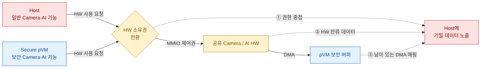

# 문제 1. HW 공유가 pVM의 기밀성을 깨뜨릴 수 있음

> **핵심 결론:** Camera/AI HW의 사용 주체를 바꿀 때 **제어권·DMA 권한·HW 내부 상태**를 함께 전환하지 않으면,
> pKVM의 메모리 격리가 유지되어도 보안 영상과 AI 데이터가 Host에 노출될 수 있다.

## 문제 발생 구조



## 문제의 구조

| 배경 | 구체적인 실패 메커니즘 | 위협받는 품질 |
|---|---|---|
| 단일 Context HW를 Host와 pVM이 시분할해야 함 | MMIO/DMA 권한이 잠시 겹치면 Host가 pVM 버퍼에 접근 | **보안성:** 영상·모델 노출/변조 |
| HW 전용화는 일반 기능과 HW 활용률을 저해 | SRAM, 레지스터, DMA 작업 목록에 이전 데이터가 잔류 | **성능:** 초기화·소거로 전환 지연 증가 |
| Host 커널도 비신뢰하므로 SW mutex만으로 부족 | 비정상 종료·시간 초과 시 회수 전에 재할당하면 예외 경로가 누출 경로가 됨 | **신뢰성:** HW 정지와 장애 전파 |

## 핵심 트레이드오프

- **매 전환 전체 초기화:** 잔류 데이터 위험은 낮지만 실시간 처리 지연이 증가한다.
- **HW 상태 재사용:** 전환은 빠르지만 이전 pVM의 데이터가 남을 수 있다.
- **Host 중재:** 구현은 단순하지만 침해된 Host가 정책과 결과를 위조할 수 있다.
- **신뢰 영역 중재:** 보안은 강화되지만 호출 경로와 전환 비용이 증가한다.

## 필요한 설계 방향

```text
요청 차단 → DMA 정지 → 진행 중인 처리 정리 → 기존 권한 회수
          → 잔류 상태 소거 → 신규 권한 부여
```

- HW 소유자는 항상 **정확히 하나**여야 한다.
- 이전 권한 회수와 잔류 상태 소거 후 다음 권한을 부여한다.
- Host가 아닌 신뢰 주체가 SMMU/S2MPU의 최종 DMA 접근권을 강제한다.
- 초기화 실패나 pVM 장애 시 HW를 닫힌 격리 상태로 유지한다.

## 숫자로 증명할 항목

| 권한 중복 | 남은 DMA 매핑 | 잔류 데이터 | 비인가 접근 차단 | 성능 |
|:---:|:---:|:---:|:---:|:---:|
| **0회** | **0회** | **0건** | **100%** | 전환 지연 평균·최악값 |

`FR-04` · `VOS-02/08` · `QS-01/02/06/07`

> 상세 근거: [HW 공유 시 기밀 데이터 노출](품질위협_문제1_HW공유_기밀데이터_노출.md)
