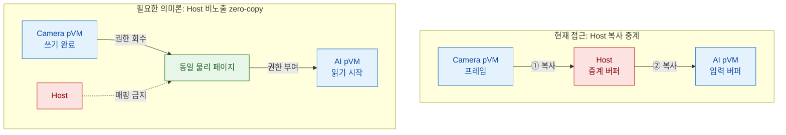

# 문제 2. 강한 격리가 pVM 간 대용량 데이터 전달을 막음

> **핵심 결론:** pKVM은 각 pVM의 메모리를 강하게 격리하지만, Camera pVM의 프레임을 AI pVM에 넘기기 위한
> **Host 비노출·zero-copy 소유권 전환 경로**는 기본 격리만으로 제공되지 않는다.

## 문제 발생 구조



## 문제의 구조

| 기술적 공백 | 구체적인 실패 메커니즘 | 위협받는 품질 |
|---|---|---|
| DMA-BUF fd는 각 VM 커널에 종속되어 fd 숫자만 전달할 수 없음 | Host 복사 중계 시 침해된 Host가 프레임을 읽거나 변조 | **보안성:** 영상 원본 노출 |
| 현재 기준선에는 pVM↔pVM 직접 메모리 전달 경로가 없음 | 고정 공유 풀은 과거·미래 프레임까지 과도하게 노출 | **성능/자원:** 복사 지연과 메모리 증가 |
| CPU 권한, HW DMA, 캐시와 버퍼 수명을 함께 전환해야 함 | 권한 중첩·동기화 오류·pVM 장애 시 데이터 손상과 버퍼 고갈 | **신뢰성:** 파이프라인 정지 |

## 복사 기반 전달의 비용

| 1080p RGB24 @ 30 fps | 1회 복사 추가 트래픽 | Host 경유 2회 복사 |
|:---:|:---:|:---:|
| **6.22 MB/frame · 186.6 MB/s** | **약 373.2 MB/s** | **약 746.5 MB/s** |

> 복사 1회는 원본 read와 대상 write를 모두 포함한다. 실제 값은 영상 포맷과 stride에 따라 달라진다.

## 핵심 트레이드오프

- **프레임별 권한 전환:** 최소 권한은 강화되지만 Stage-2/SMMU 전환 비용이 증가한다.
- **고정 공유 메모리 풀:** 반복 성능은 유리하지만 공격 표면과 메모리 사용량이 증가한다.
- **Host 복사 중계:** 구현은 쉽지만 Host 비노출 요구를 위반한다.
- **암호화 중계:** 기밀성은 보완하지만 복사와 매 프레임 암복호화 비용이 추가된다.

## 필요한 설계 방향

```text
FREE → CAMERA_OWNED → IN_TRANSFER → AI_OWNED → RECLAIMING → FREE
```

- 실제 프레임 경로와 저빈도 제어 경로를 분리한다.
- Camera 쓰기 완료와 권한 회수 후 AI 읽기 권한을 부여한다.
- CPU Stage-2 권한과 Camera/AI HW의 DMA 권한을 같은 상태 전이에 맞춘다.
- 시간 초과·중복 반환·pVM 장애 시 버퍼를 안전하게 회수하거나 폐기한다.

## 숫자로 증명할 항목

| 실제 프레임 복사 | Host 프레임 매핑 | 권한 중첩 | 비인가 접근 차단 | 동작 성능 |
|:---:|:---:|:---:|:---:|:---:|
| **0회** | **0회** | **0회** | **100%** | 1080p 30 fps 지연·유실 |

`FR-05` · `VOS-01/09` · `QS-01/02/04/06/07`

> 상세 근거: [강한 격리로 인한 pVM 간 데이터 전달 공백](품질위협_문제2_pVM간_데이터전달.md)
