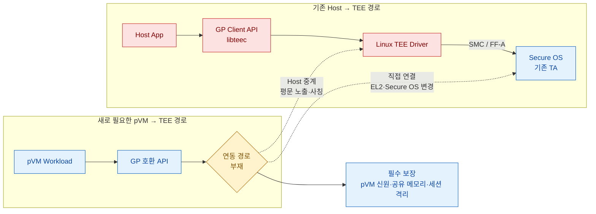

# 문제 3. pVM에서 기존 GlobalPlatform 보안 자산을 사용할 경로가 없음

> **핵심 결론:** 기존 GP API와 Trusted Application을 재사용하려면 pVM의 **호출 경로·신원·공유 메모리·세션**을
> Secure OS까지 안전하게 연결해야 하지만, pKVM의 메모리 격리만으로 이 연동은 완성되지 않는다.

## 문제 발생 구조

## 문제의 구조

| 기술적 공백 | 구체적인 실패 메커니즘 | 위협받는 품질 |
|---|---|---|
| pVM의 SMC/FF-A 호출을 TEE로 전달할 경로가 정의되지 않음 | Host 중계가 GP 명령 인자·평문 버퍼를 읽거나 변조 | **보안성:** 키·평문 노출, pVM 사칭 |
| Secure OS가 Host와 여러 pVM의 신원을 구분할 근거가 부족 | 세션·공유 메모리 식별자 혼선으로 다른 pVM의 키 연산 수행 | **호환성:** 기존 Client/TA 동작 변경 |
| pVM 종료 시 세션과 공유 메모리 회수 규칙이 없음 | 시간 초과·pVM 장애 후 TEE 자원 누수와 서비스 장애 | **신뢰성/이식성:** 벤더별 접합 모듈 확산 |

## GP 호환은 API 모양만 맞추는 문제가 아님

| API·소스 호환 | 동작 호환 | 보안 호환 | 공존성 |
|---|---|---|---|
| 기존 `libteec` 호출부 재사용 | 세션·명령·취소·공유 메모리 의미 유지 | pVM 신원과 권한을 TA까지 위조 불가능하게 전달 | 기존 Host→TEE 경로에 기능·성능 회귀 없음 |

## 핵심 트레이드오프

- **pVM 직접 경로:** Host 노출과 중계 복사는 줄지만 EL2·Secure OS 변경 범위가 커진다.
- **Host 중계:** 기존 경로 재사용은 쉽지만 비신뢰 Host가 평문을 보고 pVM을 사칭할 수 있다.
- **Secure OS별 전용 API:** 초기 구현은 빠르지만 GP 자산 재사용성과 이식성이 사라진다.
- **완전한 GP 호환:** 기존 자산에는 유리하지만 pVM 신원과 메모리 소유권을 표현할 확장이 필요하다.

## 필요한 설계 방향

- pVM Workload에는 GP 표준 Client API 표면을 유지한다.
- GP API와 하위 전송 계층을 분리해 Secure OS/SoC 차이를 접합 모듈에 한정한다.
- Secure OS가 실제 pVM 신원과 TA/명령 권한을 검증한다.
- pVM별 세션·공유 메모리·키 식별자를 분리하고 장애 시 결정적으로 회수한다.
- 기존 Host→TEE 호출 경로와 TA의 동작을 회귀 없이 유지한다.

## 숫자로 증명할 항목

| 기존 GP 회귀 시험 | 비인가 명령 차단 | Host 평문 관찰 | pVM 간 식별자 혼선 | 성능 |
|:---:|:---:|:---:|:---:|:---:|
| **100% 통과** | **100%** | **0건** | **0건** | 호출 지연 평균·최악값 |

`FR-06` · `CS-02` · `VOS-11/12` · `QS-01/02/08`

> 상세 근거: [pVM–GlobalPlatform 표준 연동 경로 부재](품질위협_문제3_GlobalPlatform_연동.md)
