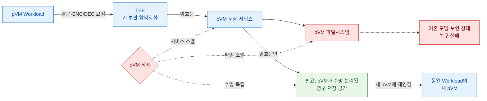

# 문제 3. pVM 삭제 시 암호화 파일도 사라짐

> **핵심 결론:** TEE가 데이터를 안전하게 암호화해도 pVM 내부에 저장하면 pVM 삭제와 함께 파일도 사라진다.
> **키·평문의 신뢰 경계는 유지하면서 암호문 저장 수명을 pVM 실행 수명과 분리**해야 한다.

## 문제 발생 구조



## 문제의 구조

| 기술적 공백 | 구체적인 실패 메커니즘 | 위협받는 품질 |
|---|---|---|
| 암호문 저장 공간이 pVM 파일시스템의 수명에 종속 | pVM 삭제 시 모델·설정·보안 상태까지 소멸 | **가용성:** 재생성 후 복구 실패 |
| 새 pVM과 이전 저장 공간을 결합할 안정적인 Workload 신원 부재 | 침해된 Host가 다른 Workload의 저장 공간을 오연결 | **보안성:** 훼손·서비스 거부 |
| 비-RPMB 저장소의 삭제·변조·되돌리기 검출 방식 미정 | 과거의 정상 암호문을 최신 상태로 수용 | **신뢰성:** 저장 상태 불일치 |

## 핵심 트레이드오프

- **Host 공용 영구 저장 서비스:** 재연결과 자원 공유는 단순하지만 장애가 여러 Workload로 전파될 수 있다.
- **Workload별 영구 볼륨:** 장애 영향은 분리되지만 볼륨 구성·재연결 단계와 자원 사용이 늘어난다.
- **공용 구조:** 파일 이름 공간과 입출력을 Host 서비스가 담당한다.
- **Workload별 구조:** Framework는 볼륨 수명과 연결만 제어하고 pVM 저장 서비스가 암호문 파일 입출력을 담당한다.

## 필요한 설계 방향

```text
볼륨 생성 → pVM 연결 → 암호문 저장 → pVM 분리·삭제
              → 볼륨 유지 → 동일 Workload의 새 pVM에 재연결
              → Workload 폐기 시에만 볼륨 회수
```

- 키는 TEE 밖으로 나오지 않고 저장 경로에는 암호문만 전달한다.
- pVM 삭제와 Workload 폐기를 구분해 저장 자원의 수명을 관리한다.
- Workload 신원과 저장 공간을 결합하고 다른 Workload의 연결을 차단한다.
- 삭제·변조·되돌리기 검출과 비정상 종료 시 중복 연결 방지를 필수 gate로 둔다.
- 신규 Workload의 저장 정책은 Framework 코어 수정 없이 추가할 수 있어야 한다.

## 숫자로 증명할 항목

| 재생성 후 복구 | 저장 경로 평문 노출 | 잘못된 볼륨 연결 | 저장 공격 검출 | 시작 성능 |
|:---:|:---:|:---:|:---:|:---:|
| **100%** | **0건** | **0건** | **100%** | cold start p95 **2초 이하** |

`SEC-05` · `PERF-07` · `EXT-01/03` · `비-RPMB 무결성·재생 방지 gate`

> 상세 근거: [pVM 수명에 종속된 암호화 파일 유실](품질위협_문제3_pVM수명_암호화파일_유실.md)
