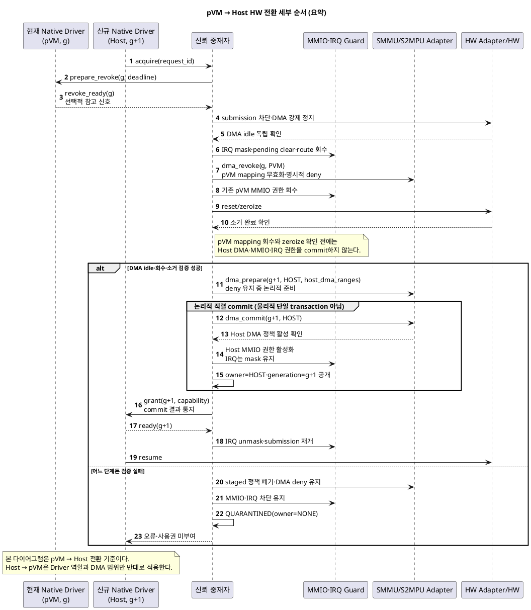
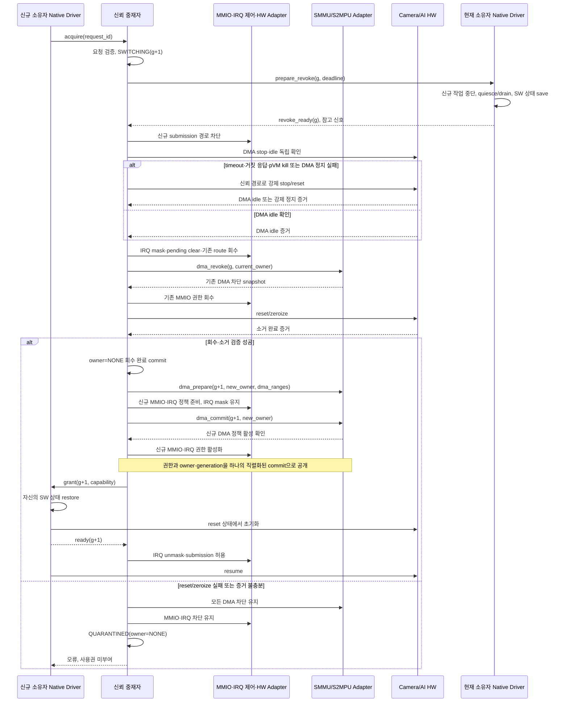

# 품질 위협 문제 1: HW 공유 시 기밀 데이터 노출

> 통합 문서: [과제의 필요성: 품질을 위협하는 세 가지 기술 문제](과제의_필요성_품질_위협_3가지_문제점.md)

## 1. 핵심 결론

Camera/AI HW를 Host와 pVM이 함께 사용해야 하지만, HW 사용 주체를 전환하는 동안 **MMIO 접근권, DMA 주소 공간,
HW 내부 상태를 원자적으로 회수·소거·재부여하지 못하면** 이전 보안 작업의 데이터가 비신뢰 Host에 노출되거나
변조될 수 있다.

이 문제의 핵심은 HW를 공유할지 여부가 아니다. **보안 도메인과 일반 기능이 하나의 HW를 함께 쓰면서도 기밀성과
실시간 성능을 동시에 만족하는 소유권 전환 구조**가 없다는 점이다.

| 실제 실패 결과 | 구조적으로 어려운 이유 | 설계 결과로 증명해야 할 것 |
|---|---|---|
| 영상·모델 노출, 추론 결과 변조, HW 정지 | 보안을 위한 강한 초기화는 느리고, 빠른 상태 재사용은 잔류 데이터 위험이 있음 | 권한 중첩 0회, 잔류 데이터 0건, 전환 지연 수치 |

## 2. 관련 시스템 전제

### 2.1 신뢰 경계

- **Host Linux**: 커널까지 침해될 수 있는 비신뢰 영역
- **pVM**: pKVM이 Host의 CPU 접근으로부터 메모리를 보호하는 보안 VM
- **pKVM Hypervisor**: pVM 메모리의 Stage-2 격리를 강제하는 신뢰 계층
- **Camera/AI HW**: Host 일반 기능과 pVM 보안 기능이 시분할하는 공유 자원
- **SMMU/S2MPU**: HW가 DMA로 접근할 수 있는 메모리 범위를 제한하는 SoC 보호 장치

### 2.2 보호 대상

- 카메라 원본 프레임과 전처리 영상
- AI 모델 가중치와 추론 중간 데이터
- DMA 작업 목록과 HW 내부 SRAM
- HW 제어 레지스터, 인터럽트 및 펌웨어 실행 상태

## 3. 왜 HW 공유가 필요한가

Camera와 AI 가속기는 실시간 영상 파이프라인의 성능을 결정하는 고가의 SoC 자원이다. 보안 기능만을 위해 HW를
영구 전용하면 Host의 일반 촬영과 일반 AI 기능을 제공할 수 없다. 반대로 Host에만 할당하면 pVM이 SW 처리로
폴백하여 실시간 성능을 만족하기 어렵다.

따라서 한 번에 한 작업 상태만 유지하는 단일 Context HW를 다음과 같이 시분할해야 한다.

```text
시간 ───────────────────────────────────────────────────────────>

HW 소유자     Host      Secure Camera pVM      Host      Secure AI pVM
             ──────┬──────────────────────┬─────────┬──────────────
권한 전환           A                      B         C
```

각 전환점 A/B/C에서는 단순히 드라이버의 `owner` 변수만 변경해서는 안 된다. HW 사용권은 다음 세 권한으로
구성되기 때문이다.

1. **제어 권한**: MMIO 레지스터를 읽고 쓰는 권한
2. **메모리 권한**: HW가 DMA로 접근할 수 있는 물리 주소 범위
3. **상태 권한**: 인터럽트, DMA 작업 목록, 펌웨어 실행 상태, 내부 SRAM과 캐시의 소유권

## 4. Host/pVM Native Driver 간 HW 공유 과정

이 절은 Host에 요청 큐를 둘지 EL2에 둘지 결정하지 않고, 두 후보 구조가 공통으로 지켜야 하는 전환 계약을 정의한다.
Host Native Driver와 Secure pVM Native Driver는 서로 직접 호출하거나 HW context를 전달하지 않는다. 두 Driver는
동일한 추상 수명주기 계약을 사용해 **신뢰 중재자**와만 통신하며, 신뢰 중재자가 실제 HW 소유권과 전환 세대를
기록하고 접근권을 강제한다.

구체적인 hypercall, 메시지, reset register와 timeout 값은 HW·pKVM 구현 단계에서 정한다. 아래의 `acquire`,
`prepare_revoke`, `revoke_ready`, `grant`, `ready`, `release`는 책임과 순서를 설명하기 위한 추상 인터페이스다.

### 4.1 참여자와 책임

| 참여자 | 책임 | 보안 판정에서의 취급 |
|---|---|---|
| Host Native Driver | Host 소유 구간의 일반 HW 작업, 신규 요청 중단, 협조적 quiesce와 자신의 SW 상태 저장 | 비신뢰 입력이다. 완료 보고만으로 회수·소거 완료를 판정하지 않는다. |
| Secure pVM Native Driver | pVM 소유 구간의 보안 HW 작업, 신규 요청 중단, 협조적 quiesce와 자신의 SW 상태 저장 | 소유 구간 밖의 권한을 변경할 수 없으며, 완료 보고는 독립 검증을 대체하지 않는다. |
| 신뢰 중재자 | 요청 검증, 현재 소유자·전환 세대·상태기계 관리, 전환 순서 실행, 오류 시 격리 | 권한 전환의 최종 판정 주체다. 후보에 따라 EL2 중재자 또는 EL2 권한 강제자가 된다. |
| HW Policy/Adapter | HW별 submission 차단, DMA idle 확인, reset/zeroize, 전원·클럭과 펌웨어 reset 상태 처리 | 신뢰 중재자가 통제하고 결과를 검증할 수 있어야 한다. |
| SMMU/S2MPU·Stage-2·IRQ 제어 | DMA 주소 공간, CPU의 MMIO 접근과 interrupt routing 강제 | Native Driver가 우회할 수 없는 실제 집행 수단이다. |
| Camera/AI HW | 한 소유자의 명령과 DMA만 실행 | 전환 중과 오류 시에는 소유자가 없는 격리 상태로 유지한다. |

Native Driver의 `prepare/quiesce/save/restore/resume`은 전환 시간을 줄이기 위한 협조 단계다. 반면 DMA idle,
MMIO·DMA·IRQ 회수, reset/zeroize와 신규 권한 부여의 성립 여부는 신뢰 중재자가 HW 상태 또는 위조 불가능한 신호로
독립 확인한다.

### 4.2 상태, 수명주기와 SMMU 설정 계약

```text
OWNED(HOST, g) ──전환 요청──> SWITCHING(g+1, owner=NONE)
                 정상 완료──> OWNED(PVM, g+1)
                 실패───────> QUARANTINED(g+1, owner=NONE)

OWNED(PVM, g)  ──전환 요청──> SWITCHING(g+1, owner=NONE)
                 정상 완료──> OWNED(HOST, g+1)
                 실패───────> QUARANTINED(g+1, owner=NONE)
```

| 추상 동작 | 호출 방향 | 의미 |
|---|---|---|
| `acquire(hw, request_id)` | 신규 소유자 → 신뢰 중재자 | HW 사용을 요청한다. 현재 세대, 요청자 신원과 허용 DMA 범위를 검증한다. |
| `prepare_revoke(g, deadline)` | 신뢰 중재자 → 현재 Driver | 신규 작업을 받지 않고 진행 중 작업을 배출·취소하도록 요청한다. |
| `revoke_ready(g)` | 현재 Driver → 신뢰 중재자 | 협조적 정리가 끝났다는 참고 신호다. 보안 Gate 통과 증거는 아니다. |
| `dma_revoke(g, current_owner)` | 신뢰 중재자 → SMMU Adapter | DMA idle 확인 후 공유 HW의 device/stream에 결합된 현재 소유자 DMA mapping을 무효화하고 IOTLB 동기화 결과를 검증한다. |
| `dma_prepare(g+1, new_owner, dma_ranges)` | 신뢰 중재자 → SMMU Adapter | HW와 submission을 정지한 상태에서 공유 HW의 device/stream에 신규 소유자의 허용 DMA 범위만 staging한다. 아직 DMA를 허용하지 않는다. |
| `dma_commit(g+1, new_owner)` | 신뢰 중재자 → SMMU Adapter | 준비한 SMMU/S2MPU 정책을 `owner·generation` 갱신과 함께 공개하고 read-back 또는 권한 snapshot으로 활성 상태를 확인한다. |
| `grant(g, capability)` | 신뢰 중재자 → 신규 Driver | 검증된 세대와 허용 MMIO·DMA·IRQ 범위 안에서만 사용권을 부여한다. |
| `ready(g)` | 신규 Driver → 신뢰 중재자 | Driver 초기화와 서비스 준비가 끝났다는 운용 상태 신호다. |
| `release(g)` | 현재 Driver → 신뢰 중재자 | 자발적 반납을 요청한다. 실제 회수 절차는 `prepare_revoke` 이후와 동일하다. |

오래된 세대의 메시지, 중복 `release`, 현재 소유자가 아닌 Driver의 제어 요청은 거부한다. `save/restore`가 다루는
상태는 각 Driver 자신의 비기밀·재구성 가능한 SW 상태로 제한하며, 이전 소유자의 HW context나 기밀 데이터를 다른
도메인으로 전달하지 않는다.

`dma_prepare`는 mapping을 staging하는 단계일 뿐 소유권 부여가 아니다. HW는 reset 또는 DMA disabled 상태이고
submission gate는 닫혀 있어야 한다. `dma_commit`이 성공해도 `grant` 전에는 신규 Driver가 HW를 사용할 수 없으며,
SMMU/S2MPU 정책 활성화, MMIO·IRQ 권한과 소유자 원장은 하나의 직렬화된 전환으로 외부에 공개한다.

아래 다이어그램은 pVM에서 Host로 HW를 전환하는 추상동작이다. Host에서 pVM으로 전환할 때는 현재·신규 Driver의
역할과 DMA 범위만 바뀌며, 회수·소거·SMMU 설정 순서는 동일하다.



### 4.3 정상 전환 세부 순서

Host→pVM과 pVM→Host는 같은 순서를 사용한다. 다만 pVM→Host에서는 보안 데이터가 남아 있지 않다는 검증이 끝나기
전까지 Host 권한을 열지 않는 것이 핵심이다.

#### A. 요청과 협조적 정리

1. 신규 Driver가 `acquire`를 요청한다. 신뢰 중재자는 요청자 신원, 현재 소유자, 전환 세대와 등록된 DMA buffer
   범위를 검증한다.
2. 신뢰 중재자는 상태를 `SWITCHING`으로 바꾸고 다음 세대를 예약한다. 새로운 사용 요청은 큐에 두거나 거부하지만,
   현재 작업의 completion IRQ는 drain이 끝날 때까지 유지한다.
3. 현재 Driver에 `prepare_revoke`를 보내 신규 작업 수락을 중단하고, 제출 queue를 비우거나 취소하며, 재사용할
   비기밀 SW 상태만 저장하도록 한다.
4. 현재 Driver는 `revoke_ready`를 보낼 수 있다. 신뢰 중재자는 이 보고를 성능 최적화에만 사용하고 독립 검증을
   계속한다.

#### B. 강제 회수와 잔류 상태 소거

5. 신뢰 중재자가 통제하는 HW Policy/Adapter가 doorbell·command queue 등 신규 submission 경로를 닫는다. Driver가
   응답하지 않거나 거짓 완료를 보고해도 이 시점 이후 새 작업을 넣을 수 없어야 한다.
6. HW의 DMA 정지와 진행 중 transaction의 drain 완료를 독립적으로 확인한다. 완료 전에는 DMA mapping을 회수하지
   않는다.
7. DMA idle 확인 후 IRQ source를 mask하고 pending interrupt를 처리·소거한 뒤 기존 IRQ routing을 회수한다.
8. `dma_revoke(g, current_owner)`로 공유 HW의 device/stream에 결합된 기존 소유자의 SMMU/S2MPU DMA mapping을
   무효화한다. 이어서 MMIO·Stage-2 권한 회수와 필요한 TLB·IOTLB·cache 동기화를 끝낸다.
9. reset/zeroize에 필요한 전원·클럭은 유지한 채 펌웨어 실행 상태, DMA descriptor·작업 목록, MMIO register,
   내부 SRAM·cache를 HW별 절차로 초기화한다. 신뢰 중재자는 소거 완료를 독립적으로 확인한다.
10. 회수·소거 증거가 모두 확인되면 `owner=NONE`과 회수 완료 세대를 하나의 논리적 commit으로 기록한다. 유휴가
    길다면 이 시점 이후에만 전원·클럭을 낮출 수 있다.

#### C. 신규 소유자 부여와 재개

11. HW를 reset 상태와 submission 차단 상태로 유지한 채 필요한 전원·클럭을 활성화하고, HW Policy/Adapter 또는
    신뢰 검증 경로가 펌웨어를 알려진 초기 상태로 만든다.
12. `dma_prepare(g+1, new_owner, dma_ranges)`로 신규 소유자의 등록된 buffer만 접근하도록 SMMU/S2MPU 정책을
    staging하고, IRQ routing은 신규 소유자 방향으로 설정하되 아직 mask 상태를 유지한다.
13. `dma_commit(g+1, new_owner)`와 함께 신규 MMIO 권한, DMA 범위, IRQ routing과 `owner·generation` 원장을 하나의
    직렬화된 commit으로 공개한다. commit 전에는 외부에 `owner=NONE`으로 보이고 submission gate가 닫혀 있어야 한다.
14. 신뢰 중재자가 신규 Driver에 `grant`를 알린다. 신규 Driver는 세대를 확인하고 자신의 SW 상태만 `restore`한 뒤
    reset된 HW를 초기화한다.
15. 신규 Driver가 `ready`를 보고하면 IRQ를 unmask하고 submission gate를 열어 `resume`한다. `ready`는 서비스 시작
    신호이며 이전 소유자의 회수·소거를 증명하는 신호는 아니다.

### 4.4 자원별 순서와 주의점

| 자원 | 회수 | 부여 | 주의점 |
|---|---|---|---|
| MMIO | 협조적 drain 뒤 접근 회수 | 보호정책 준비 후 commit 시 공개 | Driver의 `owner` 변수나 SW mutex만으로 대체할 수 없다. |
| DMA | 신규 submission 차단 → DMA idle 확인 → `dma_revoke` | `dma_prepare`로 staging → 소유권 commit에서 `dma_commit` | CPU Stage-2와 SMMU/S2MPU 상태를 함께 검증한다. |
| IRQ | completion drain 동안 유지 → DMA idle 후 source mask·pending clear·route 회수 | 신규 route 설정 후 권한 commit이 끝난 다음 unmask | 너무 일찍 mask하면 quiesce가 completion을 기다리며 교착될 수 있다. |
| 전원·클럭 | drain·reset·zeroize 완료까지 유지 | HW 초기화 전에 활성화 | 접근권과 별도인 lifecycle 자원이다. `owner=NONE`이어도 소거 중에는 활성일 수 있다. |
| 펌웨어·내부 상태 | 실행 정지 후 신뢰 경로로 reset/zeroize | 알려진 초기 상태에서 신규 Driver가 재설정 | 이전 HW context를 Host와 pVM 사이에 직접 restore하지 않는다. |

### 4.5 정상·오류 시퀀스



### 4.6 오류 처리와 완료 증거

| 오류 | 처리 |
|---|---|
| quiesce·DMA 정지 timeout | Driver 보고를 기다리지 않고 submission 차단과 강제 정지·회수로 전이한다. |
| Native Driver 거짓 완료 보고 | 독립 HW 상태와 다르면 보고를 폐기하고 강제 회수한다. Host 응답은 보안 Gate가 아니다. |
| pVM kill·Host crash | 협조적 정리를 생략하고 신뢰 경로로 HW를 강제 정지한다. DMA idle 확인 뒤 현재 세대의 MMIO·DMA·IRQ를 회수한다. |
| reset/zeroize 실패 | 신규 권한을 부여하지 않고 `QUARANTINED(owner=NONE)`을 유지한다. 검증된 재시도나 상위 복구 전에는 재개하지 않는다. |
| 신규 Driver 초기화 실패 | 신규 권한을 다시 회수하고 동일한 소거·격리 절차를 반복한다. 이전 소유자에게 자동으로 되돌리지 않는다. |

전환 완료는 Native Driver의 성공 return이 아니라 다음 증거로 판정한다.

- 신뢰 중재자가 기록한 이전·신규 소유자와 단조 증가하는 전환 세대
- DMA idle을 나타내는 HW 상태 또는 위조 불가능한 완료 신호
- 전환 전후 MMIO·Stage-2와 SMMU/S2MPU 권한 snapshot
- IRQ mask·pending clear·routing 변경 기록
- reset/zeroize 완료 신호와 잔류 상태 검증 결과
- 정상·오류 경로별 단계 timestamp와 `QUARANTINED` 진입·해제 기록

이 과정에서 항상 지켜야 하는 불변조건은 다음과 같다.

1. MMIO·DMA의 유효 소유자는 항상 0명 또는 1명이며 두 Driver의 권한이 겹치는 순간은 없다.
2. DMA idle 확인 전에는 기존 DMA mapping을 회수하지 않고, 소거 완료 확인 전에는 신규 권한을 부여하지 않는다.
3. IRQ는 drain 동안 유지하고 DMA idle 뒤 회수하며, 신규 권한 commit 뒤에만 신규 소유자에게 unmask한다.
4. reset/zeroize 완료 전에는 전원·클럭을 비활성화하지 않는다. 전원·클럭 활성은 HW 소유권 부여를 의미하지 않는다.
5. 소유자 원장과 실제 MMIO·DMA·IRQ 권한은 외부에서 서로 다른 상태로 관측되지 않는다.
6. 오류 경로도 같은 회수·소거 Gate를 거치며, 검증 실패 시에는 소유자 없는 격리 상태만 허용한다.

## 5. 구체적인 실패 경로

### 5.1 DMA 권한 중첩

1. Secure Camera pVM이 보안 프레임 버퍼를 Camera HW의 DMA 대상으로 등록한다.
2. 기존 SMMU/S2MPU 매핑이 완전히 해제되기 전에 Host에 HW 제어권이 부여된다.
3. Host의 악성 드라이버가 이전 DMA 주소 또는 작업 목록을 재사용한다.
4. Camera HW가 pVM의 프레임을 Host가 읽을 수 있는 메모리로 송출한다.

CPU의 Stage-2 격리가 유지되어도 장치의 DMA 경로가 같은 보호 정책에 묶이지 않으면 누출을 차단할 수 없다.
**CPU 접근 격리와 DMA 접근 격리는 별도의 검증 대상**이다.

### 5.2 HW 잔류 데이터 노출

1. Secure AI pVM이 모델 가중치나 중간 연산값을 AI HW 내부 SRAM 또는 DMA 작업 목록에 남긴다.
2. HW 사용권만 Host로 변경하고 내부 상태를 초기화하지 않는다.
3. Host가 디버그/상태 레지스터, 재사용된 버퍼 또는 실행 상태 저장 영역을 통해 이전 데이터를 읽는다.

메모리 매핑을 정확히 전환해도 HW 내부에 남은 데이터까지 소거하지 않으면 기밀성이 깨진다.

### 5.3 비신뢰 중재자의 정책 우회

1. HW 중재 로직이 Host 커널 드라이버에만 존재한다.
2. 침해된 Host가 대기열 순서, 소유자 상태 또는 권한 설정 결과를 조작한다.
3. 두 주체에 동시에 접근권을 부여하거나 회수 실패를 성공으로 위장한다.

Host의 SW mutex는 동시 실행을 줄일 수 있지만 보안 경계를 강제하지 못한다. 최종 접근권은 Host가 조작할 수 없는
SMMU/S2MPU 또는 동등한 신뢰 주체가 강제해야 한다.

### 5.4 오류·시간 초과 처리 중 권한이 열린 채 복구

1. pVM이 HW 작업 중 비정상 종료되거나 interrupt를 잃어버린다.
2. 중재자가 서비스 복구를 위해 HW를 Host에 강제로 재할당한다.
3. DMA 중지, 진행 중인 처리 정리, 매핑 회수 또는 잔류 데이터 소거가 완료되지 않은 채 재할당된다.
4. 가용성을 회복하려던 예외 경로가 기밀성 침해 경로가 된다.

정상 경로뿐 아니라 초기화 실패, DMA 시간 초과, pVM 비정상 종료와 요청 폭주에서도 항상 **fail-closed**해야 한다.
즉, 오류 시 HW를 다음 사용자에게 넘기지 않고 접근권이 닫힌 격리 상태로 유지해야 한다.

## 6. 위협받는 품질 속성

| 품질 속성 | 위협 내용 |
|---|---|
| 보안성 | 권한 중첩, 남아 있는 DMA 매핑, 잔류 데이터로 영상·모델이 Host에 노출되거나 변조됨 |
| 성능 | HW 초기화, TLB 무효화, 캐시 정리와 데이터 소거가 프레임 처리 지연을 증가시킴 |
| 신뢰성 | interrupt와 DMA 처리를 잘못하면 HW 정지나 pVM 장애가 다른 영역으로 전파됨 |
| 자원 효율 | 보안을 이유로 HW를 전용하거나 복제하면 HW 활용률과 제품 원가가 악화됨 |
| 확장성 | HW별 전환 절차가 Framework에 결합되면 신규 HW IP 추가 시 코어 수정이 필요함 |

## 7. 핵심 트레이드오프

- 매 전환마다 HW 전체를 초기화하면 잔류 데이터 위험은 줄지만 전환 시간이 증가한다.
- 일부 HW 상태를 유지하면 전환은 빨라지지만 이전 보안 작업의 데이터가 남을 수 있다.
- 중재자를 Host에 두면 구현은 단순하지만 비신뢰 Host가 정책을 우회할 수 있다.
- 중재자를 신뢰 영역에 두면 보안은 강화되지만 호출 경로와 전환 지연이 증가할 수 있다.

따라서 이 문제는 단순 드라이버 구현이 아니라 **보안성–성능–가용성 간 아키텍처 트레이드오프**다.

## 8. 단순 접근으로 해결되지 않는 이유

| 단순 접근 | 한계 |
|---|---|
| HW를 pVM에 영구 전용 | Host의 일반 기능을 지원하지 못하고 HW 활용률이 낮아짐 |
| 모든 HW 요청을 Host가 중재 | 비신뢰 Host가 정책과 전환 결과를 위조할 수 있음 |
| SW mutex로 동시 접근 차단 | MMIO와 DMA 권한을 하드웨어적으로 강제하지 못함 |
| 매 전환 시 전체 초기화 | 보안에는 유리하지만 실시간 처리 예산을 초과할 수 있음 |
| DMA 버퍼만 소거 | DMA 작업 목록, 레지스터, SRAM, 캐시 등에 데이터가 남을 수 있음 |

## 9. 설계가 반드시 보장해야 할 조건

아래 `QA-xx` 태그는 [품질 속성(QA)과 Measure 재정의](품질속성_QA_Measure_ISO25010.md)의 품질 속성과 연결한다.
하나의 조건이 여러 품질 속성에 기여하면 태그를 함께 표기한다.

1. **[QA-04 보안성 — 무결성 및 접근권 강제]** 특정 시점의 HW 유효 소유자는 0명 또는 1명이며, 두 소유자가 동시에 유효한 구간은 없어야 한다.
2. **[QA-04 보안성 — 무결성 및 접근권 강제]** 이전 소유자의 MMIO/DMA 권한 회수가 완료되기 전에 다음 소유자의 권한을 부여하지 않는다.
3. **[QA-05 기능 적합성 — 기능 정확성 / 신뢰성 — 무결함성]** 전환 순서는 `요청 차단 → 협조적 처리 정리(quiesce/drain) → submission 경로 차단·DMA 정지 확인 → MMIO·DMA·IRQ 권한 회수 → 잔류 상태 소거 → 새 권한 부여`를 따른다.
4. **[QA-04 보안성 — 무결성 및 접근권 강제]** 권한 전환 결과는 비신뢰 Host가 아닌 신뢰 주체가 검증하거나 강제한다.
5. **[QA-06 신뢰성 — 장애허용성·가용성]** 비정상 종료, 시간 초과, 초기화 실패 시 HW를 격리 상태로 유지한다.
6. **[QA-08 유연성 — 적응성 / 유지보수성 — 모듈성]** HW별 정책과 소거 절차를 Framework 코어에서 분리해 새로운 HW IP를 추가할 수 있어야 한다.
7. **[QA-03 보안성 — 기밀성]** 전환 완료 시점에는 MMIO 레지스터, DMA 작업 목록, 내부 SRAM·캐시와 인터럽트 상태에 이전 소유자의 데이터가 남아 있지 않아야 한다.
8. **[QA-01 성능 효율성 — 시간 반응성·용량]** 정상 전환은 할당된 전환 시간 예산 안에 완료해야 하며, 예산을 맞추기 위해 권한 회수나 잔류 상태 소거를 생략해서는 안 된다. 시간 초과 시 처리는 조건 5를 따른다.
9. **[QA-02 성능 효율성 — 자원사용성]** Host와 복수 pVM이 동일 HW 인스턴스를 시분할로 재사용할 수 있어야 하며, 격리 도메인 추가가 도메인별 영구 전용이나 물리 복제를 전제로 해서는 안 된다.
10. **[QA-07 신뢰성 — 복구성]** 오류 후 소유권, MMIO/DMA 권한 회수, 잔류 상태 소거와 HW 상태 검증이 모두 완료된 경우에만 HW 서비스를 재개하고, 검증에 실패하면 격리 상태를 유지해야 한다.

## 10. 검증 지표

- HW 사용권 중복 부여 횟수: **0회**
- 이전 소유자 DMA 매핑 잔존 횟수: **0회**
- 비인가 MMIO/DMA 접근 차단률: **100%**
- 전환 후 잔류 데이터 검출 건수: **0건**
- 정상/오류별 HW 전환 지연: 평균, 최악값, 상위 백분위수 측정
- pVM 비정상 종료, DMA 시간 초과, 초기화 실패, 요청 폭주 시 fail-closed 동작률: **100%**

위 수치는 완료 결과가 아니라 설계 판정 기준이다. 실제 HW가 준비되면 PoC와 오류 주입 시험으로 측정하고,
준비 전에는 실행 기록 기반 시뮬레이션으로 후보 구조를 비교한다.

## 11. 요구사항 추적성

- 기능 요구사항: `FR-04` Camera/AI HW 공유 사용
- 이해관계자 요구: `VOS-02`, `VOS-08`
- 품질 속성: `QS-01`, `QS-02`, `QS-06`, `QS-07`

## 12. 관련 자료

- [과제의 필요성 슬라이드](SW_Architect_개인과제/슬라이드5.PNG)
- [유즈케이스 UC-04](../docs/01_use_case_spec.md)
- [기능 요구사항 FR-04](../docs/02_requirements.md)
- [HW IP 중재 Decision Point](../docs/05_decision_points.md)
