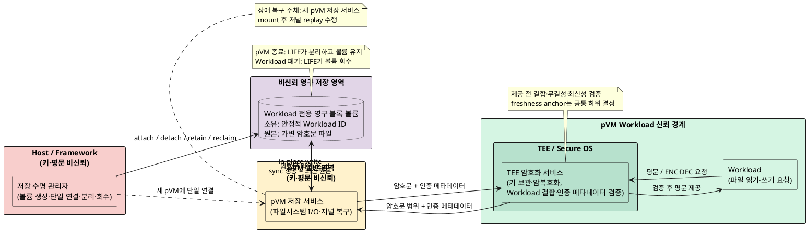
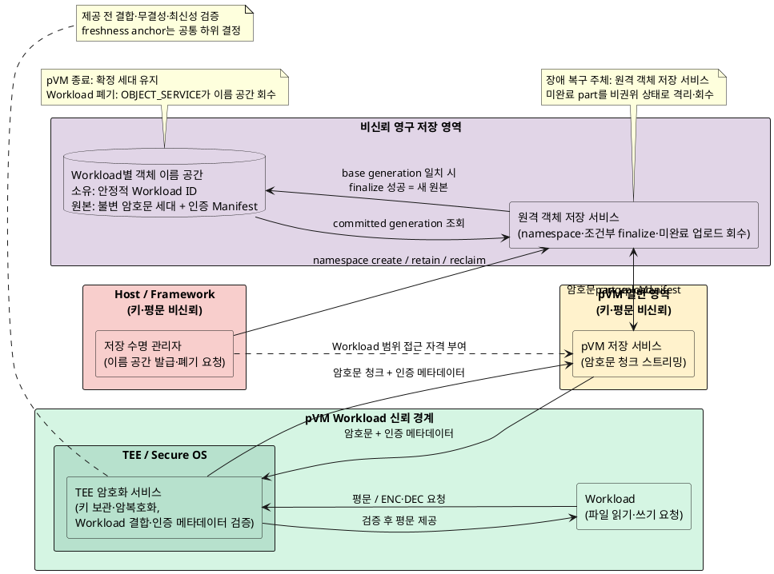

# 품질 위협 문제 3: pVM 수명에 종속된 암호화 파일 유실

> 통합 문서: [과제의 필요성: 품질을 위협하는 세 가지 기술 문제](과제의_필요성_품질_위협_3가지_문제점.md)

## 1. 핵심 결론

TEE가 데이터를 안전하게 암호화해도 암호문을 pVM 내부 파일시스템에 저장하면 pVM 삭제와 함께 파일도 사라진다.
**키와 평문을 TEE 및 Workload의 신뢰 경계 안에 유지하면서, 암호문 저장 공간의 수명을 pVM 실행 수명과 분리하는
영구 보관 구조가 현재 과제 기준선에 없다.**

| 실제 실패 결과 | 구조적으로 어려운 이유 | 설계 결과로 증명해야 할 것 |
|---|---|---|
| pVM 재생성 후 기존 모델·보안 상태 복구 실패, 저장소 공격 시 파일 변조·되돌리기 | 비신뢰 Host에 영구 저장을 맡기면서 Workload 식별자, 저장 수명, 무결성과 재생 방지를 함께 보장해야 함 | pVM 재생성 후 복구 100%, 저장 경로 평문 노출 0건, 잘못된 Workload 연결 0건, 시작 지연 수치 |

## 2. 관련 시스템 전제와 용어

- **Host Linux**: 영구 저장 매체와 Framework가 동작하지만 커널까지 침해될 수 있는 비신뢰 영역
- **pVM**: Workload와 일반 영역 저장 서비스를 실행하는 보안 VM이며 필요에 따라 생성·삭제됨
- **TEE/Secure OS**: 키를 보관하고 암호화·복호화를 수행하는 TrustZone 신뢰 영역
- **암호화 파일**: TEE가 암호화한 뒤 비신뢰 저장 경로에 기록할 수 있는 데이터
- **Workload 식별자**: 새 pVM이 이전 저장 공간을 다시 찾고 다른 Workload와 분리하기 위한 안정적인 신원
- **영구 저장 공간**: pVM이 삭제돼도 유지되고 같은 Workload의 새 pVM에 다시 연결되는 저장 자원
- **되돌리기 공격**: 공격자가 최신 파일을 과거의 정상 암호문으로 바꾸어 이전 상태를 다시 사용하게 하는 공격

키는 TEE 밖으로 나오지 않아야 한다. Workload와 TEE 사이에는 암호화 전·복호화 후 평문이 존재할 수 있지만,
**pVM 저장 서비스, Framework, Host와 영구 저장 매체로 이어지는 저장 경로에는 평문이 노출되면 안 된다.**
GP Client API를 통한 pVM–TEE 호출 경로와 TEE의 키 관리·암복호화 책임은 이미 정해진 기준선이며, 이 문제에서는
호출 경로를 바꾸지 않고 TEE가 만든 암호화 파일의 보관 수명과 입출력 책임만 다룬다.

## 3. 현재 저장 흐름과 필요한 흐름

```text
[현재 흐름]
pVM Workload
    └─ 평문/ENC·DEC 요청 ─> TEE
        └─ 암호문 ─> pVM 저장 서비스
            └─ pVM Linux 파일시스템
                    └─ pVM 삭제 시 서비스와 파일이 함께 소멸

[필요한 흐름]
pVM Workload
    └─ 평문/ENC·DEC 요청 ─> TEE
        └─ 암호문 ─> 저장 데이터 경로
            └─ Workload별 영구 저장 공간
                    └─ pVM 삭제 후 유지, 같은 Workload의 새 pVM에 재연결
```

암호화는 저장 데이터의 기밀성을 보호하지만 저장 자원의 수명까지 연장하지는 않는다. 또한 암호문이라는 이유만으로
삭제, 다른 Workload에 대한 오연결, 변조와 과거 버전 재사용까지 안전해지는 것도 아니다.

## 4. pVM 수명과 파일 수명이 충돌하는 이유

pVM은 격리된 실행 환경이므로 장애 복구, 보안 갱신 또는 자원 회수를 위해 삭제하고 다시 만들 수 있어야 한다.
반면 암호화된 모델, 설정과 보안 상태는 동일 Workload의 다음 pVM에서도 계속 사용해야 한다.

두 수명을 분리하면 다음 책임을 명시해야 한다.

- pVM과 무관하게 저장 공간을 생성·유지·폐기하는 주체는 누구인가?
- 새 pVM이 이전 저장 공간의 정당한 소유자임을 어떤 식별자로 확인하는가?
- 저장 데이터 경로에서 파일 이름 공간과 입출력을 누가 담당하는가?
- pVM 삭제와 Workload 폐기를 어떻게 구분하는가?
- 비신뢰 저장소의 삭제·변조·되돌리기를 어떻게 검출하는가?
- 저장 서비스 장애가 한 Workload에만 머무르는가, 전체 Workload로 전파되는가?

## 5. 구체적인 기술 공백

### 5.1 저장 수명의 소유권

현재 pVM 파일시스템은 pVM의 생성·삭제 수명주기에 포함된다. pVM 삭제와 독립적으로 유지되는 저장 자원의 소유자,
회수 조건과 실패 시 정리 절차가 정의되지 않으면 파일 유실과 고아 저장 공간이 동시에 발생할 수 있다.

### 5.2 Workload 신원과 재연결

새 pVM의 일시적인 VM 식별자만으로는 이전 저장 공간을 안정적으로 찾을 수 없다. Host가 다른 Workload의 식별자나
저장 공간을 연결해도 차단할 수 있도록, 안정적인 Workload 신원과 저장 공간의 결합을 검증해야 한다.

### 5.3 비신뢰 저장소의 무결성과 재생 방지

암호화만으로는 파일 삭제, 비트 변조와 정상 암호문의 과거 버전 복원을 검출할 수 없다. 특히 RPMB를 사용하지 않는
기준선에서는 버전 카운터나 인증된 메타데이터를 어디에 두고 어떻게 최신 상태임을 판단할지가 미정이다.

### 5.4 보관과 입출력 책임의 위치

대용량 암호화 파일의 **권위 있는 현재 상태**를 가변 블록 범위로 둘지, 확정된 불변 객체 세대로 둘지가 정해지지 않았다.
이 선택에 따라 파일 이름 공간, 갱신 완료 판정, 비정상 종료 복구와 미완료 데이터 회수 책임의 실행 위치가 달라진다.

## 6. 구체적인 실패 경로

### 6.1 pVM 삭제와 함께 암호화 파일 유실

1. Workload가 TEE를 통해 모델 또는 보안 상태를 암호화한다.
2. pVM 저장 서비스가 암호문을 pVM 내부 파일시스템에 기록한다.
3. Framework가 장애 복구나 자원 회수를 위해 pVM을 삭제한다.
4. 새 pVM은 이전 파일을 찾지 못해 모델 재배포 또는 보안 상태 초기화를 요구한다.

암호화가 정상이어도 저장 수명이 pVM에 묶여 있으면 서비스 연속성과 복구 가능성은 보장되지 않는다.

### 6.2 다른 Workload의 저장 공간 오연결

1. 새 pVM 생성 시 Host 또는 Framework가 Workload 식별자와 저장 공간의 매핑을 선택한다.
2. 침해된 Host가 다른 Workload의 볼륨을 연결하거나 이전 연결 정보를 재사용한다.
3. TEE 또는 pVM 저장 서비스가 소유권을 확인하지 않으면 다른 Workload의 암호문을 읽거나 덮어쓴다.

암호문을 복호화하지 못하더라도 파일 삭제·훼손과 서비스 거부가 가능하므로 신원 결합은 기밀성 외의 보안에도 필요하다.

### 6.3 저장 파일 변조와 되돌리기

1. Host가 영구 저장소의 최신 암호문과 메타데이터를 보관한다.
2. 공격자가 파일을 삭제·변조하거나 과거의 정상 암호문으로 교체한다.
3. 새 pVM이 위조 또는 오래된 상태를 최신 파일로 받아들인다.

인증 암호가 비트 변조를 검출해도 파일 삭제와 정상 과거 버전의 재생까지 자동으로 판별하지는 못한다.

### 6.4 공용 저장 서비스 장애의 확산

1. 여러 Workload가 하나의 Host 공용 저장 서비스를 사용한다.
2. 한 Workload의 요청 폭주, 파일 이름 공간 오류 또는 서비스 장애가 발생한다.
3. 다른 Workload도 저장과 복구를 수행하지 못해 여러 파이프라인이 동시에 중단된다.

공유 구조는 자원 효율과 연결 단계를 줄이지만 장애 영향 범위를 넓힐 수 있다.

### 6.5 비정상 종료 중 저장 자원 누수

1. 볼륨 연결 또는 파일 입출력 중 pVM이 비정상 종료된다.
2. 연결 상태는 남고 pVM 저장 서비스만 사라지거나, 재시도 중 같은 볼륨이 중복 연결된다.
3. 고아 볼륨이 누적되거나 두 pVM이 같은 저장 공간을 동시에 갱신한다.

pVM 삭제, 재생성, Workload 폐기와 시간 초과를 구분하는 결정적인 수명주기 프로토콜이 필요하다.

## 7. 위협받는 품질 속성

| 품질 속성 | 위협 내용 |
|---|---|
| 보안성 | 저장 경로의 평문 노출, 다른 Workload의 저장 공간 오연결, 파일 삭제·변조·되돌리기 |
| 가용성 | pVM 재생성 후 복구 실패 또는 공용 저장 서비스 장애로 파이프라인이 중단됨 |
| 성능 | pVM 시작 시 저장 공간 검색·연결·검증 단계가 cold start 지연을 증가시킴 |
| 신뢰성 | 중복 연결, 불완전한 갱신과 비정상 종료 후 회수 실패로 저장 상태가 일관성을 잃음 |
| 자원 효율 | Workload별 서비스와 볼륨을 둘 경우 메모리, 프로세스와 저장 자원이 증가함 |
| 확장성 | Workload별 저장 구성이 Framework 코어에 결합되면 신규 Workload마다 수정과 배포가 필요함 |

## 8. 후보 구조 결정 범위

### 8.1 공통 불변 조건

- 키 보관과 암호화·복호화는 TEE에서 수행하고, pVM 일반 영역부터 영구 저장 매체까지는 암호문과 인증 메타데이터만 전달한다.
- 저장 자원은 일시적인 pVM ID가 아니라 안정적인 Workload 식별자가 소유하며, pVM 종료와 Workload 폐기를 구분한다.
- TEE는 Workload 식별자와 인증 메타데이터의 결합을 검증한다. 비-RPMB 환경에서 최신 상태를 증명할 freshness anchor는
  두 후보가 모두 통과해야 하는 공통 하위 결정이며, 어느 한 후보의 고유 장점으로 간주하지 않는다.
- 암호화 청크 크기, 인증 암호 방식, freshness anchor 구현과 물리 저장 제품은 이 Decision Point의 하위 결정이다.

### 8.2 둘 중 하나만 선택하는 결정의 정의

결정 대상은 **한 대용량 파일의 유일한 권위 표현과 갱신 완료 프로토콜**이다.

- 후보 A에서는 가변 암호문 파일의 블록 범위가 원본이고, 동기화가 성공한 in-place 갱신이 즉시 현재 상태가 된다.
  새 세대를 publish하는 별도 `finalize` 단계는 없다.
- 후보 B에서는 인증 Manifest가 가리키는 불변 암호문 객체 세대가 원본이고, 원격 저장 서비스의 `finalize`가 성공한
  새 세대만 현재 상태가 된다. 원본을 in-place로 갱신하지 않는다.

같은 파일을 두 표현에 동시에 권위 있게 기록하거나 두 완료 조건을 함께 사용하면 어느 쪽이 최신인지 결정할 제3의
중재 프로토콜이 필요하므로 이 Decision Point에서는 허용하지 않는다. 후보 A의 객체 백업이나 후보 B 저장소 내부의
블록 매체처럼 비권위 캐시·복제본 또는 하부 구현은 사용할 수 있지만, 장애 복구 시 원본으로 승격할 수 없다.

### 8.3 외부 시스템에서 확인한 구조 패턴

- [Kubernetes PersistentVolume](https://kubernetes.io/docs/concepts/storage/persistent-volumes/)은 실행 Pod와 독립된 수명의
  저장 자원을 제공하고 `ReadWriteOncePod`로 단일 실행 주체 연결을 제한한다. [Amazon EBS](https://docs.aws.amazon.com/ebs/latest/userguide/EBSFeatures.html)도
  인스턴스 밖의 블록 볼륨을 인스턴스 수명과 독립적으로 유지하고 다른 인스턴스에 다시 연결하는 패턴을 제공한다.
- [Amazon S3 multipart upload](https://docs.aws.amazon.com/AmazonS3/latest/userguide/mpuoverview.html)는 대용량 객체를 독립된
  part로 전송하고 실패한 part만 재전송한 뒤 완료 요청에서 하나의 객체로 조립한다. [Google Cloud Storage 객체 모델](https://docs.cloud.google.com/storage/docs/objects)은
  객체를 불변으로 두고 교체를 원자적으로 수행하며 generation으로 각 불변 세대를 식별한다. 이 generation을
  [요청 사전 조건](https://docs.cloud.google.com/storage/docs/request-preconditions)에 사용하면 경쟁 갱신 사이의 덮어쓰기를 차단할 수 있다.

이 사례들은 제품 후보가 아니라 각각 **실행 단위와 분리된 가변 블록 원본**과 **완료 시 공개되는 불변 객체 원본**의
구조적 근거로만 사용한다.

## 9. 후보 구조

### 9.1 후보 A — pVM 부착형 가변 블록 원본

Framework의 저장 수명 관리자가 안정적인 Workload 식별자에 전용 영구 블록 볼륨을 1:1로 결합하고 한 pVM에만
연결한다. pVM 저장 서비스가 볼륨의 파일시스템 이름 공간, in-place 암호문 입출력과 저널 복구를 담당한다. 볼륨은
pVM보다 오래 유지되지만, 권위 상태를 해석하고 비정상 종료를 복구하는 실행 위치는 pVM 일반 영역이다.



### 9.2 후보 B — 원격 확정형 불변 객체 세대 원본

pVM 저장 서비스는 암호문 청크를 스트리밍하는 무상태 클라이언트가 되고, pVM 밖의 원격 객체 저장 서비스가 Workload별
이름 공간, multipart 수신, 기준 generation 조건부 `finalize`와 미완료 업로드 회수를 담당한다. 인증 Manifest가 가리키는
확정 세대만 권위 상태이며, 새 pVM은 볼륨을 연결하거나 파일시스템을 복구하지 않고 최신 확정 세대를 다시 연다.



## 10. 후보별 동작 구조

### 10.1 후보 A 동작과 회수

1. 저장 수명 관리자가 안정적인 Workload 식별자에 전용 볼륨을 생성·결합하고 현재 pVM 하나에만 연결한다.
2. TEE가 대용량 파일 범위를 암호화하고 Workload 결합 정보와 인증 메타데이터를 pVM 저장 서비스에 전달한다.
3. pVM 저장 서비스가 암호문을 가변 파일에 in-place로 기록한다. 동기화 성공 시 별도 확정 단계 없이 해당 블록이
   권위 있는 현재 상태가 된다.
4. 쓰기 중 pVM이 종료되면 저장 수명 관리자가 이전 연결을 fencing·분리하고 볼륨 자체는 유지한다.
5. 새 pVM의 저장 서비스가 같은 볼륨을 단일 연결해 mount와 저널 replay를 수행한다. TEE가 Workload 결합, 내용과
   최신성을 검증한 뒤에만 파일을 제공한다.
6. pVM 종료 때는 볼륨을 유지하고, Workload 폐기 때만 저장 수명 관리자가 볼륨과 매핑 메타데이터를 회수한다.

### 10.2 후보 B 동작과 회수

1. 저장 수명 관리자가 안정적인 Workload 식별자에 객체 이름 공간을 발급하고 pVM에는 해당 범위의 접근 자격만 준다.
2. TEE가 파일을 청크 단위로 암호화하고 인증 Manifest 재료를 만든다. pVM 저장 서비스는 암호문 part를 병렬 전송하며
   실패한 part만 재전송한다.
3. 원격 객체 저장 서비스가 모든 part와 Manifest를 받은 뒤 업로드가 시작한 기준 generation이 여전히 최신일 때만
   조건부 `finalize`하여 새 불변 세대를 공개한다. 경쟁 갱신은 실패 후 최신 세대부터 다시 시작하며, 성공 전 part와
   Manifest는 비권위 상태라서 읽기 복구 대상으로 선택되지 않는다.
4. 전송 중 pVM이 종료되면 원격 객체 저장 서비스가 미완료 업로드를 격리·회수하고 이전 확정 세대는 그대로 유지한다.
5. 새 pVM은 Workload 자격을 다시 증명하고 최신 확정 Manifest와 필요한 범위만 읽는다. TEE가 Workload 결합, 내용과
   최신성을 검증한 뒤에만 파일을 제공한다.
6. Workload 폐기 때 저장 수명 관리자가 폐기 의도를 확정하고 원격 객체 저장 서비스가 이름 공간, 모든 세대와 미완료
   part를 회수한다.

## 11. 품질속성 비교

| 품질 속성 / 판단 기준 | 후보 A — pVM 부착형 가변 블록 원본 | 후보 B — 원격 확정형 불변 객체 세대 원본 |
|---|---|---|
| 대용량 순차 저장 | 단일 볼륨과 pVM I/O 경로의 처리량 한계 안에서 전송 | part 병렬 전송과 실패 part 재시도로 대역폭 활용과 장거리 재시도에 유리 |
| 부분·랜덤 갱신 | in-place 범위 갱신과 파일시스템·`mmap` 의미를 그대로 사용해 유리 | 원본 수정 대신 새 세대를 만들어야 하므로 재청크·Manifest 갱신 비용이 큼 |
| pVM 장애 복구 | 단일 연결 fencing, 재연결, mount와 저널 replay가 필요 | 이전 확정 세대가 계속 유효하고 새 pVM은 재인증 후 Manifest부터 열 수 있음 |
| 불완전 갱신 격리 | 게스트 파일시스템 저널과 TEE 검증이 담당 | `finalize` 전 업로드가 원본에 보이지 않아 구조적으로 격리됨 |
| 장애 영향 범위 | Workload별 볼륨과 pVM 저장 서비스로 데이터 경로 장애 격리가 명확 | 원격 namespace·commit 서비스 장애가 여러 Workload의 저장·복구로 확산될 수 있음 |
| 자원 효율 | Workload별 볼륨 용량 예약, 연결 상태와 고아 볼륨 관리가 필요 | 공유 저장 용량을 세밀하게 사용하지만 미완료 part와 과거 세대 GC가 필요 |
| cold start | 볼륨 탐색·단일 연결·mount·복구 단계가 시작 경로에 포함 | 인증·Manifest 조회가 필요하나 전체 파일을 연결·mount하지 않고 범위 읽기 가능 |
| 애플리케이션 적합성 | 기존 파일 API, 부분 쓰기와 낮은 지연이 중요한 Workload에 유리 | write-once/read-many 모델, 대규모 순차 ingest와 수평 확장이 중요한 Workload에 유리 |
| 보안 공통 gate | TEE가 볼륨 헤더/파일 메타데이터의 Workload 결합·무결성·최신성을 검증해야 함 | TEE가 Manifest의 Workload 결합·무결성·최신성을 검증해야 함 |

후보 A는 파일 API 호환성, 랜덤 갱신과 Workload별 장애 격리에서 우세하지만 재연결·복구와 전용 자원 비용을 부담한다.
후보 B는 대용량 병렬 전송, 불완전 갱신 격리와 자원 공유에서 우세하지만 객체 세대화 비용과 공용 서비스 장애 범위를
부담한다. 따라서 어느 후보도 모든 품질속성에서 우월하지 않다.

## 12. 단순 접근으로 해결되지 않는 이유

| 단순 접근 | 한계 |
|---|---|
| pVM 내부 파일시스템에 계속 저장 | pVM 삭제 시 암호화 파일도 사라져 재생성 후 복구할 수 없음 |
| Host 디렉터리를 그대로 다시 연결 | Host가 Workload 매핑을 바꿀 수 있고 수명·권한·예외 처리 책임이 불명확함 |
| 암호화만 적용 | 평문 기밀성은 보호할 수 있어도 파일 삭제·오연결·되돌리기를 막지 못함 |
| 모든 Workload가 하나의 공용 서비스 사용 | 자원 효율은 높지만 장애 영향과 공격 표면이 전체 Workload로 확대됨 |
| Workload마다 서비스와 저장소를 수동 구성 | 장애 격리는 좋아지지만 온보딩 공수와 자원 사용이 선형으로 증가함 |

## 13. 설계가 반드시 보장해야 할 조건

아래 `QA-xx` 태그는 [품질 속성(QA)과 Measure 재정의](품질속성_QA_Measure_ISO25010.md)의 품질 속성과 연결한다.
하나의 조건이 여러 품질 속성에 기여하면 태그를 함께 표기한다.

1. **[QA-07 신뢰성 — 복구성]** 암호화 파일의 수명은 pVM의 생성·삭제 수명과 독립적이어야 한다.
2. **[QA-03 보안성 — 기밀성]** 키는 TEE 밖으로 나오지 않고 pVM 저장 서비스, Framework, Host와 저장 매체에는 평문이 노출되지 않아야 한다.
3. **[QA-04 보안성 — 무결성 및 접근권 강제]** 안정적인 Workload 식별자와 저장 공간을 결합하고 다른 Workload의 연결 요청을 차단해야 한다.
4. **[QA-02 성능 효율성 — 자원사용성 / QA-07 신뢰성 — 복구성]** pVM 삭제 시 저장 공간을 유지하고, Workload 폐기 시에만 저장 공간과 메타데이터를 회수해야 한다.
5. **[QA-05 기능 적합성 — 기능 정확성 / 신뢰성 — 무결함성]** 생성·접근 권한 발급 또는 연결·분리·재연결·회수 상태와 책임 주체를 명시하고, 후보 A의 중복 연결과 후보 B의 오래된 기준 generation에 대한 경쟁 확정을 방지해야 한다.
6. **[QA-04 보안성 — 무결성 및 접근권 강제]** 비-RPMB 저장소에서 파일 삭제·변조·되돌리기를 검출하는 메커니즘과 실패 시 동작을 정의해야 한다.
7. **[QA-05 기능 적합성 — 기능 정확성 / 신뢰성 — 무결함성 / QA-07 신뢰성 — 복구성]** 저장 또는 연결 중 pVM이 비정상 종료돼도 불완전한 파일을 정상 상태로 확정하지 않아야 한다.
8. **[QA-06 신뢰성 — 장애허용성·가용성 / QA-04 보안성 — 무결성 및 접근권 강제]** 저장 구조와 무관하게 한 Workload의 저장 요청 폭주, 이름 공간 오류 또는 서비스 장애가 다른 Workload의 저장과 복구 가능성에 영향을 주지 않아야 하며, Workload별 이름 공간·권한·자원 한도를 구분해야 한다.
9. **[QA-08 유연성 — 적응성 / 유지보수성 — 모듈성]** 신규 Workload 추가 시 Framework 코어를 수정하지 않도록 저장 정책과 연결 정보를 데이터로 기술해야 한다.
10. **[QA-02 성능 효율성 — 자원사용성]** 정의된 유예시간 안에 정당한 소유 Workload가 확인되지 않는 저장 공간과 메타데이터는 고아 자원으로 식별해 회수해야 한다.
11. **[QA-01 성능 효율성 — 시간 반응성·용량]** 저장 공간 검색·연결·검증을 포함한 pVM 시작 경로는 할당된 cold start 시간 예산을 충족해야 한다.
12. **[QA-07 신뢰성 — 복구성]** pVM 재생성 후 안정적인 Workload 식별자로 최신 committed 암호화 파일을 다시 연결하고, 신원·버전·내용 검증에 성공한 경우에만 정상 파일로 제공해야 한다.

## 14. 검증 지표

- pVM 삭제·재생성 후 최신 암호화 파일 재연결 및 복구 성공률: **100%**
- 저장 데이터 경로에서 키가 관찰된 건수: **0건**
- pVM 저장 서비스, Framework와 Host에서 평문이 관찰된 건수: **0건**
- 다른 Workload의 저장 공간 연결 및 접근 성공 건수: **0건**
- 삭제·변조·되돌리기 공격 검출률: **100%** — 구체적 메커니즘 정의 후 필수 gate로 검증
- 비정상 종료 후 중복 연결, 오래된 기준 generation의 확정 성공 및 고아 저장 자원 발생 건수: 각각 **0건**
- pVM 재생성 시 저장 공간 재연결을 포함한 cold start p95: **2초 이하**
- 신규 Workload 저장 구성 시 Framework 코어 변경량: **0 LoC**, 통합 리드타임: **5인일 이하**
- 다중 Workload에서 저장 서비스 장애 영향 범위, 추가 메모리와 저장 자원 사용량 측정

위 수치는 완료 결과가 아니라 설계 판정 기준이다. 삭제·변조·되돌리기 검출 방식이 정해지기 전에는 후보 구조를
최종 결정하지 않고, 오류 주입과 pVM 재생성 시험으로 공통 필수 조건부터 검증한다.

## 15. 요구사항 추적성

- 보안성: `SEC-05` 저장 데이터 기밀성
- 저장 무결성과 재생 방지: 비-RPMB 저장소의 삭제·변조·되돌리기 검출 — 확인 필요 공통 gate
- 성능: `PERF-07` 파이프라인 시작 지연
- 확장성: `EXT-01` 신규 Workload 코어 무수정, `EXT-03` 온보딩 리드타임
- 자원 효율과 가용성: 정량 KPI 정의 필요

## 16. 관련 자료

- [암호화된 저장 파일 보관 주체 Decision Point](../docs-dp/DP-06.md)
- [과제의 필요성 슬라이드](SW_Architect_개인과제/슬라이드5.PNG)
