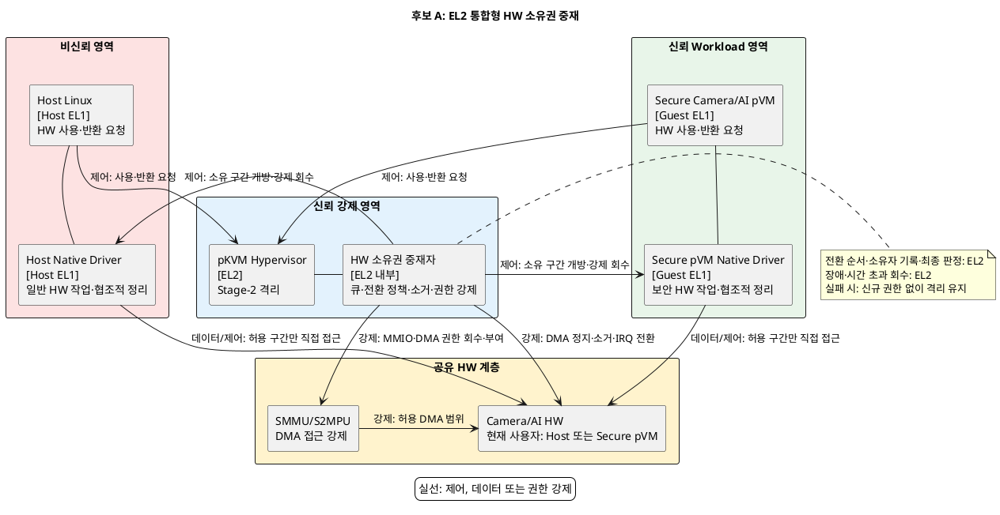
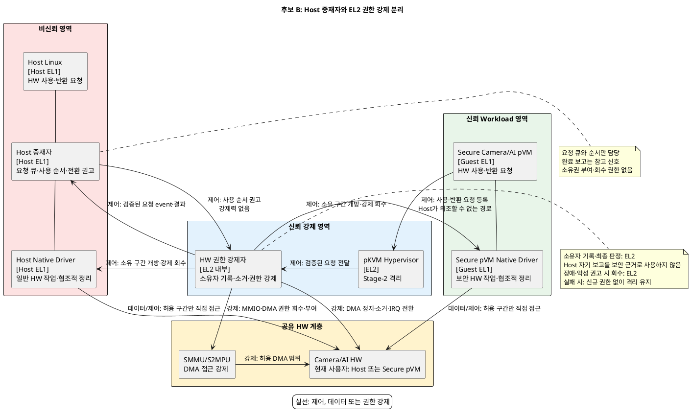

# 문제 1. HW 공유 시 기밀 데이터 노출 해결 후보 구조

## 1. 문서 목적

Camera/AI HW를 Host와 Secure pVM이 시분할할 때 기밀 데이터 노출을 차단하는 후보 구조 두 개를 정리한다.

두 후보는 다음 결정 질문에 대한 서로 다른 답이다.

> HW 전환의 실행 순서와 보안 강제를 모두 EL2 신뢰 계층에서 담당할 것인가,
> 실행 순서와 요청 큐는 Host 중재자에 두고 EL2는 보안 전환의 최종 강제에 집중할 것인가?

두 후보 모두 Host와 Secure pVM에 각각 Native Driver를 둔다.
차이는 Native Driver의 존재가 아니라 전환 순서와 요청 큐의 책임을 어디에 배치하는가다.

구체적인 드라이버 제품, 메시지 형식, 소거 알고리즘과 시간 초과 값은 이 문서의 결정 범위에 포함하지 않는다.

## 2. 공통 전제와 필수 조건

### 2.1 신뢰 전제

- Host Linux와 Host Native Driver, Host 중재자는 커널까지 침해될 수 있는 비신뢰 영역이다.
- Secure Camera/AI pVM, Secure pVM Native Driver와 pKVM Hypervisor는 신뢰 영역이다.
- SMMU/S2MPU는 Camera/AI HW의 DMA 접근 범위를 강제한다.
- Host와 Secure pVM의 Native Driver는 자신에게 HW 사용권이 부여된 구간에서만 HW에 직접 접근한다.
- HW의 현재 사용자는 Host 또는 Secure pVM 중 정확히 하나여야 한다.
- Host는 전환 순서를 제안할 수 있지만 HW 소유권을 직접 부여하거나 회수할 수 없다.

### 2.2 공통 전환 순서

두 후보 모두 다음 순서를 강제한다.

```text
요청 차단 → DMA 정지·완료 확인 → 진행 중인 처리 정리
          → MMIO·DMA·IRQ 권한 회수 → 잔류 상태 소거
          → 신규 소유자에게 MMIO·DMA·IRQ 권한 부여
```

이전 권한의 회수와 잔류 상태 소거가 확인되기 전에는 다음 사용자에게 권한을 부여하지 않는다.
전환 실패, 시간 초과 또는 pVM 비정상 종료 시에는 신규 권한을 부여하지 않고 HW를 격리 상태로 유지한다.

### 2.3 공통 보안 gate

1. EL2는 Host 중재자나 Host Native Driver의 완료 보고를 보안 판정 근거로 신뢰하지 않는다.
2. EL2는 DMA 정지와 진행 중인 transaction 종료를 HW 상태 또는 위조 불가능한 완료 신호로 확인한다.
3. EL2는 이전 소유자의 MMIO, Stage-2, SMMU/S2MPU 매핑과 IRQ routing을 직접 회수한다.
4. EL2 또는 EL2가 통제하는 신뢰 수단이 HW 내부 SRAM, 레지스터와 작업 상태의 reset/zeroize를 강제한다.
5. Native Driver의 협조적 정리와 완료 보고는 성능 최적화에 사용할 수 있지만 보안 전환의 필수 근거로 사용하지 않는다.
6. EL2는 현재 소유자와 전환 세대를 기록하고 오래되거나 중복된 전환 요청을 거부한다.
7. 회수·소거·검증 중 하나라도 실패하면 신규 권한을 부여하지 않는다.

---

## 3. 후보 A: EL2 통합형 HW 소유권 중재

### 3.1 구조적 핵심

pKVM Hypervisor 내부의 HW 소유권 중재자가 요청 큐, 전환 순서, 상태 머신, HW별 소거 절차와 접근권 강제를
모두 담당한다. Host와 Secure pVM의 Native Driver는 EL2가 부여한 소유 구간에서만 HW를 직접 제어한다.

CPU Stage-2 격리와 HW의 MMIO·DMA·IRQ 소유권 전환을 하나의 EL2 신뢰 계층에서 처리한다.

### 3.2 컴포넌트의 실행 위치와 책임

| 컴포넌트 | 실행 위치 | 책임 |
|---|---|---|
| Host Linux | Host EL1, 비신뢰 | 일반 기능을 위한 HW 사용·반환 요청 |
| Host Native Driver | Host EL1, 비신뢰 | 소유 구간의 일반 HW 작업과 협조적 정리 수행 |
| Secure Camera/AI pVM | Guest EL1, 신뢰·격리 | 보안 작업을 위한 HW 사용·반환 요청 |
| Secure pVM Native Driver | Guest EL1, 신뢰·격리 | 소유 구간의 보안 HW 작업과 협조적 정리 수행 |
| pKVM Hypervisor | EL2, 신뢰 | Stage-2 격리와 Host·pVM 요청의 호출 경계 제공 |
| HW 소유권 중재자 | pKVM 내부 EL2, 신뢰 | 요청 큐, 전환 순서, 상태 머신, 소유자 기록, DMA 정지 검증, HW 소거, MMIO·DMA·IRQ 권한 부여·회수 |
| SMMU/S2MPU | HW 보호 계층 | EL2가 설정한 DMA 접근 정책 강제 |
| Camera/AI HW | 공유 HW | Host와 Secure pVM이 배타적으로 시분할 |

현재 HW 사용자는 Host 또는 Secure pVM이다. 소유자 기록과 최종 권한 판정, 장애·시간 초과 시 강제 회수는
EL2의 HW 소유권 중재자가 담당한다.

### 3.3 구조 다이어그램



### 3.4 후보별 동작 구조

#### 정상 전환

1. Host 또는 Secure pVM이 EL2 중재자에게 HW 사용을 요청한다.
2. EL2 중재자가 요청 큐와 정책에 따라 다음 소유자를 선택하고 신규 요청을 차단한다.
3. EL2가 현재 Native Driver에 작업 정리를 요청한다.
4. EL2가 DMA 정지와 진행 중인 transaction 종료를 독립적으로 확인한다.
5. EL2가 기존 MMIO, Stage-2, SMMU/S2MPU 매핑과 IRQ routing을 회수한다.
6. EL2가 HW 잔류 상태를 reset/zeroize하고 완료를 확인한다.
7. EL2가 새 소유자에게만 MMIO·DMA·IRQ 권한을 부여하고 소유자 기록을 갱신한다.

#### 오류·비정상 종료

1. EL2가 전환 시간 초과, DMA 정지 실패 또는 pVM 종료를 감지한다.
2. EL2가 현재 소유자의 MMIO·DMA·IRQ 권한을 강제로 회수한다.
3. 안전한 소거 완료를 확인할 수 없으면 HW를 격리 상태로 유지한다.
4. 새 사용자에게 권한을 부여하지 않고 오류를 반환한다.

### 3.5 장점

- 요청 큐부터 실제 권한까지 EL2가 관리하므로 정책 상태와 HW 상태의 불일치 가능성이 낮다.
- 비신뢰 Host의 응답이나 스케줄링에 의존하지 않아 전환 경로가 짧다.
- Host 중재자가 없어 악성 스케줄링과 요청 누락의 영향을 줄일 수 있다.
- EL2가 직접 시간 초과와 비정상 종료를 감지하므로 강제 회수 경로가 단순하다.

### 3.6 단점

- 요청 큐, 스케줄링 정책과 HW별 전환 절차가 EL2에 포함되어 Hypervisor TCB와 검증 범위가 커진다.
- 신규 HW IP나 스케줄링 정책을 추가할 때 EL2 코드를 수정해야 할 가능성이 높다.
- HW별 코드 결함이 CPU 격리를 담당하는 Hypervisor의 안정성에 영향을 줄 수 있다.
- 정책, 소거와 권한 강제가 한 계층에 모여 장애 격리가 어렵다.

---

## 4. 후보 B: Host 중재자와 EL2 권한 강제 분리

### 4.1 구조적 핵심

Host와 Secure pVM에 각각 Native Driver를 두고, Host 중재자가 사용 순서와 요청 큐를 관리한다.
Host 중재자의 결과는 전환 권고이며 HW 소유권에 대한 강제력이 없다.

pKVM Hypervisor의 HW 권한 강제자는 현재 소유자와 전환 세대를 별도로 기록하고, DMA 정지 확인, MMIO·Stage-2·
SMMU/S2MPU·IRQ 권한 전환, 잔류 상태 소거와 fail-closed를 독립적으로 강제한다.

Host 중재자가 거짓 완료 보고나 잘못된 순서를 제출해도 EL2가 보안 gate를 통과시키지 않으면 소유권은 바뀌지 않는다.

### 4.2 컴포넌트의 실행 위치와 책임

| 컴포넌트 | 실행 위치 | 책임 |
|---|---|---|
| Host Linux | Host EL1, 비신뢰 | 일반 기능을 위한 HW 사용·반환 요청 |
| Host 중재자 | Host EL1, 비신뢰 | Host와 pVM 요청 큐, 사용 순서와 전환 시점 권고 |
| Host Native Driver | Host EL1, 비신뢰 | 소유 구간의 일반 HW 작업과 협조적 정리 수행 |
| Secure Camera/AI pVM | Guest EL1, 신뢰·격리 | 보안 작업을 위한 HW 사용·반환 요청 |
| Secure pVM Native Driver | Guest EL1, 신뢰·격리 | 소유 구간의 보안 HW 작업과 협조적 정리 수행 |
| pKVM Hypervisor | EL2, 신뢰 | Stage-2 격리와 Host·pVM 요청의 호출 경계 제공 |
| HW 권한 강제자 | pKVM 내부 EL2, 신뢰 | 단일 소유자와 전환 세대 기록, DMA 정지 검증, MMIO·DMA·IRQ 권한 회수·부여, 신뢰 가능한 reset/zeroize, 오류 시 격리 |
| SMMU/S2MPU | HW 보호 계층 | EL2가 설정한 DMA 접근 정책 강제 |
| Camera/AI HW | 공유 HW | Host와 Secure pVM이 배타적으로 시분할 |

현재 HW 사용자는 Host 또는 Secure pVM이다. Host 중재자는 다음 사용자를 권고하지만 소유권을 변경하지 못한다.
소유자 기록과 최종 권한 판정, 장애·시간 초과 시 회수는 EL2의 HW 권한 강제자가 담당한다.

### 4.3 구조 다이어그램



### 4.4 후보별 동작 구조

#### 정상 전환

1. Host 요청은 Host 중재자에게, Secure pVM 요청은 EL2 권한 강제자에게 등록된다.
2. EL2는 Secure pVM 요청을 Host가 위조할 수 없는 요청 event로 Host 중재자에게 제공한다.
3. Host 중재자가 요청 큐와 사용 순서에 따라 다음 소유자를 EL2에 권고한다.
4. EL2가 현재 소유자와 전환 세대를 확인하고 오래되거나 충돌하는 권고를 거부한다.
5. EL2가 현재 Native Driver에 협조적 작업 정리를 요청하되 완료 보고를 보안 근거로 신뢰하지 않는다.
6. EL2가 DMA 정지와 진행 중인 transaction 종료를 독립적으로 확인한다.
7. EL2가 기존 MMIO, Stage-2, SMMU/S2MPU 매핑과 IRQ routing을 회수한다.
8. EL2 또는 EL2가 통제하는 신뢰 수단이 HW 잔류 상태를 reset/zeroize하고 완료를 확인한다.
9. EL2가 새 소유자에게만 MMIO·DMA·IRQ 권한을 부여하고 소유자 기록을 갱신한다.
10. EL2가 전환 결과를 Host 중재자와 새 소유자에게 알린다.

#### 오류·비정상 종료

1. EL2가 Host 중재자 무응답, 악성 전환 권고, DMA 정지 실패 또는 pVM 비정상 종료를 감지한다.
2. EL2가 Host 권고와 무관하게 현재 소유자의 MMIO·DMA·IRQ 권한을 강제 회수한다.
3. reset/zeroize 완료를 확인할 수 없으면 HW를 격리 상태로 유지한다.
4. Host 중재자 장애 중에는 새 소유자를 선택하지 않지만 안전한 반납과 격리는 EL2가 독립적으로 완료한다.
5. Host의 순서 조작이나 요청 누락은 서비스 지연을 만들 수 있지만 비인가 권한 부여로 이어지지 않는다.

모든 오류 경로의 HW 접근권 회수 주체는 EL2 권한 강제자다.
Host 중재자는 회수 주체가 아니며 자신의 권고 결과로 HW 접근권을 직접 변경하지 못한다.

### 4.5 장점

- 요청 큐와 제품별 스케줄링 정책을 Host에서 변경할 수 있어 EL2 정책 코드의 증가를 줄일 수 있다.
- Host와 pVM의 Native Driver가 소유 구간에서 HW를 직접 제어하므로 기존 드라이버 구조를 재사용할 수 있다.
- 별도 신뢰 관리 pVM이 필요하지 않아 추가 VM의 CPU·메모리와 생명주기 비용이 없다.
- 신규 HW IP의 일반 동작과 스케줄링 정책을 Native Driver와 Host 중재자 중심으로 확장할 수 있다.
- Host 중재자 장애가 EL2의 강제 회수와 fail-closed 경로를 직접 손상하지 않는다.

### 4.6 단점

- 침해된 Host가 요청을 누락하거나 순서를 조작해 Secure pVM을 장기간 대기시키는 서비스 거부가 가능하다.
- Host 중재자, 두 Native Driver와 EL2 사이의 인터페이스와 상태 불일치를 추가로 검증해야 한다.
- EL2가 Host의 완료 보고를 신뢰하지 않으므로 DMA 정지와 소거를 독립적으로 확인하는 로직이 필요하다.
- 신뢰 가능한 HW reset/zeroize 수단이 없으면 후보 B는 보안 gate를 통과할 수 없다.
- Native Driver의 상태 형식이나 버전이 다르면 매 전환 시 전체 초기화가 필요해 전환 지연이 증가할 수 있다.
- 보안 핵심인 회수·소거가 EL2에 남으므로 EL2 TCB 감소 폭은 요청 큐와 스케줄링 정책에 한정된다.

---

## 5. 후보 구조 비교

| 비교 항목 | 후보 A: EL2 통합형 | 후보 B: Host 중재·EL2 강제 분리형 |
|---|---|---|
| 요청 큐와 사용 순서 | EL2 중재자 | 비신뢰 Host 중재자 |
| Native Driver 실행 위치 | Host와 Secure pVM | Host와 Secure pVM |
| DMA 정지와 transaction 종료 확인 | EL2 | EL2 |
| HW reset/zeroize 강제 | EL2 | EL2 또는 EL2 통제 신뢰 수단 |
| MMIO·DMA·IRQ 권한 최종 강제 | EL2 | EL2 |
| HW 소유자 기록과 최종 판정 | EL2 | EL2 |
| 장애 시 접근권 회수 | EL2 | EL2 |
| 신뢰 경계 | 전환 정책과 보안 강제를 EL2에 통합 | 비신뢰 Host의 권고와 EL2의 보안 강제를 분리 |
| 보안성 | 전환 경로가 단순하지만 EL2 TCB가 큼 | Host 입력 검증이 필요하며 보안 gate 미충족 시 선택 불가 |
| 성능 | Host 왕복이 없어 전환 지연에 유리 | Host 권고 왕복과 EL2 재검증 비용이 추가됨 |
| 신뢰성 | 정책과 실제 권한 상태가 일치하지만 EL2 장애 영향이 큼 | Host 장애가 서비스 지연을 만들지만 안전한 회수는 EL2가 유지 |
| 자원 효율 | 별도 중재 실행 환경이 필요 없음 | 기존 Host를 사용하므로 별도 신뢰 pVM이 필요 없음 |
| 확장성 | 신규 HW·정책 추가 시 EL2 수정 가능성이 큼 | 일반 동작과 스케줄링 정책을 Host·Native Driver 중심으로 확장 가능 |

### 핵심 트레이드오프

> 요청 큐와 전환 정책을 EL2에 통합하면 비신뢰 Host의 개입 없이 상태 일관성과 전환 지연을 관리할 수 있다.
> 대신 제품별 스케줄링 정책이 Hypervisor TCB와 변경 범위를 키운다.

> 요청 큐와 전환 순서를 Host 중재자에 두면 기존 Native Driver와 Host 정책을 재사용하고 EL2의 정책 변경을 줄일 수 있다.
> 대신 Host의 악성 스케줄링과 상태 위조를 항상 방어해야 하며 서비스 거부와 추가 검증 비용이 생긴다.

## 6. 검증 기준

### 6.1 공통 검증

- HW 사용권 중복 부여: **0회**
- 이전 소유자의 MMIO·DMA·IRQ 권한 잔존: **0회**
- 비인가 MMIO/DMA 접근 차단률: **100%**
- 전환 후 잔류 데이터 검출: **0건**
- 정상·오류별 HW 전환 지연: 평균, 최악값과 상위 백분위수 측정
- pVM 비정상 종료, DMA 시간 초과, 초기화 실패와 요청 폭주 시 fail-closed 동작률: **100%**

### 6.2 후보 B 필수 실현 가능성 gate

- Host의 DMA 정지·소거 완료 보고를 무시해도 EL2가 전환을 안전하게 완료할 수 있는가?
- EL2가 진행 중인 DMA transaction 종료를 직접 확인할 수 있는가?
- EL2가 MMIO, Stage-2, SMMU/S2MPU와 IRQ routing을 하나의 전환으로 회수할 수 있는가?
- EL2 또는 EL2가 통제하는 신뢰 수단이 Host와 독립적으로 HW reset/zeroize를 강제할 수 있는가?
- Host 중재자 종료와 악성 요청 순서에서도 EL2가 HW를 격리 상태로 유지할 수 있는가?
- Host가 Secure pVM의 요청·반납 event를 위조하거나 재사용할 수 없는가?

하나라도 확인되지 않으면 후보 B는 문제 1을 해결하는 구조가 아니라 보안 gate 실패 기준선으로만 남긴다.

## 7. Decision Point 성립 점검

1. 두 후보는 동일한 HW 공유 문제와 동일한 보안 조건을 다룬다.
2. 후보 A는 요청 큐·전환 정책·보안 강제를 EL2에 통합하고, 후보 B는 요청 큐와 사용 순서를 Host로 분리한다.
3. 두 후보는 전환 정책의 책임, 실행 위치와 신뢰 경계가 다르다.
4. 후보 A는 보안 경로 단순성과 전환 지연에 유리하고, 후보 B는 기존 구조 재사용과 정책 확장에 유리하다.
5. 후보 B의 보안 강제가 Host 완료 보고에 의존하면 구조적 후보가 아니라 gate 실패 기준선이 된다.
6. 후보 B의 실현 가능성 gate를 통과하면 어느 한 후보도 모든 품질속성에서 우월하지 않으므로 Decision Point가 성립한다.
