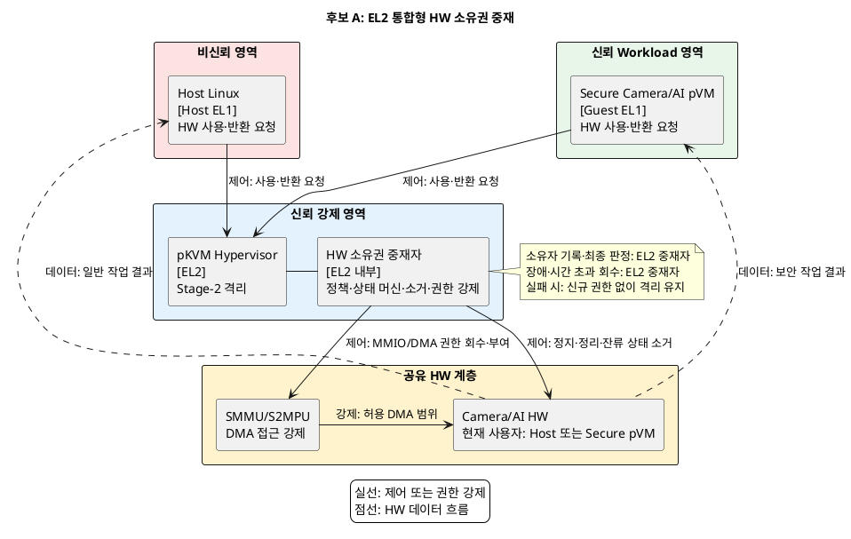
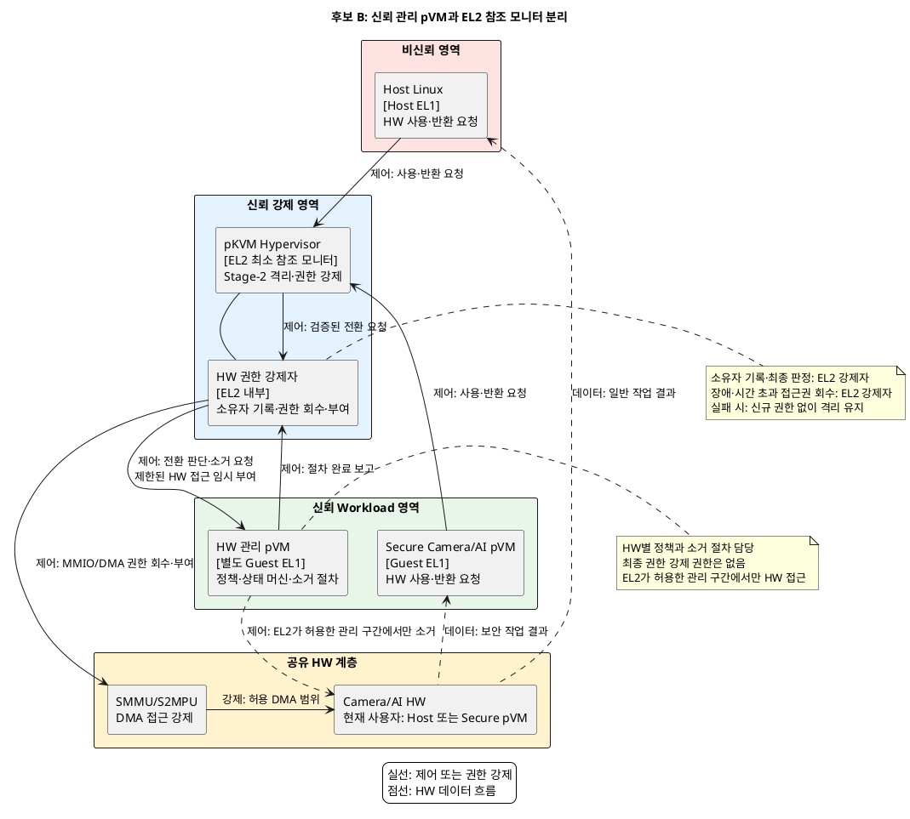

# 문제 1. HW 공유 시 기밀 데이터 노출 해결 후보 구조

## 1. 문서 목적

Camera/AI HW를 Host와 Secure pVM이 시분할할 때 기밀 데이터 노출을 차단하는 후보 구조 두 개를 정리한다.

두 후보는 다음 결정 질문에 대한 서로 다른 답이다.

> HW별 전환 정책·상태 머신·잔류 상태 소거 책임을 EL2에 통합할 것인가,
> 신뢰 관리 pVM으로 분리하고 EL2는 접근권 강제에 집중할 것인가?

구현 제품이나 세부 소거 알고리즘은 이 문서의 결정 범위에 포함하지 않는다.

## 2. 공통 전제와 필수 조건

### 2.1 신뢰 전제

- Host Linux는 커널까지 침해될 수 있는 비신뢰 영역이다.
- Secure Camera/AI pVM과 pKVM Hypervisor는 신뢰 영역이다.
- SMMU/S2MPU는 Camera/AI HW의 DMA 접근 범위를 강제한다.
- HW의 현재 사용자는 Host 또는 Secure pVM 중 정확히 하나여야 한다.
- Host는 HW 사용을 요청할 수 있지만 소유권을 직접 부여하거나 회수할 수 없다.

### 2.2 공통 전환 순서

두 후보 모두 다음 순서를 강제한다.

```text
요청 차단 → DMA 정지 → 진행 중인 처리 정리 → 기존 권한 회수
          → 잔류 상태 소거 → 신규 권한 부여
```

이전 권한의 회수와 잔류 상태 소거가 확인되기 전에는 다음 사용자에게 권한을 부여하지 않는다.
전환 실패, 시간 초과 또는 pVM 비정상 종료 시에는 신규 권한을 부여하지 않고 HW를 격리 상태로 유지한다.

---

## 3. 후보 A: EL2 통합형 HW 소유권 중재

### 3.1 구조적 핵심

pKVM Hypervisor 내부의 HW 소유권 중재자가 전환 정책, 상태 머신, HW별 소거 절차와 접근권 강제를 모두 담당한다.
CPU Stage-2 격리와 HW의 MMIO/DMA 소유권 전환을 하나의 EL2 신뢰 계층에서 처리한다.

### 3.2 컴포넌트의 실행 위치와 책임

| 컴포넌트 | 실행 위치 | 책임 |
|---|---|---|
| Host Linux | Host EL1, 비신뢰 | 일반 기능을 위한 HW 사용·반환 요청 |
| Secure Camera/AI pVM | Guest EL1, 신뢰·격리 | 보안 작업을 위한 HW 사용·반환 요청 |
| pKVM Hypervisor | EL2, 신뢰 | Stage-2 격리, 요청 전달과 호출 경계 제공 |
| HW 소유권 중재자 | pKVM 내부 EL2, 신뢰 | 전환 정책 판단, 상태 머신 관리, HW별 소거 수행, 소유자 기록, MMIO/DMA 권한 부여·회수 |
| SMMU/S2MPU | HW 보호 계층 | EL2가 설정한 DMA 접근 정책 강제 |
| Camera/AI HW | 공유 HW | Host와 Secure pVM이 배타적으로 시분할 |

현재 HW 사용자는 Host 또는 Secure pVM이다. 소유자 기록과 최종 권한 판정, 장애·시간 초과 시 강제 회수는
EL2의 HW 소유권 중재자가 담당한다.

### 3.3 구조 다이어그램



### 3.4 후보별 동작 구조

#### 정상 전환

1. Host 또는 Secure pVM이 EL2에 HW 사용을 요청한다.
2. EL2 중재자가 신규 요청을 차단하고 현재 소유자에게 작업 정지를 요구한다.
3. EL2 중재자가 DMA 정지와 진행 중인 처리의 종료를 확인한다.
4. EL2가 기존 MMIO, Stage-2와 SMMU/S2MPU 권한을 회수한다.
5. EL2 중재자가 HW별 잔류 상태 소거 절차를 실행하고 완료를 확인한다.
6. EL2가 새 소유자에게만 MMIO/DMA 권한을 부여하고 소유자 기록을 갱신한다.

#### 오류·비정상 종료

1. EL2가 전환 시간 초과, DMA 정지 실패 또는 pVM 종료를 감지한다.
2. EL2가 MMIO/DMA 권한을 강제로 회수하고 HW 접근을 차단한다.
3. 안전한 소거 완료를 확인할 수 없으면 HW를 격리 상태로 유지한다.
4. 새 사용자에게 권한을 부여하지 않고 오류를 반환한다.

### 3.5 장점

- 정책 판단부터 최종 권한 강제까지 EL2 내부에서 처리하므로 신뢰 계층 간 왕복이 없다.
- 전환 상태와 실제 Stage-2/SMMU 권한 상태를 한 주체가 관리해 상태 불일치 가능성이 낮다.
- 별도 관리 실행 환경이 필요하지 않아 런타임 자원과 배포 구성이 단순하다.
- EL2가 직접 시간 초과와 비정상 종료를 감지하므로 강제 회수 경로가 짧다.

### 3.6 단점

- HW별 정책과 소거 절차가 EL2에 포함되어 Hypervisor TCB와 검증 범위가 커진다.
- 신규 HW IP를 추가할 때 EL2 코드를 수정해야 할 가능성이 높다.
- HW별 코드 결함이 CPU 격리를 담당하는 Hypervisor의 안정성에 영향을 줄 수 있다.
- 정책, 소거와 권한 강제가 한 계층에 모여 장애 격리가 어렵다.

---

## 4. 후보 B: 신뢰 관리 pVM과 EL2 참조 모니터 분리

### 4.1 구조적 핵심

신뢰 관리 pVM이 HW별 전환 정책, 상태 머신과 잔류 상태 소거 절차를 담당한다.
pKVM Hypervisor는 HW IP에 독립적인 최소 참조 모니터로서 MMIO, Stage-2와 SMMU/S2MPU 권한의 부여·회수만
최종 강제한다.

관리 pVM은 전환 절차를 판단하고 실행하지만 최종 HW 접근권을 직접 변경하지 않는다.
관리 pVM의 완료 보고만으로 새 소유권이 성립하지 않으며 EL2가 실제 권한 상태를 확인한 뒤 전환을 확정한다.

### 4.2 컴포넌트의 실행 위치와 책임

| 컴포넌트 | 실행 위치 | 책임 |
|---|---|---|
| Host Linux | Host EL1, 비신뢰 | 일반 기능을 위한 HW 사용·반환 요청 |
| Secure Camera/AI pVM | Guest EL1, 신뢰·격리 | 보안 작업을 위한 HW 사용·반환 요청 |
| pKVM Hypervisor | EL2, 신뢰 | Stage-2 격리와 Host·pVM 요청의 호출 경계 제공 |
| HW 권한 강제자 | pKVM 내부 EL2, 신뢰 | 소유자 기록, MMIO/DMA 권한의 유일한 부여·회수, 오류 시 격리 |
| HW 관리 pVM | 별도 Guest EL1, 신뢰·격리 | HW별 정책 판단, 상태 머신 관리, 소거 절차 오케스트레이션과 완료 보고 |
| SMMU/S2MPU | HW 보호 계층 | EL2가 설정한 DMA 접근 정책 강제 |
| Camera/AI HW | 공유 HW | Host와 Secure pVM이 배타적으로 시분할 |

현재 HW 사용자는 Host 또는 Secure pVM이다. 전환 중 소거가 필요할 때만 EL2가 관리 pVM에 제한된 관리 권한을
부여한다. 소유자 기록과 최종 권한 판정, 장애·시간 초과 시 접근권 회수는 EL2가 담당한다.

### 4.3 구조 다이어그램



### 4.4 후보별 동작 구조

#### 정상 전환

1. Host 또는 Secure pVM이 EL2에 HW 사용을 요청한다.
2. EL2가 신규 요청을 차단하고 관리 pVM에 전환 판단을 요청한다.
3. 관리 pVM이 현재 소유자와 HW별 정책에 따라 정지·소거 절차를 결정한다.
4. EL2가 DMA 정지를 확인하고 기존 MMIO, Stage-2와 SMMU/S2MPU 권한을 회수한다.
5. EL2가 격리된 관리 구간에서 관리 pVM에 필요한 최소 HW 접근만 임시 부여한다.
6. 관리 pVM이 잔류 상태 소거를 수행하고 결과를 EL2에 보고한다.
7. EL2가 관리 권한을 회수하고 실제 접근권 상태를 확인한다.
8. EL2가 새 소유자에게만 MMIO/DMA 권한을 부여하고 소유자 기록을 갱신한다.

#### 오류·비정상 종료

1. EL2가 관리 pVM 응답 시간 초과, DMA 정지 실패 또는 소유자 pVM 종료를 감지한다.
2. EL2가 관리 pVM과 기존 소유자의 MMIO/DMA 권한을 모두 회수한다.
3. 소거 완료를 확인할 수 없으면 HW를 격리 상태로 유지하고 신규 권한을 부여하지 않는다.
4. 관리 pVM을 복구한 뒤 소거 절차를 처음부터 다시 수행한다.

관리 pVM 장애 시에도 EL2 단독으로 접근권 회수와 신규 접근 차단은 보장해야 한다.
관리 pVM 없이 잔류 상태까지 제거할 수 있는 범용 격리·초기화 수단의 실현 가능성은 별도 검증이 필요하다.

### 4.5 장점

- HW별 정책과 소거 절차가 EL2 밖에 있어 Hypervisor TCB와 검증 범위를 줄일 수 있다.
- 신규 HW IP는 관리 pVM의 정책 모듈로 추가할 수 있어 EL2 변경 가능성이 낮다.
- HW별 코드의 장애가 CPU 격리 계층에 직접 전파되는 범위를 줄인다.
- 관리 pVM을 독립적으로 재시작하거나 갱신할 수 있어 정책 변경과 장애 격리에 유리하다.

### 4.6 단점

- EL2와 관리 pVM 사이의 추가 왕복과 컨텍스트 전환으로 HW 전환 지연이 증가한다.
- 정책 상태와 실제 EL2 권한 상태를 맞추는 별도 프로토콜이 필요하다.
- 관리 pVM 장애 시 접근 차단은 가능하지만 잔류 상태 소거와 HW 재사용이 지연될 수 있다.
- 별도 pVM의 CPU·메모리와 생명주기 관리 비용이 추가된다.
- 관리 pVM에 제한된 HW 관리 권한을 안전하게 부여할 수 있는지 실현 가능성 검증이 필요하다.

---

## 5. 후보 구조 비교

| 비교 항목 | 후보 A: EL2 통합형 | 후보 B: 관리 pVM·EL2 분리형 |
|---|---|---|
| 정책·상태 머신 실행 위치 | EL2 | 신뢰 관리 pVM |
| HW별 소거 절차 실행 위치 | EL2 | 신뢰 관리 pVM |
| MMIO/DMA 권한 최종 강제 | EL2 | EL2 |
| HW 소유자 기록과 최종 판정 | EL2 | EL2 |
| 장애 시 접근권 회수 | EL2 | EL2 |
| 신뢰 경계 | 단일 EL2 신뢰 계층 | 관리 pVM과 최소 EL2 참조 모니터로 분리 |
| 보안성 | 통신 경로가 짧지만 EL2 TCB가 큼 | EL2 TCB는 작지만 계층 간 상태 검증이 추가됨 |
| 성능 | 신뢰 계층 간 왕복이 없어 전환 지연에 유리 | 관리 pVM 왕복과 컨텍스트 전환 비용이 추가됨 |
| 신뢰성 | 상태 불일치는 적지만 EL2 장애 영향이 큼 | HW별 정책 장애를 격리하지만 관리 pVM 장애 복구가 필요함 |
| 자원 효율 | 별도 관리 실행 환경이 필요 없음 | 별도 pVM의 CPU·메모리 자원이 필요함 |
| 확장성 | 신규 HW IP 추가 시 EL2 변경 가능성이 큼 | 관리 pVM 중심으로 HW별 정책을 확장할 수 있음 |

### 핵심 트레이드오프

> HW별 정책과 소거 책임을 EL2에 통합하면 전환 경로가 짧아져 성능과 상태 일관성에 유리하다.
> 대신 Hypervisor TCB와 HW 의존 코드가 증가해 검증 범위와 장애 영향이 커진다.

> HW별 책임을 관리 pVM으로 분리하면 EL2 TCB를 줄이고 신규 HW 확장과 장애 격리에 유리하다.
> 대신 계층 간 왕복과 상태 동기화가 추가되고 관리 pVM 장애 시 HW 재사용이 지연될 수 있다.

## 6. 공통 검증 기준

- HW 사용권 중복 부여: **0회**
- 이전 소유자의 DMA 매핑 잔존: **0회**
- 비인가 MMIO/DMA 접근 차단률: **100%**
- 전환 후 잔류 데이터 검출: **0건**
- 정상·오류별 HW 전환 지연: 평균, 최악값과 상위 백분위수 측정
- pVM 비정상 종료, DMA 시간 초과, 초기화 실패와 요청 폭주 시 fail-closed 동작률: **100%**

후보 B는 다음 실현 가능성도 확인해야 한다.

- 관리 pVM에 소거에 필요한 제한된 HW 접근만 부여할 수 있는가?
- 관리 pVM 장애와 무관하게 EL2가 MMIO/DMA 접근권을 회수할 수 있는가?
- 관리 pVM 없이도 HW를 재할당 불가능한 격리 상태로 만들 수 있는가?

위 조건이 확인되기 전에는 후보 B의 실현 가능성을 `확인 필요`로 유지한다.

## 7. Decision Point 성립 점검

1. 두 후보는 동일한 HW 공유 문제와 동일한 보안 조건을 다룬다.
2. 후보 A는 정책·소거·권한 강제를 EL2에 통합하고, 후보 B는 정책·소거를 관리 pVM으로 분리한다.
3. 두 후보는 책임, 실행 위치와 신뢰 경계가 다르다.
4. 후보 A는 성능과 상태 일관성에 유리하고, 후보 B는 TCB 축소와 확장성·장애 격리에 유리하다.
5. 하나의 후보가 모든 품질속성에서 우월하지 않으므로 구조적 트레이드오프가 성립한다.
