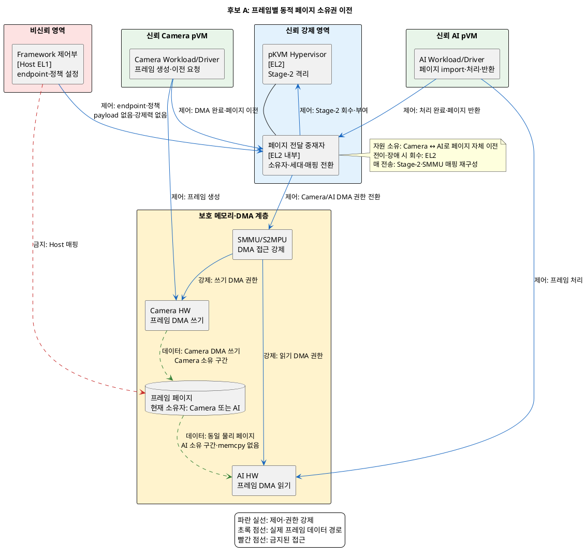
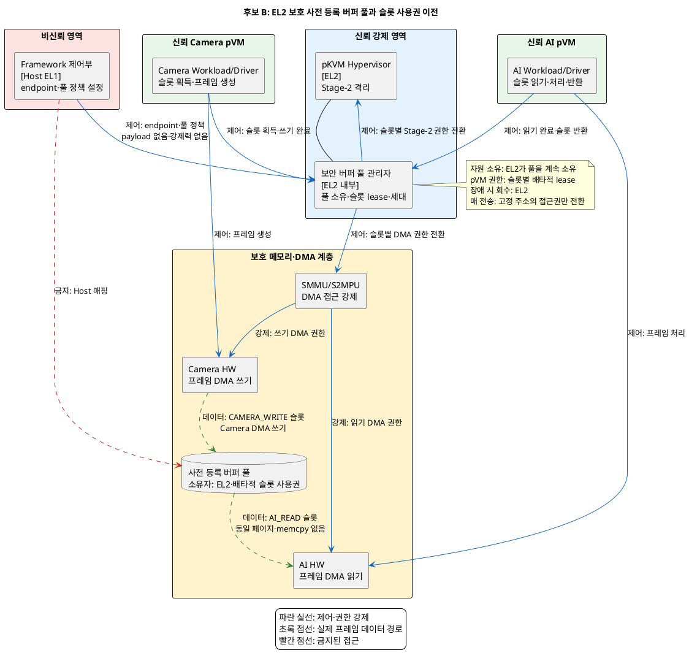

# 문제 2. pVM 간 대용량 데이터 전달 해결 후보 구조

## 1. 문서 목적

Secure Camera pVM이 생성한 프레임을 Secure AI pVM에 Host 비노출·zero-copy로 전달하는 후보 구조 두 개를 정리한다.

두 후보는 다음 결정 질문에 대한 서로 다른 답이다.

> 프레임마다 Camera pVM이 소유한 페이지 자체를 AI pVM으로 이전할 것인가,
> EL2가 소유하는 사전 등록 버퍼 풀을 유지하고 pVM에는 슬롯 사용권만 이전할 것인가?

두 후보 모두 실제 프레임을 Host로 복사하지 않고, EL2가 Stage-2와 SMMU/S2MPU 접근권을 최종 강제한다.
차이는 프레임 페이지의 소유 주체와 매 전송 시 변경하는 대상이 페이지 소유권인지 슬롯 사용권인지다.

구체적인 DMA-BUF 구현, pKVM 호출 ABI, 캐시 명령과 버퍼 개수는 이 문서의 결정 범위에 포함하지 않는다.

## 2. 공통 전제와 필수 조건

### 2.1 신뢰 전제

- Host Linux와 Framework 제어부는 커널까지 침해될 수 있는 비신뢰 영역이다.
- Secure Camera/AI pVM과 pKVM Hypervisor는 신뢰·격리 영역이다.
- Host는 endpoint 설정이나 제어 메시지를 중계할 수 있지만 프레임 페이지를 매핑할 수 없다.
- Host는 매 프레임 소유권 판정과 권한 전환 경로에 참여하지 않는다.
- pKVM은 버퍼 소유자, 접근 모드, 세대 번호와 상태를 Host가 위조할 수 없는 영역에 기록한다.
- SMMU/S2MPU는 Camera/AI HW의 DMA 접근권을 EL2 상태 전이와 일치하게 강제한다.
- 제어 명령은 프레임마다 발생할 수 있다. 데이터·제어 경로 분리는 빈도가 아니라 payload 비노출과 권한 검증을 위한 것이다.
- 한 버퍼를 읽거나 쓸 수 있는 pVM과 HW 조합은 각 상태에서 명시적으로 제한된다.

### 2.2 공통 전달 순서

두 후보 모두 다음 순서를 강제한다.

```text
Camera DMA 완료·fence 확인 → Camera CPU·DMA 쓰기 권한 회수
                            → cache 동기화 → 소유권/사용권 전이
                            → AI CPU·DMA 읽기 권한 부여 → AI 처리 완료
                            → AI 권한 회수 → 안전한 반환 또는 재사용
```

송신자의 쓰기 완료와 접근권 회수가 확인되기 전에는 수신자에게 권한을 부여하지 않는다.
시간 초과, 중복 반환 또는 pVM 비정상 종료 시에는 다음 사용권을 부여하지 않고 EL2가 버퍼를 회수하거나 폐기한다.

### 2.3 공통 보안 gate

1. 실제 프레임 `memcpy`는 0회여야 한다.
2. Host가 프레임 페이지를 매핑하거나 읽은 횟수는 0회여야 한다.
3. Camera pVM과 AI pVM의 접근권 중첩은 0회여야 한다.
4. 제3의 pVM과 비인가 HW의 접근은 모두 차단해야 한다.
5. EL2는 Host가 전달한 buffer ID, pVM ID와 완료 보고만으로 권한을 변경하지 않는다.
6. CPU Stage-2 권한과 Camera/AI HW의 DMA 권한을 같은 버퍼 상태 전이에 맞춰 변경한다.
7. DMA fence, cache 동기화와 메모리 접근 순서를 권한 전이의 필수 조건으로 검증한다.
8. 전송 세대가 오래됐거나 중복된 제어 명령을 거부한다.
9. 오류 시 버퍼를 무권한 격리 상태로 두고 새 소유자나 사용권자에게 넘기지 않는다.

---

## 3. 후보 A: 프레임별 동적 페이지 소유권 이전

### 3.1 구조적 핵심

Camera pVM이 소유한 프레임 페이지를 매 전송마다 EL2 전달 중재자를 통해 AI pVM으로 이전한다.
EL2는 기존 Stage-2·SMMU/S2MPU 매핑을 제거한 후 동일 물리 페이지를 AI pVM의 DMA-BUF 객체로 가져올 수 있게 한다.

페이지의 소유권은 `Camera pVM → EL2 전이 상태 → AI pVM → EL2 반환 상태 → Camera pVM`으로 이동한다.
EL2 전달 중재자가 현재 소유자와 세대를 기록하고 오류·비정상 종료 시 강제 회수한다.

### 3.2 컴포넌트의 실행 위치와 책임

| 컴포넌트 | 실행 위치 | 책임 |
|---|---|---|
| Framework 제어부 | Host EL1, 비신뢰 | pVM endpoint와 전달 정책 설정, payload 비접근 |
| Camera Workload/Driver | Camera pVM Guest EL1, 신뢰·격리 | 프레임 생성, DMA 완료 확인, 페이지 이전 요청 |
| AI Workload/Driver | AI pVM Guest EL1, 신뢰·격리 | 이전된 페이지 import, AI 처리, 페이지 반환 요청 |
| pKVM Hypervisor | EL2, 신뢰 | pVM 신원 검증과 Stage-2 격리 강제 |
| 페이지 전달 중재자 | pKVM 내부 EL2, 신뢰 | 페이지 소유자·세대·상태 기록, 이전 순서 검증, 매핑 회수·부여, 오류 시 강제 회수 |
| SMMU/S2MPU | HW 보호 계층 | Camera/AI HW의 DMA 접근권 강제 |
| Camera/AI HW | 공유 HW 계층 | 허용된 소유 구간에 프레임 DMA 쓰기·읽기 |
| 프레임 페이지 | 보호 물리 메모리 | 실제 영상 payload 보관, 전송 중 물리 위치 유지 |

결정 대상 자원은 프레임 페이지다. 정상 흐름에서는 현재 pVM이 소유하고, 전이·오류 중에는 EL2가 회수 권한을 갖는다.

### 3.3 구조 다이어그램



### 3.4 후보별 동작 구조

#### 정상 전달

1. Camera HW가 Camera pVM 소유 페이지에 프레임 쓰기를 완료하고 fence를 신호한다.
2. Camera pVM이 페이지 식별자와 세대를 EL2 전달 중재자에게 제출한다.
3. EL2가 송신 pVM, 페이지 소유자, 세대와 fence 완료를 검증한다.
4. EL2가 Camera pVM의 CPU Stage-2 권한과 Camera HW의 DMA 권한을 회수한다.
5. EL2가 cache 동기화를 수행하고 페이지를 무권한 전이 상태로 둔다.
6. EL2가 AI pVM에 Stage-2 읽기 권한과 AI HW의 DMA 읽기 권한을 부여한다.
7. AI pVM이 같은 물리 페이지를 자신의 DMA-BUF 객체로 import하여 처리한다.
8. AI 처리가 끝나면 EL2가 AI 권한을 회수하고 페이지를 Camera pVM에 반환한다.

#### 오류·비정상 종료

1. EL2가 fence 시간 초과, 잘못된 세대, 중복 반환 또는 pVM 종료를 감지한다.
2. EL2가 해당 pVM과 HW의 CPU·DMA 권한을 회수한다.
3. 페이지가 어느 pVM에도 매핑되지 않은 격리 상태인지 확인한다.
4. 안전한 원소유자를 확인할 수 있으면 반환하고, 확인할 수 없으면 페이지를 폐기·초기화한 뒤 새 버퍼로 대체한다.

### 3.5 장점

- 실제 사용 중인 프레임 페이지만 수신자에게 노출하므로 공유 범위와 접근 시간이 작다.
- 별도 고정 버퍼 풀을 예약하지 않아 입력 해상도와 동시 프레임 수 변화에 메모리를 탄력적으로 사용할 수 있다.
- 페이지 소유자가 명확해 임의의 제3 pVM이 미래·과거 프레임을 읽을 공격 표면을 줄인다.
- 송신 pVM의 기존 DMA-BUF 페이지를 그대로 이전하므로 실제 프레임 복사가 필요 없다.

### 3.6 단점

- 매 프레임 Stage-2와 SMMU/S2MPU 매핑을 제거·생성하고 TLB를 무효화해야 해 전달 지연이 증가할 수 있다.
- 서로 다른 pVM 커널의 DMA-BUF export/import와 페이지 수명주기를 매 전송마다 정합시켜야 한다.
- AI pVM 장애 중 소유된 페이지를 Camera pVM으로 되돌리는 복구 상태가 복잡하다.
- 페이지 단위 전달과 강제 회수 로직이 EL2에 포함되어 Hypervisor TCB와 검증 범위가 커진다.

---

## 4. 후보 B: EL2 보호 사전 등록 버퍼 풀과 슬롯 사용권 이전

### 4.1 구조적 핵심

EL2가 보호 물리 메모리에 고정 크기의 공유 버퍼 풀을 사전 등록하고 풀의 페이지를 계속 소유한다.
Camera pVM과 AI pVM에는 페이지 소유권이 아니라 각 슬롯의 배타적인 쓰기·읽기 사용권만 부여한다.

pVM의 가상 주소와 DMA 대상은 사전 등록하되 Stage-2·SMMU/S2MPU 접근권은 슬롯 상태에 따라 닫거나 연다.
EL2 풀 관리자가 `FREE → CAMERA_WRITE → IN_TRANSFER → AI_READ → RECLAIMING → FREE` 상태와 세대를 관리한다.

사전 등록은 슬롯 주소와 DMA descriptor 틀을 미리 준비한다는 뜻이다. 두 pVM에 CPU·DMA 접근권을 상시 열어두고
소유자 표시만 바꾸는 구조는 단일 소유권·최소 권한 gate를 실패하므로 후보 B에 포함하지 않는다.

### 4.2 컴포넌트의 실행 위치와 책임

| 컴포넌트 | 실행 위치 | 책임 |
|---|---|---|
| Framework 제어부 | Host EL1, 비신뢰 | pVM endpoint, 풀 크기와 정책 설정 요청, payload 비접근 |
| Camera Workload/Driver | Camera pVM Guest EL1, 신뢰·격리 | FREE 슬롯 획득, 프레임 생성, 쓰기 완료 통지 |
| AI Workload/Driver | AI pVM Guest EL1, 신뢰·격리 | AI_READ 슬롯 획득, 처리 완료와 반환 통지 |
| pKVM Hypervisor | EL2, 신뢰 | pVM 신원 검증과 Stage-2 격리 강제 |
| 보안 버퍼 풀 관리자 | pKVM 내부 EL2, 신뢰 | 풀 소유, 슬롯·세대·사용권 상태 관리, 접근권 전환, 오류 시 슬롯 회수 |
| SMMU/S2MPU | HW 보호 계층 | 슬롯 상태에 따른 Camera/AI HW DMA 접근권 강제 |
| Camera/AI HW | 공유 HW 계층 | 허용된 슬롯 lease 구간에 프레임 DMA 쓰기·읽기 |
| 사전 등록 버퍼 풀 | 보호 물리 메모리 | 고정 슬롯에 프레임 보관, pVM에는 배타적 사용권만 제공 |

결정 대상 자원의 소유자는 EL2 풀 관리자다. pVM은 슬롯 사용권만 빌리고, 정상·오류 경로의 회수도 EL2가 담당한다.

### 4.3 구조 다이어그램



### 4.4 후보별 동작 구조

#### 정상 전달

1. Camera pVM이 EL2 풀 관리자에게 FREE 슬롯을 요청한다.
2. EL2가 슬롯을 `CAMERA_WRITE`로 바꾸고 Camera pVM과 Camera HW에만 쓰기 권한을 부여한다.
3. Camera HW가 프레임 쓰기를 완료하고 fence를 신호한다.
4. EL2가 fence와 세대를 검증하고 Camera의 CPU·DMA 권한을 회수한다.
5. EL2가 cache를 동기화하고 슬롯을 `IN_TRANSFER` 무권한 상태로 전환한다.
6. EL2가 슬롯을 `AI_READ`로 바꾸고 AI pVM과 AI HW에만 읽기 권한을 부여한다.
7. AI 처리가 끝나면 EL2가 AI 권한을 회수하고 슬롯을 `RECLAIMING`을 거쳐 `FREE`로 반환한다.

#### 오류·비정상 종료

1. EL2가 fence 시간 초과, 오래된 세대, 슬롯 중복 반환 또는 pVM 종료를 감지한다.
2. EL2가 해당 슬롯의 모든 CPU·DMA 권한을 회수하고 `RECLAIMING` 상태로 둔다.
3. 진행 중인 DMA와 cache 정합성을 확인할 수 없으면 슬롯을 재사용하지 않는다.
4. 안전한 초기화가 끝난 슬롯만 `FREE`로 되돌리고, 풀 고갈 시 오류를 반환한다.

### 4.5 장점

- 페이지와 DMA 대상 주소를 미리 등록하므로 매 프레임 전체 매핑 생성·삭제를 줄일 수 있다.
- EL2가 풀과 슬롯 상태를 계속 소유해 pVM 장애 시 회수할 자원을 찾기 쉽다.
- 고정 슬롯과 세대 번호를 사용하므로 중복 반환, 순서 역전과 오래된 제어 명령을 판별하기 쉽다.
- 실제 프레임은 동일한 풀 페이지에 남아 있어 Host 복사와 pVM 간 `memcpy`가 필요 없다.

### 4.6 단점

- 최대 해상도, 동시 프레임과 pipeline depth를 기준으로 보호 메모리를 미리 예약해야 한다.
- 풀 크기가 작으면 요청 폭주나 AI 지연 시 슬롯이 고갈되고, 크면 사용하지 않는 메모리가 계속 점유된다.
- EL2 풀 관리자 장애나 상태 손상이 여러 Camera/AI 파이프라인에 영향을 줄 수 있다.
- 사전 등록 주소라도 매 슬롯의 Stage-2·SMMU 접근권은 프레임마다 전환해야 하며 그 비용은 PoC 확인이 필요하다.
- 신규 pVM이나 새 영상 형식을 추가할 때 풀 크기, endpoint ACL과 슬롯 정책을 갱신해야 한다.

---

## 5. 후보 구조 비교

| 비교 항목 | 후보 A: 동적 페이지 소유권 이전 | 후보 B: 사전 등록 풀·슬롯 사용권 이전 |
|---|---|---|
| 결정 대상 자원 | Camera pVM이 생성한 프레임 페이지 | EL2가 소유한 고정 버퍼 풀의 슬롯 |
| pVM에 부여하는 권리 | 페이지 소유권 | 슬롯의 배타적 쓰기·읽기 사용권 |
| 매 전송 변경 | Stage-2·SMMU 매핑과 페이지 소유자 | 고정 주소의 Stage-2·SMMU 접근권과 슬롯 상태 |
| 실제 프레임 경로 | Camera 페이지를 AI가 동일 물리 페이지로 import | EL2 풀의 동일 슬롯을 Camera와 AI가 순차 사용 |
| Host의 역할 | endpoint·정책 제어, payload 비접근 | endpoint·풀 정책 제어, payload 비접근 |
| 오류 시 회수 주체 | EL2 페이지 전달 중재자 | EL2 보안 버퍼 풀 관리자 |
| 보안성 | 사용 중인 페이지만 노출해 공유 범위가 작음 | 슬롯별 배타 권한 gate가 필요하며 풀 전체는 장기 유지됨 |
| 성능 | 매 프레임 매핑·TLB 전환 비용이 큼 | 사전 등록으로 매핑 생성·삭제를 줄이지만 권한 전환은 필요 |
| 자원 효율 | 실제 프레임 수요에 따라 페이지 사용 | 최대 부하 기준의 고정 보호 메모리 예약 |
| 신뢰성 | pVM 장애 시 이전 중인 페이지 반환 상태가 복잡 | 중앙 상태로 회수는 단순하지만 풀 고갈·관리자 장애 영향이 큼 |
| 확장성 | 임의 페이지 전달은 일반적이나 pVM별 import 검증 필요 | 새 endpoint·영상 형식마다 풀과 ACL 정책 조정 필요 |

두 후보가 공통 gate를 통과한다는 전제에서는 보안성의 합격 기준은 같다. 신뢰성은 오류 주입 시험으로 페이지 반환
복잡도와 중앙 풀의 장애 영향 범위를 각각 측정하며, 검증 전에는 어느 후보가 우월하다고 확정하지 않는다.

### 핵심 트레이드오프

> 프레임 페이지의 소유권을 매번 이전하면 필요한 페이지만 최소 시간 동안 공유하고 고정 메모리 예약을 줄일 수 있다.
> 대신 Stage-2·SMMU 매핑 재구성과 TLB 무효화가 매 프레임 전달 지연과 EL2 검증 범위를 늘린다.

> EL2가 사전 등록 풀을 소유하고 슬롯 사용권만 이전하면 반복 구간의 매핑 작업과 비정상 종료 시 자원 탐색을 줄일 수 있다.
> 대신 최대 부하 기준의 보호 메모리가 상시 예약되고 풀 고갈이나 관리자 장애가 여러 파이프라인으로 전파될 수 있다.

## 6. 검증 기준

### 6.1 공통 검증

- 실제 프레임 `memcpy` 호출 횟수: **0회**
- 전송 중 Host의 프레임 페이지 매핑 횟수: **0회**
- Camera와 AI의 CPU·DMA 접근권 중첩: **0회**
- 비인가 pVM/HW 접근 차단률: **100%**
- 1080p 30 fps 지속 입력 시 프레임 유실, 평균·최악·상위 백분위 전달 지연 측정
- pVM 비정상 종료와 시간 초과 후 버퍼 회수율: **100%**
- 다중 pVM에서 추가 보호 메모리 사용량과 버퍼 고갈 횟수 측정

### 6.2 후보 A 필수 실현 가능성 gate

- pKVM이 보호 페이지를 Host에 매핑하지 않고 한 pVM에서 다른 pVM으로 이전할 수 있는가?
- 수신 pVM이 이전된 페이지를 자신의 DMA-BUF 객체로 import할 수 있는가?
- 매 프레임 Stage-2와 SMMU/S2MPU 매핑 전환을 프레임 시간 예산 안에 완료할 수 있는가?
- pVM 비정상 종료 시 EL2가 이전 중이거나 AI가 소유한 페이지를 강제로 회수할 수 있는가?

하나라도 확인되지 않으면 후보 A는 선택 가능한 구조가 아니라 실현 가능성 미확인 상태로 남긴다.

### 6.3 후보 B 필수 실현 가능성 gate

- 두 pVM에 슬롯 접근권을 상시 열어두지 않고 매 lease 전환마다 EL2가 이전 권한을 실제로 회수하는가?
- EL2가 Host와 모든 비인가 pVM에서 매핑할 수 없는 보호 버퍼 풀을 사전 등록할 수 있는가?
- 고정 가상·DMA 주소를 유지하면서 슬롯별 Stage-2와 SMMU/S2MPU 접근권만 전환할 수 있는가?
- Camera와 AI가 동일 슬롯을 각자의 DMA-BUF 객체로 사용하되 동시에 접근하지 못하게 강제할 수 있는가?
- 슬롯 회수·초기화 지연과 최대 부하에서도 풀 고갈 없이 목표 frame rate를 유지할 수 있는가?

하나라도 확인되지 않으면 후보 B는 선택 가능한 구조가 아니라 실현 가능성 미확인 상태로 남긴다.

## 7. Decision Point 성립 점검

1. 두 후보는 동일한 Host 비노출·zero-copy pVM 간 프레임 전달 문제를 다룬다.
2. 후보 A는 pVM 사이에 페이지 소유권을 이전하고, 후보 B는 EL2가 페이지를 소유한 채 슬롯 사용권만 이전한다.
3. 두 후보는 결정 대상 자원의 소유권, 매 전송의 권한 전환 범위와 오류 회수 상태가 다르다.
4. 후보 A는 최소 공유 범위와 탄력적 메모리에 유리하고, 후보 B는 반복 전달 성능과 중앙 회수에 유리하다.
5. 두 후보 모두 Host 비노출, zero-copy와 배타 접근 gate를 통과해야만 선택 가능하다.
6. 두 후보의 실현 가능성 gate가 확인되기 전에는 조건부 결정 이상으로 진행하지 않는다.
