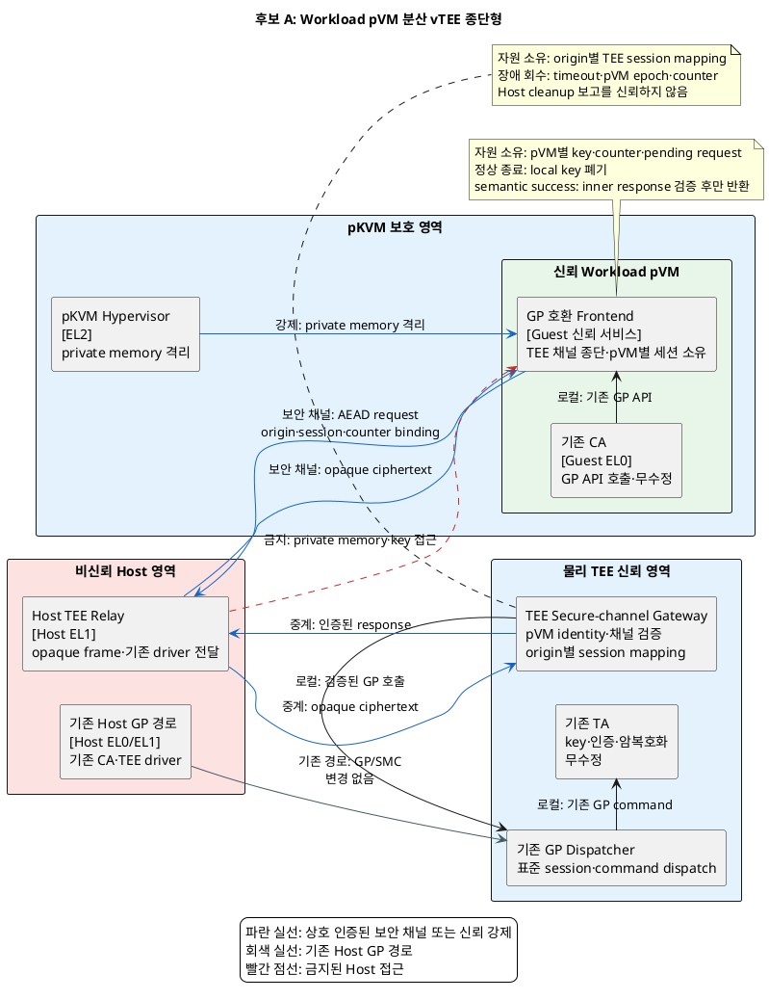
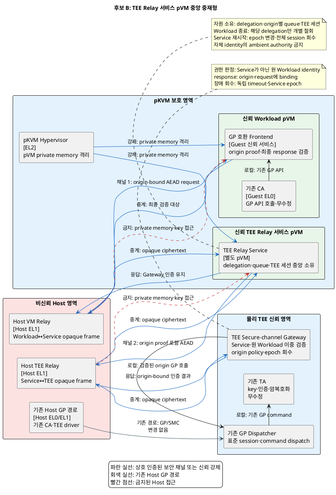

# 문제 3. pVM–GlobalPlatform 양방향 보안 연동 해결 후보 구조

> 문제 정의: [품질 위협 문제 3: pVM–GlobalPlatform 표준 연동 경로 부재](품질위협_문제3_GlobalPlatform_연동.md)
>
> 상세 근거: [pVM–Host 중계–GlobalPlatform TEE 구간의 양방향 보안 분석](pVM_Host중계_GlobalPlatform_양방향_보안분석.md)

## 1. 문서 목적

기존 Client Application(CA)과 Trusted Application(TA)의 GlobalPlatform(GP) API 표면을 유지하면서, pVM과
물리 TEE 사이의 비신뢰 Host 중계가 요청·응답을 관찰하거나 위조하지 못하게 하는 후보 구조 두 개를 정리한다.

두 후보는 다음 결정 질문에 대한 서로 다른 답이다.

> 각 Workload pVM이 TEE 보안 채널과 GP 세션을 직접 소유할 것인가,
> 전용 TEE Relay 서비스 pVM이 여러 Workload pVM의 TEE 세션과 위임 정책을 중앙 소유할 것인가?

두 후보 모두 Host를 opaque message만 전달하는 비신뢰 transport로 취급하고, TEE Gateway가 검증한 inner
response 뒤에만 CA에 semantic success를 반환한다. 차이는 pVM 측 신뢰 종단점의 실행 위치, TEE 세션·인가
상태의 소유 주체와 장애 영향 범위다.

기존 CA·TA를 직접 수정하는 application payload AEAD는 GP 자산 무수정 요구를 위반하므로 후보에서 제외한다.
pVM이 TEE를 직접 SMC/FF-A endpoint로 호출하는 구조는 대상 pKVM의 protected guest→Secure World routing이
없거나 EL2 변경이 과제 범위 밖인 환경에서는 실현 가능성 gate를 통과하지 못하므로 후보로 두지 않는다.

구체적인 암호 알고리즘, wire format, timeout 값과 Secure OS 제품은 이 문서의 결정 범위에 포함하지 않는다.

## 2. 공통 전제와 필수 조건

### 2.1 신뢰 전제

- Host Linux, Host kernel, VMM과 Host GP relay는 커널까지 침해될 수 있는 비신뢰 영역이다.
- Workload pVM, pVM 내부 GP 호환 Frontend와 pKVM의 격리 기능은 신뢰 영역이다.
- 후보 B의 TEE Relay 서비스 pVM은 신뢰 영역이지만, 침해·장애 시 여러 Workload에 영향을 주는 별도 TCB다.
- 물리 TEE, TEE Secure-channel Gateway, GP Dispatcher와 기존 TA는 신뢰 영역이다.
- pVM과 TEE의 private memory, session key와 counter는 Host가 읽거나 변경할 수 없어야 한다.
- Host는 message 관찰, 삭제, 지연, 변조, 위조, 중복, 재전송과 routing 변경을 수행할 수 있다.
- pVM image와 Workload identity는 DICE/attestation chain으로 검증할 수 있다고 가정한다.
- TEE Gateway identity는 Host가 바꿀 수 없는 boot chain, certificate chain 또는 pVM trust anchor로 검증한다.
- Host가 scheduling과 relay를 거부할 수 있으므로 가용성은 보장 대상이 아니며 timeout·복구로만 완화한다.
- 기존 Host→TEE GP Client·driver·SMC 경로와 기존 CA·TA의 동작은 회귀 없이 유지한다.

### 2.2 공통 요청·응답 순서

두 후보 모두 다음 보안 순서를 강제한다.

```text
GP 호출 수신 → 호출 pVM·Workload identity 검증 → 보안 세션·epoch 확인
             → command·session·request ID·counter·type·length 인증
             → TEE private copy 검증 → 기존 TA 호출
             → semantic status·payload를 request에 binding해 인증
             → pVM Frontend 검증 → 기존 CA에 GP 결과 반환
```

외부 `TEEC_Result`, `returnOrigin`, session handle과 parameter metadata는 transport 상태일 뿐 보안 성공의 근거가
아니다. pVM Frontend는 자신의 request ID와 nonce에 binding된 inner response를 검증한 뒤에만 CA에 성공을
반환한다. 인증 실패, response 누락, 오래된 counter 또는 identity 불일치는 모두 fail-closed한다.

### 2.3 공통 보안 gate

1. Host에서 GP 명령 인자, key, plaintext와 반환 payload가 관찰된 건수는 0건이어야 한다.
2. Host가 위조·변조·재전송한 요청이 TA 호출로 성립한 건수는 0건이어야 한다.
3. Host가 위조·변조·재전송한 응답이 CA의 보안 성공으로 수용된 건수는 0건이어야 한다.
4. GP login token만으로 pVM 또는 Workload identity를 인증하지 않는다.
5. pVM 측 신뢰 종단점과 TEE Gateway가 Host 독립 trust anchor로 상호 identity를 검증한다.
6. command, secure session, origin identity, request ID, counter, 실제 type·length·status를 인증 범위에 포함한다.
7. outer GP 성공값은 inner response 검증을 생략하거나 보안 제어 흐름을 성공 방향으로 바꿀 수 없다.
8. Host frame과 Shared Memory는 volatile·악성 입력으로 취급하고 private copy 후 복사본만 검증·사용한다.
9. pVM Frontend와 TEE Gateway parser는 인증 이전 malformed input에도 memory-safe해야 한다.
10. pVM별 session·key·counter·공유 메모리 식별자 공간을 분리하고 다른 origin의 응답을 거부한다.
11. pVM·중계 종단점 종료와 epoch 변경 시 Host 보고에 의존하지 않고 stale session을 일괄 또는 개별 회수한다.
12. 응답 유실 후 재시도가 상태를 중복 변경하지 않도록 request ID별 idempotency 또는 결과 조회를 제공한다.
13. Gateway와 TA는 attestation 성공 여부와 무관하게 모든 CA command·parameter·payload를 악성 입력으로 검증한다.
14. Host의 relay 거부는 보안 성공 위조가 아니라 timeout·통신 실패로만 나타나야 한다.

### 2.4 공통 호환성 gate

1. 기존 CA·TA 원본 소스 변경은 0 LoC여야 한다.
2. 기존 Host→TEE GP Client·driver·SMC 경로의 회귀 시험 통과율은 100%여야 한다.
3. session, command, cancellation, Shared Memory와 오류 반환의 GP 동작 의미를 유지해야 한다.

---

## 3. 후보 A: Workload pVM 분산 vTEE 종단형

### 3.1 구조적 핵심

각 Workload pVM의 GP 호환 Frontend가 TEE Secure-channel Gateway와 직접 상호 인증 채널을 종단한다. Frontend는
기존 CA에 GP Client API와 device 동작을 제공하고, pVM별 session key, request counter와 pending request를
소유한다.

Host TEE Relay는 암호문 frame을 기존 TEE driver 경로로 전달할 뿐 identity, command, payload와 semantic
status를 해석하거나 생성하지 않는다. TEE Gateway는 Workload pVM의 DICE identity와 정책을 직접 검증하고,
검증된 origin별 GP session을 기존 GP Dispatcher와 TA 호출로 mapping한다.

결정 대상 자원은 **Workload pVM별 보안 채널, GP session mapping, key, counter와 pending request**다. pVM 측
자원은 각 Frontend가, TEE 측 mapping은 Gateway가 분산 소유한다. pVM 종료 시 Frontend가 local key를 폐기하고,
Gateway는 Host 보고가 아닌 session timeout·pVM epoch와 counter로 해당 pVM session을 회수한다.

### 3.2 컴포넌트의 실행 위치와 책임

| 컴포넌트 | 실행 위치 | 책임 |
|---|---|---|
| 기존 CA | Workload pVM Guest EL0, 신뢰·격리 | 기존 GP Client API로 TA 기능 호출, 원본 수정 없음 |
| GP 호환 Frontend | Workload pVM Guest EL1/EL0 신뢰 서비스 | GP API·device emulation, TEE Gateway 상호 인증, pVM별 key·counter·pending request 소유, inner response 검증 |
| pKVM Hypervisor | EL2, 신뢰 | pVM private memory와 Host memory 격리, TEE routing에는 참여하지 않음 |
| Host TEE Relay | Host EL1, 비신뢰 | 암호문 frame을 기존 TEE driver/SMC 경로로 전달, 보안 판단·session 소유권 없음 |
| 기존 Host GP 경로 | Host EL0/EL1, 비신뢰 | 기존 Host CA의 GP 호출을 기존 경로로 전달, pVM channel과 분리 |
| TEE Secure-channel Gateway | 물리 TEE, 신뢰 | pVM DICE identity·policy 검증, channel 종단, origin별 GP session mapping, replay·response 인증, 오류 시 회수 |
| 기존 GP Dispatcher | 물리 TEE Secure OS, 신뢰 | 표준 GP session·command를 기존 TA로 dispatch |
| 기존 TA | 물리 TEE, 신뢰 | 기존 key 관리·인증·암복호화 수행, 원본 수정 없음 |

### 3.3 구조 다이어그램



### 3.4 후보별 동작 구조

#### 정상 호출

1. 기존 CA가 pVM의 GP 호환 Frontend에 `TEEC_OpenSession` 또는 command를 호출한다.
2. Frontend가 TEE Gateway identity를 검증하고 자신의 DICE identity·ephemeral key로 상호 인증한다.
3. Gateway가 Workload measurement, version, debug 상태와 허용 TA·command 정책을 검증한다.
4. 양측이 pVM별 session key와 epoch를 수립하고 Gateway가 origin별 GP session mapping을 만든다.
5. Frontend가 command, request ID, counter, 실제 parameter type·length와 payload를 인증·암호화한다.
6. Host TEE Relay가 opaque frame을 기존 TEE driver 경로로 Gateway에 전달한다.
7. Gateway가 frame을 private memory로 복사해 검증한 뒤 기존 GP Dispatcher를 통해 TA를 호출한다.
8. Gateway가 semantic status와 output을 원래 request·origin에 binding해 인증하고 반환한다.
9. Frontend가 inner response를 검증한 뒤에만 기존 CA에 GP 성공과 output parameter를 반환한다.

#### 오류·비정상 종료

1. Frontend 또는 Gateway가 위조 tag, 오래된 counter, 잘못된 origin·request ID를 탐지하면 frame을 거부한다.
2. Host가 outer `TEEC_SUCCESS`를 위조해도 inner response가 없으면 Frontend는 통신 실패를 반환한다.
3. Host가 정상 응답을 삭제하면 Frontend는 request ID로 처리 결과를 조회하거나 idempotent 재시도를 수행한다.
4. Workload pVM 종료 시 local key는 pVM과 함께 폐기되고 Gateway는 heartbeat timeout·epoch로 session을 회수한다.
5. Gateway는 pVM 생성 폭주와 stale session을 origin별 quota·TTL로 제한해 TEE resource를 보호한다.

### 3.5 장점

- Workload pVM과 TEE Gateway가 semantic message를 직접 인증하므로 중간 신뢰 대리자의 confused-deputy 위험이 작다.
- 한 Workload pVM의 Frontend 장애·침해가 다른 pVM의 channel key와 GP session으로 직접 전파되지 않는다.
- Workload pVM→서비스 pVM의 추가 왕복이 없어 후보 B보다 호출 지연과 scheduling 의존성이 작다.
- pVM별 identity, policy, counter와 session이 구조적으로 분리되어 원신원 추적과 개별 철회가 단순하다.
- 별도 서비스 pVM의 CPU·memory·boot·health 관리 비용이 없다.

### 3.6 단점

- channel, attestation, parser와 replay 방어 코드가 모든 Workload pVM image에 포함되어 코드·검증 범위가 중복된다.
- Frontend 보안 protocol을 변경하면 각 pVM image measurement와 배포물을 함께 갱신해야 할 수 있다.
- TEE Gateway의 identity policy와 session table이 Workload pVM 수에 비례해 증가한다.
- Host가 pVM 생성·session open을 반복하면 Gateway resource 고갈을 유발할 수 있어 origin quota가 필요하다.
- Secure OS 교체 시 각 Frontend와 새 Gateway의 protocol 적합성을 조합별로 회귀 시험해야 한다.

---

## 4. 후보 B: TEE Relay 서비스 pVM 중앙 중재형

### 4.1 구조적 핵심

각 Workload pVM의 GP 호환 Frontend는 TEE Gateway와 직접 transport session을 소유하지 않고, 전용 TEE Relay
서비스 pVM과 상호 인증 채널을 맺는다. 서비스 pVM은 Workload origin별 delegation table, 요청 queue, TEE
Gateway channel과 proxied GP session을 중앙 소유한다.

서비스 pVM은 자신의 identity를 ambient authority로 사용하지 않는다. Workload Frontend가 만든 origin-bound
inner envelope와 identity proof를 TEE Gateway까지 보존하며, Gateway는 서비스 pVM identity가 아니라 검증된
원 Workload identity를 기준으로 TA·command policy를 적용한다. Gateway의 response도 원 request와 Workload
identity에 binding되어 최종 Workload Frontend가 직접 검증한다.

결정 대상 자원은 **Workload별 delegation, 서비스 pVM의 TEE channel·GP session, origin별 queue·counter와
pending request**다. 서비스 pVM과 Gateway가 이를 중앙 소유한다. 특정 Workload 종료 시 해당 delegation만
개별 철회하고, 서비스 pVM 재시작 시 Gateway가 새 epoch를 발급해 이전 epoch의 전체 session을 일괄 회수한다.

### 4.2 컴포넌트의 실행 위치와 책임

| 컴포넌트 | 실행 위치 | 책임 |
|---|---|---|
| 기존 CA | Workload pVM Guest EL0, 신뢰·격리 | 기존 GP Client API로 TA 기능 호출, 원본 수정 없음 |
| GP 호환 Frontend | Workload pVM Guest EL1/EL0 신뢰 서비스 | GP API·device emulation, 서비스 pVM 상호 인증, origin proof 생성, Gateway response 최종 검증 |
| pKVM Hypervisor | EL2, 신뢰 | Workload·서비스 pVM private memory와 Host memory 격리 |
| Host VM Relay | Host EL1, 비신뢰 | Workload pVM↔서비스 pVM opaque frame 전달, 보안 판단 없음 |
| TEE Relay 서비스 pVM | 별도 pVM Guest EL1/EL0, 신뢰 | Workload identity 검증, delegation·queue·TEE channel·proxied session 중앙 소유, origin proof 보존, 개별·전체 회수 |
| Host TEE Relay | Host EL1, 비신뢰 | 서비스 pVM↔TEE Gateway opaque frame을 기존 driver로 전달 |
| 기존 Host GP 경로 | Host EL0/EL1, 비신뢰 | 기존 Host CA의 GP 호출을 기존 경로로 전달, pVM channel과 분리 |
| TEE Secure-channel Gateway | 물리 TEE, 신뢰 | 서비스 pVM·원 Workload identity 이중 검증, origin별 policy 적용, response origin binding, epoch별 회수 |
| 기존 GP Dispatcher | 물리 TEE Secure OS, 신뢰 | 표준 GP session·command를 기존 TA로 dispatch |
| 기존 TA | 물리 TEE, 신뢰 | 기존 key 관리·인증·암복호화 수행, 원본 수정 없음 |

### 4.3 구조 다이어그램



### 4.4 후보별 동작 구조

#### 정상 호출

1. 기존 CA가 Workload pVM의 GP 호환 Frontend에 session 또는 command를 호출한다.
2. Frontend와 TEE Relay 서비스 pVM이 서로의 DICE identity를 검증하고 Host를 통과하는 channel 1을 수립한다.
3. Frontend가 origin identity, command, request ID, counter와 parameter 의미를 포함한 origin proof를 생성한다.
4. 서비스 pVM이 origin proof와 허용 TA·command를 검증하고 Workload별 delegation·queue에 요청을 등록한다.
5. 서비스 pVM과 TEE Gateway가 channel 2를 수립하고, 서비스 epoch와 원 Workload proof를 함께 전달한다.
6. Gateway가 서비스 pVM과 원 Workload identity를 모두 검증하고 원 Workload 기준으로 policy를 적용한다.
7. Gateway가 origin별 GP session mapping을 통해 기존 GP Dispatcher와 TA를 호출한다.
8. Gateway가 semantic status와 output을 원 Workload·request에 binding해 인증한다.
9. 서비스 pVM은 Gateway 인증을 유지한 채 response를 원 Workload queue와 channel 1로 전달한다.
10. Workload Frontend가 Gateway의 inner response를 최종 검증한 뒤에만 CA에 GP 성공을 반환한다.

#### 오류·비정상 종료

1. 원신원 proof가 없거나 실패하면 서비스 pVM과 Gateway는 서비스 pVM identity로 권한을 격상하지 않고 거부한다.
2. 다른 Workload의 request ID·nonce에 binding된 response는 최종 Frontend가 직접 거부한다.
3. 특정 Workload pVM이 종료되면 서비스 pVM과 Gateway가 해당 delegation·queue·proxied session만 개별 철회한다.
4. 서비스 pVM heartbeat가 끊기면 Gateway가 Host나 서비스의 종료 보고 없이 timeout으로 전체 proxied session을 닫는다.
5. 서비스 pVM 재시작 시 Gateway가 새 monotonic epoch를 발급하고 이전 epoch의 key·counter·session을 모두 무효화한다.
6. 응답 유실 시 origin별 request journal로 결과를 조회하고 동일 request ID의 상태 변경을 중복 실행하지 않는다.

### 4.5 장점

- TEE channel, attestation policy와 Secure OS adapter를 한 서비스 pVM에 집중해 Workload pVM별 중복을 줄인다.
- 신규 Workload는 경량 GP Frontend와 origin policy 등록으로 추가할 수 있어 protocol 변경과 Secure OS 교체 영향이 집중된다.
- TEE Gateway의 transport channel 수와 물리 TEE session을 pooling하여 다중 pVM 확장 시 자원 사용을 줄일 여지가 있다.
- Workload별 queue, rate limit와 공정성 정책을 한곳에서 일관되게 적용할 수 있다.
- 특정 Workload delegation만 개별 철회하고 서비스 epoch로 전체 stale session을 일괄 회수할 수 있다.

### 4.6 단점

- 서비스 pVM의 장애·침해·정책 오류가 모든 Workload pVM의 TEE 접근에 영향을 주는 단일 장애점과 큰 blast radius를 만든다.
- Workload pVM→서비스 pVM→TEE의 추가 hop, 암복호화와 scheduling이 호출 지연을 늘린다.
- 서비스 pVM identity로 원 Workload identity가 collapse되면 기존 TA 권한을 우회하는 confused-deputy 취약점이 생긴다.
- origin proof, delegation, channel 2와 Gateway response의 end-to-end binding을 함께 검증해야 해 protocol 상태가 복잡하다.
- 서비스 pVM CPU·memory, secure boot, update, health monitoring과 복구 자원이 추가된다.
- session pooling이 GP cancellation, concurrency와 client별 state 의미를 바꾸지 않는지 별도 호환 검증이 필요하다.

---

## 5. 후보 구조 비교

| 비교 항목 | 후보 A: Workload pVM 분산 종단 | 후보 B: 서비스 pVM 중앙 중재 |
|---|---|---|
| pVM 측 신뢰 종단점 | 각 Workload pVM Frontend | 전용 TEE Relay 서비스 pVM, Workload에는 origin Frontend 유지 |
| Host 역할 | pVM↔TEE opaque frame 중계 | Workload↔Service와 Service↔TEE의 두 opaque channel 중계 |
| TEE channel 소유 | Workload pVM별 Frontend·Gateway | 서비스 pVM·Gateway가 중앙 소유 |
| 원 Workload identity 검증 | Gateway가 직접 검증 | 서비스와 Gateway가 이중 검증, origin proof 보존 필수 |
| GP session mapping | Gateway에 origin별 분산 session | 서비스 delegation·Gateway proxied session |
| 응답 최종 검증 | 각 Workload Frontend | 각 Workload Frontend가 Gateway response를 직접 검증 |
| 정상 종료 회수 | Frontend local 폐기, Gateway origin session 회수 | 서비스가 delegation 개별 회수, Gateway proxied session 회수 |
| 중계 종단점 장애 회수 | Gateway timeout·pVM epoch별 개별 회수 | Gateway timeout·서비스 epoch로 전체 회수 |
| 보안성 | 중간 신뢰 대리자가 없어 confused-deputy 위험이 작음 | 원신원 collapse 방지가 필수이며 서비스 침해 blast radius가 큼 |
| 성능 | Host 왕복 1회, pVM별 crypto 수행 | Host 왕복 2회와 추가 scheduling, pooling 최적화 여지 |
| 신뢰성 | pVM별 장애 격리, Gateway session table 증가 | 중앙 복구·정책 일관성, 단일 장애점 발생 |
| 자원 효율 | 코드·key·channel state가 pVM 수에 비례 | 별도 pVM 자원이 필요하지만 TEE channel·session pooling 가능 |
| 변경 용이성 | protocol 변경 시 여러 pVM image 갱신 | 서비스 pVM 중심 갱신, 경량 Frontend ABI 안정성 필요 |
| 확장성 | Gateway가 모든 pVM identity·session을 직접 관리 | 서비스가 origin queue·delegation을 중앙 관리 |
| 기존 CA·TA 호환 | 원본 수정 0 LoC가 공통 gate | 원본 수정 0 LoC가 공통 gate, 대리 session 의미 보존 필요 |
| 잔여 위험 | Host DoS, traffic metadata, Gateway 자원 고갈 | Host DoS, traffic metadata, 서비스 pVM 장애·권한 격상 |

두 후보가 공통 gate를 통과한다는 전제에서는 Host의 결과 위조를 보안 성공으로 수용하지 않는 합격 기준은 같다.
차이는 채널·session·인가 책임을 각 Workload에 분산할지 서비스 pVM에 중앙화할지와 그에 따른 지연, 변경 범위,
자원 사용과 장애 반경이다.

### 핵심 트레이드오프

> 각 Workload pVM이 TEE channel을 직접 종단하면 추가 신뢰 대리자 없이 origin과 session을 자연스럽게 분리하고
> 호출 지연과 장애 전파를 줄일 수 있다. 대신 channel·attestation 코드와 Gateway session state가 pVM 수에 따라
> 중복되고 protocol 변경 시 여러 pVM image를 재검증해야 한다.

> 전용 서비스 pVM이 TEE session과 위임을 중앙화하면 보안 protocol, Secure OS adapter와 resource policy를
> 한곳에서 변경하고 pooling할 수 있다. 대신 추가 hop과 단일 장애점이 생기며, 원 Workload identity를 끝까지
> 보존하지 않으면 중앙 서비스가 모든 TA 권한을 가진 confused deputy가 된다.

## 6. 검증 기준

### 6.1 공통 검증

- 기존 CA·TA 원본 소스 변경: **0 LoC**
- 기존 Host→TEE GP Client/TA 회귀 시험 통과율: **100%**
- GP TEE Client API 적합성 시험 통과율: **100%**
- Host memory·relay log·buffer dump에서 key·plaintext 관찰: **0건**
- 비인가·위장 pVM의 TA command 성립: **0건**
- 위조·변조·재전송 response의 semantic success 수용: **0건**
- outer `TEEC_SUCCESS`만으로 보안 성공을 판단한 횟수: **0회**
- origin·session·request ID·counter가 다른 response 수용: **0건**
- malformed Host frame에서 Frontend·Gateway crash 또는 memory corruption: **0건**
- 동일 request ID 재처리로 발생한 중복 상태 변경: **0건**
- pVM 종료·timeout 후 session·key·pending request 회수율: **100%**
- ENC/DEC payload 크기별 평균·최악·상위 백분위 호출 지연과 CPU·memory 사용량 측정

### 6.2 후보 A 필수 실현 가능성 gate

- 모든 Workload pVM image에 GP 호환 Frontend를 포함해 DICE measurement와 update chain으로 검증할 수 있는가?
- Frontend가 Host가 바꿀 수 없는 trust anchor로 TEE Gateway identity를 검증할 수 있는가?
- Gateway가 pVM별 DICE identity와 허용 TA·command policy를 기존 TA 수정 없이 적용할 수 있는가?
- Gateway가 기존 TA가 기대하는 client identity·session 의미를 origin별 mapping으로 보존할 수 있는가?
- pVM 생성·session open 폭주에도 Gateway의 origin별 quota와 회수가 TEE resource 고갈을 막는가?
- Frontend protocol 갱신 시 지원 대상 pVM image 조합을 제품 update·attestation 정책으로 관리할 수 있는가?
- Host relay 왕복, copy와 AEAD 비용이 호출 지연 예산 안에 드는가?

하나라도 확인되지 않으면 후보 A는 선택 가능한 구조가 아니라 실현 가능성 미확인 상태로 남긴다.

### 6.3 후보 B 필수 실현 가능성 gate

- Workload pVM↔서비스 pVM 구간에 Host가 내용을 보거나 위조할 수 없는 상호 인증 channel을 제공할 수 있는가?
- Workload Frontend가 만든 origin proof가 서비스 pVM channel과 독립적으로 Gateway까지 검증 가능한가?
- Gateway가 서비스 pVM identity가 아니라 원 Workload identity로 TA·command policy를 적용하는가?
- origin proof 실패 요청을 서비스 pVM identity로 격상하지 않고 fail-closed하는가?
- 기존 TA가 기대하는 client identity·session·cancellation 의미를 proxied session에서 보존할 수 있는가?
- 특정 Workload delegation을 다른 origin에 영향 없이 개별 철회할 수 있는가?
- 서비스 pVM 재시작마다 monotonic epoch를 발급하고 이전 epoch의 session·key를 전부 회수할 수 있는가?
- Gateway가 Host·서비스 pVM의 종료 보고 없이 독립 timeout으로 서비스 장애를 탐지할 수 있는가?
- 추가 pVM hop·두 보안 channel·scheduling 비용이 호출 지연 예산 안에 드는가?
- 서비스 pVM 장애 후 전체 session 재수립과 backlog 처리를 가용성 복구 예산 안에 완료할 수 있는가?

하나라도 확인되지 않으면 후보 B는 선택 가능한 구조가 아니라 실현 가능성 미확인 상태로 남긴다.

## 7. Decision Point 성립 점검

1. 두 후보는 동일한 기존 CA·TA 무수정, Host 비노출·양방향 위조 방지 GP 연동 문제를 다룬다.
2. 후보 A는 각 Workload pVM이 TEE channel·session을 직접 소유하고, 후보 B는 서비스 pVM이 이를 중앙 소유한다.
3. 두 후보는 신뢰 종단점의 실행 위치, delegation 책임, session 소유권과 장애 회수 범위가 다르다.
4. 후보 A는 호출 지연과 장애 격리에 유리하고, 후보 B는 protocol 변경 집중과 channel·session pooling에 유리하다.
5. 후보 B가 원 Workload identity를 보존하지 못하면 후보가 아니라 confused-deputy gate 실패 기준선이다.
6. 두 후보 모두 outer GP 상태 불신, inner response 인증과 기존 GP 회귀의 공통 gate를 통과해야만 선택 가능하다.
7. 두 후보의 실현 가능성과 성능을 검증하기 전에는 어느 후보도 모든 품질속성에서 우월하다고 확정하지 않는다.
