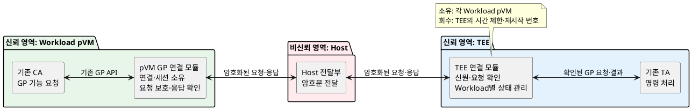
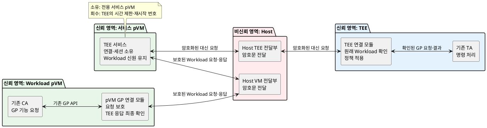

# 문제 3 후보 구조: pVM과 GlobalPlatform TEE 연동

## 1. 문서 목적

이 문서는 pVM 안의 CA(Client Application)가 기존 GlobalPlatform(GP) API로 TEE 안의 TA(Trusted Application)를 호출할 때,
누가 TEE 연결과 세션을 관리할지 비교한다.

- **pVM**: 기밀성과 무결성이 보호되는 가상 머신
- **Workload pVM**: CA와 업무 프로그램이 실행되는 pVM
- **Host**: pVM과 TEE 사이의 메시지를 전달하지만 신뢰하지 않는 영역
- **CA**: TEE 기능을 요청하는 기존 프로그램
- **TA**: TEE 안에서 요청을 처리하는 기존 프로그램

다른 문제 3 문서의 `GP 호환 Frontend`, `TEE Secure-channel Gateway`, `TEE Relay 서비스 pVM`은
이 문서의 `pVM GP 연결 모듈`, `TEE 연결 모듈`, `TEE 서비스 pVM`과 각각 같은 구성 요소다.

비교할 구조는 다음 두 가지다.

1. 각 Workload pVM이 자신의 TEE 연결과 세션을 직접 관리한다.
2. 전용 서비스 pVM이 여러 Workload의 TEE 연결과 세션을 중앙에서 관리한다.

두 후보 모두 기존 CA와 TA의 소스 코드를 바꾸지 않고, Host는 암호화된 메시지만 전달한다.
CA와 TA가 직접 암호화 코드를 넣는 방식이나 pVM이 TEE를 직접 호출하는 새 하드웨어 통로는 이 결정의 범위에서 제외한다.

## 2. 공통 조건

### 2.1 신뢰 범위

- Workload pVM, 서비스 pVM, pKVM과 TEE는 신뢰한다.
- Host 커널, Host의 GP 처리 코드, 장치 백엔드와 공유 메모리는 신뢰하지 않는다.
- 공격자는 Host에서 메시지를 읽고, 바꾸고, 지우고, 순서를 바꾸거나 다시 보낼 수 있다.
- Host가 서비스를 지연하거나 막는 것은 완전히 막을 수 없다.
- 기존 CA와 TA가 원래부터 가진 취약점은 별도 문제다.
- pVM 안의 코드가 보호되더라도, Host를 지난 메시지는 TEE가 확인할 때까지 신뢰할 수 없다.

### 2.2 반드시 지켜야 할 보안 조건

1. pVM과 TEE는 연결을 만들 때 서로의 신원을 확인해야 한다.
2. 신원은 서명된 실행 이미지와 부팅 상태를 포함해 하드웨어가 확인할 수 있어야 한다.
3. CA 요청과 TA 응답의 내용은 Host가 읽거나 바꿀 수 없어야 한다.
4. 요청에는 호출 종류, TA 식별자, 세션, 매개변수, 요청 번호를 함께 보호해야 한다.
5. 응답에는 요청 번호, 처리 결과, 출력 길이와 출력값을 함께 보호해야 한다.
6. 같은 요청을 다시 보내거나 다른 세션의 응답을 붙이는 공격은 거부해야 한다.
7. Host가 만든 GP 반환값은 전달 상태일 뿐이다. CA에는 TEE가 만든 응답을 확인한 뒤에만 성공을 반환한다.
8. Host가 접근할 수 있는 입력은 검사 전에 신뢰 영역의 메모리로 복사한다.
9. 연결과 세션은 Workload별로 나누어 다른 pVM의 권한이나 결과가 섞이지 않게 한다.
10. Host의 종료 보고가 없어도 시간 제한과 재시작 번호로 남은 자원을 회수해야 한다.
11. 재시도된 요청은 같은 요청 번호를 사용하며, 이미 처리한 요청은 중복 실행하지 않는다.
12. 기존 Host에서 동작하는 CA와 기존 Host-TEE GP 경로는 그대로 유지한다.

### 2.3 공통 처리 흐름

1. 기존 CA가 GP Client API를 호출한다.
2. pVM 안의 GP 연결 모듈이 호출 내용을 안전한 메시지로 만든다.
3. 신뢰하지 않는 Host가 암호화된 메시지를 전달한다.
4. TEE 연결 모듈이 보낸 주체, 요청 번호와 메시지 위조 여부를 확인한다.
5. 기존 TA가 요청을 처리한다.
6. TEE가 만든 보호된 응답을 pVM이 확인한 뒤 기존 GP 결과 형식으로 CA에 돌려준다.

### 2.4 성공과 실패를 판단하는 위치

Host가 돌려주는 `TEEC_Result`와 `returnOrigin`은 메시지가 전달되었는지를 나타내는 바깥쪽 결과다.
Host가 이 값을 성공으로 바꿀 수 있으므로 TA의 실제 처리 성공을 증명하지 못한다.
TA의 결과, 출력값, 요청 번호가 포함된 TEE 응답을 pVM이 확인해야 최종 성공으로 판단한다.

응답이 없거나 확인에 실패하면 CA에는 통신 실패 또는 보안 오류를 반환한다.
TEE가 만든 오류 응답은 확인 후 기존 GP 오류로 바꾸어 반환한다.
따라서 Host가 만든 요청 또는 응답이 정상 요청으로 받아들여지는 경우는 두 후보 모두 0건이어야 한다.

기존 CA는 같은 GP 함수와 자료형을 계속 사용한다.
pVM GP 연결 모듈이 기존 GP 라이브러리의 연결 부분을 맡으므로 CA 소스는 바뀌지 않는다.
TEE 연결 모듈도 확인된 요청을 기존 GP 형식으로 TA에 전달하므로 TA 소스 역시 바뀌지 않는다.

## 3. 후보 A: 각 Workload pVM 직접 연결형

### 3.1 구조

각 Workload pVM의 GP 연결 모듈이 TEE 연결과 GP 세션을 직접 소유한다.
TEE 연결 모듈은 Workload pVM의 신원을 확인하고, 그 신원에 허용된 TA와 명령만 실행한다.
Host는 두 모듈 사이의 암호문을 전달할 뿐 연결의 신원이나 성공 여부를 결정하지 못한다.

결정 대상 자원은 **TEE 보안 연결과 GP 세션**이다.
소유자는 각 Workload pVM이며, TEE 연결 모듈도 Workload별 상태를 따로 보관한다.
pVM이 종료되면 정상 종료 메시지와 관계없이 TEE가 시간 제한과 재시작마다 증가하는 번호를 기준으로 상태를 회수한다.
Workload pVM마다 별도의 키, 요청 번호 범위와 세션 표를 사용한다.
같은 CA가 여러 세션을 열어도 그 상태는 해당 Workload 안에서만 유효하다.

| 구성 요소 | 실행 위치 | 책임 |
|---|---|---|
| 기존 CA | Workload pVM | 기존 GP API로 TA 기능 요청 |
| pVM GP 연결 모듈 | Workload pVM | TEE 신원 확인, 요청 보호, 응답 확인, GP 결과 변환 |
| Host 전달부 | Host | 암호문 전달과 공유 메모리 제공 |
| TEE 연결 모듈 | TEE | pVM 신원 확인, 접근 제어, 중복 차단, 세션 관리 |
| 기존 TA | TEE | 기존 GP 명령 처리 |

### 3.2 정상 동작

1. pVM GP 연결 모듈과 TEE 연결 모듈이 서로의 신원을 확인하고 한 번만 쓰는 임시 키로 연결 키를 만든다.
   이때 서명된 실행 이미지, 현재 부팅 상태와 재시작 번호를 함께 확인한다.
2. pVM 모듈은 CA의 GP 호출을 복사하고 길이, 포인터와 권한을 검사한다.
3. pVM 모듈은 Workload 신원, 세션, TA, 명령, 매개변수와 요청 번호를 함께 보호한다.
4. Host가 메시지를 전달하면 TEE 모듈이 위조, 중복과 권한을 확인한 뒤 TA를 호출한다.
5. TEE 모듈은 TA 결과와 원래 요청 번호를 함께 보호해 돌려보낸다.
6. pVM 모듈이 응답을 확인한 뒤에만 CA 출력 버퍼를 갱신하고 성공을 반환한다.

### 3.3 오류와 복구

- Host가 메시지를 바꾸거나 과거 메시지를 다시 보내면 TEE 또는 pVM이 거부한다.
- 응답이 없으면 pVM은 같은 요청 번호로 재시도한다. TEE는 처리 기록을 보고 중복 실행하지 않는다.
- pVM 재시작 뒤에는 새 재시작 번호로 연결한다. TEE는 이전 연결과 세션을 만료시킨다.
- Host가 거짓 성공을 반환해도 보호된 TEE 응답이 없으므로 CA에는 성공을 반환하지 않는다.
- 연결이 끊긴 동안 완료 여부를 모르는 요청은 새 번호로 다시 실행하지 않고, 같은 요청 번호로 결과를 묻는다.

### 3.4 장점

- 서비스 pVM을 거치지 않아 호출 경로가 짧고 추가 복사와 대기 시간이 적다.
- Workload별 연결과 세션이 분리되어 한 pVM의 문제가 다른 pVM으로 퍼질 범위가 작다.
- 중앙 서비스 장애가 없어 Workload마다 독립적으로 복구할 수 있다.
- 요청자의 신원이 TEE까지 직접 이어져 권한 판단이 단순하다.

### 3.5 단점

- 모든 Workload pVM에 GP 연결 모듈과 연결 상태가 필요하다.
- Workload 수가 늘면 TEE의 연결, 키와 세션 수도 함께 늘어난다.
- 연결 갱신과 버전 변경을 각 pVM에 배포해야 한다.
- TEE가 많은 Workload 상태와 회수 처리를 담당해야 한다.

## 4. 후보 B: 전용 서비스 pVM 중앙 연결형

### 4.1 구조

전용 TEE 서비스 pVM이 여러 Workload를 대신해 TEE 연결과 GP 세션을 소유한다.
각 Workload pVM의 GP 연결 모듈은 먼저 서비스 pVM의 신원을 확인하고 요청을 보낸다.
서비스 pVM은 요청을 검사하고 TEE로 전달하지만, 자신의 권한으로 Workload의 요청을 바꾸어 실행할 수 없다.

TEE 연결 모듈은 서비스 pVM의 신원만 보고 허용하지 않는다.
원래 Workload의 신원과 대신 요청했다는 기록을 함께 확인하고, 정책은 원래 Workload를 기준으로 적용한다.
TA 응답은 원래 Workload의 pVM GP 연결 모듈이 최종 확인하므로 Host와 서비스 pVM이 성공 결과를 만들 수 없다.
이를 위해 Workload의 요청은 서비스 pVM에서 한 번 확인되고, TEE까지 전달되는 원본 정보도 별도로 보호된다.
TEE의 응답에는 원래 Workload, 원래 요청 번호와 처리 결과가 들어가며 Workload pVM이 확인할 수 있어야 한다.

결정 대상 자원은 **공용 TEE 보안 연결과 GP 세션**이다.
소유자는 서비스 pVM이며, 서비스 pVM이 재시작되면 TEE가 이전 재시작 번호의 연결과 세션을 회수한 뒤 새 연결을 만든다.
개별 Workload가 사라진 경우에도 TEE는 시간 제한으로 그 Workload의 남은 세션을 회수한다.
서비스 pVM은 Workload별 대기열, 사용량 한도와 세션 표를 나누어 관리한다.
한 Workload의 요청이 많아도 다른 Workload의 요청과 자원을 계속 차지하지 못하게 제한한다.

| 구성 요소 | 실행 위치 | 책임 |
|---|---|---|
| 기존 CA | Workload pVM | 기존 GP API로 TA 기능 요청 |
| pVM GP 연결 모듈 | Workload pVM | 서비스 신원 확인, 요청 보호, TEE 응답 최종 확인 |
| Host VM 전달부 | Host | Workload와 서비스 pVM 사이의 암호문 전달 |
| TEE 서비스 | 서비스 pVM | 요청 검사, Workload 신원 유지, 연결·세션 중앙 관리 |
| Host TEE 전달부 | Host | 서비스 pVM과 TEE 사이의 암호문 전달 |
| TEE 연결 모듈 | TEE | 원래 Workload 확인, 접근 제어, 중복 차단 |
| 기존 TA | TEE | 기존 GP 명령 처리 |

### 4.2 정상 동작

1. Workload pVM은 서비스 pVM의 신원을 확인하고, 서비스 pVM은 TEE의 신원을 확인한다.
   각 확인에는 실행 이미지, 부팅 상태와 현재 재시작 번호가 포함된다.
2. pVM GP 연결 모듈은 CA 호출을 검사하고 Workload 신원, TA, 명령, 매개변수와 요청 번호를 보호한다.
3. 서비스 pVM은 요청을 확인해 Workload별 대기열과 세션에 넣고, 원래 Workload 신원을 유지한 채 TEE에 요청한다.
4. TEE는 서비스와 원래 Workload의 신원을 모두 확인하고 원래 Workload의 권한으로 TA를 호출한다.
5. TEE는 결과를 원래 요청과 Workload에 묶어 보호하고 서비스 pVM을 통해 돌려보낸다.
6. Workload pVM이 TEE 응답을 최종 확인한 뒤에만 CA에 성공과 출력값을 반환한다.

### 4.3 오류와 복구

- Host가 어느 구간의 메시지를 바꾸거나 다시 보내도 다음 신뢰 영역에서 거부된다.
- 서비스 pVM이 원래 Workload 신원을 빼거나 바꾸면 TEE가 요청을 거부한다.
- 서비스 pVM의 처리 결과만 있고 TEE 응답이 없으면 Workload pVM은 CA에 성공을 반환하지 않는다.
- 서비스 pVM 장애 중에는 모든 Workload의 새 요청이 멈춘다. 재시작 후 TEE가 이전 연결을 정리하고 새 연결을 만든다.
- 결과가 불확실한 요청은 같은 요청 번호로 재시도하며 TEE가 중복 처리를 막는다.
- 서비스 pVM이 잘못된 Workload의 응답을 돌려주면 요청 번호와 Workload 정보가 맞지 않아 pVM이 거부한다.

### 4.4 장점

- TEE 연결과 세션을 한곳에서 관리해 TEE의 연결 수와 반복 상태를 줄일 수 있다.
- 연결 갱신, 사용량 제한과 감사를 서비스 pVM에 모아 적용하기 쉽다.
- Workload 수가 많을 때 연결 설정 비용을 나누어 사용할 수 있다.
- TEE와 직접 연결하는 복잡한 코드를 각 Workload pVM에 모두 넣지 않아도 된다.

### 4.5 단점

- 서비스 pVM을 거쳐 추가 복사, 대기열 처리와 지연이 생긴다.
- 서비스 pVM 장애가 여러 Workload에 동시에 영향을 주는 중앙 장애 지점이 된다.
- 원래 Workload 신원을 끝까지 유지하고 검증하는 처리가 필요하다.
- 서비스 pVM이 많은 요청과 세션을 처리하므로 자원 제한과 Workload 간 공정성 제어가 필요하다.

## 5. 품질속성 비교

| 비교 항목 | 후보 A: 각 pVM 직접 연결 | 후보 B: 서비스 pVM 중앙 연결 |
|---|---|---|
| 연결·세션 소유자 | 각 Workload pVM | 전용 서비스 pVM |
| TEE의 권한 기준 | 직접 확인한 Workload 신원 | 서비스와 원래 Workload 신원을 모두 확인 |
| 호출 경로 | pVM → Host → TEE | pVM → Host → 서비스 pVM → Host → TEE |
| 응답 최종 확인 | Workload pVM | Workload pVM |
| Host 위조·재전송 수용 | 0건이어야 함 | 0건이어야 함 |
| 지연과 복사 | 더 적음 | 더 많음 |
| TEE 연결 수 | Workload 수에 따라 증가 | 공용 연결로 줄일 수 있음 |
| 장애 범위 | 주로 해당 Workload | 여러 Workload에 함께 영향 |
| 운영 변경 | 각 pVM에 배포 | 서비스 pVM에 집중 |
| 자원 회수 | TEE가 Workload별 회수 | TEE가 서비스 연결과 Workload 세션 회수 |
| 기존 CA·TA 변경 | 0줄 | 0줄 |

후보 A는 짧은 경로, Workload별 장애 분리와 직접적인 권한 확인에 유리하다.
대신 Workload 수만큼 연결 상태와 배포 대상이 늘어난다.

후보 B는 연결과 운영 기능을 모으고 TEE의 연결 수를 줄이는 데 유리하다.
대신 지연과 중앙 장애 범위가 커지며, 서비스 pVM이 원래 Workload의 권한을 대신 쓰지 못하도록 추가 확인이 필요하다.

성능을 우선하고 Workload 수와 TEE 연결 수를 감당할 수 있다면 후보 A가 단순하다.
운영 정책을 한곳에서 관리하고 TEE의 연결 자원이 제한되어 있다면 후보 B가 유리할 수 있다.
다만 후보 B는 중앙 장애 복구 시간과 Workload 신원 유지가 검증된 경우에만 선택할 수 있다.

## 6. 검증 항목

아래 필수 조건을 하나라도 확인하지 못한 구조는 선택 후보에서 제외한다.

### 6.1 공통 통과 조건

- Host에서 CA 입력, TA 출력, 키 평문이 보이지 않아야 한다.
- Host가 요청 또는 응답의 한 비트라도 바꾸면 수신자가 거부해야 한다.
- 과거 요청, 과거 응답과 다른 세션의 응답을 보내면 모두 거부해야 한다.
- Host가 GP 성공값을 만들더라도 TEE 응답이 없으면 CA에는 성공이 전달되지 않아야 한다.
- 큰 길이, 잘못된 포인터와 호출 중 바뀌는 공유 메모리를 안전하게 거부해야 한다.
- pVM 또는 서비스 pVM 재시작 뒤 이전 연결의 요청과 응답을 거부해야 한다.
- Host 종료 보고 없이도 시간 제한 뒤 TEE 자원이 회수되어야 한다.
- 같은 요청을 재시도해도 TA의 상태 변경은 한 번만 일어나야 한다.
- 기존 Host CA와 TA의 동작 및 성능 변화가 허용 범위 안이어야 한다.
- 기존 CA와 TA의 소스 변경량은 0줄이어야 한다.
- 연결 키가 바뀐 뒤에는 이전 키로 만든 요청과 응답을 모두 거부해야 한다.
- 요청 번호가 허용 범위를 넘거나 순서가 크게 어긋나면 연결을 닫고 다시 확인해야 한다.

### 6.2 후보 A 추가 조건

- 두 Workload가 같은 세션 번호를 써도 상태와 결과가 섞이지 않아야 한다.
- 한 Workload의 키나 권한으로 다른 Workload 요청을 만들 수 없어야 한다.
- 한 pVM의 종료와 재연결이 다른 pVM 연결에 영향을 주지 않아야 한다.
- 목표 동시 Workload 수에서 TEE 연결과 메모리 사용량이 한도 안이어야 한다.

### 6.3 후보 B 추가 조건

- 서비스 pVM이 원래 Workload 신원을 빼거나 바꾸면 TEE가 거부해야 한다.
- TEE는 서비스 pVM의 자체 권한으로 Workload 요청을 실행하지 않아야 한다.
- 서비스 pVM이 만든 거짓 결과를 Workload pVM이 거부해야 한다.
- 한 Workload의 과도한 요청이 다른 Workload를 계속 막지 않도록 제한해야 한다.
- 서비스 pVM 재시작 뒤 이전 연결과 세션이 남지 않아야 한다.
- 목표 부하에서 추가 지연, 처리량과 중앙 장애 복구 시간이 한도 안이어야 한다.

## 7. Decision Point 점검

- 두 후보는 같은 CA-TA 연동 문제를 다룬다.
- 차이는 TEE 연결과 세션의 소유 위치, 호출 경로와 장애 범위다.
- 후보 A는 짧은 경로와 장애 분리를, 후보 B는 중앙 관리와 연결 수 절감을 우선한다.
- 두 후보 모두 Host를 신뢰하지 않으며, TEE가 만든 응답을 Workload pVM이 확인한 뒤에만 성공을 반환한다.
- 구현 제품, 암호 방식과 세부 메시지 형식은 후보를 고른 뒤 정한다.
