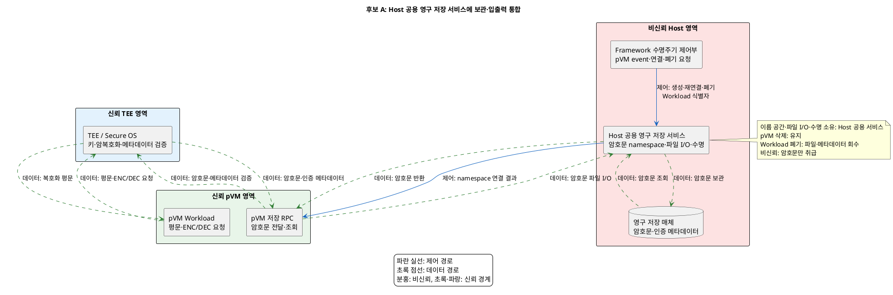
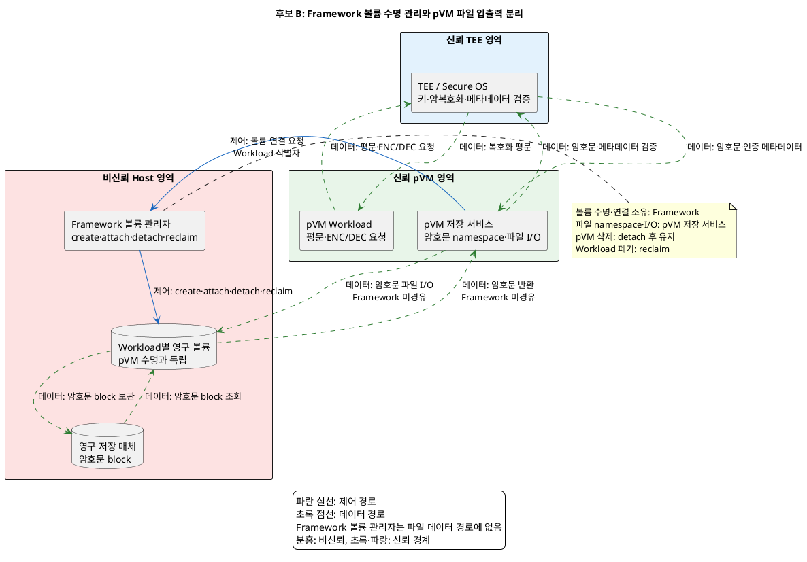

# 문제 3. 암호화 파일 영구 보관 해결 후보 구조

## 1. 문서 목적

pVM이 삭제돼도 동일 Workload가 암호화 파일을 다시 사용할 수 있도록 보관 책임을 배치하는 후보 구조 두 개를 정리한다.

두 후보는 다음 결정 질문에 대한 서로 다른 답이다.

> 암호화 파일의 이름 공간, 수명과 파일 입출력을 Host 공용 영구 저장 서비스에 통합할 것인가,
> Framework는 Workload별 볼륨 수명만 관리하고 파일 입출력은 pVM 저장 서비스가 담당하게 분리할 것인가?

두 후보 모두 TEE의 키 관리·암복호화와 GP Client API 호출 경로를 변경하지 않는다.
차이는 암호문 파일 입출력, 이름 공간과 영구 저장 자원의 수명 책임을 어디에 배치하는가다.

구체적인 저장 제품, 파일시스템, 암호화 알고리즘과 비-RPMB 무결성·재생 방지 메커니즘은 하위 결정으로 둔다.

## 2. 공통 전제와 필수 조건

### 2.1 신뢰 전제

- Host Linux, Host 저장 서비스와 Framework는 커널까지 침해될 수 있는 비신뢰 영역이다.
- pVM Workload와 TEE/Secure OS는 신뢰·격리 영역이다.
- 키는 TEE 밖으로 나오지 않는다.
- Workload와 TEE 사이에는 암호화 전·복호화 후 평문이 존재할 수 있다.
- pVM 저장 서비스, Framework, Host 서비스와 영구 저장 매체로 이어지는 저장 경로에는 암호문만 전달한다.
- 안정적인 Workload 식별자와 저장 공간의 결합은 Host의 주장만으로 확정하지 않는다.
- Host는 암호문을 삭제·변조하거나 과거 버전으로 되돌릴 수 있는 공격자로 가정한다.

### 2.2 공통 저장 수명주기

두 후보 모두 다음 수명주기를 보장한다.

```text
Workload 저장 자원 생성·결합 → pVM 연결 → 암호문 저장·조회
                             → pVM 분리·삭제 → 저장 자원 유지
                             → 동일 Workload의 새 pVM에 재연결
                             → Workload 폐기 시에만 저장 자원 회수
```

pVM 삭제와 Workload 폐기를 구분한다. 연결 또는 파일 입출력 중 오류가 발생하면 불완전한 상태를 최신 정상 파일로
확정하지 않고, 동시에 두 pVM이 같은 쓰기 자원을 소유하지 못하게 한다.

### 2.3 공통 보안 gate

1. pVM 삭제·재생성 후 최신 암호화 파일을 같은 Workload가 복구할 수 있어야 한다.
2. 저장 데이터 경로에서 키와 평문이 관찰된 건수는 0건이어야 한다.
3. 다른 Workload의 저장 공간 연결과 파일 접근은 모두 차단해야 한다.
4. Workload 식별자, 저장 공간 식별자와 파일 메타데이터의 결합을 TEE 또는 동등한 신뢰 수단이 검증해야 한다.
5. pVM 삭제 시 저장 자원을 유지하고 Workload 폐기 시에만 회수해야 한다.
6. 생성·연결·분리·재연결·회수 상태와 세대를 기록해 중복 연결과 오래된 요청을 거부해야 한다.
7. 비-RPMB 저장소에서 파일 삭제·변조·되돌리기를 검출하는 메커니즘을 정의해야 한다.
8. 검증 실패나 비정상 종료 시 파일을 복호화하거나 최신 상태로 확정하지 않아야 한다.
9. 신규 Workload의 저장 정책을 추가해도 Framework 코어 변경량은 0 LoC여야 한다.

비-RPMB 저장소의 삭제·변조·되돌리기 검출 방식은 두 후보에 공통인 `확인 필요` gate다.
이 gate가 닫히기 전에는 어느 후보도 최종 결정하지 않는다.

---

## 3. 후보 A: Host 공용 영구 저장 서비스에 보관·입출력 통합

### 3.1 구조적 핵심

Host의 공용 영구 저장 서비스가 모든 Workload의 암호문 이름 공간, 파일 입출력과 저장 수명을 담당한다.
pVM 저장 RPC는 TEE가 만든 암호문을 공용 서비스에 전달하고, 공용 서비스가 Workload 식별자별로 파일을 기록·조회한다.

pVM이 삭제돼도 공용 서비스와 이름 공간은 유지된다. 같은 Workload의 새 pVM은 기존 이름 공간에 다시 연결하고,
Workload 폐기 시 공용 서비스가 파일과 메타데이터를 회수한다.

### 3.2 컴포넌트의 실행 위치와 책임

| 컴포넌트 | 실행 위치 | 책임 |
|---|---|---|
| Framework 수명주기 제어부 | Host EL1, 비신뢰 | pVM 생성·삭제 event와 Workload 식별자에 따른 연결·폐기 요청 |
| Host 공용 영구 저장 서비스 | Host EL1, 비신뢰 | Workload별 암호문 이름 공간, 파일 입출력, 보관 수명과 용량 제한 관리 |
| pVM Workload | Guest EL1, 신뢰·격리 | 평문 데이터와 ENC/DEC 요청 생성, 복호화 결과 사용 |
| pVM 저장 RPC | Guest EL1, 신뢰·격리 | TEE의 암호문 결과를 공용 서비스로 전달하고 조회 결과 반환 |
| TEE/Secure OS | TrustZone, 신뢰 | 키 보관, 암복호화, Workload·파일 메타데이터 결합 검증 |
| 영구 저장 매체 | Host 저장 계층, 비신뢰 | 암호문과 인증된 메타데이터의 물리 보관 |

결정 대상 자원의 소유자는 Host 공용 영구 저장 서비스다. pVM 삭제 시 유지하고 Workload 폐기 요청 시 회수한다.

### 3.3 구조 다이어그램



### 3.4 후보별 동작 구조

#### 정상 저장·재연결

1. Workload가 TEE에 평문과 저장 요청을 전달한다.
2. TEE가 데이터를 암호화하고 Workload·파일 결합 메타데이터를 생성한다.
3. pVM 저장 RPC가 암호문과 메타데이터를 Host 공용 서비스에 전달한다.
4. Host 공용 서비스가 Workload별 이름 공간에 파일을 기록한다.
5. pVM 삭제 시 Framework가 연결 종료를 알리지만 공용 서비스는 이름 공간과 파일을 유지한다.
6. 같은 Workload의 새 pVM이 생성되면 Framework가 기존 이름 공간 재연결을 요청한다.
7. 조회된 암호문과 메타데이터를 TEE가 검증한 후 복호화한다.

#### 오류·비정상 종료

1. 공용 서비스가 중복 연결, 오래된 세대 또는 불완전한 쓰기를 감지하면 파일을 최신 상태로 확정하지 않는다.
2. TEE가 Workload 결합, 무결성 또는 최신성을 검증하지 못하면 복호화 결과를 반환하지 않는다.
3. pVM 비정상 종료 시 공용 서비스는 해당 연결만 닫고 저장 파일은 유지한다.
4. 공용 서비스 장애 중에는 모든 Workload의 새 저장·복구를 중단하고 복구 후 인증된 상태부터 재개한다.

### 3.5 장점

- 공용 서비스가 항상 유지되므로 새 pVM은 별도 볼륨 생성 없이 기존 이름 공간에 연결할 수 있다.
- 파일 입출력과 수명주기 정책을 한 서비스에서 관리해 공통 오류 처리와 용량 정책을 재사용할 수 있다.
- Workload별 저장 서비스 프로세스나 전용 파일시스템을 Host에 반복 배치하지 않아 서비스 자원을 공유할 수 있다.
- 신규 Workload는 공용 서비스의 정책 데이터와 이름 공간 등록으로 수용할 수 있다.

### 3.6 단점

- 공용 서비스 장애, 자원 고갈과 정책 오류가 여러 Workload의 저장·복구로 전파될 수 있다.
- 비신뢰 Host 서비스가 이름 공간과 I/O를 모두 다루므로 TEE가 파일 결합·무결성·최신성을 독립적으로 검증해야 한다.
- 한 Workload의 요청 폭주가 다른 Workload의 지연과 가용성에 영향을 주지 않도록 자원 한도와 공정성이 필요하다.
- 공용 서비스의 인터페이스 변경이 모든 Workload와 pVM 저장 RPC에 영향을 줄 수 있다.

---

## 4. 후보 B: Framework 볼륨 수명 관리와 pVM 파일 입출력 분리

### 4.1 구조적 핵심

Framework 볼륨 관리자는 Workload별 영구 볼륨의 생성·연결·분리·회수만 제어한다.
pVM 안의 저장 서비스가 연결된 전용 볼륨에 암호문 파일시스템을 구성하고 파일 입출력을 직접 수행한다.

Framework는 암호문 파일의 이름 공간이나 read/write 데이터 경로에 참여하지 않는다.
pVM이 삭제되면 저장 서비스만 사라지고 볼륨은 유지되며, 같은 Workload의 새 pVM에 다시 연결한다.

### 4.2 컴포넌트의 실행 위치와 책임

| 컴포넌트 | 실행 위치 | 책임 |
|---|---|---|
| Framework 볼륨 관리자 | Host EL1, 비신뢰 | Workload별 볼륨 생성·attach·detach·reclaim과 연결 세대 관리 |
| Workload별 영구 볼륨 | Host 저장 계층, 비신뢰 | pVM 수명과 독립적으로 암호문 block 보관 |
| pVM Workload | Guest EL1, 신뢰·격리 | 평문 데이터와 ENC/DEC 요청 생성, 복호화 결과 사용 |
| pVM 저장 서비스 | Guest EL1, 신뢰·격리 | 전용 볼륨의 암호문 파일 이름 공간과 파일 입출력 수행 |
| TEE/Secure OS | TrustZone, 신뢰 | 키 보관, 암복호화, Workload·파일 메타데이터 결합 검증 |
| 영구 저장 매체 | Host 저장 계층, 비신뢰 | Workload별 볼륨 block의 물리 보관 |

결정 대상 자원의 소유자는 Framework 볼륨 관리자다. 파일 입출력은 pVM 저장 서비스가 담당하며,
pVM 삭제 시 detach 후 유지하고 Workload 폐기 시에만 볼륨을 reclaim한다.

### 4.3 구조 다이어그램



### 4.4 후보별 동작 구조

#### 정상 저장·재연결

1. pVM 저장 서비스가 Workload 식별자로 볼륨 연결을 요청한다.
2. Framework 볼륨 관리자가 연결 세대와 동시 attach 여부를 확인하고 해당 Workload의 볼륨을 pVM에 연결한다.
3. Workload가 TEE에 평문과 저장 요청을 전달한다.
4. TEE가 데이터를 암호화하고 Workload·파일 결합 메타데이터를 생성한다.
5. pVM 저장 서비스가 연결된 볼륨에 암호문 파일을 직접 기록한다.
6. pVM 삭제 시 Framework가 볼륨을 detach하되 파일과 볼륨은 유지한다.
7. 같은 Workload의 새 pVM이 생성되면 볼륨을 다시 attach하고 pVM 저장 서비스가 파일을 조회한다.
8. TEE가 암호문과 메타데이터를 검증한 후 복호화한다.

#### 오류·비정상 종료

1. Framework가 오래된 세대, 다른 Workload 또는 동시 쓰기 attach 요청을 거부한다.
2. pVM 비정상 종료 시 Framework가 연결을 강제 detach하고 볼륨은 유지한다.
3. pVM 저장 서비스가 불완전한 쓰기를 정상 파일로 확정하지 않고 다음 연결에서 복구 절차를 수행한다.
4. TEE가 Workload 결합, 무결성 또는 최신성을 검증하지 못하면 복호화 결과를 반환하지 않는다.

### 4.5 장점

- 각 Workload의 파일 이름 공간과 I/O 장애가 해당 pVM과 볼륨에 한정되어 다른 Workload로 전파될 가능성이 낮다.
- Framework가 파일 내용을 해석하지 않고 볼륨 수명 제어에 집중하므로 제어 경로와 파일 데이터 경로의 책임이 분명하다.
- Workload별 파일시스템 정책과 파일 구조를 pVM 저장 서비스 안에서 독립적으로 변경할 수 있다.
- 한 공용 파일 서비스의 요청 큐와 namespace에 모든 Workload를 결합하지 않는다.

### 4.6 단점

- pVM 재생성 시 볼륨 attach와 pVM 저장 서비스 재기동 단계가 cold start 지연에 추가된다.
- Workload마다 볼륨, 파일시스템 메타데이터와 저장 서비스 구성이 필요해 자원 사용과 운영 항목이 증가한다.
- 볼륨 생성·재연결·회수 자동화가 부족하면 신규 Workload 온보딩 공수가 늘어난다.
- Framework와 pVM 저장 서비스 사이의 연결 세대·동시 attach 상태가 어긋나면 중복 쓰기나 고아 볼륨이 생길 수 있다.

---

## 5. 후보 구조 비교

| 비교 항목 | 후보 A: Host 공용 저장 서비스 | 후보 B: Workload별 볼륨·pVM I/O |
|---|---|---|
| 암호문 이름 공간 | Host 공용 영구 저장 서비스 | pVM 저장 서비스 |
| 파일 입출력 | Host 공용 영구 저장 서비스 | pVM 저장 서비스가 전용 볼륨에 직접 수행 |
| 저장 수명 관리 | Host 공용 영구 저장 서비스 | Framework 볼륨 관리자 |
| 데이터 경로 | pVM 저장 RPC → Host 공용 서비스 → 저장 매체 | pVM 저장 서비스 → Workload별 볼륨 → 저장 매체 |
| 제어 경로 | Framework → 공용 서비스의 이름 공간 연결·폐기 | Framework → 볼륨 create·attach·detach·reclaim |
| pVM 삭제 시 | 공용 이름 공간과 파일 유지 | pVM 서비스 종료, 볼륨 detach 후 유지 |
| Workload 폐기 시 회수 | Host 공용 서비스 | Framework 볼륨 관리자 |
| 보안성 | 공용 서비스가 암호문만 처리, TEE의 독립 검증 필요 | Framework는 파일 I/O 미참여, 볼륨 오연결을 TEE가 검출해야 함 |
| 가용성 | 공용 서비스 장애가 여러 Workload로 전파 | 파일 I/O 장애가 Workload별 pVM·볼륨에 한정 |
| 신뢰성 | 쓰기 복구를 공용 서비스에 통합하지만 잘못된 상태가 여러 Workload에 영향을 줄 수 있음 | 장애는 볼륨별로 제한되지만 연결 세대 불일치 시 중복 attach·고아 볼륨이 생길 수 있음 |
| 성능 | 상시 공용 서비스에 이름 공간 재연결 | 볼륨 attach와 pVM 저장 서비스 재기동 필요 |
| 자원 효율 | 파일 서비스와 공통 정책 자원을 공유 | Workload별 볼륨·파일시스템 구성 자원 필요 |
| 확장성 | 정책 데이터 등록으로 신규 Workload 수용 가능 | Workload별 볼륨 자동화가 코어 수정 없이 가능해야 함 |
| 저장 무결성·재생 방지 | 확인 필요 공통 gate | 확인 필요 공통 gate |

### 핵심 트레이드오프

> 암호문 이름 공간과 파일 입출력을 Host 공용 서비스에 통합하면 pVM 재생성 시 연결 단계와 서비스 자원을 공유할 수 있다.
> 대신 공용 서비스의 장애, 자원 고갈과 인터페이스 변경이 여러 Workload의 저장·복구로 전파될 수 있다.

> Framework는 볼륨 수명만 관리하고 pVM 저장 서비스가 파일 입출력을 맡으면 Workload별 장애 경계와 파일 정책을 분리할 수 있다.
> 대신 볼륨 attach, 서비스 재기동과 Workload별 저장 구성이 cold start, 자원 사용과 온보딩 공수를 늘린다.

## 6. 검증 기준

### 6.1 공통 검증

- pVM 삭제·재생성 후 최신 암호화 파일 복구 성공률: **100%**
- 저장 데이터 경로에서 키와 평문 관찰: **0건**
- 다른 Workload의 저장 공간 연결·파일 접근 성공: **0건**
- 삭제·변조·되돌리기 공격 검출률: **100%** — 메커니즘 정의 후 검증
- 신뢰성 — 비정상 종료 후 중복 쓰기 연결과 고아 저장 자원: **0건**
- 저장 재연결을 포함한 cold start p95: **2초 이하**
- 신규 Workload 저장 구성 시 Framework 코어 변경량: **0 LoC**, 통합 리드타임: **5인일 이하**
- 다중 Workload에서 저장 장애 영향 범위와 추가 메모리·프로세스·저장 자원 측정

### 6.2 후보 A 필수 실현 가능성 gate

- Host 공용 서비스가 pVM 삭제와 독립적으로 Workload별 이름 공간을 유지·재연결할 수 있는가?
- 한 Workload의 요청 폭주와 서비스 오류를 다른 Workload의 용량·지연에서 제한할 수 있는가?
- 비신뢰 공용 서비스가 파일을 오연결·변조해도 TEE가 Workload 결합과 최신성을 검출할 수 있는가?
- 공용 서비스 재시작 후 불완전한 쓰기와 최신 정상 파일을 구분할 수 있는가?

하나라도 확인되지 않으면 후보 A는 선택 가능한 구조가 아니라 실현 가능성 미확인 상태로 남긴다.

### 6.3 후보 B 필수 실현 가능성 gate

- Framework가 파일 데이터 경로에 참여하지 않고 볼륨 create·attach·detach·reclaim만 수행할 수 있는가?
- pVM 저장 서비스가 연결된 영구 볼륨에 암호문 파일 I/O를 직접 수행할 수 있는가?
- pVM 삭제와 Workload 폐기를 구분해 전자는 detach·유지하고 후자만 reclaim할 수 있는가?
- Workload별 볼륨을 Framework 코어 수정 없이 자동 생성·재연결할 수 있는가?
- 비정상 종료와 재시도에서도 동일 볼륨의 동시 쓰기 attach를 차단할 수 있는가?

하나라도 확인되지 않으면 후보 B는 선택 가능한 구조가 아니라 실현 가능성 미확인 상태로 남긴다.

### 6.4 공통 결정 금지 gate

비-RPMB 저장소의 파일 삭제·변조·되돌리기 검출 메커니즘이 정의되고 두 후보에 적용 가능하다는 근거가 나오기 전에는
성능·자원·가용성 비교와 무관하게 어느 후보도 최종 결정하지 않는다.

## 7. Decision Point 성립 점검

1. 두 후보는 동일한 pVM 수명과 독립적인 암호화 파일 보관 문제를 다룬다.
2. 후보 A는 이름 공간·파일 I/O·저장 수명을 Host 공용 서비스에 통합한다.
3. 후보 B는 Framework의 볼륨 수명 제어와 pVM 저장 서비스의 파일 I/O를 분리한다.
4. 두 후보는 파일 데이터 경로, 수명 소유자, 장애 영향 범위와 자원 배치가 다르다.
5. 후보 A는 재연결과 자원 공유에 유리하고, 후보 B는 장애 격리와 파일 정책 분리에 유리하다.
6. 두 후보 모두 저장 경로 기밀성과 비-RPMB 무결성·재생 방지 gate를 통과해야만 선택 가능하다.
7. 공통 결정 금지 gate가 닫히기 전에는 조건부 결정 이상으로 진행하지 않는다.
