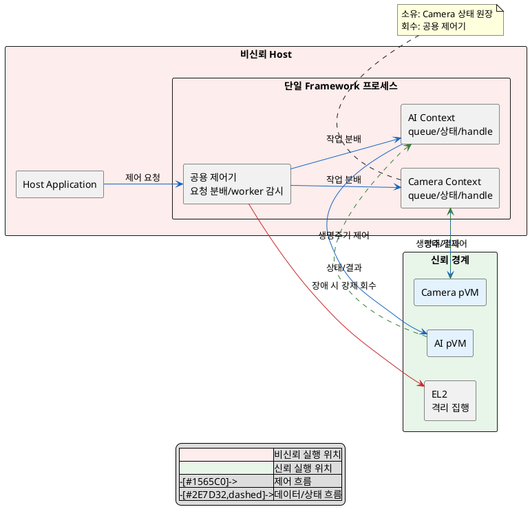
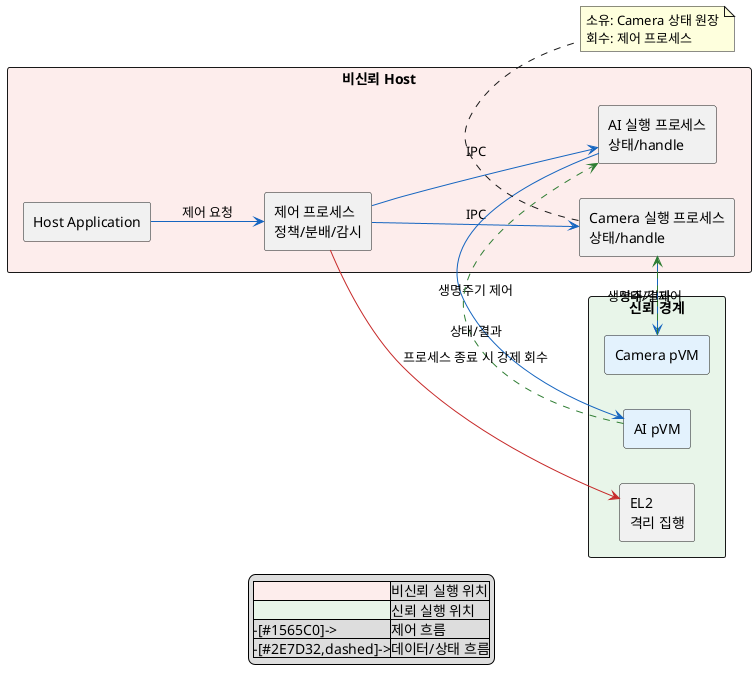

# DP-01. pVM 실행 흐름의 격리 경계

## 1. 상태

평가 중

## 2. 결정 목적

여러 pVM을 동시에 운용할 때 한 pVM의 멈춤과 crash가 다른 pVM의 실행 흐름으로 전파되는 범위를 정한다. 동시에 cold start 경로에 추가되는 프로세스 생성과 IPC 비용을 관리한다.

## 3. 문제 상황

- 현재 Host의 한 관리 프로세스가 Secure Camera pVM과 Secure AI pVM의 생성, 제어와 실행을 함께 담당한다.
- 한 pVM을 다루는 실행 흐름이 멈추거나 잘못 동작하면 공용 실행 흐름을 점유해 다른 pVM의 처리를 막을 수 있다. AVL-01은 장애 전파로 인한 Host와 다른 pVM의 다운타임 0을 요구한다.
- pVM 미생성 상태에서 첫 프레임까지의 전체 경로는 PERF-07의 cold start p95 2초 이하 예산 안에 들어야 한다. 프로세스 생성과 IPC 또는 공용 자원 경합이 이 예산을 사용한다.
- baseline으로 pKVM의 pVM 메모리 격리와 pVM별 생명주기는 고정한다. 이 DP는 pVM 자체의 격리 방식이나 생성 시점을 바꾸지 않는다.
- project-custom 범위는 Host의 실행 흐름, 상태와 자원 관리 책임을 한 프로세스 안에서 나눌지, 프로세스 경계로 나눌지다.
- 장애 후 자원 회수 범위와 CPU 배치는 이 DP의 하위 결정으로 남긴다.
- 따라서 pVM별 멈춤만 실행 Context로 격리할지, crash까지 프로세스 경계로 격리할지 선택해야 한다.

## 4. 결정 질문

> pVM 실행 흐름을 한 프로세스 안에서 VM별 실행 컨텍스트로 격리할 것인가, 제어기와 VM별 실행 프로세스로 분리할 것인가?

## 5. 후보 구조

### 5.1 후보 A: 단일 프로세스 안 VM별 실행 컨텍스트 분리

- 실행 위치: 비신뢰 Host의 단일 Framework 프로세스다.
- 책임: 공용 제어기가 요청을 분배하고, pVM별 worker가 작업 queue, 상태와 handle을 관리한다.
- 신뢰 경계: Host 프로세스는 비신뢰 영역이다. pVM과 EL2의 보호 경계는 바꾸지 않는다.
- 자원 소유/회수: 각 worker가 논리적 원장을 소유한다. 공용 제어기가 worker hang을 감지하고 해당 Context의 자원 회수를 시작한다.

### 5.2 후보 B: 제어기와 VM별 실행 프로세스 분리

- 실행 위치: 비신뢰 Host의 제어 프로세스와 pVM별 실행 프로세스다.
- 책임: 제어 프로세스는 정책과 요청 분배를 담당하고, 각 실행 프로세스는 한 pVM의 생명주기와 handle을 담당한다.
- 신뢰 경계: Host 내부에 프로세스 경계를 추가하지만 보안 신뢰 경계는 여전히 pVM/EL2다.
- 자원 소유/회수: 실행 프로세스가 pVM별 원장을 소유한다. 제어 프로세스가 프로세스 종료를 감지하고 EL2/커널에 강제 회수를 요청한다.

## 6. 후보별 구조 다이어그램

### 6.1 후보 A

### 6.2 후보 B

## 7. 후보별 동작 구조

### 7.1 후보 A

1. 공용 제어기가 요청을 pVM별 queue에 넣는다.
2. 각 worker가 자신의 pVM과 자원 원장만 갱신한다.
3. worker hang은 공용 제어기가 감지하고 해당 Context의 신규 요청을 막는다.
4. 공용 제어기는 해당 pVM의 자원 회수를 요청한다.
5. 공용 프로세스 crash가 발생하면 모든 Context의 제어가 함께 중단될 수 있다.

### 7.2 후보 B

1. 제어 프로세스가 요청을 대상 실행 프로세스로 IPC 전달한다.
2. 실행 프로세스가 해당 pVM의 생명주기와 원장을 갱신한다.
3. 실행 프로세스 hang/crash를 제어 프로세스가 OS 프로세스 상태로 감지한다.
4. 제어 프로세스는 실패 프로세스를 격리하고 해당 pVM의 자원 회수를 시작한다.
5. 실행 프로세스를 다시 만들고 기존 제어 계약에 연결한다.

## 8. 품질속성 비교

### 8.1 필수 gate

| 품질속성 | 기준 | 후보 A | 후보 B | 근거 |
|---|---|---|---|---|
| 가용성(AVL-01) | 장애 전파로 인한 Host/다른 pVM 다운타임 0 | 확인 필요 | 통과 예상 | 후보 A는 공용 프로세스 crash 격리 가능성을 검증해야 한다. 후보 B는 실행 프로세스 crash를 pVM별로 제한한다. |

### 8.2 잠정 별점

gate가 `확인 필요`인 후보 A의 별점은 구조 예상치다. `★★★`는 해당 품질속성에 가장 유리하고 `★☆☆`는 추가 비용이나 위험이 가장 크다는 뜻이다.

| 품질속성 | 후보 A | 후보 B | 평가 이유 |
|---|---:|---:|---|
| 가용성(AVL-01) | ★★☆ | ★★★ | 프로세스 경계는 hang과 crash를 함께 격리한다. |
| 성능(PERF-07) | ★★★ | ★★☆ | 후보 A는 프로세스 생성과 IPC를 추가하지 않는다. 후보 B는 cold start 경로에 두 단계를 추가한다. |

## 9. 핵심 트레이드오프

> 프로세스 경계를 추가하면 pVM별 crash 격리로 가용성이 높아진다. 대신 프로세스 생성과 IPC가 cold start 경로에 추가되어 시작 성능이 낮아질 수 있다.

> 단일 프로세스의 Context 분리는 시작 경로를 짧게 유지한다. 대신 공용 프로세스 crash를 격리하지 못하면 AVL-01 gate를 통과할 수 없다.

## 10. 검증 기준

| 검증 항목 | 공통 측정 방법 | 합격 기준 |
|---|---|---|
| 장애 전파 | 각 pVM worker/process에 hang과 crash를 주입하고 Host와 다른 pVM의 가동 상태 측정 | AVL-01: Host/다른 pVM 다운타임 0 |
| cold start | pVM 미생성 상태에서 시작 요청부터 첫 프레임까지 p95 측정 | PERF-07: p95 2초 이하 |
| 회수 연계 | 장애 뒤 원장과 실제 자원의 대조 수행 | AVL-04: 반복 장애 주입 뒤 잔여 자원 0건 |

## 11. 검토 결과

## 12. 최종 결정
