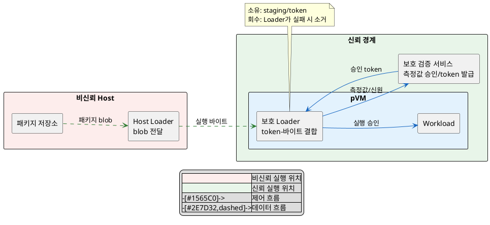
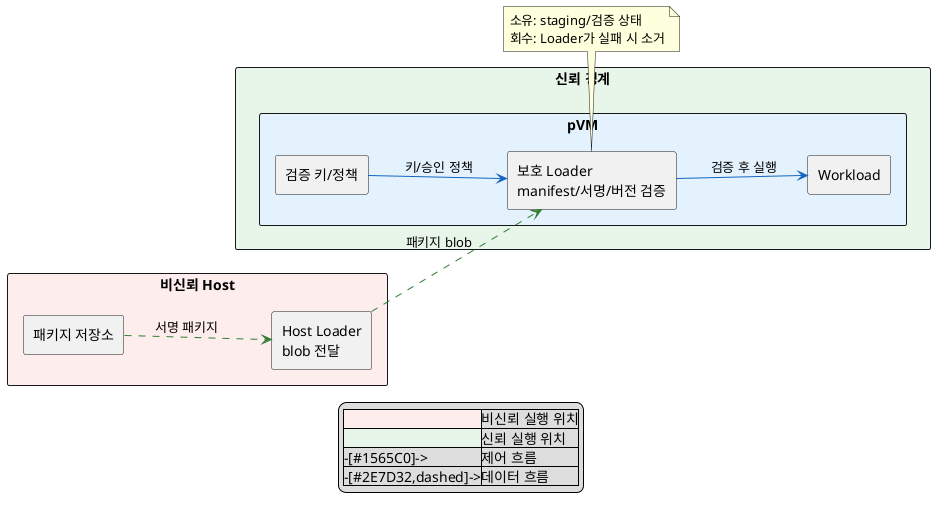

# DP-02. Workload 최종 검증 위치

## 1. 상태

평가 중

## 2. 결정 목적

비신뢰 Host가 Workload 탑재 경로를 장악해도 미검증 이미지를 실행하지 못하게 할 최종 승인 위치를 정한다. 동시에 패키지 형식 확장과 cold start 비용을 관리한다.

> **용어 설명**
>
> - **비신뢰 Host**: 보안 판단의 근거로 신뢰하지 않는 일반 실행 영역이다. 파일 전달은 맡을 수 있지만 검증 결과는 그대로 믿지 않는다.
> - **pVM(Protected Virtual Machine)**: Host가 메모리 내용에 직접 접근하지 못하도록 보호되는 가상 머신이다.
> - **Workload**: pVM 안에서 실행되는 Camera 또는 AI 같은 작업 프로그램이다.
> - **탑재(load)**: 실행할 프로그램을 메모리에 올리고 실행 가능한 상태로 준비하는 과정이다.
> - **실행 이미지**: 메모리에 적재되어 실제로 실행될 프로그램 코드와 데이터 묶음이다.
> - **패키지**: 실행 이미지와 변조 확인 정보, 버전, 설정을 함께 담아 배포하는 단위다.
> - **cold start**: pVM과 Workload가 준비되지 않은 상태에서 시작해 첫 결과를 내기까지의 과정이다.

## 3. 문제 상황

- Workload 이미지는 Host 파일시스템에 있고 Host가 탑재 경로를 다루지만 Host는 비신뢰 주체다.
- Host의 검증 결과만 신뢰하면 변조된 이미지가 pVM에 탑재될 수 있다. SEC-04는 미검증 이미지 탑재 0건과 변조 탐지율 100%를 요구한다.
- 신규 Workload는 Framework 코어 수정 0 LoC라는 EXT-01 gate를 지켜야 하며, EXT-02는 이질 런타임 3종 이상을 같은 계약으로 수용하도록 요구한다.
- 검증과 패키지 해석은 PERF-07의 cold start p95 2초 이하 예산을 사용한다.
- baseline으로 Host 비신뢰 원칙, 서명된 패키지와 pVM 안의 보호 로더를 고정한다. 서명 알고리즘과 패키지 제품 형식은 이 DP의 범위가 아니다.
- project-custom 범위는 실행할 바이트의 측정과 승인을 나눌지, 보호 로더가 패키지 해석과 최종 검증을 함께 맡을지다.
- 따라서 Host 밖의 검증 주체가 측정값을 승인할지, 보호 로더가 패키지를 직접 검증할지 선택해야 한다.

> **용어 설명**
>
> - **Framework 코어**: Workload 종류와 무관하게 pVM 생성, 탑재와 실행을 공통으로 관리하는 핵심 코드다.
> - **LoC(Lines of Code)**: 변경하거나 추가한 소스 코드 줄 수다.
> - **gate**: 후보가 반드시 만족해야 하며 통과하지 못하면 선택할 수 없는 최소 기준이다.
> - **이질 런타임**: 서로 다른 언어, 실행 환경 또는 실행 파일 형식을 사용하는 실행 체계다.
> - **계약(contract)**: Workload와 Framework가 서로 지켜야 하는 입력, 출력과 호출 규칙이다.
> - **p95(95번째 백분위수)**: 전체 측정의 95%가 이 값 이하에 들어오는 지점이다. 일부 매우 느린 값에 가려지지 않는 일반적인 상한을 볼 때 사용한다.
> - **baseline**: 이번 결정에서 변경하지 않고 전제로 고정하는 구조다.
> - **project-custom**: 공통 기반 위에서 이 프로젝트가 직접 선택하거나 설계할 수 있는 범위다.
> - **보호 로더**: 신뢰 경계 안에서 이미지를 검증하고 메모리에 적재하는 구성 요소다.
> - **해시(hash)**: 입력 데이터로부터 계산한 고정 길이 값이다. 입력이 바뀌면 값도 달라져 변조 확인에 사용한다.
> - **측정값**: 실행 바이트의 해시다. 승인 대상과 실제 실행 대상이 같은지 비교하는 데 사용한다.
> - **전자서명**: 배포자가 만든 패키지인지, 서명 뒤 내용이 바뀌지 않았는지를 검증 키로 확인하게 하는 데이터다.

## 4. 결정 질문

> Host 밖의 신뢰할 수 있는 주체가 실행 이미지의 측정값을 승인할 것인가, 보호 영역의 로더가 서명된 패키지를 직접 검증할 것인가?

## 5. 후보 구조

### 5.1 후보 A: Host 밖의 검증 주체가 실행 이미지 측정값 승인

- 실행 위치: Host는 파일을 전달하고, EL2 또는 별도 보호 검증 서비스가 실행 바이트의 측정값을 승인한다.
- 책임: 보호 로더는 승인 token과 실제 로드 바이트의 측정값을 결합해 확인한다.
- 신뢰 경계: Host의 파일 경로와 측정 주장을 신뢰하지 않는다. 승인 token 발급자와 보호 로더만 신뢰한다.
- 자원 소유/회수: 보호 로더가 staging 이미지와 token 수명을 소유하고 실패 시 둘을 함께 폐기한다.

> **용어 설명**
>
> - **EL2(Exception Level 2)**: Arm에서 가상 머신의 CPU와 메모리 접근을 관리하는 권한 수준이다.
> - **승인 token**: 검증 서비스가 특정 측정값과 Workload의 실행을 허용했다는 사실을 증명하는 데이터다.
> - **staging 영역**: 검증이 끝나기 전 실행 바이트를 임시로 보관하는 메모리 영역이다.
> - **실행 바이트**: 실행 이미지의 실제 내용을 이루는 바이트 배열이다.

### 5.2 후보 B: 보호 영역의 로더가 패키지 최종 검증

- 실행 위치: pVM 내부 또는 EL2가 보호하는 로더다.
- 책임: 로더가 manifest, 서명, 버전과 실행 바이트를 직접 해석하고 승인한다.
- 신뢰 경계: Host는 패키지 blob만 전달한다. 로더와 검증 키가 신뢰 경계 안에 있다.
- 자원 소유/회수: 로더가 패키지 staging, 검증 상태와 적재 메모리를 소유하고 실패 시 소거한다.

> **용어 설명**
>
> - **manifest**: 패키지에 포함된 파일, 버전, 실행 조건과 변조 확인 정보를 적은 부가 정보다.
> - **blob(Binary Large Object)**: 내부 내용을 해석하지 않고 하나의 원시 데이터 덩어리로 전달하는 형식이다.
> - **검증 키**: 전자서명이 올바른지 확인하는 데 사용하는 키다. 패키지에 서명할 때 쓰는 비밀 키와는 구분한다.

## 6. 후보별 구조 다이어그램

### 6.1 후보 A

> **다이어그램 용어 설명**
>
> - **제어 흐름**: 승인 요청, 정책 전달과 실행 허가처럼 동작을 지시하는 메시지의 이동이다.
> - **데이터 흐름**: 패키지나 실행 바이트처럼 처리 대상 데이터의 이동이다.
> - **신뢰 경계**: 내부 코드와 데이터가 허가 없이 바뀌거나 외부에 노출되지 않았다고 보장하는 보호 범위다.

### 6.2 후보 B

## 7. 후보별 동작 구조

### 7.1 후보 A

1. Host가 패키지에서 실행할 바이트를 staging 영역으로 전달한다.
2. 보호 로더가 실제 실행 바이트를 측정한다.
3. 보호 검증 서비스가 측정값, Workload 신원과 정책을 확인해 token을 발급한다.
4. 보호 로더가 token과 현재 staging 바이트를 다시 결합해 확인한다.
5. 일치할 때만 실행 메모리에 매핑하고, 실패하면 staging과 token을 폐기한다.

> **용어 설명**
>
> - **매핑(mapping)**: 메모리 영역을 pVM의 주소 공간에 연결해 접근할 수 있게 만드는 작업이다.

### 7.2 후보 B

1. Host가 서명된 패키지 blob을 보호 로더에 전달한다.
2. 보호 로더가 manifest, 버전, 서명과 payload hash를 직접 검증한다.
3. 로더가 manifest에 따라 실행 메모리를 준비하고 payload를 적재한다.
4. 검증 상태와 적재 바이트가 일치할 때만 실행을 승인한다.
5. 실패하면 패키지와 적재 메모리를 소거하고 이후 단계를 중단한다.

> **용어 설명**
>
> - **payload**: 패키지 안에서 실제로 실행하거나 사용하는 본문 데이터다.

## 8. 품질속성 비교

### 8.1 필수 gate

| 품질속성 | 기준 | 후보 A | 후보 B | 근거 |
|---|---|---|---|---|
| 보안성(SEC-04) | 미검증 이미지 탑재 0건, 변조 탐지율 100% | 확인 필요 | 통과 예상 | 후보 A는 token과 실행 바이트의 TOCTOU 없는 결합을 확인해야 한다. 후보 B는 검증과 적재를 한 경계에서 수행한다. |
| 확장성(EXT-01) | 신규 Workload 추가 시 Framework 코어 수정 0 LoC | 통과 예상 | 확인 필요 | 후보 B는 새 패키지 형식이 보호 로더 변경을 요구하지 않는지 확인해야 한다. |

> **용어 설명**
>
> - **TOCTOU(Time-of-check to time-of-use)**: 검증한 시점과 실제 사용 시점 사이에 대상 데이터가 바뀌어, 검증되지 않은 데이터가 사용되는 문제다.

### 8.2 잠정 별점

`★★★`는 해당 품질속성에 가장 유리하고 `★☆☆`는 변경 또는 경로 비용이 가장 크다는 뜻이다. `확인 필요` gate가 닫히기 전까지 점수는 잠정값이다.

| 품질속성 | 후보 A | 후보 B | 평가 이유 |
|---|---:|---:|---|
| 보안성(SEC-04) | ★★☆ | ★★★ | 후보 B는 검증과 적재 승인을 한 로더에서 결합한다. 후보 A는 측정값/token 결합 규약이 추가된다. |
| 확장성(EXT-01, EXT-02) | ★★★ | ★★☆ | 후보 A는 보호 영역의 패키지 해석 범위를 줄인다. 후보 B는 이질 형식 지원이 로더에 누적될 수 있다. |
| 성능(PERF-07) | ★★☆ | ★★★ | 후보 A는 측정 승인 왕복이 추가된다. 후보 B는 보호 로더 안에서 검증을 마친다. 실제 우열은 p95 측정으로 확인한다. |

## 9. 핵심 트레이드오프

> 측정값 승인 구조는 보호 로더의 패키지 해석 범위를 줄여 확장성을 높인다. 대신 승인 token과 실제 실행 바이트를 결합하는 검증이 추가되어 보안 검증 범위와 시작 지연이 늘어난다.

> 로더 직접 검증은 검증과 실행 승인을 한 경계에서 처리해 보안 결합을 단순화한다. 대신 패키지 형식이 늘면 보호 로더 변경 범위가 커져 확장성이 낮아질 수 있다.

## 10. 검증 기준

| 검증 항목 | 공통 측정 방법 | 합격 기준 |
|---|---|---|
| 변조/미검증 탑재 | manifest, 서명, 버전, hash와 적재 바이트를 각각 변조해 탑재 시도 | SEC-04: 미검증 탑재 0건, 변조 탐지율 100% |
| 신규 Workload 수용 | 기존 Framework 코어 diff와 이질 런타임 파일럿을 확인 | EXT-01: 코어 수정 0 LoC, EXT-02: 3종 이상 |
| 시작 지연 | 같은 이미지/장치 조건에서 시작 요청부터 첫 프레임까지 p95 측정 | PERF-07: p95 2초 이하 |
| 후보 A 실현 가능성 | token 발급 뒤 staging 교체/재생 공격을 주입 | token과 실행 바이트 불일치 전부 거부 |

> **용어 설명**
>
> - **diff**: 변경 전후 소스 코드를 비교해 추가, 수정 또는 삭제된 내용을 보여 주는 결과다.
> - **파일럿**: 전체 적용 전에 작은 범위에서 실제 동작 가능성을 확인하는 시험 구현이다.
> - **재생 공격(replay attack)**: 이전에 유효했던 token이나 데이터를 다시 사용해 현재 요청인 것처럼 속이는 공격이다.

## 11. 검토 결과

## 12. 최종 결정
