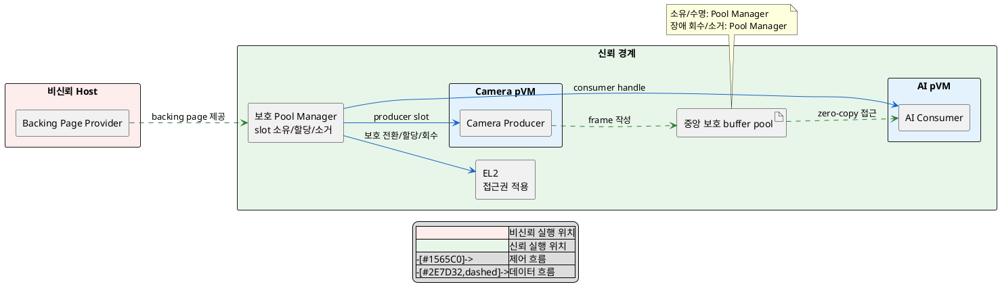
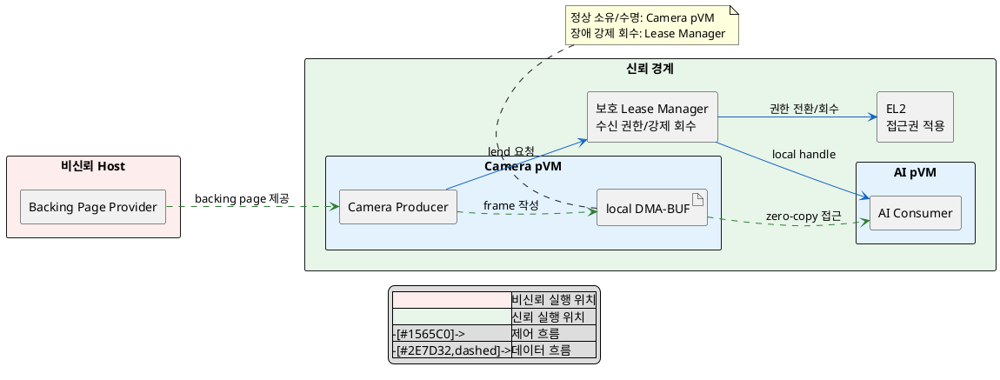

# DP-03-A. 공유 버퍼의 논리적 소유권 위치

## 1. 상태

평가 중

## 2. 결정 목적

보호 전환 뒤 공유 frame buffer의 논리적 소유권, 수명과 장애 회수 책임을 중앙 보호 주체에 둘지 송신 pVM에 둘지 정한다.

## 3. 문제 상황

- pKVM의 pVM 메모리는 Host가 backing page를 준비해 보호 영역에 넘길 수 있다. 물리 페이지 할당자와 보호 전환 뒤 논리적 소유자는 같지 않을 수 있다.
- Host가 일반 DMA-BUF를 계속 소유하거나 매핑하면 영상 원본이 노출될 수 있다. SEC-01은 격리 메모리 노출 0건을 요구한다.
- 프레임마다 버퍼를 준비하면 매핑 확인과 회수가 반복된다. PERF-02는 memcpy 0회, 전달 p99 5ms와 프레임당 전환 비용 1ms 이하를 요구한다.
- 중앙 pool이 buffer를 미리 준비하면 반복 할당을 줄이지만 사용하지 않는 buffer도 계속 점유한다(자원 효율 TBD).
- pVM 종료 뒤 lease가 남으면 원장과 실제 매핑이 어긋난다. AVL-04는 1,000회 crash-restart 뒤 누수율 0 수렴을 요구한다.
- baseline으로 Host 매핑은 보호 전환 뒤 제거하고 수신 pVM에는 local DMA-BUF handle을 만든다. 요청 경로/매핑 수명/정책 위치는 DP-03/DP-03-B/DP-03-C가 정한다.
- project-custom 범위는 보호된 중앙 pool이 버퍼 수명을 소유할지, 송신 pVM이 local DMA-BUF 수명을 소유할지다.
- 한 페이지 송신 pVM 소유 구조만 PoC로 관찰했다. 중앙 pool과 실제 다중 페이지 Camera/AI DMA 경로는 확인되지 않았다.
- 따라서 버퍼의 논리적 소유권과 장애 회수 책임을 중앙 pool과 송신 pVM 중 어디에 둘지 선택해야 한다.

## 4. 결정 질문

> 공유 버퍼의 논리적 소유권과 수명 관리 책임을 보호된 중앙 버퍼 풀에 둘 것인가, 송신 pVM의 local DMA-BUF에 둘 것인가?

## 5. 후보 구조

### 5.1 후보 A: 보호된 중앙 버퍼 풀이 버퍼 소유와 재할당 담당

- 실행 위치: Host와 분리된 보호 pool manager다.
- 책임: buffer slot 생성, 할당, lease, 장애 회수, 소거와 재할당을 담당한다.
- 신뢰 경계: Host는 backing page를 제공할 수 있으나 보호 전환 뒤 매핑과 소유권을 잃는다.
- 자원 소유/회수: pool manager가 논리적 소유자이자 최종 회수자다.

### 5.2 후보 B: 송신 pVM이 local DMA-BUF를 소유하고 수신 pVM에 대여

- 실행 위치: Camera pVM의 DMA-BUF producer와 보호 lease manager다.
- 책임: 송신 pVM이 크기와 수명에 맞춰 버퍼를 만들고 수신 pVM에 대여한다.
- 신뢰 경계: Host는 보호 전환 뒤 접근하지 못한다. 보호 lease manager가 수신자 권한만 집행한다.
- 자원 소유/회수: 송신 pVM이 정상 수명을 소유하고, 종료/장애 때 보호 lease manager가 강제 회수한다.

## 6. 후보별 구조 다이어그램

### 6.1 후보 A

### 6.2 후보 B

## 7. 후보별 동작 구조

### 7.1 후보 A

1. Host가 backing page를 제공하고 pool manager가 보호 전환한다.
2. pool manager가 Camera pVM에 producer slot을 할당한다.
3. Camera pVM이 frame을 쓰고 lease 전환을 요청한다.
4. pool manager와 EL2가 AI pVM에 local handle/접근권을 부여한다.
5. 반환 또는 pVM 장애 때 pool manager가 slot을 회수, 소거하고 재할당한다.

### 7.2 후보 B

1. Camera pVM이 필요한 크기의 local DMA-BUF를 만들고 보호 전환한다.
2. Camera pVM이 frame을 쓴 뒤 수신 pVM에 lend를 요청한다.
3. 보호 lease manager와 EL2가 송신/수신 권한과 세대를 전환한다.
4. AI pVM이 local handle로 frame에 접근한 뒤 반환한다.
5. Camera pVM 종료 또는 부분 실패 때 lease manager가 강제 회수하고 실제 매핑과 원장을 대조한다.

## 8. 품질속성 비교

### 8.1 필수 gate와 실현 가능성

| 항목 | 기준 | 후보 A | 후보 B | 근거 |
|---|---|---|---|---|
| 보안성(SEC-01) | 격리 메모리 노출 0건 | 확인 필요 | 확인 필요 | 실제 Camera/AI DMA와 다중 페이지에서 Host 매핑 제거를 검증해야 한다. |
| 성능(PERF-02) | 데이터 경로 memcpy 0회 | 통과 예상 | 통과 예상 | 두 후보 모두 동일 buffer의 접근권만 전환한다. |
| 기술 실현 가능성 | 보호 pool/소유권/강제 회수 구현 확인 | 확인 필요 | 부분 확인 | 후보 B의 한 페이지 lend만 PoC로 관찰했다. |

### 8.2 잠정 별점

`★★★`는 반복 비용, 회수 범위 또는 점유량이 가장 유리하고 `★☆☆`는 가장 불리하다는 뜻이다.

| 품질속성 | 후보 A | 후보 B | 평가 이유 |
|---|---:|---:|---|
| 보안성(SEC-01) | ★★★ | ★★★ | 두 후보 모두 Host 매핑 제거를 공통 조건으로 둔다. |
| 성능(PERF-02) | ★★★ | ★★☆ | 중앙 pool은 사전 준비로 반복 할당을 줄일 수 있다. 후보 B는 프레임 수명에 따라 준비/확인이 반복될 수 있다. |
| 가용성(AVL-04) | ★★★ | ★★☆ | 중앙 소유자는 pVM 수명과 독립적으로 회수한다. 후보 B는 종료 중 lease를 강제 회수해야 한다. |
| 자원 효율(TBD) | ★☆☆ | ★★★ | 중앙 pool은 유휴 slot도 예약한다. 송신 소유는 필요 크기와 수명에 맞춰 할당한다. |

## 9. 핵심 트레이드오프

> 중앙 pool이 소유하면 pVM 장애와 분리된 회수와 사전 준비로 가용성과 전달 성능이 높아진다. 대신 유휴 buffer까지 예약해 자원 효율이 낮아지고 보호 pool의 실현 가능성을 확인해야 한다.

> 송신 pVM이 소유하면 생산자 수명에 맞춰 자원을 사용해 자원 효율이 높아진다. 대신 대여 중 종료와 부분 실패에서 원장과 실제 매핑을 함께 복구해야 해 가용성 부담이 늘어난다.

## 10. 검증 기준

| 검증 항목 | 공통 측정 방법 | 합격 기준 |
|---|---|---|
| Host/DMA 노출 | 보호 전환 전후 Host CPU/DMA dump와 비인가 DMA 시도 | SEC-01: 노출 0건 |
| zero-copy/지연 | 실제 다중 페이지 frame에서 복사 횟수와 전달 지연 측정 | memcpy 0회, p99 5ms, 전환 비용 1ms 이하 |
| 장애 회수 | owner/receiver를 번갈아 crash-restart하고 원장/매핑 대조 | AVL-04: 1,000회 뒤 누수율 0 수렴 |
| 자원 효율 | 같은 stream/buffer 깊이에서 예약/실사용 메모리 비교 | 상위 예산 승인 전까지 TBD |

## 11. 검토 결과

## 12. 최종 결정
