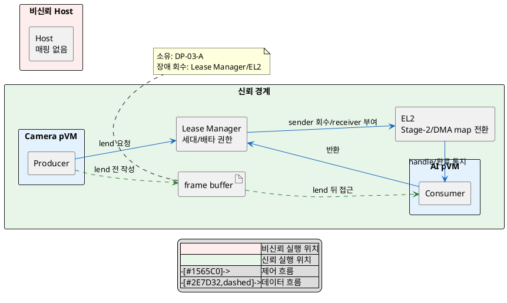
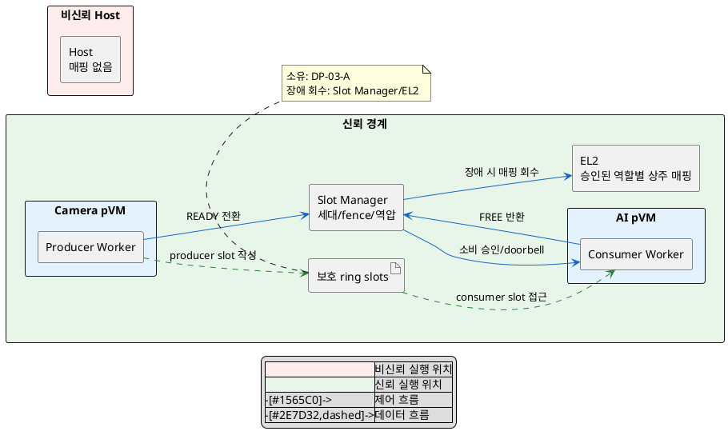

# DP-03-B. 공유 버퍼 접근권의 매핑 수명

## 1. 상태

평가 중

## 2. 결정 목적

공유 frame buffer의 접근권과 매핑을 프레임마다 옮길지, 승인된 pVM에 상주 매핑하고 slot 상태로 사용 순서를 제한할지 정한다.

## 3. 문제 상황

- 현재 PoC는 한 페이지를 송신 pVM에서 회수해 수신 pVM의 고정 IPA에 매핑하고 반환 뒤 되돌린다.
- 이전 수신자가 다음 세대 frame에 계속 접근하거나 생산자/소비자의 쓰기 권한이 겹치면 데이터가 섞일 수 있다. SEC-01은 Host와 비인가 도메인에 대한 격리 메모리 노출 0건을 요구한다. 프레임 세대 간 접근 차단 수준은 TBD다.
- 다중 페이지에서 매번 Stage-2와 Camera/AI DMA 매핑을 바꾸면 TLB 무효화와 전환 비용이 반복된다. PERF-02는 memcpy 0회, 전달 p99 5ms와 프레임당 전환 비용 1ms 이하를 요구한다.
- 상주 ring은 매핑 전환 비용을 줄이지만 사용 여부와 무관하게 buffer를 계속 점유한다(자원 효율 TBD).
- 장애 중 slot과 매핑을 함께 회수하지 못하면 자원이 누적된다. AVL-04는 1,000회 crash-restart 뒤 누수율 0 수렴을 요구한다.
- baseline으로 Host와 제3 도메인은 매핑하지 않고, CPU Stage-2와 Camera/AI DMA 권한을 같은 전송 상태에 결합한다.
- project-custom 범위는 승인된 sender/receiver의 매핑 수명이다. buffer 소유권은 DP-03-A, 정책/원장은 DP-03-C가 정한다.
- PoC는 한 페이지 exclusive lend만 확인했다. 상주 ring, 다중 페이지와 실제 DMA 경로는 확인되지 않았다.
- 따라서 시간에 따라 매핑 자체를 옮길지, 매핑을 유지하고 보호된 slot 상태로 접근 순서를 강제할지 선택해야 한다.

## 4. 결정 질문

> 프레임마다 배타적 접근권과 매핑을 대여하고 회수할 것인가, 보호된 ring을 양쪽 pVM에 상주 매핑하고 slot 상태로 접근 순서를 제어할 것인가?

## 5. 후보 구조

### 5.1 후보 A: 프레임별 exclusive lend와 매핑 회수

- 실행 위치: 보호 lease manager와 EL2다.
- 책임: 매 frame마다 송신 권한을 회수하고 수신 권한을 부여하며 반환 때 반대로 처리한다.
- 신뢰 경계: 한 시점에 승인된 한 역할만 CPU/DMA 접근권을 가진다.
- 자원 소유/회수: DP-03-A의 소유자가 buffer를 소유하고 lease manager가 비정상 종료 때 매핑을 강제 회수한다.

### 5.2 후보 B: 보호된 ring 상주 매핑과 slot 상태 전환

- 실행 위치: 승인된 Camera/AI pVM과 보호 slot manager/EL2다.
- 책임: 역할별 매핑을 유지하고 slot 세대, producer/consumer 상태, fence와 역압을 검증한다.
- 신뢰 경계: Host와 제3 도메인은 매핑하지 않는다. 상주 매핑 자체는 사용 승인을 뜻하지 않으며 보호 slot 상태가 접근 순서를 제한한다.
- 자원 소유/회수: DP-03-A의 소유자가 ring을 소유하고 slot manager가 장애 때 slot/fence/CPU/DMA 상태를 함께 회수한다.

## 6. 후보별 구조 다이어그램

### 6.1 후보 A

### 6.2 후보 B

## 7. 후보별 동작 구조

### 7.1 후보 A

1. 송신 pVM이 frame 작성을 끝내고 lend를 요청한다.
2. lease manager가 owner, receiver와 세대를 확인한다.
3. EL2가 송신 CPU/DMA 매핑을 회수하고 TLB를 무효화한다.
4. EL2가 수신 CPU/DMA 매핑을 만들고 수신 handle을 활성화한다.
5. 반환 또는 장애 때 반대 순서로 회수하고 소유자에게 돌려준다.

### 7.2 후보 B

1. slot manager가 승인된 producer/consumer와 ring 세대를 설정하고 역할별 매핑을 만든다.
2. producer가 FREE slot에 쓰고 fence 완료 뒤 READY로 전환한다.
3. consumer가 READY 세대와 fence를 확인하고 읽는다.
4. consumer가 완료 뒤 slot을 FREE로 반환하고 역압 정책이 다음 생산을 허용한다.
5. pVM 장애 때 slot manager가 관련 slot을 중지하고 EL2가 CPU/DMA 매핑을 회수한다.

## 8. 품질속성 비교

### 8.1 필수 gate와 실현 가능성

| 항목 | 기준 | 후보 A | 후보 B | 근거 |
|---|---|---|---|---|
| 보안성(SEC-01) | Host/비인가 도메인 노출 0건 | 통과 예상 | 통과 예상 | 두 후보 모두 Host와 제3 도메인 매핑을 금지한다. 프레임 세대 간 접근 차단은 별도 TBD다. |
| 성능(PERF-02) | 데이터 경로 memcpy 0회 | 통과 예상 | 통과 예상 | 두 후보 모두 같은 buffer를 사용한다. |
| 기술 실현 가능성 | 실제 다중 페이지 CPU/DMA 경로 확인 | 부분 확인 | 확인 필요 | 한 페이지 exclusive lend만 PoC로 관찰했다. |

### 8.2 잠정 별점

`★★★`는 시간 경계, 전환 비용, 회수 또는 점유량이 가장 유리하고 `★☆☆`는 가장 불리하다는 뜻이다.

| 품질속성 | 후보 A | 후보 B | 평가 이유 |
|---|---:|---:|---|
| 보안성(SEC-01/세대 간 TBD) | ★★★ | ★★☆ | 후보 A는 이전 주체 매핑을 매번 제거한다. 후보 B는 stale slot 접근을 별도 상태로 막는다. |
| 성능(PERF-02) | ★☆☆ | ★★★ | 후보 A는 매 frame map/unmap과 TLB 무효화를 수행한다. 후보 B는 상주 매핑을 재사용한다. |
| 가용성(AVL-04) | ★★☆ | ★★☆ | 후보 A는 미완료 lease, 후보 B는 분산 slot/fence 상태를 복구해야 한다. |
| 자원 효율(TBD) | ★★★ | ★☆☆ | 후보 B는 ring을 상주 예약한다. |

## 9. 핵심 트레이드오프

> 프레임별 exclusive lend는 이전 주체의 매핑을 제거해 시간에 따른 보안 경계를 좁힌다. 대신 매 frame의 map/unmap과 TLB 무효화로 전달 성능이 낮아진다.

> 상주 ring은 매핑 전환을 줄여 전달 성능을 높인다. 대신 예약 메모리가 늘고 stale slot, fence와 역압 상태를 검증해야 해 보안/회수 복잡도가 높아진다.

## 10. 검증 기준

| 검증 항목 | 공통 측정 방법 | 합격 기준 |
|---|---|---|
| 비인가 접근 | Host/제3 도메인 및 이전 세대 consumer의 CPU/DMA 접근 시도 | SEC-01 노출 0건, 세대 간 접근 기준은 승인 전까지 TBD |
| zero-copy/지연 | 30fps 다중 페이지 frame에서 복사와 전환 비용 추적 | memcpy 0회, p99 5ms, 전환 비용 1ms 이하 |
| 장애 회수 | 각 상태에서 producer/consumer crash를 1,000회 반복 | AVL-04: 누수율 0 수렴 |
| ring 자원 | 동일 처리량에서 예약 메모리와 slot 사용률 측정 | 예산 승인 전까지 TBD |

## 11. 검토 결과

## 12. 최종 결정
