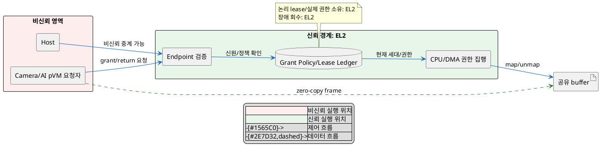
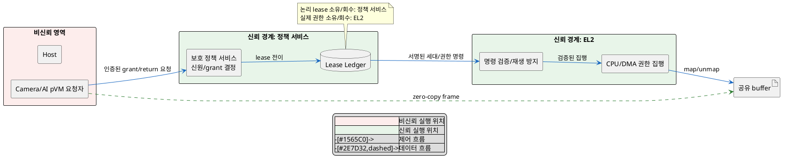

# DP-03-C. 공유 버퍼 grant 정책과 lease 원장 위치

## 1. 상태

평가 중

## 2. 결정 목적

공유 buffer의 grant 정책과 lease 상태를 EL2가 직접 소유할지, 별도 보호 정책 서비스가 소유하고 EL2는 권한 집행만 맡을지 정한다.

## 3. 문제 상황

- 현재 PoC는 EL2가 endpoint 확인, grant 정책, lease 상태, 접근권 전환과 회수를 모두 처리한다. pKVM에는 pVM 간 공유를 위한 표준 정책 주체가 없다.
- 침해된 Host와 위장 pVM 요청을 거부하려면 owner, receiver, slot 세대와 회수 상태를 보호된 원장에서 확인해야 한다. SEC-01은 격리 메모리 노출 0건을 요구한다.
- 정책을 EL2에 넣으면 호출 단계를 줄이지만 pKVM TCB가 증가한다. SEC-01의 KPI에는 TCB 규모 릴리스당 증가율 5% 이내가 포함된다.
- 정책을 EL2 밖으로 분리하면 인증된 명령, 재생 방지와 원장/실제 매핑의 일치 규약이 추가된다. 이 왕복은 PERF-02의 전달 지연 예산을 사용한다.
- 정책을 특정 보호 서비스 계약에 결합했을 때 실행 환경 교체에 드는 변경 범위는 TBD다.
- baseline으로 EL2가 CPU Stage-2와 Camera/AI DMA 접근권을 최종 적용한다. buffer 소유권과 매핑 수명은 DP-03-A/DP-03-B가 정한다.
- DP-02에서 확인한 Workload 신원을 endpoint 권한 확인의 입력으로 사용한다.
- project-custom 범위는 grant 판단과 lease 원장의 소유 위치다. PoC는 EL2 소유만 관찰했다.
- 따라서 정책/원장을 EL2 TCB에 포함할지, 보호 서비스로 분리하고 인증된 집행 경계를 둘지 선택해야 한다.

## 4. 결정 질문

> 공유 버퍼의 grant 정책과 lease 원장을 EL2가 직접 소유할 것인가, EL2 밖의 보호 정책 서비스가 소유하고 EL2는 권한만 집행할 것인가?

## 5. 후보 구조

### 5.1 후보 A: EL2가 grant 정책과 lease 원장을 직접 소유

- 실행 위치: EL2/pKVM 신뢰 경계다.
- 책임: endpoint 신원, 허용 관계, lease 세대, 회수 조건을 확인하고 CPU/DMA 권한을 적용한다.
- 신뢰 경계: Host와 pVM 요청은 비신뢰 입력이다. 정책과 실제 매핑은 한 신뢰 주체 안에 있다.
- 자원 소유/회수: EL2의 lease 원장이 권한 수명을 소유하고 pVM 종료 때 직접 회수한다.

### 5.2 후보 B: 분리된 보호 정책 서비스가 정책과 원장을 소유하고 EL2가 집행

- 실행 위치: TEE/Secure Partition 등 별도 보호 서비스와 EL2다.
- 책임: 정책 서비스가 신원, 허용 관계와 lease를 관리하고 인증된 권한 명령을 발급한다. EL2는 발급자, 세대와 현재 매핑을 확인해 집행한다.
- 신뢰 경계: 정책 서비스/EL2 사이에 새 인증 경계가 생긴다. Host는 경로에 포함하지 않는다.
- 자원 소유/회수: 정책 서비스가 논리 lease를 소유하고 EL2가 실제 접근권을 소유한다. 장애 때 양쪽이 세대를 대조해 회수한다.

## 6. 후보별 구조 다이어그램

### 6.1 후보 A

### 6.2 후보 B

## 7. 후보별 동작 구조

### 7.1 후보 A

1. EL2가 요청 endpoint에서 호출자 신원을 확인한다.
2. EL2가 owner/receiver 허용 관계와 현재 lease 세대를 조회한다.
3. 조건이 맞으면 원장 상태와 CPU/DMA 매핑을 한 전이로 바꾼다.
4. 반환/종료 시 EL2가 원장과 실제 매핑을 직접 대조하고 회수한다.
5. 정책 변경은 EL2 코드와 검증 범위 변경으로 반영한다.

### 7.2 후보 B

1. 보호 정책 서비스가 인증된 pVM 요청을 받고 허용 관계와 lease를 확인한다.
2. 정책 서비스가 단조 증가 세대가 포함된 인증 명령을 만든다.
3. EL2가 발급자, 세대, 대상과 현재 매핑 상태를 확인한다.
4. EL2가 CPU/DMA 권한을 적용하고 결과를 정책 서비스 원장에 결합한다.
5. 한쪽 장애 뒤 재시작하면 양쪽이 세대와 실제 매핑을 대조한 뒤 미완료 lease를 회수한다.

## 8. 품질속성 비교

### 8.1 필수 gate와 실현 가능성

| 항목 | 기준 | 후보 A | 후보 B | 근거 |
|---|---|---|---|---|
| 보안성(SEC-01) | 격리 메모리 노출 0건 | 통과 예상 | 확인 필요 | 후보 B는 인증 명령의 위조/재생과 원장/매핑 불일치를 검증해야 한다. |
| 성능(PERF-02) | 데이터 경로 memcpy 0회 | 통과 예상 | 통과 예상 | 정책 위치는 data 복사 여부를 바꾸지 않는다. |
| 기술 실현 가능성 | 정책/원장/권한 전이 구현 확인 | 부분 확인 | 확인 필요 | EL2 소유 한 페이지 PoC만 관찰했다. |

### 8.2 잠정 별점

`★★★`는 TCB 증가, 호출 단계 또는 변경 범위가 가장 작고 `★☆☆`는 가장 크다는 뜻이다.

| 품질속성 | 후보 A | 후보 B | 평가 이유 |
|---|---:|---:|---|
| 보안성(SEC-01 TCB KPI) | ★☆☆ | ★★★ | 후보 A는 정책 코드를 EL2 TCB에 넣는다. 후보 B는 EL2를 권한 검증/집행으로 제한한다. |
| 성능(PERF-02) | ★★★ | ★★☆ | 후보 B는 보호 실행 환경 사이 정책 왕복을 추가한다. |
| 변경 용이성(TBD) | ★☆☆ | ★★★ | 후보 A의 정책 변경은 EL2를 수정한다. 후보 B는 정책 서비스 안에서 변경할 수 있다. |

## 9. 핵심 트레이드오프

> EL2가 정책과 원장을 소유하면 추가 왕복을 제거해 전달 성능이 높아진다. 대신 EL2 TCB와 정책 변경 검증 범위가 늘어나 보안성과 변경 용이성이 낮아진다.

> 보호 정책 서비스로 분리하면 EL2를 권한 집행에 집중시켜 TCB 증가를 줄인다. 대신 인증 명령과 원장 동기화 왕복이 추가되어 전달 성능이 낮아지고 실현 가능성 확인이 필요하다.

## 10. 검증 기준

| 검증 항목 | 공통 측정 방법 | 합격 기준 |
|---|---|---|
| 비인가 grant | Host/위장 pVM/잘못된 receiver/오래된 세대 요청 주입 | SEC-01: 원본 노출 0건 |
| TCB 변화 | 기준 릴리스 대비 EL2 KLoC와 공격 표면 diff | SEC-01 KPI: TCB KLoC 증가율 5% 이내 |
| 전달 성능 | 같은 buffer/매핑 후보에서 정책 요청부터 권한 완료까지 측정 | PERF-02: 전체 전달 p99 5ms, 전환 비용 1ms 이하 |
| 복구 일치 | 정책/EL2를 전이 단계별로 중단하고 원장/실제 매핑 대조 | stale lease와 잔여 매핑 0 |

## 11. 검토 결과

## 12. 최종 결정
