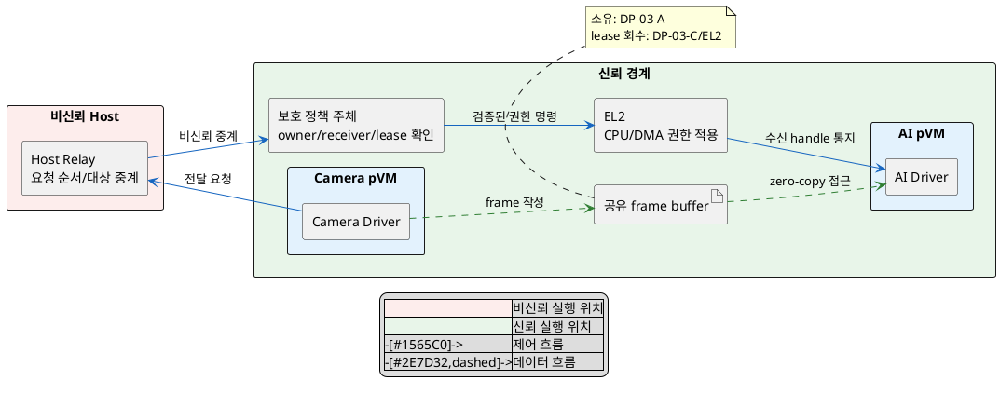
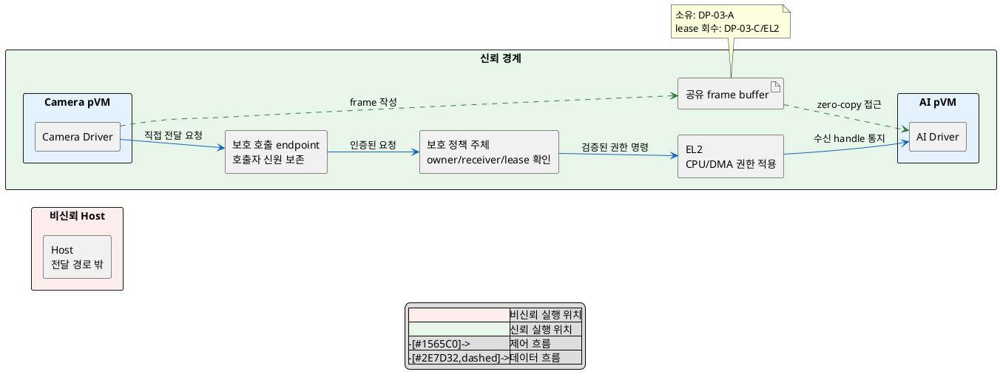

# DP-03. 복사 없는 버퍼 전달에서 Host를 거칠지 여부

## 1. 상태

평가 중

## 2. 결정 목적

Camera pVM과 AI pVM 사이의 zero-copy 버퍼 전달에서 제어 요청이 비신뢰 Host를 거치는지 정한다. 원본 데이터 보호를 공통 gate로 유지하면서 부가 정보 노출, 전달 지연과 수정 범위를 비교한다.

## 3. 문제 상황

- 현재 pVM 통신 기능은 pVM과 Host 사이의 통신을 제공하지만, pVM이 보호 영역에 직접 zero-copy 전달을 요청하는 규격은 없다.
- 잘못된 권한 전환은 Host나 제3 도메인에 영상 원본을 노출한다. SEC-01은 격리 메모리 노출 0건을 요구하고 PERF-02는 데이터 경로 memcpy 0회를 요구한다.
- 기존 Host 통신 경로를 재사용하면 Host가 전달 시점, 송신자, 수신자와 순서를 볼 수 있다. 이 부가 정보의 허용 범위는 상위 요구에서 TBD다.
- Host 중계는 제어 왕복을 추가한다. PERF-02의 전달 지연은 p99 5ms, 프레임당 전환 비용은 1ms 이하다.
- 현재 Host 통신 API와 보호 호출 규격에는 pVM 간 버퍼 전달 기능이 없다. 어느 경로를 선택해도 Host 통신 API, pVM driver 또는 보호 호출 규격 일부를 수정해야 한다(변경 용이성 TBD).
- baseline으로 실제 frame은 Host에 매핑하지 않고, DP-03-C의 보호 주체가 grant를 확인하며, EL2가 CPU/DMA 접근권을 최종 적용한다.
- project-custom 범위는 전달 제어 요청의 경로다. 버퍼 소유권은 DP-03-A, 매핑 수명은 DP-03-B, 정책 원장은 DP-03-C에서 정한다.
- 따라서 기존 Host 중계 경로를 사용할지, pVM이 보호 영역에 직접 요청할지 선택해야 한다.

## 4. 결정 질문

> Host가 버퍼 전달 요청을 중계할 것인가, pVM이 Host를 거치지 않고 보호 영역에 직접 요청할 것인가?

## 5. 후보 구조

### 5.1 후보 A: Host 요청 중계와 EL2 최종 검증

- 실행 위치: 비신뢰 Host의 relay와 신뢰 경계 안의 정책 주체/EL2다.
- 책임: Host는 요청 순서와 대상을 중계한다. 보호 주체는 요청자, 수신자, 전송 ID와 lease를 검증한다.
- 신뢰 경계: Host의 내용과 순서를 신뢰하지 않는다. frame data는 Host를 지나지 않는다.
- 자원 소유/회수: DP-03-A의 소유자가 버퍼를 소유하고 DP-03-C의 원장 주체가 lease를 회수한다.

### 5.2 후보 B: pVM의 보호 영역 직접 요청

- 실행 위치: 송신/수신 pVM의 driver와 보호 호출 endpoint/EL2다.
- 책임: pVM이 보호 endpoint에 직접 요청하고 보호 주체가 신원과 lease를 확인한다.
- 신뢰 경계: Host를 제어 경로에서 제외한다. pVM driver부터 보호 endpoint까지의 호출자 신원을 보존한다.
- 자원 소유/회수: 후보 A와 같은 소유/회수 주체를 사용한다. 호출 channel 장애 시 보호 주체가 미완료 lease를 회수한다.

## 6. 후보별 구조 다이어그램

### 6.1 후보 A

### 6.2 후보 B

## 7. 후보별 동작 구조

### 7.1 후보 A

1. Camera pVM이 전송 식별자와 수신자를 Host relay에 보낸다.
2. Host가 요청을 보호 정책 주체에 중계한다.
3. 보호 정책 주체는 Host 주장을 신뢰하지 않고 endpoint 신원, owner와 lease 세대를 확인한다.
4. EL2가 송신/수신 CPU와 DMA 접근권을 원자적으로 바꾼다.
5. frame은 공유 버퍼에서 AI pVM으로 zero-copy 전달되고, 완료 뒤 lease를 회수한다.

### 7.2 후보 B

1. Camera pVM driver가 보호 호출 endpoint에 직접 전송을 요청한다.
2. endpoint가 호출자 신원을 보존해 정책 주체에 전달한다.
3. 정책 주체가 owner, receiver, 전송 식별자와 lease 세대를 확인한다.
4. EL2가 CPU/DMA 접근권을 원자적으로 바꾸고 AI pVM에 handle을 통지한다.
5. frame 전달과 회수는 후보 A와 같은 데이터/회수 경로를 사용한다.

## 8. 품질속성 비교

### 8.1 필수 gate

| 품질속성 | 기준 | 후보 A | 후보 B | 근거 |
|---|---|---|---|---|
| 보안성(SEC-01) | 격리 메모리 노출 0건 | 확인 필요 | 확인 필요 | 두 후보 모두 Host data 매핑 금지와 실제 Camera/AI DMA 권한 전환을 검증해야 한다. |
| 성능(PERF-02) | 데이터 경로 memcpy 0회 | 통과 예상 | 통과 예상 | 제어 경로만 다르고 frame은 공유 버퍼로 전달한다. |

### 8.2 잠정 별점

`★★★`는 노출/지연/수정 범위가 가장 작고 `★☆☆`는 가장 크다는 뜻이다. SEC-01 gate가 닫히기 전까지 구조 예상치다.

| 품질속성 | 후보 A | 후보 B | 평가 이유 |
|---|---:|---:|---|
| 보안성(전달 부가 정보 TBD) | ★★☆ | ★★★ | 후보 B는 Host가 송신자, 수신자와 순서를 보는 경로를 제거한다. |
| 성능(PERF-02) | ★★☆ | ★★★ | 후보 B는 Host 제어 왕복을 제거한다. 실제 p99는 측정이 필요하다. |
| 변경 용이성(TBD) | ★★★ | ★☆☆ | 후보 A는 기존 Host 통신 경로를 재사용한다. 후보 B는 pVM driver와 보호 호출 규격을 추가한다. |

## 9. 핵심 트레이드오프

> Host 중계를 유지하면 기존 통신 경로를 재사용해 변경 용이성이 높아진다. 대신 Host에 전달 부가 정보가 노출되고 제어 왕복이 추가되어 보안성과 전달 성능이 낮아진다.

> 보호 영역 직접 요청은 Host의 관찰 범위와 제어 왕복을 줄인다. 대신 pVM driver와 보호 호출 규격의 변경 범위가 늘어난다.

## 10. 검증 기준

| 검증 항목 | 공통 측정 방법 | 합격 기준 |
|---|---|---|
| 원본 보호 | Host dump와 DMA 공격을 전달 상태별로 주입 | SEC-01: 격리 메모리 노출 0건 |
| zero-copy | frame 경로의 memcpy와 mapping을 추적 | PERF-02: 데이터 경로 memcpy 0회 |
| 전달 성능 | 30fps 다중 페이지 frame의 요청부터 수신 가능 시점까지 측정 | p99 5ms, 프레임당 전환 비용 1ms 이하 |
| 부가 정보 | Host가 관찰 가능한 sender/receiver/시점/순서를 기록 | 허용 범위는 사용자 승인 전까지 TBD |

## 11. 검토 결과

## 12. 최종 결정
