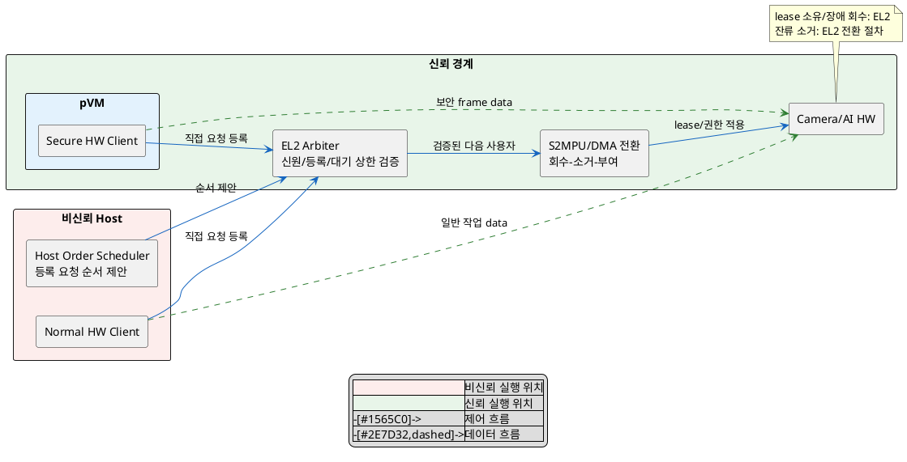
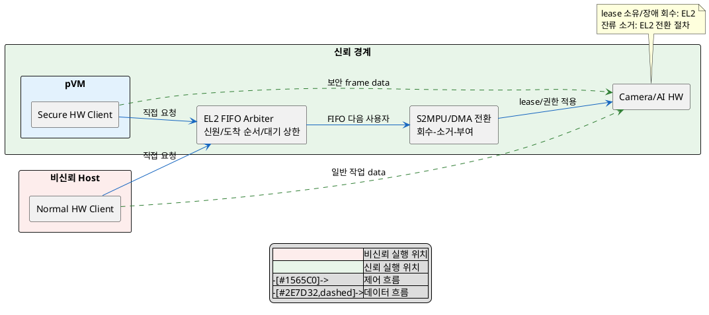

# DP-04. HW 사용 순서 결정 위치

## 1. 상태

평가 중

## 2. 결정 목적

Host 일반 기능과 보안 Workload가 Camera/AI HW를 공유할 때 사용 순서를 Host에서 정할지 EL2에서 도착 순서로 정할지 결정한다. 권한 전환 보안은 공통 gate로 두고 지연, 대기 상한과 정책 변경 범위를 비교한다.

## 3. 문제 상황

- Camera/AI HW는 Host 일반 기능과 pVM Workload가 함께 사용하며, 현재 Host가 순서를 정하고 EL2가 접근권을 바꾼다.
- 이전 주체 권한 회수, 잔류 데이터 삭제와 다음 주체 권한 부여가 원자적으로 끝나지 않으면 권한이 겹치거나 비할당 메모리로 DMA가 접근할 수 있다. SEC-02는 권한 중첩 0, SEC-03은 비할당 도메인 접근 0을 요구한다.
- 침해된 Host가 특정 요청을 계속 미루지 못하도록 두 후보 모두 EL2에 요청자를 직접 등록하고 최대 대기 시간을 강제해야 한다. 최대 대기 수치는 상위 요구에서 TBD다.
- Host 판단과 호출 단계가 전환 경로에 남으면 PERF-04의 전환 지연 p99 10ms 예산을 사용한다.
- Host가 순서를 정하면 일반 기능의 작업 상황을 반영하고 정책을 EL2 밖에서 바꿀 수 있다. 이 변경 용이성의 상위 기준은 TBD다.
- baseline으로 EL2가 S2MPU/DMA 권한 회수, 잔류 데이터 삭제와 다음 권한 부여를 최종 집행한다. HW 종류, 우선순위 값과 예약 정책은 하위 결정이다.
- project-custom 범위는 검증된 요청들의 순서를 Host 정책이 정할지, EL2가 도착 순서대로 정할지다. DP-03-B와 CPU/DMA 권한 상태를 함께 맞춰야 한다.
- 따라서 Host의 조정 가능성을 유지할지, Host를 순서 판단에서 제외하고 EL2 FIFO로 제한할지 선택해야 한다.

## 4. 결정 질문

> Camera/AI HW 사용 순서를 Host가 정하고 EL2가 검증과 대기 상한을 강제할 것인가, EL2가 요청이 도착한 순서대로 정할 것인가?

## 5. 후보 구조

### 5.1 후보 A: Host가 사용 순서를 정하고 EL2가 검증과 대기 상한 강제

- 실행 위치: 비신뢰 Host scheduler와 EL2다.
- 책임: 각 requester는 EL2에 직접 등록한다. Host는 등록된 요청의 순서를 제안하고 EL2는 신원, 등록 여부와 대기 상한을 검증한다.
- 신뢰 경계: Host의 순서 제안을 신뢰하지 않는다. EL2만 HW lease와 S2MPU/DMA 권한을 바꾼다.
- 자원 소유/회수: EL2가 현재 HW lease를 소유하고 requester/Host 장애 때 권한과 잔류 데이터를 회수한다.

### 5.2 후보 B: EL2가 요청 순서대로 사용권을 부여

- 실행 위치: requester와 EL2 FIFO arbiter다.
- 책임: requester가 EL2에 직접 요청하고 EL2가 검증된 도착 순서대로 lease를 부여한다.
- 신뢰 경계: Host를 순서 결정에서 제외한다. EL2에는 우선순위/예약 정책을 넣지 않는다.
- 자원 소유/회수: 후보 A와 같이 EL2가 lease 소유/회수와 권한 전환을 모두 담당한다.

## 6. 후보별 구조 다이어그램

### 6.1 후보 A

### 6.2 후보 B

## 7. 후보별 동작 구조

### 7.1 후보 A

1. 각 HW requester가 신원과 요청 시점을 EL2에 직접 등록한다.
2. Host scheduler가 등록 집합 안에서 다음 사용자 순서를 제안한다.
3. EL2가 제안 대상의 등록/신원과 최대 대기 시간 위반 여부를 확인한다.
4. EL2가 이전 권한 회수, 잔류 데이터 삭제와 다음 권한 부여를 원자적으로 수행한다.
5. Host가 응답하지 않거나 상한을 넘기면 EL2가 강제로 대기 요청을 진행한다.

### 7.2 후보 B

1. 각 requester가 EL2 FIFO에 직접 등록한다.
2. EL2가 호출자 신원과 요청 중복을 확인한다.
3. 현재 lease가 끝나면 가장 먼저 도착한 유효 요청을 선택한다.
4. EL2가 회수, 소거와 권한 부여를 원자적으로 수행한다.
5. requester 장애 때 lease를 회수하고 다음 FIFO 요청을 진행한다.

## 8. 품질속성 비교

### 8.1 필수 gate

| 품질속성 | 기준 | 후보 A | 후보 B | 근거 |
|---|---|---|---|---|
| 보안성(SEC-02) | 권한 중첩 0 | 통과 예상 | 통과 예상 | 순서 위치와 무관하게 EL2가 원자적 전환을 집행한다. |
| 보안성(SEC-03) | 비할당 도메인 DMA 접근 0 | 통과 예상 | 통과 예상 | EL2가 S2MPU/DMA 대상과 매핑을 검증한다. |
| 가용성(TBD) | 요청 최대 대기 상한 | 확인 필요 | 확인 필요 | 공통 강제 조건이나 수치가 승인되지 않았다. |

### 8.2 잠정 별점

`★★★`는 전환 지연, 대기 독립성 또는 정책 변경 범위가 가장 유리하고 `★☆☆`는 가장 불리하다는 뜻이다.

| 품질속성 | 후보 A | 후보 B | 평가 이유 |
|---|---:|---:|---|
| 보안성(SEC-02, SEC-03) | ★★★ | ★★★ | 두 후보의 권한 집행 경계가 같다. |
| 성능(PERF-04) | ★★☆ | ★★★ | 후보 B는 Host의 순서 판단/호출 단계를 제거한다. |
| 가용성(대기 상한 TBD) | ★★☆ | ★★★ | 후보 A는 Host 미응답 fallback이 필요하고 후보 B는 EL2가 계속 진행한다. |
| 변경 용이성(TBD) | ★★★ | ★☆☆ | 후보 A는 순서 정책을 Host에서 바꾼다. 후보 B의 FIFO 외 정책은 EL2 변경이다. |

## 9. 핵심 트레이드오프

> Host가 순서를 정하면 일반 작업 상황을 반영하고 EL2 수정 없이 정책을 바꿔 변경 용이성이 높아진다. 대신 비신뢰 Host의 판단/fallback 단계가 남아 전환 성능과 대기 가용성이 낮아질 수 있다.

> EL2가 도착 순서대로 정하면 Host 판단을 제거해 전환 성능과 대기 독립성이 높아진다. 대신 순서 정책을 바꾸려면 EL2를 수정해야 한다.

## 10. 검증 기준

| 검증 항목 | 공통 측정 방법 | 합격 기준 |
|---|---|---|
| 권한 중첩/잔류 | 고빈도 전환 중 권한 snapshot과 잔류 data scan | SEC-02: 중첩 0, 10^6회 무위반, scan 커버리지 100% |
| DMA 격리 | 할당되지 않은 도메인으로 DMA 읽기/쓰기 주입 | SEC-03: 접근 0, 공격 벡터 구현율 100% |
| 전환 지연 | 30fps 경합 환경에서 회수 시작부터 다음 권한 완료까지 p99 | PERF-04: p99 10ms 이하 |
| 최대 대기 | Host 중단/요청 폭주에서 requester별 대기 시간 측정 | 임계값 승인 전까지 TBD, 무기한 대기 0 |

## 11. 검토 결과

## 12. 최종 결정
