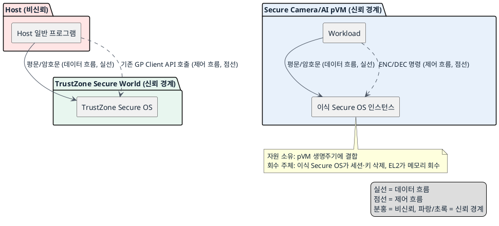
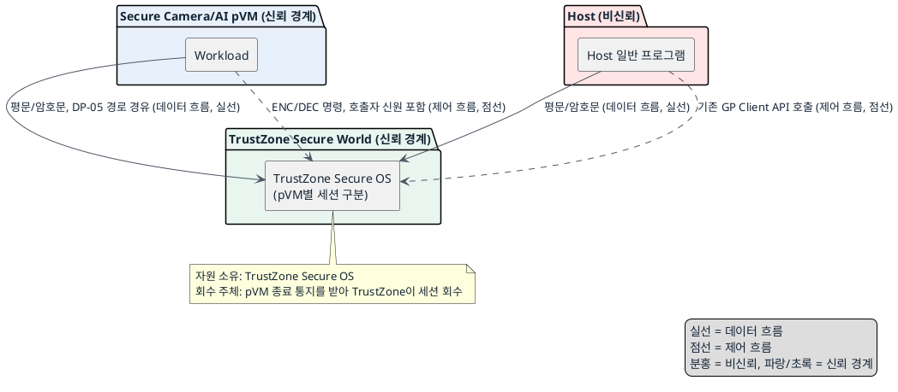

# DP-05-A. Secure OS 서비스 실행 위치

## 1. 상태

평가 중

## 2. 결정 목적

신규 Workload가 사용할 Secure OS(ENC/DEC) 서비스를 pVM마다 이식해 로컬로 둘지, 기존 TrustZone 공용 서비스로 둘지 정한다. 이 결정은 DP-05(pVM-TEE 호출 경로)와 DP-06(암호화 저장 파일 보관 주체)의 전제가 된다.

## 3. 문제 상황

- 현재 구조: 기존 Host 프로그램은 GP Client API로 TrustZone Secure OS를 공용 호출한다(FR-06). 과제 범위는 기존 Secure OS를 pVM 도메인에서 동작하거나 확장하기 위한 SW 이식·수정을 포함한다(`docs/00_overview.md` 과제 범위 표). 신규 Workload가 사용할 Secure OS 서비스의 실행 위치는 아직 고정되지 않았다.
- 요구/품질속성: SEC-05(저장 데이터 기밀성 — 평문과 키는 TEE 밖으로 내보내지 않는다, 공통 필수 gate), SEC-06(보안 채널 신뢰 — 비인가 주체의 TEE 호출 성립 0건, 공통 필수 gate), PERF-03(E2E 지연), EXT-06(Secure OS/TEE 교체성, 공통 필수 gate), CS-02(GP 표준 규격 준수). 신뢰 경계: Host는 비신뢰 주체다. pVM/Workload와 TrustZone Secure World는 신뢰 대상이지만 서로 다른 실행 도메인이다.
- 충돌/위험: pVM별로 Secure OS를 이식하면 Workload와 키 처리 경계를 pVM 안에 둘 수 있지만, 이식된 실행 환경이 TrustZone 하드웨어 secure world와 동등하게 키·평문을 보호하는지 확인되지 않았다. 기존 TrustZone 공용 서비스를 그대로 쓰면 검증된 보안 경계는 유지하지만, 여러 pVM의 호출자 신원을 구분해야 하고 호출마다 pVM-TrustZone 전달 단계를 거쳐 지연이 늘어난다.
- baseline 범위: 기존 Host↔TrustZone GP Client API/SMC 경로와 TrustZone Secure OS 자체 구현은 baseline으로 고정한다. 이번 DP에서 TEE 제품을 바꾸거나 SMC 프로토콜을 바꾸지 않는다.
- project-custom 범위: 신규 Workload의 ENC/DEC 요청을 처리할 Secure OS 서비스 인스턴스의 실행 위치는 이번 DP의 project-custom 범위다.
- 선행/연관 DP: DP-02(Workload 최종 검증 위치)에서 확인한 Workload 신원은 이 DP의 호출자 식별에 사용할 수 있다. 이 DP의 결과는 DP-05(pVM-TEE 호출 경로)의 전제가 된다. 후보 B(기존 TrustZone 공용 서비스)를 선택한 경우에만 DP-05가 pVM→TEE 요청의 전달 경로를 정한다. 후보 A(pVM별 이식)를 선택하면 신규 Workload의 ENC/DEC 호출에는 DP-05가 적용되지 않는다. DP-06(암호화된 저장 파일 보관 주체)은 이 DP가 정한 키 처리 주체를 전제로 한다.
- 구조적 갈림길: 위 문제를 해결하려면 신규 Workload가 사용할 Secure OS 서비스를 pVM마다 이식해 로컬로 둘지, 기존 TrustZone 공용 서비스에 맡길지 정해야 한다.

## 4. 결정 질문

Secure OS 서비스를 pVM마다 이식해 로컬로 실행할 것인가, 기존 TrustZone Secure OS에서 공용으로 실행할 것인가?

## 5. 후보 구조

### 후보 A: pVM별 이식 Secure OS 서비스

- 실행 위치: 각 Secure Camera/AI pVM 내부에 이식된 Secure OS 인스턴스.
- 책임: pVM 안의 Secure OS가 해당 Workload의 세션, 키 생성·보관과 ENC/DEC 처리를 전담한다.
- 데이터 흐름: Workload → pVM 내부 Secure OS 인스턴스로 평문/암호문이 오가며 pVM 경계를 벗어나지 않는다.
- 제어 흐름: Workload가 pVM 내부 GP Client API 호출로 세션을 열고 명령을 보낸다. 기존 Host 일반 기능은 별도로 TrustZone SMC 경로를 그대로 사용한다.
- 신뢰/비신뢰 주체: Host는 비신뢰. pVM과 pVM 내부 Secure OS 인스턴스는 신뢰 대상이며 같은 신뢰 경계 안에 있다.
- 자원 소유·회수 주체: pVM 생명주기가 곧 Secure OS 인스턴스의 수명이다. pVM 종료 시 이식 Secure OS가 세션과 키를 지우고 EL2가 pVM 메모리를 최종 회수한다. Framework는 종료만 요청한다.

### 후보 B: 기존 TrustZone 공용 Secure OS 서비스

- 실행 위치: 기존 TrustZone Secure World의 공용 Secure OS.
- 책임: TrustZone Secure OS가 여러 pVM과 Host의 세션·키를 함께 구분해 처리한다.
- 데이터 흐름: Workload → (DP-05에서 정한 경로) → TrustZone Secure OS로 평문/암호문이 전달된다.
- 제어 흐름: Workload의 ENC/DEC 요청이 DP-05가 정한 전달 경로(Host 중계 또는 EL2/FF-A 직접)를 거쳐 TrustZone Secure OS에 도달하고, TrustZone이 호출자별 세션을 구분해 처리한다.
- 신뢰/비신뢰 주체: Host는 비신뢰. pVM과 TrustZone Secure World는 신뢰 대상이지만 서로 다른 실행 도메인이며, 전달 경로에서 호출자 신원을 보존해야 한다.
- 자원 소유·회수 주체: TrustZone Secure OS가 pVM별 세션과 키 자원을 소유한다. pVM 종료 시 Framework가 세션 종료를 TrustZone에 통지해 회수를 요청한다.

## 6. 후보별 구조 다이어그램

### 후보 A 다이어그램

### 후보 B 다이어그램

## 7. 후보별 동작 구조

- 후보 A: Workload가 pVM 내부 GP Client API로 이식 Secure OS 인스턴스에 세션을 연다. 인스턴스는 pVM 안에서 키를 생성·보관하고 ENC/DEC를 수행한 뒤 결과를 Workload에 반환한다. 기존 Host 일반 기능은 영향 없이 기존 SMC 경로로 TrustZone을 그대로 호출한다. pVM이 삭제되면 Framework가 인스턴스의 세션과 키 자원을 pVM 자원 회수와 함께 정리한다.
- 후보 B: Workload의 ENC/DEC 요청은 DP-05가 정한 경로(Host 중계 또는 EL2/FF-A 직접)를 거쳐 TrustZone Secure OS에 도달한다. TrustZone은 호출자 pVM 신원으로 세션을 구분해 키를 관리하고 처리 결과를 반환한다. pVM이 삭제되면 Framework가 TrustZone에 세션 종료를 통지하고 TrustZone이 해당 세션과 키를 회수한다.

## 8. 품질속성 비교

### 필수 gate

| 품질속성 | gate 기준 | 후보 A | 후보 B |
|---|---|---|---|
| 보안성(SEC-05) | 평문/키가 TEE 밖으로 나가지 않음 | 확인 필요 — 이식 인스턴스가 TrustZone과 동등한 격리를 보장하는지 미검증 | 통과 가능 — 기존 TrustZone 경계를 그대로 사용 |
| 보안성(SEC-06) | 비인가 주체의 TEE 호출 성립 0건 | 확인 필요 — pVM 경계 자체가 인증 근거가 되는지 미검증 | 통과 가능 — DP-05의 호출자 신원 확인에 의존 |
| 확장성(EXT-06) | Secure OS 교체 시 인터페이스 외 재이식 파일 0개 | 확인 필요 — 이식 인스턴스 자체가 Secure OS 버전에 결합되어 교체 범위가 늘 수 있음 | 통과 가능 — 기존 GP 표준 인터페이스 경계만 유지하면 됨 |

후보 A의 세 gate가 모두 `확인 필요` 상태이므로, 이 DP는 조건부 결정 이상으로 진행하지 않는다.

### 별점 비교 (gate 통과를 전제로 한 잠정 평가)

| 품질속성 | 기준 | 후보 A | 후보 B |
|---|---|---|---|
| 성능(PERF-03, E2E 지연 p99 100ms 이하) | ★1: 호출마다 도메인 간 전달·인증 단계가 남음, ★2: 전달 단계 일부 축소, ★3: 도메인 간 전달 단계 없음 | ★3(잠정) — pVM 내부 호출만 사용해 도메인 간 전달 단계가 없음 | ★1(잠정) — 매 요청 DP-05 경로의 전달·호출자 확인 단계를 거침 |
| 확장성(EXT-06 KPI: 교체 대응 공수) | ★1: 인스턴스마다 재이식 필요, ★2: 일부 구성요소만 영향, ★3: 인터페이스 경계만 유지하면 무수정 | ★1(잠정) — pVM별 인스턴스가 Secure OS 버전에 종속 | ★3(잠정) — 기존 자산과 인터페이스를 그대로 재사용 |
| 자원 효율 | TBD — 공식 KPI 없음 | 정성적으로 인스턴스마다 메모리·이식 검증 자원이 필요 | 정성적으로 인스턴스 자원을 공유 |

별점은 SEC-05/06/EXT-06 gate가 `확인 필요` 상태이므로 잠정 값이며, 확정 근거로 사용하지 않는다.

## 9. 핵심 트레이드오프

pVM별 이식 서비스는 도메인 간 전달 단계를 없애 PERF-03 지연을 줄일 수 있다. 대신 이식 인스턴스마다 TrustZone과 동등한 SEC-05/SEC-06 격리 수준을 확인해야 하고, Secure OS 버전 교체 시 인스턴스별 재이식 범위가 늘어나 EXT-06 대응 공수가 커진다. 기존 TrustZone 공용 서비스는 검증된 SEC-05/SEC-06 경계와 EXT-06 인터페이스 재사용성을 유지한다. 대신 매 요청이 DP-05 전달 경로와 호출자 확인 단계를 거쳐 PERF-03 지연이 늘어난다.

## 10. 검증 기준

- SEC-05/SEC-06 확인 필요 gate: 후보 A가 선택되면 이식 Secure OS 인스턴스의 격리 수준을 TrustZone 기준과 비교 검증하는 절차를 먼저 정의하고 통과해야 한다.
- EXT-06 확인 필요 gate: 후보 A가 선택되면 Secure OS 버전 교체 시 인스턴스별 재이식 파일 수를 실측해 게이트 통과 여부를 재평가한다.
- PERF-03: 두 후보 모두 `docs/03_qa_quality_scenarios.md`의 E2E 지연 p99 100ms 기준으로 측정한다.
- 검증 순서: gate 확인 필요 항목이 닫히기 전에는 조건부 결정 이상으로 진행하지 않는다.

## 11. 검토 결과

## 12. 최종 결정
