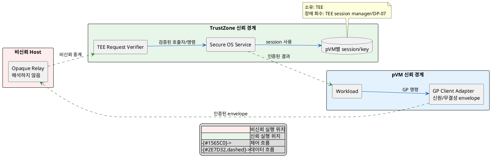
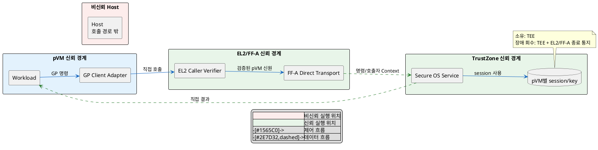

# DP-05. pVM-TEE 호출 경로

## 1. 상태

평가 중

## 2. 결정 목적

pVM Workload가 기존 TrustZone TEE의 암호화/복호화 서비스를 호출할 때 비신뢰 Host를 opaque relay로 사용할지, EL2/FF-A 직접 경로를 만들지 정한다.

## 3. 문제 상황

- 기존 Host 프로그램은 GP Client API와 SMC 경로로 TrustZone TEE를 호출한다. pVM Workload도 같은 서비스에 명령을 보내야 한다.
- 기존 Host 중심 경로만 사용하면 TEE가 여러 pVM 요청을 같은 Host 요청으로 볼 수 있고, 침해된 Host가 pVM으로 위장하거나 요청을 바꿀 수 있다. SEC-06은 비인가 TEE 호출 성립 0건과 호출자 신원/무결성 검증 커버리지 100%를 요구한다.
- Secure OS 전용 경로가 여러 구성 요소로 퍼지면 Secure OS 교체 때 GP 경계 밖 파일을 수정할 수 있다. EXT-06은 인터페이스 외 재이식 파일 0개를 요구한다.
- Host relay와 요청 자체 인증은 PERF-03의 E2E p99 100ms 예산을 사용한다.
- baseline으로 CS-02의 GP 표준 인터페이스와 기존 Host→TEE SMC 경로를 유지한다. Host는 신뢰하지 않으며 후보 A에서도 요청 내용을 해석하지 않는다.
- DP-02에서 확인한 Workload 신원을 pVM 호출자 신원 확인의 입력으로 사용한다.
- project-custom 범위는 pVM과 공용 TrustZone TEE 사이 제어/data envelope 전달 경로다. DP-05-A에서 기존 TrustZone 공용 서비스를 선택했을 때만 이 DP가 적용된다.
- 암호 알고리즘, TA 내부 처리와 저장 파일 위치는 이 DP의 범위가 아니다.
- 따라서 기존 경로에 종단 인증을 더할지, Host를 제외한 EL2/FF-A 호출 경로를 만들지 선택해야 한다.

## 4. 결정 질문

> Host가 내용을 해석하지 않고 인증된 TEE 요청을 중계할 것인가, EL2/FF-A가 pVM 요청을 TEE에 직접 전달할 것인가?

## 5. 후보 구조

### 5.1 후보 A: Host 중계와 요청 자체 인증

- 실행 위치: pVM GP client, 비신뢰 Host relay와 TrustZone Secure OS다.
- 책임: pVM이 호출자 신원과 무결성이 결합된 envelope를 만들고 Host가 opaque message를 중계하며 TEE가 직접 검증한다.
- 신뢰 경계: Host의 sender 주장, 순서와 내용을 신뢰하지 않는다. pVM/TEE 종단 인증 경계가 요청을 보호한다.
- 자원 소유/회수: TEE가 pVM별 session을 소유한다. pVM/relay 장애 때 TEE session manager와 DP-07 복구가 session을 만료/회수한다.

### 5.2 후보 B: EL2/FF-A 직접 전달과 호출 경로 기반 신원 확인

- 실행 위치: pVM GP client, EL2/FF-A 관리 구성 요소와 TrustZone Secure OS다.
- 책임: EL2가 호출자 pVM 신원을 확인하고 FF-A 경로가 신원을 요청과 함께 TEE로 전달한다.
- 신뢰 경계: Host를 호출 경로에서 제외한다. EL2/FF-A와 TEE 사이가 인증된 신뢰 경계다.
- 자원 소유/회수: TEE가 session을 소유하고 EL2/FF-A가 pVM 종료를 TEE에 전달해 회수한다.

## 6. 후보별 구조 다이어그램

### 6.1 후보 A

### 6.2 후보 B

## 7. 후보별 동작 구조

### 7.1 후보 A

1. pVM GP adapter가 Workload/session 신원, nonce와 명령 무결성을 envelope에 결합한다.
2. Host relay는 envelope를 해석하지 않고 기존 TEE 경로로 전달한다.
3. TEE가 호출자 신원, nonce, 무결성과 replay 여부를 직접 확인한다.
4. TEE가 pVM별 session에서 명령을 처리하고 인증된 결과를 반환한다.
5. relay가 중단되거나 순서를 바꿔도 TEE는 중복/오래된 요청을 거부한다.

### 7.2 후보 B

1. pVM GP adapter가 EL2에 직접 TEE 호출을 요청한다.
2. EL2가 호출 pVM 신원과 실행 상태를 확인한다.
3. FF-A가 확인된 호출자 Context와 명령을 TrustZone TEE로 전달한다.
4. TEE가 경로 기반 신원을 pVM별 session에 연결해 처리한다.
5. pVM 종료 때 EL2/FF-A가 종료를 알리고 TEE가 session을 회수한다.

## 8. 품질속성 비교

### 8.1 필수 gate와 제약

| 항목 | 기준 | 후보 A | 후보 B | 근거 |
|---|---|---|---|---|
| 보안성(SEC-06) | 비인가 주체 TEE 호출 성립 0건 | 확인 필요 | 확인 필요 | 후보 A는 종단 신원/재생 방지, 후보 B는 FF-A 호출자 Context 보존을 검증해야 한다. |
| 확장성(EXT-06) | GP 경계 밖 재이식 파일 0개 | 통과 예상 | 확인 필요 | 후보 B의 EL2/FF-A/Secure OS 공동 변경이 벤더 교체 경계에 미치는 영향을 확인해야 한다. |
| 제약(CS-02) | GP 표준 규격 준수 | 통과 예상 | 통과 예상 | 두 후보 모두 Workload 경계에 GP Client API를 제공한다. |

### 8.2 잠정 별점

`★★★`는 위장 경로, 호출 단계 또는 교체 범위가 가장 작고 `★☆☆`는 가장 크다는 뜻이다.

| 품질속성 | 후보 A | 후보 B | 평가 이유 |
|---|---:|---:|---|
| 보안성(SEC-06) | ★★☆ | ★★★ | 후보 B는 Host를 호출 경로에서 제거한다. 후보 A는 Host 동작을 종단 검증해야 한다. |
| 성능(PERF-03) | ★★☆ | ★★★ | 후보 B는 Host relay와 종단 envelope 검증 단계를 줄인다. |
| 확장성(EXT-06) | ★★★ | ★☆☆ | 후보 A는 기존 GP/SMC 경로를 재사용한다. 후보 B는 여러 보호 구성 요소의 계약을 함께 바꾼다. |

## 9. 핵심 트레이드오프

> Host relay는 기존 GP/SMC 경로를 재사용해 Secure OS 교체 범위를 줄인다. 대신 Host 위장/변조를 막는 종단 인증과 relay 왕복이 추가되어 보안 검증 범위와 성능 비용이 늘어난다.

> EL2/FF-A 직접 전달은 Host를 제외해 보안성과 호출 성능을 높인다. 대신 EL2, FF-A 관리 구성 요소와 Secure OS의 공동 변경으로 교체성이 낮아질 수 있다.

## 10. 검증 기준

| 검증 항목 | 공통 측정 방법 | 합격 기준 |
|---|---|---|
| 호출자 위장/변조 | Host 위장, sender 변경, replay, session 바꿔치기 요청 주입 | SEC-06: 비인가 호출 성립 0건, 검증 커버리지 100% |
| 기존 경로 회귀 | 기존 Host GP Client API 회귀 suite 실행 | 기존 Host→TEE 기능 회귀 0건 |
| Secure OS 교체 | 두 Secure OS 구현을 GP 경계에서 교체하고 diff 측정 | EXT-06: 인터페이스 외 재이식 파일 0개 |
| E2E 성능 | 같은 ENC/DEC 명령을 포함한 캡처→판단 p99 측정 | PERF-03: E2E p99 100ms 이하 |

## 11. 검토 결과

## 12. 최종 결정
