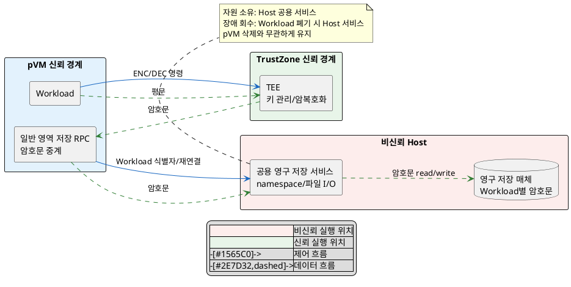
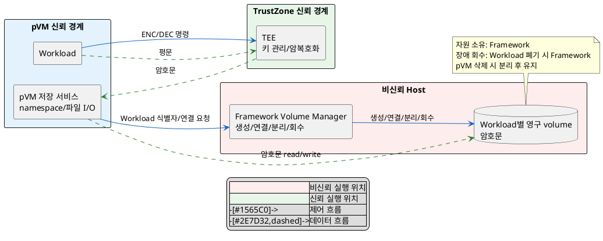

# DP-06. 암호화된 저장 파일 보관 주체

## 1. 상태

평가 중

## 2. 결정 목적

pVM 수명과 독립적으로 유지해야 하는 암호화 파일의 보관과 입출력 책임을 Host 공용 서비스에 둘지, Workload별 영구 volume과 pVM 안 저장 서비스에 나눌지 결정한다. 키·평문 보호와 저장 무결성은 공통 gate로 두고 재연결 지연, 온보딩 공수, 장애 범위와 자원 사용을 비교한다.

## 3. 문제 상황

- 현재 pVM 안 Workload는 GP Client API로 TEE에 파일 암호화를 요청한다. TEE가 반환한 암호문은 pVM 안 일반 영역 저장 서비스를 거쳐 pVM의 Linux 파일시스템에 기록된다.
- 저장 서비스와 파일시스템의 수명이 동적으로 생성·삭제되는 pVM 수명에 묶여 있다. pVM이 삭제되면 이전에 암호화한 파일을 새 pVM에서 다시 사용할 수 없다.
- SEC-05는 키가 TEE 밖으로 나오지 않고, pVM 저장 서비스·Framework·Host로 이어지는 저장 경로에는 평문이 노출되지 않을 것을 요구한다.
- RPMB를 사용하지 않는 저장소에서는 삭제·변조·되돌리기를 검출할 수 있어야 한다. 저장 무결성과 재생 방지 방법은 아직 `확인 필요`다.
- 공용 저장 서비스는 재연결 단계와 구성 자원을 줄이지만 장애가 여러 Workload로 번진다. Workload별 저장 구조는 장애 범위를 줄이지만 재연결 단계와 자원 사용을 늘린다. 가용성과 자원 효율의 상위 기준은 TBD다.
- pVM 재생성 시 저장 연결 단계는 PERF-07의 cold start 예산을 사용한다. 신규 Workload의 저장 구성은 EXT-03의 온보딩 리드타임 기준을 사용한다.
- EXT-01은 신규 Workload를 추가할 때 Framework 코어 수정 0 LoC를 요구한다.
- baseline으로 TEE가 키 관리와 암호화·복호화를 담당하고 RPMB를 사용하지 않으며, GP Client API를 통한 TEE 호출 경로를 유지한다. 키 관리 주체와 암호화 알고리즘은 바꾸지 않는다.
- project-custom 범위는 암호화 파일의 보관 수명, 파일 입출력 책임과 pVM 재생성 시 연결 책임이다. DP-01의 pVM 생성·삭제, DP-02의 Workload 식별자와 DP-05의 TEE 호출 경로에 맞춰야 한다.
- 따라서 암호문 namespace와 파일 입출력을 Host 공용 서비스에 둘지, pVM 저장 서비스가 Workload별 영구 volume에 직접 입출력하도록 나눌지 선택해야 한다.

## 4. 결정 질문

> pVM 수명과 독립적인 암호화 파일의 namespace와 입출력을 Host 공용 서비스가 담당할 것인가, pVM 안 저장 서비스가 Framework가 연결한 Workload별 영구 volume에 직접 수행할 것인가?

## 5. 후보 구조

### 5.1 후보 A: Host 공용 서비스가 암호문 namespace와 입출력 담당

- 실행 위치: pVM 안 일반 영역 저장 RPC와 모든 Workload가 공유하는 Host 공용 영구 저장 서비스다.
- 책임: pVM 안 RPC는 암호문을 중계한다. Host 공용 서비스는 Workload별 namespace, 파일 입출력과 영구 저장을 담당한다.
- 신뢰 경계: 키는 TEE 밖으로 나오지 않는다. 평문은 Workload와 TEE 구간에만 존재하고 저장 경로에는 암호문만 전달된다.
- 자원 소유/회수: Host 공용 서비스가 저장 공간 수명을 소유한다. pVM 삭제와 무관하게 유지하고 Workload 폐기 시 회수한다.

### 5.2 후보 B: pVM 저장 서비스와 Workload별 영구 volume에 책임 분담

- 실행 위치: pVM 안 저장 서비스, Host Framework의 volume manager와 Workload별 영구 volume이다.
- 책임: pVM 저장 서비스는 암호문 namespace와 파일 입출력을 담당한다. Framework는 volume 생성·연결·분리·회수만 제어한다.
- 신뢰 경계: 키는 TEE 밖으로 나오지 않는다. 평문은 Workload와 TEE 구간에만 존재하고 pVM 저장 서비스와 Host volume에는 암호문만 전달된다.
- 자원 소유/회수: Framework가 Workload별 volume 수명을 소유한다. pVM 삭제 시 volume을 분리해 유지하고 Workload 폐기 시 회수한다.

## 6. 후보별 구조 다이어그램

### 6.1 후보 A

### 6.2 후보 B

## 7. 후보별 동작 구조

### 7.1 후보 A

1. Workload가 GP Client API로 TEE에 저장할 평문과 명령을 전달한다.
2. TEE가 데이터를 암호화해 pVM 안 일반 영역 저장 RPC로 반환한다.
3. RPC가 Workload 식별자와 암호문을 Host 공용 저장 서비스에 전달한다.
4. Host 공용 서비스가 Workload별 namespace에서 암호문을 기록·조회한다.
5. pVM을 다시 만들면 같은 Workload 식별자로 공용 서비스에 재연결한다. 공용 서비스 장애 시 여러 Workload가 함께 영향을 받는다.

### 7.2 후보 B

1. pVM 저장 서비스가 Workload 식별자로 volume 연결을 요청하고, Framework가 새 volume을 생성하거나 기존 volume을 연결한다.
2. Workload가 GP Client API로 TEE에 저장할 평문과 명령을 전달한다.
3. TEE가 데이터를 암호화해 pVM 안 저장 서비스로 반환한다.
4. pVM 저장 서비스가 연결된 Workload 전용 volume에 암호문을 직접 기록·조회한다.
5. pVM 삭제 시 Framework는 volume을 분리해 유지한다. 같은 Workload의 새 pVM에는 volume을 다시 연결하고 저장 서비스를 재기동한다.

## 8. 품질속성 비교

### 8.1 필수 gate

| 품질속성 | 기준 | 후보 A | 후보 B | 근거 |
|---|---|---|---|---|
| 보안성(SEC-05) | 키의 TEE 외부 노출 0, 저장 경로의 평문 노출 0 | 통과 예상 | 통과 예상 | 두 후보 모두 TEE만 키를 다루고 저장 경로에는 암호문만 전달한다. |
| 저장 무결성·재생 방지 | 비-RPMB 저장소에서 삭제·변조·되돌리기 검출 | 확인 필요 | 확인 필요 | 두 후보 모두 검출 메커니즘이 아직 정의되지 않았다. |
| 확장성(EXT-01) | Framework 코어 수정 0 LoC | 통과 예상 | 확인 필요 | 후보 A는 공용 endpoint를 재사용한다. 후보 B는 volume 자동 생성·연결이 코어 수정 없이 가능한지 미검증이다. |

저장 무결성·재생 방지 gate가 두 후보 모두 `확인 필요`이므로 조건부 결정 이상으로 진행하지 않는다.

### 8.2 잠정 별점

`★★★`는 재연결 지연, 온보딩 공수, 장애 범위 또는 자원 사용이 가장 유리하고 `★☆☆`는 가장 불리하다는 뜻이다.

| 품질속성 | 후보 A | 후보 B | 평가 이유 |
|---|---:|---:|---|
| 성능(PERF-07) | ★★★ | ★☆☆ | 후보 A는 상시 공용 서비스에 재연결한다. 후보 B는 volume 연결과 pVM 저장 서비스 재기동이 필요하다. |
| 확장성(EXT-03) | ★★★ | ★☆☆ | 후보 A는 공용 endpoint를 재사용한다. 후보 B는 Workload별 volume 생성·연결 절차가 필요하다. |
| 가용성(TBD) | ★☆☆ | ★★★ | 후보 A의 공용 서비스 장애는 여러 Workload로 번진다. 후보 B는 장애 범위를 해당 Workload로 제한한다. |
| 자원 효율(TBD) | ★★★ | ★☆☆ | 후보 A는 저장 서비스를 공유한다. 후보 B는 Workload마다 volume과 pVM 저장 서비스 자원을 사용한다. |

저장 무결성·재생 방지 gate와 가용성·자원 효율 KPI가 확정되지 않았으므로 별점은 잠정 값이다.

## 9. 핵심 트레이드오프

> Host 공용 서비스가 namespace와 파일 I/O를 담당하면 pVM 재생성 시 재연결 단계와 EXT-03 온보딩 공수가 줄어든다. 대신 공용 서비스 장애가 여러 Workload로 번져 가용성이 낮아진다.

> pVM 저장 서비스가 Workload별 volume에 직접 입출력하면 저장 장애를 해당 Workload에 한정한다. 대신 volume 연결과 서비스 재기동이 PERF-07 시작 시간, EXT-03 온보딩 공수와 자원 효율에 불리하다.

## 10. 검증 기준

| 검증 항목 | 공통 측정 방법 | 합격 기준 |
|---|---|---|
| 키·평문 노출 | pVM 저장 서비스, Framework와 Host 저장 구간의 traffic 및 메모리 점검 | SEC-05: 키 외부 노출 0건, 저장 경로 평문 노출 0건 |
| 저장 무결성·재생 방지 | 비-RPMB 저장소에 삭제·변조·되돌리기 주입 | 검출 메커니즘과 기준 승인 전까지 TBD |
| Framework 코어 변경 | Workload별 volume 자동 생성·연결 PoC의 코어 diff 측정 | EXT-01: 코어 수정 0 LoC |
| pVM 재생성 지연 | 같은 Workload volume을 연결해 cold start p95 측정 | PERF-07: p95 2초 이하 |
| 신규 Workload 온보딩 | 저장 구성 추가에 필요한 공수 측정 | EXT-03: 5인일 이내 |
| 장애 영향 범위 | 공용 서비스 또는 Workload별 저장 서비스 장애 주입 후 영향 Workload 수 측정 | 상위 기준 승인 전까지 TBD |
| 저장 자원 사용 | Workload 증가에 따른 서비스 메모리와 volume 사용량 측정 | 상위 기준 승인 전까지 TBD |

## 11. 검토 결과

## 12. 최종 결정
