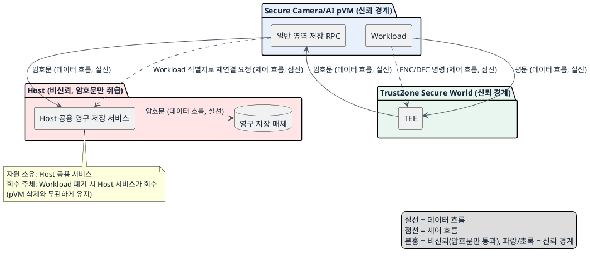
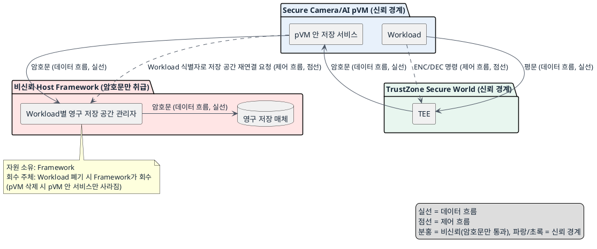

# DP-06. 암호화된 저장 파일 보관 주체

## 1. 상태

평가 중

## 2. 결정 목적

pVM 수명과 독립적으로 유지돼야 하는 암호화 파일의 보관과 입출력 책임을 Host 공용 서비스에 둘지, Workload별 저장 공간과 pVM 안 저장 서비스에 나눌지 정한다.

## 3. 문제 상황

- 현재 구조: pVM 안의 Workload가 GP Client API로 Secure Storage를 호출하면 TEE가 파일을 암호화한다. TEE의 파일 처리 RPC는 pVM 안의 일반 영역 저장 서비스로 돌아오고, 이 서비스는 암호화된 파일을 pVM의 Linux 파일시스템에 기록한다. 저장 서비스와 파일시스템의 수명은 동적으로 생성·삭제되는 pVM의 수명에 묶여 있다.
- 요구/품질속성: SEC-05(저장 데이터 기밀성 — 평문/키가 TEE 밖으로 나가지 않음, 공통 필수 gate), 저장 무결성과 재생 방지(RPMB 미사용 저장소에서 삭제·변조·되돌리기 검출, 확인 필요 공통 gate), PERF-07(파이프라인 시작 지연), EXT-01(신규 Workload 코어 무수정, 공통 필수 gate), EXT-03(온보딩 리드타임), 자원 효율(TBD). 신뢰 경계: Host는 비신뢰 주체이고, TEE만 키와 평문을 다룰 수 있다.
- 충돌/위험: pVM이 삭제되면 pVM 안의 저장 서비스와 파일시스템도 사라져 이전에 암호화한 파일을 다시 사용할 수 없다. 저장 기능을 여러 Workload가 함께 쓰는 공용 서비스로 두면 재연결 시간과 구성 자원은 줄지만 그 서비스의 장애 영향이 넓어진다. Workload마다 나누면 장애 영향은 줄지만 재연결 시간, 구성 작업과 자원 사용이 늘어난다.
- baseline 범위: TEE가 키 관리와 암호화·복호화를 전담하고 RPMB를 사용하지 않는다는 점, GP Client API를 통한 TEE 호출 경로는 baseline으로 고정한다. 이번 DP에서 키 관리 주체나 암호화 알고리즘을 바꾸지 않는다.
- project-custom 범위: pVM 수명과 독립적인 암호화 파일의 보관 수명과 입출력 책임을 어느 구성 요소에 둘지는 이번 DP의 project-custom 범위다.
- 선행/연관 DP: DP-01(pVM 실행 흐름의 격리 경계)에서 pVM을 생성·삭제할 때 이 DP가 정한 저장 공간을 연결하거나 분리해야 한다. DP-02(Workload 최종 검증 위치)에서 확인한 안정적인 Workload 식별자로 이전 저장 공간을 다시 찾는다. DP-05-A/DP-05는 TEE 명령의 실행 위치와 전달 경로를 정하고, 이 DP는 TEE가 암호화한 파일의 보관 주체를 정한다.
- 구조적 갈림길: 위 문제를 해결하려면 pVM 수명과 독립적인 암호화 파일의 보관과 입출력 책임을 Host의 공용 영구 저장 서비스에 둘지, Framework가 관리하는 Workload별 영구 저장 공간과 pVM 안의 저장 서비스에 나눌지 정해야 한다.

## 4. 결정 질문

pVM 수명과 독립적인 암호화 파일의 보관과 입출력 책임을 Host의 공용 영구 저장 서비스에 둘 것인가, Framework가 관리하는 Workload별 영구 저장 공간과 pVM 안의 저장 서비스에 나눌 것인가?

## 5. 후보 구조

### 후보 A: Host 공용 영구 저장 서비스가 보관과 입출력 담당

- 실행 위치: Host의 공용 영구 저장 서비스(모든 Workload가 공유).
- 책임: Host 공용 서비스가 Workload별 암호화 파일의 보관과 입출력을 모두 담당한다.
- 데이터 흐름: TEE → pVM 안 일반 영역 저장 RPC 반환 → Host 공용 저장 서비스 → 영구 저장 매체.
- 제어 흐름: pVM 생성 시 Framework가 Host 공용 서비스에 Workload 식별자로 기존 저장 공간을 재연결 요청한다.
- 신뢰/비신뢰 주체: Host는 비신뢰 주체이지만 암호문만 다루므로 평문·키는 노출되지 않는다. TEE만 키·평문을 다루는 신뢰 주체다.
- 자원 소유·회수 주체: Host 공용 저장 서비스가 저장 공간의 수명을 소유한다. pVM 삭제와 무관하게 유지되며, Workload 폐기 시에만 Host 서비스가 회수한다.

### 후보 B: Workload별 영구 저장 공간과 pVM 안 저장 서비스에 책임 분담

- 실행 위치: Framework가 관리하는 Workload별 영구 저장 공간(별도 유지), pVM 안의 저장 서비스(입출력 수행).
- 책임: Framework가 저장 공간의 수명을 관리하고, pVM 안의 저장 서비스가 파일 입출력을 수행한다.
- 데이터 흐름: TEE → pVM 안 저장 서비스 → Framework가 관리하는 해당 Workload 전용 저장 공간 → 영구 저장 매체.
- 제어 흐름: 같은 Workload의 새 pVM이 생성되면 Framework가 Workload 식별자로 저장 공간을 다시 연결한다.
- 신뢰/비신뢰 주체: Host와 그 안의 Framework 저장 관리자는 비신뢰 주체이며 암호문만 다룬다. TEE만 키와 평문을 다루는 신뢰 주체다.
- 자원 소유·회수 주체: Framework가 Workload별 저장 공간의 수명을 소유한다. pVM 삭제 시 pVM 안 저장 서비스는 사라지지만 저장 공간은 Framework가 유지하고, Workload 폐기 시에만 Framework가 회수한다.

## 6. 후보별 구조 다이어그램

### 후보 A 다이어그램

### 후보 B 다이어그램

## 7. 후보별 동작 구조

- 후보 A: Workload가 TEE에 저장할 데이터를 보내 암호화한다. TEE는 처리 결과를 pVM 안 일반 영역 RPC로 반환하고, 이 RPC는 암호문을 Host 공용 저장 서비스로 전달한다. Host 공용 서비스가 Workload 식별자별로 암호문을 영구 저장 매체에 기록·조회한다. 새 pVM이 생성되면 Framework가 같은 Workload 식별자로 Host 공용 서비스에 재연결을 요청하며, pVM 삭제와 무관하게 저장 공간은 유지된다.
- 후보 B: Workload가 TEE에 저장할 데이터를 보내 암호화한다. TEE의 처리 결과는 pVM 안 저장 서비스로 반환되고, 이 서비스가 Framework가 관리하는 해당 Workload 전용 저장 공간에 암호문을 기록·조회한다. pVM이 삭제되면 pVM 안 저장 서비스는 사라지지만 Framework가 저장 공간 자체를 유지한다. 같은 Workload의 새 pVM이 생성되면 Framework가 저장 공간을 다시 연결하고 새 pVM 안에 저장 서비스를 재기동한다.

## 8. 품질속성 비교

### 필수 gate

| 품질속성 | gate 기준 | 후보 A | 후보 B |
|---|---|---|---|
| 보안성(SEC-05) | 평문/키가 TEE 밖으로 나가지 않음 | 통과 가능 — Host는 암호문만 취급 | 통과 가능 — Framework와 pVM 저장 서비스도 암호문만 취급 |
| 저장 무결성·재생 방지 | 비-RPMB 저장소에서 삭제·변조·되돌리기 검출 | 확인 필요 — 실현 방법 미정 | 확인 필요 — 실현 방법 미정 |
| 확장성(EXT-01) | Framework 코어 수정 0 LoC | 통과 가능 — 신규 Workload는 기존 공용 서비스에 붙기만 하면 됨 | 확인 필요 — Workload별 저장 공간 생성 절차가 코어 수정 없이 자동화되는지 미검증 |

저장 무결성·재생 방지 gate가 두 후보 모두 `확인 필요` 상태이므로, 이 DP는 조건부 결정 이상으로 진행하지 않는다.

### 별점 비교 (gate 통과를 전제로 한 잠정 평가)

| 품질속성 | 기준 (KPI 출처: `docs/03_qa_quality_scenarios.md`) | 후보 A | 후보 B |
|---|---|---|---|
| 성능(PERF-07, cold start p95 2초 이하) | ★1: 매 pVM 생성마다 저장 연결 단계가 큼, ★2: 일부 단계 생략, ★3: 재연결 단계 최소 | ★2(잠정) — Host 서비스가 항상 떠 있어 연결 요청만 처리 | ★1(잠정) — Framework가 저장 공간 매핑과 pVM 안 서비스 재기동을 모두 수행 |
| 확장성(EXT-03, 신규 Workload 통합 5인일 이내) | ★1: 저장 구성 절차 추가 필요, ★2: 일부 자동화, ★3: 별도 구성 없이 수용 | ★3(잠정) — 신규 Workload도 공용 서비스에 자동 편입 | ★1(잠정) — Workload별 저장 공간 생성·연결 절차를 새로 구성해야 함 |
| 자원 효율 | TBD — 공식 KPI 없음 | 정성적으로 저장 서비스 자원을 공유 | 정성적으로 Workload마다 저장 공간·서비스 자원이 필요 |
| 가용성 | TBD — 공식 KPI 없음 | 정성적으로 공용 서비스 장애 시 여러 Workload가 영향받음 | 정성적으로 장애 영향이 해당 Workload로 제한됨 |

별점은 저장 무결성·재생 방지 gate가 `확인 필요` 상태이므로 잠정 값이며, 확정 근거로 사용하지 않는다.

## 9. 핵심 트레이드오프

Host 공용 저장 서비스는 pVM을 다시 만들 때 별도 저장 공간을 구성하지 않아도 되어 PERF-07 시작 시간과 EXT-03 온보딩 공수를 줄인다. 대신 공용 서비스에 장애가 생기면 여러 Workload가 저장 데이터를 사용하지 못할 위험이 가용성 측면에서 커진다. Workload별 저장 공간은 한 저장 공간이나 pVM 저장 서비스의 장애 영향을 해당 Workload로 제한한다. 대신 pVM을 다시 만들 때 저장 공간을 재연결하는 단계가 늘어 PERF-07과 EXT-03에서 불리하고, Workload마다 저장 공간·서비스 자원이 추가로 필요하다.

## 10. 검증 기준

- 저장 무결성·재생 방지 확인 필요 gate: 비-RPMB 환경에서 삭제·변조·되돌리기를 검출하는 구체적 메커니즘(예: 버전 카운터, HMAC 체이닝)을 먼저 정의하고 두 후보 모두에 적용 가능한지 확인한다.
- EXT-01 확인 필요(후보 B): Workload별 저장 공간 자동 생성이 Framework 코어 수정 없이 가능한지 PoC로 검증한다.
- PERF-07, EXT-03: `docs/03_qa_quality_scenarios.md`의 기존 KPI 기준으로 pVM 재생성 시나리오를 측정한다.
- 검증 순서: gate 확인 필요 항목이 닫히기 전에는 조건부 결정 이상으로 진행하지 않는다.

## 11. 검토 결과

## 12. 최종 결정
