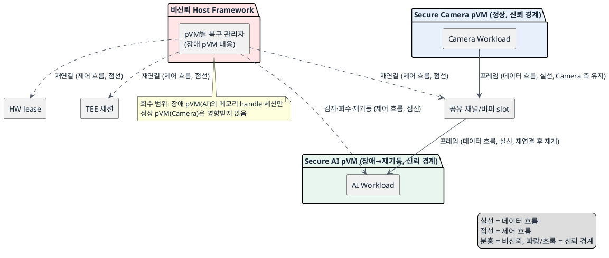
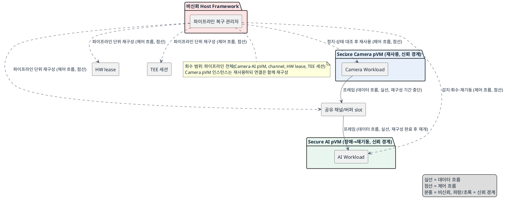

# DP-07. 장애 후 복구 책임 범위

## 1. 상태

평가 중

## 2. 결정 목적

한 pVM이 비정상 종료됐을 때 자원 회수와 재구성 책임을 장애 pVM 단위로 한정할지, 영향받은 파이프라인 전체 단위로 둘지 정한다.

## 3. 문제 상황

- 현재 구조: 한 파이프라인은 Camera pVM, AI pVM, pVM 간 채널, HW 권한, TEE 세션과 저장 연결로 구성된다. 한 pVM이 비정상 종료되면 Framework는 장애 pVM뿐 아니라 이 pVM과 연결된 자원의 상태도 확인해야 한다.
- 요구/품질속성: AVL-01(pVM 장애 격리 — 장애 전파로 인한 Host/타 pVM 다운타임 0, 공통 필수 gate), AVL-02(장애 복구 시간, MTTR), AVL-04(자원 누수 방지), AVL-05(이웃 성능 간섭). 신뢰 경계: 이 DP는 신뢰 경계를 바꾸지 않으며, Host는 비신뢰 주체로 유지된다.
- 충돌/위험: 장애 pVM 자원만 회수하면 재기동 범위는 작지만, DP-03 계열의 공유 버퍼, DP-04의 HW 권한, DP-05의 TEE 세션, DP-06의 저장 연결처럼 여러 관리 주체에 흩어진 상태를 개별적으로 대조해야 하며 회수 범위가 좁으면 자원이 남을 수 있다(AVL-04). 파이프라인의 연결과 할당을 함께 다시 만들면 상태를 일괄 대조해 stale 자원을 줄일 수 있지만, 정상 pVM의 서비스도 복구 단계 동안 영향을 받아 MTTR과 이웃 성능 간섭이 늘어날 수 있다(AVL-02, AVL-05).
- baseline 범위: 장애가 발생하지 않은 pVM과 Host가 계속 동작해야 한다는 AVL-01 요구, 그리고 pVM 단위 실행 격리 경계(DP-01)는 baseline으로 고정한다. 이번 DP에서 격리 경계 자체를 바꾸지 않는다.
- project-custom 범위: 장애 발생 이후 자원 회수와 재구성을 어느 범위의 관리 주체가 책임질지는 이번 DP의 project-custom 범위다.
- 선행/연관 DP: DP-01(pVM 실행 흐름의 격리 경계)이 정한 pVM 단위 격리 경계를 전제로 이 DP는 그 경계 안에서 발생한 장애의 복구 범위를 정한다. 이 DP는 DP-03 계열(공유 버퍼)의 buffer/lease, DP-04(HW 권한), DP-05(TEE 세션), DP-06(저장 연결)이 관리하는 자원을 장애 뒤 회수하는 데 사용한다.
- 구조적 갈림길: 위 문제를 해결하려면 장애 뒤 자원 회수와 재구성의 책임 범위를 장애 pVM 단위로 둘지, 영향받은 파이프라인 단위로 둘지 정해야 한다.

## 4. 결정 질문

장애 pVM의 자원만 회수하고 기존 파이프라인에 다시 연결할 것인가, 영향받은 파이프라인의 연결과 할당을 하나의 복구 단위로 재구성할 것인가?

## 5. 후보 구조

### 후보 A: 장애 pVM 단위 회수와 재연결

- 실행 위치: pVM별 복구 관리자(Framework 안, 장애 pVM에 대응하는 인스턴스).
- 책임: 장애 pVM의 메모리, handle과 세션만 회수한 뒤 기존 channel과 HW 할당에 다시 연결한다.
- 데이터 흐름: 복구 대상과 무관한 pVM의 frame 처리는 유지된다. 장애 pVM과 연결된 frame 경로는 재연결이 끝날 때까지 중단된다.
- 제어 흐름: pVM별 복구 관리자가 장애를 감지해 해당 pVM의 자원만 회수·재기동하고, 남아 있는 channel·HW lease·TEE 세션·저장 연결에 새 pVM 인스턴스를 다시 연결한다.
- 신뢰/비신뢰 주체: Host와 그 안의 pVM별 복구 관리자는 비신뢰 관리 주체다. 실제 메모리, channel, HW lease와 TEE session 회수는 각 보호 집행 주체가 최종 확인한다.
- 자원 소유·회수 주체: 장애 pVM이 보유했던 자원만 pVM별 복구 관리자가 회수한다. 정상 pVM의 자원은 건드리지 않는다.

### 후보 B: 영향받은 파이프라인 연결과 할당의 일괄 재구성

- 실행 위치: 파이프라인 복구 관리자(Framework 안, 파이프라인 단위 인스턴스).
- 책임: 장애 pVM을 회수하고, 해당 파이프라인의 channel, 공유 버퍼 slot, HW lease와 TEE 세션을 정지·대조한 뒤 함께 재구성한다.
- 데이터 흐름: 재구성 기간 동안 해당 파이프라인의 프레임 데이터 흐름은 일시 중단된다.
- 제어 흐름: 파이프라인 복구 관리자가 장애를 감지해 파이프라인에 속한 모든 연결·할당을 정지시키고 상태를 대조한 뒤, 정상 pVM 인스턴스를 재사용하면서 channel·HW lease·TEE 세션을 함께 다시 만든다.
- 신뢰/비신뢰 주체: Host와 그 안의 파이프라인 복구 관리자는 비신뢰 관리 주체다. 실제 자원 회수와 재할당은 각 보호 집행 주체가 최종 확인한다.
- 자원 소유·회수 주체: 해당 파이프라인에 속한 모든 자원(장애 pVM분과 정상 pVM이 공유하던 channel·HW lease 포함)을 파이프라인 복구 관리자가 일괄 회수·재할당한다.

## 6. 후보별 구조 다이어그램

### 후보 A 다이어그램

### 후보 B 다이어그램

## 7. 후보별 동작 구조

- 후보 A: pVM별 복구 관리자가 AI pVM의 비정상 종료를 감지하면 해당 pVM의 메모리, handle, 세션을 회수하고 새 pVM 인스턴스를 재기동한다. 이후 남아 있는 channel, HW lease, TEE 세션, 저장 연결 각각에 개별적으로 재연결을 요청한다. Camera pVM과 Host는 이 과정 동안 계속 동작한다.
- 후보 B: 파이프라인 복구 관리자가 AI pVM의 비정상 종료를 감지하면, 해당 파이프라인에 속한 channel, 공유 버퍼 slot, HW lease, TEE 세션을 모두 정지시키고 상태를 대조한다. 장애 pVM은 회수·재기동하고 정상 pVM 인스턴스는 재사용하면서, 파이프라인의 연결과 할당을 하나의 상태 전이로 다시 만든다. 재구성이 끝나면 프레임 처리가 재개된다.

## 8. 품질속성 비교

### 필수 gate

| 품질속성 | gate 기준 | 후보 A | 후보 B |
|---|---|---|---|
| 가용성(AVL-01) | 장애 전파로 인한 Host/타 pVM 다운타임 0 | 통과 가능 — 정상 pVM 프로세스를 종료하지 않음 | 통과 가능 — Host와 다른 파이프라인으로 전파하지 않음(같은 파이프라인 안 정상 pVM은 재구성 동안 일시 영향) |

### 별점 비교

| 품질속성 | 기준 (KPI 출처: `docs/03_qa_quality_scenarios.md`) | 후보 A | 후보 B |
|---|---|---|---|
| 가용성(AVL-02, 복구시간 p99 3초 이내: 검출0.5s/회수1s/재기동1.5s) | ★1: 재연결 단계가 여럿이라 합산 시간이 큼, ★2: 일부 단축, ★3: 회수 범위가 좁아 목표 근접 | ★3 — 회수·재기동 범위가 장애 pVM으로 한정 | ★1 — 파이프라인 전체 정지·대조·재구성 단계가 더해짐 |
| 가용성(AVL-04, 1,000회 crash-restart soak 누수율 0 수렴) | ★1: 회수 누락 위험 큼, ★2: 부분 대조, ★3: 상태 일괄 대조로 누락 최소화 | ★2 — 여러 관리 주체의 상태를 개별 대조해야 해 누락 위험이 남음 | ★3 — 한 상태 전이로 대조해 stale 자원을 줄임 |
| 가용성(AVL-05, 장애/재시작 중 정상 pVM fps 저하 5% 이내) | ★1: 정상 pVM도 재구성 대상, ★2: 일부 영향, ★3: 정상 pVM 처리 유지 | ★3 — 정상 pVM(Camera)의 channel·HW는 영향받지 않음 | ★1 — 정상 pVM도 연결·할당을 다시 받는 동안 처리가 중단됨 |

## 9. 핵심 트레이드오프

pVM 단위 복구는 회수 범위와 정상 pVM의 처리 간섭을 줄여 AVL-05와 AVL-02(회수·재기동 구간)에 유리하다. 대신 channel, HW lease, TEE 세션, 저장 연결처럼 여러 관리 주체에 남은 상태를 개별적으로 대조해야 해 AVL-04의 누수 위험이 상대적으로 크다. 파이프라인 단위 재구성은 연결된 자원을 한 상태 전이로 맞춰 AVL-04의 누수 위험을 줄인다. 대신 정상 pVM도 연결과 할당을 다시 받는 동안 처리가 중단돼 AVL-02 복구 시간과 AVL-05 이웃 성능 간섭이 늘어난다.

## 10. 검증 기준

- AVL-01: 두 후보 모두 장애 주입 시험에서 Host와 다른 파이프라인의 다운타임이 발생하지 않는지 확인한다.
- AVL-02/04/05: `docs/03_qa_quality_scenarios.md`의 기존 KPI(복구시간 p99 3초, 1,000회 crash-restart soak, fps 저하 5% 이내)로 두 후보를 같은 장애 주입 조건에서 측정한다.
- 검증 순서: AVL-01 gate를 먼저 확인한 뒤 AVL-02/04/05 KPI를 측정한다.

## 11. 검토 결과

## 12. 최종 결정
