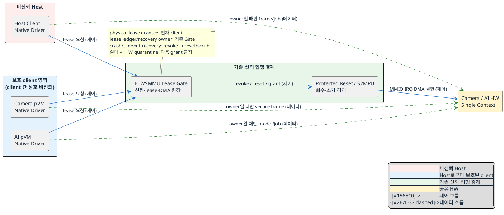
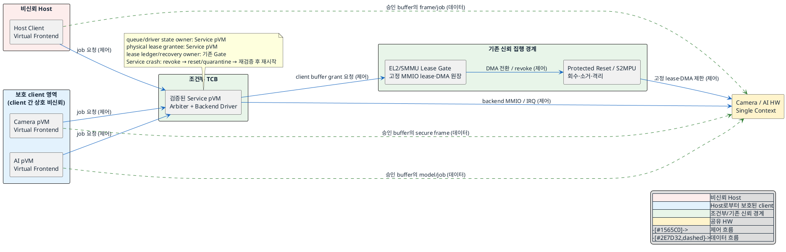

# DP-07. 물리 HW lease 보유 단위

## 1. 상태

평가 중

필수 gate의 실현 가능성이 확인되지 않았으므로 두 후보의 평가는 잠정 상태다.

## 2. 결정 목적

비신뢰 Host와 보호 pVM이 단일 Context Camera/AI HW를 공유할 때, 물리 HW lease를 각 client에 교대 부여할지,
검증된 서비스 pVM 하나에 고정 부여할지 정한다.

## 3. 문제 상황

- 현재 구조: Host 일반 기능과 Secure Camera/AI pVM이 하나의 Camera/AI HW를 시분할해야 한다. HW 사용권은 MMIO,
  IRQ, DMA 주소 공간, 내부 SRAM·레지스터·descriptor 상태를 함께 포함한다.
- 보안성: 이전 owner의 MMIO/DMA 권한을 완전히 회수하기 전에 다음 owner에게 권한을 주면 권한이 겹친다.
  `SEC-02`는 권한 중첩 0, `SEC-03`은 비할당 도메인 DMA 접근 0을 요구한다. 내부 상태 소거가 빠지면 보호
  frame, 모델 weight와 중간값이 다음 Host 작업에 노출된다.
- 가용성: client crash, DMA timeout, interrupt 유실 또는 초기화 실패 때 다음 owner에게 서둘러 권한을 주면 복구
  경로가 정보 노출 경로가 된다. 실패 시에는 권한이 닫힌 격리 상태로 돌아가야 한다. `AVL-01`은 다른 pVM과
  Host로의 장애 전파 0을, `AVL-02`는 복구 시간 p99 3초 이하를 요구한다.
- 성능: 안전한 전환에는 요청 차단, DMA 정지, drain, 권한 회수, 잔류 상태 소거와 새 권한 부여가 필요하다.
  `PERF-04`는 HW 전환 지연 p99 10ms 이하를, `PERF-01`은 비격리 baseline 대비 성능 저하 10% 이내,
  30fps 유지와 frame drop 0.1% 이하를 요구한다.
- 확장성과 자원 효율: client마다 전체 HW driver와 전환 코드를 가지면 새 HW IP 지원 범위가 커진다. 전용 중재
  실행 환경을 두면 frontend 계약은 안정시킬 수 있지만 별도 CPU·memory와 공용 장애 지점을 추가한다.
  신규 Workload는 `EXT-01`의 Framework core 변경 0 LoC를 만족해야 한다. HW별 변경 용이성과 전용 실행
  환경의 자원 예산은 상위 기준이 없어 `TBD`다.
- 신뢰 경계: Host kernel, Host driver와 Framework는 비신뢰다. 일반 pVM과 Workload는 Host로부터 보호되지만
  서로를 신뢰하지 않는다. 기존 pKVM/EL2와 SMMU/S2MPU만 접근권 집행의 신뢰 기준선이다. 서비스 pVM은 boot
  image 검증을 신뢰 anchor에 연결하고 신뢰 모델에 TCB 편입을 기록한 뒤에만 신뢰할 수 있다.
- baseline 범위: Linux native 환경, 단일 Context HW, 기존 pKVM/EL2와 SMMU/S2MPU의 보호 기능은 고정한다.
  `CS-02`에 따라 EL2 코드를 추가하거나 변경하지 않는다. 두 후보 모두 기존 기능만으로 요청자 인증, 배타적
  MMIO/IRQ lease, DMA mapping 전환, timeout 회수와 reset/quarantine을 수행할 수 있어야 한다.
- project-custom 범위: client driver·중재자의 배치, 가상 frontend/backend, HW별 quiesce·drain·scrub profile,
  전환 상태 원장과 복구 orchestration은 이번 결정의 구현 범위다. buffer 소유권과 zero-copy 방식은 `DP-03`의
  결정에 따른다.
- 연관 DP: 이 DP는 EL2 lease를 받는 주체가 개별 client인지 단일 서비스 pVM인지 결정한다. 승인된 요청의 사용
  순서를 누가 정하는지는 `DP-04`의 하위 결정이다. 후보 A를 택하면 현재 `DP-04`를 적용하고, 후보 B를 택하면
  서비스 pVM 내부 순서 정책으로 `DP-04`를 개정해야 한다.
- 구조적 갈림길: 물리 HW의 owner를 Host와 각 pVM으로 계속 바꾸면 client별 native data path를 유지할 수 있지만
  매 전환마다 물리 권한과 driver 상태를 완전히 닫아야 한다. 물리 owner를 하나로 고정하면 client가 HW를 직접
  만지는 경로를 없앨 수 있지만 새 신뢰 구성 요소와 frontend/backend 호출 경로가 생긴다.

## 4. 결정 질문

> EL2가 물리 HW lease를 Host와 각 pVM client에 교대 부여할 것인가, 검증된 서비스 pVM 하나에 고정 부여하고
> 모든 client를 가상 HW frontend로 만들 것인가?

## 5. 후보 구조

### 후보 A: client별 물리 HW lease 교대 부여

| 구분 | 구조 |
|---|---|
| 실행 위치 | Host와 각 pVM에 HW native driver를 둔다. 기존 EL2/SMMU lease gate가 물리 권한을 교대 적용한다. |
| client 책임 | 현재 lease를 받은 client가 job 제출, interrupt 처리와 자신의 driver state 관리를 담당한다. client의 전환 협조는 보안 근거로 사용하지 않는다. |
| 신뢰 집행 책임 | 기존 lease gate와 보호 reset/zeroize 장치가 요청자 신원, 배타적 MMIO/IRQ, DMA mapping과 reset 완료를 검증한다. |
| 제어 흐름 | client가 gate에 직접 lease를 요청한다. gate가 `차단 → DMA 정지 → drain → 회수 → 소거 → 부여`를 완료한 뒤 새 owner를 연다. |
| 데이터 흐름 | 현재 owner의 buffer와 HW 사이에만 DMA가 흐른다. 다른 client와 Host의 mapping은 닫힌다. |
| 신뢰 경계 | Host와 모든 client driver의 전환 협조를 신뢰하지 않는다. 보안은 기존 EL2/SMMU와 Host가 우회할 수 없는 reset/zeroize 결과에만 의존한다. |
| 소유·회수 | 현재 client가 물리 lease를 보유하고, gate가 authoritative lease 원장과 전환 상태를 소유한다. client crash/timeout 때 먼저 모든 접근을 회수하고, reset/scrub 성공 전에는 다음 owner를 부여하지 않는다. |

이 후보는 Host가 소거를 정직하게 수행한다고 가정하지 않는다. 기존 보호 기능 또는 HW의 검증 가능한
zeroize-on-reset이 client 도움 없이 전체 잔류 상태를 지울 수 없으면 후보 A는 탈락한다.

### 후보 B: 서비스 pVM의 물리 HW lease 고정 보유

| 구분 | 구조 |
|---|---|
| 실행 위치 | 검증된 서비스 pVM에 physical backend driver와 arbiter를 둔다. Host와 각 pVM에는 가상 HW frontend만 둔다. |
| client 책임 | client는 인증된 job descriptor와 buffer handle을 제출하고 완료를 받는다. 물리 MMIO/IRQ를 직접 다루지 않는다. |
| 신뢰 집행 책임 | 서비스 pVM이 queue, device state, quiesce·drain·scrub를 관리한다. 기존 EL2/SMMU gate는 서비스 pVM의 MMIO/IRQ lease와 job별 DMA mapping을 최종 집행한다. |
| 제어 흐름 | frontend가 서비스 pVM에 요청하고, 서비스 pVM이 한 client의 job만 선택해 gate에 검증된 DMA grant를 요청한 뒤 HW를 구동한다. |
| 데이터 흐름 | HW는 현재 job의 승인된 client buffer에만 DMA한다. frontend/backend metadata 경로와 frame data 경로를 분리한다. 실제 buffer 수명은 `DP-03`을 따른다. |
| 신뢰 경계 | Host와 일반 pVM은 비신뢰 client다. 서비스 pVM은 검증된 image와 승인된 측정값으로 부팅되고 TCB 편입이 기록된 경우에만 신뢰 중재자다. |
| 소유·회수 | 서비스 pVM이 고정 물리 lease, driver state와 가상 queue를 보유한다. 기존 gate는 authoritative lease 원장과 회수 권한을 소유하고 서비스 pVM crash/timeout 때 MMIO/DMA를 회수한 뒤 HW를 reset 또는 quarantine한다. |

이 후보에서 `검증된 서비스 pVM`은 결론이 아니라 선행 조건이다. image 검증, protected client channel과 기존
device teardown 기능 중 하나라도 충족하지 못하면 후보 B는 탈락한다.

## 6. 후보별 구조 다이어그램

### 후보 A 다이어그램

### 후보 B 다이어그램

## 7. 후보별 동작 구조

### 후보 A

1. 각 client가 자신의 신원으로 기존 lease gate에 직접 요청한다.
2. gate가 새 요청을 막고 현재 owner에게 quiesce를 통지한다. owner가 응답하지 않아도 timeout 뒤 보호 장치가
   DMA와 bus master를 중지할 수 있어야 한다.
3. 보호 장치가 진행 중인 transaction을 drain하고 이전 owner의 MMIO/IRQ와 모든 DMA mapping을 회수한다.
4. Host가 우회할 수 없는 reset/zeroize primitive로 register, SRAM, cache와 descriptor 상태를 소거하고 완료를
   검증한다.
5. 모든 단계가 성공한 경우에만 gate가 새 owner의 MMIO/IRQ와 DMA mapping을 원자적으로 연다.
6. 어느 단계든 실패하면 HW를 mapping이 없는 `QUARANTINED` 상태에 두고 복구 뒤 1번부터 다시 시작한다.

### 후보 B

1. boot 시 서비스 pVM image와 측정값을 검증하고 TCB 편입 조건을 확인한다. 기존 gate는 물리 MMIO/IRQ lease를
   서비스 pVM에만 부여한다.
2. Host와 pVM frontend가 client 신원, job descriptor와 buffer handle을 서비스 pVM에 제출한다.
3. 서비스 pVM이 한 요청을 선택하고, 기존 gate가 buffer owner와 범위를 검증해 현재 job의 DMA mapping만 연다.
4. 서비스 pVM이 HW를 구동한다. 완료 또는 timeout 뒤 새 요청을 막고 DMA stop과 drain을 수행한다.
5. 기존 gate가 이전 DMA mapping을 회수하고, 서비스 pVM이 HW별 scrub을 수행한다. 보호 장치가 scrub/reset 완료를
   확인한 뒤에만 다음 job의 mapping을 연다.
6. 서비스 pVM이 crash하거나 응답하지 않으면 기존 gate가 물리 lease와 DMA mapping을 회수하고 HW를 reset 또는
   `QUARANTINED` 상태로 둔다. 새 서비스 pVM은 재검증과 전체 reset 뒤에만 lease를 받는다.

## 8. 품질속성 비교

### 8.1 필수 gate

`확인 필요`는 통과가 아니다. 하나라도 실패하면 해당 후보는 선택할 수 없다.

| ID | 필수 기준 | 후보 A | 후보 B |
|---|---|---|---|
| G-0: baseline 준수 | EL2 수정 0 LoC. 기존 EL2/SMMU/HW interface만 사용 | 확인 필요 — 직접 requester 인증, 강제 timeout과 보호 reset이 기존 interface에 있어야 함 | 확인 필요 — 서비스 pVM device 할당·teardown과 job별 DMA grant가 기존 interface에 있어야 함 |
| G-1: 단일 owner (`SEC-02`) | 물리 또는 가상 HW 권한 중첩 0 | 확인 필요 — MMIO/IRQ/DMA의 단일 atomic lease 입증 필요 | 확인 필요 — 서비스 pVM만 물리 MMIO를 갖고 client DMA grant가 겹치지 않음을 입증해야 함 |
| G-2: DMA 격리 (`SEC-03`) | 비할당 도메인 DMA 접근 0 | 확인 필요 — Host turn에도 pVM page가 열리지 않음을 시험해야 함 | 확인 필요 — backend가 승인 범위 밖 client page를 map하지 못함을 시험해야 함 |
| G-3: 잔류 상태 | 전환 뒤 보호 data 검출 0, scan coverage 100% | 확인 필요 — client와 무관한 전체 zeroize-on-reset 근거가 없으면 탈락 | 확인 필요 — 서비스 pVM scrub 범위와 crash 중 보호 reset을 함께 입증해야 함 |
| G-4: fail-closed | crash, DMA timeout, 초기화 실패와 요청 폭주에서 fail-closed 100% | 확인 필요 — client 무응답 뒤 기존 gate가 자율 회수·quarantine해야 함 | 확인 필요 — 서비스 pVM 자체 crash 뒤 기존 gate가 자율 회수·quarantine해야 함 |
| G-5: Host 정책 우회 | 비인가 MMIO/DMA 차단 100%, 회수 실패를 성공으로 처리한 grant 0 | 확인 필요 — Host 제안과 driver 결과를 gate가 독립 검증해야 함 | 확인 필요 — Host의 물리 접근 0과 protected frontend/backend 요청 인증을 입증해야 함 |
| G-6: 서비스 pVM TCB 편입 | image 검증의 신뢰 anchor 연결과 신뢰 모델 개정 | 해당 없음 | 확인 필요 — 둘 중 하나라도 없으면 후보 B 탈락 |

두 후보 모두 필수 gate가 `확인 필요`이므로 조건부 결정도 아직 내리지 않는다.

### 8.2 잠정 별점

별점은 모든 gate 통과를 전제로 한 구조적 예상이다. `★☆☆`는 상대적으로 불리, `★★☆`는 중간,
`★★★`는 상대적으로 유리다. 측정 전에는 선택 근거로 확정하지 않는다.

| 품질속성 | 공통 평가 기준 | 후보 A | 후보 B | 구조적 이유 |
|---|---|---:|---:|---|
| 성능 (`PERF-04`) | HW 전환 지연 p99 10ms 이하 | ★☆☆ | ★★☆ | A는 물리 MMIO/IRQ·DMA lease와 두 native driver state를 매번 바꾼다. B는 물리 lease를 유지하지만 frontend RPC, job별 DMA 전환과 scrub은 남는다. |
| 성능 (`PERF-01`) | baseline 대비 저하 10% 이내, 30fps, drop 0.1% 이하 | ★★☆ | ★★☆ | A는 owner 구간의 native data path가 짧고, B는 고정 backend로 전환을 줄인다. 어느 효과가 큰지는 측정 전 알 수 없다. |
| 가용성 (`AVL-01`, `AVL-02`) | 장애 전파 downtime 0, 복구 p99 3초 이하 | ★★☆ | ★☆☆ | A는 실패 client의 lease만 회수할 수 있다. B는 서비스 pVM이 모든 client의 공용 장애 지점이고 재검증·재시작이 필요하다. |
| 확장성 (`EXT-01`) | 신규 Workload의 Framework core 변경 0 LoC | ★☆☆ | ★★★ | A는 각 pVM image에 HW별 native driver와 전환 profile이 필요하다. B는 frontend 계약을 유지하고 backend에 HW 차이를 모은다. |
| 보안성 (`SEC-02`, `SEC-03`) | G-1~G-5 통과 | — | — | 보안성은 필수 gate다. 미통과 상태에서 상대 별점을 부여하지 않는다. A는 시간가변 trust mapping, B는 추가 TCB라는 서로 다른 잔여 위험이 있다. |
| 자원 효율 | 상위 KPI `TBD` | — | — | A는 driver가 중복되고, B는 전용 pVM CPU·memory를 사용한다. 승인된 기준이 없어 별점을 부여하지 않는다. |

## 9. 핵심 트레이드오프

> client별 교대 lease는 현재 driver와 native data path를 재사용하고 서비스 pVM을 TCB에 추가하지 않는다. 대신
> 신뢰·비신뢰 client 사이에서 물리 권한과 HW 내부 상태를 매번 완전히 전환해야 하므로 `PERF-04` 비용과
> zeroize-on-reset 의존성이 커진다.

> 서비스 pVM 고정 lease는 Host의 물리 MMIO 접근을 없애고 HW별 driver와 scrub 책임을 한 보호 영역에 모은다.
> 대신 검증된 서비스 pVM과 채널이 TCB에 추가되고, frontend RPC 비용과 공용 service crash의 `AVL-01/02`
> 영향이 생긴다.

두 후보 중 하나가 보편적으로 우월하지 않다. A는 작은 TCB와 client-local 장애 격리를 얻는 대신 강한 물리 전환
primitive가 필요하고, B는 물리 접근 경계를 단순화하는 대신 TCB·자원·공용 장애 범위를 늘린다.

## 10. 검증 기준

| 검증 항목 | 공통 검증 방법 | 합격 기준 |
|---|---|---|
| EL2 무수정 | 사용 interface 목록과 EL2 source diff를 HV 담당과 공동 검토 | EL2 추가·변경 0 LoC. 추가 hypercall/handler가 필요하면 해당 후보 탈락 |
| 권한 원자성 | 전환 단계마다 MMIO/IRQ/SMMU/S2MPU snapshot을 기록하고 10^6회 반복 | 권한 중첩 0, 무위반 누적 전환 10^6회 |
| DMA 공격 | Host와 비할당 pVM에서 이전 IOVA, stale descriptor, 잘못된 owner handle로 read/write 주입 | 비할당 도메인 접근 0, 공격 vector catalogue 구현률 100% |
| 잔류 data | SRAM, register, cache, firmware context와 descriptor에 sentinel을 넣고 전환 후 scan. 읽을 수 없는 영역은 vendor zeroize 증거와 fault injection으로 확인 | 잔류 data 검출 0, scan coverage 100% |
| fail-closed | client/service pVM crash, DMA hang, interrupt loss, scrub 실패와 요청 폭주를 각 전환 단계에 주입 | 열린 MMIO/DMA grant 0, fail-closed 100%, 다른 영역 downtime 0 |
| 복구 시간 | fault 검출부터 revoke, reset/quarantine과 다음 안전 상태까지 구간별 timestamp 측정 | `AVL-02` p99 3초 이하 |
| 전환 성능 | 동일 HW·driver·frame 조건에서 이전 요청 차단부터 다음 처리 가능 시점까지 측정 | `PERF-04` p99 10ms 이하 |
| pipeline 성능 | 비격리 baseline과 30fps Host/pVM 경합 workload를 같은 조건으로 비교 | `PERF-01` 저하 10% 이내, 30fps, drop 0.1% 이하 |
| 확장성 | 새 Workload 한 종을 기존 frontend/driver 계약으로 통합하고 core diff 검사 | `EXT-01` Framework core 변경 0 LoC |
| 자원 효율 | client driver image 증가량과 서비스 pVM CPU·memory 상주량 측정 | 상위 예산 승인 전까지 `TBD`; 별점과 결정에 사용하지 않음 |

검증 순서는 G-0, 후보별 feasibility, G-1~G-6, 성능·가용성 KPI 순이다. gate가 닫히기 전에는 잠정 별점을
근거로 후보를 선택하지 않는다.

## 11. 검토 결과

- Herdr의 Claude와 2회 검토했다.
- 1차 검토에서 후보 범위가 `DP-04`와 겹치고, 물리 HW를 누가 실제 소유하는지가 흐리다는 지적을 받았다.
- 결정 변수를 `중재 책임 위치`에서 `물리 HW lease 보유 단위`로 좁혔다. Claude의 2차 검토에서 두 후보가 한
  질문의 비교 가능한 답이라는 점을 확인했다.
- 후보 A의 Host 비의존 소거, 후보 B의 TCB 편입과 service crash 회수를 필수 feasibility gate로 올렸다.
- 두 후보 모두 gate가 열려 있으므로 승자와 조건부 결정을 기록하지 않는다.

## 12. 최종 결정
