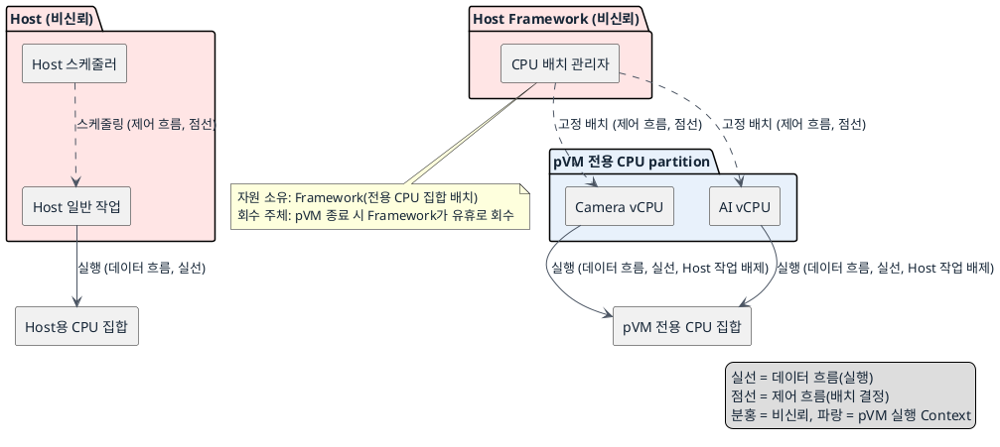
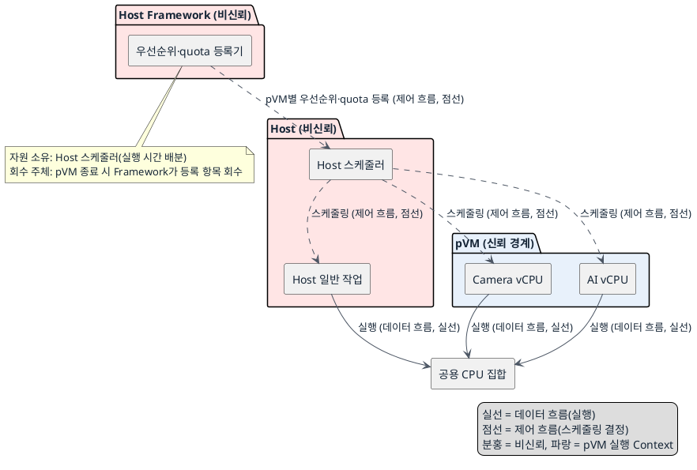

# DP-08. pVM CPU 실행 자원의 공유 경계

## 1. 상태

평가 중

## 2. 결정 목적

pVM vCPU 실행 자원을 Host 일반 작업과 물리적으로 분리할지, Host 스케줄러 안에서 우선순위·quota로 공유할지 정한다.

## 3. 문제 상황

- 현재 구조: pVM vCPU는 Host 스케줄러가 실행하며, Secure Camera와 Secure AI 처리도 Host의 일반 작업과 같은 물리 CPU를 사용할 수 있다.
- 요구/품질속성: PERF-01(실시간 처리, 격리 오버헤드), PERF-06(다중 스트림 처리량), AVL-05(이웃 성능 간섭), 자원 효율(TBD). 신뢰 경계: 이 DP는 신뢰 경계를 바꾸지 않는다. Host는 비신뢰 주체로 유지되고 pVM 메모리·장치 접근권은 기존 S2MPU/Stage-2 경계를 그대로 따른다.
- 충돌/위험: Host 부하와 다른 pVM의 실행이 같은 CPU에서 경합하면 30fps 처리와 다중 스트림 처리량이 흔들릴 수 있다(PERF-01, PERF-06). 한 pVM의 장애 처리·재시작이 CPU를 집중적으로 사용하면 정상 pVM의 처리 성능이 낮아질 수 있다(AVL-05). 전용 코어로 고정하면 경합은 줄지만 pVM이 유휴 상태여도 Host가 그 코어를 활용하기 어렵다. CPU를 공유하면 활용률은 높아지지만 우선순위와 quota 설정에 성능이 의존한다(자원 효율 TBD).
- baseline 범위: pVM 메모리·장치에 대한 S2MPU/Stage-2 보안 경계는 baseline으로 고정한다. 이번 DP에서 그 보안 경계를 바꾸지 않는다.
- project-custom 범위: pVM vCPU가 사용하는 물리 CPU 자원을 Host 작업과 실행 시간 축에서 분리할지 공유할지는 이번 DP의 project-custom 범위다.
- 선행/연관 DP: DP-01(pVM 실행 흐름의 격리 경계)이 정한 pVM 실행 경계에 이 DP가 CPU 실행 자원을 배치한다. CPU 예약량과 생성 시점은 DP-01의 하위 결정으로 남고, 이 DP는 런타임 공유 경계만 정한다. DP-07(장애 후 복구 책임 범위)의 재기동 작업이 사용하는 CPU 자원도 이 DP가 정한 경계를 따른다.
- 구조적 갈림길: 위 문제를 해결하려면 pVM CPU 실행 자원을 전용 partition으로 Host 작업과 분리할지, Host 스케줄러에서 우선순위·quota로 공유할지 정해야 한다.

## 4. 결정 질문

pVM vCPU를 전용 CPU partition에 고정할 것인가, 우선순위와 quota를 적용해 Host 스케줄러에서 일반 작업과 공유할 것인가?

## 5. 후보 구조

### 후보 A: pVM 전용 CPU partition과 vCPU 고정

- 실행 위치: Framework가 정한 pVM 전용 CPU 집합(cpuset/cgroup 파티션).
- 책임: Framework가 pVM용 CPU 집합을 정하고 각 vCPU를 해당 집합에 고정하며 Host 일반 작업을 제외한다.
- 데이터 흐름: 없음(자원 배치 결정). 프레임 데이터 흐름은 DP-03/DP-04가 정한 경로를 그대로 따른다.
- 제어 흐름: pVM 생성 시 Framework가 vCPU를 전용 CPU 집합에 고정 배치하고, Host 스케줄러는 해당 집합에 일반 작업을 스케줄링하지 않는다.
- 신뢰/비신뢰 주체: Host scheduler와 그 안의 Framework CPU 배치 관리자는 비신뢰 관리 주체다. 이 결정은 pVM/EL2의 보안 경계를 바꾸지 않는다.
- 자원 소유·회수 주체: Framework가 전용 CPU 집합의 배치를 소유한다. pVM 종료 시 Framework가 해당 집합을 유휴로 회수한다.

### 후보 B: Host 스케줄러 공유와 pVM 우선순위·quota 적용

- 실행 위치: Host 스케줄러가 관리하는 공용 CPU 집합.
- 책임: Host 스케줄러가 pVM vCPU와 일반 작업을 같은 CPU 집합에서 실행하고, Framework가 pVM별 우선순위와 quota를 구성한다.
- 데이터 흐름: 없음(자원 배치 결정). 프레임 데이터 흐름은 DP-03/DP-04가 정한 경로를 그대로 따른다.
- 제어 흐름: pVM 생성 시 Framework가 Host 스케줄러에 우선순위·quota 값을 등록하고, Host 스케줄러가 매 스케줄링 주기마다 pVM vCPU와 일반 작업의 실행 순서를 정한다.
- 신뢰/비신뢰 주체: Host scheduler와 Framework quota 등록기는 비신뢰 관리 주체다. 이 결정은 pVM/EL2의 보안 경계를 바꾸지 않는다.
- 자원 소유·회수 주체: Host 스케줄러가 실행 시간 배분을 소유한다. pVM 종료 시 Framework가 등록한 우선순위·quota 항목을 회수한다.

## 6. 후보별 구조 다이어그램

### 후보 A 다이어그램

### 후보 B 다이어그램

## 7. 후보별 동작 구조

- 후보 A: pVM 생성 시 Framework의 CPU 배치 관리자가 전용 CPU 집합을 정하고 각 vCPU를 그 집합에 고정한다. Host 스케줄러는 이 집합에 일반 작업을 배치하지 않는다. pVM 종료 시 Framework가 전용 집합을 유휴 상태로 회수해 다른 pVM이나 필요 시 Host가 다시 사용할 수 있게 한다.
- 후보 B: pVM 생성 시 Framework가 Host 스케줄러에 pVM vCPU의 우선순위와 quota를 등록한다. Host 스케줄러는 공용 CPU 집합에서 매 주기마다 Host 일반 작업과 pVM vCPU의 실행 순서를 우선순위·quota에 따라 정한다. pVM 종료 시 Framework가 등록된 우선순위·quota 항목을 제거한다.

## 8. 품질속성 비교

이 DP의 문제 상황에는 필수 gate 수준(pass/fail 0건 기준)의 요구가 없다. PERF-01/PERF-06/AVL-05는 모두 `docs/03_qa_quality_scenarios.md`에서 KPI로만 정의돼 있어 별점으로 비교한다.

### 별점 비교

| 품질속성 | 기준 (KPI 출처: `docs/03_qa_quality_scenarios.md`) | 후보 A | 후보 B |
|---|---|---|---|
| 성능(PERF-01, 비격리 대비 저하 10% 이내·30fps 유지·드롭율 0.1% 이하) | ★1: Host 부하에 따라 변동 큼, ★2: 일부 완화, ★3: Host 부하와 무관하게 실행 시간 보장 | ★3 — Host 작업이 전용 집합에 들어오지 못해 실행 시간이 Host 부하와 무관 | ★1 — Host 부하가 크면 pVM vCPU 실행 시간이 줄어들 수 있음 |
| 성능(PERF-06, 1080p30 동시 2스트림 이상(4목표)·190MB/s 이상) | ★1: 동시 스트림 늘 때 경합 심함, ★2: 일부 여유, ★3: 스트림 증가에도 처리량 유지 | ★3 — 전용 집합이 스트림 수와 무관하게 확보됨 | ★2 — quota로 어느 정도 보장 가능하나 Host 부하에 따라 편차 발생 |
| 가용성(AVL-05, 장애/재시작 중 정상 pVM fps 저하 5% 이내) | ★1: 장애 복구 작업이 CPU를 잠식, ★2: 일부 완화, ★3: 장애 복구와 정상 pVM 실행이 분리 | ★3 — DP-07의 복구 작업이 Host 집합에서 실행돼 pVM 전용 집합을 침범하지 않음 | ★1 — 복구 작업과 정상 pVM vCPU가 같은 공용 집합을 두고 경합 |
| 자원 효율 | TBD — 공식 KPI 없음 | 정성적으로 pVM 유휴 시 전용 코어가 남음 | 정성적으로 유휴 CPU를 Host와 공유해 활용률이 높음 |

## 9. 핵심 트레이드오프

전용 CPU partition은 Host 부하와 장애 복구 작업이 pVM 실행 시간을 빼앗는 경로를 없애 PERF-01, PERF-06, AVL-05에서 유리하다. 대신 pVM이 유휴 상태여도 Host가 해당 코어를 쓰기 어려워 자원 효율이 떨어지고, 동시 pVM 수가 늘면 partition 재배치가 필요하다. Host 스케줄러 공유는 유휴 CPU를 Host와 함께 써 자원 효율을 높인다. 대신 Host 부하와 다른 pVM의 실행이 지연 변동과 처리량 저하를 만들 수 있어 PERF-01, PERF-06, AVL-05에서 불리하다.

## 10. 검증 기준

- PERF-01/PERF-06: `docs/03_qa_quality_scenarios.md`의 기존 KPI(비격리 대비 저하 10% 이내·30fps·드롭율 0.1% 이하, 동시 2~4스트림·190MB/s)로 Host 부하 idle/통상/스트레스 조건에서 측정한다.
- AVL-05: DP-07의 복구 절차를 실행하는 동안 정상 pVM의 fps 저하를 측정한다.
- 자원 효율(TBD): 공식 KPI가 승인되기 전까지는 정성적 비교만 사용하고 확정 근거로 쓰지 않는다.

## 11. 검토 결과

## 12. 최종 결정
