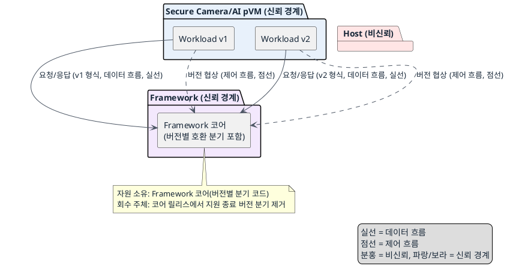
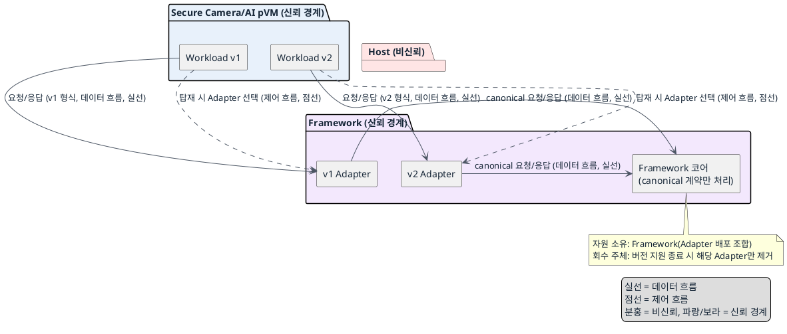

# DP-09. 공개 Workload API의 호환 책임 위치

## 1. 상태

평가 중

## 2. 결정 목적

공개 Workload API의 버전 호환 책임을 Framework 코어에 둘지, 경계 Adapter에 둘지 정한다. 이 계약은 DP-02(Workload 검증), DP-03 계열(채널 요청), DP-04(HW 요청) 인터페이스보다 먼저 안정화해야 한다.

## 3. 문제 상황

- 현재 구조: Framework는 pVM 생명주기, Workload 탑재, 채널과 HW 요청을 위한 공개 Workload API와 패키지 계약을 제공해야 한다. Framework와 기존 Workload의 릴리스 시점은 서로 다를 수 있다.
- 요구/품질속성: EXT-07(API 계약 안정성 — Workload API breaking change 건수/릴리스 0 유지), PERF-07(파이프라인 시작 지연), 변경 용이성(TBD). 신뢰 경계: 이 DP는 신뢰 경계를 바꾸지 않는다. 보호 영역이 Workload 신원과 요청 권한을 최종 확인하는 절차(DP-02)는 그대로 유지된다.
- 충돌/위험: Framework가 바뀌어도 기존 Workload가 수정이나 재컴파일 없이 동작해야 한다(EXT-07). Framework 코어가 여러 API 버전을 직접 처리하면 호출 경로는 단순하지만 오래된 계약 코드가 코어에 남아 변경 용이성이 떨어진다. 버전별 Adapter가 변환하면 코어 계약을 하나로 유지할 수 있지만, Adapter 선택·변환 계층이 Workload 탑재와 호출 경로에 추가돼 시작 시간과 제어 호출 비용이 늘 수 있다(PERF-07).
- baseline 범위: 보호 영역이 Workload 신원과 요청 권한을 최종 확인하는 절차(DP-02)는 baseline으로 고정한다. 이번 DP에서 그 검증 절차 자체를 바꾸지 않는다.
- project-custom 범위: 공개 Workload API의 버전 호환을 어느 구성 요소가 책임질지는 이번 DP의 project-custom 범위다.
- 선행/연관 DP: 이 DP가 정하는 공개 Workload API 계약은 DP-02(패키지 검증), DP-03 계열(채널 요청)과 DP-04(HW 요청) 인터페이스보다 먼저 안정화해야 한다. DP-01, DP-02, DP-05-A, DP-06과 이 DP는 같은 최초 시작 시간에 포함되므로 PERF-07 시간 예산을 나누어 사용해야 한다.
- 구조적 갈림길: 위 문제를 해결하려면 공개 Workload API의 버전 호환 책임을 Framework 코어가 직접 유지할지, 경계 Adapter가 변환할지 정해야 한다.

## 4. 결정 질문

Framework 코어가 안정 ABI와 하위 호환을 직접 유지할 것인가, 경계 Adapter가 버전별 계약을 코어 계약으로 변환할 것인가?

## 5. 후보 구조

### 후보 A: Framework 코어가 안정 ABI와 하위 호환 책임 보유

- 실행 위치: Framework 코어 프로세스 안.
- 책임: Framework 코어가 지원 중인 모든 API 버전과 호환 동작을 직접 구현한다.
- 데이터 흐름: Workload → Framework 코어(버전별 처리 분기 포함)로 요청/응답이 직접 오간다.
- 제어 흐름: Workload가 자신의 API 버전으로 요청을 보내면 코어 내부 분기가 버전에 맞는 처리 경로를 선택한다.
- 신뢰/비신뢰 주체: Host는 비신뢰. Framework 코어는 신뢰 경계 안에서 Workload 신원과 요청 권한을 최종 확인한다(DP-02 결과 사용).
- 자원 소유·회수 주체: Framework 코어가 버전별 호환 코드의 수명을 소유한다. 신규 버전 지원 종료 시 코어 릴리스에서 해당 분기를 제거한다.

### 후보 B: 경계 Adapter가 버전 변환 책임 보유

- 실행 위치: Workload 경계의 버전별 Adapter(Framework 코어와 분리된 구성 요소).
- 책임: Framework 코어는 하나의 canonical 계약만 처리하고, Adapter가 기존 계약을 canonical 요청·응답으로 변환한다.
- 데이터 흐름: Workload → 버전별 Adapter(요청/응답 변환) → Framework 코어(canonical 계약)로 이어진다.
- 제어 흐름: Workload 탑재 시 해당 버전에 맞는 Adapter가 선택·연결되고, 이후 모든 호출이 Adapter를 거쳐 canonical 형식으로 변환된다.
- 신뢰/비신뢰 주체: Host는 비신뢰. Framework 코어는 신뢰 경계 안에서 Workload 신원과 요청 권한을 최종 확인한다(DP-02 결과 사용). Adapter는 Framework와 같은 신뢰 경계 안에 있다.
- 자원 소유·회수 주체: Adapter 배포 조합을 Framework가 소유·관리한다. 버전 지원 종료 시 해당 Adapter만 제거하고 코어는 바뀌지 않는다.

## 6. 후보별 구조 다이어그램

### 후보 A 다이어그램

### 후보 B 다이어그램

## 7. 후보별 동작 구조

- 후보 A: Workload가 자신의 API 버전으로 Framework 코어에 요청을 보낸다. 코어 내부의 버전별 분기가 요청을 해석하고 처리한 뒤, 같은 버전 형식으로 응답한다. 신규 버전이 추가되면 코어에 새 분기가 더해지고, 지원 종료 시 해당 분기를 코어 릴리스에서 제거한다.
- 후보 B: Workload 탑재 시 Framework가 해당 버전에 맞는 Adapter를 선택해 연결한다. Workload의 요청은 Adapter를 거쳐 canonical 형식으로 변환된 뒤 코어에 전달되고, 코어의 응답도 Adapter를 거쳐 원래 버전 형식으로 되돌아간다. 신규 버전이 추가되면 새 Adapter만 배포하고 코어는 바뀌지 않는다.

## 8. 품질속성 비교

이 DP의 문제 상황에는 필수 gate 수준(pass/fail 0건 기준)의 요구가 없다. EXT-07과 PERF-07은 `docs/03_qa_quality_scenarios.md`에서 KPI로만 정의돼 있어 별점으로 비교한다.

### 별점 비교

| 품질속성 | 기준 (KPI 출처: `docs/03_qa_quality_scenarios.md`) | 후보 A | 후보 B |
|---|---|---|---|
| 확장성(EXT-07, breaking change 건수/릴리스 0 유지) | ★1: 코어 변경 시 여러 버전 분기를 함께 회귀 시험, ★2: 일부 분리, ★3: 코어는 canonical 계약만 변경 | ★1 — 코어 변경이 모든 버전 분기의 회귀 범위를 늘림 | ★3 — 코어는 canonical 계약만 유지하면 되어 회귀 범위가 좁음 |
| 성능(PERF-07, cold start p95 2초 이하) | ★1: 매 호출마다 변환 단계 추가, ★2: 일부 단계만 추가, ★3: 변환 단계 없음 | ★3 — Workload가 코어에 직접 요청해 변환 단계가 없음 | ★1 — Adapter 선택과 변환 단계가 탑재·호출 경로에 추가됨 |
| 변경 용이성 | TBD — 공식 KPI 없음 | 정성적으로 지원 버전이 늘수록 코어 분기와 회귀 범위가 커짐 | 정성적으로 Adapter 배포·조합 관리가 추가로 필요 |

## 9. 핵심 트레이드오프

코어 하위 호환 구조는 Adapter 선택·변환 단계를 넣지 않아 PERF-07 시작·호출 경로가 단순하다. 대신 지원 버전이 늘수록 코어의 분기와 회귀 범위가 커져 EXT-07(breaking change 0 유지)의 위험이 커진다. 경계 Adapter 구조는 코어를 canonical 계약 하나로 유지해 EXT-07 회귀 범위를 좁힌다. 대신 Adapter 자체의 호환성 검증과 배포 조합 관리가 필요하고 시작·호출 오버헤드가 PERF-07에 더해진다.

## 10. 검증 기준

- EXT-07: 릴리스마다 API 표면 diff로 breaking change 건수를 계수해 두 후보의 회귀 발생 빈도를 비교한다.
- PERF-07: `docs/03_qa_quality_scenarios.md`의 cold start p95 2초 기준으로 Workload 탑재부터 첫 호출까지의 시간을 측정한다.
- 변경 용이성(TBD): 공식 KPI가 승인되기 전까지는 정성적 비교만 사용하고 확정 근거로 쓰지 않는다.

## 11. 검토 결과

- (아직 없음 — 사용자 검토 전)

## 12. 최종 결정

- (검토 후 결정)
