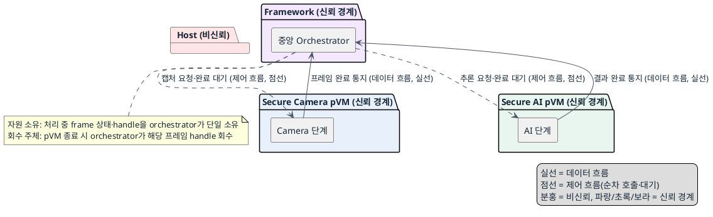
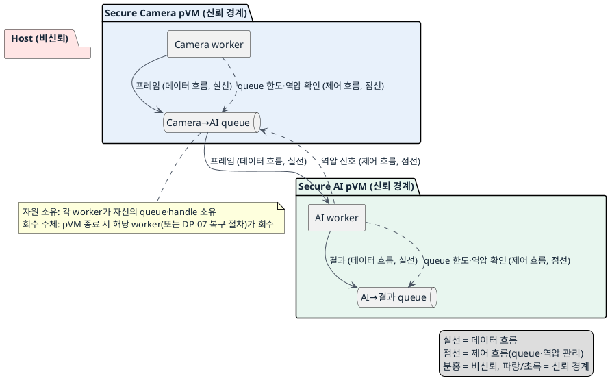

# DP-10. 파이프라인 실행과 역압 책임 위치

## 1. 상태

평가 중

## 2. 결정 목적

캡처→전달→추론→결과 전달로 이어지는 파이프라인의 실행 순서와 역압(backpressure) 책임을 중앙 집중형 동기 실행에 둘지, pVM별 분산 비동기 worker에 둘지 정한다.

## 3. 문제 상황

- 현재 구조: 레퍼런스 파이프라인은 캡처, pVM 간 프레임 전달, AI 추론과 결과 전달을 반복한다(`docs/99_reference_scenario_flow.md` 7~12단계). 각 단계의 실행 완료를 기다릴지 여러 프레임을 겹쳐 처리할지는 아직 정해지지 않았다.
- 요구/품질속성: PERF-01(실시간 처리, 30fps·드롭율), PERF-03(E2E 지연), PERF-06(다중 스트림 처리량), AVL-04(자원 누수 방지). 신뢰 경계: 이 DP는 신뢰 경계를 바꾸지 않는다. 두 후보 모두 DP-03 계열이 정한 버퍼 보호와 DP-04가 정한 HW 권한 전환을 그대로 사용한다.
- 충돌/위험: 한 실행 흐름이 프레임 단계를 순서대로 구동하면 queue 대기는 줄지만 Camera와 AI HW의 실행을 겹치기 어려워 처리량이 제한될 수 있다(PERF-01, PERF-06). 단계별 worker가 독립 실행하면 다중 프레임과 스트림의 처리량을 높일 수 있지만 queue 대기와 지연 변동이 생겨 PERF-03에 영향을 줄 수 있다. 비동기 queue에 처리 중인 frame과 공유 버퍼 handle이 남은 상태에서 pVM이 종료되면 중복 반환과 자원 누수를 막아야 한다(AVL-04).
- baseline 범위: DP-03 계열이 정한 버퍼 보호 방식과 DP-04가 정한 HW 권한 전환 절차는 baseline으로 고정한다. 이번 DP에서 그 버퍼 소유권·전환 절차 자체를 바꾸지 않는다.
- project-custom 범위: 파이프라인 각 단계의 실행 순서를 누가 구동하고 역압을 어디서 관리할지는 이번 DP의 project-custom 범위다.
- 선행/연관 DP: 이 DP는 DP-03 계열(버퍼 전달)과 DP-04(HW 전환)를 조합해 반복 파이프라인의 실행 순서와 역압을 정한다. DP-03 계열, DP-04와 이 DP는 같은 프레임 처리 시간에 포함되므로 PERF-01~04와 PERF-06의 시간 예산을 함께 조정해야 한다.
- 구조적 갈림길: 위 문제를 해결하려면 파이프라인 실행 순서와 역압 책임을 프레임별 동기 실행 흐름이 중앙에서 관리할지, pVM별 비동기 worker가 나누어 관리할지 정해야 한다.

## 4. 결정 질문

프레임별 동기 실행 흐름이 단계 순서와 역압을 중앙에서 관리할 것인가, pVM별 비동기 worker가 queue와 역압을 나누어 관리할 것인가?

## 5. 후보 구조

### 후보 A: 프레임별 동기 실행과 중앙 역압 관리

- 실행 위치: 단일 실행 흐름(중앙 orchestrator), Camera·AI pVM은 그 흐름의 호출을 받아 처리한다.
- 책임: 중앙 실행 흐름이 한 프레임의 캡처, 전달, 추론 완료를 순서대로 기다리고 다음 프레임을 시작한다.
- 데이터 흐름: Camera pVM → (DP-03 계열 버퍼) → AI pVM → 결과 전달로 이어지며, 각 단계는 이전 단계 완료 후에만 진행된다.
- 제어 흐름: 중앙 orchestrator가 각 단계 호출과 완료 대기를 순차로 수행하고, 다음 프레임 시작 여부를 직접 결정한다.
- 신뢰/비신뢰 주체: Host는 비신뢰. 중앙 orchestrator와 pVM들은 각자의 기존 신뢰 경계 안에서 동작하며 이 DP가 그 경계를 바꾸지 않는다.
- 자원 소유·회수 주체: 중앙 orchestrator가 처리 중인 frame 상태와 handle을 한 곳에서 소유한다. pVM 종료 시 orchestrator가 진행 중이던 해당 프레임의 handle을 회수한다.

### 후보 B: pVM별 비동기 worker와 분산 queue·역압 관리

- 실행 위치: Camera pVM과 AI pVM 각각의 비동기 worker.
- 책임: 각 단계의 worker가 독립 queue를 소비·생산하며, queue 한도·frame drop 또는 대기와 완료 통지를 스스로 처리한다.
- 데이터 흐름: Camera worker → (DP-03 계열 버퍼, queue 경유) → AI worker → 결과 전달로 이어지며, 여러 프레임이 단계별로 겹쳐 처리될 수 있다.
- 제어 흐름: 각 worker가 자신의 queue 상태를 보고 다음 프레임을 받을지, 역압을 걸어 상위 단계의 생산을 늦출지 스스로 결정한다.
- 신뢰/비신뢰 주체: Host는 비신뢰. 각 pVM의 worker는 해당 pVM의 기존 신뢰 경계 안에서 동작하며 이 DP가 그 경계를 바꾸지 않는다.
- 자원 소유·회수 주체: 각 worker가 자신의 queue에 있는 frame과 handle을 소유한다. pVM 종료 시 해당 worker의 queue에 남은 frame과 handle을 그 worker(또는 DP-07의 복구 절차)가 회수한다.

## 6. 후보별 구조 다이어그램

### 후보 A 다이어그램

### 후보 B 다이어그램

## 7. 후보별 동작 구조

- 후보 A: 중앙 orchestrator가 Camera 단계에 캡처를 요청하고 완료를 기다린다. 완료되면 프레임이 DP-03 계열 버퍼를 통해 AI 단계로 전달되고, orchestrator는 추론 완료까지 기다린 뒤 결과를 받아 다음 프레임을 시작한다. 각 단계는 이전 단계가 끝나야 다음이 시작되므로 진행 중인 프레임은 항상 하나이거나 orchestrator가 관리하는 소수로 제한된다.
- 후보 B: Camera worker가 프레임을 캡처해 자신의 출력 queue에 넣는다. AI worker는 이 queue에서 프레임을 꺼내 추론하고 결과를 다음 queue에 넣는다. 각 worker는 queue가 한도에 도달하면 역압 신호를 상위 worker에 보내 생산을 늦춘다. 여러 프레임이 단계별로 겹쳐 처리될 수 있다.

## 8. 품질속성 비교

이 DP의 문제 상황에는 필수 gate 수준(pass/fail 0건 기준)의 요구가 없다. PERF-01/PERF-03/PERF-06/AVL-04는 모두 `docs/03_qa_quality_scenarios.md`에서 KPI로만 정의돼 있어 별점으로 비교한다.

### 별점 비교

| 품질속성 | 기준 (KPI 출처: `docs/03_qa_quality_scenarios.md`) | 후보 A | 후보 B |
|---|---|---|---|
| 성능(PERF-01, 비격리 대비 저하 10% 이내·30fps 유지·드롭율 0.1% 이하) | ★1: 단계 겹침 없어 처리 여유 적음, ★2: 일부 겹침, ★3: 단계 겹침으로 여유 확보 | ★1 — Camera·AI 단계를 겹치지 못해 처리 여유가 적음 | ★3 — 단계별 병렬 처리로 처리 여유 확보 |
| 성능(PERF-03, E2E 지연 p99 100ms 이하) | ★1: queue 대기가 큼, ★2: 일부 대기, ★3: 대기 없이 즉시 처리 | ★3 — 프레임마다 즉시 순차 처리해 queue 대기가 없음 | ★1 — queue 대기가 지연 변동을 늘릴 수 있음 |
| 성능(PERF-06, 1080p30 동시 2스트림 이상(4목표)·190MB/s 이상) | ★1: 스트림 늘 때 처리량 제한, ★2: 일부 여유, ★3: 스트림 증가에도 처리량 유지 | ★1 — 순차 처리 구조라 스트림 증가 시 처리량이 제한됨 | ★3 — 분산 worker가 다중 스트림을 겹쳐 처리 |
| 가용성(AVL-04, 1,000회 crash-restart soak 누수율 0 수렴) | ★1: 여러 queue에 남은 handle 회수 어려움, ★2: 일부 대조, ★3: 진행 중 상태가 단순해 회수 용이 | ★3 — 진행 중인 프레임이 한 곳(orchestrator)에만 있어 회수가 단순 | ★1 — 여러 worker의 queue에 남은 frame·handle을 각각 회수해야 함 |

## 9. 핵심 트레이드오프

동기 실행은 진행 중인 프레임 상태를 한 실행 흐름에서 관리해 queue와 미완료 handle 수를 줄여 AVL-04에 유리하고 PERF-03 지연 변동도 작다. 대신 Camera와 AI 단계를 겹치지 못해 PERF-01의 처리 여유와 PERF-06의 다중 스트림 처리량이 제한된다. 비동기 실행은 단계별 처리를 겹쳐 PERF-01과 PERF-06을 개선한다. 대신 queue 대기가 PERF-03 지연 변동을 늘릴 수 있고, 장애 시 여러 단계에 남은 frame과 handle을 함께 정리해야 해 AVL-04 위험이 커진다.

## 10. 검증 기준

- PERF-01/PERF-03/PERF-06: `docs/03_qa_quality_scenarios.md`의 기존 KPI로 단일·다중 스트림 조건에서 두 후보를 측정한다.
- AVL-04: DP-07의 장애 주입 조건과 결합해 1,000회 crash-restart soak 기준으로 두 후보의 handle 누수율을 측정한다.
- 검증 순서: 단일 스트림 기준 측정을 먼저 완료한 뒤 다중 스트림·장애 조건으로 확장한다.

## 11. 검토 결과

- (아직 없음 — 사용자 검토 전)

## 12. 최종 결정

- (검토 후 결정)
