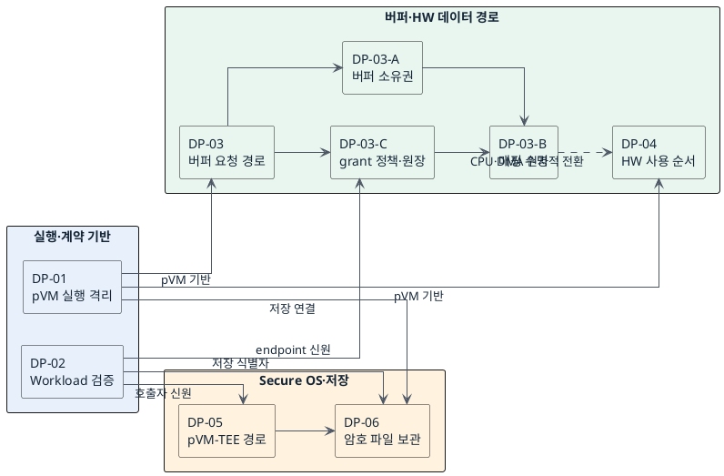

# Decision Point 선정 목록

## 1. 상태

선정안

이 문서는 상세 DP를 작성하기 전에 목록을 합의하기 위한 문서다.
후보 평가와 최종 결정은 포함하지 않는다.

## 2. 선정 근거

- `DP-RULE.md`
- `docs/02_requirements.md`
- `docs/03_qa_quality_scenarios.md`
- `docs/04_architectural_drivers.md`
- `docs/07_decision_point_candidates.md`
- `docs/99_reference_scenario_flow.md`
- `../poc-p/docs/phase-09/README.md`

기존 DP 문서의 후보와 결론은 선정 근거로 사용하지 않았다.
PoC 결과는 기술 실현 가능성을 확인하는 관찰 근거로만 사용한다.

이 문서에서 사용하는 주요 기술 용어는 다음과 같다.

- Host: 신뢰하지 않는 Linux OS와 관리 프로그램이다.
- pVM: Host의 메모리 접근을 차단한 보호 VM이다.
- EL2: 메모리와 장치 접근 권한을 최종 적용하는 pKVM 실행 영역이다.
- TEE: TrustZone Secure OS처럼 Host와 분리된 보안 실행 환경이다.
- Workload: pVM 안에서 실행하는 보안 프로그램이다.
- FF-A: 서로 다른 보안 실행 환경 사이의 통신 규격이다.

모든 DP는 다음 조건을 만족한다.

- 한 번에 하나의 구조 차이만 다룬다.
- 후보 구조는 정확히 두 개다.
- 두 후보의 책임, 실행 위치 또는 신뢰 경계가 다르다.
- 두 후보 모두 상위 필수 기준(gate)을 통과할 가능성이 있다.
- 문제 상황, 비교 기준과 트레이드오프에 같은 품질속성을 사용한다.
- 제품 선택, 검증 방법과 다른 DP의 세부 구현을 제외한다.

## 3. 선정 DP

### DP-01. pVM 실행 흐름의 격리 경계

- 문제 상황:
    - 현재 구조: 하나의 Host 프로세스가 Secure Camera pVM과 Secure AI pVM의 생성, 제어와 실행을 하나의 실행 흐름에서 함께 담당한다.
    - 장애 전파 문제: 한 pVM을 다루는 코드가 멈추거나 잘못 동작하면 공용 실행 흐름이 막혀 다른 pVM과 Host 기능도 함께 중단될 수 있다(AVL-01).
    - 시작 성능 제약: 두 pVM의 생성과 초기화를 거쳐 첫 프레임을 처리하기까지의 전체 시간은 PERF-07 예산 안에 있어야 한다. 이 제약은 두 후보에 공통으로 적용된다. 실행 구조에 따라 공용 실행 흐름의 경합 또는 프로세스 생성과 IPC 단계가 이 시간에 더해진다. 어느 구조의 시작 시간이 더 짧은지는 측정으로 판단한다.
    - 관련 요구: FR-01, FR-02
    - 구조적 갈림길: 실행 흐름을 한 프로세스 안에서 VM별로 격리하면 프로세스 생성과 IPC 단계를 더하지 않지만 프로세스 전체 장애는 격리하지 못한다. 실행을 VM별 프로세스로 분리하면 crash까지 격리할 수 있지만 프로세스 생성과 IPC 단계가 시작 경로에 더해진다.
    - 결정 필요: 위 문제를 해결하기 위해 pVM 실행 흐름의 격리 경계를 정해야 한다.
- 결정 질문: pVM 실행 흐름을 한 프로세스 안에서 VM별 실행 컨텍스트로 격리할 것인가, 제어기와 VM별 실행 프로세스로 분리할 것인가?
- 후보 A: 단일 프로세스 안 VM별 실행 컨텍스트 분리
- 후보 B: 제어기와 VM별 실행 프로세스 분리
- 책임과 경계: 후보 A는 한 Host 프로세스 안에서 pVM마다 작업 큐, 실행 worker, 상태와 자원 관리 정보를 분리한다. 한 pVM의 멈춤이 공용 실행 흐름을 막지 않게 하고, 프로세스 경계는 추가하지 않는다. 후보 B는 제어 담당 프로세스와 VM 실행 프로세스를 나누고, pVM마다 별도 실행 프로세스를 두어 멈춤과 crash를 모두 격리한다.
- 관련 요구: FR-01, FR-02
- 정렬 품질속성: 가용성(AVL-01), 성능(PERF-07)
- 핵심 트레이드오프: 실행 컨텍스트 분리는 프로세스 생성과 IPC 단계를 더하지 않으면서 한 pVM의 멈춤이 다른 pVM으로 번지는 것을 줄인다. 대신 프로세스 자체가 죽는 장애는 모든 pVM에 함께 영향을 주고, 프로세스 안 공용 자원의 경합이 시작 시간에 영향을 줄 수 있다. 이 수준의 격리가 AVL-01을 만족하는지는 gate 평가에서 확인한다. 실행 프로세스 분리는 멈춤과 crash를 모두 pVM 단위로 격리하고 pVM별 초기화를 독립적으로 진행할 수 있다. 대신 프로세스 생성과 IPC 단계가 시작 경로에 더해진다. 어느 구조의 시작 시간이 더 짧은지는 측정으로 판단한다.

### DP-02. Workload 최종 검증 위치

- 문제 상황:
    - 현재 구조: Workload 이미지는 Host 파일시스템에 있고 Host가 탑재 경로를 다루지만, Host는 침해될 수 있는 비신뢰 주체다.
    - 보안 문제: Host의 검증 결과만 믿으면 Host가 침해됐을 때 검증을 우회한 변조 이미지가 pVM에 탑재될 수 있다(SEC-04).
    - 확장성 문제: 새로운 패키지 형식이나 서로 다른 런타임의 Workload가 추가될 때마다 Framework 코어나 보호 영역의 해석 코드를 바꾸면 신규 Workload 수용 범위가 제한된다(EXT-01, EXT-02).
    - 시작 지연 문제: 이미지 측정, 승인과 패키지 해석이 시작 경로에 차례로 추가되면 첫 프레임 처리까지의 시간이 늘어난다(PERF-07).
    - 관련 요구: FR-03
    - 구조적 갈림길: 이미지 측정과 승인을 서로 다른 보호 구성 요소에 나누면 보호 영역의 패키지 해석 코드를 줄일 수 있지만 측정값과 승인 결과를 정확히 연결해야 한다. 보호 영역의 로더가 패키지를 직접 검증하면 검증과 실행 승인을 한곳에서 처리할 수 있지만 패키지 해석 코드와 시작 시간이 늘어난다.
    - 결정 필요: 위 문제를 해결하기 위해 Workload 이미지의 최종 검증 위치를 정해야 한다.
- 결정 질문: Host 밖의 신뢰할 수 있는 주체가 실행 이미지의 측정값을 승인할 것인가, 보호 영역의 로더가 서명된 패키지를 직접 검증할 것인가?
- 후보 A: Host 밖의 검증 주체가 실행 이미지 측정값 승인
- 후보 B: 보호 영역의 로더가 패키지 최종 검증
- 책임과 경계: 후보 A는 실제로 실행할 데이터의 측정과 승인을 서로 다른 보호 구성 요소에 나눈다. 후보 B는 패키지 검증과 실행 승인을 보호 영역의 로더에 함께 둔다.
- 관련 요구: FR-03
- 정렬 품질속성: 보안성(SEC-04 공통 필수 기준), 확장성(EXT-01, EXT-02), 성능(PERF-07)
- 핵심 트레이드오프: 측정값 승인 구조는 보호 영역에서 복잡한 패키지를 해석하는 코드를 줄일 수 있다. 대신 여러 보호 영역의 측정값과 승인 결과를 정확히 연결해야 한다. 신규 Workload나 서로 다른 런타임을 추가할 때 보호 영역 코드를 거의 바꾸지 않아도 되지만, 측정과 승인 단계가 나뉘어 시작 시간이 늘어날 수 있다. 로더 직접 검증 구조는 검증과 실행 승인을 한곳에서 처리하지만, 새로운 패키지 형식을 지원할 때 보호 영역의 패키지 해석 코드가 늘어날 수 있고 시작 시간도 늘어난다.

### DP-03. 복사 없는 버퍼 전달에서 Host를 거칠지 여부

- 문제 상황:
    - 현재 구조: 현재 pVM 통신 기능은 pVM과 Host 사이의 통신만 제공하고, Camera pVM과 AI pVM이 보호 영역에 직접 zero-copy 전달을 요청하는 기능은 없다. 또한 EL2에는 두 pVM 사이에서 버퍼 접근 권한을 바꾸는 규격이 없다.
    - 원본 데이터 보호 문제: 두 pVM 사이의 버퍼 접근 권한을 확인하고 바꾸는 EL2 규격이 없으므로, 이 기능을 잘못 추가하면 Host나 다른 도메인에 원본 데이터가 노출될 수 있다(SEC-01 공통 필수 기준).
    - 부가 정보 노출 문제: 기존 pVM 통신 기능으로 두 pVM의 전달 요청을 연결하려면 Host가 요청을 중계해야 한다. 이때 Host가 전달 시점, 송신자, 수신자와 요청 순서를 볼 수 있고, 침해된 Host는 이 정보로 pVM 사이의 통신 양상을 알아낼 수 있다(보안성 TBD).
    - 전달 지연 문제: 기존 pVM 통신 기능은 Host 중계 단계를 거치므로 프레임 데이터를 복사하지 않더라도 요청 전달 단계가 늘어난다(PERF-02).
    - 수정 범위 문제: 현재 Host 통신 API에는 pVM 간 버퍼 전달 기능이 없고 보호 영역에도 직접 요청 규격이 없어, 어느 경로를 선택하더라도 Host 통신 API, pVM 드라이버 또는 보호 영역 호출 규격을 수정해야 한다(변경 용이성 TBD).
    - 관련 요구: FR-05
    - 구조적 갈림길: 기존 Host 통신 기능을 사용하면 API 변경을 줄일 수 있지만 Host가 전달 요청의 부가 정보를 보고 중계 단계가 추가된다. pVM이 보호 영역에 직접 요청하면 Host가 볼 수 있는 정보와 중계 단계를 줄일 수 있지만 보호 영역 호출 규격과 pVM 드라이버를 바꿔야 한다.
    - 결정 필요: 위 문제를 해결하기 위해 버퍼 전달 요청이 Host를 거칠지 정해야 한다.
- 결정 질문: Host가 버퍼 전달 요청을 중계할 것인가, pVM이 Host를 거치지 않고 보호 영역에 직접 요청할 것인가?
- 후보 A: Host 요청 중계와 EL2 최종 검증
- 후보 B: pVM의 보호 영역 직접 요청
- 책임과 경계: 두 후보 모두 DP-03-C에서 정한 보호 주체가 버퍼 소유자, 수신자, 전송 식별자와 권한 회수 상태를 확인하고 EL2가 CPU/DMA 접근권을 최종 적용한다. 후보 A에서는 Host가 요청 순서와 전달 대상을 중계한다. 후보 B에서는 송신 pVM과 수신 pVM이 보호 영역에 직접 요청한다.
- 관련 요구: FR-05
- 정렬 품질속성: 보안성(SEC-01 공통 필수 기준, 전달 요청 부가 정보 노출은 TBD), 성능(PERF-02), 변경 용이성(TBD)
- 핵심 트레이드오프: Host 중계 구조는 기존 통신 기능과 API를 다시 사용할 수 있어 수정 범위가 작다. 대신 Host가 전달 요청의 부가 정보를 볼 수 있고 중계 단계가 전달 지연에 추가된다. pVM 직접 요청 구조는 Host가 볼 수 있는 정보와 중계 단계를 줄이지만, 보호 영역 호출 규격과 pVM 드라이버의 변경 범위가 늘어난다.

### DP-03-A. 공유 버퍼의 논리적 소유권 위치

- 문제 상황:
    - 현재 구조: pKVM의 pVM 메모리는 Host가 준비한 backing page를 보호 영역에 넘겨 사용할 수 있다. 그러나 물리 페이지를 처음 할당한 주체와 보호 전환 뒤 버퍼의 논리적 소유자와 회수 책임자는 같지 않을 수 있다.
    - PoC 관찰: `../poc-p`는 송신 pVM이 한 페이지 DMA-BUF를 만들고 EL2가 수신 pVM에 빌려주는 구조만 확인했다. 보호된 중앙 풀 구조, 실제 Camera/AI DMA-BUF와 다중 페이지 프레임은 확인하지 않았다.
    - 보안 문제: Host가 일반 DMA-BUF를 계속 소유하거나 매핑한 채 양쪽 pVM에 전달하면 원본 데이터가 Host에 노출될 수 있다(SEC-01 공통 필수 기준). Host가 backing page를 준비하더라도 보호 전환 뒤에는 Host 매핑을 제거하고 보호된 주체가 소유권과 재할당을 관리해야 한다.
    - 전달 성능 문제: 송신 pVM이 프레임마다 버퍼를 만들고 빌려주면 페이지 확인, Stage-2 매핑 변경과 회수가 반복된다. 중앙 풀이 버퍼를 미리 준비하면 반복 작업을 줄일 수 있지만 사용하지 않는 버퍼도 계속 점유한다(PERF-02, 자원 효율 TBD).
    - 장애 회수 문제: 송신 pVM이 사라질 때 대여 중인 버퍼가 남으면 원장과 실제 매핑이 어긋날 수 있다. 중앙 풀과 송신 pVM 중 어느 쪽이 수명을 소유하는지에 따라 강제 회수 범위가 달라진다(AVL-04).
    - 관련 요구: FR-01, FR-05
    - 구조적 갈림길: 보호된 중앙 풀이 버퍼 수명과 재할당을 관리하면 pVM 장애와 무관하게 버퍼를 회수하고 재사용할 수 있지만 중앙 관리 상태와 예약 메모리가 필요하다. 송신 pVM이 버퍼를 소유하면 생산자 수명에 맞춰 동적으로 사용할 수 있지만 대여 중 종료와 회수 실패를 별도로 처리해야 한다.
    - 결정 필요: 위 문제를 해결하기 위해 보호 전환 뒤 공유 버퍼의 논리적 소유권과 수명 관리 책임을 둘 위치를 정해야 한다.
- 결정 질문: 공유 버퍼의 논리적 소유권과 수명 관리 책임을 보호된 중앙 버퍼 풀에 둘 것인가, 송신 pVM의 local DMA-BUF에 둘 것인가?
- 후보 A: 보호된 중앙 버퍼 풀이 버퍼 소유와 재할당 담당
- 후보 B: 송신 pVM이 local DMA-BUF를 소유하고 수신 pVM에 대여
- 책임과 경계: 두 후보 모두 Host가 보호 전환 뒤 원본 데이터를 매핑하지 못하게 하고, 수신 pVM에는 자신의 FD 공간에서 사용할 local DMA-BUF handle을 만든다. 후보 A에서는 Host가 풀 생성을 요청하거나 backing page를 제공할 수 있지만 보호된 중앙 관리 주체가 버퍼 수명, slot 할당, 회수와 재사용 전 소거를 담당한다. 후보 B에서는 송신 pVM이 버퍼를 생성하고 수명을 소유하며, 보호 영역은 대여 상태와 수신자 권한을 확인하고 송신 pVM 종료 시 강제 회수한다.
- 관련 요구: FR-01, FR-05
- 정렬 품질속성: 보안성(SEC-01 공통 필수 기준), 성능(PERF-02), 가용성(AVL-04), 자원 효율(TBD)
- 핵심 트레이드오프: 보호된 중앙 풀은 버퍼를 미리 준비하고 pVM 장애와 분리해 회수할 수 있어 반복 할당과 매핑 준비를 줄인다. 대신 중앙 원장과 예약 메모리가 필요하고, 보호된 풀의 실현 가능성은 확인되지 않았다. 송신 pVM 소유 구조는 생산자가 필요한 크기와 수명에 맞춰 버퍼를 만들 수 있다. 대신 대여 중인 pVM 종료, FD close와 부분 실패 때 버퍼 수명과 실제 매핑을 함께 복구해야 하며, PoC는 한 페이지 조건만 확인했다.

### DP-03-B. 공유 버퍼 접근권의 매핑 수명

- 문제 상황:
    - 현재 구조: `../poc-p`는 한 번에 한 페이지를 송신 pVM에서 회수해 수신 pVM의 고정 IPA에 매핑하고, 반환 뒤 송신 pVM에 다시 매핑한다.
    - 보안 문제: 프레임이 바뀌었는데 이전 수신자가 계속 slot에 접근하거나 생산자와 소비자의 쓰기 권한이 겹치면 다른 시점의 데이터가 섞일 수 있다. 두 후보 모두 Host와 비인가 도메인의 접근을 차단하고 slot 세대와 권한 상태를 검증해야 한다(SEC-01 공통 필수 기준, 프레임 간 접근권 TBD).
    - 전달 성능 문제: 다중 페이지 프레임에서 매번 Stage-2와 장치 DMA 매핑을 바꾸면 TLB 무효화와 권한 전환 비용이 프레임마다 발생한다. 매핑을 유지하면 이 비용을 줄일 수 있지만 fence, slot 상태와 역압 처리가 데이터 경로에 남는다(PERF-02).
    - 장애 회수 문제: 대여 또는 ring 사용 중 pVM이 종료되면 slot 상태와 CPU/DMA 매핑을 함께 회수해야 하며, 반복 장애 뒤에도 잔여 매핑이 누적되지 않아야 한다(AVL-04).
    - 관련 요구: FR-05
    - 구조적 갈림길: 프레임마다 배타적으로 접근권을 옮기면 시간에 따른 권한 경계가 분명하지만 매핑 전환이 반복된다. 보호된 ring을 계속 매핑하면 프레임당 전환을 줄일 수 있지만 양쪽 pVM의 역할별 권한과 slot 상태를 별도로 강제해야 한다.
    - 결정 필요: 위 문제를 해결하기 위해 공유 버퍼 접근권의 매핑 수명을 정해야 한다.
- 결정 질문: 프레임마다 배타적 접근권과 매핑을 대여하고 회수할 것인가, 보호된 ring을 양쪽 pVM에 상주 매핑하고 slot 상태로 접근 순서를 제어할 것인가?
- 후보 A: 프레임별 exclusive lend와 매핑 회수
- 후보 B: 보호된 ring 상주 매핑과 slot 상태 전환
- 책임과 경계: 후보 A에서는 보호 영역이 프레임마다 송신자 매핑을 회수한 뒤 수신자 매핑을 만들고 반환 때 반대로 처리한다. 후보 B에서는 보호 영역이 사전에 승인된 송신자와 수신자에만 역할별 매핑을 유지하고, 양쪽 pVM은 보호된 slot 세대, fence와 생산자·소비자 상태에 따라 접근한다. 상주 매핑은 Host나 제3 도메인에 접근권을 주지 않으므로 SEC-01을 위반하지 않는다. 프레임 세대가 바뀐 뒤 이전 수신자의 접근까지 차단해야 하는지는 별도 TBD gate에서 확인한다. 두 후보 모두 CPU Stage-2와 Camera/AI DMA 권한 상태를 같은 전송 상태에 결합해야 한다.
- 관련 요구: FR-05
- 정렬 품질속성: 보안성(SEC-01 공통 필수 기준, 프레임 간 접근권 TBD), 성능(PERF-02), 가용성(AVL-04), 자원 효율(TBD)
- 핵심 트레이드오프: 프레임별 대여는 이전 주체의 접근권을 매번 제거해 시간에 따른 권한 경계를 좁힌다. 대신 다중 페이지 매핑 변경과 TLB 무효화가 프레임마다 발생한다. 상주 ring은 프레임당 매핑 전환을 줄이지만 메모리를 계속 점유하고, stale slot 접근과 생산자·소비자 경합을 막는 fence와 상태 검증이 필요하다.

### DP-03-C. 공유 버퍼 grant 정책과 lease 원장 위치

- 문제 상황:
    - 현재 구조: `../poc-p`는 EL2가 endpoint 확인, grant 정책, lease 상태, 권한 전환과 회수를 모두 직접 처리한다. 현재 pKVM에는 pVM 간 공유를 위한 표준 관리 주체가 없다.
    - 보안 문제: 침해된 Host와 위장 pVM의 요청을 거부하고 owner, receiver, slot 세대와 회수 상태를 보호된 원장으로 확인해야 한다(SEC-01 공통 필수 기준). 이 정책 코드를 EL2에 넣으면 pKVM TCB가 늘어나고, EL2 밖에 두면 정책 명령의 인증과 재생 방지가 필요하다.
    - 전달 성능 문제: EL2가 직접 판단하면 보호 실행 환경 사이의 추가 호출을 줄일 수 있다. 분리된 보호 정책 서비스가 판단하면 EL2 집행 전에 요청 전달과 응답 단계가 추가된다(PERF-02).
    - 교체 범위 문제: 정책을 특정 TEE 또는 보호 서비스 인터페이스에 결합하면 그 실행 환경을 바꿀 때 연동 코드를 수정할 수 있다(변경 용이성 TBD).
    - 관련 요구: FR-05
    - 구조적 갈림길: EL2가 정책과 원장을 직접 소유하면 호출 단계는 줄지만 EL2 코드와 검증 범위가 늘어난다. 보호 정책 서비스로 분리하면 EL2를 권한 집행에 집중시킬 수 있지만 두 보호 영역 사이의 인증된 명령 경로가 필요하다.
    - 결정 필요: 위 문제를 해결하기 위해 grant 정책 결정과 lease 원장의 소유 위치를 정해야 한다.
- 결정 질문: 공유 버퍼의 grant 정책과 lease 원장을 EL2가 직접 소유할 것인가, EL2 밖의 보호 정책 서비스가 소유하고 EL2는 권한만 집행할 것인가?
- 후보 A: EL2가 grant 정책과 lease 원장을 직접 소유
- 후보 B: 분리된 보호 정책 서비스가 정책과 원장을 소유하고 EL2가 집행
- 책임과 경계: 두 후보 모두 EL2가 Stage-2와 장치 DMA 접근권을 최종 적용한다. 후보 A에서는 EL2가 endpoint 신원, 허용 관계, lease 세대와 회수 조건까지 확인한다. 후보 B에서는 TEE 또는 Secure Partition처럼 Host와 분리된 정책 서비스가 같은 정보를 관리하고 인증된 권한 변경 명령을 발급하며, EL2는 명령의 발급자, 세대와 현재 매핑 상태를 확인한 뒤 집행한다.
- 관련 요구: FR-05
- 정렬 품질속성: 보안성(SEC-01), 성능(PERF-02), 변경 용이성(TBD)
- 핵심 트레이드오프: EL2 직접 소유 구조는 정책 판단을 한 보호 영역에서 처리해 호출 단계를 줄인다. 대신 정책과 lifecycle 코드가 EL2 TCB와 검증 범위에 들어간다. 보호 정책 서비스 분리 구조는 EL2의 책임을 권한 집행으로 제한하지만 보호 영역 사이의 호출 지연이 추가되고, 정책 서비스와 명령 인증 경로의 실현 가능성은 확인되지 않았다.

### DP-04. HW 사용 순서 결정 위치

- 문제 상황:
    - 현재 구조: Camera/AI HW는 Host의 일반 기능과 보안 Workload가 함께 쓰며, Host가 사용 순서를 정하고 EL2가 접근 권한을 바꾼다.
    - 권한 전환 문제: 권한 회수, 남은 데이터 삭제와 다음 주체 권한 부여가 정확한 순서로 끝나지 않으면 두 주체의 권한이 겹치거나 할당되지 않은 메모리로 DMA가 접근할 수 있다. 순서를 정하는 위치와 관계없이 현재 EL2 권한 전환 구조에서 발생할 수 있는 문제다(SEC-02, SEC-03 공통 필수 기준).
    - 요청 대기 상한 조건: Host가 침해되거나 잘못 동작하면 특정 요청의 순서를 계속 미루거나 처리하지 않을 수 있다. 순서 결정 위치와 관계없이, 어떤 주체도 다른 주체의 요청을 무기한 막지 못하게 하는 장치가 두 후보 모두에 필요하다(가용성 TBD).
    - 전환 지연 문제: 순서 판단 단계가 전환 경로 어디에 있는지에 따라 HW 권한 전환 시간이 달라진다. Host의 판단과 호출 단계가 전환 경로에 남으면 전환 시간이 늘어난다(PERF-04).
    - 순서 조정 문제: Camera/AI HW는 Host의 일반 기능도 함께 사용한다. 순서 결정 위치에 따라 Host가 자신의 일반 기능 작업 상황을 사용 순서에 반영할 수 있는 정도가 달라진다. 이 조정 능력에 대한 상위 품질 요구는 아직 없다(변경 용이성 TBD: 순서 정책 조정).
    - 관련 요구: FR-04
    - 구조적 갈림길: Host가 순서를 정하면 Host의 작업 상황을 순서에 반영하고 순서 정책을 EL2 수정 없이 바꿀 수 있지만 Host의 판단 단계가 전환 경로에 남는다. EL2가 요청 순서대로 처리하면 Host의 개입과 판단 단계를 없앨 수 있지만 순서 정책이 도착 순서로 고정된다.
    - 결정 필요: 위 문제를 해결하기 위해 HW 사용 순서를 정하는 위치를 결정해야 한다.
- 결정 질문: Camera/AI HW 사용 순서를 Host가 정하고 EL2가 검증과 대기 상한을 강제할 것인가, EL2가 요청이 도착한 순서대로 정할 것인가?
- 후보 A: Host가 사용 순서를 정하고 EL2가 검증과 대기 상한 강제
- 후보 B: EL2가 요청 순서대로 사용권을 부여
- 책임과 경계: 두 후보 모두 EL2가 S2MPU/DMA 권한 회수, 남은 데이터 삭제와 다음 사용자에 대한 권한 부여를 중간 중첩 없이 수행한다. 또한 두 후보 모두 각 사용자가 사용 요청을 EL2에 직접 등록하고, EL2가 요청자를 검증하고 등록 시점 기준의 최대 대기 시간을 강제하여, 침해된 Host나 다른 주체가 특정 요청을 무기한 막지 못하게 한다. 후보 A는 등록된 요청의 순서 정책을 Host에 두고, EL2는 검증과 대기 상한만 강제한다. 후보 B는 각 사용자가 EL2에 직접 요청하고, EL2는 먼저 도착한 요청부터 처리한다. 후보 B의 EL2에는 도착 순서 외의 우선순위와 예약 기능을 넣지 않는다.
- 관련 요구: FR-04
- 정렬 품질속성: 보안성(SEC-02, SEC-03 공통 필수 기준), 성능(PERF-04), 가용성(TBD: 요청 대기 상한은 공통 조건), 변경 용이성(TBD: 순서 정책 조정)
- 핵심 트레이드오프: Host가 순서를 정하면 Host의 일반 기능 작업 상황을 순서에 반영할 수 있고 순서 정책을 EL2 수정 없이 바꿀 수 있다. 대신 Host의 판단과 호출 단계가 EL2 권한 전환 앞에 남아 전환 지연이 늘어날 수 있다. EL2가 요청 순서대로 처리하면 Host의 판단 단계를 없애 전환 지연을 줄일 수 있다. 대신 순서 정책이 도착 순서로 고정되어 정책을 바꾸려면 EL2를 수정해야 한다.

### DP-05. pVM-TEE 호출 경로

- 문제 상황:
    - 현재 구조: 기존 Host 프로그램은 GP Client API를 통해 TEE를 호출한다. 새 pVM의 Workload도 암호화·복호화 명령을 TEE에 보내고 결과를 받아야 한다.
    - 호출자 구분 문제: 기존 Host 중심 호출 경로에서는 TEE가 여러 pVM의 요청을 같은 Host 요청으로 볼 수 있다. 침해된 Host가 승인된 pVM으로 위장하거나 요청을 바꿔 전달할 수도 있다(SEC-06).
    - 교체 범위 문제: pVM 호출을 위해 Secure OS 전용 인터페이스를 여러 구성 요소에 추가하면 Secure OS를 교체할 때 관련 소프트웨어를 함께 수정해야 한다(EXT-06).
    - 호출 지연 문제: Host 중계와 요청 인증 단계가 암호화·복호화 호출마다 추가되면 캡처부터 판단 결과 전달까지의 시간이 늘어난다(PERF-03).
    - 관련 요구: FR-06, CS-02
    - 구조적 갈림길: 기존 Host 호출 경로를 사용하면 GP Client API를 유지할 수 있지만 중계와 요청 인증 단계가 추가된다. 보호된 직접 전달 경로를 사용하면 중계 단계를 줄일 수 있지만 EL2, FF-A 관리 구성 요소와 Secure OS를 함께 바꿔야 한다.
    - 결정 필요: 위 문제를 해결하기 위해 pVM에서 TEE로 가는 요청이 Host를 거칠지 정해야 한다.
- 결정 질문: Host가 내용을 해석하지 않고 인증된 TEE 요청을 중계할 것인가, EL2/FF-A가 pVM 요청을 TEE에 직접 전달할 것인가?
- 후보 A: Host 중계와 요청 자체 인증
- 후보 B: EL2/FF-A 직접 전달과 호출 경로 기반 신원 확인
- 책임과 경계: 후보 A는 Host를 신뢰하지 않는 전달자로 사용하고, TEE가 요청을 보낸 pVM의 신원과 요청 내용의 변경 여부를 직접 확인한다. 후보 B는 Host를 호출 경로에서 제외하고, EL2/FF-A가 확인한 호출자 신원을 요청과 함께 TEE에 전달한다.
- 관련 요구: FR-06, CS-02
- 정렬 품질속성: 보안성(SEC-06 공통 필수 기준), 확장성(EXT-06), 성능(PERF-03)
- 핵심 트레이드오프: Host 중계 구조는 기존 GP Client API 호출 경로를 다시 사용할 수 있다. 대신 Host 중계 단계와 요청 인증 처리가 추가된다. 직접 전달 구조는 중간 전달 단계를 줄이지만, EL2, FF-A 관리 구성 요소와 Secure OS에서 함께 수정해야 하는 범위가 늘어난다.

### DP-06. 암호화된 저장 파일 보관 주체

- 문제 상황:
    - 현재 구조: pVM 안의 Workload가 GP Client API로 Secure Storage를 호출하면 TEE가 파일을 암호화한다. TEE의 파일 처리 RPC는 pVM 안의 일반 영역 저장 서비스로 돌아오고, 이 서비스는 암호화된 파일을 pVM의 Linux 파일시스템에 기록한다. 저장 서비스와 파일시스템의 수명은 동적으로 생성되고 삭제되는 pVM의 수명에 묶여 있다.
    - 결정 대상 문제:
        - 영구 저장 문제: pVM이 삭제되면 pVM 안의 저장 서비스와 파일시스템도 사라져 이전에 암호화한 파일을 다시 사용할 수 없다(가용성 TBD).
        - 저장 서비스 장애 문제: Secure Storage 요청을 처리하는 일반 영역의 저장 서비스가 멈추거나 차단되면 이 서비스를 사용하는 Workload가 저장 데이터를 읽거나 쓸 수 없다(가용성 TBD).
        - 재연결 지연 문제: pVM을 다시 만들 때 저장 서비스를 시작하고 이전 저장 공간을 찾아 연결하는 단계가 추가되어 첫 프레임 처리까지의 시간이 늘어난다(PERF-07).
        - Workload 추가 문제: Workload마다 저장 서비스와 저장 공간의 구성을 따로 추가하면 Framework 코어나 배포 구성을 바꿔야 하고 통합 시간이 늘어난다(EXT-01, EXT-03).
        - 자원 사용 문제: pVM마다 저장 서비스와 저장 공간을 따로 두면 메모리, 프로세서와 저장 공간 사용량이 늘어난다(자원 효율 TBD).
    - 공통 선행 조건:
        - 식별 조건: 새로 생성된 pVM은 이전 pVM과 인스턴스 식별자가 다르다. 두 후보 모두 DP-02에서 확인한 안정적인 Workload 식별자로 이전 저장 공간을 다시 찾아야 한다. 이 조건은 후보를 가르지 않는다.
    - 공통 보안 gate:
        - 평문과 키는 TEE 밖으로 내보내지 않는다(SEC-05 공통 필수 기준).
        - RPMB를 사용하지 않는 저장소에서도 암호화 파일의 삭제, 변조와 이전 상태로 되돌리기를 검출할 수 있어야 한다. 실현 방법은 확인 필요 상태다(저장 무결성과 재생 방지 TBD). 두 후보가 모두 이 gate를 만족하지 못하면 상세 DP의 결정을 확정하지 않는다.
    - 관련 요구: FR-01, FR-03, FR-06
    - 구조적 갈림길: 저장 기능을 여러 Workload가 함께 쓰면 연결 시간, 구성 작업과 자원 사용을 줄일 수 있지만 장애 영향이 넓어진다. Workload마다 나누면 장애 영향은 줄지만 연결 시간, 구성 작업과 자원 사용이 늘어난다.
    - 결정 필요: 위 문제를 해결하기 위해 암호화 파일의 보관 수명과 입출력 책임을 둘 위치를 정해야 한다.
- 결정 질문: pVM 수명과 독립적인 암호화 파일의 보관과 입출력 책임을 Host의 공용 영구 저장 서비스에 둘 것인가, Framework가 관리하는 Workload별 영구 저장 공간과 pVM 안의 저장 서비스에 나눌 것인가?
- 후보 A: Host 공용 영구 저장 서비스가 보관과 입출력 담당
- 후보 B: Workload별 영구 저장 공간과 pVM 안 저장 서비스에 책임 분담
- 책임과 경계: 두 후보 모두 키 관리와 암호화·복호화는 TEE에서만 수행하고 RPMB는 사용하지 않는다. TEE는 검증된 Workload 식별자로 저장 공간을 구분하고 파일의 기밀성과 무결성을 확인할 책임을 진다. 비-RPMB 환경에서 무결성과 재생 방지를 실현하는 방법은 공통 보안 gate에서 확인한다. 후보 A에서는 Host의 공용 저장 서비스가 Workload별 암호화 파일의 보관과 입출력을 모두 담당한다. 후보 B에서는 Framework가 pVM과 별도로 유지되는 Workload별 저장 공간의 수명을 관리하고, pVM 안의 저장 서비스가 파일 입출력을 수행하며, Framework가 같은 Workload의 새 pVM에 저장 공간을 다시 연결한다.
- 관련 요구: FR-01, FR-03, FR-06
- 정렬 품질속성: 보안성(SEC-05 공통 필수 기준, 저장 파일의 무결성과 재생 방지는 확인 필요 공통 gate), 가용성(TBD: 저장 서비스 장애 영향과 pVM 재생성 후 데이터 접근), 성능(PERF-07: 저장 공간 재연결 시간), 확장성(EXT-01 공통 필수 기준: Framework 코어 수정 없음, EXT-03: 저장 공간 구성까지 포함한 신규 Workload 통합 시간), 자원 효율(TBD)
- 핵심 트레이드오프: Host 공용 저장 서비스는 pVM을 다시 만들 때 별도 저장 공간을 연결하지 않아도 되므로 시작 시간을 줄이고, 신규 Workload의 저장 구성을 단순하게 하며, 저장 서비스 자원을 함께 사용할 수 있다. 대신 공용 서비스에 장애가 생기면 여러 Workload가 저장 데이터를 사용하지 못할 수 있다. Workload별 저장 공간은 한 저장 공간이나 pVM 저장 서비스의 장애 영향을 해당 Workload로 제한할 수 있다. 대신 pVM을 만들 때 저장 공간을 다시 연결하는 시간이 추가되고, Workload마다 저장 공간과 저장 서비스를 구성할 자원이 필요하다.

## 4. 선행 및 연관 관계

### 4.1 관계 다이어그램

실선 화살표(`-->`)는 앞 DP의 결과를 뒤 DP가 입력으로 사용하는 선행 관계다.
점선 화살표(`..>`)는 두 DP가 같은 권한 전환이나 성능 예산을 함께 맞춰야 하는 연관 관계다.

DP-01은 모든 pVM 기반 구조의 공통 기반이다. 다이어그램에서는 직접 결과를 사용하는 DP만 연결하고 반복되는 공통 기반 화살표는 생략했다.

### 4.2 관계 설명

- DP-01은 다른 pVM 기반 구조를 실행하는 데 먼저 필요하다.
- DP-02에서 확인한 Workload 신원은 DP-03-C의 endpoint 권한 확인, DP-05의 호출자 신원 확인과 DP-06의 저장 공간 식별에 사용할 수 있다.
- DP-03은 버퍼 전달 요청 경로를 정한다. DP-03-A는 버퍼 소유권을 정하고, DP-03-C는 grant 정책과 lease 원장의 위치를 정한다. 이 결과를 바탕으로 DP-03-B에서 반복 프레임의 매핑 수명을 정한다.
- DP-03-B와 DP-04는 CPU Stage-2 권한과 Camera/AI DMA 권한을 같은 전송 상태에서 원자적으로 전환해야 한다.
- DP-01에서 pVM을 생성하거나 삭제할 때 DP-06에서 정한 저장 공간을 연결하거나 분리해야 한다.
- DP-05는 TEE 명령의 전달 경로를 정하고, DP-06은 TEE가 암호화한 파일의 보관 주체를 정한다.
- DP-01, DP-02와 DP-06은 같은 최초 시작 시간에 포함되므로 PERF-07의 시간 예산을 나누어 사용해야 한다.
- DP-03 계열과 DP-04는 같은 프레임 처리 시간에 포함되므로 PERF-02와 PERF-04의 시간 예산을 함께 조정해야 한다.

## 5. 제외 및 병합 항목

- Host만 수행하는 Workload 검증, Host를 통한 원본 프레임 전달과 Host의 키 관리는 필수 보안 기준을 구조적으로 실패하므로 선택 후보에서 제외한다.
- 키 관리와 암호화·복호화는 TEE에서만 수행한다. 이 항목은 두 후보 사이의 결정이 아닌 고정 제약이다.
- `docs/07_decision_point_candidates.md`의 DP-A1, DP-B3, DP-C1과 DP-C2는 각각 DP-01, DP-02, DP-03과 DP-04에 같은 결정 축이 있어 병합한다. DP-C2의 전용 driver pVM 제품 구조는 현재 단일 Context HW와 EL2 최종 권한 적용 범위의 후보로 사용하지 않는다.
- 같은 문서의 DP-A3, DP-D1, DP-E1, DP-E3과 DP-P2는 현재 선정 목록에서 제외하고 후보 문서에 남긴다.
- 같은 문서의 DP-P1은 버퍼 생성 위치와 매핑 수명을 한 질문에 섞고 있어 DP-03-A와 DP-03-B로 분리한다.
- 같은 문서의 DP-S1은 DP-02의 Workload 패키지 해석과 최종 검증 책임에 병합한다. manifest 필드와 schema 형식은 DP-02의 하위 결정으로 둔다.
- 버퍼와 부가 정보의 전달 경로 분리, 전송 식별자 형식과 시간 초과 규칙은 DP-03의 하위 결정으로 둔다.
- buffer 크기와 정렬, ring 깊이, slot 상태 형식, cache maintenance와 fence API는 DP-03-A와 DP-03-B의 하위 결정으로 둔다.
- 공유 버퍼의 endpoint 식별자는 VM 생성 순서가 아니라 DP-02에서 확인한 Workload 신원과 인스턴스 세대에 결합하는 것을 DP-03-C의 공통 조건으로 둔다.
- 잔류 데이터 소거 알고리즘과 S2MPU 설정 순서는 DP-04의 하위 결정으로 둔다.
- DP-C3의 DMA 격리와 메모리 전환 절차는 pVM 간 버퍼에 대해서는 DP-03-B, Host와 pVM의 HW 전환에 대해서는 DP-04의 공통 보안 gate와 하위 결정으로 나눈다.
- HW 사용 우선순위와 예약 정책은 DP-04 후보 A의 하위 결정으로 둔다. 후보 B는 먼저 도착한 요청부터 처리한다.
- 요청별 최대 대기 시간 값, 요청 폭주 방지와 요청자별 공정성 규칙은 DP-04의 하위 결정으로 둔다.
- pVM 자원 예약량과 생성 시점은 DP-01의 하위 결정으로 둔다.
- DP-06에서는 pVM 인스턴스 식별자가 아니라 검증된 Workload의 안정적인 식별자로 저장 공간을 다시 찾는 것을 공통 조건으로 둔다.
- pVM 소멸 시 TEE 세션과 자원을 정리하는 책임은 별도 DP 후보로 남긴다.
- Secure Storage의 RPC 처리 프로세스와 Workload별 저장 용량 정책은 DP-06의 하위 결정으로 둔다.
- 진행 중인 암호화·복호화 작업을 pVM 재생성 후 이어서 처리할지는 TA 내부 구현으로 둔다.
- DP-P3의 모델 가중치 reload와 cache 정책은 AI Workload와 pVM 자원 수명의 하위 구현으로 둔다.
- RPMB는 현재 Secure OS의 VM별 저장 조건에서 제외하므로 DP-06의 후보로 사용하지 않는다.
- DP-A2의 Host API 제공 방식은 현재 상위 요구에 서로 다른 신뢰 경계를 만드는 두 후보가 없으므로 선정하지 않는다.
- DP-B1의 guest OS 종류는 제품과 런타임 선택이므로 선정하지 않는다. DP-B2의 생성 시점은 DP-01의 하위 결정으로 둔다.
- DP-C4의 pVM 자체 암호화와 혼합 암호화는 키 관리와 암호화·복호화를 TEE에 두는 공통 제약과 충돌하므로 선정하지 않는다.
- DP-E2의 attestation 시험 훅과 감사 로그는 서로 다른 결정 축을 섞고 있으며, fleet 감사 체계는 현재 개발 범위 밖이므로 선정하지 않는다.
- DP-S2의 고정 2-domain 구조는 EXT-01의 신규 Workload 코어 무수정 gate를 만족할 후보가 아니며, pipeline graph 형식은 현재 선정 목록에서 제외한다.
- DP-S3의 미래 HW IP class와 SoC HAL 구조는 Camera/AI HW로 한정한 FR-04의 현재 범위 밖이므로 선정하지 않는다.
- 암호 알고리즘, TEE 제품, VMM과 통신 라이브러리 선택은 제품/구현 선택이므로 DP로 만들지 않는다.
- 실물 장치와 모의 장치 선택은 검증 환경의 차이이므로 DP로 만들지 않는다.
- 장애 주입 목록, 장시간 반복 시험 횟수와 성능 측정 방법은 검증 방법이므로 DP로 만들지 않는다.
- 원격 업데이트, 다수 로봇 운영과 감사 체계는 현재 Secure Vision AI Framework 개발 범위 밖이거나 선정 DP 이후의 운영 결정으로 둔다.

## 6. Claude 협의 결과

Claude가 상위 요구사항에서 독립적으로 DP 후보를 도출했다.
DP-04의 새 pVM 중재안은 고정 시간표, EL2 직접 요청 처리와 긴 사용 구간 할당 방식으로 나누어 다시 검토했다. 실제 요청에 대응할 수 있고 EL2 코드를 제한할 수 있는 직접 요청 처리 방식을 후보 B로 정했다.
Secure OS 자료를 바탕으로 영구 저장, pVM 소멸 시 TEE 세션 정리, 저장 RPC 반환 위치, VM별 자원 할당과 진행 중인 암호화·복호화 작업의 처리 방식을 검토했다.
DP-06은 동적으로 생성·삭제되는 pVM이 이전 암호화 파일을 계속 사용할 수 있도록 파일의 보관 주체를 정하는 문제로 교체했다. 안정적인 Workload 식별자는 두 후보의 공통 조건으로 두었다.
기존 여섯 DP는 서로 다른 책임 축을 다루며 FR-01~FR-06을 모두 포함한다는 데 합의했다.
참고 이미지처럼 현재 구조에서 발생하는 문제가 결정 질문과 후보 구조로 직접 이어지는지도 다시 검토했다.
DP-03의 원본 데이터 보호는 두 후보의 공통 필수 기준으로 분리하고, Host 중계가 만드는 부가 정보 노출, 전달 지연과 구성 요소 간 결합을 후보 비교 문제로 정리했다.
DP-04에서는 후보 B를 선택했을 때 생기는 정책 변경 부담을 현재 문제에서 제거하고, Host의 순서 개입과 지연을 성능과 가용성으로 비교했다.
DP-06은 Secure OS 자료의 GP Client API, TEE 파일 처리 RPC와 일반 영역 저장 방식을 근거로 현재 구조를 다시 적었다. 동적 pVM의 수명 때문에 생기는 영구 저장, 식별과 재연결 문제에서 보관 주체 후보가 나오도록 연결했다.
참고 이미지의 배경-후보 흐름 기준으로 Codex와 교차 검토를 진행했다.
DP-01은 후보 A를 단일 프로세스 안 VM별 실행 컨텍스트 분리로 재정의해 두 후보가 모두 장애 전파 문제를 완화하도록 했다. PERF-07은 두 후보의 공통 시작 예산과 양방향 비용 축으로 중립화했다.
DP-04는 상위 QAS에 없는 급한 요청 우선 처리를 제거했다. 대신 공유 HW라는 현재 구조의 사실에서 나오는 순서 조정 문제를 추가하고, 요청 대기 상한을 두 후보의 공통 조건으로 옮겼다.
DP-06은 문제 상황을 결정 대상 문제, 공통 선행 조건과 공통 보안 gate로 구획하고, 후보별 보관 수명과 입출력 책임을 명시했다. 비-RPMB 무결성과 재생 방지는 확인 필요 공통 gate로 두었다.
이번 정리에서는 Herdr의 Claude와 `docs/07_decision_point_candidates.md`의 20개 후보를 기존 DP에 흡수, 하위 결정, 범위 제외와 신규 독립 DP로 각각 분류했다.
공유 버퍼 중개 위치는 EL2의 최종 권한 집행을 공통 조건으로 유지하고, grant 정책과 lease 원장의 소유 위치만 비교하도록 DP-03-C로 다시 정의했다.
`../poc-p`는 송신 pVM 소유, EL2 정책 소유와 한 페이지 exclusive lend 구조만 확인한 관찰 근거로 사용했다. 보호된 중앙 풀, 상주 ring, 분리된 보호 정책 서비스와 실제 Camera/AI DMA 경로는 실현 가능성 확인 전까지 결정하지 않는다.
