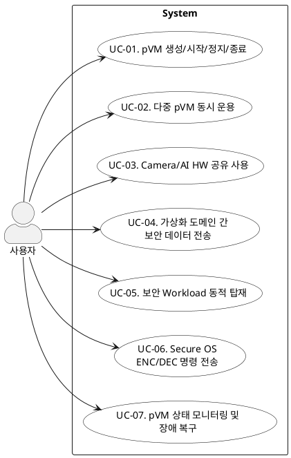

# Use Case 명세

> 본 문서는 기능 요구사항을 기반으로 Secure Vision AI Platform의 유스케이스를 도출하고 PlantUML 다이어그램으로 표현한 것이다.

---

## 1. 액터

| 액터 | 설명 |
|---|---|
| 사용자 | pVM 기반 보안 플랫폼을 운용하는 주체 (로봇 앱 개발자, 시스템 운영자 등) |

---

## 2. Use Case 목록

| UC ID | Use Case | 설명 |
|---|---|---|
| UC-01 | pVM 생성/시작/정지/종료 | pVM의 전체 생명주기를 관리하고 자원을 할당/회수한다 |
| UC-02 | 다중 pVM 동시 운용 | Secure Camera, Secure AI 등 복수 pVM을 독립적으로 동시에 운용한다 |
| UC-03 | ISP/NPU 공유 사용 | ISP/NPU 하드웨어 가속을 Host와 pVM에서 동시에 사용한다 |
| UC-04 | 격리 도메인 간 보안 데이터 전송 | pVM↔pVM, pVM↔Host 간 데이터를 비신뢰 주체에 노출 없이 전달한다 |
| UC-05 | 보안 Workload 동적 탑재 | 펌웨어 재배포 없이 신규 보안 Workload를 pVM에 동적으로 탑재한다 |
| UC-06 | Secure OS ENC/DEC 명령 전송 | pVM 내 Secure OS에 암호화/복호화 명령을 전송한다 |
| UC-07 | pVM 모니터링 및 장애 복구 | pVM 상태를 모니터링하고 비정상 종료 시 자원을 안전 회수 후 재시작한다 |

---

## 3. Use Case 다이어그램 (PlantUML)

---

> 유즈케이스 명세는 [`01_use_case_spec.md`](01_use_case_spec.md) 참조

